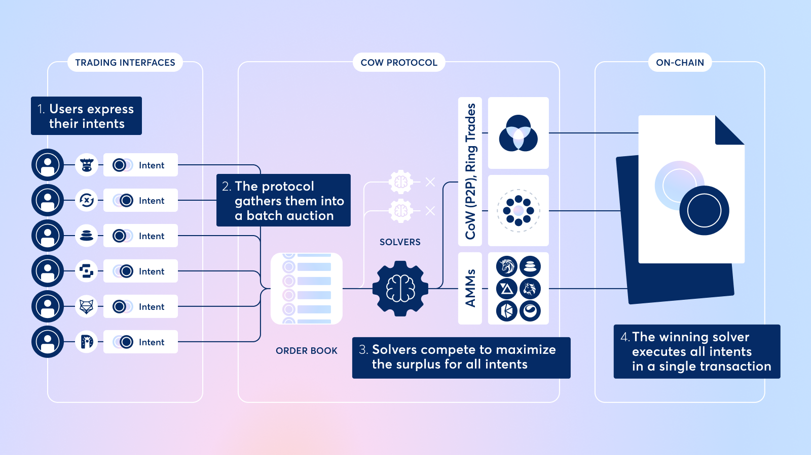
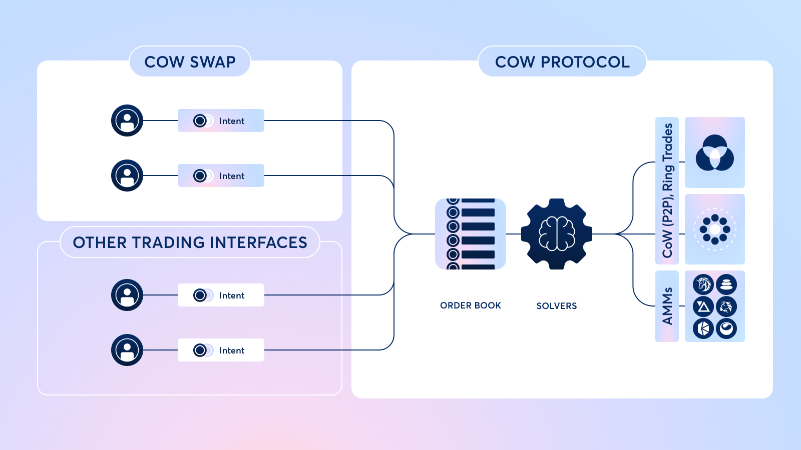

> This article is mainly taken from the [CoW documentation](https://docs.cow.fi/cow-protocol) with a few modification of my part.
> Cover photo by [Patrick Baum](https://unsplash.com/@gecko81de?utm_content=creditCopyText&utm_medium=referral&utm_source=unsplash) on [Unsplash](https://unsplash.com/photos/cattle-behind-fence-hB9vo06o9z8?utm_content=creditCopyText&utm_medium=referral&utm_source=unsplash)      

The CoW protocol is a meta-DEX aggregation protocol that  allows users to trade assets through signed messages (intents) instead of direct on-chain transaction to save gas, find optimal prices and protect orders from MEV (sandwich attacks, front-running).

For that, intents are grouped into batch auctions submitted to third parties known as "[solvers](https://docs.cow.fi/cow-protocol/concepts/introduction/solvers)" to find the best execution

**Solvers**

The protocol relies on third parties known as "[solvers](https://docs.cow.fi/cow-protocol/concepts/introduction/solvers)" to find the best execution paths for trade intents.

**Intents**

Intents are signed messages that specify conditions for executing transaction on Ethereum and EVM-compatible chains.

**Workflow**

The basic workflow is the following:

1. Upon first receiving a user intent, the protocol groups it alongside other intents in a [batch](https://docs.cow.fi/cow-protocol/concepts/introduction/batch-auctions). 

2. When executing trade intents, solvers first try to find a [*Coincidence of Wants (CoW)*](https://docs.cow.fi/cow-protocol/concepts/how-it-works/coincidence-of-wants) within the existing batch to offer an optimal price over any on-chain liquidity. 

3. If the protocol does not find a CoW, the solvers search all available on-chain and off-chain liquidity to find the best price for a set of trade intents within a batch. 

   Liquidity sources include:

- AMMs (e.g. Uniswap, Sushiswap, Balancer, Curve, etc.)
- DEX Aggregators (e.g. 1inch, Paraswap, Matcha, etc.)
- Private Market Makers

## Main concepts

### Intents

In the case of a traditional AMM such as Uniswap or Sushi swap, users place orders by ***signing a raw transaction*** that executes directly on-chain.

In the case of CoW Protocol users place orders by ***signing an "intent to trade" message*** that specifies parameters like the assets and amounts they would like to trade. 

The intent is a signed message which allows the solvers to execute a trade on behalf of the user using their specified assets and amounts.

There are a number of [financial](https://docs.cow.fi/cow-protocol/concepts/introduction/intents#financial-benefits-of-intents) and [technical](https://docs.cow.fi/cow-protocol/concepts/introduction/intents#technical-benefits-of-intents) advantages to intent-based trading.

### Solvers

Solvers are bonded third parties that execute trades on behalf of users through an [intent-based delegated execution model](https://docs.cow.fi/cow-protocol/concepts/introduction/intents).

1. Once a user submits an [intent](https://docs.cow.fi/cow-protocol/concepts/introduction/intents), the protocol groups it alongside other intents in a batch auction. 
2. As soon as a batch is "closed for orders", meaning that it stops considering new orders, the protocol runs a [competition](https://docs.cow.fi/cow-protocol/reference/core/auctions) where solvers submit solutions for the intents in the batch.
3. Whichever solver offers the best [solution](https://docs.cow.fi/cow-protocol/reference/core/auctions/the-problem#solution) for the batch auction (defined as the solver that provides the most surplus to user orders) gets to execute the orders.

Solvers are compensated in COW tokens for settling batches, incentivizing them to compete to find better prices and win the right to execute user intents.

### Batch auctions

CoW Protocol collects and aggregates [intents](https://docs.cow.fi/cow-protocol/concepts/introduction/intents) off-chain and settles them together in groups, known as *batches*. 

These batches are then "auctioned off" through a competition to the [solver](https://docs.cow.fi/cow-protocol/concepts/introduction/solvers) offering the most surplus for the orders in the batch.

### Benefits

Batch auctions provide several benefits:

#### MEV protection

Batch auctions allow for Uniform Clearing Prices (UCPs), where an asset that appears multiple times across orders in the same batch settles for a consistent price. This makes transaction order irrelevant within the block, undermining the ability for MEV bots to extract value.

See [docs.cow - MEV-protection](https://docs.cow.fi/cow-protocol/concepts/benefits/mev-protection)

#### Coincidence of Wants (CoW)

When multiple orders trade the same assets within a batch, there may be an opportunity for a peer-to-peer swap that doesn't tap on-chain liquidity. The mechanism of Coincidence of Wants (CoW) relies on batch auctions.

See [docs.cow - CoW](https://docs.cow.fi/cow-protocol/concepts/how-it-works/coincidence-of-wants)

#### Ethereum Best Bid Offer (EBBO)

Enforcing the [Ethereum Best Bid Offer (EBBO)](): Ensuring that the settlement solution is at least as good as the on-chain price a user could get directly from an AMM.

See [docs.cow - goverance](https://docs.cow.fi/cow-protocol/reference/core/auctions/competition-rules#governance)

## Flow of an order

Rather than creating executable on-chain transactions, CoW Protocol users submit their orders as signed [*intent to trade*](https://docs.cow.fi/cow-protocol/concepts/introduction/intents) messages. This allows [solvers](https://docs.cow.fi/cow-protocol/concepts/introduction/solvers) to find the optimal execution path for the batch of orders before committing them on-chain.

There are 4 main steps to an order on CoW Protocol:

1. Users express their trade intents by signing messages that specify the assets and amounts they want to trade, alongside other parameters.
2. The protocol gathers the intents of multiple users into a [batch auction](https://docs.cow.fi/cow-protocol/concepts/introduction/batch-auctions).
3. Solvers have a set amount of time to propose settlements for the batch. The solver that is able to generate the highest amount of surplus for the batch is declared the winner.
4. The winning solver submits the batch transaction on-chain on behalf of the users.

Once the winning solver executes the batch's orders on-chain, users receive their tokens.

### Advantage

- Best price through competition

The competition between solvers in a batch auction ensures that users (including traders, DAOs, smart contracts, and bots) always receive the best prices for their trades.

- Ease for users

Letting solvers do the heavy lifting means users don't have to worry about finding the best liquidity pool, setting the right gas price, or picking the optimal slippage tolerance for their trades. 

- Avoid MEV

Solvers are also experts at avoiding MEV so users can rest assured their orders are protected from MEV bots that exploit their price through frontrunning and sandwich attacks.

## Coincidence of Wants

**CoW (Coincidence of Wants)**: An economic phenomenon where two parties - each holding the asset that the other needs - exchange assets directly in an equivalent barter. 

Thanks to CoW Protocol's batching mechanism, users can make peer-to-peer swaps in cases where they're trading the same assets.

- Avoid  liquidity provider fees and reduce gas fees .

For example, if one trader in a batch wants to sell $2,000$ of DAI for $0.5 ~ETH$ and another trader in the same batch wants to sell $0.5 ~ETH$ for $2,000 ~DAI$, CoW Protocol's solvers will match both traders together so they can swap assets without tapping into on-chain liquidity - saving them from incurring liquidity provider fees.

CoWs allow users to bypass liquidity provider (LP) fees and also reduce gas fees since orders only interact with CoW Protocol's smart contracts.

- Partial or full CoWs

CoWs can be full or partial. In a partial CoW, only one of the trades in a batch is completely filled with opposing liquidity, and solvers must source liquidity to fill the rest of the other trade.

# CoW Protocol vs. CoW Swap

While the two are intertwined, there are important differences between CoW Protocol and CoW Swap.

CoW Swap was the first trading interface built on top of CoW Protocol and is currently the most popular way for users to trade with CoW Protocol.

Other trading apps and dApps, like Balancer, have also integrated CoW Protocol natively within their trading interfaces and advanced traders often place trades directly through the protocol.

The UI of CoW Swap includes some unique features, such as:

- Wallet history
- User token balances
- Games
- The legendary "Moo" sound
- Fortune cookies

CoW Swap works with many popular wallets, including [Rabby](https://rabby.io/), [MetaMask](https://metamask.io/), [Trust Wallet](https://trustwallet.com/), [Safe](https://safe.global/), [Trezor](https://trezor.io/), [Ledger](https://www.ledger.com/), and any wallet supporting [WalletConnect v2](https://walletconnect.com/).

## Further reading

### Article

- [CoW Swap: Intents, MEV, and Batch Auctions](https://www.shoal.gg/p/cow-swap-intents-mev-and-batch-auctions?utm_source=cow.fi&utm_medium=web&utm_content=media-CoW%20Swap%3A%20Intents%2C%20MEV%2C%20and%20Batch%20Auctions)

### Video

- [CoW 🛠️ How to Add Pre & Post Interactions to your Swaps](https://www.youtube.com/watch?v=6WqU-iL2sds)
- [Cow Swap: Gasless Transactions, MEV Protection, The BEST Prices & It Goes MOOOOO ](https://www.youtube.com/watch?v=MiB2J6da2CE)
- [ETHGlobal - EIP-1271 Explained](https://www.youtube.com/watch?v=6zj0_E8JWPQ)