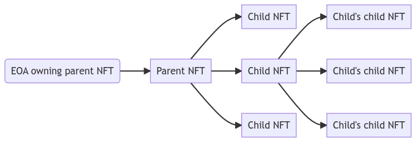

Non-Fungible Tokens (NFTs) enable unique, verifiable ownership of digital and real-world items on the blockchain. The Ethereum network pioneered this movement through its robust and flexible smart contract standards. 

While ERC-721 remains the main standard to represent NFTs, several other standards (ERC-1155, ERC-2981, ERC-4907,...) have emerged to meet various use cases and improve functionality. This article lists the different standards to represent NFT and their extensions on Ethereum.

[TOC]

----

## Summary: Ethereum NFT Standards

The different NFT standards extends the possibility to create NFT and use it:

- either by defining a new and separate token standard different from ERC-721: ERC-1155
- or by extending ERC-721 with new functionalities (ERC-2981, ERC-4907)
- or by proposing a new way to implement it (ERC-721A, ERC-404)

All these standard show that Ethereum is a real sandbox to build innovative applications.

Here a list of use case and their corresponding standards:

Independent token standard:

- Multi-token standard (fungible + NFTs): [ERC-1155](https://eips.ethereum.org/EIPS/eip-1155)
- Fractionally Represented Non-Fungible Token ([ERC-7651](https://eips.ethereum.org/EIPS/eip-7651))
- Minimal Multi-Token Interface: [ERC-6909](https://eips.ethereum.org/EIPS/eip-6909)

ERC-721 extensions or compatible

- Semi-Fungible tokens: [ERC-3525](https://eips.ethereum.org/EIPS/eip-3525): 
- Royalty payment: [ERC-2771](https://eips.ethereum.org/EIPS/eip-2771)
- Extendable NFT metadata protocol: [ERC-3664](https://github.com/DRepublic-io/EIPs/blob/master/EIPS/eip-3664.md)
- Rentable NFTs: [ERC-4907](https://eips.ethereum.org/EIPS/eip-4907)
- Non-transferable NFT: [ERC-5192](https://eips.ethereum.org/EIPS/eip-5192)
- Multi-privilege Management NFT Extension: [ERC-5496](https://eips.ethereum.org/EIPS/eip-5496)
- Custom errors for commonly-used tokens: [ERC-6093](https://eips.ethereum.org/EIPS/eip-6093)
- Token-bound accounts for NFTs: [ERC-6551](https://eips.ethereum.org/EIPS/eip-6551)
- ERC-20/ERC-721 pair:
  - Dual Nature Token Pair (DN-404): [ERC-7631](https://eips.ethereum.org/EIPS/eip-7631)
  - Fractionally Represented Non-Fungible Token: ERC-7651

- Soulbound NFT: 
  - Soulbound Badge: [ERC-5114](https://eips.ethereum.org/EIPS/eip-5114)
  - Minimal Soulbound NFTs: [ERC-5192](https://eips.ethereum.org/EIPS/eip-5192)
  - Consensual Soulbound Tokens: [ERC-5484](https://eips.ethereum.org/EIPS/eip-5484)

- Composable NFT: 
  - Context-Dependent Multi-Asset Token: [ERC-5773](https://eips.ethereum.org/EIPS/eip-5773)
  - Parent-Governed Nestable Non-Fungible Tokens: [ERC-6059](https://eips.ethereum.org/EIPS/eip-6059),
  - Composable NFTs utilizing Equippable Parts: [ERC-6220](https://eips.ethereum.org/EIPS/eip-6220)


Specific implementation:
- Gas optimized NFTs: [ERC-721A](https://www.erc721a.org)
- [ERC-404](https://github.com/Pandora-Labs-Org/erc404)

### Mindmap


Made with the help of ChatGPT and [PlantUML](https://www.plantuml.com)

### Table

| **Standard**                                                 | Status    | Key feature                                                  | ERC-721 extension (or compatible) | OpenZeppelinV5 impl                                          | [ERC-165 ID](https://eips.ethereum.org/EIPS/eip-165)         | **Description**                                              | Primary Use Cases                                            | Protocol Use                                                 |
| ------------------------------------------------------------ | --------- | ------------------------------------------------------------ | --------------------------------- | ------------------------------------------------------------ | ------------------------------------------------------------ | ------------------------------------------------------------ | ------------------------------------------------------------ | ------------------------------------------------------------ |
| [**ERC-721**](https://eips.ethereum.org/EIPS/eip-721)<br />(2018) | Final     | Uniqueness and ownership tracking.                           | -                                 | ☑<br />[doc](https://docs.openzeppelin.com/contracts/5.x/erc721) | 0x80ac58cd                                                   | The original NFT standard.                                   | Digital art, gaming, collectibles, Liquidity position (see Uniswap) | [OpenSea](https://docs.opensea.io/docs/metadata-standards), [LooksRare](https://docs.looksrare.org/about/welcome-to-looksrare), Rarible,<br />[Uniswap v3/v4](https://docs.uniswap.org/contracts/v4/quickstart/manage-liquidity/mint-position) |
| [ERC-721A](https://www.erc721a.org)                          | ☒         | Efficient batch minting.                                     | ☑                                 | ☒                                                            | Same as ERC-721                                              | Gas-optimized ERC-721 implementation.                        | High-volume NFT minting (PFP collections).                   | [Azuki](https://www.azuki.com/en/erc721a)                    |
| [**ERC-1155**](https://eips.ethereum.org/EIPS/eip-1155)<br />(2018) | Final     | Batch operations and lower gas costs.                        | ☒                                 | ☑<br />[doc](https://docs.openzeppelin.com/contracts/5.x/erc1155) | 0xd9b67a26                                                   | Multi-token standard (fungible + NFTs).                      | Gaming assets, batch transfers.                              | [OpenSea](https://docs.opensea.io/docs/metadata-standards)   |
| [ERC-998](https://eips.ethereum.org/EIPS/eip-998)<br />(2018) | Draft     | NFTs owning other tokens.                                    | ☑                                 | ☒                                                            | 0xcde244d9                                                   | Composable NFTs with nested ownership.                       | Asset bundling, complex ownership structures.                | [ZKPass](https://medium.com/zkpass/a-technical-overview-of-zkpass-protocol-e28303e472e9) |
| [**ERC-2981**](https://eips.ethereum.org/EIPS/eip-2981)<br />(2020) | Final     | Allow NFT marketplace to provide automatic royalty payouts.  | ☑<br />(also ERC-1155)            | ☑<br /><br />[doc](https://docs.openzeppelin.com/contracts/5.x/api/token/erc721#ERC721Royalty) | 0x2a55205a                                                   | Standardized royalty payments information for NFTs.<br />(don't force/guarantee payment for NFt creators) | Secondary sales royalties for creators.                      | NFT markplac-Eg:[LooksRare](https://docs.looksrare.org/developers/protocol/looksrare-v2-protocol-overview) |
| [**ERC-3525**](https://eips.ethereum.org/EIPS/eip-3525)<br />(2020) | Final     | Semi-Fungible tokens                                         | ☑                                 | ☒                                                            | 0xd5358140                                                   | Define Semi-Fungible tokens                                  | Monetary gifts, Certificates of deposit (CDs) and annuity, Debt instruments, Structured products | [Solv finance](https://github.com/solv-finance)              |
| [ERC-3664](https://github.com/DRepublic-io/EIPs/blob/master/EIPS/eip-3664.md)<br />(2022) | Draft     | Better descriptive power for attributes metadata with ERC-721 and ERC-1155 | ☑<br />(also ERC-1155)            | ☒                                                            | yes <br />but value unknown                                  | Extendable NFT metadata protocol                             | Game, metaverse                                              | [DRepublic Labs](https://github.com/DRepublic-io) (project abandoned) |
| [**ERC-4400**](https://eips.ethereum.org/EIPS/eip-4400)      | Final     | Add a consumer role that grants permissions for utilising/consuming a given NFT instance | ☑                                 | ☒                                                            | 0x953c8dfa                                                   | `consumer` role for instance(s) of [ERC-721](https://eips.ethereum.org/EIPS/eip-721) | Metaverses  with lend (renting), NFT-based yield-farming.    |                                                              |
| [**ERC-4906**](https://eips.ethereum.org/EIPS/eip-4906)<br />(2022) | Final     | Metadata tracking change                                     | ☑                                 | ☑<br /> [code]( https://github.com/OpenZeppelin/openzeppelin-contracts/blob/v5.2.0/contracts/token/ERC721/extensions/ERC721URIStorage.sol)<br />[doc](https://docs.openzeppelin.com/contracts/5.x/api/token/erc721#ERC721URIStorage) | 0x49064906                                                   | EIP-721 Metadata Update Extension                            | Allow third-party platforms  (e.g NFT marketplace) to track metadata change | -                                                            |
| [**ERC-4907**](https://eips.ethereum.org/EIPS/eip-4907)<br />(2022) | Final     | Temporary usage with expiration.                             | ☑                                 | ☒                                                            | 0xad092b5c                                                   | Rentable NFTs with usage rights.                             | Renting digital real estate, gaming assets.                  | [Double Protocol](https://double.one)<br />(nft rental protocol) |
| [**ERC-5192**](https://eips.ethereum.org/EIPS/eip-5192)<br />(2022) | Final     | Non-transferable NFT                                         | ☑                                 | ☒                                                            | 0xb45a3c0e                                                   | Define non-transferrable, non-fungible tokens                | award, certificate of achievement                            |                                                              |
| [**ERC-5496**](https://eips.ethereum.org/EIPS/eip-5496)<br />(2022) | Last Call | Linked privilege rights to an ERC-721 token                  | ☑                                 | ☒                                                            | 0x076e1bbb                                                   | Multi-privilege Management NFT Extension                     | Privileges use-case (voting rights, permission to claim airdrop, coupon discount) | -                                                            |
| [ERC-5773](https://eips.ethereum.org/EIPS/eip-5773)          | Final     | Context-Dependent Multi-Asset Token                          | ☑                                 | ☒                                                            | 0x06b4329a                                                   | Display the asset based on how the token is being accessed   | Cross-metaverse compatibility, Multi-media output, Media redundancy, NFT evolution | ?                                                            |
| [ERC-6059](https://eips.ethereum.org/EIPS/eip-6059)          | Final     | Parent-Governed Nestable NFT                                 | ☑                                 | ☒                                                            | 0x42b0e56f.                                                  | This proposal establishes the framework for the parent-child relationships of NFTs. | Bundling<br/>Collecting<br/>Membership<br/>Delegation        | ?                                                            |
| [ERC-6220](https://eips.ethereum.org/EIPS/eip-6220)          | Final     | Composable NFTs utilizing Equippable Parts                   | ☑                                 | ☒                                                            | 0x28bc9ae4                                                   | Equip other tokens and be composed from a set of available parts | Composing<br/>Token progression<br/>Merit tracking<br/>Provable Digital Scarcity | ?                                                            |
| [**ERC-6093**](https://eips.ethereum.org/EIPS/eip-6093)<br />(2023) | Last Call | Standardized errors                                          | ☑<br />(also ERC-1155 and ERC-20) | ☑<br />See [doc](https://docs.openzeppelin.com/contracts/5.x/api/interfaces#IERC721Errors) | ☒                                                            | Custom errors for commonly-used tokens                       | Standardized errors allow users to expect more consistent error messages across applications or testing environments, | OpenZeppelin                                                 |
| [ERC-6909](https://eips.ethereum.org/EIPS/eip-6909)<br />(2023) | Review    | Minimal Multi-Token Interface                                | ☒                                 | In dev.                                                      | 0x0f632fb3                                                   | Simplified token standard for Multi-Token                    | Simplified interface, Gas efficiency, Improved transfer delegation, reduce code size | [Uniswap V4](https://docs.uniswap.org/contracts/v4/guides/ERC-6909) |
| [**ERC-6551**](https://eips.ethereum.org/EIPS/eip-6551)<br />(2023) | Review    | NFTs acting as wallets.                                      | ☑                                 | ☒                                                            | 0x6faff5f1<br />(IERC6551Account)                            | Token-bound accounts for NFTs.                               | [automated investment portfolio](https://mundus.dev/blog/tpost/1t1euygmi1-eip-6551-overview-token-bounds-accounts) | [Virtual Protocol](https://whitepaper.virtuals.io/the-protocol/co-contribution-and-provenance/immutable-contribution-vault) |
| [ERC-7631](https://eips.ethereum.org/EIPS/eip-7631)<br />(DN-404) | Review    | Dual Nature Token Pair                                       | ☑<br />(also ERC-20)              | ☒                                                            | ☒<br /><br />(call specific method `mirrorERC721` and `baseERC20` instead) | Native ERC-721 fractionalization, wherein acquiring ERC-20 tokens leads to the automatic issuance of ERC-721 tokens, proportional to the ERC-20 balance | Gaming assets, metaverse, identity solutions                 | [DN-404](https://github.com/Vectorized/dn404)                |
| [ERC-7651](https://eips.ethereum.org/EIPS/eip-7651)<br />(ERC-404) | Draft     | fractionally Represented Non-Fungible Token                  | ☒                                 | ☒                                                            | yes <br />but value unknown                                  | Enables NFTs to coexist with an underlying fungible representation seamlessly, enhancing liquidity and access without dividing the NFT itself, or requiring an explicit conversion step. |                                                              | [Pandora ERC-404](https://www.pandora.build) ?               |


## Final Standard

### ERC-721: main standard for NFTs

> [EIP Reference](https://eips.ethereum.org/EIPS/eip-721)
>
> Status: final
>
> OpenZeppelin implementation: yes
>
> Other implementation: [solmate](https://github.com/transmissions11/solmate/blob/main/src/tokens/ERC721.sol)

The **ERC-721** standard was the first to introduce a blueprint for non-fungible tokens on Ethereum. Published in January 2018, ERC-721 defines NFTs as unique, indivisible assets that can be transferred and tracked on the Ethereum blockchain. Each token under this standard has a distinct ID, making it different from any other token.

For more details, you can read my article [ERC-721 (NFT) Overview: Implementation, Security, and Best Practices](https://rya-sge.github.io/access-denied/2025/03/03/erc721-overview/)

#### Key Features

- **Uniqueness:** Each token is unique and distinguishable by its ID.
- **Transferability:** Tokens can be transferred between accounts.
- **Ownership Tracking:** Ownership history is immutably recorded on-chain.
- **Interoperability:** main interface to represent NFT, supported by many wallets, NFT marketplaces, and exchanges.
- Additional information (symbol, name, URI) can be linkted to the NFT through the optional metadata extension

#### Main functions

```solidity
/// @notice Count all NFTs assigned to an owner
function balanceOf(address _owner) external view returns (uint256);

/// @notice Find the owner of an NFT
 function ownerOf(uint256 _tokenId) external view returns (address);

 /// @notice Transfers the ownership of an NFT from one address to another address
 function safeTransferFrom(address _from, address _to, uint256 _tokenId, bytes data) external payable;

 /// @notice Transfers the ownership of an NFT from one address to another address
 function safeTransferFrom(address _from, address _to, uint256 _tokenId) external payable;

 /// @notice Transfer ownership of an NFT
 function transferFrom(address _from, address _to, uint256 _tokenId) external payable;

 /// @notice Change or reaffirm the approved address for an NFT
 function approve(address _approved, uint256 _tokenId) external payable;

 /// @notice Enable or disable approval for a third party ("operator") to manage
 ///  all of `msg.sender`'s assets
 function setApprovalForAll(address _operator, bool _approved) external;

 /// @notice Get the approved address for a single NFT
  function getApproved(uint256 _tokenId) external view returns (address);

 /// @notice Query if an address is an authorized operator for another address
 function isApprovedForAll(address _owner, address _operator) external view returns (bool);
}
```

##### Metadata extension

The **metadata extension** is OPTIONAL for ERC-721 smart contracts. This allows your smart contract to be interrogated for its name and for details about the assets which your NFTs represent.

```solidity
/// @title ERC-721 Non-Fungible Token Standard, optional metadata extension
/// @dev See https://eips.ethereum.org/EIPS/eip-721
///  Note: the ERC-165 identifier for this interface is 0x5b5e139f.
interface ERC721Metadata /* is ERC721 */ {
    /// @notice A descriptive name for a collection of NFTs in this contract
    function name() external view returns (string _name);

    /// @notice An abbreviated name for NFTs in this contract
    function symbol() external view returns (string _symbol);

    /// @notice A distinct Uniform Resource Identifier (URI) for a given asset.
    /// @dev Throws if `_tokenId` is not a valid NFT. URIs are defined in RFC
    ///  3986. The URI may point to a JSON file that conforms to the "ERC721
    ///  Metadata JSON Schema".
    function tokenURI(uint256 _tokenId) external view returns (string);
}
```


#### Use Cases

- **Digital Art and collectibles:** 
  - Platforms like OpenSea and Rarible use ERC-721 for trading unique art piece
  - Ex: [CryptoKitties](https://www.cryptokitties.co), the first major NFT project, uses this standard to create unique digital cats.

- **Gaming:** In-game items like skins, weapons, or avatars can be represented as ERC-721 NFTs.
- **LP position**: Uniswap v3 and v4 uses ERC-721 to represent LP positions. These NFTs store all of the data for the liquidity position. See [Uniswap support - Why is liquidity position ownership represented by tokens or NFTs?](https://support.uniswap.org/hc/en-us/articles/20980786685069-Why-is-liquidity-position-ownership-represented-by-tokens-or-NFTs), [Uniswap v3 book - Overview of ERC-721](https://uniswapv3book.com/milestone_6/erc721-overview.html), [Uniswap v3 - NFT manager contract]( https://uniswapv3book.com/milestone_6/nft-manager.html)

#### Extension

These extensions add several functionalities to the standard ERC-721

##### ERC-2309: ERC-721 Consecutive Transfer Extension

> Status: final
>
> OpenZeppelin implementation: yes
>
> Also implemented by [ERC-721A](https://github.com/chiru-labs/ERC721A/blob/6f8a82a7b2833ad8b2fc7b54349281143a731fdd/contracts/ERC721A.sol#L884) (Azuki)
>
> [ERC specification](https://eips.ethereum.org/EIPS/eip-2309), [ethereum magicians](https://github.com/ethereum/EIPs/issues/2309)

A standardized event emitted when creating/transferring one, or many non-fungible tokens using consecutive token identifiers.

The optional ERC-721 Consecutive Transfer Extension provides a standardized event which could be emitted during the creation/transfer of one, or many non-fungible tokens. 

This standard does not set the expectation of how you might create/transfer many tokens it is only concerned with the event emitted after the creation, or transfer of ownership of these tokens. 

This extension assumes that token identifiers are in consecutive order.

###### Motivation

This extension provides even more scalibility of the [ERC-721 specification](https://eips.ethereum.org/EIPS/eip-721). It is possible to create, transfer, and burn 2^256 non-fungible tokens in one transaction. However, it is not possible to emit that many `Transfer` events in one transaction. The `Transfer` event is part of the original specification which states:

> ##### This emits when ownership of any NFT changes by any mechanism. This event emits when NFTs are created (`from` == 0) and destroyed (`to` == 0). Exception: during contract creation, any number of NFTs may be created and assigned without emitting Transfer. At the time of any transfer, the approved address for that NFT (if any) is reset to none.

This allows for the original `Transfer` event to be emitted for one token at a time, which in turn gives us O(n) time complexity. Minting one billion NFTs can be done in one transaction using efficient data structures, but in order to emit the `Transfer` event - according to the original spec - one would need a loop with one billion iterations which is bound to run out of gas, or exceed transaction timeout limits. This cannot be accomplished with the current spec. This extension solves that problem.

Comment from the author in this article from [coincentral](https://coincentral.com/cargo-nft-ethereum/) (2020)

> Cargo is the only platform that allows users to deploy smart contracts which enable them to create an infinite amount of NFTs in one transaction for the same cost as creating one NFT on other platforms. ERC-2309, an open standard on Ethereum that makes this possible, was spearheaded by myself because I realized early on that to scale NFTs we’d need a way to create and transfer large amounts at one time for a price that worked. 

###### Specification

Add a single events, emits during the contract creation in case of batch transfer.

```solidity
event ConsecutiveTransfer(uint256 indexed fromTokenId, uint256 toTokenId, address indexed fromAddress, address indexed toAddress);
```

##### ERC-4906: EIP-721 Metadata Update Extension

> [EIP reference](https://eips.ethereum.org/EIPS/eip-4906)
>
> Status: final
>
> OpenZeppelin implementation: yes

This standard is an extension of [EIP-721](https://eips.ethereum.org/EIPS/eip-721). It adds a `MetadataUpdate` event to EIP-721 tokens.

```solidity
/// @title EIP-721 Metadata Update Extension
interface IERC4906 is IERC165, IERC721 {
    /// @dev This event emits when the metadata of a token is changed.
    /// So that the third-party platforms such as NFT market could
    /// timely update the images and related attributes of the NFT.
    event MetadataUpdate(uint256 _tokenId);

    /// @dev This event emits when the metadata of a range of tokens is changed.
    /// So that the third-party platforms such as NFT market could
    /// timely update the images and related attributes of the NFTs.    
    event BatchMetadataUpdate(uint256 _fromTokenId, uint256 _toTokenId);
}
```

##### ERC-6093: Custom errors for commonly-used tokens

> [EIP reference](https://eips.ethereum.org/EIPS/eip-4906)
>
> Status: last call
>
> OpenZeppelin implementation: yes

This EIP defines a standard set of custom errors for commonly-used tokens, which are defined as [ERC-20](https://eips.ethereum.org/EIPS/eip-20), [ERC-721](https://eips.ethereum.org/EIPS/eip-721), and [ERC-1155](https://eips.ethereum.org/EIPS/eip-1155) tokens.

See also [OpenZeppelin - interfaces/draft-IERC6093.sol](https://github.com/OpenZeppelin/openzeppelin-contracts/blob/v5.1.0/contracts/interfaces/draft-IERC6093.sol)

```solidity
/**
* @dev Indicates that an address can't be an owner. For example, `address(0)` is a forbidden owner in ERC-20.
* Used in balance queries.
*/
error ERC721InvalidOwner(address owner);

/**
* @dev Indicates a `tokenId` whose `owner` is the zero address.
*/
error ERC721NonexistentToken(uint256 tokenId);

/**
* @dev Indicates an error related to the ownership over a particular token. Used in transfers.
*/
error ERC721IncorrectOwner(address sender, uint256 tokenId, address owner);

/**
* @dev Indicates a failure with the token `sender`. Used in transfers.
*/
error ERC721InvalidSender(address sender);

/**
* @dev Indicates a failure with the token `receiver`. Used in transfers.
*/
error ERC721InvalidReceiver(address receiver);

/**
* @dev Indicates a failure with the `operator`’s approval. Used in transfers.
*/
error ERC721InsufficientApproval(address operator, uint256 tokenId);

/**
* @dev Indicates a failure with the `approver` of a token to be approved. Used in approvals.
*/
error ERC721InvalidApprover(address approver);

/**
* @dev Indicates a failure with the `operator` to be approved. Used in approvals.
*/
error ERC721InvalidOperator(address operator);

```

------

### ERC-1155: Multi-Token Standard

> [EIP Reference](https://eips.ethereum.org/EIPS/eip-1155)
>
> Status: final
>
> OpenZeppelin implementation: yes
>
> Other implementation: [solmate](https://github.com/transmissions11/solmate/blob/main/src/tokens/ERC1155.sol)

ERC-1155, also known as the "multi-token standard," was introduced by [Enjin](https://enjin.io/blog/erc-1155-token-standard-ethereum) (Witek Radomski) in 2018. It enables the creation of **fungible, semi-fungible, and non-fungible tokens** within a single contract. This significantly reduces gas fees and enhances efficiency.

**Key Features:**

- **Batch Transfers:** Multiple tokens can be transferred in a single transaction.
- **Lower Costs:** Reduced gas fees by optimizing token operations.
- **Flexibility:** Supports fungible (e.g., in-game currency) and non-fungible (e.g., unique items) assets.
- Note that contrary to [ERC-1400](https://github.com/ethereum/EIPs/issues/1411) and [ERC-3525](https://eips.ethereum.org/EIPS/eip-3525), you don't have a decimal field attached to a specific token. Therefore you can have several amount of a specific token, represented by its tokenId, but from the outside, it will be a whole number.

#### Main functions

```solidity
///@notice Transfers `_value` amount of an `_id` from the `_from` address to the `_to` address specified (with safety call).
 function safeTransferFrom(address _from, address _to, uint256 _id, uint256 _value, bytes calldata _data) external;
 
/// @notice Transfers `_values` amount(s) of `_ids` from the `_from` address to the `_to` address specified (with safety call).      
 function safeBatchTransferFrom(address _from, address _to, uint256[] calldata _ids, uint256[] calldata _values, bytes calldata _data) external;

 /// @notice Get the balance of an account's tokens.
 function balanceOf(address _owner, uint256 _id) external view returns (uint256);

/// @notice Get the balance of multiple account/token pairs
function balanceOfBatch(address[] calldata _owners, uint256[] calldata _ids) external view returns (uint256[] memory);

/// @notice Enable or disable approval for a third party ("operator") to manage all of the caller's tokens.
function setApprovalForAll(address _operator, bool _approved) external;

/// @notice Queries the approval status of an operator for a given owner.
function isApprovedForAll(address _owner, address _operator) external view returns (bool);
```

**Popular Use Cases:**

- Gaming assets like weapons and currencies.
- Collectibles where multiple items share a similar design but with variations.

#### ERC-6093: Custom errors for commonly-used tokens

> [EIP reference](https://eips.ethereum.org/EIPS/eip-4906)
>
> Status: last call
>
> OpenZeppelin implementation: yes

This EIP defines a standard set of custom errors for commonly-used tokens, which are defined as [ERC-20](https://eips.ethereum.org/EIPS/eip-20), [ERC-721](https://eips.ethereum.org/EIPS/eip-721), and [ERC-1155](https://eips.ethereum.org/EIPS/eip-1155) tokens.

See also [OpenZeppelin - interfaces/draft-IERC6093.sol](https://github.com/OpenZeppelin/openzeppelin-contracts/blob/v5.1.0/contracts/interfaces/draft-IERC6093.sol)

------

### ERC-2981: Royalty Standard (ERC-721/1155 ext)

> [EIP Reference](https://eips.ethereum.org/EIPS/eip-2981)
>
> Status: final
>
> OpenZeppelin implementation: yes

ERC-2981 standardizes royalty payments for NFTs, allowing creators to automatically receive a percentage of sales whenever their NFT is resold on a secondary marketplace.

This standard allows contracts, such as NFTs that support [ERC-721](https://eips.ethereum.org/EIPS/eip-721) and [ERC-1155](https://eips.ethereum.org/EIPS/eip-1155) interfaces, to signal a royalty amount to be paid to the NFT creator or rights holder every time the NFT is sold or re-sold. This is intended for NFT marketplaces that want to support the ongoing funding of artists and other NFT creators. The royalty payment must be voluntary, as transfer mechanisms such as `transferFrom()` include NFT transfers between wallets, and executing them does not always imply a sale occurred. Marketplaces and individuals implement this standard by retrieving the royalty payment information with `royaltyInfo()`, which specifies how much to pay to which address for a given sale price. The exact mechanism for paying and notifying the recipient will be defined in future EIPs. This ERC should be considered a minimal, gas-efficient building block for further innovation in NFT royalty payments.

**Key Features:**

- **Creator Royalties:** Allows creators earn passive income from secondary sales.
- **Interoperability:** Works seamlessly across marketplaces that implement the standard.

**Popular Use Cases:**

- Artists earning royalties on every resale of their digital artwork.
- Content creators ensuring revenue from their creations.

#### Main functions

```solidity
/// @notice Called with the sale price to determine how much royalty is owed and to whom.
function royaltyInfo(
        uint256 _tokenId,
        uint256 _salePrice
    ) external view returns (
        address receiver,
        uint256 royaltyAmount
    );
```

------

### ERC-3525: Semi-Fungible tokens (ERC-721 ext)

> Status: final
>
> OpenZeppelin implementation: no, see [https://forum.openzeppelin.com/t/plans-to-adopt-erc3525-semi-fungible-tokens-sfts/33522](https://forum.openzeppelin.com/t/plans-to-adopt-erc3525-semi-fungible-tokens-sfts/33522)
>
> [ERC specification](https://eips.ethereum.org/EIPS/eip-3525), [implementation example](https://github.com/solv-finance/erc-3525), [ethereum magicians](https://ethereum-magicians.org/t/eip-3525-the-semi-fungible-token/9770)

This standard defines semi-fungible tokens, compatible with [ERC-721](https://eips.ethereum.org/EIPS/eip-721) standard. 

This standard introduces an `<ID, SLOT, VALUE>` triple scalar model that represents the semi-fungible structure of a token. It also introduces new transfer models as well as approval models that reflect the semi-fungible nature of the tokens.

- Token contains an ERC-721 equivalent **ID property** to identify itself as a universally unique entity, so that the tokens can be transferred between addresses and approved to be operated in ERC-721 compatible way.
- Token also contains a `value` property, representing the quantitative nature of the token. The meaning of the ‘value’ property is quite like that of the ‘balance’ property of an [ERC-20](https://eips.ethereum.org/EIPS/eip-20) token. Each token has a ‘slot’ attribute, ensuring that the value of two tokens with the same slot be treated as fungible, adding fungibility to the value property of the tokens.
- This EIP introduces new token transfer models for semi-fungibility, including value transfer between two tokens of the same slot and value transfer from a token to an address.
- Difference with ERC-1155: 
  - If you have a ERC1155 token with a balance of 10, you have 10 identical items; 
  - while it is a ERC3525 token with a value of 10, you have one item with face value of 10.
  - With ERC-3525, TokenID is universally unique, as which in ERC721.


#### Main functions

```solidity
    /**
     * @notice Get the number of decimals the token uses for value - e.g. 6, means the user
     *  representation of the value of a token can be calculated by dividing it by 1,000,000.
     *  Considering the compatibility with third-party wallets, this function is defined as
     *  `valueDecimals()` instead of `decimals()` to avoid conflict with ERC-20 tokens.
     * @return The number of decimals for value
     */
    function valueDecimals() external view returns (uint8);

    /**
     * @notice Get the value of a token.
     * @param _tokenId The token for which to query the balance
     * @return The value of `_tokenId`
     */
    function balanceOf(uint256 _tokenId) external view returns (uint256);

    /**
     * @notice Get the slot of a token.
     * @param _tokenId The identifier for a token
     * @return The slot of the token
     */
    function slotOf(uint256 _tokenId) external view returns (uint256);

    /**
     * @notice Allow an operator to manage the value of a token, up to the `_value`.
     */
    function approve(
        uint256 _tokenId,
        address _operator,
        uint256 _value
    ) external payable;

    /**
     * @notice Get the maximum value of a token that an operator is allowed to manage.
     */
    function allowance(uint256 _tokenId, address _operator) external view returns (uint256);

    /**
     * @notice Transfer value from a specified token to another specified token with the same slot.
     */
    function transferFrom(
        uint256 _fromTokenId,
        uint256 _toTokenId,
        uint256 _value
    ) external payable;


    /**
     * @notice Transfer value from a specified token to an address. The caller should confirm that
     *  `_to` is capable of receiving ERC-3525 tokens.
     * @return ID of the token which receives the transferred value
     */
    function transferFrom(
        uint256 _fromTokenId,
        address _to,
        uint256 _value
    ) external payable returns (uint256);
}
```


### ERC-4400: Consumable Extension (ERC-721 ext)

> Status: final
>
> OpenZeppelin implementation: no, 
>
> [ERC specification](https://eips.ethereum.org/EIPS/eip-4400), [Ethereum magicians](https://ethereum-magicians.org/t/erc-4400-erc-721-consumer-extension/7371)

This specification defines standard functions outlining a `consumer` role for instance(s) of [EIP-721](https://eips.ethereum.org/EIPS/eip-721). An implementation allows reading the current `consumer` for a given NFT (`tokenId`) along with a standardized event for when an `consumer` has changed. 

The proposal depends on and extends the existing [EIP-721](https://eips.ethereum.org/EIPS/eip-721).

#### Motivation

Many [EIP-721](https://eips.ethereum.org/EIPS/eip-721) contracts introduce their own custom role that grants permissions for utilising/consuming a given NFT instance. The need for that role stems from the fact that other than owning the NFT instance, there are other actions that can be performed on an NFT. For example, various metaverses use `operator` / `contributor` roles for Land (EIP-721), so that owners of the land can authorise other addresses to deploy scenes to them (f.e. commissioning a service company to develop a scene).

It is common for NFTs to have utility other than ownership. That being said, it requires a separate standardized consumer role, allowing compatibility with user interfaces and contracts, managing those contracts.

Example of kinds of contracts and applications that can benefit from this standard are:

- metaverses that have land and other types of digital assets in those metaverses (scene deployment on land, renting land / characters / clothes / passes to events etc.)
- NFT-based yield-farming. Adopting the standard enables the “staker” (owner of the NFT) to have access to the utility benefits even after transferring his NFT to the staking contract

#### Specification

```solidity
interface IEIP721Consumable /* is EIP721 */ {
    /// @notice Emitted when `owner` changes the `consumer` of an NFT
    event ConsumerChanged(address indexed owner, address indexed consumer, uint256 indexed tokenId);

    /// @notice Get the consumer address of an NFT
    function consumerOf(uint256 _tokenId) view external returns (address);

    /// @notice Change or reaffirm the consumer address for an NFT
    function changeConsumer(address _consumer, uint256 _tokenId) external;
}
```

----

### ERC-4907: Rentable NFTs (ERC-721 ext)

> [EC Reference](https://eips.ethereum.org/EIPS/eip-4907), [Ethereum magicians](https://ethereum-magicians.org/t/eip4907-erc-721-user-and-expires-extension/8572)
>
> Status: final
>
> OpenZeppelin implementation: no, see [this issue](https://github.com/OpenZeppelin/openzeppelin-contracts/issues/3735)
>
> Video details: [What is Double Protocol and how does it work? - Unlock the Liquidity of NFTs with ERC-490](https://www.youtube.com/watch?v=sZZ1JgtpcL4&t=183s)

ERC-4907 introduces the concept of "rentable NFTs." This standard allows NFTs to be rented for a specified time period without transferring full ownership.

This standard is an extension of [EIP-721](https://eips.ethereum.org/EIPS/eip-721). It proposes an additional role (`user`) which can be granted to addresses, and a time where the role is automatically revoked (`expires`). The `user` role represents permission to “use” the NFT, but not the ability to transfer it or set users.

**Key Features:**

- **Dual Roles:** Separates ownership (owner) and usage rights (user).
- **Automated Expiration:** Usage rights automatically expire after the rental period.
- **Use Case Focus:** Perfect for gaming, metaverse items, and digital real estate rentals.

**Popular Use Cases:**

- Renting in-game assets (e.g., rare weapons or avatars).
- Leasing virtual land in the metaverse for a specific time frame.

#### Main functions

```solidity
/// @notice set the user and expires of an NFT
function setUser(uint256 tokenId, address user, uint64 expires) external;

/// @notice Get the user address of an NFT
function userOf(uint256 tokenId) external view returns(address);

/// @notice Get the user expires of an NFT
function userExpires(uint256 tokenId) external view returns(uint256);
```


----

### ERC-5496: Multi-privilege Management NFT (ERC-721 ext.)

> Status: last call
>
> OpenZeppelin implementation: no
>
> [ERC specification](https://eips.ethereum.org/EIPS/eip-5496),[Example](https://github.com/wnft/wnft-contracts/blob/main/contracts/ERC5496/ERC5496.sol), [ethereum-magicians.org](https://ethereum-magicians.org/t/eip-5496-multi-privilege-management-extension-for-erc-721/10427)

This EIP defines an interface extending [EIP-721](https://eips.ethereum.org/EIPS/eip-721) to provide shareable multi-privileges for NFTs.

Privileges may be:

- on-chain: voting rights, permission to claim an airdrop
-  Off-chain: a coupon for an online store, a discount at a local restaurant, access to VIP lounges in airports.

Each NFT may contain many privileges, and the holder of a privilege can verifiably transfer that privilege to others. 

Privileges may be non-shareable or shareable. Shareable privileges can be cloned, with the provider able to adjust the details according to the spreading path. Expiration periods can also be set for each privilege.

#### Motivation

**ERC-721 limitation**

[EIP-721](https://eips.ethereum.org/EIPS/eip-721) only records the ownership and its transfer, the privileges of an NFT are not recorded on-chain. This extension would allow merchants/projects to give out a certain privilege to a specified group of people, and owners of the privileges can manage each one of the privileges independently. This facilitates a great possibility for NFTs to have real usefulness.

**Example**

For example, an airline company issues a series of [EIP-721](https://eips.ethereum.org/EIPS/eip-721)/[EIP-1155](https://eips.ethereum.org/EIPS/eip-1155) tokens to Crypto Punk holders to give them privileges, in order to attract them to join their club. However, since these tokens are not bound to the original NFT, if the original NFT is transferred, these privileges remain in the hands of the original holders, and the new holders cannot enjoy the privileges automatically. So, we propose a set of interfaces that can bind the privileges to the underlying NFT, while allowing users to manage the privileges independently.


#### Shareable priviliges

The number of privilege holders is limited by the number of NFTs if privileges are non-shareable. A shareable privilege means the original privilege holder can copy the privilege and give it to others, not transferring his/her own privilege to them. 

This mechanism greatly enhances the spread of privileges as well as the adoption of NFTs.

Example:

For example, a local pizza shop offers a 30% off Coupon and the owner of the shop encourages their consumers to share the coupon with friends, then the friends can get the coupon. Let’s say Tom gets 30% off Coupon from the shop and he shares the coupon with Alice. Alice gets the coupon too and Alice’s referrer is Tom. For some certain cases, Tom may get more rewards from the shop. This will help the merchants in spreading the promotion among consumers.

If the owner of the NFT transfers ownership to another user, there is no impact on “privileges”. But errors may occur if the owner tries to withdraw the original [EIP-721](https://eips.ethereum.org/EIPS/eip-721) token from the wrapped NFT through `unwrap()` if any available privileges are still ongoing. 

We protect the rights of holders of the privileges to check the last expiration date of the privilege.

```solidity
function unwrap(uint256 tokenId, address to) external {
    require(getBlockTimestamp() >= privilegeBook[tokenId].lastExpiresAt, "privilege not yet expired");

    require(ownerOf(tokenId) == msg.sender, "not owner");

    _burn(tokenId);

    IERC721(nft).transferFrom(address(this), to, tokenId);

    emit Unwrap(nft, tokenId, msg.sender, to);
}
```


#### Main functions

```solidity
/// @title multi-privilege extension for EIP-721
///  Note: the EIP-165 identifier for this interface is 0x076e1bbb
interface IERC5496{
    /// @notice set the privilege holder of a NFT.
    function setPrivilege(uint256 tokenId, uint256 privilegeId, address user, uint256 expires) external;

    /// @notice Return the expiry timestamp of a privilege
    function privilegeExpires(uint256 tokenId, uint256 privilegeId) external view returns(uint256);

    /// @notice Check if a user has a certain privilege
    function hasPrivilege(uint256 tokenId, uint256 privilegeId, address user) external view returns(bool);
}
```


### ERC-6909: Minimal Multi-Token Interface

>  Status: last call
>
>  OpenZeppelin implementation: yes, since version [v5.3.0-rc.0](https://github.com/OpenZeppelin/openzeppelin-contracts/releases/tag/v5.3.0-rc.0)
>
>  [ERC specification](https://eips.ethereum.org/EIPS/eip-6909), [Ethereum magician](https://ethereum-magicians.org/t/erc-6909-multi-token-standard/13891)
>
>  Other implementation: [solmate](https://github.com/transmissions11/solmate/blob/main/src/tokens/ERC6909.sol)

This standard specifies a multi-token contract as a simplified alternative to the [ERC-1155](https://eips.ethereum.org/EIPS/eip-1155) Multi-Token Standard. 

#### Difference with ERC-1155

In contrast to ERC-1155, callbacks and batching have been removed from the interface and the permission system is a hybrid operator-approval scheme for granular and scalable permissions. Functionally, the interface has been reduced to the bare minimum required to manage multiple tokens under the same contract.

According to [Uniswap doc](https://docs.uniswap.org/contracts/v4/concepts/erc6909):

ERC-6909 offers several advantages over ERC-1155:

1. Simplified interface: ERC-6909 removes unnecessary safe transfer callbacks and batching constraints presented in ERC-1155.
2. Improved transfer delegation: ERC-6909 provides a more efficient system for transfer delegation.
3. Gas efficiency: ERC-6909 reduces gas costs for deployment, transfers, and burning operations.
4. Reduced code size: Implementing ERC-6909 results in smaller contract sizes compared to ERC-1155.

However, it's worth noting that ERC-6909 does introduce a `totalSupply` variable, which leads to an additional disk write on mint and burn operations.

#### Method

From [OpenZeppelin  - draft-IERC6909.sol](https://github.com/OpenZeppelin/openzeppelin-contracts/blob/5a5867e548d2501c8c9aaeba69afec93ced8ff0c/contracts/interfaces/draft-IERC6909.sol)

```solidity
 /**
     * @dev Returns the amount of tokens of type `id` owned by `owner`.
     */
    function balanceOf(address owner, uint256 id) external view returns (uint256);

    /**
     * @dev Returns the amount of tokens of type `id` that `spender` is allowed to spend on behalf of `owner`.
     *
     * NOTE: Does not include operator allowances.
     */
    function allowance(address owner, address spender, uint256 id) external view returns (uint256);

    /**
     * @dev Returns true if `spender` is set as an operator for `owner`.
     */
    function isOperator(address owner, address spender) external view returns (bool);

    /**
     * @dev Sets an approval to `spender` for `amount` tokens of type `id` from the caller's tokens.
     *
     * Must return true.
     */
    function approve(address spender, uint256 id, uint256 amount) external returns (bool);

    /**
     * @dev Grants or revokes unlimited transfer permission of any token id to `spender` for the caller's tokens.
     *
     * Must return true.
     */
    function setOperator(address spender, bool approved) external returns (bool);

    /**
     * @dev Transfers `amount` of token type `id` from the caller's account to `receiver`.
     *
     * Must return true.
     */
    function transfer(address receiver, uint256 id, uint256 amount) external returns (bool);

    /**
     * @dev Transfers `amount` of token type `id` from `sender` to `receiver`.
     *
     * Must return true.
     */
    function transferFrom(address sender, address receiver, uint256 id, uint256 amount) external returns (bool);
}

```

### Composable NFTs (ERC-721 ext.)

#### ERC-5773: Context-Dependent Multi-Asset Tokens

> Status: final
>
> OpenZeppelin implementation: no
>
> [ERC specification](https://eips.ethereum.org/EIPS/eip-5773), [ethereum magicians](https://ethereum-magicians.org/t/eip-5773-context-dependent-multi-asset-tokens/11326)
>
> Requires: [EIP-165](https://eips.ethereum.org/EIPS/eip-165), [EIP-721](https://eips.ethereum.org/EIPS/eip-721)

An interface for Multi-Asset tokens with context dependent asset type output controlled by owner's preference.

The Multi-Asset NFT standard allows for the construction of a new primitive: context-dependent output of information per single NFT.

The context-dependent output of information means that the asset in an appropriate format is displayed based on how the token is being accessed. I.e. 

- if the token is being opened in an e-book reader, the PDF asset is displayed,
- if the token is opened in the marketplace, the PNG or the SVG asset is displayed, 
- if the token is accessed from within a game, the 3D model asset is accessed
- if the token is accessed by the (Internet of Things) IoT hub, the asset providing the necessary addressing and specification information is accessed.

An NFT can have multiple assets (outputs), which can be any kind of file to be served to the consumer, and orders them by priority. They do not have to match in mimetype or tokenURI, nor do they depend on one another. Assets are not standalone entities, but should be thought of as “namespaced tokenURIs” that can be ordered at will by the NFT owner, but only modified, updated, added, or removed if agreed on by both the owner of the token and the issuer of the token.

##### Main functions

```solidity
interface IERC5773 /* is ERC165 */ {
    /**
     * @notice Accepts an asset at from the pending array of given token.
     */
    function acceptAsset(
        uint256 tokenId,
        uint256 index,
        uint64 assetId
    ) external;

    /**
     * @notice Rejects an asset from the pending array of given token.
     */
    function rejectAsset(
        uint256 tokenId,
        uint256 index,
        uint64 assetId
    ) external;

    /**
     * @notice Rejects all assets from the pending array of a given token.
     */
    function rejectAllAssets(uint256 tokenId, uint256 maxRejections) external;

    /**
     * @notice Sets a new priority array for a given token.
     */
    function setPriority(uint256 tokenId, uint64[] calldata priorities)
        external;

    /**
     * @notice Used to retrieve IDs of the active assets of given token.
     */
    function getActiveAssets(uint256 tokenId)
        external
        view
        returns (uint64[] memory);

    /**
     * @notice Used to retrieve IDs of the pending assets of given token.
     */
    function getPendingAssets(uint256 tokenId)
        external
        view
        returns (uint64[] memory);

    /**
     * @notice Used to retrieve the priorities of the active assets of a given token.
     */
    function getActiveAssetPriorities(uint256 tokenId)
        external
        view
        returns (uint64[] memory);

    /**
     * @notice Used to retrieve the asset that will be replaced if a given asset from the token's pending array
     */
    function getAssetReplacements(uint256 tokenId, uint64 newAssetId)
        external
        view
        returns (uint64);

    /**
     * @notice Used to fetch the asset metadata of the specified token's active asset with the given index.
     */
    function getAssetMetadata(uint256 tokenId, uint64 assetId)
        external
        view
        returns (string memory);

    /**
     * @notice Used to grant permission to the user to manage token's assets.
     */
    function approveForAssets(address to, uint256 tokenId) external;

    /**
     * @notice Used to retrieve the address of the account approved to manage assets of a given token.
     */
    function getApprovedForAssets(uint256 tokenId)
        external
        view
        returns (address);

    /**
     * @notice Used to add or remove an operator of assets for the caller.
     */
    function setApprovalForAllForAssets(address operator, bool approved)
        external;

    /**
     * @notice Used to check whether the address has been granted the operator role by a given address or not.
    function isApprovedForAllForAssets(address owner, address operator)
        external
        view
        returns (bool);
}
```


#### ERC-6059: Parent-Governed Nestable Non-Fungible Tokens

> Status: final
>
> OpenZeppelin implementation: no
>
> [ERC specification](https://eips.ethereum.org/EIPS/eip-6059), [ethereum magicians](https://ethereum-magicians.org/t/eip-6059-parent-governed-nestable-non-fungible-tokens/11914)
>
> Requires: [EIP-165](https://eips.ethereum.org/EIPS/eip-165), [EIP-721](https://eips.ethereum.org/EIPS/eip-721)

The Parent-Governed Nestable NFT standard extends [ERC-721](https://eips.ethereum.org/EIPS/eip-721) by allowing for a new inter-NFT relationship and interaction.

At its core, the idea behind the proposal is simple: the owner of an NFT does not have to be an Externally Owned Account (EOA) or a smart contract, it can also be an NFT.

The process of nesting an NFT into another is functionally identical to sending it to another user. The process of sending a token out of another one involves issuing a transaction from the account owning the parent token.

An NFT can be owned by a single other NFT, but can in turn have a number of NFTs that it owns. This proposal establishes the framework for the parent-child relationships of NFTs. A parent token is the one that owns another token. A child token is a token that is owned by another token. A token can be both a parent and child at the same time. Child tokens of a given token can be fully managed by the parent token’s owner, but can be proposed by anyone.



##### Interface

```solidity
interface IERC6059 /* is ERC165 */ {
    /**
     * @notice The core struct of ownership.
     */
    struct DirectOwner {
        uint256 tokenId;
        address ownerAddress;
    }

    /**
     * @notice The core child token struct, holding the information about the child tokens.
     */
    struct Child {
        uint256 tokenId;
        address contractAddress;
    }

    /**
     * @notice Used to retrieve the *root* owner of a given token.
     */
    function ownerOf(uint256 tokenId) external view returns (address owner);

    /**
     * @notice Used to retrieve the immediate owner of the given token.
     */
    function directOwnerOf(uint256 tokenId)
        external
        view
        returns (
            address,
            uint256,
            bool
        );

    /**
     * @notice Used to burn a given token.
     */
    function burn(uint256 tokenId, uint256 maxRecursiveBurns)
        external
        returns (uint256);

    /**
     * @notice Used to add a child token to a given parent token.
     */
    function addChild(uint256 parentId, uint256 childId) external;

    /**
     * @notice Used to accept a pending child token for a given parent token.
     */
    function acceptChild(
        uint256 parentId,
        uint256 childIndex,
        address childAddress,
        uint256 childId
    ) external;

    /**
     * @notice Used to reject all pending children of a given parent token.
     */
    function rejectAllChildren(uint256 parentId, uint256 maxRejections) external;

    /**
     * @notice Used to transfer a child token from a given parent token.
     */
    function transferChild(
        uint256 tokenId,
        address to,
        uint256 destinationId,
        uint256 childIndex,
        address childAddress,
        uint256 childId,
        bool isPending,
        bytes data
    ) external;

    /**
     * @notice Used to retrieve the active child tokens of a given parent token.
     */
    function childrenOf(uint256 parentId)
        external
        view
        returns (Child[] memory);

    /**
     * @notice Used to retrieve the pending child tokens of a given parent token.
     */
    function pendingChildrenOf(uint256 parentId)
        external
        view
        returns (Child[] memory);

    /**
     * @notice Used to retrieve a specific active child token for a given parent token.
     */
    function childOf(uint256 parentId, uint256 index)
        external
        view
        returns (Child memory);

    /**
     * @notice Used to retrieve a specific pending child token from a given parent token.
     */
    function pendingChildOf(uint256 parentId, uint256 index)
        external
        view
        returns (Child memory);

    /**
     * @notice Used to transfer the token into another token.
     */
    function nestTransferFrom(
        address from,
        address to,
        uint256 tokenId,
        uint256 destinationId
    ) external;
}
```

#### ERC-6220: Composable NFTs utilizing Equippable Parts

> Status: final
>
> OpenZeppelin implementation: no
>
> [ERC specification](https://eips.ethereum.org/EIPS/eip-6220), [ethereum magicians](https://ethereum-magicians.org/t/erc-7651-fractionally-represented-non-fungible-token/19176)
>
> Requires: [EIP-165](https://eips.ethereum.org/EIPS/eip-165), [EIP-721](https://eips.ethereum.org/EIPS/eip-721), [EIP-5773](https://eips.ethereum.org/EIPS/eip-5773), [EIP-6059](https://eips.ethereum.org/EIPS/eip-6059)

The Composable NFTs utilizing equippable parts standard extends [ERC-721](https://eips.ethereum.org/EIPS/eip-721) by allowing the NFTs to selectively add parts to themselves via equipping.

Tokens can be composed by cherry picking the list of parts from a Catalog for each NFT instance, and are able to equip other NFTs into slots, which are also defined within the Catalog. Catalogs contain parts from which NFTs can be composed.

This proposal introduces two types of parts:slot type of parts and fixed type of parts. 

- The slot type of parts allow for other NFT collections to be equipped into them
- Fixed parts are full components with their own metadata.

Equipping a part into an NFT doesn’t generate a new token, but rather adds another component to be rendered when retrieving the token.


#####  Motivation

Having the ability for tokens to equip other tokens and be composed from a set of available parts allows for greater utility, usability and forward compatibility.

This EIP improves upon ERC-721 in the following areas:

- [Composing](https://eips.ethereum.org/EIPS/eip-6220#composing)
- [Token progression](https://eips.ethereum.org/EIPS/eip-6220#token-progression)
- [Merit tracking](https://eips.ethereum.org/EIPS/eip-6220#merit-tracking)
- [Provable Digital Scarcity](https://eips.ethereum.org/EIPS/eip-6220#provable-digital-scarcity)

##### Specification

###### Equippable tokens

The interface of the core smart contract of the equippable tokens.

Struct

```solidity
    /**
     * @notice Used to store the core structure of the `Equippable` component.
     * @return assetId The ID of the asset equipping a child
     * @return childAssetId The ID of the asset used as equipment
     * @return childId The ID of token that is equipped
     * @return childEquippableAddress Address of the collection to which the child asset belongs to
     */
    struct Equipment {
        uint64 assetId;
        uint64 childAssetId;
        uint256 childId;
        address childEquippableAddress;
    }

    /**
     * @notice Used to provide a struct for inputing equip data.
     * @dev Only used for input and not storage of data.
     * @return tokenId ID of the token we are managing
     * @return childIndex Index of a child in the list of token's active children
     * @return assetId ID of the asset that we are equipping into
     * @return slotPartId ID of the slot part that we are using to equip
     * @return childAssetId ID of the asset that we are equipping
     */
    struct IntakeEquip {
        uint256 tokenId;
        uint256 childIndex;
        uint64 assetId;
        uint64 slotPartId;
        uint64 childAssetId;
    }

```


Function

```solidity
interface IERC6220 is IERC5773 /*, ERC165 */ {
    /**
     * @notice Used to equip a child into a token.
    function equip(
        IntakeEquip memory data
    ) external;

    /**
     * @notice Used to unequip child from parent token.
     */
    function unequip(
        uint256 tokenId,
        uint64 assetId,
        uint64 slotPartId
    ) external;

    /**
     * @notice Used to check whether the token has a given child equipped.
     * @return bool The boolean value indicating whether the child token is equipped into the given token or not
     */
    function isChildEquipped(
        uint256 tokenId,
        address childAddress,
        uint256 childId
    ) external view returns (bool);

    /**
     * @notice Used to verify whether a token can be equipped into a given parent's slot.
     */
    function canTokenBeEquippedWithAssetIntoSlot(
        address parent,
        uint256 tokenId,
        uint64 assetId,
        uint64 slotId
    ) external view returns (bool);

    /**
     * @notice Used to get the Equipment object equipped into the specified slot of the desired token.
     * @return struct The `Equipment` struct containing data about the equipped object
     */
    function getEquipment(
        uint256 tokenId,
        address targetCatalogAddress,
        uint64 slotPartId
    ) external view returns (Equipment memory);

    /**
     * @notice Used to get the asset and equippable data associated with given `assetId`.
     */
    function getAssetAndEquippableData(uint256 tokenId, uint64 assetId)
        external
        view
        returns (
            string memory metadataURI,
            uint64 equippableGroupId,
            address catalogAddress,
            uint64[] calldata partIds
        );
}
```

###### Catalog

The interface of the Catalog containing the equippable parts. Catalogs are collections of equippable fixed and slot parts and are not restricted to a single collection, but can support any number of NFT collections.

```solidity


    
    /**
     * @notice The integral structure of a standard RMRK catalog item defining it.
     * @dev Requires a minimum of 3 storage slots per catalog item, equivalent to roughly 60,000 gas as of Berlin hard fork
     *  (April 14, 2021), though 5-7 storage slots is more realistic, given the standard length of an IPFS URI. This
     *  will result in between 25,000,000 and 35,000,000 gas per 250 assets--the maximum block size of Ethereum
     *  mainnet is 30M at peak usage.
     * @return itemType The item type of the part
     * @return z The z value of the part defining how it should be rendered when presenting the full NFT
     * @return equippable The array of addresses allowed to be equipped in this part
     * @return metadataURI The metadata URI of the part
     */
    struct Part {
        ItemType itemType; //1 byte
        uint8 z; //1 byte
        address[] equippable; //n Collections that can be equipped into this slot
        string metadataURI; //n bytes 32+
    }

    /**
     * @notice The structure used to add a new `Part`.
     * @dev The part is added with specified ID, so you have to make sure that you are using an unused `partId`,
     *  otherwise the addition of the part vill be reverted.
     * @dev The full `IntakeStruct` looks like this:
     *  [
     *          partID,
     *      [
     *          itemType,
     *          z,
     *          [
     *               permittedCollectionAddress0,
     *               permittedCollectionAddress1,
     *               permittedCollectionAddress2
     *           ],
     *           metadataURI
     *       ]
     *   ]
     * @return partId ID to be assigned to the `Part`
     * @return part A `Part` to be added
     */
    struct IntakeStruct {
        uint64 partId;
        Part part;
    }

    /**
     * @notice Used to return the metadata URI of the associated catalog.
     * @return string Base metadata URI
     */
    function getMetadataURI() external view returns (string memory);

    /**
     * @notice Used to return the `itemType` of the associated catalog
     * @return string `itemType` of the associated catalog
     */
    function getType() external view returns (string memory);

    /**
     * @notice Used to check whether the given address is allowed to equip the desired `Part`.
     * @dev Returns true if a collection may equip asset with `partId`.
     * @param partId The ID of the part that we are checking
     * @param targetAddress The address that we are checking for whether the part can be equipped into it or not
     * @return bool The status indicating whether the `targetAddress` can be equipped into `Part` with `partId` or not
     */
    function checkIsEquippable(uint64 partId, address targetAddress)
        external
        view
        returns (bool);

    /**
     * @notice Used to check if the part is equippable by all addresses.
     * @dev Returns true if part is equippable to all.
     * @param partId ID of the part that we are checking
     * @return bool The status indicating whether the part with `partId` can be equipped by any address or not
     */
    function checkIsEquippableToAll(uint64 partId) external view returns (bool);

    /**
     * @notice Used to retrieve a `Part` with id `partId`
     * @param partId ID of the part that we are retrieving
     * @return struct The `Part` struct associated with given `partId`
     */
    function getPart(uint64 partId) external view returns (Part memory);

    /**
     * @notice Used to retrieve multiple parts at the same time.
     * @param partIds An array of part IDs that we want to retrieve
     * @return struct An array of `Part` structs associated with given `partIds`
     */
    function getParts(uint64[] calldata partIds)
        external
        view
        returns (Part[] memory);
}
```


### Soulbound NFT

#### ERC-5192 - Minimal Soulbound NFTs (ERC-721 ext)

> Status: final
>
> OpenZeppelin implementation: no
>
> [EIP specification](https://eips.ethereum.org/EIPS/eip-5192), [implementation example](https://github.com/public-assembly/curation-protocol/blob/main/src/CuratorSkeletonNFT.sol)

This standard is an extension of [EIP-721](https://eips.ethereum.org/EIPS/eip-721). It proposes a minimal interface to make tokens soulbound using the feature detection functionality of [EIP-165](https://eips.ethereum.org/EIPS/eip-165). A soulbound token is a non-fungible token bound to a single account.

##### Motivation

The Ethereum community has expressed a need for non-transferrable, non-fungible, and socially-priced tokens similar to World of Warcraft’s soulbound items. But the lack of a token standard leads many developers to simply throw errors upon a user’s invocation of transfer functionalities. Over the long term, this will lead to fragmentation and less composability.

##### Interface

```solidity
// SPDX-License-Identifier: CC0-1.0
pragma solidity ^0.8.0;

interface IERC5192 {
  /// @notice Emitted when the locking status is changed to locked.
  /// @dev If a token is minted and the status is locked, this event should be emitted.
  /// @param tokenId The identifier for a token.
  event Locked(uint256 tokenId);

  /// @notice Emitted when the locking status is changed to unlocked.
  /// @dev If a token is minted and the status is unlocked, this event should be emitted.
  /// @param tokenId The identifier for a token.
  event Unlocked(uint256 tokenId);

  /// @notice Returns the locking status of an Soulbound Token
  /// @dev SBTs assigned to zero address are considered invalid, and queries
  /// about them do throw.
  /// @param tokenId The identifier for an SBT.
  function locked(uint256 tokenId) external view returns (bool);
}
```


#### ERC-5484: Consensual Soulbound Tokens (ERC-721 ext.)

> Status: 
>
> OpenZeppelin implementation: no
>
> [EIP specification](https://eips.ethereum.org/EIPS/eip-5484), [ethereum magiciens](https://ethereum-magicians.org/t/eip-5484-consensual-soulbound-tokens/10424)
>
> See also [Cyfrin - What is a Soulbound Token? - ERC-5114 & ERC-5484](https://www.cyfrin.io/blog/what-is-a-soulbound-token)

Interface for special NFTs with immutable ownership and pre-determined immutable burn authorization

This EIP defines an interface extending [EIP-721](https://eips.ethereum.org/EIPS/eip-721) to create soulbound tokens. Before issuance, both parties (the issuer and the receiver), have to agree on who has the authorization to burn this token. Burn authorization is immutable after declaration. 

After its issuance, a soulbound token can’t be transferred, but can be burned based on a predetermined immutable burn authorization.

##### Interface

```solidity
// SPDX-License-Identifier: CC0-1.0
pragma solidity ^0.8.0;

interface IERC5484 {
    /// A guideline to standardlize burn-authorization's number coding
    enum BurnAuth {
        IssuerOnly,
        OwnerOnly,
        Both,
        Neither
    }

    /// @notice Emitted when a soulbound token is issued.
    event Issued (
        address indexed from,
        address indexed to,
        uint256 indexed tokenId,
        BurnAuth burnAuth
    );

    /// @notice provides burn authorization of the token id.
    /// @dev unassigned tokenIds are invalid, and queries do throw
    function burnAuth(uint256 tokenId) external view returns (BurnAuth);
}
```

----

#### ERC-5114 - Soulbound badge

>  Status: Last Call
>
> OpenZeppelin implementation: no
>
> [EIP specification](https://eips.ethereum.org/EIPS/eip-5114), [ethereum magicians](https://ethereum-magicians.org/t/eip-5114-soulbound-badges/9417)
>
> See also [Cyfrin - What is a Soulbound Token? - ERC-5114 & ERC-5484](https://www.cyfrin.io/blog/what-is-a-soulbound-token)

A soulbound badge is a token that, when minted, is bound to another Non-Fungible Token (NFT), and cannot be transferred/moved after that.

By requiring that badges can never move, we both guarantee non-separability and non-mergeability among collections of soulbound badges that are bound to a single NFT while simultaneously allowing users to aggressively cache results.

##### Interface

```solidity
interface IERC5114 {
	// fired anytime a new instance of this badge is minted
	// this event **MUST NOT** be fired twice for the same `badgeId`
	event Mint(uint256 indexed badgeId, address indexed nftAddress, uint256 indexed nftTokenId);

	// returns the NFT that this badge is bound to.
	// this function **MUST** throw if the badge hasn't been minted yet
	// this function **MUST** always return the same result every time it is called after it has been minted
	// this function **MUST** return the same value as found in the original `Mint` event for the badge
	function ownerOf(uint256 badgeId) external view returns (address nftAddress, uint256 nftTokenId);

	// returns a URI with details about this badge collection
	// the metadata returned by this is merged with the metadata return by `badgeUri(uint256)`
	// the collectionUri **MUST** be immutable (e.g., ipfs:// and not http://)
	// the collectionUri **MUST** be content addressable (e.g., ipfs:// and not http://)
	// data from `badgeUri` takes precedence over data returned by this method
	// any external links referenced by the content at `collectionUri` also **MUST** follow all of the above rules
	function collectionUri() external pure returns (string collectionUri);

	// returns a censorship resistant URI with details about this badge instance
	// the collectionUri **MUST** be immutable (e.g., ipfs:// and not http://)
	// the collectionUri **MUST** be content addressable (e.g., ipfs:// and not http://)
	// data from this takes precedence over data returned by `collectionUri`
	// any external links referenced by the content at `badgeUri` also **MUST** follow all of the above rules
	function badgeUri(uint256 badgeId) external view returns (string badgeUri);

	// returns a string that indicates the format of the `badgeUri` and `collectionUri` results (e.g., 'EIP-ABCD' or 'soulbound-schema-version-4')
	function metadataFormat() external pure returns (string format);
}
```


## Draft ERCs

While ERC-721 paved the way, other standards have emerged to address additional functionality, scalability, and versatility in NFTs. Here are the most prominent ones:

### ERC-998: Composable NFTs (ERC-721 ext.)

> [ERC reference](https://eips.ethereum.org/EIPS/eip-998)
>
> Status: draft
>
> OpenZeppelin implementation: no

ERC-998 allows NFTs to own other ERC-721 or ERC-20 tokens. This "composability" enables hierarchical ownership structures.

**Key Features:**

- **Nested Ownership:** An ERC-721 NFT can hold other NFTs or fungible tokens.
- **Asset Bundling:** Useful for grouping assets as a single entity (e.g., an NFT representing a house can include furniture NFTs).

**Popular Use Cases:**

- Bundling gaming assets (e.g., a character NFT that owns weapons, armor, and currency).
- Tokenizing complex assets like virtual real estate and properties.

Example: [A Technical Overview of zkPass — zkTLS Oracle Protocol](https://medium.com/zkpass/a-technical-overview-of-zkpass-protocol-e28303e472e9)

See also http://erc998.org

#### Main functions

```solidity
 /// @notice Get the root owner of tokenId.
  function rootOwnerOf(uint256 _tokenId) public view returns (bytes32 rootOwner);
  
 /// @notice Get the root owner of a child token.
 function rootOwnerOfChild(
    address _childContract, 
    uint256 _childTokenId
  ) 
    public 
    view
    returns (bytes32 rootOwner);
  
 /// @notice Get the parent tokenId of a child token.
  function ownerOfChild(
    address _childContract, 
    uint256 _childTokenId
  ) 
    external 
    view 
    returns (
      bytes32 parentTokenOwner, 
      uint256 parentTokenId
    );
  
 /// @notice A token receives a child token receiving parent tokenId.  
  function onERC721Received(
    address _operator, 
    address _from, 
    uint256 _childTokenId, 
    bytes _data
  ) 
    external 
    returns(bytes4);
    
 /// @notice Transfer child token from top-down composable to address.
function transferChild(
    uint256 _fromTokenId,
    address _to, 
    address _childContract, 
    uint256 _childTokenId
  ) 
    external;
  
 /// @notice Transfer child token from top-down composable to address.
  function safeTransferChild(
    uint256 _fromTokenId,
    address _to, 
    address _childContract, 
    uint256 _childTokenId
  ) 
    external;
  
/// @notice Transfer child token from top-down composable to address.
function safeTransferChild(
    uint256 _fromTokenId,
    address _to, 
    address _childContract, 
    uint256 _childTokenId, 
    bytes _data
  ) 
    external;
  
/// @notice Transfer bottom-up composable child token from top-down composable to other ERC-721 token.
  function transferChildToParent(
    uint256 _fromTokenId, 
    address _toContract, 
    uint256 _toTokenId, 
    address _childContract, 
    uint256 _childTokenId, 
    bytes _data
  ) 
    external;
  
/// @notice Get a child token from an ERC-721 contract.
function getChild(
    address _from, 
    uint256 _tokenId, 
    address _childContract, 
    uint256 _childTokenId
  ) 
    external;
}
```


-----

### ERC-6551: Non-fungible Token Bound Accounts

> [ERC reference](https://eips.ethereum.org/EIPS/eip-6551)
>
> Status: Review
>
> OpenZeppelin implementation: no

NFTs represented as [ERC-721](https://eips.ethereum.org/EIPS/eip-721) cannot act as agents or associate with other on-chain assets. This limitation makes it difficult to represent many real-world non-fungible assets as NFTs. For example:

- A character in a role-playing game that accumulates assets and abilities over time based on actions they have taken
- An automobile composed of many fungible and non-fungible components
- An investment portfolio composed of multiple fungible assets

This standard aims to give every NFT the same rights as an Ethereum user. This includes the ability to self-custody assets, execute arbitrary operations, control multiple independent accounts, and use accounts across multiple chains. By doing so, this proposal allows complex real-world assets to be represented as NFTs using a common pattern that mirrors Etherem’s existing ownership model.

This is accomplished by defining a singleton registry which assigns unique, deterministic smart contract account addresses to all existing and future NFTs. Each account is permanently bound to a single NFT, with control of the account granted to the holder of that NFT.

#### Use

The Virtual Protocol uses this ERC to represent each VIRTUAL agent as a unique wallet address. 

See [Virtual Protocol Whitepaper](https://whitepaper.virtuals.io/the-protocol/co-contribution-and-provenance/immutable-contribution-vault)

#### Main functions

##### Registry

The registry MUST implement the following interface:

```solidity
// @notice Creates a token bound account for a non-fungible token.
  function createAccount(
        address implementation,
        bytes32 salt,
        uint256 chainId,
        address tokenContract,
        uint256 tokenId
    ) external returns (address account);

// @dev Returns the computed token bound account address for a non-fungible token.
    function account(
        address implementation,
        bytes32 salt,
        uint256 chainId,
        address tokenContract,
        uint256 tokenId
    ) external view returns (address account);
}
```

#####  Account Interface

All token bound account implementations MUST implement the interface:

```solidity
/// @dev the ERC-165 identifier for this interface is `0x6faff5f1`
interface IERC6551Account {

// @dev Allows the account to receive Ether.
receive() external payable;

// @dev Returns the identifier of the non-fungible token which owns the account.
function token()
        external
        view
        returns (uint256 chainId, address tokenContract, uint256 tokenId);

// @dev Returns a value that SHOULD be modified each time the account changes
function state() external view returns (uint256);

/**
* @dev Returns a magic value indicating whether a given signer is authorized to act on behalf
* of the account.
*
* MUST return the bytes4 magic value 0x523e3260 if the given signer is valid.
*/
 function isValidSigner(address signer, bytes calldata context)
        external
        view
        returns (bytes4 magicValue);
}
```

##### Execution interface

All token bound accounts MUST implement an execution interface which allows valid signers to execute arbitrary operations on behalf of the account. Support for an execution interface MUST be signaled by the account using ERC-165 interface detection.

Accounts implementing this interface MUST accept the following operation parameter values:

- 0 = CALL
- 1 = DELEGATECALL
- 2 = CREATE
- 3 = CREAT2

```solidity
// @dev Executes a low-level operation if the caller is a valid signer on the account.
function execute(address to, uint256 value, bytes calldata data, uint8 operation)
        external
        payable
        returns (bytes memory);
```


### ERC-3664: Metaverse NFTs (ERC-721/1155 ext.). 

> Status: draft
>
> OpenZeppelin implementation: no
>
> [ERC specification](https://github.com/DRepublic-io/EIPs/blob/master/EIPS/eip-3664.md), [ethereum magicians](https://ethereum-magicians.org/t/eip-3664-next-generation-game-nft-standard/6738), [Implementation example](https://github.com/DRepublic-io/EIP-3664)

This proposal suggest a new type of extendable NFT metadata protocol, which is compatible with existing ERC721 and ERC1155, and can build on their basis to provide better descriptive power for attributes metadata.

Currently the EIP provide the following options for attribute extendability:

1. General attributes: for describing immutable attributes such as avatar birth dates.
2. Variable attributes: for describing attributes whose value will change, such as an avatar’s combat power.
3. Transferable attributes: for describing attributes that can be transferred to other NFTs.
4. Upgradable attributes: for describing NFT levels and can trigger upgrades.
5. Evolvable attributes: for describing the fact that NFT can evolve, and evolutions can fail, and if the case of failure, the NFT can no longer be used until properly repaired.
6. Text attributes: for realizing functionality similar to Loot since the above attributes are numerical in nature.

See also [Cyfrin - EIP 3664 - The full guide to advanced NFT propertie](https://www.cyfrin.io/blog/eip-3664-full-guide-to-nft-properties)

#### Motivation

NFT standards such as ERC721 and ERC1155 are now widely recognized and utilized, but these two protocols lack descriptive power, particularly regarding metadata. ERC721 and ERC1155 express these attributes via tokenURI, which are typically fixed URL addresses or descriptive texts, which limits the possibility to define mutable attributes.

#### Main functions

```solidity
    /**
     * @dev Returns primary attribute type of owned by `tokenId`.
     */
    function primaryAttributeOf(uint256 tokenId)
        external
        view
        returns (uint256);

    /**
     * @dev Returns all attribute types of owned by `tokenId`.
     */
    function attributesOf(uint256 tokenId)
        external
        view
        returns (uint256[] memory);

    /**
     * @dev Returns the attribute type `attrId` value owned by `tokenId`.
     */
    function balanceOf(uint256 tokenId, uint256 attrId)
        external
        view
        returns (uint256);

    /**
     * @dev Returns the batch of attribute type `attrIds` values owned by `tokenId`.
     */
    function balanceOfBatch(uint256 tokenId, uint256[] calldata attrIds)
        external
        view
        returns (uint256[] memory);

    /**
     * @dev Set primary attribute type of owned by `tokenId`.
     */
    function setPrimaryAttribute(uint256 tokenId, uint256 attrId) external;

    /**
     * @dev Attaches `amount` value of attribute type `attrId` to `tokenId`.
     */
    function attach(
        uint256 tokenId,
        uint256 attrId,
        uint256 amount
    ) external;

    /**
     * @dev [Batched] version of {attach}.
     */
    function batchAttach(
        uint256 tokenId,
        uint256[] calldata attrIds,
        uint256[] calldata amounts
    ) external;
}
```

### ERC-7651:  Fractionally Represented Non-Fungible Token

> Status: draft
>
> OpenZeppelin implementation: no
>
> [ERC specification](https://eips.ethereum.org/EIPS/eip-7651), [ethereum magicians](https://ethereum-magicians.org/t/erc-7651-fractionally-represented-non-fungible-token/19176)

This proposal introduces a standard for fractionally represented non-fungible tokens, allowing NFTs to be managed and owned fractionally within a single contract. 

This approach enables NFTs to coexist with an underlying fungible representation seamlessly, enhancing liquidity and access without dividing the NFT itself, or requiring an explicit conversion step. 

The standard includes mechanisms for both fractional and whole token transfers, approvals, and event emissions. This specification draws from design in both [ERC-721](https://eips.ethereum.org/EIPS/eip-721) and [ERC-20](https://eips.ethereum.org/EIPS/eip-20), but is not fully compatible with either standard.

```solidity
interface IERC7651 is IERC165 {
  /// @dev This emits when fractional representation approval for a given spender
  ///      is changed or reaffirmed.
  event FractionalApproval(address indexed owner, address indexed spender, uint256 value);

  /// @dev This emits when ownership of fractionally represented tokens changes
  ///      by any mechanism. This event emits when tokens are both created and destroyed,
  ///      ie. when from and to are assigned to the zero address respectively.
  event FractionalTransfer(address indexed from, address indexed to, uint256 amount);

  /// @dev This emits when an operator is enabled or disabled for an owner.
  ///      The operator can manage all NFTs of the owner.
  event ApprovalForAll(
    address indexed owner,
    address indexed operator,
    bool approved
  );

  /// @dev This emits when the approved spender is changed or reaffirmed for a given NFT.
  ///      A zero address emitted as spender implies that no addresses are approved for
  ///      this token.
  event NonFungibleApproval(
    address indexed owner,
    address indexed spender,
    uint256 indexed id
  );

  /// @dev This emits when ownership of any NFT changes by any mechanism.
  ///      This event emits when NFTs are both created and destroyed, ie. when
  ///      from and to are assigned to the zero address respectively.
  event NonFungibleTransfer(address indexed from, address indexed to, uint256 indexed id);

  /// @notice Decimal places in fractional representation
  /// @dev Decimals are used as a means of determining when balances or amounts
  ///      contain whole or purely fractional components
  /// @return Number of decimal places used in fractional representation
  function decimals() external view returns (uint8 decimals);

  /// @notice The total supply of a token in fractional representation
  function totalSupply() external view returns (uint256 totalSupply);

  /// @notice Balance of a given address in fractional representation
  function balanceOf(address owner_) external view returns (uint256 balance);

  /// @notice Query if an address is an authorized operator for another address
  function isApprovedForAll(
    address owner_,
    address operator_
  ) external view returns (bool isApproved);

  /// @notice Query the allowed amount an address can spend for another address
  function allowance(
    address owner_,
    address spender_
  ) external view returns (uint256 allowance);

  /// @notice Query the owner of a specific NFT.
  function ownerOf(uint256 id_) external view returns (address owner);

  /// @notice Set approval for an address to spend a fractional amount,
  ///         or to spend a specific NFT.
  /// @return Whether the approval operation was successful or not.
  function approve(
    address spender_,
    uint256 amountOrId_
  ) external returns (bool success);

  /// @notice Set approval for a third party to manage all of the callers
  ///         non-fungible assets
  function setApprovalForAll(address operator_, bool approved_) external;

  /// @notice Transfer fractional tokens or an NFT from one address to another
  /// @return True if the operation was successful
  function transferFrom(
    address from_,
    address to_,
    uint256 amountOrId_
  ) external returns (bool success);

  /// @notice Transfer fractional tokens from one address to another
  /// @return True if the operation was successful
  function transfer(address to_, uint256 amount_) external returns (bool success);

  /// @notice Transfers the ownership of an NFT from one address to another address
  function safeTransferFrom(
    address from_,
    address to_,
    uint256 id_,
    bytes calldata data_
  ) external;

  /// @notice Transfers the ownership of an NFT from one address to another address
  function safeTransferFrom(address from_, address to_, uint256 id_) external;
}

interface IERC165 {
    /// @notice Query if a contract implements an interface
    function supportsInterface(bytes4 interfaceID_) external view returns (bool);
}
```

### ERC-7631: Dual Nature Token pair (DN-404)

> Status: review
>
> OpenZeppelin implementation: no
>
> [ERC specification](https://eips.ethereum.org/EIPS/eip-7631), [ethereum magicians](https://ethereum-magicians.org/t/erc-7631-dual-nature-token-pair/18796)

A fungible [ERC-20](https://eips.ethereum.org/EIPS/eip-20) token contract and non-fungible [ERC-721](https://eips.ethereum.org/EIPS/eip-721) token contract can be interlinked, allowing actions performed on one contract to be reflected on the other. 

- This proposal defines how the relationship between the two token contracts can be queried. 
- It also enables accounts to configure whether ERC-721 mints and transfers should be skipped during ERC-20 to ERC-721 synchronization.

The ERC-20 fungible and ERC-721 non-fungible token standards offer sufficient flexibility for a co-joined, dual nature token pair. 

Transfers on the ERC-20 token can automatically trigger transfers on the ERC-721 token, and vice-versa. This enables applications such as native ERC-721 fractionalization, wherein acquiring ERC-20 tokens leads to the automatic issuance of ERC-721 tokens, proportional to the ERC-20 balance.

#### Compatibility with ERC-20 and ERC-721

Dual nature token pairs maintain full compliance with both ERC-20 and ERC-721 token standards. This proposal aims to enhance the functionality of dual nature token pairs.

To facilitate querying the relationship between the tokens, extension interfaces are proposed for the ERC-20 and ERC-721 tokens respectively. This enables various quality of life improvements such as allowing decentralized exchanges and NFT marketplaces to display the relationship between the tokens.

Additionally, users can configure whether they want to skip ERC-721 mints and transfers during ERC-20 to ERC-721 synchronization.

#### Interface

##### ERC-20 Extension Interface

```solidity
interface IERC7631Base {
    /// @dev Returns the address of the mirror ERC-721 contract.
    function mirrorERC721() external view returns (address);
}
```

##### ERC-721 Extension Interface

```solidity
interface IERC7631Mirror {
    /// @dev Returns the address of the base ERC-20 contract.
    function baseERC20() external view returns (address);
}
```

#### Implementation (DN-404)

> Status: not an ERC
>
> OpenZeppelin implementation: no
>
> [Reference implementation](https://github.com/Vectorized/dn404)

DN404 is an implementation of a co-joined ERC20 and ERC721 pair (ERC-7631).

- Full compliance with the ERC20 and ERC721 specifications.
- Transfers on one side will be reflected on the other side.
- Pretty optimized.

## Custom implementation

### ERC-721A: Gas-Optimized ERC-721 (ERC-721 ext)

> [ERC-721a](https://www.erc721a.org)
>
> Status: draft
>
> OpenZeppelin implementation: no

ERC-721A is an extension of the ERC-721 standard designed for gas efficiency when minting multiple NFTs in a single transaction. It was introduced by the Azuki NFT team to solve the cost challenge for large NFT drops.

The code is available on the [Chiru Labs GitHub](https://github.com/chiru-labs/ERC721A).

They implement also several other ERC related to NFT, such as [ERC-4097](https://github.com/chiru-labs/ERC721A/blob/6f8a82a7b2833ad8b2fc7b54349281143a731fdd/contracts/extensions/ERC4907A.sol) or [ERC-2309](https://github.com/chiru-labs/ERC721A/blob/6f8a82a7b2833ad8b2fc7b54349281143a731fdd/contracts/ERC721A.sol#L884)

**Key Features:**

- **Gas Optimization:** Minting multiple NFTs incurs almost the same gas fee as minting a single NFT.
- **Backward Compatibility:** Fully compatible with ERC-721.

**Popular Use Cases:**

- NFT projects with mass minting events (e.g., profile picture (PFP) collections like Azuki).

See also [ERC-721a](https://www.erc721a.org)

-----

### ERC-404

> Status: not an ERC
>
> OpenZeppelin implementation: no
>
> Reference implementation: [0xacme](https://github.com/0xacme/ERC404), [Pandora-Labs-Org - erc404](https://github.com/Pandora-Labs-Org/erc404)

ERC404 is an experimental, mixed ERC20 / ERC721 implementation with native liquidity and fractionalization. While these two standards are not designed to be mixed, this implementation strives to do so in as robust a manner as possible while minimizing tradeoffs.https://hacken.io/discover/erc-404/

