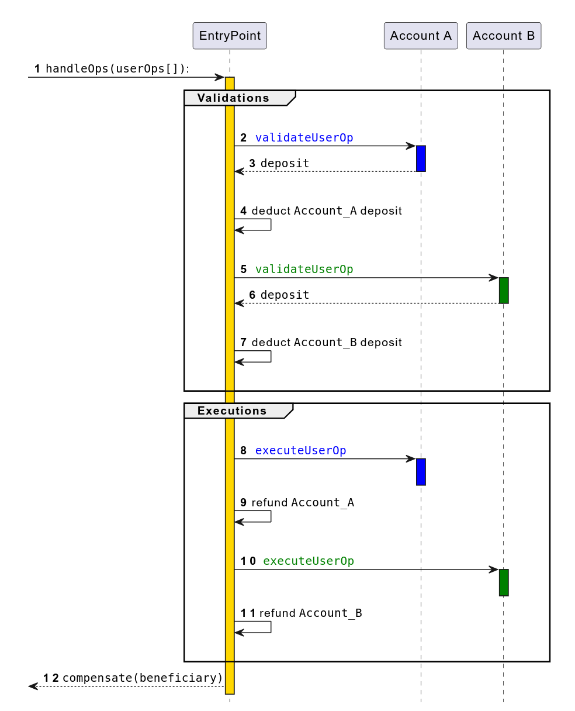

[ERC-4337](https://eips.ethereum.org/EIPS/eip-4337) is an account abstraction proposal which completely avoids the need for consensus-layer protocol changes. 

It means it is does not requires hard or even a soft fork.

Instead of adding new protocol features and changing the bottom-layer transaction type, this proposal instead introduces a higher-layer pseudo-transaction object called a `UserOperation`. 

1. Users send `UserOperation` objects into a separate mempool. 
2. A special class of actor called `bundlers` package up a set of these objects into a transaction making a `handleOps` call to a special contract, 
3. and that transaction then gets included in a block.

An account abstraction proposal which completely avoids consensus-layer protocol changes, instead relying on higher-layer infrastructure.

Schema from [infinitism - ERC 4337: account abstraction without Ethereum protocol changes](https://medium.com/infinitism/erc-4337-account-abstraction-without-ethereum-protocol-changes-d75c9d94dc4a)

> Warning: this article is still in draft state and its content is still mainly taken direcly from the ERC with a few edits of my own. Its content should become more personal later.


[TOC]


##  Specification

### EIP Required

#### EIP-712: typed structured data hashing and signing

[EIP specification](https://eips.ethereum.org/EIPS/eip-712)

A procedure for hashing and signing of typed structured data as opposed to just bytestrings.

#### EIP-7562: Account Abstraction Validation Scope Rules

[EIP-7562 specification](https://eips.ethereum.org/EIPS/eip-7562)

A set of limitations on validation EVM code to protect Account Abstraction nodes from denial-of-service attacks through unpaid computation.

This EIP describes the rules Account Abstraction protocols should follow, during the validation phase of Account Abstraction transactions, such as [ERC-4337](https://eips.ethereum.org/EIPS/eip-4337) `UserOperation` or RIP-7560 (Native Account Abstraction), which are enforced off-chain by a block builder or a standalone bundler, and the rationale behind each one of them.

### Definitions

| **Term**                              | Type                  | **Description**                                              |
| ------------------------------------- | --------------------- | ------------------------------------------------------------ |
| **UserOperation**                     | struct                | A structure similar to a transaction, but with additional fields. Contains sender’s signature and more. |
| **Sender**                            | Smart Contract        | The Smart Contract Account sending the UserOperation.        |
| **EntryPoint**                        | Smart Contract        | A contract that executes bundles of UserOperations. Bundlers must whitelist supported EntryPoints. |
| **Bundler**                           | node                  | A node that handles UserOperations, creates valid transactions, and adds them to blocks. Can work with block-building infrastructure. |
| **Paymaster**                         | Smart Contract        | A contract that agrees to pay for the transaction costs, instead of the sender. |
| **Factory**                           | Smart Contract        | A contract that deploys a new sender contract when necessary. |
| **Aggregator**                        | Smart Contract        | An "authorizer contract" that allows multiple UserOperations to share a single validation. |
| **Canonical UserOperation Mempool**   | Decentralized network | A decentralized network where valid UserOperations conforming to ERC-7562 are exchanged. |
| **Alternative UserOperation Mempool** | Decentralized network | A P2P network with its own rules for validating UserOperations, different from ERC-7562. |
| **Deposit**                           | Currency              | Ether (or L2 native currency) transferred by Sender or Paymaster to EntryPoint to cover future gas costs. |


### UserOperation

To avoid Ethereum consensus changes, we do not attempt to create new transaction types for account-abstracted transactions. Instead, users package up the action they want their Smart Contract Account to take in a struct named `UserOperation`

Users send `UserOperation` objects to a dedicated `UserOperation` mempool.

| Field                           | Type      | Description                                                  |
| ------------------------------- | --------- | ------------------------------------------------------------ |
| `sender`                        | `address` | The Account making the `UserOperation`                       |
| `nonce`                         | `uint256` | Anti-replay parameter (see “Semi-abstracted Nonce Support” ) |
| `factory`                       | `address` | Account Factory for new Accounts OR `0x7702` flag for EIP-7702 Accounts, otherwise `address(0)` |
| `factoryData`                   | `bytes`   | data for the Account Factory if `factory` is provided OR EIP-7702 initialization data, or empty array |
| `callData`                      | `bytes`   | The data to pass to the `sender` during the main execution call |
| `callGasLimit`                  | `uint256` | The amount of gas to allocate the main execution call        |
| `verificationGasLimit`          | `uint256` | The amount of gas to allocate for the verification step      |
| `preVerificationGas`            | `uint256` | Extra gas to pay the bundler                                 |
| `maxFeePerGas`                  | `uint256` | Maximum fee per gas (similar to [EIP-1559](https://eips.ethereum.org/EIPS/eip-1559) `max_fee_per_gas`) |
| `maxPriorityFeePerGas`          | `uint256` | Maximum priority fee per gas (similar to EIP-1559 `max_priority_fee_per_gas`) |
| `paymaster`                     | `address` | Address of paymaster contract, (or empty, if the `sender` pays for gas by itself) |
| `paymasterVerificationGasLimit` | `uint256` | The amount of gas to allocate for the paymaster validation code (only if paymaster exists) |
| `paymasterPostOpGasLimit`       | `uint256` | The amount of gas to allocate for the paymaster post-operation code (only if paymaster exists) |
| `paymasterData`                 | `bytes`   | Data for paymaster (only if paymaster exists)                |
| `signature`                     | `bytes`   | Data passed into the `sender` to verify authorization        |

##### Signature - Security

To prevent replay attacks, either cross-chain or with multiple `EntryPoint` contract versions, the `signature` MUST depend on `chainid` and the `EntryPoint` address.

### Entry-point

The core interface of the `EntryPoint` contract is as follows:

```solidity
function handleOps(PackedUserOperation[] calldata ops, address payable beneficiary);
```

The `beneficiary` is the address that will be paid with all the gas fees collected during the execution of the bundle.


### Smart account

#### Core interface (IAccount)

The core interface required for the Smart Contract Account to have is:

```solidity
interface IAccount {
  function validateUserOp
      (PackedUserOperation calldata userOp, bytes32 userOpHash, uint256 missingAccountFunds)
      external returns (uint256 validationData);
}
```

The `userOpHash` is a hash over the `userOp` (except `signature`), `entryPoint` and `chainId`.

#### Extension (IAccountExecute)

The Smart Contract Account MAY implement the interface `IAccountExecute`

```
interface IAccountExecute {
  function executeUserOp(PackedUserOperation calldata userOp, bytes32 userOpHash) external;
}
```

This method will be called by the `EntryPoint` with the current UserOperation, instead of executing the `callData` itself directly on the `sender`.

#### Requirement

| **Requirement**                            | **MUST**                                                     | **SHOULD**                                                   |
| ------------------------------------------ | ------------------------------------------------------------ | ------------------------------------------------------------ |
| **Validate the caller**                    | The Smart Contract Account must validate the caller is a trusted EntryPoint. |                                                              |
| **Validate the signature**                 | The Smart Contract Account must validate that the signature is a valid signature of the userOpHash. |                                                              |
| **Handle signature mismatch (userOpHash)** |                                                              | The Smart Contract Account should return SIG_VALIDATION_FAILED (1) without reverting on signature mismatch. |
| **Handle error on signature mismatch**     | Any other error must revert.                                 |                                                              |
| **Early return behavior**                  |                                                              | The Smart Contract Account should not return early when returning SIG_VALIDATION_FAILED (1). Instead, it should complete the normal flow to enable performing a gas estimation for the validation function. |
| **Pay the EntryPoint**                     | The Smart Contract Account must pay the EntryPoint at least the missingAccountFunds. |                                                              |
| **Pay more than the minimum**              |                                                              | The sender may pay more than the minimum to cover future transactions and can call `withdrawTo` to retrieve it later. |
| **Return value**                           | The return value must be packed with the aggregator/authorizer, validUntil, and validAfter timestamps. |                                                              |
| **Aggregator/authorizer value**            | The aggregator/authorizer value must be 0 for valid signature, 1 for signature failure, or an address of an aggregator/authorizer contract (as per ERC-7766). |                                                              |
| **validUntil timestamp**                   | The validUntil timestamp must be a 6-byte value, or zero for “infinite”. The UserOperation is valid only up to this time. |                                                              |
| **validAfter timestamp**                   | The validAfter timestamp must be a 6-byte value. The UserOperation is valid only after this time. |                                                              |


##  Semi-abstracted Nonce Support

### Ethereum protocol VS ERC-4337

#### Ethereum protocol

In Ethereum protocol, the sequential transaction `nonce` value has several purposes:

-  It is used as a replay protection method
- To determine the valid order of transaction being included in blocks.
- It also contributes to the transaction hash uniqueness, as a transaction by the same sender with the same nonce may not be included in the chain twice.

#### ERC-4337

Requiring a single sequential `nonce` value is limiting to the senders’ ability to define their custom logic with regard to transaction ordering and replay protection.

Instead of sequential `nonce` , this ERC implement a nonce mechanism that uses a single `uint256` nonce value in the `UserOperation`, but treats it as two values:

- 192-bit “key”
- 64-bit “sequence”


### Nonce in the EntryPoint

#### Representation

These values are represented on-chain in the `EntryPoint` contract. The EIP defines the following method in the `EntryPoint` interface to expose these values:

```solidity
function getNonce(address sender, uint192 key) external view returns (uint256 nonce);
```

#### Nonce verification

For each `key` the `sequence` is validated by the `EntryPoint` for each UserOperation. 

- If the nonce validation fails the `UserOperation` is considered invalid and the bundle is reverted. 
- The `sequence` value is incremented sequentially and monotonically for the `sender` for each `UserOperation`. 
- A new `key` can be introduced with an arbitrary value at any point, with its `sequence` starting at `0`.

This approach maintains the guarantee of `UserOperation` hash uniqueness on-chain on the protocol level while allowing Accounts to implement any custom logic they may need operating on a 192-bit “key” field, while fitting the 32 byte word.

### Bundler: Reading and validating the nonce

When preparing the `UserOperation` bundlers may make a view call to this method to determine a valid value for the `nonce` field.

Bundler’s validation of a `UserOperation` SHOULD start with `getNonce` to ensure the transaction has a valid `nonce` field.

#### Multiple UserOperations

If the bundler is willing to accept multiple `UserOperations` by the same sender into their mempool, this bundler is supposed to track the `key` and `sequence` pair of the `UserOperations` already added in the mempool.

## Entry-point

### Required `EntryPoint` contract functionality

The `EntryPoint` method is `handleOps`, which handles an array of `UserOperations`

The `EntryPoint`’s `handleOps` function must perform the following steps (we first describe the simpler non-paymaster case).

 It must make two loops: the **verification loop** and the **execution loop**. 

Schema from [ERC-4337](https://eips.ethereum.org/EIPS/eip-4337)



#### Verification loop

In the verification loop, the `handleOps` call must perform the following steps for each `UserOperation`

##### Smart Contract Account acration

- Create the `sender` Smart Contract Account if it does not yet exist, using the `initcode` provided in the `UserOperation`.
  - If the `factory` address is “0x7702”, then the sender MUST be an EOA with an [EIP-7702](https://eips.ethereum.org/EIPS/eip-7702) authorization designation. The `EntryPoint` validates the authorized address matches the one specified in the `UserOperation` signature (see [Support for [EIP-7702\] authorizations](https://eips.ethereum.org/EIPS/eip-4337#support-for-eip-7702-authorizations)).
  - If the `sender` does not exist, *and* the `initcode` is empty, or does not deploy a contract at the “sender” address, the call must fail.

##### Fee computation

- calculate the maximum possible fee the `sender` needs to pay based on validation and call gas limits, and current gas values.
- calculate the fee the `sender` must add to its “deposit” in the `EntryPoint`

#####  Call`validateUserOp`

- **Call `validateUserOp` on the `sender` contract**, passing in the `UserOperation`, its hash and the required fee. 
  - The Smart Contract Account SHOULD verify the `UserOperation`’s signature, and pay the fee if the `sender` considers the `UserOperation` valid. 
  - If any `validateUserOp` call fails, `handleOps` must skip execution of at least that `UserOperation`, and may revert entirely.

##### Cost validation

Validate the account’s deposit in the `EntryPoint` is high enough to cover the max possible cost (cover the already-done verification and max execution gas)

#### Execution loop

In the execution loop, the `handleOps` call must perform the following steps for each `UserOperation`:

- **Call the account with the `UserOperation`’s calldata**. It’s up to the account to choose how to parse the calldata; an expected workflow is for the account to have an `execute` function that parses the remaining calldata as a series of one or more calls that the account should make.

- If the calldata starts with the methodsig `IAccountExecute.executeUserOp`, then the `EntryPoint` must build a calldata by encoding `executeUserOp(userOp,userOpHash)` and call the account using that calldata.

- After the call, refund the account’s deposit with the excess gas cost that was pre-charged.
  
  **Penalty**
  
  A penalty of `10%` (`UNUSED_GAS_PENALTY_PERCENT`) is applied on the amounts of `callGasLimit` and `paymasterPostOpGasLimit` gas that remains **unused**.
  This penalty is only applied if the amount of the remaining unused gas is greater than or equal `40000` (`PENALTY_GAS_THRESHOLD`).
  This penalty is necessary to prevent the `UserOperations` from reserving large parts of the gas space in the bundle but leaving it unused and preventing the bundler from including other `UserOperations`.
  
- After the execution of all calls, pay the collected fees from all `UserOperations` to the `beneficiary` address provided by the bundler.

### Paymaster (Extention)

The `EntryPoint` logic supports also **paymasters** that can sponsor transactions for other users. This feature can be used to allow application developers to subsidize fees for their users, allow users to pay fees with [ERC-20] tokens and many other use cases. 

When the `paymasterAndData` field in the `UserOperation` is not empty, the `EntryPoint` implements a different flow for that UserOperation:

```solidity
function validatePaymasterUserOp
    (PackedUserOperation calldata userOp, bytes32 userOpHash, uint256 maxCost)
    external returns (bytes memory context, uint256 validationData);

function postOp
    (PostOpMode mode, bytes calldata context, uint256 actualGasCost, uint256 actualUserOpFeePerGas)
    external;

enum PostOpMode {
    opSucceeded, // UserOperation succeeded
    opReverted // UserOperation reverted. paymaster still has to pay for gas.
}
```


## Security Considerations

The `EntryPoint` contract will need to be audited and formally verified, because it will serve as a central trust point for *all* [ERC-4337]. In total, this architecture reduces auditing and formal verification load for the ecosystem, because the amount of work that individual *accounts* have to do becomes much smaller: they need only 

- verify the `validateUserOp` function and its “check signature and pay fees” logic) 
-  check that other functions are `msg.sender == ENTRY_POINT` gated (perhaps also allowing `msg.sender == self`),

Verification would need to cover two primary claims:

- **Safety against arbitrary hijacking**: The `EntryPoint` only calls to the `sender` with `userOp.calldata` and only if `validateUserOp` to that specific `sender` has passed.
- **Safety against fee draining**: If the `EntryPoint` calls `validateUserOp` and passes, it also must make the generic call with calldata equal to `userOp.calldata`

###  Factory contracts

All `factory` contracts MUST check that all calls to the `createAccount()` function originate from the `entryPoint.senderCreator()` address.

###  Paymasters contracts

All `paymaster` contracts MUST check that all calls to the `validatePaymasterUserOp()` and `postOp()` functions originate from the `EntryPoint`.

###  Aggregator contracts

All `paymaster` contracts MUST check that all calls to the `validateSignatures()` function originates from the `EntryPoint`.

### EIP-7702 delegated Smart Contract Accounts

All EIP-7702 delegated Smart Contract Account implementations MUST check that all calls to the initialization function originate from the `entryPoint.senderCreator()` address.

There is no way for the `EntryPoint` contract to know whether an EIP-7702 account has been initialized or not, and therefore the EIP-7702 account initialization code, can be called multiple times through `EntryPoint`. 

- The Account code SHOULD only allow calling it once 
- the Wallet Application SHOULD NOT pass the `initCode` repeatedly.

### Smart Contract Accounts

####  Storage layout collisions

It is expected that most of ERC-4337 Smart Contract Account will be upgradeable, either via on-chain delegate proxy contracts or via EIP-7702.

When changing the underlying implementation, all Accounts MUST ensure that there are no conflicts in the storage layout of the two contracts.

One common approach to this problem is often referred to as “diamond storage” and is fully described in [ERC-7201:  Namespaced Storage Layout](https://eips.ethereum.org/EIPS/eip-7201)..

###  Transient Storage

Contracts using the [EIP-1153](https://eips.ethereum.org/EIPS/eip-1153) transient storage MUST take into account that ERC-4337 allows multiple `UserOperations` from different unrelated `sender` addresses to be included in the same underlying transaction. The transient storage MUST be cleaned up manually if contains any sensitive information or is used for access control.

## Reference

- [Vitalik - ERC 4337: account abstraction without Ethereum protocol changes](https://medium.com/infinitism/erc-4337-account-abstraction-without-ethereum-protocol-changes-d75c9d94dc4a)
- [www.erc4337.io/docs](https://www.erc4337.io/docs)

- [coindesk - Ethereum Says ERC-4337 Deployed, Tested, Beginning Era of Smart Accounts](https://www.coindesk.com/tech/2023/03/01/ethereum-activates-account-abstraction-touted-by-founder-buterin-as-key-advance)
