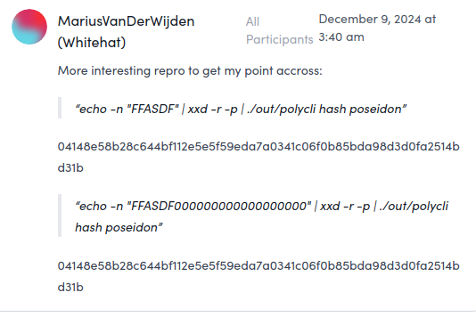

The Poseidon hash function is a cryptographic hash function specifically designed for use in **zero-knowledge proof systems** like SNARKs and STARKs. Unlike general-purpose hashes like SHA-2 or SHA-3, Poseidon is optimized for **efficient arithmetic circuits**, particularly over finite fields, which makes it highly suitable for zk-SNARK-friendly applications.

The posidion hash function is defined in this paper [POSEIDON: A New Hash Function for Zero-Knowledge Proof Systems (Updated Version)](https://eprint.iacr.org/2019/458.pdf) with the following author:  Lorenzo Grassi, Dmitry Khovratovich, Christian Rechberger, Arnab Roy, and Markus Schofnegger.

There are several different version of the specification:

- First version: [Usenix -Poseidon: A New Hash Function for Zero-Knowledge Proof Systems](https://www.usenix.org/system/files/sec21-grassi.pdf) (2021)
- Updated version: [eprint - POSEIDON: A New Hash Function for Zero-Knowledge Proof Systems (Updated Version)](https://eprint.iacr.org/2019/458.pdf)
- [eprint - Poseidon2: A Faster Version of the Poseidon Hash Function](https://eprint.iacr.org/2023/323) (2023)

This article is mainly based on the update version.

[TOC]


## Introduction

## Historic remark

The design of POSEIDON started in the fall of 2018. The design of POSEIDON was inspired by :

- The LowMC cipher with a partial S-box layer
- The block cipher SHARK with its inverse S-box and its MDS matrix as the linear layer, 
- MiMC with its algebraically simple approach of using the cube S-box. 

Apartial S-box layer has been immediately considered for most of the rounds in order to gain performance and safe constraints. The S-box was initially either the inverse or a power map (as the cube function), but the author later found out that the inverse function does not provide a sufficiently fast degree growth.

Reference: [official paper](https://eprint.iacr.org/2019/458.pdf), page 4

### Global overview

The Posiedon hash function takes a preimage of `t−1`  prime field Z*p* elements to a single field element. 

Poseidon operates on an internal state `state`of `t` field elements which, in the unoptimized algorithm, are transformed over *R* number of rounds of: 

- round constant addition
-  S-boxes, 
- and MDS matrix mixing. 

Once all rounds have been performed, Poseidon outputs the second element of the state.

A Posiedon hash function is instantiated by a parameter triple (*p*,*M*,*t*) which sets the prime field, the security level, and the size of Poseidon’s internal state buffer statestate.

 From (*p*,*M*,*t*) the remaining Poseidon parameters are computed (α*,*R**F*,*R**P,RoundConstants,M), i.e. the S-box exponent, the round numbers, the round constants, and the MDS matrix.

### Key Design Goals

- **ZK-friendliness**: Efficient inside arithmetic circuits (low R1CS/constraint cost).
- **Security**: Cryptographically strong against preimage, collision, and other standard attacks.
- **Flexibility**: Parameterizable for different field sizes, security levels, and performance needs.

[TOC]


------

## Structure of Poseidon

### Sponge construction

Poseidon is a **sponge construction**, composed of a **permutation-based design** with rounds that alternate between:

1. **Non-linear (S-box) layer**
2. **Linear layer (MDS matrix multiplication)**
3. **Addition of round constants**


Depedning of the use case, it exits several Poseidon Sponge instance,

- Depending on the use case (see Section 3 and Section 4 for more details), determine the capacity element value and the input padding if needed

- Split the obtained input into chunks of size `r`. 
- Apply the permutation POSEIDON π to the capacity element and the first chunk. 
- Until no more chunks are left, add them into the state and apply the permutation. 
- Output `o` output elements out of the rate part of the state. If needed, iterate the permutation more times.

Reference: [official paper](https://eprint.iacr.org/2019/458.pdf), page 5

### Permutation Function

The permutation is the core of Poseidon. It consists of:

- **Full rounds**: Each state element goes through a nonlinear transformation.
- **Partial rounds**: Only one element gets the nonlinear transformation to reduce computational cost.

#### The HADES Design Strategy for Hashing


Reference: [official paper](https://eprint.iacr.org/2019/458.pdf), page 6

| Terms | Description                                           |
| ----- | ----------------------------------------------------- |
| Rf    | Full Round                                            |
| Rp    | Partial Round                                         |
| M     | Matrix                                                |
| ARC   | addition of a round-key                               |
| S     | non-linear function <br />A substitution box or S-box |

Cryptographic permutations usually consist of an efficient round function which is applied sufficiently many times in order to make the permutation behave like a randomly drawn one.

 In general, the same round function is used throughout the permutation, in order to destroy all of its possible symmetries and structural properties.

In HADES we consider different round functions within the same construction. 

More precisely, we mix rounds with full `S-box layers` and rounds with `partial S-box layers`. 

The motivation to have different types of rounds is that:

- **Full S-box** layers are expensive in software and ZK proof systems but are a good protection against statistical attacks
- **Partial layers** are relatively cheap but are, in some cases, similarly good as full ones against algebraic attacks. 

The HADES design strategy consists of `Rf`full rounds in the beginning, in which S-boxes are applied to the full state. 

After these rounds, RP rounds in the middle contain only a single S-box in each round, and the rest of the state goes through the nonlinear layer unchanged (i.e., identity functions are used instead of the missing Sboxes). 

Finally, `Rf` rounds at the end are applied by again using S-boxes for the full state. 

##### Statistical attacks 

The idea of this approach is to provide arguments for the security against statistical attacks using the RF = 2Rf rounds with full S-box layers in the beginning and in the end together with the wide trail strategy, which is also used in, e.g., the AES. 

#####  Algebraic attacks

On the other hand, the `RP` rounds with partial S-box layers are a more efficient way to increase the degree of the overall function, and are mainly used for arguments against algebraic attacks.

### Parameterization

A Posiedon hash function is instantiated by a parameter triple (*p*,*M*,*t*) which sets the prime field, the security level, and the size of Poseidon’s internal state buffer statestate.

 From (*p*,*M*,*t*) the remaining Poseidon parameters are computed (α*,*R**F*,*R**P,RoundConstants,M), i.e. the S-box exponent, the round numbers, the round constants, and the MDS matrix.

Poseidon allows tuning the following parameters:

- State size:
  $$
  \begin{aligned}
  t∈Z^+
  \end{aligned}
  $$

*t* is a number of S-box routines in one round. It also specifies an input dimension: hash function supports up to *t* input numbers.

- Number of full rounds:
  $$
  \begin{aligned}
  Rf∈Z^+
  \end{aligned}
  $$
  (*t* S-box routines)

- Number of partial rounds:
  $$
  \begin{aligned}
  Rp∈Z^+
  \end{aligned}
  $$
  (single S-box routine)

- S-box exponent:
  $$
  \begin{aligned}
  α∈{3,5,7,…}
  \end{aligned}
  $$

- Finite field:

  Fp, where p is primee

Reference: [spec.filecoin.io - crypto.poseidon.mds-matrix](https://spec.filecoin.io/#section-algorithms.crypto.poseidon.mds-matrix), [docs.rs/poseidon-parameters/ - struct.PoseidonParameters.html](https://docs.rs/poseidon-parameters/latest/poseidon_parameters/v2/struct.PoseidonParameters.html)


------

### Core Components

#### S-box Layer (Non-linear)

The S-box is defined as:
$$
\begin{aligned}
S:Zp → Zp
\end{aligned}
$$

$$
\begin{aligned}
S(x) ↦ x^α
\end{aligned}
$$


where α ≥ 3 is the smallest positive integer that satisfies 
$$
\begin{aligned}
gcd(α, p − 1) = 1
\end{aligned}
$$


α∈Z+

In general, the S-BOX used is the following:


$$
\begin{aligned}
x↦x^5
\end{aligned}
$$


This S-Box is suitable for the most popular prime fields in ZK applications,concretely the prime subfields of the scalar field of the BLS12-381 and BN254 or Ed25519.

or more generally:

This step provides **non-linearity**, crucial for security.

------

#### MDS Matrix (Linear Mixing)

A Maximum Distance Separable (MDS) matrix is used to mix the state elements linearly. If:
$$
\begin{aligned}
M=MDS ~matrix
\end{aligned}
$$
$$
\begin{aligned}
s=state~ vector
\end{aligned}
$$


Then the mixing is performed as:
$$
\begin{aligned}
s_{new}=M⋅s
\end{aligned}
$$


This ensures **diffusion**, so a change in one input affects all outputs.

##### Avoiding Insecure Matrices

According to the [official paper](https://eprint.iacr.org/2019/458.pdf), page 6:  not every MDS matrix provides the same level of security. . In particular, the matrix M must prevent the possibility to set up:

- invariant (or iterative) subspace trails (or equivalently, truncated differentials) with  prob. 1 with inactive S-boxes over more than t − 1 rounds8 (more details are given in the following)
- invariant (or iterative) subspace trails with prob. 1 and with active S-boxes for any number of rounds.

------

#### Round Constants

Each round adds precomputed constants to break symmetry and resist attacks:
$$
\begin{aligned}
s_{new}=s+c
\end{aligned}
$$
Where `c` is a vector of constants for that round.

------


------

## Applications

### Use case

- Zero-Knowledge Proof Systems (SNARKs, STARKs)
- Merkle trees in zkApps
- Commitments in blockchain smart contracts

The paper suggests POSEIDON for all applications of zero-knowledgefriendly hashing, concretely: 

#### Commitments

Using POSEIDON for **commitments** in various protocols, where the knowledge of the committed value is proven in zero knowledge
- For this the paper suggests a singlecall permutation-based hashing with POSEIDON-128 and widths from 2 to 5 field elements. 
- The advantage over the Pedersen hash, for example, is that POSEIDON is faster and can also be used in signature schemes which allows for a smaller code footprint. 

#### Hashing multi-element

Hashing multi-element objects with certain fields encoded as field elements, so that statements about these fields are proven in zero knowledge: 
- The paper suggests variable length sponge-based hashing with POSEIDON-128 or POSEIDON-80 with width 5 (and rate 4). 

#### Merkle trees

Using POSEIDON in **Merkle trees** to enable zeroknowledge proofs of knowledge of a leaf in the tree with optional statements about the leaf content
- The paper recommends Merkle trees of arity 4 (i.e., width 5) with POSEIDON-128 as the most performant, but trees of more conventional arities can be used as well. 

#### Verifiable encryption within IES 

Verifiable encryption with POSEIDON within Integrated Encryption Scheme : Put POSEIDON inside the DuplexSponge authenticated encryption framework and initialize it with a session key based on the recipient’s public key. Then one can prove that the recipient can decrypt the ciphertext into a plaintext with certain properties.

### Protocols

 There exist several third-party protocols that already use POSEIDON in these use cases: 

- [Filecoin](https://github.com/lurk-lab/neptune) employs POSEIDON for Merkle tree proofs with different arities and for two-value commitments.
- [Dusk Network](https://github.com/dusk-network/Poseidon252) uses POSEIDON to build a Zcash-like protocol for securities trading. It also uses POSEIDON for encryption as described above. 
- Not yet implemented, but there is a draft EIP ([EIP-5988](https://eips.ethereum.org/EIPS/eip-5988)) to add a precompiled contract which implements Poseidon in the EVM. See also [www.poseidon-initiative.info](https://www.poseidon-initiative.info)

## Select the right use Poseidon

### Poseidon in Your Application

In order to determine the right version of Poseidon for your scenario, you need to know the following:

- The *field* F, over which the arithmetic statements that use Poseidon are defined. It is often determined by the ZK proof system.  Most likely, it is a prime-order subgroup of the group of points of an elliptic curve,  where the curve is BLS12-381, BN254, or Ed25519.  

Poseidon maps sequences of `F` elements to a fixed length sequence of `F`elements.

- You hash messages of *arbitrary* length or *fixed* length (like in a Merkle tree, where almost always 2 elements are hashed).
- The *security level*  M against collision and preimage attacks (most  likely, 128 bits).

With this information, you determine the *width w,* measured in the number of F elements, of Poseidon permutation as follows:

- Reserve `c` elements for capacity so that c elements of F contain 2M or more bits.

- If messages have fixed length `l` which is reasonably small (10 or less), then set 
  $$
  w = c+l.
  $$
  

Then you figure out which S-box is compatible with the curve.  For the curves BLS12-381, BN254, or Ed25519 the S-box `x^5` is optimal.

Reference: [poseidon-hash.info](https://www.poseidon-hash.info)

## Difference with pedersen hash

According to the paper,  POSEIDON uses up to 8x fewer constraints per message bit than Pedersen Hash.

------

### Security

Poseidon provides strong resistance to:

- **Collision attacks**
- **Preimage and second preimage attacks**
- **Differential and linear cryptanalysis**
- **Algebraic and Gröbner basis attacks**

### Arkwork Poseidon Sponge

Fuzzzing Labs found two impactful bugs in the **ArkWorks** library’s implementation of the Poseidon Sponge construction.

Poseidon is based on the sponge construction. It means that there is a `squeeze`operations.

When the function **`squeeze()` `0`** elements, the right result is that nothing is happening, *i.e.* there is no `permutation` (the internal `state` of the sponge remains intact) and no element is output.

But in their implementation, calling `squeeze` (`squeeze_native_field_elements` in the code) on `0` right after an `absorb` results in a `permutation` on the internal `state` (instead of doing nothing).

Reference: [fuzzinglabs - POSEIDON SPONGE BUGS IN ARKWORKS - Avoiding Cryptographic Failures in Hashing](https://fuzzinglabs.com/poseidon-sponge-bugs-arkworks-cryptography-zkp/)

### Iden3 vulnerability

Date: 01/2025

According to [MariusVanDerWijden](https://x.com/vdWijden), a hash collision was present in the [GO poseidon](https://github.com/iden3/go-iden3-crypto) implementation by iden3.

A padding was incorrectly applied in their scheme: the input will be padded to the next 32 bytes with 0's instead of the industry standard of a 1 followed by 0's. This leads to the following hash collisions:



Reference: [MariusVanDerWijden - X](https://x.com/vdWijden/status/1877046148386451732)

This vulnerability only applies to variable size poseidon hashing, which is not common because circuits in zk they use to be fixed sized by design. 

All the circomlib is designed with this in mind and assume this fixed size. It’s true that same projects may use this library incorrectly and may hash variable sized data without adding any padding protocol. If so, projects will needs to be corrected. 

Reference: [Jordi Baylina - baylina.eth](https://x.com/jbaylina/status/1877418809595732297)

### Security levels

According to [filecoin documentation](https://spec.filecoin.io/#section-algorithms.crypto.poseidon.poseidon-specific-symbols), for a given Matrix `M`, Poseidon allows for 80, 128, and 256-bit security levels.

## Implementation

### Starknet

Poseidon is a family of hash functions designed to be very efficient as algebraic circuits. As such, they can be very useful in ZK-proving systems such as STARKs.

Starknet’s version of the Poseidon hash function is based on a three-element state Hades permutation and defined of up to 2 elements by:
$$
\begin{aligned}
poseidon(x):= [hades\_permutation(x,0,1)]_0
\end{aligned}
$$

$$
\begin{aligned}
poseidon(x,y) := [hades\_permutation(x,y,2)]_0
\end{aligned}
$$


Where [⋅]_j denotes taking the j'th coordinate of a tuple.


#### Array hashing

Let hades:
$$
\begin{aligned}
F{^3_P}-> F{^3_P}
\end{aligned}
$$
 denote the Hades permutation with Starknet’s parameters, then given an array `a1,......an`of n field elements.

We define poseidon (a1,...., an) to be the first coordinate of H(a1,...,an;0,0,0) were:


#### Code

```rust
func poseidon_hash_many{poseidon_ptr: PoseidonBuiltin*}(n: felt, elements: felt*) -> (res: felt) {
    // Apply the sponge construction to digest many elements.
    // To distinguish between the use cases the capacity element is initialized to 0.
    // To distinguish between different input sizes always pad with 1 and possibly with another 0 to
    // complete to an even sized input.
    let state = PoseidonBuiltinState(s0=0, s1=0, s2=0);
    _poseidon_hash_many_inner(state, n, elements);
    let res = poseidon_ptr.output.s0;
    let poseidon_ptr = poseidon_ptr + PoseidonBuiltin.SIZE;
    return (res=res);
}

```

Reference: [starkware-libs/cairo-lang/blob/12ca9e91bbdc8a423c63280949c7e34382792067/src/starkware/cairo/common/builtin_poseidon/poseidon.cairo#L28]( https://github.com/starkware-libs/cairo-lang/blob/12ca9e91bbdc8a423c63280949c7e34382792067/src/starkware/cairo/common/builtin_poseidon/poseidon.cairo#L28), [Starknet - cryptography/](https://docs.starknet.io/architecture-and-concepts/cryptography/)

### Filecoin Neptune

Neptune is a Rust implementation of the [Poseidon hash function](https://www.poseidon-hash.info/) tuned for [Filecoin](https://filecoin.io/).

- Neptune was initially specialized to the [BLS12-381 curve](https://electriccoin.co/blog/new-snark-curve/). 

- Filecoin's Poseidon specification is published in the Filecoin specification document [here](https://spec.filecoin.io/#section-algorithms.crypto.poseidon). 
- [github.com - urk-lab/neptune](https://github.com/lurk-lab/neptune)

## Mindmap


## Reference

- Specification: 
  - First version: [Usenix -Poseidon: A New Hash Function for Zero-Knowledge Proof Systems](https://www.usenix.org/system/files/sec21-grassi.pdf) (2021)
  - Updated version: [eprint - POSEIDON: A New Hash Function for Zero-Knowledge Proof Systems (Updated Version)](https://eprint.iacr.org/2019/458.pdf)
  - [eprint - Poseidon2: A Faster Version of the Poseidon Hash Function](https://eprint.iacr.org/2023/323) (2023)
-  [poseidon-hash.info](https://www.poseidon-hash.info)
- [autoparallel - poseidon](https://autoparallel.github.io/poseidon/index.html)
- Poseidon - plonk: [https://drive.google.com/file/d/1bZZvKMQHaZGA4L9eZhupQLyGINkkFG_b/view](https://drive.google.com/file/d/1bZZvKMQHaZGA4L9eZhupQLyGINkkFG_b/view)
- [Mind the Middle Layer: The HADES Design Strategy Revisited](https://dl.acm.org/doi/10.1007/978-3-030-77886-6_2)
- [Zellic - Algebraic Attacks on ZK-Friendly Hash Functions](https://www.zellic.io/blog/algebraic-attacks-on-zk-hash-functions/)
- [fuzzinglabs - POSEIDON SPONGE BUGS IN ARKWORKS - Avoiding Cryptographic Failures in Hashing](https://fuzzinglabs.com/poseidon-sponge-bugs-arkworks-cryptography-zkp/)
- [docs.zkbob - The Poseidon Hash](https://docs.zkbob.com/implementation/untitled/the-poseidon-hash)
- [docs.polygon.technology - poseidon-sm/#execution-of-poseidon-actions](https://docs.polygon.technology/zkEVM/architecture/zkprover/hashing-state-machines/poseidon-sm/#execution-of-poseidon-actions)
- Chatgpt with the following input "Write me a technical article about poseidon hash function. Write a mindmap-plantuml diagram(startuml) to explain this. And another diagram (plantuml) to explain the flow"