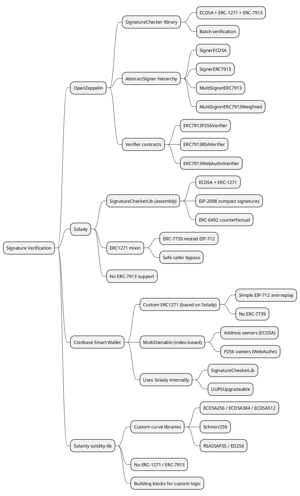

ERC-1271 defines a standard for smart contract signature validation, enabling contract wallets to verify signatures the same way externally owned accounts (EOAs) do with `ecrecover`. ERC-7913 extends this model to keys that do not have an Ethereum address, such as P256, RSA, or WebAuthn keys. This article compares how three Solidity libraries and one production wallet implement and support these standards.

> This article was produced with the assistance of [Cursor](https://cursor.com/) and custom skills.

[TOC]

## Scope and Versions

| Library | Version | Commit |
|---------|---------|--------|
| OpenZeppelin Contracts | v5.5.0 | `fcbae539` |
| Solady | v0.1.26 | `acd959aa` |
| Coinbase Smart Wallet | v1.1.0 | — |
| Solarity solidity-lib | v3.3.2 | `783a334b` |

## 1. Standards Referenced in This Article

This section provides a summary of every ERC and EIP standard discussed throughout the article.

### ERC-191 — Signed Data Standard

| | |
|---|---|
| **Status** | Final |
| **Created** | 2016-01-20 |
| **Authors** | Martin Holst Swende, Nick Johnson |

ERC-191 defines a general format for signed data in Ethereum: `0x19 <version byte> <version-specific data> <data to sign>`. The leading `0x19` byte ensures signed data can never be confused with a valid RLP-encoded Ethereum transaction. Three version bytes are registered:

- `0x00` — Data with an intended validator address (prevents cross-contract replay).
- `0x01` — EIP-712 structured data.
- `0x45` — `personal_sign` messages (the `\x19Ethereum Signed Message:\n` prefix).

ERC-191 is the foundational layer for all Ethereum message signing. Both OpenZeppelin's `MessageHashUtils` and Solady's `SignatureCheckerLib.toEthSignedMessageHash` implement the `0x45` variant.

### EIP-712 — Typed Structured Data Hashing and Signing

| | |
|---|---|
| **Status** | Final |
| **Created** | 2017-09-12 |
| **Authors** | Remco Bloemen, Leonid Logvinov, Jacob Evans |

EIP-712 defines a standard for hashing and signing typed structured data, as opposed to raw bytestrings. It introduces the concept of a **domain separator** (chain ID, contract address, name, version, salt) and **type hashing** (`hashStruct`) so that signatures are bound to a specific application and chain. The resulting hash is formed as:

```
keccak256("\x19\x01" || domainSeparator || hashStruct(message))
```

EIP-712 is a prerequisite for ERC-7739 and is used internally by both OpenZeppelin's `EIP712` and Solady's `EIP712` base contracts.

### ERC-1271 — Standard Signature Validation Method for Contracts

| | |
|---|---|
| **Status** | Final |
| **Created** | 2018-07-25 |
| **Authors** | Francisco Giordano, Matt Condon, Philippe Castonguay, Amir Bandeali, Jorge Izquierdo, Bertrand Masius |

ERC-1271 defines a standard way for smart contracts to validate signatures on their behalf. It introduces a single function:

```solidity
function isValidSignature(bytes32 hash, bytes calldata signature) external view returns (bytes4 magicValue);
```

A contract MUST return `0x1626ba7e` (the function selector) when the signature is valid. The standard enables protocols to accept signatures from both EOAs (via `ecrecover`) and smart contract wallets (via `isValidSignature`) through a unified verification path.

Implementation is context-dependent: contracts can use any signature scheme (ECDSA, multisig, BLS, etc.) and any validation logic (time-based, state-based, role-based). The function MUST NOT modify state (enforced by `view`/`STATICCALL`).

### ERC-2098 — Compact Signature Representation

| | |
|---|---|
| **Status** | Final |
| **Created** | 2019-03-14 |
| **Authors** | Richard Moore, Nick Johnson |

ERC-2098 defines a 64-byte compact encoding for secp256k1 signatures by exploiting two properties: (1) `yParity` is always 0 or 1, and (2) the top bit of `s` is always 0 (due to canonical signature enforcement from EIP-2). The compact format stores `yParity` in the top bit of `s`:

```
Standard:  [32-byte r][32-byte s][1-byte v]    = 65 bytes
Compact:   [32-byte r][1-bit yParity + 255-bit s] = 64 bytes
```

This saves 1 byte per signature on-chain and 32 bytes when word-aligned. On L2s where calldata cost dominates, the savings are significant. Solady's `SignatureCheckerLib` natively auto-detects both 64-byte and 65-byte signatures. OpenZeppelin also supports EIP-2098 via its `ECDSA` library.

### ERC-6492 — Signature Validation for Predeploy Contracts

| | |
|---|---|
| **Status** | Final |
| **Created** | 2023-02-10 |
| **Authors** | Ivo Georgiev, Agustin Aguilar |
| **Requires** | ERC-1271 |

ERC-6492 extends ERC-1271 to allow signature verification for smart accounts that have not yet been deployed (counterfactual contracts). This is critical for account abstraction, where wallet deployment is often deferred until the first transaction.

A counterfactual signature is wrapped with deployment data and a magic suffix `0x6492...6492` (32 bytes). The verifier detects this suffix, deploys the contract via the embedded factory calldata, then performs standard ERC-1271 verification. The magic bytes end with `0x92`, which is not a valid `v` value for `ecrecover`, preventing collision with ECDSA signatures.

Solady implements ERC-6492 in `SignatureCheckerLib.isValidERC6492SignatureNow`. OpenZeppelin does not currently provide an ERC-6492 implementation.

### ERC-7739 — Readable Typed Signatures for Smart Accounts

| | |
|---|---|
| **Status** | Draft |
| **Created** | 2024-05-28 |
| **Authors** | vectorized, Sihoon Lee, Francisco Giordano, Hadrien Croubois, Ernesto Garcia, et al. |
| **Requires** | ERC-191, EIP-712, ERC-1271, ERC-5267 |

ERC-7739 solves a signature replay vulnerability: when multiple smart accounts are owned by a single EOA, a signature valid for one account can be replayed against the others if the hash does not include the account address. Many popular applications (e.g. Permit2) produce hashes without the verifying contract's address.

ERC-7739 defines a **defensive rehashing** scheme using nested EIP-712 typed data. The smart account wraps the original hash inside a `TypedDataSign` structure that includes the account's own EIP-712 domain, binding the signature to a specific account and chain while preserving readability in wallet UIs.

The standard also defines a `PersonalSign` workflow for `personal_sign` messages and a detection mechanism: calling `isValidSignature(0x7739...7739, "")` returns `0x77390001` if the account supports ERC-7739.

Solady's `ERC1271` mixin implements ERC-7739 natively. OpenZeppelin provides `draft-ERC7739Utils`.

### ERC-7913 — Signature Verifiers

| | |
|---|---|
| **Status** | Final |
| **Created** | 2025-03-21 |
| **Authors** | Hadrien Croubois, Ernesto Garcia, Francisco Giordano, Aryeh Greenberg |

ERC-7913 extends the concept of signer identity beyond Ethereum addresses to keys that have no on-chain address (P256, RSA, WebAuthn, ZK-based signers, etc.). It introduces a verifier interface:

```solidity
interface IERC7913SignatureVerifier {
    function verify(bytes calldata key, bytes32 hash, bytes calldata signature)
        external view returns (bytes4);
}
```

A signer is represented as a `bytes` value: `verifier || key`. The first 20 bytes identify a deployed verifier contract; the remaining bytes contain the public key material. This avoids deploying individual ERC-1271 contracts for every key, as a single stateless verifier can handle all keys of a given type.

The standard is backward-compatible:
- `signer.length < 20`: verification fails.
- `signer.length == 20`: falls back to ERC-1271/ECDSA (the signer is an address).
- `signer.length > 20`: calls `IERC7913SignatureVerifier(verifier).verify(key, hash, signature)`.

OpenZeppelin provides the only full implementation among the three libraries compared here, including verifiers for P256, RSA, and WebAuthn, as well as single-signer and multi-signer (threshold, weighted) abstractions.

## 2. OpenZeppelin — SignatureChecker + Signers + Verifiers

OpenZeppelin provides the most comprehensive ERC-7913 implementation across three layers.

### 2.1 SignatureChecker Library (ERC-1271, ERC-7913)

The `SignatureChecker` library unifies ECDSA, ERC-1271, and ERC-7913 verification into a single entry point:

```solidity
library SignatureChecker {
    // ECDSA + ERC-1271 (address-based signer)
    function isValidSignatureNow(address signer, bytes32 hash, bytes memory signature)
        internal view returns (bool);

    // ERC-7913 (bytes-based signer: verifier || key)
    function isValidSignatureNow(bytes memory signer, bytes32 hash, bytes memory signature)
        internal view returns (bool);

    // Batch ERC-7913 verification with duplicate detection
    function areValidSignaturesNow(bytes32 hash, bytes[] memory signers, bytes[] memory signatures)
        internal view returns (bool);
}
```

The `bytes`-based overload implements the ERC-7913 routing logic:

```solidity
function isValidSignatureNow(bytes memory signer, bytes32 hash, bytes memory signature)
    internal view returns (bool)
{
    if (signer.length < 20) {
        return false;
    } else if (signer.length == 20) {
        // Fallback to address-based: ECDSA or ERC-1271
        return isValidSignatureNow(address(bytes20(signer)), hash, signature);
    } else {
        // ERC-7913: call verifier contract
        (bool success, bytes memory result) = address(bytes20(signer)).staticcall(
            abi.encodeCall(IERC7913SignatureVerifier.verify, (signer.slice(20), hash, signature))
        );
        return (success && result.length >= 32 &&
            abi.decode(result, (bytes32)) == bytes32(IERC7913SignatureVerifier.verify.selector));
    }
}
```

The `areValidSignaturesNow` function verifies multiple signers with an optimized duplicate detection: if signers are sorted by `keccak256(signer)`, the uniqueness check runs in O(n); otherwise it falls back to O(n^2).

### 2.2 AbstractSigner and Signer Implementations

OpenZeppelin defines an abstract base for signature validation:

```solidity
abstract contract AbstractSigner {
    function _rawSignatureValidation(bytes32 hash, bytes calldata signature)
        internal view virtual returns (bool);
}
```

Concrete implementations include:

| Contract | Key type | Description |
|----------|----------|-------------|
| `SignerECDSA` | secp256k1 | Standard EOA signer; stores an `address` |
| `SignerERC7913` | Any (via verifier) | Stores `bytes signer` (verifier+key) |
| `SignerP256` | secp256r1 | P256 key verification |
| `SignerRSA` | RSA | RSA-PKCS#1 verification |
| `SignerWebAuthn` | WebAuthn | Passkey verification |
| `SignerEIP7702` | Delegated EOA | EIP-7702 delegation |
| `MultiSignerERC7913` | Multi-sig (threshold) | M-of-N ERC-7913 signers |
| `MultiSignerERC7913Weighted` | Weighted multi-sig | Weighted threshold voting |

### 2.3 MultiSignerERC7913 — Threshold Multi-Signature

`MultiSignerERC7913` manages a set of authorized ERC-7913 signers with a configurable threshold:

```solidity
abstract contract MultiSignerERC7913 is AbstractSigner {
    EnumerableSet.BytesSet private _signers;
    uint64 private _threshold;

    function _rawSignatureValidation(bytes32 hash, bytes calldata signature)
        internal view virtual override returns (bool)
    {
        (bytes[] memory signers, bytes[] memory signatures) = abi.decode(signature, (bytes[], bytes[]));
        return _validateThreshold(signers) && _validateSignatures(hash, signers, signatures);
    }
}
```

The weighted variant (`MultiSignerERC7913Weighted`) extends this with per-signer weights, enabling governance schemes where some signers carry more authority.

### 2.4 ERC-7913 Verifiers

OpenZeppelin provides three ready-to-deploy verifier contracts:

```solidity
// P256 (secp256r1) — passkeys, secure enclaves
contract ERC7913P256Verifier is IERC7913SignatureVerifier {
    function verify(bytes calldata key, bytes32 hash, bytes calldata signature)
        public view virtual returns (bytes4)
    {
        if (key.length == 0x40 && signature.length >= 0x40) {
            bytes32 qx = bytes32(key[0x00:0x20]);
            bytes32 qy = bytes32(key[0x20:0x40]);
            bytes32 r  = bytes32(signature[0x00:0x20]);
            bytes32 s  = bytes32(signature[0x20:0x40]);
            if (P256.verify(hash, r, s, qx, qy)) {
                return IERC7913SignatureVerifier.verify.selector;
            }
        }
        return 0xFFFFFFFF;
    }
}

// ERC7913RSAVerifier: decodes (e, n) from key, calls RSA.pkcs1Sha256
// ERC7913WebAuthnVerifier: decodes WebAuthnAuth from signature, calls WebAuthn.verify
```

These are stateless contracts meant to be deployed once and referenced by all signers using that key type.

## 3. Solady — SignatureCheckerLib + ERC1271

### 3.1 SignatureCheckerLib (ERC-1271, EIP-2098, ERC-6492)

Solady provides gas-optimized signature checking with ECDSA and ERC-1271 support, entirely in assembly:

```solidity
library SignatureCheckerLib {
    // ECDSA + ERC-1271 verification
    function isValidSignatureNow(address signer, bytes32 hash, bytes memory signature)
        internal view returns (bool isValid);

    // Calldata variant (saves gas on L2s)
    function isValidSignatureNowCalldata(address signer, bytes32 hash, bytes calldata signature)
        internal view returns (bool isValid);

    // EIP-2098 compact: (r, vs)
    function isValidSignatureNow(address signer, bytes32 hash, bytes32 r, bytes32 vs)
        internal view returns (bool isValid);

    // Decomposed: (v, r, s)
    function isValidSignatureNow(address signer, bytes32 hash, uint8 v, bytes32 r, bytes32 s)
        internal view returns (bool isValid);

    // Pure ERC-1271 (no ECDSA fallback)
    function isValidERC1271SignatureNow(address signer, bytes32 hash, bytes memory signature)
        internal view returns (bool isValid);

    // ERC-6492 support (counterfactual contracts)
    function isValidERC6492SignatureNow(address signer, bytes32 hash, bytes memory signature)
        internal returns (bool isValid);
}
```

Key characteristics:

- **All assembly**: Every function is written in Yul for minimal gas.
- **EIP-2098 support**: Accepts both 64-byte `(r, vs)` and 65-byte `(r, s, v)` signatures natively.
- **ERC-6492 support**: Can verify signatures from smart accounts that are not yet deployed (counterfactual).
- **No ERC-7913 support**: Solady does not implement the ERC-7913 standard.
- **Zero-address guard**: Returns `false` for `address(0)` signers.

### 3.2 ERC1271 Mixin

Solady's `ERC1271` is an abstract contract that smart accounts inherit. It implements the `isValidSignature` function with a nested EIP-712 approach and ERC-7739 detection:

```solidity
abstract contract ERC1271 is EIP712 {
    function isValidSignature(bytes32 hash, bytes calldata signature)
        public view virtual returns (bytes4 result);

    // Override to return the signer address
    function _erc1271Signer() internal view virtual returns (address);
}
```

The validation pipeline tries three strategies in order:

1. **Safe caller check** — If `msg.sender` is a known safe caller (e.g. `MulticallerWithSigner`), validate directly.
2. **Nested EIP-712** — Wrap the hash in a typed data structure to prevent cross-contract replay.
3. **RPC fallback** — For `personal_sign` and `eth_signTypedData_v4` compatibility.

This design addresses the phishing risks described in ERC-7739.

### 3.3 Hashing Utilities

`SignatureCheckerLib` also includes `toEthSignedMessageHash` for EIP-191 message hashing, with an optimized assembly implementation supporting messages up to 999,999 bytes.

## 4. Solarity Solidity-lib — Custom Cryptography Primitives

Solidity-lib takes a fundamentally different approach. It does not implement ERC-1271 or ERC-7913. Instead, it provides low-level cryptographic verification libraries for curves beyond secp256k1:

| Library | Algorithm | Description |
|---------|-----------|-------------|
| `ECDSA256` | ECDSA on any 256-bit curve | Parameterized by `EC256.Curve`; works with P256, brainpool, etc. |
| `ECDSA384` | ECDSA on 384-bit curves | secp384r1 and similar |
| `ECDSA512` | ECDSA on 512-bit curves | secp521r1 and similar |
| `Schnorr256` | Schnorr signatures | 256-bit curve Schnorr |
| `RSASSAPSS` | RSA-SSA-PSS | RSA signature verification with PSS padding |
| `ED256` | EdDSA | 256-bit EdDSA (e.g. Ed25519) |

Example usage with `ECDSA256`:

```solidity
library ECDSA256 {
    function verify(
        EC256.Curve memory ec,        // Curve parameters (a, b, gx, gy, p, n, etc.)
        bytes32 hashedMessage_,
        bytes memory signature_,       // bytes(r) + bytes(s)
        bytes memory pubKey_           // bytes(x) + bytes(y)
    ) internal view returns (bool);
}
```

These libraries are designed for ZKP circuits, identity protocols, and bridge verifiers where specific curves are required. They operate at a lower level than ERC-1271/ERC-7913 and do not provide a unified `isValidSignature` interface.

## 5. Case Study: Coinbase Smart Wallet ERC-1271 (v1.1.0)

The Coinbase Smart Wallet is an ERC-4337-compatible smart account deployed in production. It implements its own `ERC1271.sol`, explicitly credited as "based on Solady's", but with significant architectural deviations. Comparing it to the library implementations reveals the trade-offs a production wallet makes.

### 5.1 Architecture Overview

The wallet is composed of three core contracts:

```
CoinbaseSmartWallet
├── ERC1271 (anti cross-account-replay)
├── MultiOwnable (index-based multi-owner)
├── IAccount (ERC-4337)
├── UUPSUpgradeable (Solady)
└── Receiver (Solady)
```

The `ERC1271` contract provides the anti-replay wrapper. `MultiOwnable` manages owners. `CoinbaseSmartWallet` ties them together and implements `_isValidSignature`.

### 5.2 Anti-Replay Mechanism

Coinbase uses a simple, single-level EIP-712 wrapper with a custom type:

```solidity
bytes32 private constant _MESSAGE_TYPEHASH = keccak256("CoinbaseSmartWalletMessage(bytes32 hash)");

function isValidSignature(bytes32 hash, bytes calldata signature) public view virtual returns (bytes4 result) {
    if (_isValidSignature({hash: replaySafeHash(hash), signature: signature})) {
        return 0x1626ba7e;
    }
    return 0xffffffff;
}

function replaySafeHash(bytes32 hash) public view virtual returns (bytes32) {
    return keccak256(abi.encodePacked("\x19\x01", domainSeparator(), keccak256(abi.encode(_MESSAGE_TYPEHASH, hash))));
}
```

The domain separator includes `address(this)` and `block.chainid`, which prevents cross-account and cross-chain replay.

**Compared to Solady's ERC-7739 approach**, Coinbase's scheme is much simpler but has a key limitation: the original signed content becomes opaque. A wallet UI only sees `CoinbaseSmartWalletMessage(bytes32 hash)` -- the actual data behind `hash` (e.g. a Permit2 approval, an NFT listing) is not visible to the user during signing.

Solady's ERC-7739 `TypedDataSign` workflow preserves the original struct fields in the wallet UI by embedding them in a nested typed data structure, which gives users visibility into what they are actually signing.

| Aspect | Coinbase ERC1271 | Solady ERC1271 |
|--------|------------------|----------------|
| Anti-replay strategy | Simple EIP-712 wrapper | ERC-7739 nested EIP-712 |
| Content readability in wallet UI | Opaque (`bytes32 hash`) | Readable (original struct preserved) |
| Validation pipeline | Single path | 3-strategy (safe caller, nested EIP-712, RPC) |
| ERC-7739 support | No | Yes |
| ERC-6492 unwrapping | No (separate helper contract) | Yes (inline in `_erc1271UnwrapSignature`) |
| RPC off-chain fallback | No | Yes (`tx.gasprice == 0` heuristic) |
| Code complexity | ~90 lines, pure Solidity | ~250 lines, heavy assembly |

### 5.3 Multi-Owner Signature Dispatch

Unlike Solady (single `_erc1271Signer()` returning one address) or OpenZeppelin's `AbstractSigner` hierarchy, Coinbase uses an index-based multi-owner system via `MultiOwnable`:

```solidity
struct SignatureWrapper {
    uint256 ownerIndex;      // Identifies which owner signed
    bytes signatureData;     // The actual signature
}

function _isValidSignature(bytes32 hash, bytes calldata signature) internal view virtual override returns (bool) {
    SignatureWrapper memory sigWrapper = abi.decode(signature, (SignatureWrapper));
    bytes memory ownerBytes = ownerAtIndex(sigWrapper.ownerIndex);

    if (ownerBytes.length == 32) {
        // Ethereum address owner: ECDSA or ERC-1271 via Solady's SignatureCheckerLib
        address owner;
        assembly ("memory-safe") { owner := mload(add(ownerBytes, 32)) }
        return SignatureCheckerLib.isValidSignatureNow(owner, hash, sigWrapper.signatureData);
    }

    if (ownerBytes.length == 64) {
        // P256 public key owner: WebAuthn verification
        (uint256 x, uint256 y) = abi.decode(ownerBytes, (uint256, uint256));
        WebAuthn.WebAuthnAuth memory auth = abi.decode(sigWrapper.signatureData, (WebAuthn.WebAuthnAuth));
        return WebAuthn.verify({challenge: abi.encode(hash), requireUV: false, webAuthnAuth: auth, x: x, y: y});
    }

    revert InvalidOwnerBytesLength(ownerBytes);
}
```

The dispatch logic is:

- **32-byte owner**: Treated as an Ethereum address. Verified with Solady's `SignatureCheckerLib.isValidSignatureNow` (ECDSA + ERC-1271).
- **64-byte owner**: Treated as a P256 public key (x, y). Verified with `WebAuthn.verify` from the `webauthn-sol` library.

This is a two-key-type system, hardcoded in the contract. Adding a new key type (e.g. RSA) would require a contract upgrade.

### 5.4 Comparison with OpenZeppelin's ERC-7913 Approach

OpenZeppelin's `MultiSignerERC7913` solves a similar problem (multi-owner with heterogeneous key types) but with a fundamentally different design:

| Aspect | Coinbase `MultiOwnable` | OpenZeppelin `MultiSignerERC7913` |
|--------|-------------------------|-----------------------------------|
| Owner identifier | Index (`uint256`) | `bytes` (verifier+key) |
| Key types | Hardcoded: address (32B) or P256 (64B) | Any via ERC-7913 verifiers |
| Adding new key types | Requires contract upgrade | Deploy a new verifier contract |
| Threshold | Not implemented (any single owner) | Configurable M-of-N threshold |
| Weighted voting | Not implemented | `MultiSignerERC7913Weighted` |
| Signature format | `SignatureWrapper{ownerIndex, signatureData}` | `abi.encode(signers[], signatures[])` |
| Duplicate detection | N/A (single signer per tx) | O(n) if sorted, O(n^2) otherwise |

### 5.5 Could Coinbase Replace Its ERC1271 with OpenZeppelin or Solady?

**Replacing with Solady's ERC1271 mixin:**

Partially possible. Solady's `ERC1271` provides stronger anti-replay (ERC-7739) and richer features (ERC-6492 unwrapping, RPC fallback, safe caller bypass). However:

- Solady's `_erc1271Signer()` returns a single `address`. Supporting multiple owners of different key types requires overriding `_erc1271IsValidSignatureNowCalldata` with the same kind of dispatch logic Coinbase already has.
- The `MultiOwnable` index-based ownership model has no equivalent in Solady -- it would need to be kept.
- The `SignatureWrapper{ownerIndex}` encoding is specific to the Coinbase architecture and cannot be removed without breaking existing signed messages.

The practical migration would be: inherit Solady's `ERC1271` instead of the custom one, override `_erc1271IsValidSignatureNowCalldata` with the multi-owner dispatch, and gain ERC-7739 for free. The `replaySafeHash` function would no longer be needed as Solady handles anti-replay internally.

**Replacing with OpenZeppelin's approach:**

This would require a deeper re-architecture:

- Replace `MultiOwnable` with `MultiSignerERC7913` (set-based instead of index-based).
- Replace the hardcoded P256/WebAuthn dispatch with `ERC7913WebAuthnVerifier` (deployed once, referenced by all P256 owners).
- Use `AbstractSigner` + `SignerERC7913` instead of the custom `_isValidSignature` override.
- Add `draft-ERC7739Utils` for anti-replay.

The benefit would be extensibility: new key types (RSA, Ed25519, etc.) can be added by deploying verifier contracts without upgrading the wallet. The cost is a fundamentally different signature format (`abi.encode(signers[], signatures[])` instead of `SignatureWrapper{ownerIndex}`), which is not backward-compatible.

**Conclusion:**

Coinbase's `ERC1271.sol` is a deliberate simplification. It trades ERC-7739 readability and key-type extensibility for a smaller, more auditable codebase. The wallet already depends on Solady (`SignatureCheckerLib`, `UUPSUpgradeable`, `Receiver`), so the choice to not use Solady's full `ERC1271` mixin appears intentional -- likely motivated by the desire for a transparent, easy-to-audit anti-replay mechanism. A migration to either Solady's `ERC1271` or OpenZeppelin's `MultiSignerERC7913` is technically feasible but would break backward compatibility with existing signatures.

## 6. Feature Comparison

| Feature | OpenZeppelin | Solady | Coinbase Smart Wallet | Solidity-lib |
|---------|--------------|--------|-----------------------|--------------|
| ECDSA (secp256k1) | `ECDSA.recover` | assembly `ecrecover` | Via Solady `SignatureCheckerLib` | N/A (uses OZ) |
| ERC-1271 verification | `isValidERC1271SignatureNow` | `isValidERC1271SignatureNow` | N/A (is a wallet, not a verifier lib) | Not implemented |
| ERC-1271 implementation (for wallets) | via `Account` + `AbstractSigner` | `ERC1271` mixin | Custom `ERC1271` + `MultiOwnable` | Not implemented |
| Anti-replay mechanism | `draft-ERC7739Utils` | ERC-7739 built-in | Simple EIP-712 wrapper (opaque) | Not implemented |
| ERC-7913 verification | `isValidSignatureNow(bytes, ...)` | Not implemented | Not implemented | Not implemented |
| ERC-7913 signer contracts | `SignerERC7913`, `MultiSignerERC7913`, Weighted | Not implemented | Not implemented | Not implemented |
| ERC-7913 verifiers | P256, RSA, WebAuthn | Not implemented | Not implemented | Not implemented |
| Multi-owner support | `MultiSignerERC7913` (set-based) | Single signer | `MultiOwnable` (index-based) | Not implemented |
| WebAuthn / P256 | Via `ERC7913WebAuthnVerifier` | `WebAuthn.sol` | Built-in via `webauthn-sol` | Not implemented |
| EIP-2098 compact signatures | Supported | Native (64/65-byte auto-detect) | Via Solady | N/A |
| ERC-6492 (counterfactual) | Not implemented | `isValidERC6492SignatureNow` | Helper contract (`ERC1271InputGenerator`) | Not implemented |
| ERC-7739 (nested EIP-712) | `draft-ERC7739Utils` | Built into `ERC1271` | Not implemented | Not implemented |
| Batch signature verification | `areValidSignaturesNow` | Not implemented | Not implemented | Not implemented |
| Custom curves (P256, RSA, etc.) | Via verifiers (`P256.sol`, `RSA.sol`) | `P256.sol`, `WebAuthn.sol` | P256 only (via WebAuthn) | `ECDSA256`, `ECDSA384`, `ECDSA512`, `Schnorr256`, `RSASSAPSS`, `ED256` |
| Assembly optimization | Partial (ERC-1271 call) | Full | Minimal (Solady deps only) | Pure Solidity |

## 7. Architecture Comparison

### 7.1 OpenZeppelin: Layered and Modular

```
SignatureChecker (library)
├── ECDSA.tryRecover (EOA)
├── IERC1271.isValidSignature (contract wallet)
└── IERC7913SignatureVerifier.verify (non-address key)

AbstractSigner (abstract)
├── SignerECDSA
├── SignerERC7913
├── SignerP256 / SignerRSA / SignerWebAuthn
├── MultiSignerERC7913
└── MultiSignerERC7913Weighted
```

Each layer is independent. `SignatureChecker` is a stateless library. Signer contracts are pluggable into `Account`. Verifiers are standalone deployments.

### 7.2 Solady: Flat and Gas-Optimized

```
SignatureCheckerLib (library)
├── ECDSA ecrecover (EOA, in assembly)
├── ERC-1271 staticcall (contract wallet, in assembly)
└── ERC-6492 wrapper (counterfactual, in assembly)

ERC1271 (abstract mixin)
├── Safe caller bypass
├── Nested EIP-712 (ERC-7739)
└── RPC fallback (personal_sign)
```

Everything is assembly. No ERC-7913 layer exists.

### 7.3 Solidity-lib: Cryptographic Primitives

```
ECDSA256 / ECDSA384 / ECDSA512 (libraries)
├── EC256.Curve parameterized verification
└── Shamir's trick for efficient multi-scalar multiplication

Schnorr256 / RSASSAPSS / ED256 (libraries)
└── Independent algorithm implementations
```

No signature routing or ERC-1271 integration. These are building blocks for custom verification logic.

## 8. Gas Considerations

**OpenZeppelin SignatureChecker**:
- ERC-1271 call uses assembly for the `staticcall` to minimize overhead.
- ERC-7913 routing adds one `staticcall` and ABI decoding.
- `areValidSignaturesNow` uses O(n) duplicate detection when signers are sorted.

**Solady SignatureCheckerLib**:
- Full assembly minimizes gas for ECDSA + ERC-1271 paths.
- EIP-2098 compact signatures save 1 byte of calldata (significant on L2s).
- `calldata` variants avoid memory copies.
- ERC-6492 adds a `call` to a verifier contract (non-`view`).

**Solidity-lib ECDSA256**:
- Pure Solidity with `Math.invModPrime` and Shamir's trick.
- Heavier gas cost due to modular arithmetic on arbitrary curves.
- Designed for correctness on exotic curves, not gas minimization for secp256k1.

## 9. Security Considerations

Signature verification is a security-critical operation. Several cross-cutting concerns apply regardless of library choice:

- **Anti-replay across accounts**: When a single EOA key controls multiple smart contract wallets (common with ERC-7702), any signature valid for one account must not be replayable on another. Both Solady and OpenZeppelin address this with ERC-7739, which binds the signature to the account's full EIP-712 domain **and** the calling application's domain separator. Coinbase's `CoinbaseSmartWalletMessage` wrapper provides weaker protection — it binds to the account's domain but does not preserve the application's typed data structure.
- **`staticcall` for ERC-1271**: Both OpenZeppelin and Solady use `staticcall` when invoking `isValidSignature` on external contracts, preventing state modifications during verification. This is essential to block reentrancy attacks that could exploit the verification flow.
- **Signature malleability**: ERC-2098 compact signatures (Solady) normalize `s` values, mitigating ECDSA malleability. OpenZeppelin's `ECDSA.tryRecover` also rejects non-canonical `s` values. When using Solidity-lib's generic curve libraries, developers must ensure their curve parameters and verification logic handle malleability explicitly.
- **ERC-7913 verifier trust**: OpenZeppelin's ERC-7913 pattern routes verification to the contract at `address(bytes20(signer))`. A compromised or malicious verifier contract can accept any signature. The verifier address is encoded in the signer bytes, so signer registration must be carefully controlled in multi-signature schemes.
- **Off-chain vs on-chain verification**: Solady's RPC-mode fallback (`tx.gasprice == 0` heuristic) allows signature validation during `eth_call` even when nested EIP-712 wrapping is not used. This heuristic is not fully reliable and should not be the sole basis of a security-critical decision. See the [full analysis](Analysis.md) for details.

## 10. When to Use Each

**Choose OpenZeppelin when:**

- You need ERC-7913 support (non-address keys: P256 passkeys, RSA, WebAuthn).
- You are building a multi-signature wallet with threshold or weighted governance.
- You need ready-to-deploy verifier contracts for standard key types.
- Maximum standards compliance and auditability matter.

**Choose Solady when:**

- Gas cost is the primary concern (L2 calldata savings, high-volume verification).
- You need ERC-6492 counterfactual signature verification.
- You need ERC-7739 nested EIP-712 for phishing protection in smart wallets.
- ERC-1271 + ECDSA coverage is sufficient (no ERC-7913 requirement).

**Choose Solidity-lib when:**

- You need signature verification on non-standard curves (secp384r1, secp521r1, brainpool).
- You are building ZKP circuits, identity protocols, or Bitcoin/cross-chain bridges.
- You need Schnorr, EdDSA, or RSA-PSS verification at the Solidity level.
- You will build your own routing logic on top of the primitives.

## 11. Conclusion

OpenZeppelin is the only library of the four that implements the full ERC-1271 + ERC-7913 stack, including signer management, multi-signature with thresholds and weights, and pre-built verifiers for P256, RSA, and WebAuthn. Solady focuses on gas-optimized ERC-1271 verification with unique features like ERC-6492 and ERC-7739, but does not support ERC-7913. The Coinbase Smart Wallet demonstrates what a production ERC-1271 implementation looks like: a deliberate simplification over Solady's full ERC-7739 approach, trading content readability for auditability, while reusing Solady's `SignatureCheckerLib` for the actual cryptographic verification. Solidity-lib takes a different path entirely, providing low-level cryptographic primitives for exotic curves rather than standard-based signature routing. The choice depends on whether you need ERC-7913 multi-key support (OpenZeppelin), gas-minimal ERC-1271 verification (Solady), a production-tested multi-owner wallet pattern (Coinbase), or custom-curve cryptography (Solidity-lib).




## References

### Standards

- [ERC-191: Signed Data Standard](https://eips.ethereum.org/EIPS/eip-191)
- [EIP-712: Typed Structured Data Hashing and Signing](https://eips.ethereum.org/EIPS/eip-712)
- [ERC-1271: Standard Signature Validation Method for Contracts](https://eips.ethereum.org/EIPS/eip-1271)
- [ERC-2098: Compact Signature Representation](https://eips.ethereum.org/EIPS/eip-2098)
- [ERC-6492: Signature Validation for Predeploy Contracts](https://eips.ethereum.org/EIPS/eip-6492)
- [ERC-7739: Readable Typed Signatures for Smart Accounts](https://eips.ethereum.org/EIPS/eip-7739)
- [ERC-7913: Signature Verifiers](https://eips.ethereum.org/EIPS/eip-7913)

### Library Source Code

- [OpenZeppelin SignatureChecker](https://github.com/OpenZeppelin/openzeppelin-contracts/blob/master/contracts/utils/cryptography/SignatureChecker.sol)
- [OpenZeppelin AbstractSigner](https://github.com/OpenZeppelin/openzeppelin-contracts/blob/master/contracts/utils/cryptography/signers/AbstractSigner.sol)
- [Solady SignatureCheckerLib](https://github.com/vectorized/solady/blob/main/src/utils/SignatureCheckerLib.sol)
- [Solady ERC1271](https://github.com/vectorized/solady/blob/main/src/accounts/ERC1271.sol)
- [Coinbase Smart Wallet ERC1271](https://github.com/coinbase/smart-wallet/blob/main/src/ERC1271.sol)
- [Coinbase Smart Wallet CoinbaseSmartWallet](https://github.com/coinbase/smart-wallet/blob/main/src/CoinbaseSmartWallet.sol)
- [Solarity ECDSA256](https://github.com/dl-solarity/solidity-lib/blob/main/contracts/libs/crypto/ECDSA256.sol)
