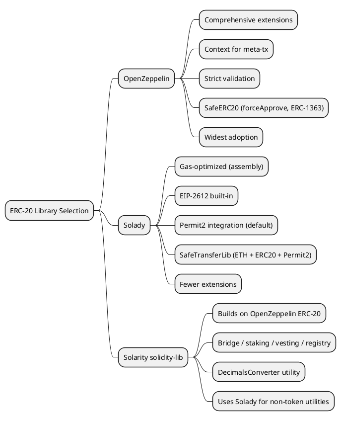

This article provides a formal comparison of ERC-20 token implementations across three Solidity libraries: **OpenZeppelin Contracts v5.5.0**, **Solady v0.1.26**, and **Solarity Solidity Library v3.3.2** (solidity-lib). The analysis evaluates feature sets, gas consumption, architectural choices, developer experience, and selection criteria for production deployment.

> This article was produced with the assistance of [Cursor](https://cursor.com/) and custom skills.

[TOC]

## Scope and Methodology

The versions compared in this article are:

| Library | Version | Commit |
|---------|---------|--------|
| OpenZeppelin Contracts | v5.5.0 | `fcbae539` |
| Solady | v0.1.26 | `acd959aa` |
| Solarity solidity-lib | v3.3.2 | `783a334b` |

Note: Solarity solidity-lib declares `solady: 0.1.24` in its `package.json`. Between Solady v0.1.24 and v0.1.26 (16 commits), the ERC-20 contract (`src/tokens/ERC20.sol`) has **zero changes**. The only token-adjacent change is a new `safeMoveETH` function added to `SafeTransferLib.sol`. All ERC-20 analysis below applies identically to both versions.

The comparison focuses on the core ERC-20 base contracts and their extensions. Solarity solidity-lib does not implement a standalone ERC-20; it depends on OpenZeppelin for token contracts and uses Solady for complementary utilities. The analysis therefore treats solidity-lib as a higher-level library that builds on OpenZeppelin’s ERC-20.

## 1. Architecture Overview

### 1.1 OpenZeppelin Contracts

OpenZeppelin’s ERC-20 uses a modular, inheritance-based design:

```solidity
abstract contract ERC20 is Context, IERC20, IERC20Metadata, IERC20Errors {
    mapping(address account => uint256) private _balances;
    mapping(address account => mapping(address spender => uint256)) private _allowances;
    uint256 private _totalSupply;
    string private _name;
    string private _symbol;
    // ...
}
```

**Design principles:**

- **Context integration**: `_msgSender()` enables meta-transactions and forwarders (e.g. ERC-2771) without altering core logic.
- **Central `_update` hook**: A single internal function handles minting, burning, and transfers. Customizations (fees, hooks) are implemented by overriding `_update`.
- **Standard storage**: Uses Solidity mappings for balances, allowances, and total supply.

### 1.2 Solady

Solady’s ERC-20 is built for low gas usage with a single-contract design:

```solidity
abstract contract ERC20 {
    // Named storage slots via keccak256 seeds
    uint256 private constant _TOTAL_SUPPLY_SLOT = 0x05345cdf77eb68f44c;
    uint256 private constant _BALANCE_SLOT_SEED = 0x87a211a2;
    uint256 private constant _ALLOWANCE_SLOT_SEED = 0x7f5e9f20;
    uint256 private constant _NONCES_SLOT_SEED = 0x38377508;
    // Metadata: abstract, implemented by inheritors
    function name() public view virtual returns (string memory);
    function symbol() public view virtual returns (string memory);
    // ...
}
```

**Design principles:**

- **Named storage slots**: Deterministic slot derivation via constants and `keccak256`, reducing storage layout clashes in proxies.
- **Inline assembly**: Core logic uses Yul for manual optimization.
- **EIP-2612 built-in**: Permit and nonces are part of the base contract.
- **Permit2 integration**: `_givePermit2InfiniteAllowance()` returns `true` by default, granting infinite allowance to Uniswap Permit2.

### 1.3 Solarity Solidity Library

Solidity-lib does not define its own ERC-20 base. It imports OpenZeppelin’s ERC-20 for tokens and uses Solady for non-token utilities:

```solidity
// contracts/mock/tokens/ERC20Mock.sol
import {ERC20} from "@openzeppelin/contracts/token/ERC20/ERC20.sol";

contract ERC20Mock is ERC20 {
    // ...
}
```

Solady is used for `LibBit`, `LibBytes`, `ERC7821`, and related utilities, not for ERC-20. The token strategy is: **OpenZeppelin for core ERC-20; Solady for auxiliary components**.

## 2. Feature Comparison

| Feature | OpenZeppelin | Solady | Solidity-lib |
|---------|--------------|--------|--------------|
| ERC-20 core | ✓ | ✓ | via OpenZeppelin |
| EIP-2612 (Permit) | extension (ERC20Permit) | built-in | via OpenZeppelin |
| Zero address checks | ✓ | ✗ (for gas) | inherits OZ |
| Meta-transaction support | Context | ✗ | via OZ |
| Permit2 integration | ✗ | ✓ (default) | ✗ |
| ERC-6093 custom errors | ✓ | ✓ (different set) | via OZ |
| Safe transfer utility | SafeERC20 | SafeTransferLib | uses SafeERC20 |
| Extensions | Many | Fewer | relies on OZ |

### 2.1 OpenZeppelin Extensions

OpenZeppelin provides a large set of optional extensions:

- **ERC20Permit** — EIP-2612 gasless approvals
- **ERC20Burnable** — Self-burn
- **ERC20Capped** — Supply cap
- **ERC20Pausable** — Pausability
- **ERC20Votes** — Governance and delegation
- **ERC20Wrapper** — Wrapped underlying asset
- **ERC20FlashMint** — ERC-3156 flash loans
- **ERC4626** — Tokenized vaults
- **ERC1363** — Transfer/approval callbacks
- **SafeERC20** — Safe interaction with non-compliant tokens

### 2.2 Solady Extensions

Solady’s token ecosystem includes:

- **ERC20** — Base + EIP-2612
- **ERC20Votes** — ERC-5805 / ERC-6372 voting
- **ERC4626** — Vault standard
- **WETH** — Wrapped Ether

Permit2 infinite allowance is built into the base ERC-20 and can be disabled via `_givePermit2InfiniteAllowance()`.

### 2.3 Solidity-lib Token Usage

Solidity-lib does not redefine ERC-20. It uses OpenZeppelin tokens within domain-specific modules:

- **ERC20Handler** — Bridge handler for cross-chain ERC-20
- **AStaking** — Uses `IERC20` + `SafeERC20`
- **AVesting** — Vesting schedules for ERC-20
- **DecimalsConverter** — Works with arbitrary ERC-20 decimals

All depend on OpenZeppelin’s `ERC20`, `IERC20`, and `SafeERC20`.

A concrete example from `ERC20Handler`:

```solidity
// solidity-lib — ERC20Handler._dispatch
IERC20Crosschain erc20_ = IERC20Crosschain(dispatch_.token);
if (dispatch_.operationType == ERC20BridgingType.Wrapped) {
    erc20_.crosschainBurn(msg.sender, dispatch_.amount);
} else {
    erc20_.safeTransferFrom(msg.sender, address(this), dispatch_.amount);
}
```

And from `DecimalsConverter`, which normalizes amounts to 18 decimals:

```solidity
// solidity-lib — DecimalsConverter
function to18(uint256 amount_, address token_) internal view returns (uint256) {
    return convert(amount_, ERC20(token_).decimals(), 18);
}
```

## 3. Gas Efficiency

### 3.1 Storage and Access Patterns

**OpenZeppelin** uses standard Solidity mappings. The compiler manages storage layout; no manual slot arithmetic is performed.

```solidity
// OpenZeppelin — standard Solidity storage
mapping(address account => uint256) private _balances;
mapping(address account => mapping(address spender => uint256)) private _allowances;
uint256 private _totalSupply;
```

**Solady** derives storage slots from constants and `keccak256` at the assembly level, bypassing the compiler's storage layout entirely:

```solidity
// Solady — manual slot computation in assembly
assembly {
    mstore(0x0c, _BALANCE_SLOT_SEED) // 0x87a211a2
    mstore(0x00, owner)
    result := sload(keccak256(0x0c, 0x20))
}
```

This approach avoids overhead from Solidity's ABI encoding of mapping keys and produces fewer opcodes per storage access.

### 3.2 Approximate Gas Comparison

Gas benchmarks published by the [Conflux documentation](https://doc.confluxnetwork.org/docs/general/build/smart-contracts/gas-optimization/oz-alternatives) compare OpenZeppelin, Solmate, and Solady on identical ERC-20 operations:

| Operation | OpenZeppelin | Solmate | Solady | OZ vs Solady |
|-----------|--------------|---------|--------|--------------|
| Deploy | ~1,500,000 | ~750,000 | ~500,000 | ~66% cheaper |
| transfer | ~51,000 | ~44,000 | ~40,000 | ~22% cheaper |
| approve | ~46,000 | ~44,000 | ~40,000 | ~13% cheaper |
| transferFrom | ~60,000 | ~54,000 | ~50,000 | ~17% cheaper |

A separate [ERC-20 benchmark repository](https://github.com/eugenioclrc/erc20-benchmark) by eugenioclrc measures runtime gas (excluding deployment) more precisely across OpenZeppelin, Solmate, Yul, and Huff:

| Operation | OpenZeppelin | Solmate | Yul | Huff |
|-----------|--------------|---------|-----|------|
| approve | 30,913 | 30,755 | 30,520 | 30,038 |
| transfer | 26,845 | 26,675 | 26,273 | 25,865 |
| transferFrom | 30,106 | 27,876 | 27,077 | 26,668 |
| mint | 52,782 | 52,669 | 52,292 | 51,649 |

Solady sits between Solmate and pure Yul in runtime gas. The deployment cost gap is the most significant: Solady’s assembly-heavy bytecode is roughly one-third the size of OpenZeppelin’s, producing a ~66% deployment savings.

(Exact numbers depend on compiler version, optimizer settings, and `via-ir` pipeline.)

### 3.3 OpenZeppelin Gas Optimizations

OpenZeppelin v5 is not naive about gas. It applies several targeted optimizations:

**1. Approval event suppression in `_approve`**: A `bool emitEvent` flag allows `_spendAllowance` to skip the `Approval` event during `transferFrom`, saving log gas:

```solidity
// OpenZeppelin — _approve with emitEvent flag
function _approve(address owner, address spender, uint256 value, bool emitEvent) internal virtual {
    _allowances[owner][spender] = value;
    if (emitEvent) {
        emit Approval(owner, spender, value);
    }
}
```

**2. Infinite allowance optimization**: `_spendAllowance` skips the storage write when allowance is `type(uint256).max`:

```solidity
function _spendAllowance(address owner, address spender, uint256 value) internal virtual {
    uint256 currentAllowance = allowance(owner, spender);
    if (currentAllowance < type(uint256).max) {
        // Only write to storage if allowance is not infinite
        _approve(owner, spender, currentAllowance - value, false);
    }
}
```

**3. `unchecked` blocks** where overflow/underflow are provably safe (e.g. balance subtraction after a bounds check).

**4. Custom errors (ERC-6093)** instead of string reverts, saving deployment and runtime gas.

### 3.4 Solady Gas Techniques

Solady's `transfer` function illustrates its assembly approach. No zero-address checks, no `Context._msgSender()` indirection, and no Solidity-level overflow protection. Events are emitted with precomputed topic signatures:

```solidity
// Solady — transfer (simplified from source)
function transfer(address to, uint256 amount) public virtual returns (bool) {
    _beforeTokenTransfer(msg.sender, to, amount);
    assembly {
        mstore(0x0c, _BALANCE_SLOT_SEED)
        mstore(0x00, caller())
        let fromBalanceSlot := keccak256(0x0c, 0x20)
        let fromBalance := sload(fromBalanceSlot)
        if gt(amount, fromBalance) {
            mstore(0x00, 0xf4d678b8) // InsufficientBalance()
            revert(0x1c, 0x04)
        }
        sstore(fromBalanceSlot, sub(fromBalance, amount))
        mstore(0x00, to)
        let toBalanceSlot := keccak256(0x0c, 0x20)
        sstore(toBalanceSlot, add(sload(toBalanceSlot), amount))
        mstore(0x20, amount)
        log3(0x20, 0x20, _TRANSFER_EVENT_SIGNATURE, caller(), shr(96, mload(0x0c)))
    }
    _afterTokenTransfer(msg.sender, to, amount);
    return true;
}
```

Every unnecessary opcode is removed.

## 4. Security and Validation

### 4.1 Zero Address Handling

**OpenZeppelin**: Reverts on `transfer` / `transferFrom` when `from` or `to` is `address(0)`.

**Solady**: Explicitly skips these checks for gas. The ERC-20 spec permits transfers to/from the zero address (e.g. mint/burn via `address(0)`); Solady leaves validation to overrides if desired.

### 4.2 Custom Errors

**OpenZeppelin** (IERC20Errors):

- `ERC20InsufficientBalance`, `ERC20InvalidSender`, `ERC20InvalidReceiver`, `ERC20InsufficientAllowance`, `ERC20InvalidApprover`, `ERC20InvalidSpender`

**Solady**:

- `TotalSupplyOverflow`, `AllowanceOverflow`, `AllowanceUnderflow`, `InsufficientBalance`, `InsufficientAllowance`, `InvalidPermit`, `PermitExpired`, `Permit2AllowanceIsFixedAtInfinity`

Both provide structured error handling for off-chain tooling.

### 4.3 Audit History

**OpenZeppelin**: Has one of the most extensive audit histories in the Solidity ecosystem. Multiple audits by independent firms are published for each major version (v4.9, v5.0, v5.1, v5.2, v5.3, v5.4). The library is used in production by the majority of ERC-20 tokens deployed on mainnet.

**Solady**: Has three published audit reports in its repository:

- **Cantina Solady Report** — Cantina’s inaugural public goods security review (June 2023). The scope covered 8 core libraries: `ERC1967Factory`, `ERC20`, `ERC721`, `ERC1155`, `LibClone`, `MerkleProofLib`, `SignatureCheckerLib`, and `ECDSA`. The review was conducted by 2 Lead Security Researchers and 1 Junior Researcher over 3 weeks ([source](https://cantina.xyz/blog/cantinas-inaugural-project-a-security-review-of-solady)).
- **Cantina-Spearbit-Coinbase Solady Report** — A joint review with Spearbit, sponsored by Coinbase.
- **Ackee Blockchain Solady Report** — An additional independent review by Ackee Blockchain.

However, Solady’s **Permit2 integration** (the `_givePermit2InfiniteAllowance` feature and related logic in the base ERC-20) was flagged as a concern in a public decision tracked by the Optimism team. In October 2024, Optimism opened [Issue #12573](https://github.com/ethereum-optimism/optimism/issues/12573) titled *“Track Decision: Solady vs OpenZeppelin for SuperchainERC20 Implementation”* to evaluate whether to use Solady or OpenZeppelin for their SuperchainERC20 contract. The issue states:

> *“The current PR includes a new version of Solady with Permit2 support, which hasn’t been audited yet. After discussing this with @maurelian and @mds1 it has been decided that is acceptable for the devnet phase, but we should revisit the decision before moving to testnet.”*

Action items included:
- Revisiting the Solady vs OZ decision between devnet and testnet phases.
- Ensuring auditors have sufficient experience with assembly if the Solady implementation is included in an audit scope.
- Planning for a potential switch to OZ (which would introduce a “noisy diff”).

The issue was closed on March 18, 2025, with the comment “the decision has been made.” Optimism proceeded with Solady for the SuperchainERC20 production deployment.

**Solidity-lib**: Has published audit reports (e.g. Zero_Cool_Nexus, November 2025). Its token logic is entirely OpenZeppelin-based, so it inherits OpenZeppelin’s audit coverage for the ERC-20 layer.

## 5. Safe Transfer Utilities: SafeERC20 vs SafeTransferLib

Both OpenZeppelin and Solady provide libraries for safely interacting with external ERC-20 tokens that may not follow the standard (e.g. USDT which returns no value).

### 5.1 OpenZeppelin SafeERC20

OpenZeppelin's `SafeERC20` is a Solidity library that wraps `IERC20` calls and handles tokens that return no data:

```solidity
// OpenZeppelin SafeERC20 — handles missing return values
library SafeERC20 {
    function safeTransfer(IERC20 token, address to, uint256 value) internal {
        // Uses assembly to check: call succeeded + (return is true OR returndata is empty + has code)
    }
    function forceApprove(IERC20 token, address spender, uint256 value) internal {
        // Tries approve; if it fails, resets to 0 then retries (for USDT-like tokens)
    }
}
```

Notable features:
- `forceApprove` handles tokens like USDT that require resetting to zero before changing allowance.
- `trySafeTransfer` / `trySafeTransferFrom` variants return `bool` instead of reverting.
- `transferAndCallRelaxed` integrates ERC-1363 callbacks with a fallback to plain transfer for EOAs.

### 5.2 Solady SafeTransferLib

Solady's `SafeTransferLib` covers both ETH and ERC-20 operations, entirely in assembly:

```solidity
// Solady SafeTransferLib — includes ETH + ERC20 + Permit2
library SafeTransferLib {
    function safeTransferFrom(address token, address from, address to, uint256 amount) internal { ... }
    function safeTransfer(address token, address to, uint256 amount) internal { ... }
    function safeApprove(address token, address to, uint256 amount) internal { ... }
    // Also: permit2TransferFrom, forceSafeTransferETH, etc.
}
```

Notable differences:
- Uses `address` for the token parameter (not `IERC20`), accepting raw addresses.
- Includes ETH transfer utilities with configurable gas stipends and DoS protection (`forceSafeTransferETH`).
- Built-in Permit2 helpers (`permit2TransferFrom`, `permit2Approve`, `permit2Lockdown`).
- Defines constants for `WETH9`, `DAI_DOMAIN_SEPARATOR`, and `PERMIT2`.

### 5.3 Solidity-lib Usage

Solidity-lib always uses OpenZeppelin's `SafeERC20`:

```solidity
// solidity-lib — AStaking.sol
import {SafeERC20} from "@openzeppelin/contracts/token/ERC20/utils/SafeERC20.sol";
using SafeERC20 for IERC20;
// ...
IERC20($.sharesToken).safeTransferFrom(user_, address(this), amount_);
```

## 6. Extensibility and Hooks

### 6.1 OpenZeppelin: The `_update` Pattern

OpenZeppelin v5 uses a single central `_update` function as the primary extension point. Both `_mint`, `_burn`, and `_transfer` delegate to it:

```solidity
// OpenZeppelin — _transfer delegates to _update
function _transfer(address from, address to, uint256 value) internal {
    if (from == address(0)) revert ERC20InvalidSender(address(0));
    if (to == address(0)) revert ERC20InvalidReceiver(address(0));
    _update(from, to, value);
}

function _mint(address account, uint256 value) internal {
    if (account == address(0)) revert ERC20InvalidReceiver(address(0));
    _update(address(0), account, value);
}
```

Extensions override `_update`. For example, `ERC20Pausable` adds a `whenNotPaused` modifier:

```solidity
// OpenZeppelin — ERC20Pausable overrides _update
abstract contract ERC20Pausable is ERC20, Pausable {
    function _update(address from, address to, uint256 value) internal virtual override whenNotPaused {
        super._update(from, to, value);
    }
}
```

Similarly, `ERC20Burnable` simply exposes `_burn` publicly without needing to modify hooks at all:

```solidity
// OpenZeppelin — ERC20Burnable
function burn(uint256 value) public virtual {
    _burn(_msgSender(), value);
}

function burnFrom(address account, uint256 value) public virtual {
    _spendAllowance(account, _msgSender(), value);
    _burn(account, value);
}
```

This centralised `_update` design ensures any extension (pausable, capped, votes) can compose cleanly by calling `super._update(...)`.

### 6.2 Solady: Before/After Hooks

Solady uses explicit before/after hooks:

```solidity
// Solady — hooks called in transfer, mint, burn
function _beforeTokenTransfer(address from, address to, uint256 amount) internal virtual {}
function _afterTokenTransfer(address from, address to, uint256 amount) internal virtual {}
```

**Caveat**: Solady's code is heavily inlined for performance. The `transfer`, `transferFrom`, `_mint`, and `_burn` functions each contain their own assembly block. Overriding `_transfer` does *not* affect the code path taken by `transfer` since `transfer` does not call `_transfer`; it has its own inlined implementation. The hooks are the safe extension points.

### 6.3 Solady Permit Optimization

For EIP-2612, Solady exposes a performance hook:

```solidity
function _constantNameHash() internal view virtual returns (bytes32 result) {}
```

If the token name is immutable, overriding this to return `keccak256(bytes(name()))` avoids recomputing the hash in `permit` and `DOMAIN_SEPARATOR`, saving gas on every gasless approval.

## 7. User-Friendliness and Ecosystem

### 7.1 Documentation and Examples

- **OpenZeppelin**: Extensive docs, wizard, upgrade guides, and governance examples.
- **Solady**: Terse, developer-focused docs; assumes familiarity with assembly and storage.
- **Solidity-lib**: Documentation for higher-level patterns (staking, vesting, bridge); token usage is standard OpenZeppelin.

### 7.2 Upgradeability

- **OpenZeppelin**: Storage layout is compatible with proxy patterns; upgradeable contracts (e.g. `ERC20Upgradeable`) are available.
- **Solady**: Named storage slots reduce layout collisions in proxy setups.
- **Solidity-lib**: Uses `ERC20Upgradeable` for upgradeable tokens.

### 7.3 Tooling and Integration

- **OpenZeppelin**: Broad support in Hardhat, Foundry, Etherscan, and third-party tools.
- **Solady**: Well-integrated with Foundry and modern toolchains.
- **Solidity-lib**: Integrates with both (`@openzeppelin/contracts` 5.4.0, `solady` 0.1.24).

## 8. Selection Criteria Summary

| Criterion | OpenZeppelin | Solady | Solidity-lib |
|-----------|--------------|--------|--------------|
| **Gas sensitivity** | Good | Best | depends on OZ |
| **Safety checks** | Strict | Minimal (configurable) | inherits OZ |
| **Extensions** | Most | Moderate | via OZ |
| **Permit2** | No | Yes (default) | No |
| **Meta-tx / Context** | Yes | No | via OZ |
| **Readability** | High | Lower (assembly) | high |
| **Proxy-friendly** | Yes | Yes (slot-based) | via OZ |
| **Audit history** | Very strong | Strong | Via OZ + own audits |

## 9. Recommendations

**Choose OpenZeppelin when:**

- You need full validation, meta-transactions, or a rich set of extensions.
- Maximum audit coverage and ecosystem support matter.
- Readability and maintainability are priorities over marginal gas savings.

**Choose Solady when:**

- Gas cost is critical (e.g. high-volume transfers, token deployments).
- Permit2 integration is desired by default.
- You are comfortable with assembly and named storage patterns.

**Use Solidity-lib when:**

- You are building staking, vesting, bridging, registries, or similar patterns that already depend on it.
- You want to use OpenZeppelin’s ERC-20 within a larger framework and benefit from Solady utilities elsewhere.

## Conclusion

The three libraries follow different philosophies: OpenZeppelin favors safety, modularity, and a broad ecosystem; Solady favors gas optimization and modern integrations like Permit2; Solidity-lib focuses on application-level patterns and builds on OpenZeppelin for tokens. The right choice depends on gas targets, risk tolerance, required extensions, and integration needs (e.g. Permit2, meta-transactions). Projects can also combine them: Solidity-lib’s use of OpenZeppelin for ERC-20 and Solady for utilities demonstrates that approach.




## References

- Library
  - [OpenZeppelin Contracts v5 — ERC-20](https://docs.openzeppelin.com/contracts/5.x/erc20)
  - [Solady ERC20](https://github.com/vectorized/solady/blob/main/src/tokens/ERC20.sol)
  - [Solarity Solidity Library](https://github.com/dl-solarity/solidity-lib)
- [ERC-20 Token Standard (EIP-20)](https://eips.ethereum.org/EIPS/eip-20)
- [EIP-2612: Permit Extension](https://eips.ethereum.org/EIPS/eip-2612)
- [Uniswap Permit2](https://github.com/Uniswap/permit2)
- [Conflux — Alternatives to OpenZeppelin (gas benchmarks)](https://doc.confluxnetwork.org/docs/general/build/smart-contracts/gas-optimization/oz-alternatives)
- [eugenioclrc/erc20-benchmark](https://github.com/eugenioclrc/erc20-benchmark)
- [Cantina — Solady Security Review](https://cantina.xyz/blog/cantinas-inaugural-project-a-security-review-of-solady)
- [Optimism — Track Decision: Solady vs OpenZeppelin for SuperchainERC20 (Issue #12573)](https://github.com/ethereum-optimism/optimism/issues/12573)
