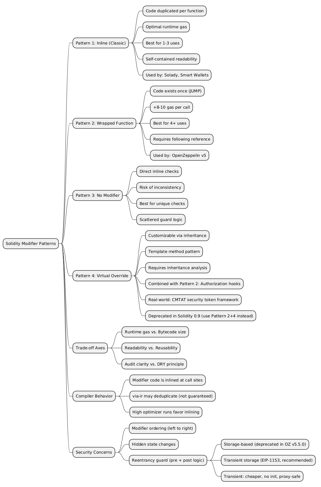

Solidity modifiers are the primary mechanism for enforcing access control and precondition checks in smart contracts. While the language provides a single `modifier` keyword, the community has developed several distinct patterns for organizing modifier logic. Each pattern makes different trade-offs between gas efficiency, bytecode size, code readability, and auditability.

This article examines the three main approaches, explains how the Solidity compiler handles each one, and provides guidance on when to use which pattern.

> This article has been made with the help of [Claude Code](https://claude.com/product/claude-code) and several custom skills

[TOC]

## How the Solidity Compiler Handles Modifiers

Before comparing patterns, it is essential to understand what the compiler does with modifiers.

When a modifier is applied to a function, the compiler **inlines** the modifier's code into the function body. The `_;` placeholder is replaced by the function's actual logic. If the same modifier is applied to multiple functions, the modifier's bytecode is **duplicated** in each one.

Consider:

```solidity
modifier onlyOwner() {
    if (msg.sender != owner) revert Unauthorized();
    _;
}

function transferOwnership(address newOwner) external onlyOwner { ... }
function withdraw() external onlyOwner { ... }
function pause() external onlyOwner { ... }
```

The compiler produces three separate copies of the `if (msg.sender != owner) revert Unauthorized()` check — one embedded in each function's bytecode. This duplication is invisible in the source code but directly affects the deployed contract size.

## Pattern 1: Inline Modifier (Classic)

This is the traditional Solidity pattern. The modifier contains the full guard logic directly in its body.

```solidity
modifier onlyOwner() {
    if (msg.sender != owner) revert Unauthorized();
    _;
}

function withdraw() external onlyOwner {
    // ...
}
```

### How it compiles

The guard logic is copied into every function that uses the modifier. For N functions using `onlyOwner`, the bytecode contains N copies of the check.

### Characteristics

- **Runtime gas**: Optimal. No extra function call overhead. The check executes inline as if it were written directly at the top of each function.
- **Deployment gas**: Increases with each additional use of the modifier, because the bytecode grows.
- **Bytecode size**: Grows linearly with usage count. For a simple owner check (~30 bytes of EVM bytecode), three uses add ~60 extra bytes compared to a single-copy approach.
- **Readability**: The modifier is self-contained. A reader sees the complete guard logic without following references.

## Pattern 2: Wrapped Internal Function (OpenZeppelin v5)

This pattern moves the guard logic into a separate `internal` function and has the modifier call it. The modifier body contains only the function call and the `_;` placeholder.

```solidity
modifier onlyOwner() {
    _checkOwner();
    _;
}

function _checkOwner() internal view {
    if (msg.sender != owner) revert Unauthorized();
}

function withdraw() external onlyOwner {
    // ...
}
```

### How it compiles

The `_checkOwner()` function body exists once in the deployed bytecode. Each function using the modifier gets a `JUMP` to `_checkOwner()` instead of a full copy of the guard logic. The modifier still gets inlined, but its inlined body is now just a function call (~3 bytes: PUSH address + JUMP), not the full check.

### Characteristics

- **Runtime gas**: Slightly higher than inline. Each call pays an extra JUMP/JUMPDEST (~8-10 gas). This is negligible for most applications but measurable in gas-sensitive hot paths.
- **Deployment gas**: Lower when the modifier is used on 2+ functions. The guard logic exists once instead of N times.
- **Bytecode size**: The break-even point is typically 2 uses. With a ~30-byte guard, wrapping saves roughly `(N - 1) * 30 - overhead` bytes, where overhead is the internal function's JUMPDEST setup (~10-15 bytes).
- **Readability**: Requires following a reference to understand what the modifier does. The modifier declaration alone does not reveal the guard logic.

### Why OpenZeppelin v5 adopted this pattern

OpenZeppelin v5 systematically moved to wrapped functions across all contracts. For example, `Ownable` uses `_checkOwner()`, `ReentrancyGuard` uses `_reentrancyGuardEntered()`, and `Pausable` uses `_requireNotPaused()`. The primary motivation was bytecode reduction: OpenZeppelin contracts are used as base classes, and their modifiers can appear on many functions in derived contracts. With inheritance hierarchies that apply `onlyOwner` or `whenNotPaused` to dozens of functions, the bytecode savings are substantial.

## Pattern 3: No Modifier (Direct Inline Check)

This pattern eliminates modifiers entirely and places the guard logic directly in each function body.

```solidity
function withdraw() external {
    if (msg.sender != owner) revert Unauthorized();
    // ...
}

function pause() external {
    if (msg.sender != owner) revert Unauthorized();
    // ...
}
```

### Characteristics

- **Runtime gas**: Same as the inline modifier pattern. The check executes as inline code.
- **Deployment gas**: Same bytecode duplication problem as inline modifiers, without the syntactic benefit.
- **Bytecode size**: Same as Pattern 1 — the check is duplicated in every function.
- **Readability**: Each function explicitly shows its preconditions. No need to look up modifier definitions. However, the access control logic is scattered across the codebase rather than centralized.
- **Consistency risk**: Each function independently implements the check. If the check needs to change (e.g., adding a new authorized role), every function must be updated individually. Missing one function creates a vulnerability.

### When it appears

This pattern is common in minimal contracts or in functions with unique preconditions that do not repeat elsewhere. It is generally discouraged for shared checks like access control because of the consistency risk.

## Pattern 4: Virtual Modifier with Override

> **Deprecation notice**: The Solidity team has announced that virtual modifiers are planned for removal in the upcoming 0.9 breaking release. The [Road to Core Solidity](https://www.soliditylang.org/blog/2025/10/21/the-road-to-core-solidity/) blog post lists "virtual modifiers" among the obsolete language features to be dropped alongside `.send()`/`.transfer()`. Projects currently relying on virtual modifiers should migrate to the wrapped function pattern (Pattern 2), where the modifier calls a `virtual` internal function instead. This achieves the same extensibility without requiring the modifier itself to be virtual.

Modifiers in Solidity can be declared `virtual` and overridden in derived contracts, enabling customizable access control through inheritance.

```solidity
// Base contract
abstract contract Guarded {
    modifier onlyAuthorized() virtual {
        if (msg.sender != _getAuthorized()) revert Unauthorized();
        _;
    }

    function _getAuthorized() internal view virtual returns (address);
}

// Derived contract
contract MyContract is Guarded {
    address public admin;

    function _getAuthorized() internal view override returns (address) {
        return admin;
    }

    function sensitiveAction() external onlyAuthorized {
        // ...
    }
}
```

### Combining Patterns 2 and 4: The Authorization Hook

In practice, Patterns 2 and 4 are often combined. The modifier calls an `internal virtual` function that serves as an authorization hook. Concrete contracts override the hook to plug in their chosen access control model — RBAC, ownership, an external policy engine, or any other mechanism.

```solidity
// Module: defines behavior, delegates authorization
abstract contract PauseModule is Pausable {
    modifier onlyPauseManager() {
        _authorizePause();
        _;
    }

    function pause() public virtual onlyPauseManager {
        _pause();
    }

    function _authorizePause() internal virtual;
}

// Wiring: plugs in RBAC
contract RBACPause is PauseModule, AccessControl {
    function _authorizePause() internal view override onlyRole(PAUSER_ROLE) {}
}

// Alternative wiring: plugs in ownership
contract OwnablePause is PauseModule, Ownable {
    function _authorizePause() internal view override onlyOwner {}
}
```

This pattern separates business logic (what happens when you pause) from authorization policy (who is allowed to pause). Modules remain agnostic to the access control mechanism, and deployments choose their policy by overriding the hooks. This is particularly valuable for open-source libraries where different users may require different access control models without rewriting core logic.

For a detailed case study of this pattern applied to a security token framework, see [Flexible Access Control in Smart Contracts (CMTAT)](https://rya-sge.github.io/access-denied/2026/01/27/cmtat-access-control/).

### Characteristics

- **Runtime gas**: Same as inline plus the cost of the virtual function call (JUMP to the overridden implementation).
- **Flexibility**: Derived contracts can customize the authorization logic without rewriting the modifier. This is the template method pattern applied to Solidity modifiers.
- **Auditability trade-off**: The modifier's behavior depends on which contract in the inheritance chain provides the override. Auditors must trace the full inheritance tree to determine what `_getAuthorized()` returns at runtime.
- **Forward compatibility**: Virtual modifiers are slated for removal in Solidity 0.9. The combined Pattern 2 + 4 approach (modifier calling a `virtual` internal function) provides the same extensibility and is future-proof.

## Comparison Summary

| Criterion | Inline (Classic) | Wrapped Function (OZ v5) | No Modifier | Virtual Override |
|---|---|---|---|---|
| **Runtime gas** | Optimal | +8-10 gas per call | Optimal | +8-10 gas (virtual call) |
| **Bytecode size** | Grows with N uses | Near-constant | Grows with N uses | Grows with N uses |
| **Deployment gas** | Higher with N uses | Lower with N ≥ 2 | Higher with N uses | Higher with N uses |
| **Readability** | Self-contained | Requires following reference | Explicit per function | Requires tracing inheritance |
| **Consistency** | Centralized | Centralized | Scattered (risky) | Centralized but dynamic |
| **Auditability** | Immediate | One level of indirection | Immediate but fragile | Requires full inheritance analysis |

## Impact of Compiler Optimizations

### The `via-ir` Pipeline

Foundry projects commonly enable the `via-ir` optimization pipeline with high optimizer runs (e.g., 999,999). The Yul-based IR optimizer can **deduplicate identical code sequences**, which partially mitigates the bytecode growth of inline modifiers.

However, this deduplication is not guaranteed. The optimizer makes heuristic decisions based on code size and call frequency. Relying on the optimizer to solve bytecode bloat is fragile — a seemingly unrelated code change can cause the optimizer to make different decisions and re-inline previously deduplicated code.

The wrapped function pattern provides **deterministic** bytecode savings that do not depend on optimizer behavior.

### Optimizer Runs Parameter

The `runs` parameter (e.g., `optimizer_runs = 999999`) tells the compiler to optimize for **runtime gas** at the expense of **deployment gas**. High values favor inlining. This means the optimizer may actually **undo** the wrapped function pattern's bytecode savings by inlining the internal function back into each call site.

In practice, the internal function is usually small enough that the optimizer preserves the JUMP rather than inlining it, but this is an implementation detail rather than a guarantee.

## Convention Analysis

### OpenZeppelin v5

Consistently uses the wrapped function pattern:

```solidity
// Ownable.sol
modifier onlyOwner() {
    _checkOwner();
    _;
}

function _checkOwner() internal view virtual {
    if (owner() != _msgSender()) {
        revert OwnableUnauthorizedAccount(_msgSender());
    }
}
```

The `_check*` naming convention signals that the function is a guard. Making it `virtual` allows derived contracts to customize ownership checks without overriding the modifier itself.

### Solady

Uses inline modifiers for gas optimization. Solady prioritizes minimal runtime gas cost over bytecode size:

```solidity
modifier onlyOwner() virtual {
    if (msg.sender != owner()) revert Unauthorized();
    _;
}
```

Solady's design philosophy targets contracts where every gas unit matters (e.g., high-frequency DeFi operations).

### CMTAT (Security Token Framework)

CMTAT uses the combined Pattern 2 + 4 approach (authorization hooks) across its entire module system. Each module (pause, mint, burn, documents, snapshots, enforcement) defines modifiers that delegate to `internal virtual` functions (`_authorizePause`, `_authorizeMint`, etc.). A dedicated base contract (`CMTATBaseAccessControl`) overrides all hooks with RBAC policy. This architecture allows the same tokenization modules to work with different access control models — roles, ownership, `AccessManager`, or external policy contracts — without modifying module code. See [Flexible Access Control in Smart Contracts (CMTAT)](https://rya-sge.github.io/access-denied/2026/01/27/cmtat-access-control/) for a full walkthrough.

### Major Smart Accounts

Account abstraction wallets (Coinbase Smart Wallet, Safe, Light Account) use inline modifiers for access control guards. These contracts have a small, fixed set of external functions (typically 3-5), so the bytecode duplication from inline modifiers is minimal and the readability benefit of self-contained guards is valuable during security audits.

## When to Use Which Pattern

### Use Inline Modifiers When

- The modifier is applied to **1-3 functions** — bytecode duplication is negligible.
- The contract is **security-critical** and will undergo manual audits — self-contained modifiers reduce the cognitive load for reviewers.
- **Runtime gas** is the primary concern (e.g., functions called frequently in DeFi protocols).
- The contract is **final** (not designed as a base for inheritance) — no risk of modifier duplication across a deep hierarchy.

### Use Wrapped Functions When

- The modifier is applied to **4+ functions** — bytecode savings become significant.
- The contract is a **library or base class** intended for inheritance (e.g., OpenZeppelin contracts) — derived contracts may add more functions using the same modifier.
- **Deployment gas** or **contract size limits** (the 24KB EIP-170 limit) are a concern.
- The guard logic is **complex** (multi-line, involving storage reads) — duplicating it wastes more bytecode.

### Use No Modifier When

- The check is **unique** to a single function and will never be reused.
- The function has **complex preconditions** that do not fit cleanly into a modifier (e.g., checks involving multiple function parameters).

### Use Virtual Modifiers When

- The contract is designed as an **abstract base** where derived contracts must provide their own authorization logic.
- The access control mechanism is expected to **vary** across deployments (e.g., a module system where different modules implement different authorization strategies).

> **Note**: Since virtual modifiers are planned for removal in Solidity 0.9, prefer the combined approach (Pattern 2 + 4) for new code: use a non-virtual modifier that calls a `virtual` internal function. This achieves the same result and will not require migration when 0.9 lands.

## Security Considerations

### Modifier Ordering

When multiple modifiers are applied to a function, they execute in **left-to-right order**:

```solidity
function sensitiveAction() external onlyOwner whenNotPaused {
    // onlyOwner runs first, then whenNotPaused, then the function body
}
```

Reordering modifiers can change behavior if one modifier has side effects (e.g., reentrancy guards). Auditors should verify that modifier ordering is intentional and consistent.

### Reentrancy Guards

The `nonReentrant` modifier is a special case: its guard logic must execute **both before and after** the function body (to set and clear the reentrancy flag). This is achieved using code on both sides of `_;`.

#### OpenZeppelin v5.5.0: Wrapped Function Pattern

OpenZeppelin uses the wrapped function pattern for both its reentrancy guard implementations. The modifier delegates to two `private` functions:

```solidity
modifier nonReentrant() {
    _nonReentrantBefore();
    _;
    _nonReentrantAfter();
}
```

This is a natural fit for Pattern 2: the pre-check and post-cleanup logic each exist once in bytecode, and the modifier inlines only two function calls plus the `_;` placeholder. OpenZeppelin also provides a `nonReentrantView` modifier for view functions that only checks the flag without modifying it.

#### Storage-Based `ReentrancyGuard` (Deprecated)

The classic implementation uses persistent storage with `SLOAD`/`SSTORE`:

```solidity
// ReentrancyGuard.sol (v5.5.0) — deprecated, will be removed in v6.0
uint256 private constant NOT_ENTERED = 1;
uint256 private constant ENTERED = 2;

function _nonReentrantBefore() private {
    if (_reentrancyGuardEntered()) revert ReentrancyGuardReentrantCall();
    _reentrancyGuardStorageSlot().getUint256Slot().value = ENTERED;
}

function _nonReentrantAfter() private {
    _reentrancyGuardStorageSlot().getUint256Slot().value = NOT_ENTERED;
}
```

The `uint256` values 1 and 2 (rather than 0 and 1) are a gas optimization: writing non-zero to non-zero with `SSTORE` avoids the cold-to-warm penalty and triggers a gas refund (see [EIP-2200](https://eips.ethereum.org/EIPS/eip-2200)). This requires a constructor to initialize the slot to `NOT_ENTERED` (1). The storage slot itself uses [ERC-7201](https://eips.ethereum.org/EIPS/eip-7201) namespaced storage.

#### Transient Storage `ReentrancyGuardTransient` (Recommended)

The transient variant uses `TLOAD`/`TSTORE` (EIP-1153), available since the Dencun upgrade:

```solidity
// ReentrancyGuardTransient.sol (v5.5.0) — recommended
function _nonReentrantBefore() private {
    if (_reentrancyGuardEntered()) revert ReentrancyGuardReentrantCall();
    _reentrancyGuardStorageSlot().asBoolean().tstore(true);
}

function _nonReentrantAfter() private {
    _reentrancyGuardStorageSlot().asBoolean().tstore(false);
}

function _reentrancyGuardEntered() internal view returns (bool) {
    return _reentrancyGuardStorageSlot().asBoolean().tload();
}
```

#### Impact of Transient Storage on the Modifier Pattern

Transient storage does not change the modifier pattern itself — both variants use the same wrapped function structure. However, it significantly simplifies the implementation behind the modifier:

| Aspect | Storage-based (`SSTORE`) | Transient (`TSTORE`) |
|---|---|---|
| **Gas cost per call** | ~2,900–5,000 gas (SSTORE warm write × 2) | ~200 gas (TLOAD + TSTORE at 100 gas each) |
| **Initialization** | Requires constructor (`value = NOT_ENTERED`) | None — transient storage starts at zero each transaction |
| **Values** | `uint256` (1 = not entered, 2 = entered) for refund optimization | `bool` (false/true) — no refund tricks needed |
| **Proxy compatibility** | Problematic — constructor runs on implementation, not proxy | No issue — no initialization needed |
| **Cleanup** | Writes `NOT_ENTERED` (1) back to storage, triggers refund | Automatic — transient storage resets at transaction end |
| **Requires** | Any EVM version | EIP-1153 (Dencun upgrade, Solidity ≥ 0.8.24) |

The key insight is that transient storage eliminates two complexities that shaped the traditional reentrancy guard design:

1. **No gas refund optimization needed**: The classic 1/2 value pattern (instead of 0/1) exists solely to exploit `SSTORE` gas refund mechanics. With `TSTORE` at a flat 100 gas, a simple boolean suffices.
2. **No initialization required**: Transient storage resets to zero at the start of each transaction. There is no need for a constructor or initializer, which eliminates the proxy compatibility issue entirely. This is why `ReentrancyGuardUpgradeable` was deprecated in v5.5.0.

The modifier pattern choice (wrapped functions) remains the same because the fundamental structure — pre-check, execute, post-cleanup — is inherent to reentrancy protection regardless of the storage backend. What changes is that the wrapped functions become simpler, cheaper, and require no setup.

### Modifier as Hidden State Changes

Modifiers can contain state-changing logic that is not visible at the function signature level. This is a known audit concern:

```solidity
modifier consumesNonce() {
    nonces[msg.sender]++;
    _;
}
```

A reader of `function claim() external consumesNonce` may not realize the function modifies state beyond what the function body shows. This is equally true for both inline and wrapped patterns, but the wrapped pattern makes it slightly easier to audit by centralizing the state change in a named function.

## Conclusion

The choice between modifier patterns is not purely technical — it reflects priorities. 

- Contracts optimized for audit clarity and minimal surface area (smart wallets, core protocol contracts) favor inline modifiers. 
- Contracts optimized for reuse and bytecode efficiency (OpenZeppelin libraries, large protocol suites) favor wrapped functions.

The key insight is that the Solidity compiler inlines modifier code at every call site. Understanding this behavior makes the trade-offs between patterns concrete and measurable rather than stylistic.

For most application-level contracts with a small number of guarded functions, inline modifiers remain the simpler and more auditable choice. For base contracts and libraries where the same modifier may appear on dozens of inherited functions, the wrapped function pattern provides meaningful bytecode savings with a minor readability cost.



```
@startmindmap
* Solidity Modifier Patterns
** Pattern 1: Inline (Classic)
*** Code duplicated per function
*** Optimal runtime gas
*** Best for 1-3 uses
*** Self-contained readability
*** Used by: Solady, Smart Wallets
** Pattern 2: Wrapped Function
*** Code exists once (JUMP)
*** +8-10 gas per call
*** Best for 4+ uses
*** Requires following reference
*** Used by: OpenZeppelin v5
** Pattern 3: No Modifier
*** Direct inline checks
*** Risk of inconsistency
*** Best for unique checks
*** Scattered guard logic
** Pattern 4: Virtual Override
*** Customizable via inheritance
*** Template method pattern
*** Requires inheritance analysis
*** Combined with Pattern 2: Authorization hooks
*** Real-world: CMTAT security token framework
*** Deprecated in Solidity 0.9 (use Pattern 2+4 instead)
** Trade-off Axes
*** Runtime gas vs. Bytecode size
*** Readability vs. Reusability
*** Audit clarity vs. DRY principle
** Compiler Behavior
*** Modifier code is inlined at call sites
*** via-ir may deduplicate (not guaranteed)
*** High optimizer runs favor inlining
** Security Concerns
*** Modifier ordering (left to right)
*** Hidden state changes
*** Reentrancy guard (pre + post logic)
**** Storage-based (deprecated in OZ v5.5.0)
**** Transient storage (EIP-1153, recommended)
**** Transient: cheaper, no init, proxy-safe
@endmindmap
```

## Reference

- [Claude Code](https://claude.com/product/claude-code)
- [Solidity Documentation — Modifiers](https://docs.soliditylang.org/en/latest/contracts.html#function-modifiers)
- [OpenZeppelin Contracts v5 — Ownable](https://github.com/OpenZeppelin/openzeppelin-contracts/blob/master/contracts/access/Ownable.sol)
- [OpenZeppelin — AccessManaged](https://docs.openzeppelin.com/contracts/5.x/api/access#AccessManaged)
- [Solady — Ownable](https://github.com/Vectorized/solady/blob/main/src/auth/Ownable.sol)
- [Flexible Access Control in Smart Contracts (CMTAT)](https://rya-sge.github.io/access-denied/2026/01/27/cmtat-access-control/) — Case study of the authorization hook pattern (Pattern 2 + 4) applied to a security token framework
- [The Road to Core Solidity](https://www.soliditylang.org/blog/2025/10/21/the-road-to-core-solidity/) — Solidity team roadmap announcing virtual modifier removal in 0.9
- [OpenZeppelin ReentrancyGuard v5.5.0](https://github.com/OpenZeppelin/openzeppelin-contracts/blob/master/contracts/utils/ReentrancyGuard.sol) — Storage-based reentrancy guard (deprecated)
- [OpenZeppelin ReentrancyGuardTransient v5.5.0](https://github.com/OpenZeppelin/openzeppelin-contracts/blob/master/contracts/utils/ReentrancyGuardTransient.sol) — Transient storage reentrancy guard (recommended)
- [EIP-1153 — Transient Storage Opcodes](https://eips.ethereum.org/EIPS/eip-1153)
- [EIP-170 — Contract Code Size Limit](https://eips.ethereum.org/EIPS/eip-170)
- [Foundry Book — Forge Lint](https://book.getfoundry.sh/reference/forge/forge-lint)
