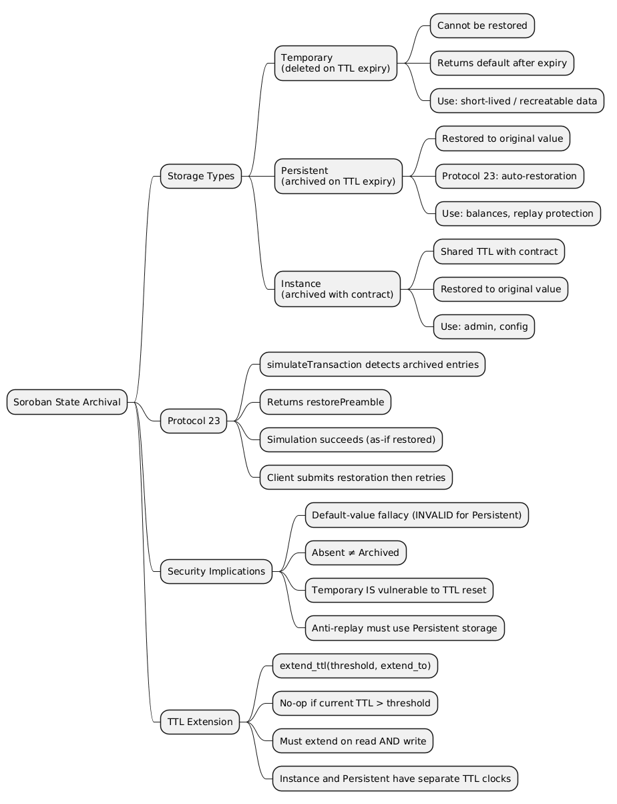

Soroban, Stellar's smart contract platform, introduces a storage model that differs fundamentally from EVM-based chains. Rather than relying on persistent world-state, Soroban enforces a Time-To-Live (TTL) mechanism on every piece of contract data. Understanding how storage entries transition between live, archived, and deleted states is essential for both contract development and security auditing — particularly when reasoning about replay protection, nonce tracking, and boolean flag invariants.

> This article has been made with the help of [Claude Code](https://claude.com/product/claude-code) and several custom skills
> This article has been made during the LayerZero contest on code4rena: 
>
> - [code4rena.com/audits/2026-04-layerzero-stellar-endpoint](https://code4rena.com/audits/2026-04-layerzero-stellar-endpoint)
> - [github.com/code-423n4/2026-04-layerzero](https://github.com/code-423n4/2026-04-layerzero)

[TOC]

## Storage Types in Soroban

Soroban provides three distinct storage tiers, each with different TTL behaviour and archival semantics:

| Storage Type | On TTL expiry | Restorable? | Typical use |
|---|---|---|---|
| `Temporary` | Permanently deleted | No | Price oracle snapshots, session tokens, nonces with bounded lifetime |
| `Persistent` | Archived | Yes | User balances, anti-replay sets, long-lived state |
| `Instance` | Archived (with contract) | Yes | Admin address, contract configuration |

All three are accessed via `env.storage().temporary()`, `env.storage().persistent()`, and `env.storage().instance()` respectively. Their interfaces are identical — they differ only in TTL behaviour and fees.

```rust
use soroban_sdk::{contracttype, Env};

#[contracttype]
pub enum DataKey {
    UsedHash,
    Balance(Address),
    Admin,
}

// Persistent — survives archival, can be restored
env.storage().persistent().set(&DataKey::Balance(user.clone()), &amount);

// Temporary — permanently deleted after TTL
env.storage().temporary().set(&DataKey::UsedHash, &true);

// Instance — shares TTL with the contract instance
env.storage().instance().set(&DataKey::Admin, &admin);
```

Each `Temporary` and `Persistent` entry has its own individual TTL and must be extended independently. `Instance` entries share a single TTL with the contract instance itself.

## TTL Mechanics

Every storage entry has a `liveUntilLedger` field. The TTL is the number of ledgers remaining until `current_ledger > liveUntilLedger`. Once that condition is true, the entry either archives (`Persistent`, `Instance`) or is deleted permanently (`Temporary`).

TTL extension is done explicitly via `extend_ttl`:

```rust
// Extend only if current TTL is below threshold, up to extend_to ledgers
env.storage().persistent().extend_ttl(&key, threshold, extend_to);
env.storage().instance().extend_ttl(threshold, extend_to);
```

The call is a no-op if the current TTL already exceeds the threshold — it never shortens a TTL. External actors can also extend TTLs via the `ExtendFootprintTTLOp` operation without invoking the contract.

The maximum allowed TTL and the minimum TTL applied on creation or restoration are both network parameters; refer to the Stellar Lab resource limits table for current values. The minimum TTL on restoration for persistent entries is `current_ledger_number + 4095` ledgers.

## The Three States of a Persistent Entry

A `Persistent` entry transitions through three distinct states:

```
[never written]  ──write()──►  [Live]
                                  │
                           TTL expires
                                  │
                                  ▼
                             [Archived]
                                  │
                        RestoreFootprintOp /
                        InvokeHostFunction
                        auto-restoration
                                  │
                                  ▼
                              [Live]  (original value preserved)
```

| State | Cause | `get()` result |
|---|---|---|
| **Absent** | Key was never written | Returns `#[default]` value |
| **Live** | Written; TTL still valid | Returns stored value |
| **Archived** | Written; TTL expired | Auto-restored to original value (Protocol 23+), or tx fails if simulation bypassed |

The critical distinction is between **Absent** and **Archived**. Reading an absent key returns whatever default the contract defines. Reading an archived key does not — the entry is recovered first.

## Protocol 23: Automatic Restoration

Prior to Protocol 23, accessing an archived persistent entry caused the transaction to fail at the apply stage before any contract code executed. Developers had to manually submit a `RestoreFootprintOp` transaction first. Starting Protocol 23 ([CAP-0066](https://github.com/stellar/stellar-protocol/blob/master/core/cap-0066.md), Soroban In-Memory Read Resource), this process is largely automated.

When a transaction simulation (`simulateTransaction` RPC) detects that the transaction's access path includes an archived entry, it:

1. Adds the entry to the transaction's restore list
2. Returns a `restorePreamble` structure alongside the normal simulation result
3. Signals to the client that restoration is needed before submission

Crucially, the simulation **does not fail** — it returns results as if restoration were already complete, and includes a `restorePreamble` structure (restoration footprint + fee) in the response. Standard Stellar SDK tooling handles the two resulting paths:

**Path A — Auto-restoration within `InvokeHostFunction` (standard):**

```
simulateTransaction(tx)
  ├─ detects archived entry → adds it to restore list in SorobanTransactionData
  ├─ returns restorePreamble (fee info)
  └─ returns invocation result AS IF restored

client assembles InvokeHostFunction tx
  └─ SorobanTransactionData includes restore list from simulation

InvokeHostFunction executes on-chain
  ├─ archived entries in restore list are restored FIRST (original value)
  └─ host function runs normally
```

**Path B — Separate `RestoreFootprintOp` (fallback):**

```
simulateTransaction(tx) → returns restorePreamble

client submits RestoreFootprintOp (using restorePreamble footprint)
  └─ archived entry → Live (original value restored)

client retries original tx
  └─ contract runs normally
```

`RestoreFootprintOp` as a separate transaction is used when auto-restoration would make the `InvokeHostFunction` transaction too large for network limits, or when the developer wants to pay restoration fees independently from users. Starting Protocol 23, `RestoreFootprintOp` is largely superseded by Path A for typical usage.

The apply-stage failure behaviour still applies when a transaction is built manually without running simulation and the archived entry is not included in the restore list. In practice, any client using the standard simulation flow will not encounter this.

## Restoration Preserves Original Value

A restored entry returns to its original stored value — it is not reset to the type's `#[default]`. This is confirmed by the Stellar documentation:

> "Archived persistent entries can never be re-created. They must instead be restored."

This distinction has direct security implications.

## Security Implications: The Default-Value Fallacy

A common error in security analysis of Soroban contracts is the following reasoning:

> "If a `Persistent` entry has `#[default(false)]` and its TTL expires, reading it will return `false` — allowing an attacker to bypass any check that depends on the entry being `true`."

This reasoning is **incorrect**. The `#[default]` path is only reached for **absent** keys (keys that have never been written). For archived keys, the original value is preserved on restoration.

Consider an anti-replay set implemented with persistent storage:

```rust
#[contracttype]
pub enum DataKey {
    UsedHash(BytesN<32>),
}

fn is_hash_used(env: &Env, hash: &BytesN<32>) -> bool {
    env.storage()
        .persistent()
        .get::<_, bool>(&DataKey::UsedHash(hash.clone()))
        .unwrap_or(false)   // false only for ABSENT keys (never written)
}

fn mark_hash_used(env: &Env, hash: &BytesN<32>) {
    env.storage()
        .persistent()
        .set(&DataKey::UsedHash(hash.clone()), &true);
}
```

After a hash is recorded as `true`:

- TTL expires → entry archives (value `true` is preserved in ledger state)
- Attacker attempts to replay the same hash
- Simulation detects the archived entry → restoration restores `true`
- `used_hash()` returns `true` → replay is rejected

There is no viable path for the attacker to reach the `false` default. The only scenario where `false` is returned is when the hash was **never used** — which is the intended semantics.

## Temporary Storage: A Different Story

`Temporary` entries behave entirely differently. When their TTL expires, they are **permanently deleted from the ledger**. They cannot be restored. Reading a deleted `Temporary` entry returns the `#[default]` value immediately.

```rust
// This IS vulnerable to TTL expiry
env.storage().temporary().set(&nonce_key, &true);

// ... TTL expires after enough ledgers pass — entry is permanently deleted ...

// get() returns Option<bool>; unwrap_or(false) produces false for a deleted key
let used: bool = env.storage()
    .temporary()
    .get::<_, bool>(&nonce_key)
    .unwrap_or(false); // returns false — entry was deleted, not archived
// → replay succeeds: the nonce appears unused
```

For any security-critical boolean flag or anti-replay set, `Persistent` storage must be used. `Temporary` is appropriate only for data that can be safely recreated or that has a bounded validity window by design (e.g., price oracle snapshots, short-lived session authorizations).

## Practical Audit Checklist

When auditing Soroban smart contracts for TTL-related vulnerabilities, apply the following checks:

**Storage type correctness:**
- [ ] Is anti-replay state stored as `Persistent`? If `Temporary`, it is permanently deleted on expiry — flag as a finding.
- [ ] Are nonces or one-time-use flags stored in `Persistent`? If not, assess the risk of TTL-expiry reset.
- [ ] Is configuration or admin state stored in `Instance`? `Instance` entries archive with the contract, providing stronger guarantees than individual `Persistent` entries.

**TTL extension:**
- [ ] Does the contract extend TTL on every write to a `Persistent` entry? Missing TTL extension causes entries to archive after the initial minimum TTL.
- [ ] Is TTL extended on reads as well as writes, where entries are read without modification?
- [ ] Does the contract instance itself extend TTL? `Instance` and `Persistent` have separate TTL clocks.

**Default-value reasoning:**
- [ ] Does any security invariant depend on a `Persistent` entry returning its `#[default]` after TTL expiry? If so, the invariant is unsound — archived entries are restored to original value.
- [ ] Is the `#[default]` value safe to return for **absent** keys? Absent and archived are distinct states, but both trigger the default for `get()` when the key is absent.

**Protocol 23 awareness:**
- [ ] When an archived entry is accessed, the simulation transparently handles restoration. Security analysis should assume restoration occurs, not that the transaction fails silently.

## Conclusion

Soroban's state archival model is a meaningful departure from EVM storage semantics. The three-state distinction — Absent, Live, Archived — and the Protocol 23 auto-restoration mechanism together create a system where persistent data is never silently lost or reset: it is either live (accessible), archived (recoverable to original value), or absent (was never written). Only `Temporary` storage is truly ephemeral.

For security analysts, the key takeaway is that TTL expiry of a `Persistent` entry does not cause it to return a default value — it causes restoration to its original value before the contract executes. The `#[default]` annotation only applies to genuinely absent keys. Any finding that relies on the default-after-expiry assumption for persistent storage is invalid under the current Stellar protocol.




```
@startmindmap
* Soroban State Archival
** Storage Types
*** Temporary\n(deleted on TTL expiry)
**** Cannot be restored
**** Returns default after expiry
**** Use: short-lived / recreatable data
*** Persistent\n(archived on TTL expiry)
**** Restored to original value
**** Protocol 23: auto-restoration
**** Use: balances, replay protection
*** Instance\n(archived with contract)
**** Shared TTL with contract
**** Restored to original value
**** Use: admin, config
** Protocol 23
*** simulateTransaction detects archived entries
*** Returns restorePreamble
*** Simulation succeeds (as-if restored)
*** Client submits restoration then retries
** Security Implications
*** Default-value fallacy (INVALID for Persistent)
*** Absent ≠ Archived
*** Temporary IS vulnerable to TTL reset
*** Anti-replay must use Persistent storage
** TTL Extension
*** extend_ttl(threshold, extend_to)
*** No-op if current TTL > threshold
*** Must extend on read AND write
*** Instance and Persistent have separate TTL clocks
@endmindmap
```

## References

- [Stellar Docs — State Archival](https://developers.stellar.org/docs/learn/fundamentals/contract-development/storage/state-archival)
- [CAP-0066: Soroban In-Memory Read Resource](https://github.com/stellar/stellar-protocol/blob/master/core/cap-0066.md)
- [Stellar Docs — Storage How-To Guide](https://developers.stellar.org/docs/build/smart-contracts/getting-started/storing-data)
- [Claude Code](https://claude.com/product/claude-code)
