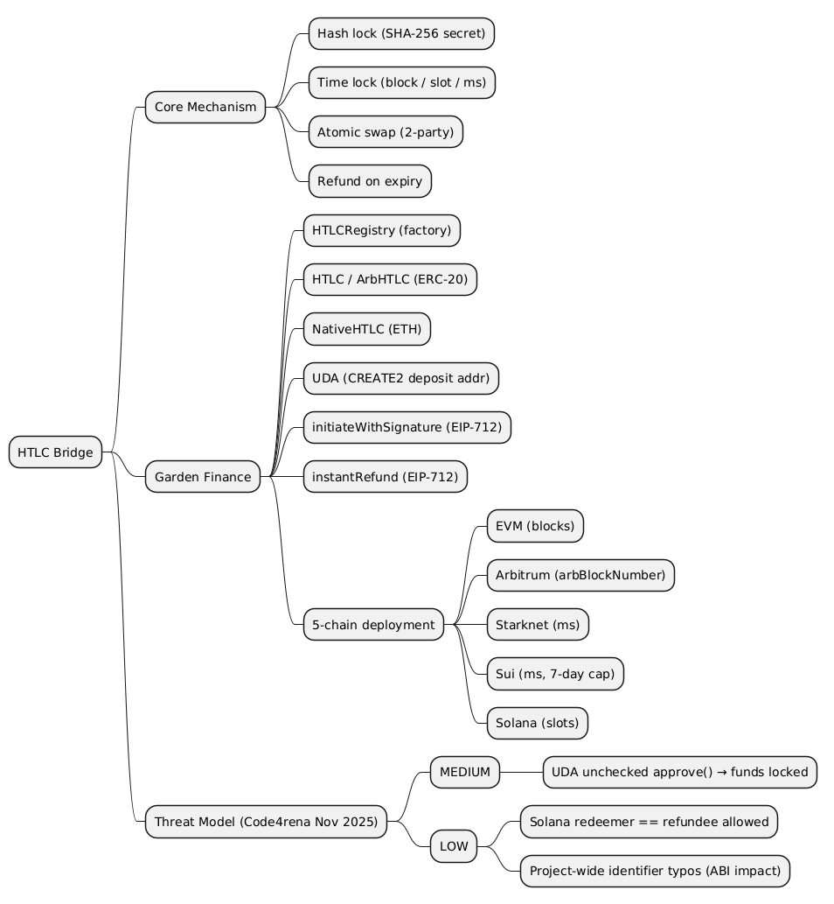
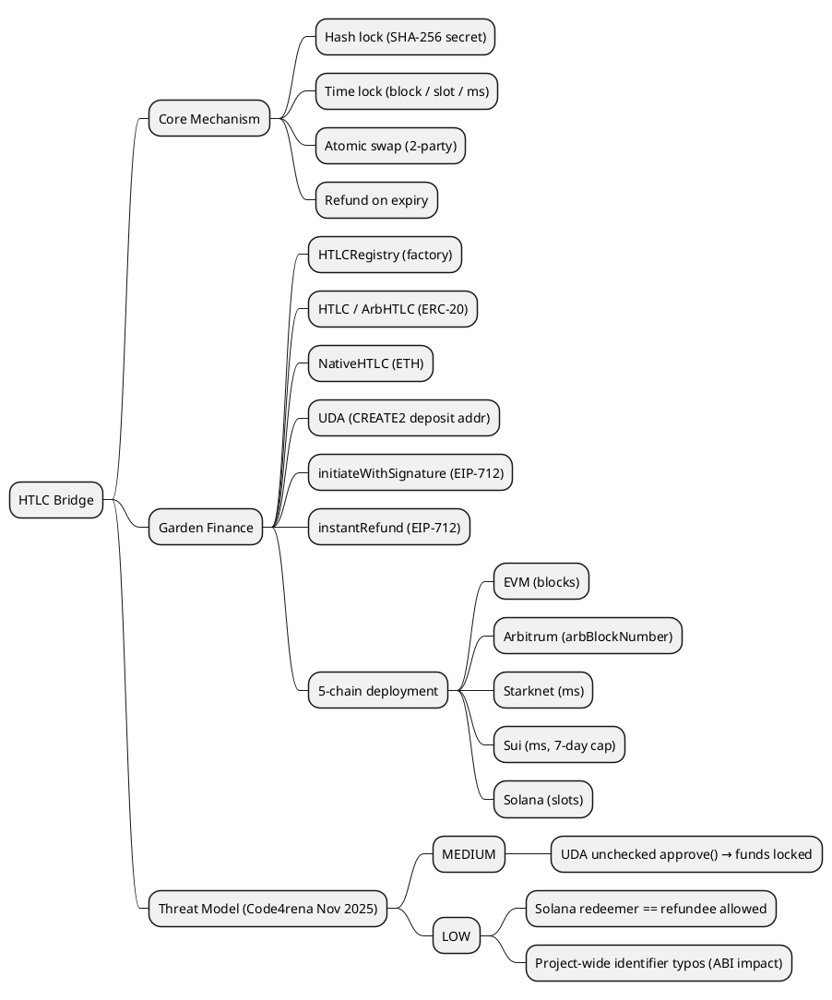

Hash Time-Locked Contracts (HTLCs) are one of the foundational primitives of trustless cross-chain protocols. Originally proposed in the context of Bitcoin payment channels and the Lightning Network, they have since become the standard mechanism for atomic swaps between blockchains that share no direct trust relationship. Garden Finance builds on this primitive to create a Bitcoin bridge operating across five chains simultaneously: EVM-compatible networks, Arbitrum, Starknet, Sui, and Solana.

This article explains HTLCs from first principles, then maps those principles onto Garden Finance's concrete implementation, and concludes with a structured threat model of the protocol.

> This article has been made with the help of [Claude Code](https://claude.com/product/claude-code) and several custom skills.
> This article is based on Garden Finance architecture submitted for a contest in Code4Rena in November 2025.
>
> https://github.com/code-423n4/2025-11-garden
> https://code4rena.com/reports/2025-11-garden
> https://code4rena.com/audits/2025-11-garden

[TOC]

---

## Hash Time-Locked Contracts — First Principles

### The Problem: Trustless Cross-Chain Exchange

Suppose Alice holds Bitcoin and Bob holds ETH. They want to exchange assets without trusting each other and without a centralised intermediary. A naive sequential approach fails: if Alice sends first, Bob can simply disappear; if Bob sends first, Alice can do the same. An HTLC solves this by making each leg of the swap conditional on the same cryptographic secret, with a timeout that unwinds the entire trade if either party fails to act.

### The Two Locks

An HTLC combines exactly two locking mechanisms:

**The hash lock.** Alice picks a random secret `s` and computes a commitment:

$$
\begin{aligned}
H = \text{SHA-256}(s)
\end{aligned}
$$

Funds locked with the hash lock can only be released by whoever presents `s` such that `SHA-256(s) == H`. SHA-256 is used specifically because it is natively supported on Bitcoin and can be faithfully reproduced on every other chain, enabling cross-chain secret verification.

**The time lock.** Funds are locked only for a finite window defined by a block number, a slot number, or a timestamp depending on the chain. After expiry, the depositing party can reclaim their funds unconditionally.

### The Atomic Swap Protocol

The two-party atomic swap proceeds in four steps:

1. **Setup.** Alice generates secret `s` and computes `H = SHA-256(s)`. She does not reveal `s` yet.

2. **Lock (both legs).** Alice locks her BTC with the hash lock `H` and a timelock `T_A` (e.g. 24 hours). Bob observes Alice's on-chain lock, verifies `H`, and locks his ETH with the *same* hash lock `H` but a *shorter* timelock `T_B < T_A` (e.g. 12 hours). The asymmetry in timelocks is deliberate: Alice must have enough time to redeem Bob's ETH and for Bob to subsequently redeem Alice's BTC using the now-revealed secret.

3. **Redeem.** Alice reveals `s` to claim Bob's ETH. The secret `s` is now public on the ETH chain. Bob observes it and uses it to claim Alice's BTC before `T_A` expires.

4. **Refund (fallback).** If either party fails to act before their timelock expires, each can reclaim their own funds. Neither party is ever at risk of losing funds: either both legs settle or both legs are refunded.

The atomicity guarantee is cryptographic: either the secret is revealed (both legs settle) or the timelocks expire (both legs refund). The final outcome is always symmetric (both parties settle or both parties reclaim), with no path where one party walks away with both assets.

```
Alice (BTC)                                        Bob (ETH)
    |                                                  |
    |-- Lock BTC (hash=H, timelock=T_A) ------------> Bitcoin
    |                                                  |
    |                Bob observes H, locks ETH         |
    |<------- Lock ETH (hash=H, timelock=T_B) -------- Ethereum
    |                                                  |
    |-- Redeem ETH (reveal secret s) ---------------> Ethereum
    |                 s is now public on-chain         |
    |                                                  |
    |                Bob claims BTC using s            |
    |                <-- Redeem BTC (secret s) ------- Bitcoin
```

### Security Properties

The protocol provides three security properties under the assumption that both blockchains are live and that transactions confirm within a reasonable time:

- **Atomicity.** Either both transfers succeed or neither does.
- **Non-custodial safety.** No third party ever holds both assets simultaneously.
- **Liveness.** Any party can unilaterally reclaim their funds after their timelock expires, even if the counterparty becomes unresponsive.

The critical assumption is **timelock ordering**: Bob's timelock must expire strictly before Alice's (`T_B < T_A`). This ordering is essential for two reasons. First, it gives Bob a defined window (`T_A - T_B`) to observe Alice's redemption on the ETH chain, extract the now-public secret `s`, and submit his own BTC redemption before Alice's timelock `T_A` expires. Second, if Bob's ETH leg expires before Alice acts (`T_B` reached), Bob can refund his ETH safely. At that point Alice has not yet revealed `s`, so she cannot redeem and will similarly refund her BTC when `T_A` arrives. If the margin `T_A - T_B` is too small, there is a risk that the secret is revealed on-chain but Bob cannot confirm his BTC redemption transaction before `T_A` expires, causing Alice to claim both assets.

---

## Garden Finance's HTLC Bridge

### Architecture Overview

Garden Finance implements a five-chain HTLC bridge for a Bitcoin-to-EVM atomic swap product. An off-chain solver coordinates swap matching and sequencing; on-chain contracts enforce atomicity.

The EVM side is composed of the following contracts:

```
HTLCRegistry
  ├── HTLC           (ERC-20, Ethereum/L2)
  ├── ArbHTLC        (ERC-20, Arbitrum — uses ArbSys.arbBlockNumber())
  ├── NativeHTLC     (native ETH)
  ├── ArbNativeHTLC  (native ETH, Arbitrum)
  ├── UniqueDepositAddress (ERC-20 UDA clone)
  └── NativeUniqueDepositAddress (ETH UDA clone)
```

`HTLCRegistry` is the single entry point for users and the solver. It stores a mapping from ERC-20 token addresses to their corresponding HTLC contract and manages the deployment of Unique Deposit Addresses (UDAs).

### The Order Lifecycle

Every swap is identified by a globally unique `orderID`, computed as:

$$
\begin{aligned}
\text{orderID} = \text{SHA-256}\bigl(\text{abi.encode}(\text{chainId},\ H,\ \text{initiator},\ \text{redeemer},\ T,\ \text{amount},\ \text{address(this)})\bigr)
\end{aligned}
$$

where `H` is the secret hash and `T` is the timelock in blocks. The inclusion of `address(this)` and `chainId` makes every orderID globally unique across all chains and all HTLC contract instances.

The lifecycle of an EVM order consists of four functions:

| Function | Caller | Condition |
|----------|--------|-----------|
| `initiate` / `initiateOnBehalf` | Initiator or any funder | Tokens approved, valid params |
| `initiateWithSignature` | Any relayer | Valid EIP-712 sig from initiator |
| `redeem(orderID, secret)` | Anyone | `SHA-256(secret) == H`, order not fulfilled |
| `refund(orderID)` | Anyone | `block.number > initiatedAt + timelock` |
| `instantRefund(orderID, sig)` | Redeemer or with redeemer sig | Order not fulfilled, valid EIP-712 sig |

Once an order is redeemed or refunded, `fulfilledAt` is set to a non-zero block number. This single field prevents double-spend: subsequent calls to `redeem` or `refund` on the same `orderID` revert unconditionally.

```solidity
function redeem(bytes32 orderID, bytes calldata secret) external {
    Order storage order = orders[orderID];
    require(order.fulfilledAt == 0, HTLC__OrderFulfilled());
    require(secret.length == 32, HTLC__InvalidSecret());
    bytes32 secretHash = sha256(secret);
    address redeemer = order.redeemer;
    require(
        sha256(abi.encode(block.chainid, secretHash, order.initiator, redeemer,
                          order.timelock, order.amount, address(this))) == orderID,
        HTLC__InvalidSecret()
    );
    order.fulfilledAt = block.number;
    token.safeTransfer(redeemer, order.amount);
    emit Redeemed(orderID, secretHash, secret);
}
```

### Gasless Initiation via EIP-712

`initiateWithSignature` allows a relayer to open a swap on behalf of a user without the user paying gas. The initiator signs an EIP-712 typed data structure off-chain:

```solidity
bytes32 private constant _INITIATE_TYPEHASH =
    keccak256("Initiate(address redeemer,uint256 timelock,uint256 amount,bytes32 secretHash)");
```

The relayer then submits the transaction. `SignatureChecker.isValidSignatureNow` is used to support both ECDSA (EOA) and ERC-1271 (smart wallet) signers.

### Unique Deposit Addresses (UDA)

The UDA pattern solves a UX problem: users interacting with native wallet interfaces may not be able to call smart contract functions directly before sending tokens. A UDA provides a deterministic address computed via CREATE2 to which the user pre-deposits tokens. When the swap is initiated, `HTLCRegistry.createERC20SwapAddress()` deploys a clone of `UniqueDepositAddress` at exactly that address and immediately calls `initiateOnBehalf()` on the HTLC. The swap parameters are baked into the clone's immutable bytecode at deploy time.

```
User                 HTLCRegistry              UDA Clone              HTLC
 |                        |                        |                    |
 |--getERC20Address()---->|                        |                    |
 |<-- predictedAddr ------|                        |                    |
 |                        |                        |                    |
 |--transfer(token, amt)->|..........>predictedAddr (no code yet)       |
 |                        |                        |                    |
 |--createERC20SwapAddr()->|                        |                    |
 |                        |--cloneDeterministic()-->| (deployed)        |
 |                        |--functionCall(init())->|                    |
 |                        |                        |--initiateOnBehalf->|
 |                        |                        |    safeTransferFrom(UDA => HTLC)
```

### Multi-Chain Deployment

| Chain | Contract | Timelock Unit |
|-------|----------|---------------|
| Ethereum / L2s | `HTLC`, `NativeHTLC` | Block numbers (~12 s/block) |
| Arbitrum | `ArbHTLC`, `ArbNativeHTLC` | `ArbSys.arbBlockNumber()` (~0.25 s/block) |
| Starknet | `htlc.cairo` | Milliseconds |
| Sui | `main.move` | Milliseconds (bounded to < 7 days) |
| Solana | Anchor programs | Slots (~400 ms/slot) |

Arbitrum requires a dedicated variant because `block.number` on Arbitrum returns the L1 block number (updating every ~12 s), while `ArbSys.arbBlockNumber()` returns the L2 block number (updating every ~0.25 s). Using the wrong value would produce dramatically different effective timelocks.

---

## Threat Model

This section presents the findings from the official Code4rena audit of Garden Finance (November 24 – December 08, 2025), published February 19, 2026. The audit yielded 1 unique medium-severity vulnerability and 64 QA reports compiling low-severity and informational issues.

| ID | Severity | Title | Component |
|----|----------|-------|-----------|
| M-01 | **Medium** | Unchecked `approve()` return causes permanent fund loss | `swap/UDA.sol` |
| L-01 | **Low** | Missing `redeemer != refundee` validation enables same-party orders and instant self-refunds | Solana (`solana-native-swaps`, `solana-spl-swaps`) |
| L-02 | **Low** | Project-wide spelling and identifier typos | EVM, Starknet |

### Medium Severity

#### M-01 — Unchecked `approve()` Return Causes Permanent Fund Loss in `UDA.sol`

**File:** `swap/UDA.sol` — line 38

The `UniqueDepositAddress.initialize()` function calls `HTLC(_addressHTLC).token().approve(_addressHTLC, amount)` without checking the return value:

```solidity
function initialize() public initializer {
    // ... parameter extraction ...
    HTLC(_addressHTLC).token().approve(_addressHTLC, amount); // return value ignored
    HTLC(_addressHTLC).initiateOnBehalf(
        refundAddress, redeemer, timelock, amount, secretHash, destinationData
    );
}
```

Non-standard ERC-20 tokens such as USDT and BNB return `false` instead of reverting when `approve()` fails. Because the return value is not checked, execution continues even when approval fails. The contract marks itself as initialized, the allowance remains at `0`, and `initiateOnBehalf()` executes — but the HTLC cannot transfer tokens because no allowance was granted. User funds become permanently locked with no recovery path. The contract already imports `SafeERC20` but does not use it for this call.

**Recommendation.** Use `safeApprove` from the already-imported `SafeERC20`:

```solidity
IERC20(HTLC(_addressHTLC).token()).safeApprove(_addressHTLC, amount);
```

### Low Severity

#### L-01 — Missing `redeemer != refundee` Validation Enables Same-Party Orders and Instant Self-Refunds

**Files:**
- `solana-native-swaps/src/lib.rs::initiate` — L20–L64
- `solana-native-swaps/src/lib.rs::instant_refund` — L130–L153
- `solana-spl-swaps/src/lib.rs::initiate` — L22–L80
- `solana-spl-swaps/src/lib.rs::instant_refund` — L188–L23

The `initiate` instruction in both Solana HTLC implementations (native SOL and SPL token) does not enforce `redeemer != refundee`. Orders can be created where the redeemer and refundee are the same address, despite the HTLC's intended separation of redeem and refund roles.

Because `instant_refund` requires the redeemer's consent but no secret or timelock, the same address can immediately refund to itself without revealing the secret. The same address also becomes the beneficiary of both redeem and refund flows, breaking the "counterparty provides secret to redeem; initiator receives refund after expiry" invariant. Events and on-chain audit trails no longer distinguish counterparty roles, complicating monitoring and downstream integrations.

**Recommendation.** Add a distinctness check in both `initiate` functions:

```rust
require!(redeemer != refundee, ErrorCode::SamePartyOrder);
```

#### L-02 — Project-Wide Spelling and Identifier Typos

Several spelling mistakes exist across the EVM and Starknet codebases. EVM error identifiers are part of the ABI via custom error selectors (`keccak256(ErrorSignature)`); renaming changes the selector, and any external tooling or off-chain decoders expecting the old selector will fail unless updated.

**Code locations:**

- `NativeHTLC__IncorrectFundsRecieved` (should be `Received`) — `swap/NativeHTLC.sol` L82, L91
- `ArbNativeHTLC__IncorrectFundsRecieved` (should be `Received`) — `swap/ArbNativeHTLC.sol` L88, L97
- Variable name `intiate` (should be `initiate`) — `htlc.cairo` L249, L257
- Identifier `INTIATE_TYPE` (should be `INITIATE_TYPE`) — `HTLC.test.ts` L449, L477, L514, L551, L587, L623, L1305, L1374, L1503

**Recommendation.** Rename `NativeHTLC__IncorrectFundsRecieved` → `NativeHTLC__IncorrectFundsReceived` and `ArbNativeHTLC__IncorrectFundsRecieved` → `ArbNativeHTLC__IncorrectFundsReceived` and update all call sites. Rename `intiate` → `initiate` in `htlc.cairo` and standardize `INTIATE_TYPE` → `INITIATE_TYPE` across the Starknet test suite.

---

## Invariants

The following properties must hold at all times across every supported chain:

1. **Single fulfillment.** `fulfilledAt != 0` after any call to `redeem`, `refund`, or `instantRefund`. No orderID can be fulfilled twice.
2. **Correct recipient.** Funds move only to `order.initiator` (on refund) or `order.redeemer` (on redeem). No other address can receive protocol funds.
3. **Secret binding.** Redeeming requires `SHA-256(secret) == secretHash` as encoded in the orderID. Wrong secrets always revert.
4. **Timelock enforcement.** `refund` reverts unless `block.number > order.initiatedAt + order.timelock`.
5. **Consent for instant refund.** `instantRefund` requires either `msg.sender == order.redeemer` or a valid EIP-712 signature from the redeemer.
6. **UDA immutability.** Swap parameters baked into a deployed UDA clone's immutable bytecode cannot be altered after deployment.
7. **HTLC token immutability.** `isInitialized` prevents `initialise()` from being called more than once.

---

## Conclusion

Hash Time-Locked Contracts offer a compelling foundation for trustless cross-chain exchange. By combining a cryptographic hash commitment with an expiry-based refund mechanism, they eliminate the need for a trusted third party in simple two-party swaps. Garden Finance extends this primitive significantly: a registry-based factory, gasless EIP-712 initiation, deterministic deposit addresses, and deployments across five heterogeneous chains.

The Code4rena audit (November–December 2025) identified one medium-severity vulnerability: the unchecked `approve()` return value in `UDA.sol`, which can permanently lock funds when non-standard ERC-20 tokens such as USDT are used. The fix is straightforward — replacing the bare `approve()` call with `safeApprove` from the already-imported `SafeERC20`. The top QA report further identified a missing role-distinctness check in the Solana implementations and project-wide identifier typos with ABI implications. The core HTLC locking and redemption logic across all five chains was found to be sound.

---

## Summary






---

## Reference

- [Garden Finance](https://garden.finance/)
- code4rena
  - https://github.com/code-423n4/2025-11-garden
  - https://code4rena.com/reports/2025-11-garden
  - https://code4rena.com/audits/2025-11-garden
- [Bitcoin Lightning Network HTLC specification](https://github.com/lightning/bolts/blob/master/03-transactions.md)
- [OpenZeppelin Contracts v5 — SafeERC20](https://docs.openzeppelin.com/contracts/5.x/api/token/erc20#SafeERC20)
- [OpenZeppelin Contracts v5 — EIP712](https://docs.openzeppelin.com/contracts/5.x/api/utils#EIP712)
- [ERC-1271: Standard Signature Validation Method for Contracts](https://eips.ethereum.org/EIPS/eip-1271)
- [Code4rena severity classification](https://docs.code4rena.com/awarding/judging-criteria/severity-categorization)
- [Claude Code](https://claude.com/product/claude-code)
