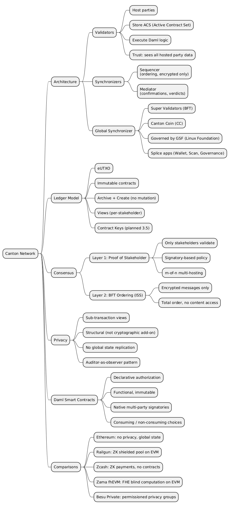

Canton Network is a Layer-1 blockchain designed for privacy-preserving, multi-party workflows. Unlike Ethereum, where every transaction is globally visible, Canton enforces selective disclosure at the protocol level: each party sees only the portions of a transaction they are entitled to see. This article explains Canton's architecture, its two-layer consensus mechanism, and its privacy model, then places it in context against Ethereum/EVM, Railgun, Zcash, Zama fhEVM, and Ethereum Besu.

> This article has been made with the help of [Claude Code](https://claude.com/product/claude-code) and several custom skills

[TOC]

## The Problem Canton Solves

Most blockchains trade privacy for integrity. For a validator to verify that a transaction is correct (no double-spend, valid authorization), it must see the transaction. This produces a global broadcast model: every participant sees every transaction.

For regulated financial infrastructure this is a fundamental constraint:

- Position visibility enables front-running
- Transaction patterns reveal trading strategies
- Data-sharing regulations prohibit distributing certain data to unauthorized parties

Cryptographic approaches (ZK proofs, FHE) address parts of this problem by hiding values. Canton takes a different path: distributing only the correct subset of data to each party, and ensuring the infrastructure that coordinates ordering never has access to the content it orders.

## Core Concepts

### Parties

A **party** is an on-ledger identity in Canton, analogous to an address on Ethereum but with explicit authorization semantics. The identifier includes a name and a fingerprint (hash of the public key):

```
alice::1220f2fe29866fd6a0009ecc8a64ccdc09f1958bd0f801166baaee469d1251b2eb72
```

Parties interact with contracts through three roles:

| Role | Authorization | Visibility |
|------|--------------|------------|
| **Signatory** | Must authorize contract creation and archival | Always sees the contract and all events on it |
| **Observer** | None (passive) | Sees the contract and consuming choices, but not non-consuming choices (unless also a controller) |
| **Controller** | Can exercise specific choices | Sees the choices they control and their consequences |

**Stakeholders** (signatories + observers) are the parties entitled to see a contract. Validators store contracts only for their hosted parties' stakeholder relationships.

Two kinds of parties exist: **local parties** (keys held by the validator; suited for automation) and **external parties** (keys held externally; required for wallet-like user experiences).

### Validators (Participant Nodes)

A **validator** hosts parties, stores their contracts, and executes Daml logic. Unlike Ethereum full nodes, validators do not store global state. They store only the contracts where their hosted parties are stakeholders.

A validator contains:
- **Participant node**: the Daml execution engine
- **Ledger store**: the Active Contract Set (ACS) for hosted parties
- **Ledger API**: gRPC and JSON endpoints for application integration

Multiple parties can be hosted on one validator. A party can also be hosted on multiple validators simultaneously (multi-hosting), with configurable m-of-n confirmation thresholds.

> The hosting validator sees all data for its hosted parties. Choosing a validator is a trust decision.

### Synchronizers

A **synchronizer** coordinates transaction ordering and consensus without storing or decrypting transaction content. It has two components:

- **Sequencer**: orders and distributes encrypted messages; assigns globally unique timestamps that serve as the source of ledger time; never decrypts message content.
- **Mediator**: collects confirmation verdicts from validators; declares transaction outcomes (commit or abort); never sees decrypted transaction content.

The synchronizer is a coordination layer only. It never stores transaction data and has no access to contract payloads.

Canton supports multiple topology configurations:

- **Single synchronizer**: simple deployments, private use cases.
- **Multiple synchronizers**: participants connect to several synchronizers simultaneously; contracts can be reassigned between them. Used for regulatory separation or multi-consortium architectures.
- **Global Synchronizer**: the public, decentralized synchronizer for Canton Network, operated by Super Validators using BFT consensus.

### Daml Smart Contracts

Smart contracts in Canton are defined in **Daml** (Digital Asset Modeling Language), a purpose-built functional language for multi-party workflows. A template defines the contract's data, parties, and callable choices:

```daml
template Token
  with
    issuer  : Party
    owner   : Party
    amount  : Decimal
  where
    signatory issuer, owner   -- both must authorize creation
    observer  issuer          -- issuer always sees the contract

    choice Transfer : ContractId Token
      with newOwner : Party
      controller owner        -- only owner can call this
      do
        -- consuming by default: archives this contract, creates a new one
        create this with owner = newOwner
```

Key differences from Solidity:

- **Immutable contracts**: there is no in-place state mutation. State changes archive the existing contract and create a new one.
- **Declarative authorization**: the compiler enforces who can do what. Runtime `require(msg.sender == owner)` guards are replaced by compile-time controller declarations.
- **Native multi-party**: `signatory [alice, bob]` requires both parties to authorize contract creation. This is equivalent to a multi-sig, expressed as a language primitive.

## Architecture

### Component Topology

```
Canton Network
├── Global Synchronizer
│   ├── Sequencer  (orders + distributes encrypted messages)
│   └── Mediator   (collects confirmations, issues verdicts)
├── Validator A (hosts Alice)
│   ├── Participant Node (Daml execution engine)
│   └── Ledger Store (Alice's contracts only)
└── Validator B (hosts Bob, Charlie)
    ├── Participant Node
    └── Ledger Store (Bob's + Charlie's contracts only)
```

Alice's validator has no knowledge of Bob's contracts unless Alice is a stakeholder in them. The synchronizer has no knowledge of any contract's content at any time.

### The Ledger Model (eUTXO)

Canton uses an **extended UTXO (eUTXO)** model. The ledger is a collection of active contracts, each created by a transaction and existing until archived by another transaction. Contracts are immutable and carry unique contract IDs.

State transitions always produce new contracts:

```
Transaction 1: Create Contract A
Transaction 2: Archive Contract A  →  Create Contract B
Transaction 3: Archive Contract B  →  Create Contract C + Contract D
```

This immutability enables natural parallelism (independent contracts process concurrently without contention) and provides double-spend prevention at the structural level (a contract can be archived exactly once).

Choices on contracts are either **consuming** (default: the contract is archived on exercise) or **non-consuming** (the contract remains active). The former is used for state transitions and transfers; the latter for read operations, queries, and notifications.

> **Contract keys** (identifiers for looking up contracts without knowing the contract ID) are planned for Canton 3.5 and are not yet available in production.

### Transaction Flow

| Step | Component | Action |
|------|-----------|--------|
| 1. Submit | Application | Sends command to validator via Ledger API |
| 2. Interpret | Submitting Validator | Executes Daml code, creates transaction views |
| 3. Submit | Submitting Validator | Sends encrypted views to synchronizer sequencer |
| 4. Sequence | Sequencer | Orders transaction, assigns timestamp |
| 5. Distribute | Sequencer | Routes each view only to entitled validators |
| 6. Validate | Relevant validators | Each validates their view independently |
| 7. Confirm | Relevant validators | Send approve/reject to mediator |
| 8. Collect | Mediator | Aggregates verdicts, determines outcome |
| 9. Commit | Relevant validators | Apply transaction to local ledger shard |

Each validator validates only the views addressed to it. The synchronizer never sees decrypted content at any step.

## Two-Layer Consensus

Canton separates smart contract validation from transaction ordering into two independent layers.

### Layer 1: Smart Contract Consensus (Proof of Stakeholder)

Only stakeholders (signatories and observers) of the contracts involved in a transaction participate in validation and confirmation. This mechanism is called **Proof of Stakeholder**.

Each confirming participant independently:

1. Decrypts and deserializes its received views
2. Re-executes the Daml logic and verifies that computed consequences match the submitter's claims
3. Verifies authorization (correct signatories, controllers, required signatures)
4. Checks that input contracts are active in its local ACS (local double-spend detection)
5. Sends a cryptographically signed confirmation or rejection to the mediator

The mediator applies a **signatory-based confirmation policy**:

- Each signatory of a contract involved in the transaction must confirm
- For multi-hosted parties: a configurable m-of-n threshold of Confirming Participant Nodes (CPNs) must approve
- The transaction commits only if all signatories' thresholds are met; otherwise it aborts atomically

### Layer 2: Ordering Consensus (BFT Sequencing)

The sequencer establishes a total order for all transactions on a synchronizer:

- Receives encrypted messages from validators
- Assigns globally unique timestamps (the source of ledger time)
- For decentralized synchronizers: uses Byzantine Fault Tolerant (BFT) consensus based on the ISS (Insanely Scalable State-Machine Replication) algorithm
- Tolerates up to 1/3 Byzantine (malicious or faulty) nodes
- Never decrypts or stores transaction content

### Security Properties

The combination of the two layers provides the following guarantees:

- **Confirmation integrity**: a transaction commits only if all required signatories' CPNs confirm; each confirmation is cryptographically signed.
- **Participant isolation**: a malicious participant cannot forge confirmations for parties it does not host.
- **Privacy preservation**: non-stakeholders learn nothing; sequencer and mediator see no content.
- **Authorization enforcement**: confirming participants independently verify Daml authorization rules.
- **Atomicity**: the mediator verdict is all-or-nothing; there is no partial commit state.
- **Double-spend protection**: each CPN checks its local ACS, and the sequencer's total ordering ensures conflicting transactions are serialized.

### Comparison with Other Consensus Approaches

| Approach | Ordering | Validation | Privacy |
|----------|----------|------------|---------|
| Traditional Blockchain | All validators | All validators | None |
| L2 Rollups | Sequencer | Fraud/validity proofs | Limited |
| Notary-based (e.g. Corda) | Notary | Transacting parties | Partial |
| **Canton** | Synchronizer (BFT) | Affected stakeholders only | Full sub-transaction |

## Privacy Model

Canton's privacy is a structural property of the protocol, not a layer applied on top of a public chain.

### Sub-Transaction Privacy

When a transaction involves multiple parties, Canton decomposes it into **views**: subsets of the transaction tree, each encrypted for its respective recipients. The synchronizer routes only the views each validator is entitled to receive.

Consider a chain of payments within a single atomic transaction: Alice pays Bob, Bob pays Charlie.

- Alice sees: her payment to Bob; not Bob's payment to Charlie; not Charlie's identity
- Bob sees: both payments (he is involved in both)
- Charlie sees: his receipt from Bob; not Alice's involvement; not the source of funds

The sequencer sees encrypted blobs and routing metadata only. The mediator sees informee lists and confirmation outcomes only.

### Visibility Rules Summary

| Role | Visibility |
|------|------------|
| Signatory | Always sees the contract and all events on it |
| Observer | Sees the contract and consuming choices exercised on it; does not see non-consuming choices (unless also a controller) |
| Controller | Sees the choices they can exercise and their consequences |

### Privacy Guarantees

- Transaction content is visible only to authorized parties
- Synchronizer operators cannot read transaction data at any point
- No metadata leakage about parties not entitled to see an action
- Validators store only their hosted parties' data; there is no global state replication

### Privacy Design Patterns

| Pattern | Description |
|---------|-------------|
| **Bilateral agreement** | Two signatories only; maximum privacy for two-party contracts |
| **Selective disclosure** | Add observers explicitly for compliance, regulatory, or audit visibility |
| **Auditor as observer** | Add a regulated auditor party as observer on relevant contracts |
| **Divulgence** | Parties to a transaction learn about referenced contracts automatically; must be designed for deliberately |

## Comparison with Other Approaches

### Ethereum / EVM (Public Blockchain)

Ethereum is the reference baseline: a fully replicated, globally transparent blockchain. Every validator stores all state and sees every transaction.

| Dimension | Ethereum | Canton |
|-----------|----------|--------|
| Transaction visibility | Public | Visible only to stakeholders |
| State storage | All nodes store all state | Validators store only hosted parties' data |
| Smart contract language | Solidity (imperative, mutable) | Daml (functional, immutable contracts) |
| Authorization | Runtime `require` checks | Compile-time declarative |
| Privacy | None by default | Sub-transaction privacy by default |
| Finality | Probabilistic then near-instant (post-Merge) | Immediate (mediator verdict) |
| Identity | Pseudonymous addresses | Named parties with explicit roles |

Ethereum's transparency is a feature for applications where public auditability is the goal. For regulated or confidential workflows it is a structural limitation. Canton does not natively interoperate with EVM smart contracts.

### Railgun (ZK-Based Privacy Layer on EVM)

Railgun is a privacy layer deployed on EVM chains (Ethereum, Polygon, BNB Chain, Arbitrum). It shields token balances and transfers using **zk-SNARKs**, preventing observers from linking addresses or reading amounts involved in a transaction.

| Dimension | Railgun | Canton |
|-----------|---------|--------|
| Architecture | L2 privacy overlay on EVM | Native L1 |
| Privacy mechanism | zk-SNARKs shielded transfers | Sub-transaction view distribution |
| Smart contract scope | Primarily token transfers and DeFi interactions | Arbitrary multi-party business logic |
| Selective disclosure | No built-in mechanism | Stakeholder model (observer pattern) |
| Regulatory access | No built-in mechanism | Auditor-as-observer pattern |
| Identity model | Pseudonymous, shielded addresses | Named parties with explicit authorization |
| Composability | Limited across shielded pools | Full within a synchronizer |

Railgun addresses the specific problem of hiding token transfer amounts and counterparties on an existing public chain. Canton addresses a broader architectural challenge: private multi-party business logic with selective disclosure per party at the protocol level. The two are not directly comparable in scope.

### Zcash (ZK-Based Privacy Blockchain)

Zcash is a standalone privacy-first blockchain using **zk-SNARKs** (Groth16 proof system with Sapling/Orchard circuits) to shield transaction amounts and addresses. Shielded transactions use note commitments and nullifiers to prevent double-spends without revealing inputs or outputs.

| Dimension | Zcash | Canton |
|-----------|-------|--------|
| Privacy mechanism | zk-SNARKs shielded pool | Structural sub-transaction views |
| Smart contracts | None (payments only) | Full Daml programming model |
| Selective disclosure | View keys (opt-in per address) | Explicit stakeholder model |
| Multi-party logic | Not supported | Native (multiple signatories) |
| Finality | PoW (probabilistic) | Immediate |
| Regulatory access | View keys (per address, not per transaction) | Auditor-as-observer (by contract design) |
| Quantum resistance | Dependent on hash function | Depends on underlying scheme |

Zcash achieves strong payment privacy through zero-knowledge cryptography but does not support general-purpose smart contracts or complex multi-party workflows. The privacy model is binary (transparent or shielded address) rather than per-stakeholder. Canton's model is more expressive: it handles who sees what within a single atomic transaction involving heterogeneous business objects across multiple parties.

### Zama fhEVM (Fully Homomorphic Encryption on EVM)

Zama's fhEVM enables confidential smart contracts on EVM chains using **Fully Homomorphic Encryption (FHE)**. Encrypted state can be computed on directly without decryption, keeping the contract's computation itself private.

The architecture consists of:

- A Solidity library with encrypted types (`euint8` to `euint256`, `ebool`, `eaddress`) and FHE operations
- A **coprocessor** (off-chain Rust service using TFHE-rs) that performs FHE computations using an evaluation key (not the private key)
- A **gateway** (Arbitrum rollup) that orchestrates decryption requests and enforces consensus among coprocessors
- A **KMS** (13-node threshold MPC) that holds the FHE private key in threshold shares; no single node ever reconstructs it

FHE operations use **symbolic execution** on-chain: `FHE.add(a, b)` produces a deterministic handle (`keccak256(op, inputs)`) rather than running the actual computation. The coprocessor executes the FHE operation asynchronously off-chain. This keeps gas costs manageable while preserving encrypted state.

| Dimension | Zama fhEVM | Canton |
|-----------|------------|--------|
| Privacy mechanism | FHE (computation on encrypted data) | Structural view distribution + encryption |
| Language | Solidity + FHE library | Daml |
| EVM compatibility | Full | None |
| State visibility | Encrypted handles on-chain; ciphertexts off-chain | Each party sees only their authorized view |
| Smart contract privacy | Computed values never revealed to chain | Business logic private by stakeholder |
| Selective disclosure | ACL per ciphertext handle | Stakeholder model (signatory, observer) |
| Multi-party coordination | Requires explicit ACL grants | Native (multiple signatories and observers) |
| Decryption model | Async callback via threshold KMS | No decryption needed; parties see their views |
| Performance constraint | HCU limits (20 M per transaction), expensive FHE ops | Validation bounded by stakeholder count |
| Quantum resistance | TFHE-rs (post-quantum secure) | Depends on underlying scheme |

fhEVM and Canton address privacy from fundamentally different perspectives. fhEVM keeps computation private by ensuring values are never decrypted during processing: even the validators executing the contract never see the plaintext. Canton keeps data private by selective distribution: the right data is sent only to the right parties, and no party receives what it is not entitled to see.

fhEVM is appropriate when computation must remain private even from the parties directly involved (a sealed auction where neither bidder knows the other's bid until resolution). Canton is appropriate when different parties in a multi-party workflow each need to see their own portion of shared state but not others' (a trade settlement where buyer and seller each see their leg, but not the counterparty's internal details).

### Ethereum Besu (Permissioned Private Blockchain)

Hyperledger Besu is an enterprise Ethereum client supporting permissioned networks. Private transactions are handled via **Tessera**, a private transaction manager that stores encrypted payloads off the main chain and distributes them only to designated participants.

| Dimension | Besu (Private) | Canton |
|-----------|---------------|--------|
| Network model | Permissioned consortium | Decentralized (or permissioned private) |
| Privacy mechanism | Private transaction groups via Tessera | Sub-transaction view distribution |
| Smart contract language | Solidity (EVM) | Daml |
| State replication | All consortium nodes replicate consortium state | Validators store only hosted parties' data |
| Consensus | QBFT / IBFT2 (BFT for permissioned) | Two-layer (Proof of Stakeholder + BFT ordering) |
| Privacy model | Predefined privacy groups (bilateral or n-party channels) | Per-stakeholder views on any transaction |
| Composability | Limited across privacy groups | Full within a synchronizer |
| Finality | Immediate (BFT) | Immediate (mediator verdict) |
| Governance | Off-chain consortium agreement | On-chain (Super Validator governance for Global Synchronizer) |
| EVM compatibility | Full | None |

Besu's private transaction model uses **privacy groups**: predefined sets of nodes sharing a private state. This is effective for bilateral or small-group consortiums but does not naturally extend to scenarios where different parties should see different subsets of the same atomic transaction. Canton's view decomposition addresses this directly.

Besu benefits from full EVM compatibility and the existing Solidity toolchain. Canton requires learning Daml and a different architectural model, but provides more expressive per-party privacy for regulated multi-party use cases.

### Summary

| Dimension | Ethereum | Railgun | Zcash | fhEVM | Besu (Private) | Canton |
|-----------|----------|---------|-------|-------|----------------|--------|
| Privacy mechanism | None | ZK shielded pool | ZK shielded payments | FHE on encrypted state | Private transaction groups | Sub-transaction views |
| Smart contracts | Solidity/EVM | Solidity/EVM | None | Solidity + FHE types | Solidity/EVM | Daml |
| Multi-party logic | Manual | Limited | No | Via ACL grants | Manual | Native |
| Selective disclosure | No | No | View keys | ACL per handle | Privacy groups | Stakeholder model |
| State storage | All nodes | All nodes | All nodes | Handles on-chain, ciphertexts off-chain | All consortium nodes | Validators (stakeholder-scoped) |
| Decentralization | High | High (on-chain) | Moderate | Partial (threshold KMS) | Low (consortium) | Moderate (Super Validators) |
| EVM compatibility | Yes | Yes | No | Yes | Yes | No |
| Ideal scope | Public dApps | Private DeFi | Private payments | FHE blind computation | Private consortium | Regulated multi-party workflows |

## The Global Synchronizer

The **Global Synchronizer** is the public synchronizer for Canton Network, operated by **Super Validators** (SVs) running BFT consensus across distributed sequencer and mediator nodes. It is governed by the **Global Synchronizer Foundation** (under the Linux Foundation). Transaction fees are referred to as "traffic" and are paid in **Canton Coin (CC)**, the native utility token.

**Splice** (Hyperledger Labs) provides the open-source infrastructure for decentralized Canton synchronizers, including Canton Coin, Validator App, Wallet, Scan (network explorer), and on-chain Governance.

Network environments follow a progression from local development to production:

| Environment | Purpose | Canton Coin |
|-------------|---------|-------------|
| **LocalNet** | Local development | Test (no value) |
| **DevNet** | Integration testing | Test (faucet) |
| **TestNet** | Staging and validation | Test (faucet) |
| **MainNet** | Production | Real value |

## Conclusion

Canton Network occupies a distinct position in the blockchain landscape. Its sub-transaction privacy is not achieved by hiding values with cryptographic proofs or by restricting the participant set (as in permissioned blockchains), but by a structural protocol design: transactions are decomposed into views and distributed only to entitled parties, while the infrastructure that coordinates ordering never has access to the content it sequences.

The two-layer consensus (Proof of Stakeholder for correctness combined with BFT sequencing for ordering) enables immediate finality without global state replication, giving Canton both its privacy model and its scalability characteristics.

For regulated financial infrastructure, multi-party business workflows, and any application where data residency and selective disclosure are first-class requirements, Canton provides an architecture where those properties are enforced at the protocol level rather than delegated to application-layer conventions.

The trade-offs are real: no EVM compatibility, a different programming model (Daml), and a smaller ecosystem than Ethereum. For the use cases Canton targets (syndicated lending, trade finance, tokenized securities, cross-institution settlement), those trade-offs are justified by the compliance and privacy properties the architecture provides.



---

---

## References

- [Canton Network Documentation](https://docs.canton.network/)
- [Canton Protocol Specification](https://docs.canton.network/overview/reference/canton-protocol-specification)
- [Smart Contract Consensus](https://docs.canton.network/overview/reference/smart-contract-consensus)
- [Two-Layer Consensus](https://docs.canton.network/overview/learn/two-layer-consensus)
- [Global Synchronizer Foundation](https://canton.foundation/)
- [Splice (Hyperledger Labs)](https://github.com/hyperledger-labs/splice)
- [Zama fhEVM Documentation](https://docs.zama.ai/fhevm)
- [Zcash Protocol Specification](https://zips.z.cash/protocol/protocol.pdf)
- [Railgun Protocol](https://railgun.org/)
- [Hyperledger Besu Documentation](https://besu.hyperledger.org/)
- [Claude Code](https://claude.com/product/claude-code)
