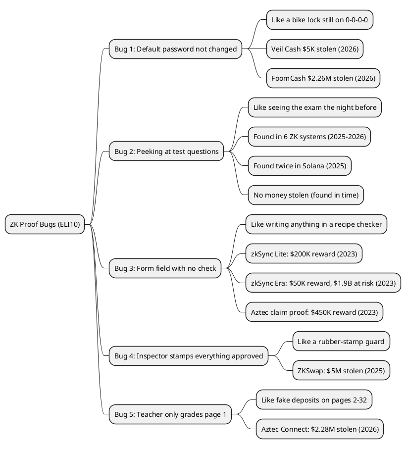

Imagine a safe that can tell you "yes, this person knows the right combination" without ever showing anyone the combination. That sounds useful. But what if the safe had a hidden flaw that let a burglar claim to know the combination even when they did not? That is what happened, several times, to a type of computer technology called a zero-knowledge proof. This article explains what went wrong, using simple everyday examples.

> This article has been made with the help of [Claude Code](https://claude.com/product/claude-code) and the custom skill `create-article-eli10`

[TOC]

## What Is a Zero-Knowledge Proof, and Why Does It Matter?

Picture a baking competition. You invented a secret cookie recipe, and you want to prove your cookies taste amazing without giving the recipe to your rival. So you bake a batch in front of the judge. The judge tastes them and says: "Yes, these are amazing." The judge now knows your cookies are great. But the judge still does not know your recipe. You proved something real without revealing your secret.

A zero-knowledge proof (let us call it a **ZK proof**) works the same way on a computer. You want to prove you know a secret (a password, a private key, a hidden number) without revealing the secret itself. A computer program called the **inspector** (the real term is "verifier") checks your proof. If the inspector says "yes, valid," the proof is accepted. This technology is used in blockchain systems to move money securely, keep transactions private, and run what are called "ZK rollups" (mini-blockchains that bundle thousands of transactions together and send a single proof to a bigger blockchain).

The problem is this: the systems that create and check these proofs are complicated software. Complicated software has bugs. Some bugs are harmless. But in a ZK system guarding millions of dollars, a bug can let an attacker convince the inspector that something false is true. When that happens, money disappears.

Here are the five main ways it has gone wrong in real systems.

---

## Bug 1 — The Factory Forgot to Change the Default Password

Think about a brand-new bike lock you buy at a shop. It comes with a default combination: 0-0-0-0. The instructions say "change the combination before you use it." If you forget to change it, anyone who reads the instruction booklet can open your lock.

That is exactly what happened with systems called **[Veil Cash](https://rekt.news/default-settings)** (in February 2026) and **[FoomCash](https://rekt.news/the-unfinished-proof)** (six days later, in the same month). These were programs that let people make private payments using ZK proofs. Before you can use a ZK proof system, you have to run a special ceremony to set secret random numbers. Think of this ceremony as "changing the combination on the lock." These teams forgot to run the ceremony. Their systems shipped with the factory default: a known, public number that anyone could look up.

An attacker read about this and made 29 fake proofs in a few seconds. Each fake proof told the inspector: "Yes, this person is allowed to withdraw money." The inspector had no way to tell the proofs were fake, because the lock had never been properly set up. The attacker drained the first system for about $5,000$. Then the attacker published a description of how it worked. Six days later, a different attacker read that description and used the same trick on FoomCash, stealing over two million dollars.

```
  CORRECT setup                       BROKEN setup (Veil Cash / FoomCash)
  ─────────────────────────────       ─────────────────────────────────────
  Factory sets a random secret        Factory ships with default secret
  Secret is destroyed after setup     Default secret is in the manual
  Inspector knows: "only someone      Inspector checks: "did they use
  with the right proof can open"      the default?" Anyone can => PASS
```

**The lesson:** A ZK system must be set up with a random secret that nobody knows. If you skip that step, the whole security of the system vanishes.

---

## Bug 2 — Peeking at the Test Questions Before the Test

Suppose you have a spelling test tomorrow. The rules say the teacher picks the words randomly on test day. But imagine you found a way to overhear the teacher preparing the list the night before. You could memorise exactly those words and ace the test, even if you cannot really spell most other words.

In ZK proofs, the inspector tests the prover by asking random questions (called **challenges**). The system turns this into a non-interactive process: instead of asking questions live, it uses a mathematical function called a hash (think of it as a blender: you put ingredients in, you get a smoothie out, and you cannot un-blend it back). The prover feeds their work into the blender. The blender output becomes the challenge.

The bug, called **Frozen Heart** (discovered by a security team called [Trail of Bits](https://blog.trailofbits.com/2022/04/15/the-frozen-heart-vulnerability-in-bulletproofs/) in 2022, then found again many more times), happens when the prover can sneak one of their values *after* seeing the challenge, instead of *before*. It is like being allowed to peek at the blended smoothie and then change an ingredient to make the smoothie come out exactly right. The prover can now create a proof that passes the inspector's check for a completely wrong answer.

This bug was found in **six different ZK virtual machine systems** between September 2025 and March 2026 by researchers at [OtterSec](https://osec.io/blog/2026-03-03-zkvms-unfaithful-claims/). It was also found twice in the same Solana program (a system handling private token transfers) within 60 days, in April 2025 and again in June 2025. None of these were exploited (money was not stolen), but in each case a skilled attacker could have produced a completely fake proof that would have been accepted.

```
  Correct order                        Frozen Heart (bug)
  ─────────────────────────────        ──────────────────────────────
  Prover puts A, B, C into blender     Prover puts A, C into blender
  Gets challenge Q = blend(A,B,C)      Gets challenge Q = blend(A,C)
  Cannot change A, B, C after          Prover now picks B to fit Q
  => proof is honest                   => fake proof accepted
```

**The lesson:** All the prover's values must go into the blender before the challenge comes out. Leaving any value out is like letting the prover cheat on the test.

---

## Bug 3 — Writing "Something" Instead of the Right Answer

Imagine a recipe checker who is supposed to verify that a baker followed a chocolate cake recipe exactly. The checker's rule says: "write the amount of flour used." But the checker never actually checks whether the written amount matches what is in the cake. The baker could write "500 grams" or "a handful" or "shoelace" and the checker would stamp "approved" regardless.

In ZK systems, values are stored in special numbered slots inside the proof. Creating a slot and actually restricting what can go in it are two separate steps. The bug called **"assigned but not constrained"** happens when a developer creates a slot but forgets to add the rule that checks what is in it.

This happened three times in real ZK bridge systems (bridges move money between different blockchains):

- **[zkSync Lite](https://medium.com/immunefi/zksync-insufficient-proof-verification-bugfix-review-dcd57944d0e2)** (October 2023): The system encodes the size of a money transfer as a special compact number. A slot was created for part of this number, but no rule said the slot had to hold the correct value. An attacker could write any number they wanted for the transfer amount, and the inspector would accept the proof. A researcher named LonelySloth found this before anyone stole money and received a $200,000$ reward.

- **[zkSync Era](https://blog.chainlight.io/uncovering-a-zk-evm-soundness-bug-in-zksync-era-f3bc1b2a66d8)** (September 2023): The system moves money between the main Ethereum blockchain and its own mini-blockchain. The amount of money in a withdrawal was split into two parts: a lower part and an upper part. The upper part had no rule checking it. An attacker could write "1 cent" in the lower part (to burn real money) and then write "100,000 ETH" in the upper part (to claim a huge withdrawal). The inspector would accept the proof. A team called ChainLight found this and received a 50,000 dollar reward. At the time, the system held about 1.9 billion dollars.

- **Aztec Connect** (September 2023): Users pool money into shared investment moves. When users get their share back, the circuit calculates "your share of the total." A leftover number in the calculation was never checked to be in the right range. A malicious manager of the system could have used this to give one user all of the pool's money. A researcher named lucash-dev found it and received a $450,000$ reward.

```
  Slot for flour amount
  ┌──────────────────────────────────────────────────┐
  │  Created? YES                                     │
  │  Value written? YES ("500g")                     │
  │  Rule: value must match the cake's actual flour? │
  │    CORRECT:  YES => Inspector checks the cake    │
  │    BUGGY:    NO  => Inspector stamps approved    │
  │              regardless of what the cake has     │
  └──────────────────────────────────────────────────┘
```

**The lesson:** Creating a slot in a ZK proof is not enough. You must also add a rule that forces the correct value into the slot.

---

## Bug 4 — The Inspector Who Just Stamps Everything "Approved"

Suppose a museum hires a security guard whose job is to check tickets at the entrance. One day, someone sneaks in and replaces the real guard with a mannequin that has a rubber stamp in its hand. The mannequin stamps every ticket "approved." Hundreds of people who never bought a ticket walk right in.

This is the simplest possible bug: the function that is supposed to check the proof does not actually check anything.

**ZKSwap** (July 2025) was a ZK bridge that let users swap tokens. It had an emergency exit feature: if the system stopped working, users could submit their own proof to withdraw money directly. The function that checked these emergency proofs started with two words: `return true`. That means: "without looking at anything, tell the caller that the proof is valid."

An attacker found this. They submitted 15 fake proofs for 15 different types of tokens. Each fake proof was accepted immediately. The attacker withdrew about five million dollars in roughly thirteen minutes. The rollup had been inactive for five months, and nobody had noticed the rubber-stamp guard.

**The lesson:** An inspector who always says "approved" provides no security at all. Test systems by sending obviously wrong proofs and making sure they are rejected.

---

## Bug 5 — The Teacher Who Only Grades the First Page

Suppose you hand in a 32-page homework assignment. The teacher says "I'll only grade page 1, but I'll give you full marks for all 32 pages." That is a deal. But what if you knew about this rule? You would hand in one correct page and 31 blank (or fabricated) pages. You still get full marks.

In ZK rollup bridges, a batch of transactions is sent together as a big block. The ZK proof covers the whole block. But the smart contract on the main blockchain has to process each transaction to actually transfer the money. The number of transactions to process is set by a variable.

**[Aztec Connect](https://slowmist.medium.com/analysis-of-the-2-19-million-asset-theft-from-aztec-connect-d867c59b1fc6)** (June 14–15, 2026) was a deprecated ZK privacy bridge. Its smart contract read the "how many to process" variable directly from the data the attacker sent, without checking the ZK proof to confirm that number. The ZK proof covered all 32 pages. But the attacker set the variable to "1." The smart contract processed only page 1, then gave out credits for all 32 pages.

The attacker filled pages 2 through 32 with fake deposits that said "give me a lot of money." The smart contract skipped those pages. But the L2 system (the mini-blockchain) saw those pages in the proof and thought the deposits were real. It credited the attacker with a fake balance. The attacker then submitted legitimate withdrawal proofs to cash out that fake balance, draining real money from the bridge.

In two days, two separate attackers used this to steal about $2.28$ million total.

```
  Block of 32 transaction slots:
  ┌────────────────────────────────────────────────────────────────┐
  │ slot 1:  valid noop transaction     ← main chain processes this│
  │ slot 2:  FAKE deposit: give me $1M  ← main chain SKIPS        │
  │ slot 3:  FAKE deposit: give me $1M  ← main chain SKIPS        │
  │  ...                                                           │
  │ slot 32: FAKE deposit: give me $1M  ← main chain SKIPS        │
  └────────────────────────────────────────────────────────────────┘
  ZK proof: covers all 32 slots => says "valid"
  Main chain: only looks at 1 slot, then says "all done, give credits"
  Mini-chain: credits the attacker for all 32 fake deposits
  Attacker: withdraws the fake balance as real money
```

**The lesson:** The main blockchain must only process the exact same transactions that the ZK proof covers. Any number that controls how many transactions get processed must be locked inside the proof.

---

## Putting It All Together

Let us walk through the full picture in one short story.

Imagine a magical bank vault. The vault uses a ZK proof system so that only the right person can withdraw money, without ever revealing their PIN. To keep money safe, five things must all work correctly at the same time:

1. The vault must be set up with a truly secret random code (not the factory default).
2. The vault's tests must ask their questions in a way the customer cannot predict.
3. Every field in the proof form must be checked for the right content, not just for being filled in.
4. The vault's inspector must actually read and check the proof.
5. The vault must process exactly the transactions the proof says, no more and no less.

In the real incidents above, each of these five steps failed at least once. Bug 1 broke step 1. Bug 2 broke step 2. Bug 3 broke step 3. Bug 4 broke step 4. Bug 5 broke step 5. In each case, someone was able to pretend they had the right PIN and withdraw money they did not own.

The good news is that four of the five bugs were found by security researchers before attackers found them. Those researchers were paid rewards to find the bugs early, which saved hundreds of millions of dollars.

---

## Summary

Zero-knowledge proof systems let you prove you know a secret without revealing the secret. Real systems have been broken in five main ways: forgetting to set up the random secret, letting the prover peek at the test questions, creating form fields without checking what goes in them, the inspector rubber-stamping every proof, and the main blockchain processing fewer transactions than the proof covers. Some of these bugs were exploited and money was stolen. Others were found by researchers first and fixed safely.



---

## Frequently Asked Questions

**Q: But why do we use ZK proofs at all? Can't we just use normal passwords?**

Normal passwords have a problem: every time you use them, you have to send them somewhere to be checked. That means they can be stolen in transit or from the server that stores them. A ZK proof lets you prove you know the password without ever sending it. The inspector checks your proof, confirms it is valid, and never learns the actual password. For some uses, especially in blockchain systems where there is no central server you can trust, this is very useful.

**Q: What if a bug is found after money has already been stolen? Can it be recovered?**

Sometimes yes, sometimes no. In some cases (Veil Cash, FoomCash), the attackers were actually "white-hats" (security researchers acting like friendly burglars) who returned most of the money. In others (ZKSwap, Aztec Connect), the money was not returned. Blockchain transactions are irreversible by design: once someone receives funds, there is no bank to call and undo the transfer. This is why finding bugs early, before an attacker does, matters so much. The researchers who found the zkSync Era bug before any theft likely saved close to two billion dollars in user funds.

**Q: What is a bug bounty, and why would companies pay people to find bugs?**

A bug bounty is a reward a company offers to anyone who finds and reports a security problem honestly, without exploiting it. The logic is: it is cheaper to pay a researcher $200,000$ to find a bug than to lose millions to a thief who finds the same bug first. In the cases above, companies paid $450,000$ (Aztec), $200,000$ (zkSync Lite), and $50,000$ (zkSync Era) to researchers who reported bugs responsibly. Those payments sound large, but the at-risk money in each case was hundreds of millions to nearly two billion dollars.

**Q: What happens if the ZK system is turned off? Is the money safe then?**

Not automatically. When a ZK bridge is "deprecated" (turned off), the code does not disappear. It stays on the blockchain forever. If there is still money in it, the code can still be called by anyone. Both ZKSwap (inactive for five months) and Aztec Connect (inactive for three years) were exploited after they were turned off. When a bridge stops being used, the correct thing to do is to help all users withdraw their funds, then formally pause or disable the smart contract so it cannot be called anymore. Simply stopping updates is not enough.

**Q: Can you give me another example of the "form field with no check" bug?**

Sure. Imagine a school where students submit homework in sealed envelopes. The teacher's rule is: "I'll open the envelope and check that a number is written inside, then I'll trust that number is the student's score and enter it in the grade book." The teacher never compares the number to the actual homework. A student could write "100" on a blank sheet of paper, seal the envelope, and get full marks. The "form field" bug in ZK proofs works the same way. A slot is created for a value, the value is written in, but the circuit never checks whether the written value matches the real computation. Anyone who submits a proof can write their preferred number in that slot and the system accepts it.

**Q: Is it possible to make a ZK system with no bugs at all?**

There is no such thing as software with a guaranteed zero bugs. However, the chance of having important bugs can be made very small. The best methods include having many different security teams review the code, using mathematical tools that can automatically check whether all the form-field rules are in place, running programs that test thousands of random fake inputs to see if any are incorrectly accepted, and offering high bug-bounty rewards so that researchers are motivated to look hard. None of these guarantees perfection, but together they have already prevented several major thefts.

## References

- [Veil Cash / FoomCash — Rekt News Default Settings](https://rekt.news/default-settings)
- [FoomCash — Rekt News The Unfinished Proof](https://rekt.news/the-unfinished-proof)
- [zkSync Lite Proof Verification Bugfix — Immunefi Medium](https://medium.com/immunefi/zksync-insufficient-proof-verification-bugfix-review-dcd57944d0e2)
- [zkSync Era Soundness Bug — ChainLight Blog](https://blog.chainlight.io/uncovering-a-zk-evm-soundness-bug-in-zksync-era-f3bc1b2a66d8)
- [Aztec Connect Claim Proof Bug — HackMD post-mortem](post-mortem/Aztec Connect Claim Proof Bug - HackMD.pdf)
- [Aztec Connect Bridge Exploit — SlowMist](https://slowmist.medium.com/analysis-of-the-2-19-million-asset-theft-from-aztec-connect-d867c59b1fc6)
- [ZKSwap Exploit Analysis — Blockaid](https://www.blockaid.io/blog/how-zkswaps-5m-exploit-couldve-been-prevented-with-onchain-monitoring)
- [OtterSec zkVM Fiat-Shamir Disclosures](https://osec.io/blog/2026-03-03-zkvms-unfaithful-claims/)
- [Solana ZK ElGamal Post-Mortem June 2025](https://solana.com/news/post-mortem-june-25-2025)
- [Claude Code](https://claude.com/product/claude-code)
