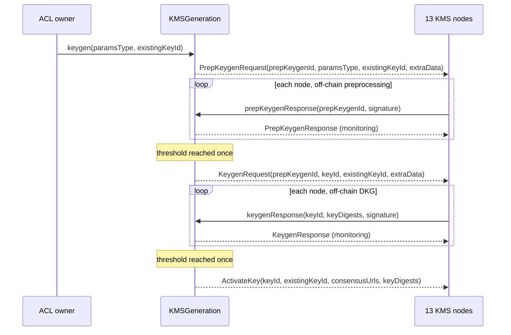

The Zama protocol encrypts every value under one global FHE public key, computes on ciphertexts with an evaluation key, and decrypts through thirteen organisations that each hold a share of the private key. Somebody has to decide that a key exists, which one is current, and where its public material can be downloaded — and that decision cannot live in a configuration file, because every contract on every supported chain depends on it.

It lives in a 1,000-line Solidity contract on the Gateway chain, `KMSGeneration.sol`. It is worth reading because it is the seam between two very different worlds: a multi-party cryptographic ceremony that happens entirely off-chain, and a smart contract that must record the outcome in a way anyone can check. The contract never touches key material. What it does is decide *when thirteen independent parties have said the same thing*, and publish what they said.

Two earlier articles set the scene: the [architecture article]({{site.url_complet}}/2026/09/18/zama-fhevm-architecture-components-trust-model/) placed the KMS in the protocol, and the [KMS article]({{site.url_complet}}/2026/09/18/zama-kms-threshold-key-management-architecture-and-operation/) opened its repository. This one reads the contract that drives it from the chain.

> Source read at [`zama-ai/fhevm`](https://github.com/zama-ai/fhevm) commit `ac6ff45ebb27c1300cc44669235751c657b3ce14`, `host-contracts/contracts/KMSGeneration.sol`, reporting `KMSGeneration v0.3.0`.

> This article has been made with the help of [Claude Code](https://claude.com/product/claude-code) and several custom skills

[TOC]

## What the contract is for

```solidity
contract KMSGeneration is IKMSGeneration, EIP712Upgradeable, UUPSUpgradeableEmptyProxy, ACLOwnable
```

Four responsibilities, and no more:

1. **Order a ceremony.** `keygen` and `crsgenRequest` emit events that the thirteen KMS nodes are listening for.
2. **Count agreement.** Each node answers with an EIP-712 signature over what it produced. The contract tallies signatures until a threshold is met.
3. **Publish the result.** On agreement it emits the digests of the generated material and the storage URLs where it can be downloaded.
4. **Name the current key.** `getActiveKeyId` and `getActiveCrsId` are what the rest of the protocol reads.

What it does **not** do is equally important, and the article comes back to it: it never verifies that the cryptography was performed correctly. It verifies that enough registered parties signed the same statement about it.

Two permissions govern everything. `onlyACLOwner` — the owner of the `ACL` contract, resolved at call time through `Ownable2StepUpgradeable(aclAdd).owner()` — may request, abort and upgrade. Responses come from KMS nodes, authorised not by a role but by membership of a *context*, which is the next idea to introduce.

## Contexts and epochs: who the thirteen are, at the time you asked

The set of KMS nodes is not a constant. It is a **context**, held in `ProtocolConfig`, and it can be rotated. That creates an obvious hazard: a ceremony takes time, so a rotation in the middle of one could split the answers across two committees, or invalidate signatures already given.

The contract solves it by pinning. Every request stores the context and epoch that were current when it was made:

```solidity
(uint256 contextId, uint256 epochId) = PROTOCOL_CONFIG.getCurrentKmsContextAndEpoch();
bytes memory extraData = _encodeRequestExtraDataV2(contextId, epochId);
$.requestExtraData[prepKeygenId] = extraData;
$.requestExtraData[keyId] = extraData;
```

and every response is judged against the *stored* context, never the latest one:

```solidity
function _loadExtraDataAndAuthorizeResponse(uint256 requestId)
    internal view virtual returns (bytes memory extraData, uint256 contextId)
{
    extraData = $.requestExtraData[requestId];
    contextId = _extractContextIdFromExtraData(extraData);
    if (!PROTOCOL_CONFIG.isKmsTxSenderForContext(contextId, msg.sender)) {
        revert NotKmsTxSender(msg.sender);
    }
}
```

The comment on that function states the intent plainly: *"so rotations do not invalidate in-flight responses from the original KMS committee."*

`extraData` is a small versioned blob, and its three layouts are a fossil record of the contract's history:

| Version | Layout | Length | Meaning |
|---|---|---|---|
| v0 | empty, or leading `0x00` | any | fall back to the *current* context — pre-dates pinning |
| v1 | `[0x01][contextId]` | 33 bytes | migrated or imported state |
| v2 | `[0x02][contextId][epochId]` | 65 bytes | every new request |

Anything else reverts with `UnsupportedExtraDataVersion`, and a wrong length with `DeserializingExtraDataFail`. The `extraData` is also hashed into every EIP-712 struct, so a signature given under one context cannot be replayed under another.

## Request IDs carry their own type

There is one `isRequestDone` mapping, one `consensusDigest` mapping and one `consensusTxSenderAddresses` mapping for preprocessing, key generation and CRS generation alike. That is only safe because IDs cannot collide, and they cannot collide because the first byte of an ID is a type tag:

```solidity
uint256 constant PREP_KEYGEN_COUNTER_BASE = uint256(RequestType.PrepKeygen) << REQUEST_TYPE_SHIFT;
uint256 constant KEY_COUNTER_BASE         = uint256(RequestType.Keygen)     << REQUEST_TYPE_SHIFT;
uint256 constant CRS_COUNTER_BASE         = uint256(RequestType.Crsgen)     << REQUEST_TYPE_SHIFT;
```

A preprocessing ID is `[0x03 | 31 counter bytes]`, a key ID `[0x04 | …]`, a CRS ID `[0x05 | …]`, a KMS context `[0x07 | …]`, an epoch `[0x08 | …]`. The counters are initialised to their base at deployment, which is why every bounds check in the contract has the shape `if (id > counter || id <= BASE)`.

The same trick lets one mapping hold both directions of the preprocessing↔keygen pairing:

```solidity
$.keygenIdPairs[prepKeygenId] = keyId;
$.keygenIdPairs[keyId] = prepKeygenId;
```

## Key generation, in two phases

A DKG for FHE parameters is expensive, and it splits into an offline preprocessing stage — correlated randomness, independent of the key that will come out — and the key generation proper. The contract mirrors that split, and gates the second phase on the first.



**The request.** `keygen(ParamsType paramsType, uint256 existingKeyId)` first refuses to start if the previous one is unfinished:

```solidity
uint256 previousKeyId = $.keyCounter;
if (previousKeyId != KEY_COUNTER_BASE && !$.isRequestDone[previousKeyId]) {
    revert KeygenOngoing(previousKeyId);
}
```

One ceremony at a time, globally. It then allocates both IDs, pairs them, stores the parameter set (`ParamsType` is only `Default` or `Test`), pins the context, and emits `PrepKeygenRequest`. Note what is *not* emitted: no `KeygenRequest` yet. The second phase is not announced until the first has concluded.

**The preprocessing response.** Each node signs `PrepKeygenVerification(uint256 prepKeygenId, bytes extraData)` and calls `prepKeygenResponse`. The contract recovers the signer, checks it, refuses a second signature from the same signer (`KmsAlreadySignedForPrepKeygen`), records the transaction sender in a tally **keyed by the digest**, and always emits `PrepKeygenResponse` for monitoring. Then:

```solidity
if (!$.isRequestDone[prepKeygenId] && _isKmsConsensusReachedForContext(contextId, consensusTxSenders.length)) {
    $.isRequestDone[prepKeygenId] = true;
    $.consensusDigest[prepKeygenId] = digest;
    uint256 keyId = $.keygenIdPairs[prepKeygenId];
    emit KeygenRequest(prepKeygenId, keyId, $.existingKeyIdByRequestId[keyId], extraData);
}
```

Crossing the threshold is what *starts the second phase*. The comment above it explains the design for late arrivals: *"a 'late' response will not be reverted, just ignored and no event will be emitted"*. A slow but honest node still gets its signature recorded — and, as we will see, still gets its storage URL published.

**The key generation response.** Same shape, with a payload. Each node signs `KeygenVerification(uint256 prepKeygenId, uint256 keyId, KeyDigest[] keyDigests, bytes extraData)`, where `KeyDigest` is a nested EIP-712 struct declared explicitly because the standard requires it:

```solidity
string private constant EIP712_KEYGEN_TYPE =
    "KeygenVerification(uint256 prepKeygenId,uint256 keyId,KeyDigest[] keyDigests,bytes extraData)KeyDigest(uint8 keyType,bytes digest)";
```

The digests are what make the ceremony checkable. `KeyType` has four values:

| Value | Name | What it is |
|---|---|---|
| 0 | `Server` | the **evaluation key** — computes on ciphertexts, cannot decrypt |
| 1 | `Public` | the **public key** — what wallets encrypt with |
| 2 | `Reserved` | unused |
| 3 | `CompressedKeySet` | a compressed bundle, added to an existing key by migration |

There is no entry for the private key, and there never could be: it is produced as thirteen shares that never leave their nodes.

`keygenResponse` refuses an empty digest array (`EmptyKeyDigests`) and refuses to run before the preprocessing phase concluded (`KeyManagementRequestPending`). On the crossing call it activates:

```solidity
uint256 storedKeyId = existingKeyId == 0 ? keyId : existingKeyId;
for (uint256 i = 0; i < keyDigests.length; i++) {
    if (existingKeyId == 0 || keyDigests[i].keyType == KeyType.CompressedKeySet) {
        $.keyDigests[storedKeyId].push(keyDigests[i]);
    }
}
if (existingKeyId == 0) {
    $.activeKeyId = keyId;
    $.completedKeyIds.push(keyId);
}
emit ActivateKey(keyId, existingKeyId, consensusUrls, keyDigests);
```

## What "consensus" means here

This is the part worth being precise about, because the word is doing unusual work. The contract is not running a consensus protocol. It is counting signatures, and four separate checks make that counting meaningful.

**1. The tally is keyed by the digest, not by the request.**

```solidity
address[] storage consensusTxSenders = $.consensusTxSenderAddresses[keyId][digest];
consensusTxSenders.push(msg.sender);
```

Nodes that produced *different* material land in different buckets, and neither bucket is advanced by the other. Agreement means agreement on a value, not mere participation.

**2. One signature per signer.** `kmsHasSignedForResponse[requestId][kmsSigner]` makes a second attempt revert. A node cannot inflate the count.

**3. The signer and the transaction sender must be the same node.** This is the subtlest check in the contract:

```solidity
if (!PROTOCOL_CONFIG.isKmsSignerForContext(contextId, signerAddress)) {
    revert NotKmsSigner(signerAddress);
}
KmsNode memory node = PROTOCOL_CONFIG.getKmsNodeForContext(contextId, txSenderAddress);
if (node.signerAddress != signerAddress) {
    revert KmsSignerDoesNotMatchTxSender(signerAddress, txSenderAddress);
}
```

Each KMS node has two identities: a **signer** key that signs the EIP-712 payload and a **transaction sender** key that pays gas. Requiring them to match, within the pinned context, stops one node from harvesting another's signature from the mempool and submitting it as its own — which matters, because the transaction sender is what gets published in the next step.

**4. The threshold is a governance parameter, not a constant.**

```solidity
uint256 consensusThreshold = PROTOCOL_CONFIG.getKmsGenThresholdForContext(contextId);
return kmsCounter >= consensusThreshold;
```

Set per context by `updateKmsGenThresholdForContext`, under `onlyACLOwner`. It is deliberately separate from the decryption threshold $t = 4$ of the MPC protocol: generating a key and decrypting a value are different operations with different safety requirements, and nothing in this contract ties the two numbers together.

## The storage URLs: why the key material is public

When the threshold is crossed, the contract turns the list of agreeing transaction senders into a list of download locations:

```solidity
function _buildConsensusStorageUrls(uint256 contextId, address[] memory consensusTxSenders)
    internal view virtual returns (string[] memory)
{
    for (uint256 i = 0; i < len; i++) {
        urls[i] = PROTOCOL_CONFIG.getKmsNodeForContext(contextId, consensusTxSenders[i]).storageUrl;
    }
}
```

`ActivateKey(keyId, existingKeyId, consensusUrls, keyDigests)` therefore carries, in one event, *what was generated* (digests, per key type) and *where every agreeing node published it*. `getKeyMaterials(keyId)` returns the same pair on demand.

This is the mechanism behind a claim that is often stated without the on-chain record that makes it checkable: **the public key and the evaluation key are public**. Not "available to coprocessors" — published, at URLs announced on-chain, with digests anchored on-chain, redundantly by each node that took part. Anyone can fetch the evaluation key, fetch the ciphertexts from public storage, re-run an operation and compare the result with what the coprocessors committed to. Without this contract publishing digest and location together, that verifiability would not exist.

## CRS generation

`crsgenRequest(uint256 maxBitLength, ParamsType paramsType)` and `crsgenResponse(uint256 crsId, bytes crsDigest, bytes signature)` are the same request-and-response pattern, in a single phase. The common reference string is what the client-side zero-knowledge proof of ciphertext well-formedness is defined against — the `inputProof` that a confidential token's transfer carries — so the protocol needs an agreed CRS for the same reason it needs an agreed key.

`maxBitLength` is stored at request time and hashed into the signed struct:

```solidity
bytes32 digest = _hashCrsgenVerification(crsId, $.crsMaxBitLength[crsId], crsDigest, extraData);
```

so a node cannot answer a request for one size with material for another. On consensus the contract stores the digest, sets `activeCrsId`, appends to `completedCrsIds` and emits `ActivateCrs`.

## Migration: adding compressed material to a key that already exists

The `existingKeyId` parameter of `keygen` switches the whole flow into a different mode. Instead of producing a new key, the ceremony produces a **compressed key set** for a key already in use, and the result is filed against the old ID.

`_checkMigrationRequest` is a list of five conditions, and each one is worth a sentence:

```solidity
_checkGeneratedKeyId(existingKeyId);                       // it exists, is done, was not aborted
if (existingKeyId != $.activeKeyId) revert NotActiveKey(existingKeyId);
if (paramsType != existingParamsType) revert InvalidMigrationParamsType(...);
// … and no CompressedKeySet digest already recorded for it
// … and any previous migration request for it is finished and did not reach consensus
```

Only the **active** key may be migrated, and only with its own parameter set. The last two conditions make the operation once-only: a key that already has compressed material cannot get a second set, and a previous attempt that succeeded blocks a repeat, while one that was aborted (`consensusDigest == 0`) does not.

The response must carry exactly one non-empty `CompressedKeySet` entry, checked by `_checkCompressedKeySetDigest` before anything else happens. And the recording, as seen above, is deliberately asymmetric: only the `CompressedKeySet` digest is appended, `activeKeyId` is unchanged, and the migration's own ID is never added to `completedKeyIds`. A migration request ID is a bookkeeping artefact, not a key — which is why `_checkGeneratedKeyId` rejects any ID that has an `existingKeyIdByRequestId` entry.

## Aborting

Because one ceremony blocks the next, a ceremony that never concludes would freeze key generation permanently. `abortKeygen(prepKeygenId)` is the escape hatch, and it marks both phases done at once:

```solidity
uint256 keyId = $.keygenIdPairs[prepKeygenId];
if ($.isRequestDone[keyId]) revert AbortKeygenAlreadyDone(prepKeygenId);
$.isRequestDone[prepKeygenId] = true;
if (keyId != 0) $.isRequestDone[keyId] = true;
```

Note the condition: abort is keyed on the *keygen* phase being unfinished, not the preprocessing one, so a ceremony that completed preprocessing and then stalled can still be abandoned.

An aborted request leaves a distinctive fingerprint: `isRequestDone` is true but `consensusDigest` is zero. The getters read exactly that and revert with `KeyAborted` / `CrsAborted`, so an abandoned ID can never be mistaken for a usable one.

## What the contract trusts, and what it does not verify

| Property | Enforced how |
|---|---|
| Only the protocol owner may start or abandon a ceremony | `onlyACLOwner` on `keygen`, `crsgenRequest`, `abortKeygen`, `abortCrsgen`, `_authorizeUpgrade` |
| Only a registered node of the request's own committee may answer | `isKmsTxSenderForContext` + `isKmsSignerForContext`, both against the pinned `contextId` |
| A node cannot answer twice, or for another node | `kmsHasSignedForResponse`, and signer/tx-sender matching |
| Agreement is on a value, not on participation | tally keyed by EIP-712 digest |
| A committee rotation cannot split or void a running ceremony | context pinned in `extraData` at request time |
| A signature cannot be replayed into another context or another key size | `extraData` and `maxBitLength` are inside the signed struct |
| An abandoned ceremony can never be read as a key | `consensusDigest == 0` → `KeyAborted` |

And the things it takes on faith:

- **That the DKG was performed correctly.** The chain sees digests. It has no way to know whether the material behind them was generated by the protocol, and no proof is submitted. The guarantee is social and cryptographic elsewhere: a threshold of independent organisations signed the same digest, and anyone can download the published material and check it against that digest.
- **That the threshold is set sensibly.** `getKmsGenThresholdForContext` is whatever the ACL owner last wrote. A threshold of 1 would make a single node's word sufficient, and the contract would not object.
- **That the ACL owner is honest about aborts.** Abort requires no agreement from the nodes. An owner can abandon a ceremony that was about to conclude.
- **That the storage URLs are served.** They are strings from a node's registration record. Nothing on-chain checks that the bytes behind a URL match the digest beside it; that check is the reader's to perform, and the digest is published precisely so that it can be.

None of these is a flaw so much as a boundary. The contract's job is to be the authoritative, replay-resistant, rotation-safe record of *what the committee said*. Deciding whether the committee is trustworthy is the protocol's job, and it is answered by who the thirteen are.

## Frequently Asked Questions

**Q: Why two phases instead of one?**

The preprocessing stage of the DKG produces correlated randomness that does not depend on the key eventually produced, and it dominates the cost. Splitting it lets the chain confirm that the expensive part finished — and that the committee agreed it finished — before announcing the second phase. `KeygenRequest` is emitted by the preprocessing consensus, not by the original caller.

**Q: What happens to a node that answers after the threshold is reached?**

Its signature is validated, deduplicated and recorded, and `KeygenResponse` is emitted for monitoring. Nothing else: `isRequestDone` is already true, so no second activation occurs. Its transaction sender is appended to the same digest-keyed list, which means its storage URL will appear in `getKeyMaterials` even though it missed the activation event. Being slow costs a node its place in the event, not its place in the record.

**Q: Could two different key materials both reach the threshold?**

Not for the same request. Tallies are per digest, but `isRequestDone` is per request and is set by whichever digest crosses first. A second group agreeing on different material afterwards would find the request already closed. For that to be a problem at all, more than the threshold of nodes would have to have produced material inconsistent with the others.

**Q: Is the evaluation key a secret held by the coprocessors?**

No. It is `KeyType.Server`, and its digest and download URLs are published by `ActivateKey` exactly like the public key's. Coprocessors hold it because they are the ones computing; anyone may fetch it. The protocol's public verifiability argument depends on that being true — a third party has to be able to re-run an operation.

**Q: Why does the contract store both a signer address and a transaction sender address for every node?**

They are different keys with different exposure. The signer key authenticates the cryptographic statement; the transaction sender key pays gas and is the one whose registration record carries the node's `storageUrl`. Requiring them to match within the pinned context prevents a node from relaying someone else's signature and having its own URL published as a result.

**Q: What does `ParamsType.Test` do?**

It selects a different FHE parameter set for the ceremony. The contract only stores and echoes it — `getKeyParamsType` reads it back through the preprocessing ID — and it is hashed into nothing, so it is a label for the off-chain nodes rather than a security control.

**Q: Can a key be rotated?**

`keygen` with `existingKeyId == 0` produces a new key and sets `activeKeyId` to it. Nothing migrates the ciphertexts encrypted under the old one, and both remain readable through `getKeyMaterials` since `completedKeyIds` keeps the history. Rotation in the sense of *re-encrypting existing state* is not this contract's concern.

## Glossary

| Term | Meaning |
|---|---|
| **Context** | The set of KMS nodes, with their signer addresses, transaction senders and storage URLs, held in `ProtocolConfig` and identifiable by a type-tagged ID |
| **Epoch** | A counter recorded beside the context in `extraData` v2 |
| **Preprocessing keygen** | The first phase of the DKG, producing key-independent correlated randomness |
| **`KeyDigest`** | A `(keyType, digest)` pair, signed as a nested EIP-712 struct |
| **CRS** | Common reference string, the public parameter the client-side ZK proof of a ciphertext is defined against |
| **Compressed key set** | A compressed bundle of key material added to an already-active key by a migration request |
| **Consensus storage URLs** | The download locations of the agreeing nodes, published with the digests on activation |

## Sources

- [zama-ai/fhevm](https://github.com/zama-ai/fhevm), commit `ac6ff45ebb27c1300cc44669235751c657b3ce14` — `host-contracts/contracts/KMSGeneration.sol`, `interfaces/IKMSGeneration.sol`, `shared/Constants.sol`, `shared/ACLOwnable.sol`, `ProtocolConfig.sol`
- [zama-ai/kms](https://github.com/zama-ai/kms) — the node implementation that answers these events
- [The Zama KMS, from MPC protocol to enclave deployment]({{site.url_complet}}/2026/09/18/zama-kms-threshold-key-management-architecture-and-operation/)
- [The Zama FHEVM: architecture, components and trust model]({{site.url_complet}}/2026/09/18/zama-fhevm-architecture-components-trust-model/)
