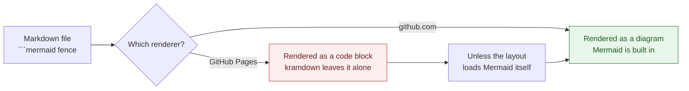
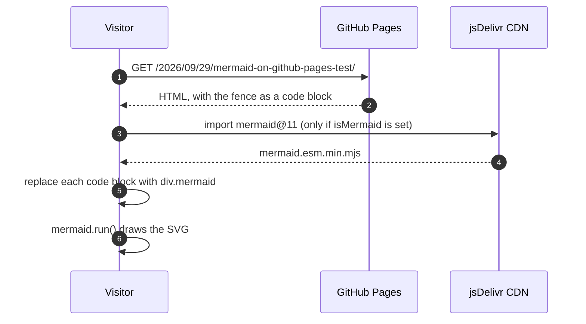
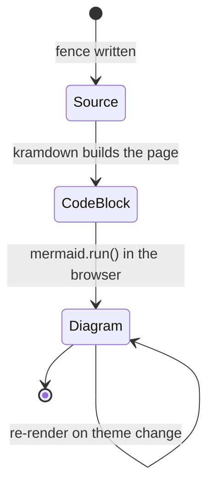

A Mermaid diagram in a Markdown file renders on github.com and shows up as a block of source text on the same repository's GitHub Pages site. The two are different renderers, and only one of them knows what Mermaid is.

- **github.com** renders `.md` files with its own pipeline, which has had Mermaid support since February 2022 and currently runs Mermaid 11.
- **GitHub Pages** builds the site with Jekyll. Kramdown turns the fence into `<pre><code class="language-mermaid">` and stops there. Nothing on the page loads Mermaid, so the browser displays the source.

This page is the test. It loads Mermaid only when a post declares `isMermaid: true`, the same way the site already loads MathJax for `isMath: true`.

[TOC]

## Flowchart

## Sequence diagram

## State diagram

## What the include does

Three details matter, and each one comes from a difference between Mermaid's expectations and what Jekyll produces.

- **Kramdown wraps the source in two elements.** Mermaid wants the diagram source inside the element it is pointed at, so each `code.language-mermaid` is read with `textContent`, which decodes HTML entities and drops any syntax-highlighting spans, and the wrapper is replaced by a `
`.
- **Mermaid marks what it has already drawn.** It sets `data-processed` on a node and skips it afterwards, so a second render needs the original source back. The include keeps it in `data-source` and restores it before re-running.
- **The site has a light and a dark theme.** A `MutationObserver` on `data-theme` re-initialises Mermaid with its `dark` or `default` theme and redraws, so the diagrams follow the page instead of staying bright on a dark background.

## The cost, and when to pay it

Loading a diagram library on a page that has no diagram is waste, which is why the script is gated on a front-matter flag rather than added to every page. The Mermaid ESM bundle is not small, and it is fetched from a CDN, so a reader without JavaScript, or behind a CDN block, sees the fence as source text. That is the honest failure mode for this approach: the page stays readable, the diagram does not appear.

An alternative avoids the runtime entirely: render the diagrams to SVG at build time with the Mermaid CLI and commit the images. It costs a build step and the diagrams stop being editable in the Markdown, and in exchange nothing is fetched at page load and the result renders everywhere, including in RSS readers.

## References

- [Include diagrams in your Markdown files with Mermaid](https://github.blog/developer-skills/github/include-diagrams-markdown-files-mermaid/), GitHub, February 2022
- [Creating diagrams — GitHub Docs](https://docs.github.com/en/get-started/writing-on-github/working-with-advanced-formatting/creating-diagrams)
- [Mermaid documentation](https://mermaid.js.org/)
