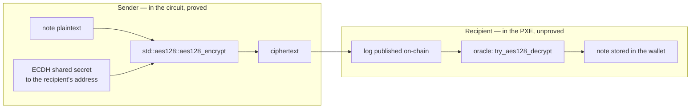
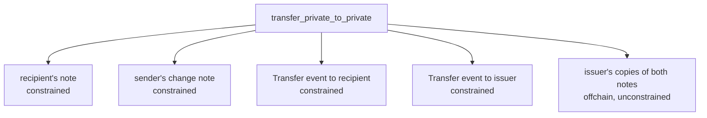

[Aztec](https://aztec.network/) is a privacy-focused Layer 2 on Ethereum. A contract there has a private side, proved on the user's own device over encrypted *notes* that only their owner can read, and a public side executed by a sequencer. When a private function creates a note for somebody, it does not hand it over directly: it encrypts the note and publishes or transmits the ciphertext, and the recipient's wallet finds it later by trial decryption. [An earlier article]({{site.url_complet}}/2026/09/08/how-aztec-works-private-execution-model/) covers that execution model.

This one answers a narrower question that came up while reviewing a token implementation, and which the framework's own vocabulary makes easy to get wrong. The encryption is AES-128. A note delivery can be *constrained* or *unconstrained*. So: when a delivery is constrained, is the AES-128 encryption itself proved inside the circuit, or does the circuit merely prove something about the plaintext while the encryption happens outside it?

The answer is yes, and it is worth having the evidence rather than the conclusion, because the cost of that guarantee is the single largest line item in a note-heavy Aztec contract.

> This article has been made with the help of [Claude Code](https://claude.com/product/claude-code) and several custom skills

[TOC]

## Why the question is not obvious

Two things make it reasonable to doubt.

The first is that a zero-knowledge circuit is an expensive place to compute anything, and AES is a byte-oriented cipher built from S-box lookups and finite-field operations over GF(2⁸) — not a natural fit for an arithmetic circuit over a large prime field. A designer would be forgiven for pushing it outside the proof and constraining only a commitment to the result.

The second is that Aztec really does push a great deal outside the circuit. The private execution environment (PXE) answers *oracle* calls from the circuit, and a value obtained that way is unproven by construction; Noir marks those call sites `unsafe` for exactly that reason. Decryption, key derivation, randomness and note discovery all lean on oracles. Encryption sitting alongside them would be entirely in keeping.

So the question is a real one, and the answer has to come from the framework rather than from intuition.

## The three delivery modes

Creating a note in `aztec-nr` yields a message that **must** be delivered, and the author chooses how. The three modes are not three prices for the same thing; they buy different guarantees.

| Mode | On-chain data | Proving cost | What it proves about the ciphertext |
|---|---|---|---|
| `offchain()` | none | none | nothing |
| `onchain_unconstrained()` | the log | none | nothing |
| `onchain_constrained()` | the log | encryption **and** tagging | the recipient can find and decrypt it |

The framework's own documentation is explicit about the middle row being a poor trade in most cases: paying for blob space while buying no guarantee is strictly worse than arranging offchain delivery, if you are willing to build the offchain channel. The first and second rows differ in *where the ciphertext goes*, not in whether anyone proved it was formed correctly.

## What the documentation says

`aztec-nr`'s `note_delivery` documentation states the guarantee for the constrained mode in one sentence:

> **Guarantees:** Recipient will always be able to find correctly encrypted content: both the encryption and the discovery tag are constrained and stored onchain.

And the cost, in the line above it:

> **Costs:** DA gas fees for the encrypted log, proving time overhead for encryption and tagging.

Those two lines answer the question. "Proving time overhead for encryption" is not a phrase that applies to work done outside a proof. The contrast is equally explicit for the cheap mode, which "encrypts messages without constraints and emits them via an oracle call as offchain effects".

Documentation can drift from code, so the next section checks it.

## What the implementation does

In `aztec-nr` at `v5.2.0`, the encryption lives in `messages/encryption/aes128.nr`. Two imports at the top of that file answer the question on their own:

```rust
use aztec::oracle::aes128_decrypt::try_aes128_decrypt;   // decryption: an oracle
use std::aes128::aes128_encrypt;                          // encryption: the Noir stdlib
```

`std::aes128::aes128_encrypt` is a Noir **standard library** function. A call to it compiles to constraints in whatever circuit contains it, exactly like a Poseidon2 hash or a field multiplication. The file calls it twice, once for the message body and once for the header:

```rust
let ciphertext_bytes = aes128_encrypt(plaintext_bytes, body_iv, body_sym_key);
// …
let header_ciphertext_bytes = aes128_encrypt(header_plaintext, header_iv, header_sym_key);
```

Decryption is the other case entirely. `try_aes128_decrypt` comes from `aztec::oracle`, so it is an unconstrained call into the PXE, and it is used during note discovery rather than during the transaction that created the note.

That asymmetry is the design, and it points the right way:



The sender must **prove** it encrypted correctly, because the recipient is relying on being able to read the note. The recipient has nothing to prove to anybody: it is trying keys against logs on its own machine, and a failed attempt simply means the log was not for it.

## The constraints are in the contract's circuit, not the protocol's

One correction to the way the question is often phrased: the AES constraints are **not** in Aztec's protocol circuits. They are in the application circuit — the private function of the contract that created the note.

Two independent pieces of evidence:

- **`aztec profile gates` attributes the cost to the contract's functions.** That tool reports application circuits only and knows nothing of the kernels. In the security-token implementation this question arose from, a constrained delivery measured about **20,200 gates**, and it showed up inside `transfer_private_to_private`, `mint_to_private` and `burn` rather than as protocol overhead.
- **AES-128 does not work in public functions.** The framework's limitations page lists AES-128, ECDSA, Blake2s and Blake3 among the primitives the AVM does not implement, so a public function using one fails at transpile time. A primitive that is unavailable in the AVM and available in private functions is, by definition, a circuit primitive.

The practical consequence is that the cost is the contract author's, per call site, and it scales with the number of recipients rather than with the transaction.

## What it costs, and why that shapes designs

A single constrained delivery at roughly 20,200 gates sounds modest next to a private transfer's six-figure total, until a contract delivers several per call. The token this question came from delivers, for one private transfer, the recipient's note, the sender's change note, and a `Transfer` event to two parties — and the event's deliveries alone are why its batched transfer cap fell from four recipients to two.



The design question is therefore never "should encryption be constrained" in the abstract, but *per recipient*: does this particular party need a guarantee that it can read what was sent, or is the sender already motivated to deliver? A change note going back to the sender needs no guarantee against the sender. A note minted to an arbitrary third party does.

## Two details in the source worth knowing

Reading `aes128.nr` for the answer surfaces two decisions that are not in the documentation and that matter to anyone reasoning about the encryption.

**An invalid recipient address does not fail the transaction.** Deriving the shared secret requires the recipient's address to be a valid point on the curve, and roughly half of all field elements are not. Rather than reverting, the library encrypts to a shared secret derived from a *random* valid address. The comment explains why:

> We could simply fail, but that'd introduce a potential security issue in which an attacker forces a contract to encrypt a message for an invalid address, resulting in an impossible transaction — this is sometimes called a 'king of the hill' attack.

The note is then undeliverable, but the transaction is not blocked. This is the mechanism behind a class of confusing failures: a contract that reads an address from state which has not yet been initialised will encrypt to the zero address, which is not a curve point, and the symptom appears far from the cause.

**The ciphertext padding is unconstrained randomness, deliberately.** Message ciphertexts are padded to a fixed length so that a short message is indistinguishable from a long one, and the padding fields come from `unsafe { random() }` — an oracle value the circuit never checks. The justification is sound and worth stating, because it is the same reasoning that governs every unconstrained value in a private function:

> we assume that the sender wants for the message to be private — a malicious one could simply reveal its contents publicly. It is therefore fine to trust the sender to provide random padding.

A sender that supplies bad padding harms only itself. That is the test for whether an unconstrained value is acceptable: not "is it checked" but "who is hurt if it is wrong".

## Conclusion

The encryption of an Aztec note message is constrained when, and only when, the author asks for it.

- **Under `onchain_constrained()` the AES-128 encryption is proved in-circuit.** The documentation says both the encryption and the discovery tag are constrained; the implementation calls Noir's standard-library `aes128_encrypt`, which compiles to constraints.
- **Decryption is not, and does not need to be.** It runs through an oracle in the recipient's PXE during note discovery, where nobody is relying on the result being provable.
- **The constraints belong to the contract's circuit**, not to the protocol's kernels: the gates are attributed per function, and AES-128 is unavailable in public functions precisely because it is a circuit primitive.
- **The other two modes prove nothing about the ciphertext.** `offchain()` and `onchain_unconstrained()` differ from each other in data availability, not in assurance.
- **The choice is per recipient, not per contract.** Ask whether that party needs a guarantee it can read what was sent, or whether the sender is already motivated to deliver.


## Annex

### Key Terms

| Term | Definition |
|------|------------|
| **Note** | A unit of private state on Aztec, held as a commitment in a Merkle tree, whose contents only the owner can read. |
| **Note message** | The encrypted payload that tells a recipient a note exists and what it contains; it must be delivered or the note is unusable. |
| **Constrained** | Computed inside the zero-knowledge circuit, so the proof attests that it was done correctly. |
| **Unconstrained** | Computed outside the circuit, typically by the PXE through an oracle; the proof says nothing about it. |
| **Oracle** | A call from a circuit out to the execution environment, returning a value the circuit has not verified. |
| **PXE** | The private execution environment on the user's own machine, which proves private functions and stores the notes it discovers. |
| **Delivery mode** | The author's choice of how a note message reaches its recipient: `offchain()`, `onchain_unconstrained()` or `onchain_constrained()`. |
| **Discovery tag** | A value attached to a log that lets a recipient's PXE identify candidate messages without decrypting everything on chain. |
| **AVM** | The Aztec Virtual Machine, which executes public functions; it implements a smaller set of cryptographic primitives than private circuits do. |
| **Gate** | The unit of circuit size, and so of the user's proving time; the metric a private function's cost is measured in. |

### Invariants

| Invariant | Enforced by | Breaks if |
|---|---|---|
| A recipient of a constrained delivery can decrypt what was sent. | The AES-128 encryption and the tag are computed in-circuit, so the proof covers them. | The delivery mode is changed to `onchain_unconstrained()` or `offchain()`, which prove neither. |
| A note message is never silently dropped. | The message value returned by a note operation must have a delivery method called on it; the compiler warns on an unused value. | The warning is ignored, in which case the note exists on-chain and no wallet can find it. |
| An invalid recipient address cannot block a transaction. | The library substitutes a random valid address rather than reverting when the shared secret cannot be derived. | Removed in favour of an assertion, which would reintroduce the king-of-the-hill denial of service. |
| Ciphertext length reveals nothing about message length. | Padding to a fixed length with unconstrained random fields. | The padding becomes distinguishable from masked data, for example by using a constant instead of randomness. |

### Integration Notes

| Behaviour | What an integrator should do |
|---|---|
| A constrained delivery costs proving time on the *user's* device, not gas. | Count deliveries per entry point, and measure with `aztec profile gates` rather than estimating; the per-recipient cost is what caps batch sizes. |
| Encrypting to a party who cannot receive fails late and far from the cause. | Validate any address read from state before using it as a recipient, especially one that may still hold its default value. |
| Decryption is unconstrained, so a contract cannot verify that a recipient read a note. | Do not design a flow whose correctness depends on the recipient having processed a message; use an on-chain effect if the contract must know. |
| AES-128 is unavailable in public functions. | Keep anything requiring encryption in the private half; a design document describing encryption "in public" does not compile. |

## Frequently Asked Questions

**Q: Is the AES-128 encryption of a note message constrained?**

Under `onchain_constrained()`, yes: the framework documents that "both the encryption and the discovery tag are constrained", and the implementation calls Noir's standard-library `aes128_encrypt`, which compiles to circuit constraints. Under `offchain()` and `onchain_unconstrained()` it is not — both encrypt without constraints.

**Q: Why is decryption unconstrained when encryption is not?**

Because the two parties are in different positions. The sender is making a claim somebody else depends on — that the ciphertext can be read by its intended recipient — and a claim like that has to be proved. The recipient is trying keys against candidate logs on its own machine, and a wrong result simply means the log was not addressed to it. Nobody relies on the recipient's decryption being provable, so proving it would be pure cost.

**Q: Are the constraints in the protocol circuits or in my contract's circuit?**

In your contract's. Two things show it: `aztec profile gates`, which reports application circuits and not kernels, attributes the roughly 20,200 gates per constrained delivery to the private functions that perform them; and AES-128 is absent from the AVM, so it cannot be used in public functions at all. A primitive available in private functions and unavailable in public ones is a circuit primitive.

**Q: What is the difference between `offchain()` and `onchain_unconstrained()`, if neither proves anything?**

Data availability. `onchain_unconstrained()` posts the encrypted log to the chain, so the recipient can find it later from public data; `offchain()` transmits it out of band and pays nothing for blob space. Neither proves the ciphertext was formed correctly, which is why the framework's documentation treats `onchain_unconstrained()` as the weaker choice of the two whenever an offchain channel is available: it costs money and buys no guarantee.

**Q: A contract encrypts to an address that turns out to be invalid. What happens?**

The transaction succeeds and the note becomes undeliverable. The library derives the shared secret from a randomly chosen valid address instead of reverting, deliberately, to stop an attacker forcing a contract into an impossible transaction — the comment in the source calls this a king-of-the-hill attack. The practical consequence is that the symptom of an uninitialised recipient address appears nowhere near its cause, so addresses read from state are worth validating before use.

**Q: If a constrained delivery is 20,200 gates, when is it wrong to use one?**

When the sender is the party that would suffer from non-delivery. The canonical case is a change note returning to the sender: paying to prove, to yourself, that you encrypted your own note correctly buys nothing. The same applies wherever the sender is otherwise motivated to deliver, such as a payment where the recipient withholds goods until the note arrives. Reserve the constrained mode for a recipient who has no recourse, such as a third party being minted to.

## References

### Analyzed source

- [AztecProtocol/aztec-nr](https://github.com/AztecProtocol/aztec-nr) — read at tag `v5.2.0`, 2026-09-30. The file cited throughout is `aztec/src/messages/encryption/aes128.nr`; the pinned revision is the tag rather than a commit SHA, because the source was read from the resolved dependency rather than a clone.

### Specifications and framework documentation

- [Aztec developer documentation](https://docs.aztec.network/) — note delivery, note discovery and the AVM's primitive set.
- [Noir standard library](https://noir-lang.org/) — `std::aes128`, the in-circuit AES-128 implementation.

### Related articles

- [How Aztec Works — Private Execution, Notes and Nullifiers, and a Comparison with Zama FHE, Zcash, Canton and Ethereum]({{site.url_complet}}/2026/09/08/how-aztec-works-private-execution-model/)
- [Ephemeral Keys on Aztec — Encrypting to an Address, the Curve Behind It, and What a Quantum Computer Would Do to It]({{site.url_complet}}/2026/09/17/aztec-ephemeral-keys-ecdh-encryption-post-quantum/)
- [Randomness on Aztec — One Oracle, Four Uses, and Why the Circuit Never Checks It]({{site.url_complet}}/2026/09/17/aztec-randomness-notes-oracle-unconstrained/)
- [Gates on Aztec — What a Private Function Costs, Where the Cost Hides, and Seven Measured Ways to Lower It]({{site.url_complet}}/2026/09/18/aztec-gate-count-optimization-private-functions/)
- [Partial Notes on Aztec — Deferred Completion and Private DeFi Composability]({{site.url_complet}}/2026/09/09/aztec-partial-notes-private-defi-composability/)
