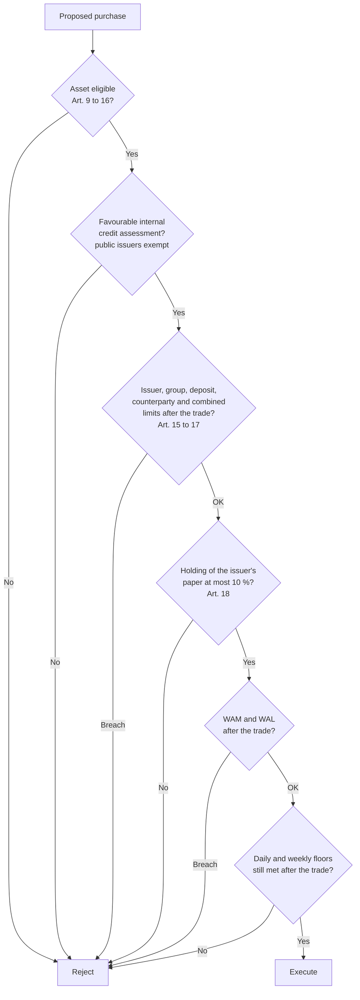

A money market fund (MMF) manager in the EU does not choose investments freely and then check them against a few ratios. [Regulation (EU) 2017/1131](https://eur-lex.europa.eu/eli/reg/2017/1131/oj) sets a closed list of eligible assets, requires an internal credit assessment before any private-sector instrument can be bought, caps exposures by issuer, by group and by counterparty, limits how much of one issuer's paper the fund may hold, and constrains the portfolio's average maturity and its daily and weekly liquidity. Every one of these rules applies at the moment of purchase, and most of them apply continuously afterwards.

This article builds a portfolio under those rules, step by step, for a hypothetical euro short-term VNAV fund of EUR 1 billion. A first draft breaks two limits, which the article identifies and corrects; a proposed trade then shows which maturity limit binds first. The rules are taken from the Regulation, from [Commission Delegated Regulation (EU) 2018/990](https://eur-lex.europa.eu/eli/reg_del/2018/990/oj), which details the credit assessment and the reverse repo requirements, and from the practical answers in the [AMF's Q&A on money market funds](https://www.amf-france.org/sites/institutionnel/files/contenu_simple/guide/guide_professionnel/Q&A%20on%20Money%20Market%20Funds%20-%20Guide%20for%20Asset%20Management%20Companies.pdf). The [series overview]({{site.url_complet}}/2026/10/01/eu-money-market-fund-regulation-2017-1131/) covers the rest of the Regulation.

The example fund is fictional and its issuers are placeholders, but every limit, calculation and conclusion follows the legal text. Article numbers refer to the MMF Regulation unless another act is named.

> This article has been made with the help of [Claude Code](https://claude.com/product/claude-code) and several custom skills

[TOC]

## Step 0: the fund type sets the constraints

The first decision is the fund's type and maturity profile, because they set the numbers every later check uses. Euro money market funds are mostly standard VNAVs domiciled in France, according to the FSB's 2024 peer review, while stable-price funds are mostly denominated in US dollars and sterling. The example uses a **short-term VNAV** in euro, which faces the tighter maturity limits of Article 24 but the lower liquidity floors of a variable-price fund.

| Constraint | Short-term VNAV (example) | Standard VNAV | LVNAV / public debt CNAV |
|---|---|---|---|
| Eligible MMIs | Maturity ≤ 397 days | Up to 2 years residual if the rate resets within 397 days | Maturity ≤ 397 days |
| WAM | ≤ 60 days | ≤ 6 months | ≤ 60 days |
| WAL | ≤ 120 days | ≤ 12 months | ≤ 120 days |
| Daily maturing assets | ≥ 7.5 % | ≥ 7.5 % | ≥ 10 % |
| Weekly maturing assets | ≥ 15 % | ≥ 15 % | ≥ 30 % |
| Issuer limit for MMIs | 5 %, or 10 % with a 40 % aggregate (Art. 17(2)) | 5 %, or 10 % with a 40 % aggregate | 5 % |

The VNAV-only derogation in the last row matters below: a VNAV may hold up to 10 % in one issuer's money market instruments, securitisations and ABCPs, provided that the positions above 5 % add up to no more than 40 % of assets.

## Step 1: the eligible universe

### The closed list

Article 9(1) allows seven categories of assets and nothing else: money market instruments, eligible securitisations and ABCPs, deposits with credit institutions, financial derivative instruments, repurchase agreements, reverse repurchase agreements, and units of other MMFs. A fund may also hold ancillary liquid assets under Article 50(2) of the UCITS Directive (Art. 9(3)). Article 9(2) excludes short sales, any exposure to equities or commodities, securities lending and borrowing, any encumbrance of assets, and borrowing or lending cash.

Each category has its own conditions, which the overview article lists in full. The ones the example portfolio relies on are:

- **Money market instruments** must have a legal maturity at issuance or a residual maturity of 397 days or less and a favourable internal credit assessment (Art. 10). Paper issued or guaranteed by the Union, a Member State's central government or central bank, the ECB, the EIB, the ESM or the EFSF is exempt from the credit assessment (Art. 10(3)).
- **Deposits** must be repayable on demand or withdrawable at any time, and mature within 12 months (Art. 12). The AMF's Q&A notes that the Regulation does not define how quickly "at any time" must be honoured, and points to the seven-day criterion used in ESMA's UCITS guidelines for repos.
- **Reverse repos** must be terminable on two working days' notice, and the collateral received must be eligible money market instruments other than securitisations and ABCPs, worth at least the cash lent (Art. 15).
- **Units of other MMFs** are capped at 5 % per fund and 17.5 % in total, and a short-term MMF may only buy units of other short-term MMFs (Art. 16).

### Ancillary liquid assets

The Regulation does not quantify "ancillary". The AMF applies its general UCITS position: an exposure above 10 % of the fund's assets cannot be ancillary, with up to 20 % for liquid assets in exceptional market conditions. It adds that ancillary liquid assets combined with OTC derivative exposure to the same body should not exceed 25 %, or 30 % under the small-market derogation of Article 17(6). Other national authorities may apply different interpretations, so the example keeps its cash at the depositary small.

## Step 2: credit assessment before purchase

### What the procedure must contain

No money market instrument, securitisation or ABCP may be bought without a favourable assessment from the manager's internal credit quality procedure (Art. 10(1)(c), 19 and 20). External ratings may be considered but not relied on "solely or mechanistically" (Art. 20(1)). The AMF gives an example of what that excludes: an average of agency ratings is a mechanical use and is not permitted.

Delegated Regulation 2018/990 fills in the methodology:

- **Validation (Art. 3).** The methodology must be applied systematically across issuers and instruments, use enough relevant qualitative and quantitative criteria and reliable data samples, be checked against past assessments, allow suitable challenge in its development, and be back-tested, with deficiencies addressed.
- **Quantitative criteria (Art. 4).** The manager uses bond pricing information including credit spreads, money market pricing for the issuer or its sector, [credit default swap]({{site.url_complet}}/2025/05/30/credit-default-swap-overview/) pricing, default statistics, financial indices for the issuer's region or sector, and the issuer's financial ratios. Other criteria may be added.
- **Material change (Art. 8).** A new assessment is required after a material change in those indicators, and in particular when an instrument is downgraded below the two highest short-term credit ratings by a registered agency. The manager may still conclude, under its own methodology, that the credit quality remains favourable.

### Independence

Article 23(4) forbids the persons who perform or are responsible for portfolio management to carry out the assessments. The AMF reads this as a functional requirement: the credit analyst may not report to a portfolio manager. Portfolio managers may contribute to the methodology and may prepare qualitative analysis, as long as the analyst can challenge it and the methodology formalises their role. A cross-validation in which managers assess instruments they promise not to trade does not meet the requirement.

The assessment is documented, with its rationale and history, and kept for at least three complete annual accounting periods (Art. 21). For the example, every private-sector line in the portfolio below is assumed to carry a current favourable assessment; the German, French and Dutch bills are exempt.

## Step 3: a first draft

The first draft allocates EUR 1 billion across 18 lines:

| # | Position | Issuer / group | Amount (EUR m) | Days to legal maturity | Days to next reset |
|:---:|---|---|---:|---:|---:|
| 1 | Overnight reverse repo, French BTF collateral | Bank R | 100 | 1 | 1 |
| 2 | Call deposit | Bank A group | 80 | 1 | 1 |
| 3 | Call deposit | Bank B | 70 | 1 | 1 |
| 4 | Cash at depositary | Depositary | 20 | 1 | 1 |
| 5 | Bubill | Germany | 100 | 85 | 85 |
| 6 | BTF | France | 100 | 40 | 40 |
| 7 | Certificate of deposit | Bank C | 50 | 5 | 5 |
| 8 | Commercial paper | Bank A group | 50 | 30 | 30 |
| 9 | Certificate of deposit, Bank A's subsidiary | Bank A group | 30 | 90 | 90 |
| 10 | Commercial paper | Corporate D | 45 | 60 | 60 |
| 11 | Commercial paper | Corporate E | 45 | 90 | 90 |
| 12 | Floating-rate note | Bank F | 50 | 300 | 30 |
| 13 | Certificate of deposit | Bank G | 50 | 180 | 180 |
| 14 | Commercial paper | Bank H | 50 | 120 | 120 |
| 15 | STS ABCP | Programme X | 40 | 60 | 60 |
| 16 | Commercial paper | Corporate I | 50 | 45 | 45 |
| 17 | Commercial paper | Corporate J | 50 | 150 | 150 |
| 18 | Units of a short-term VNAV MMF | MMF K | 20 | 1 | 1 |

Every line is individually eligible. The floating-rate note has 300 days to run, inside the 397-day limit for a short-term fund; the ABCP is an STS ABCP; the fund units are of another short-term MMF. The breaches are in the combinations.

## Step 4: diversification and concentration

### The limits

Article 17 caps exposures as a share of the fund's assets, and Article 18 caps the fund's share of an issuer's paper:

| Exposure | Limit | Article |
|---|---|---|
| MMIs, securitisations and ABCPs of one body | 5 % (VNAV: 10 % if the positions above 5 % total ≤ 40 %) | 17(1)(a), 17(2) |
| Deposits with one credit institution | 10 % (15 % in a concentrated banking market) | 17(1)(b) |
| Securitisations and ABCPs in aggregate | 20 %, of which ≤ 15 % non-STS | 17(3) |
| OTC derivative exposure to one counterparty | 5 % | 17(4) |
| Cash lent to one reverse repo counterparty | 15 % | 17(5) |
| MMIs, deposits and OTC exposure combined, one body | 15 % (20 % in a concentrated financial market) | 17(6) |
| Public issuers under the derogation | Up to 100 %, ≥ 6 issues, ≤ 30 % per issue | 17(7) |
| Covered bonds of one issuer | 10 % (40 % aggregate above 5 %) | 17(8) |
| Covered bonds meeting LCR Level 1 or 2A criteria | 20 % (60 % aggregate above 5 %) | 17(9) |
| Holding of one body's MMIs, securitisations and ABCPs | ≤ 10 % of what it issued, public issuers exempt | 18 |

Companies in the same consolidated group count as one body for paragraphs 1 to 6 (Art. 17(10)). Two further points from the AMF's Q&A affect how the limits are computed:

- **Reverse repo collateral is outside Article 17.** Assets received under reverse repos do not count toward the issuer limits; they have their own cap of 15 % of NAV per collateral issuer under Article 15(4), computed on all reverse repos together. A fund can therefore hold an issuer's paper directly up to the Article 17 limits and also receive it as collateral up to 15 %.
- **The higher deposit and combined limits depend on two conditions.** The local market must lack enough viable institutions, which the AMF considers true of France, and using institutions in another Member State must not be economically feasible, which each manager assesses for each fund.

[Regulation (EU) 2024/2987](https://eur-lex.europa.eu/eli/reg/2024/2987/oj), the EMIR 3 package, amended the counterparty limits of the MMF Regulation so that they depend on whether a transaction is cleared at an authorised or recognised central counterparty, with lower or no limits where it is. The example uses no derivatives, but a fund that hedges with swaps should read Article 17 in its consolidated version.

### The two breaches

Aggregating the draft by group shows two problems.

**Bank A group, 16 %.** The fund has a call deposit of 80 with Bank A, commercial paper of 50 issued by Bank A, and a certificate of deposit of 30 issued by Bank A's subsidiary. Under Article 17(10) the three lines are one body, and under Article 17(6) deposits and instruments with one body are added together:

$$
\begin{aligned}
\text{Bank A group} &= 80 + 50 + 30 = 160 = 16\,\% \gt 15\,\%
\end{aligned}
$$

The money market instruments alone are 80, or 8 %, which is above the 5 % issuer limit but allowed for a VNAV under Article 17(2). The positions above 5 % are Germany at 10 %, France at 10 % and Bank A at 8 %, a total of 28 %, below the 40 % cap. The breach is the combined limit, not the issuer limit.

**Corporate D, 11.25 % of its issue.** Corporate D has EUR 400 million of commercial paper outstanding, and the fund holds 45 of it. Article 18 allows at most 10 %:

$$
\begin{aligned}
\frac{45}{400} = 11.25\,\% \gt 10\,\%
\end{aligned}
$$

The other checks pass. The deposit with Bank A (8 %) and with Bank B (7 %) are below 10 %; the ABCP is 4 % of assets and well within both the 5 % issuer limit and the 20 % aggregate; the units of MMF K are 2 %; the reverse repo with Bank R is 10 % against a 15 % counterparty limit, and its collateral, French government bills, is exempt from the 15 % collateral-issuer cap because it is public debt of the kind listed in Article 17(7).

The German and French bills, at 10 % each, need a basis above the 5 % issuer limit. The fund has two options. It can apply for the Article 17(7) derogation, which requires the competent authority's authorisation, at least six different issues per issuer, at most 30 % in one issue, and disclosure in the fund rules and prospectus. Or it can rely on the VNAV rule of Article 17(2), as it does here, since the 28 % aggregate leaves room. The AMF grants the Article 17(7) derogation together with the MMF authorisation itself, through the compliance table of the application form.

### The corrections

Three changes bring the portfolio into compliance without changing its total:

- the Bank A deposit falls from 80 to 60, and the Bank B deposit rises from 70 to 90, which is still within the 10 % deposit limit;
- the Corporate D holding falls from 45 to 40, exactly 10 % of the programme;
- cash at the depositary rises from 20 to 25.

Bank A group is now 140, or 14 %, and every Article 17 and 18 check passes.

## Step 5: maturity and liquidity

### WAM and WAL

The weighted average maturity uses the earlier of legal maturity and next rate reset; the weighted average life uses legal maturity only (Art. 2(19) and 2(20)). With $$w_i$$ the weight of position $$i$$, $$m_i$$ its days to legal maturity and $$r_i$$ its days to the next reset:

$$
\begin{aligned}
\text{WAM} &= \sum_{i} w_i \cdot \min(m_i, r_i) \\
\text{WAL} &= \sum_{i} w_i \cdot m_i
\end{aligned}
$$

For the corrected portfolio:

$$
\begin{aligned}
\text{WAM} &= 52.3 \text{ days} \le 60 \\
\text{WAL} &= 65.8 \text{ days} \le 120
\end{aligned}
$$

The difference between the two comes from the floating-rate note: 300 days of legal maturity count fully in WAL but only 30 days, to its next reset, in WAM.

### Daily and weekly maturing assets

Daily maturing assets include assets maturing within one working day, reverse repos terminable on one working day's notice, and cash withdrawable on that notice. Weekly maturing assets extend the horizon to five working days. For the corrected portfolio:

| Bucket | Positions | Amount | Share | Minimum |
|---|---|---:|---:|---:|
| Daily | Overnight reverse repo, call deposits, cash | 275 | 27.5 % | 7.5 % |
| Weekly | Daily bucket plus the 5-day CD of Bank C | 325 | 32.5 % | 15 % |

A short-term VNAV may also count up to 7.5 % of money market instruments or MMF units that can be redeemed and settled within five working days toward its weekly floor (Art. 24(1)(h)). The example does not need that addition. Its weekly liquidity is also above the 20 % level the Commission's May 2026 report proposed as a non-binding benchmark for VNAVs.

### A trade that fails

Suppose the portfolio manager wants to lock in a higher yield by moving 30 of the overnight reverse repo into a 397-day commercial paper, the longest maturity a short-term fund may buy. The paper is eligible and assume its issuer passes the credit assessment and the diversification checks. The maturity effect is the weight moved times the change in maturity:

$$
\begin{aligned}
\Delta\text{WAM} &= 0.03 \times (397 - 1) = 11.9 \text{ days} \\
\text{WAM} &= 52.3 + 11.9 = 64.2 \text{ days} \gt 60
\end{aligned}
$$

WAL rises by the same 11.9 days to 77.7, well within 120. In this portfolio WAM binds before WAL because the fund holds few floating-rate instruments, so legal maturities and reset dates mostly coincide. A portfolio heavy in floating-rate notes reaches the WAL limit first instead.

Moving the same 30 out of the overnight repo also reduces daily maturing assets from 27.5 % to 24.5 %, still far above the floor. The liquidity floors are enforced at the point of purchase: a fund at or near its floor may not buy anything other than a daily or weekly maturing asset if the purchase would take it below (Art. 24(1)(d) and (f)). Here the WAM limit stops the trade first.

## Step 6: repos, reverse repos and the collateral

The overnight reverse repo is the portfolio's main liquidity line, and it carries its own conditions:

- the fund must be able to terminate it on two working days' notice and recall the full amount of cash at any time (Art. 15(1) and 15(5));
- the collateral must not be sold, reinvested, pledged or otherwise transferred (Art. 15(2));
- the cash lent to one counterparty may not exceed 15 % of assets (Art. 17(5)).

When the collateral is outside the Article 10 universe, which Article 15(6) allows for liquid public-sector securities with a favourable credit assessment, Delegated Regulation 2018/990 adds conditions (Art. 2).

The agreement must follow market standards and allow the fund to enforce its rights and sell the collateral on default. The collateral is subject to a haircut at least equal to the volatility adjustments of Article 224(1) of the CRR for a five-day liquidation period and the highest credit quality step, plus any further haircut the counterparty, the collateral and its maturity justify, under a documented haircut policy. These requirements do not apply when the counterparty is a credit institution, investment firm, insurer, central counterparty or central bank, which is the case of Bank R in the example.

The fund may also borrow cash through a repo, but only as a temporary liquidity bridge: at most seven working days, cash received at most 10 % of assets, terminable on two working days' notice, and with the cash received deposited or placed in Article 15(6) assets rather than reinvested in the portfolio (Art. 14).

## Step 7: the portfolio in context

The portfolio rules do not operate alone. Three other obligations feed back into how the manager constructs it:

- **Know your customer (Art. 27).** The liquidity floors are minima; the manager must size the actual buffer to its own investor base, considering investor type, holding size and the correlation between investors. A fund whose largest investor exceeds the daily liquidity requirement must also look at that investor's cash-need patterns and risk aversion.
- **Stress testing (Art. 28).** The portfolio is tested at least "bi-annually" against shocks to liquidity, credit, rates, redemptions and spreads, using ESMA's reference parameters. A vulnerability leads to an action plan approved by the board and sent to the competent authority.
- **Transparency (Art. 36).** Every week, investors receive the maturity breakdown, the credit profile, the WAM and WAL, the ten largest holdings with their counterparties, total assets and net yield. Every concentration the manager accepts is visible to its investors within a week.

## Conclusion

Building an EU money market fund portfolio means running every trade through a fixed sequence of checks, most of which look at combinations rather than single lines.

- **The fund type sets the numbers**: a short-term VNAV works with WAM ≤ 60 days, WAL ≤ 120 days, and floors of 7.5 % daily and 15 % weekly liquidity.
- **Eligibility comes first**: seven asset categories, each with its own conditions, and a credit assessment run by people independent of portfolio management, with downgrades below the two highest short-term ratings triggering a new one.
- **Group aggregation decides most diversification checks**: in the example, a deposit, commercial paper and a subsidiary's CD that each looked compliant added up to 16 % of assets with one bank group, above the 15 % combined limit.
- **Concentration depends on the issuer's size**, not the fund's: 45 million of a 400 million programme is 11.25 %, above the 10 % limit of Article 18.
- **A VNAV has two ways to hold more than 5 % of public debt**: the 10 %/40 % rule of Article 17(2), or the Article 17(7) derogation authorised by the competent authority.
- **WAM binds before WAL when resets and maturities coincide**: moving 3 % of the fund from overnight to 397 days added 11.9 days to both and broke only WAM.

## Annex

### Key Terms

| Term | Definition |
|------|------------|
| **Money market instrument (MMI)** | Short-term debt such as commercial paper, certificates of deposit and treasury bills, eligible for an MMF if its maturity is 397 days or less (Art. 10). |
| **Commercial paper (CP)** | Unsecured short-term debt issued by a company or bank, usually at a discount. |
| **Certificate of deposit (CD)** | A negotiable short-term debt instrument issued by a bank. |
| **Floating-rate note (FRN)** | A note whose coupon resets periodically to a money market rate, so its WAM contribution uses the next reset date. |
| **ABCP / STS** | Asset-backed commercial paper; STS designates simple, transparent and standardised securitisations under Regulation (EU) 2017/2402. |
| **Reverse repurchase agreement** | A cash loan against collateral the fund must sell back; the main overnight liquidity line of an MMF. |
| **Haircut** | The reduction applied to the value of collateral to absorb price falls before it can be sold. |
| **Ancillary liquid assets** | Cash a fund may hold alongside its investments, under Article 50(2) of the UCITS Directive. |
| **Body / group** | The issuer or counterparty for limit purposes; companies in one consolidated group count as one body (Art. 17(10)). |
| **Diversification limit** | A cap on exposure to one body as a share of the fund's assets (Art. 17). |
| **Concentration limit** | A cap on the fund's holding as a share of what one body has issued: 10 % (Art. 18). |
| **Article 17(7) derogation** | Authorisation to hold up to 100 % in public-sector MMIs, with at least six issues and at most 30 % per issue. |
| **Internal credit quality assessment** | The manager's own procedure for deciding whether an instrument's credit quality is favourable (Arts 19 to 23). |
| **Material change** | A change in credit indicators, including a downgrade below the two highest short-term ratings, that requires a new assessment (Delegated Regulation 2018/990, Art. 8). |
| **WAM** | Weighted average maturity: the average time to legal maturity or, if shorter, to the next rate reset. |
| **WAL** | Weighted average life: the average time to legal maturity, ignoring resets. |
| **Daily / weekly maturing assets** | Assets, reverse repos and cash recoverable within one or five working days. |
| **Purchase test** | The rule that a fund below or at a liquidity floor may only buy assets that count toward that floor. |

### Requirements Checklist

The checklist turns the article's steps into pre-trade controls for a short-term VNAV. A standard VNAV, LVNAV or CNAV replaces the maturity and liquidity rows with its own thresholds.

| Check | # | Requirement |
|:---:|:---:|------------|
| ☐ | 9 | The instrument belongs to one of the seven eligible categories, and the trade involves no short sale, equity or commodity exposure, lending, borrowing or encumbrance. |
| ☐ | 10(1) | The MMI has a maturity at issuance or a residual maturity of 397 days or less. |
| ☐ | 10(1)(c), 19–20 | A current favourable internal credit assessment exists, unless the issuer is exempt under Article 10(3). |
| ☐ | 23(4) | The assessment was made by persons independent of portfolio management. |
| ☐ | DR 2018/990 Art. 8 | No downgrade below the two highest short-term ratings or other material change has occurred since the last assessment. |
| ☐ | 12 | Deposits are repayable on demand or withdrawable at any time and mature within 12 months. |
| ☐ | 17(1)–(2) | Post-trade exposure to the issuer's MMIs, securitisations and ABCPs is ≤ 5 %, or ≤ 10 % with positions above 5 % totalling ≤ 40 %. |
| ☐ | 17(1)(b) | Deposits with one credit institution are ≤ 10 %. |
| ☐ | 17(3) | Securitisations and ABCPs together are ≤ 20 %, of which non-STS ≤ 15 %. |
| ☐ | 17(6) | Combined MMIs, deposits and OTC exposure to one body, aggregated by group, are ≤ 15 %. |
| ☐ | 17(7) | Public debt above the issuer limits relies on an authorised derogation with ≥ 6 issues and ≤ 30 % per issue, or on Article 17(2). |
| ☐ | 18 | The fund's holding is ≤ 10 % of the body's outstanding MMIs, securitisations and ABCPs. |
| ☐ | 15, 17(5) | Reverse repos are terminable on two working days, cash per counterparty ≤ 15 %, collateral per issuer ≤ 15 % of NAV. |
| ☐ | 16 | Units of one MMF are ≤ 5 %, of all MMFs ≤ 17.5 %, and only of short-term MMFs. |
| ☐ | 24(1)(a)–(b) | Post-trade WAM ≤ 60 days and WAL ≤ 120 days. |
| ☐ | 24(1)(d), (f) | Post-trade daily maturing assets ≥ 7.5 % and weekly ≥ 15 %, or the asset bought is itself daily or weekly maturing. |

## Frequently Asked Questions

**Q: Why does a deposit count toward the same limit as commercial paper from the same bank?**

Article 17(6) caps the combined exposure to one body from money market instruments, deposits and OTC derivative counterparty risk at 15 % of assets. The individual limits of Article 17(1) apply separately to instruments (5 %) and deposits (10 %), so a fund can meet both individual limits and still breach the combined one, as the Bank A group did in the example.

**Q: What is the difference between the diversification limit of Article 17 and the concentration limit of Article 18?**

Article 17 limits an exposure as a share of the fund's own assets. Article 18 limits the fund's holding as a share of what the issuer has issued: at most 10 % of a body's money market instruments, securitisations and ABCPs, public issuers excepted.

A small fund can breach Article 18 with a position that is tiny relative to its own size if the issuer's programme is small. In the example, 40 of the fund's 1,000 is only 4 % of assets but exactly 10 % of Corporate D's programme.

**Q: Why does the floating-rate note count for 30 days in WAM but 300 days in WAL?**

WAM measures interest-rate sensitivity, so it uses the time to the next reset to a money market rate, after which the note's coupon follows the market. WAL measures exposure to the issuer's credit, which lasts until the principal is repaid, so it uses legal maturity only (Art. 2(19) and 2(20)).

**Q: A credit rating agency downgrades Corporate J's paper below the two highest short-term ratings. Must the fund sell it?**

Not automatically. Delegated Regulation 2018/990 treats the downgrade as a material change, so the manager must carry out a new internal credit quality assessment (Art. 19(4)(d) of the MMF Regulation and Art. 8 of the delegated act).

If the new assessment is favourable under the manager's methodology, the fund may keep the paper. If it is not, the paper is no longer eligible for purchase, and the manager deals with the existing holding in the interest of investors.

**Q: Can a portfolio manager draft the credit analysis of the instruments they buy?**

They may contribute. The AMF accepts that portfolio managers help design the methodology and prepare qualitative analysis, provided the methodology formalises this and the credit analyst can challenge it. The assessment itself must be performed by persons who neither manage the portfolio nor report to someone who does (Art. 23(4)).

**Q: The fund wants to hold 12 % in German treasury bills. What are its options?**

The VNAV rule of Article 17(2) allows at most 10 % per issuer, so it is not enough. The fund needs the Article 17(7) derogation, which its competent authority must authorise. The derogation requires at least six different German issues in the portfolio, no more than 30 % in any one of them, the issuer named in the fund rules, and a prominent statement in the prospectus and marketing material.

**Q: Why did the proposed 397-day trade fail on WAM but not on WAL?**

Moving 3 % of the fund from a one-day asset to a 397-day fixed-rate asset raises both averages by 0.03 × 396 = 11.9 days. WAM was at 52.3 days against a 60-day limit, so it rose to 64.2 and breached. WAL was at 65.8 days against a 120-day limit and stayed within it. The fixed-rate paper has no reset date, so it adds the same amount to both averages.

## References

### Legal texts

- [Regulation (EU) 2017/1131 on money market funds](https://eur-lex.europa.eu/eli/reg/2017/1131/oj), Articles 2, 9 to 25
- [Commission Delegated Regulation (EU) 2018/990](https://eur-lex.europa.eu/eli/reg_del/2018/990/oj), Articles 1 to 9; text consulted through [legislation.gov.uk](https://www.legislation.gov.uk/eur/2018/990/contents/adopted)
- [Regulation (EU) 2024/2987 (EMIR 3)](https://eur-lex.europa.eu/eli/reg/2024/2987/oj), amending the counterparty limits of Regulation (EU) 2017/1131
- [Regulation (EU) No 575/2013 (CRR)](https://eur-lex.europa.eu/eli/reg/2013/575/oj), Article 224 volatility adjustments
- [Regulation (EU) 2017/2402 (Securitisation Regulation)](https://eur-lex.europa.eu/eli/reg/2017/2402/oj), STS criteria

### Supervisory guidance and reports

- [Q&A on Money Market Funds — Guide for Asset Management Companies](https://www.amf-france.org/sites/institutionnel/files/contenu_simple/guide/guide_professionnel/Q&A%20on%20Money%20Market%20Funds%20-%20Guide%20for%20Asset%20Management%20Companies.pdf), AMF, November 2018, questions 11 to 23
- [EMIR 3.0 — new rules for trading and clearing derivatives in the EU](https://www.cliffordchance.com/content/dam/cliffordchance/briefings/2024/12/emir-3-0-new-rules-for-trading-and-clearing-derivatives-in-the-eu.pdf), Clifford Chance, December 2024
- [Thematic Review on Money Market Fund Reforms](https://www.fsb.org/uploads/P270224.pdf), Financial Stability Board, 27 February 2024
- [Report on the adequacy of Regulation (EU) 2017/1131, COM(2026) 350](https://ec.europa.eu/finance/docs/law/260511-money-market-funds-report_en.pdf), European Commission, 11 May 2026

### Related articles

- [Credit Default Swaps - Overview]({{site.url_complet}}/2025/05/30/credit-default-swap-overview/)
- [Stablecoins Under MiCA — Asset-Referenced Tokens and E-Money Tokens (Titles III and IV)]({{site.url_complet}}/2026/09/17/mica-stablecoins-asset-referenced-tokens-e-money-tokens/)
