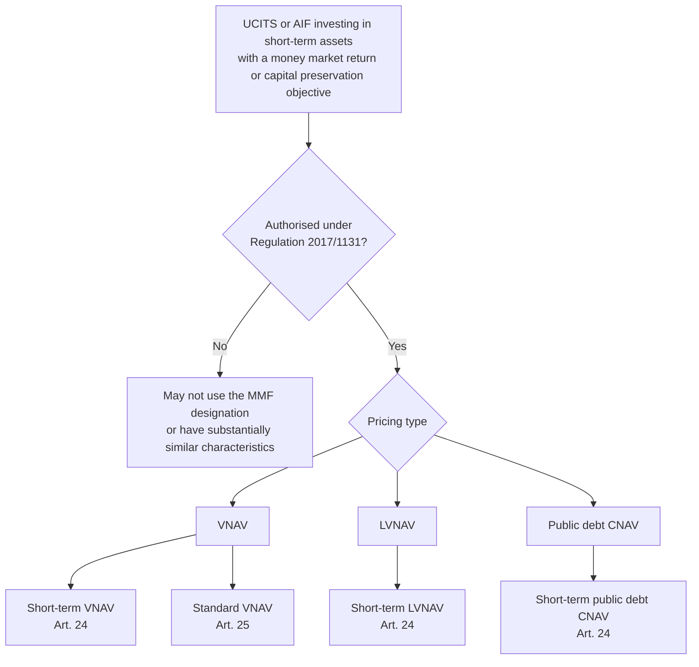
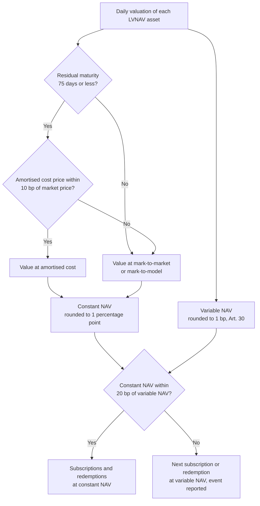
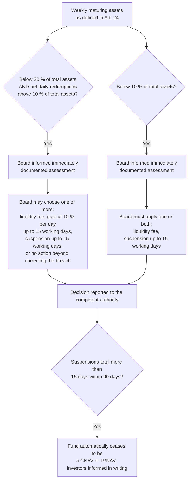

A money market fund (MMF) is an investment fund that holds short-term debt (commercial paper, certificates of deposit, treasury bills, bank deposits and repurchase agreements) and offers its investors a return close to money market rates together with daily liquidity. Corporate treasurers, banks and governments use MMFs as an alternative to bank deposits, which makes the sector both a large buyer of short-term bank and sovereign debt and a channel through which a run on one fund can spread to the funding markets it lends to. The 2008 crisis showed that channel at work, when a large US fund holding Lehman Brothers paper fell below its stable share price of one dollar and investors withdrew from the whole sector.

[Regulation (EU) 2017/1131](https://eur-lex.europa.eu/eli/reg/2017/1131/oj) of 14 June 2017 is the European Union's answer. It applies on top of the [UCITS Directive](https://eur-lex.europa.eu/eli/dir/2009/65/oj) and the [AIFM Directive](https://eur-lex.europa.eu/eli/dir/2011/61/oj) and sets a single rulebook for every fund that calls itself an MMF in the Union. It fixes three fund types defined by how they price their units, a closed list of eligible assets, diversification and maturity limits, daily and weekly liquidity floors, valuation rules with a numerical collar for funds that keep a stable price, liquidity fees and redemption gates, a ban on sponsor support, and weekly disclosure and quarterly supervisory reporting.

This article reads the Regulation chapter by chapter, from scope and authorisation to supervision, with the numerical thresholds collected in tables and two worked examples. Article numbers refer to Regulation (EU) 2017/1131 unless another act is named. The source is the text published in the Official Journal (OJ L 169, 30.6.2017); the act has been amended since, and EUR-Lex lists a consolidated version dated 24 December 2024.

> This article has been made with the help of [Claude Code](https://claude.com/product/claude-code) and several custom skills

[TOC]

## Scope and structure of the Regulation

### Which funds are MMFs (Article 1)

The Regulation applies to collective investment undertakings that meet three cumulative conditions:

- they are, or require authorisation as, a **UCITS** under Directive 2009/65/EC, or are an **AIF** under Directive 2011/61/EU;
- they invest in **short-term assets**, defined as financial assets with a residual maturity not exceeding two years (Art. 2(1));
- their objective is to offer returns **in line with money market rates**, to **preserve the value** of the investment, or both.

The test is functional. A fund that has these characteristics must be authorised as an MMF, and Article 6 prevents the reverse case: a UCITS or AIF that is not authorised may not use the name "money market fund", a misleading designation suggesting it is one, or characteristics "substantially similar" to those of Article 1(1). The ban covers every external document, from the prospectus to an oral communication.

Article 1(2) also makes the Regulation a maximum-harmonisation text: Member States may not add requirements in the field it covers. A fund may still impose stricter investment limits on itself (Art. 7(5)).

### Layering on UCITS and AIFMD (Articles 7 and 8)

An MMF remains a UCITS or an AIF. It must comply with the Regulation **and** with its base directive, except where the Regulation says otherwise (Art. 7(2) and (3)).

For UCITS MMFs, Article 8(2) switches off the UCITS investment-policy rules (Articles 49 to 50a, 51(2) and 52 to 57 of Directive 2009/65/EC) and replaces them with Chapter II of the Regulation. Each compartment of an umbrella fund is treated as a separate MMF for Chapters II to VII (Art. 8(1)).

Responsibility sits with the manager: the UCITS management company or self-managed investment company, or the AIFM or internally managed AIF (Art. 2(23)). Article 7(4) makes the manager liable for any loss or damage resulting from non-compliance with the Regulation.

### The nine chapters

| Chapter | Subject | Articles |
|---|---|---|
| I | General provisions: scope, definitions, fund types, authorisation, designation | 1–7 |
| II | Investment policies: eligible assets, diversification, concentration, credit quality | 8–23 |
| III | Risk management: portfolio rules, ratings, know-your-customer, stress testing | 24–28 |
| IV | Valuation: mark-to-market, mark-to-model, NAV and constant NAV, dealing price | 29–33 |
| V | Specific requirements for public debt CNAV and LVNAV MMFs: fees, gates, suspensions | 34 |
| VI | Prohibition of external support | 35 |
| VII | Transparency and reporting to competent authorities | 36–37 |
| VIII | Supervision, powers, penalties, ESMA | 38–43 |
| IX | Transitional and final provisions, review, entry into force | 44–47 |

## The three MMF types and the two maturity profiles

### Pricing type (Article 3)

Every MMF must be authorised as exactly one of three types, and the authorisation states which (Art. 3(2)). The type determines how the fund values its assets and at what price investors subscribe and redeem.

| Type | Dealing price | Valuation | Asset restriction |
|---|---|---|---|
| **VNAV** (variable net asset value) | NAV per unit, rounded to the nearest basis point, moving every day | Mark-to-market, or mark-to-model when market data is insufficient | General eligible-asset rules |
| **Public debt CNAV** (constant net asset value) | Constant NAV, rounded to the nearest percentage point | May value assets at amortised cost | At least 99.5 % in public debt under Art. 17(7), reverse repos secured by that debt, and cash (Art. 2(11)) |
| **LVNAV** (low volatility net asset value) | Constant NAV, as long as it stays within 20 basis points of the variable NAV | Amortised cost only for assets with a residual maturity up to 75 days and within a 10 bp tolerance | General eligible-asset rules, short-term portfolio only |

The public debt CNAV type is the closest to a stable-value product: income accrues daily and is paid out or reinvested, and the unit price does not move. The LVNAV was introduced during the legislative negotiations as a middle ground between floating-price funds and the stable-price funds that invested in private debt. It may also show a stable price, but only inside a collar, and it reverts to a floating price when the collar is breached.

### Maturity profile: short-term versus standard (Articles 2, 24 and 25)

The second axis is the portfolio's maturity. A **short-term MMF** invests in money market instruments eligible under Article 10(1) and follows the portfolio rules of Article 24; a **standard MMF** may also use the longer instruments of Article 10(2) and follows Article 25.

All three types may be short-term (Art. 24(3)), while a standard MMF may only be a VNAV (Art. 25(3)). That gives four combinations in practice.

ESMA keeps a central public register of authorised MMFs listing, for each fund, its type, whether it is short-term or standard, its manager and its competent authority (Art. 4(7)).

## Authorisation (Articles 4 and 5)

No collective investment undertaking may be established, marketed or managed in the Union as an MMF without authorisation under the Regulation, and the authorisation is valid in all Member States (Art. 4(1)). The route depends on the base vehicle:

- **A new UCITS** is authorised as an MMF within its UCITS authorisation procedure. An existing UCITS applies separately under Article 4(4) and (5).
- **An AIF** follows Article 5. The competent authority of the MMF approves the application of an AIFM already authorised to manage MMF-AIFs, the fund rules and the choice of depositary. It may refuse only on the four grounds of Article 5(4), must consult the AIFM's authority before refusing, and must decide within two months of a complete application (Art. 5(6)). It may not require the AIFM to be located in the AIF's home Member State (Art. 5(5)).

The application file under Article 4(5) contains the fund rules (with the MMF type), the identity of the manager and the depositary, the investor information, and a description of the arrangements that will ensure compliance with Chapters II to VII. Competent authorities report authorisations granted and withdrawn to ESMA every quarter (Art. 4(6)).

## Eligible assets and prohibited activities (Articles 9 to 16)

### The closed list

Article 9(1) lists the only seven asset categories an MMF may hold, each under the conditions of its own article:

| Asset | Article | Key conditions |
|---|---|---|
| Money market instruments | 10 | Legal maturity at issuance or residual maturity of **397 days or less**; standard MMFs may hold residual maturities up to **2 years** if the next rate reset is within 397 days; favourable internal credit assessment |
| Eligible securitisations and ABCPs | 11 | Sufficiently liquid, favourable credit assessment, and either a high-quality securitisation under Delegated Regulation 2015/61, a bank-supported ABCP programme, or an STS securitisation; maturity or WAL conditions differ for short-term and standard funds |
| Deposits with credit institutions | 12 | Repayable on demand, maturity of **12 months** or less, bank in the EU or under equivalent prudential rules |
| Financial derivative instruments | 13 | Underlying limited to interest rates, FX rates, currencies or their indices; **hedging only**; OTC counterparties supervised and daily valued |
| Repurchase agreements | 14 | **Liquidity management only**, at most **7 working days**, cash received at most **10 %** of assets, terminable on **2 working days'** notice |
| Reverse repurchase agreements | 15 | Terminable on 2 working days' notice; collateral worth at least the cash paid; collateral of eligible MMIs, no securitisations or ABCPs, max **15 %** of NAV per collateral issuer |
| Units or shares of other MMFs | 16 | Max **5 %** in one MMF and **17.5 %** in aggregate; target MMF may hold at most 10 % in other MMFs; no cross-holdings; short-term MMFs buy only short-term MMFs |

The credit-assessment condition of Article 10(1)(c) does not apply to instruments issued or guaranteed by the Union, a Member State's central authority or central bank, the ECB, the EIB, the ESM or the EFSF (Art. 10(3)). An MMF may also hold ancillary liquid assets under Article 50(2) of the UCITS Directive (Art. 9(3)).

Article 11(4) originally asked the Commission to insert a cross-reference to the criteria for simple, transparent and standardised (STS) securitisations once that framework existed. The Commission did so in Article 1 of [Delegated Regulation (EU) 2018/990](https://eur-lex.europa.eu/eli/reg_del/2018/990/oj), which rewrote Article 11(1)(c) to refer to the STS criteria of the [Securitisation Regulation (EU) 2017/2402](https://eur-lex.europa.eu/eli/reg/2017/2402/oj). That cross-reference brings into play the 20 % aggregate securitisation limit of Article 17(3) discussed below.

### What an MMF may never do

Article 9(2) forbids five activities outright:

- investing in any asset outside the list above;
- **short selling** money market instruments, securitisations, ABCPs or MMF units;
- taking any direct or indirect exposure to **equities or commodities**, including through derivatives, certificates or indices;
- **securities lending or borrowing**, or any other agreement that would encumber the fund's assets;
- **borrowing and lending cash**.

The repo rule of Article 14 follows the same logic. A repo is a short-term loan the fund takes against its securities, so it is allowed only as a liquidity bridge of up to seven working days, and the cash received may only be placed on deposit or in the public-debt assets of Article 15(6). It may not be reinvested in the portfolio.

## Diversification and concentration (Articles 17 and 18)

### Diversification limits

The diversification rules limit how much of the fund's assets can depend on a single issuer or counterparty.

| Exposure | Limit (share of the MMF's assets) | Article |
|---|---|---|
| MMIs, securitisations and ABCPs of one issuer | **5 %**; a VNAV may go to 10 % if the positions above 5 % total no more than 40 % | 17(1)(a), 17(2) |
| Deposits with one credit institution | **10 %**; 15 % if the local banking sector is too small and foreign deposits are not economically feasible | 17(1)(b) |
| Aggregate securitisations and ABCPs | **15 %** until the STS cross-reference applies, then **20 %** with at most 15 % non-STS | 17(3) |
| OTC derivative exposure to one counterparty | **5 %** | 17(4) |
| Cash lent to one counterparty in reverse repos | **15 %** | 17(5) |
| Combined MMIs, deposits and OTC exposure to one body | **15 %**; 20 % under the same small-market derogation | 17(6) |
| Covered bonds of one EU credit institution | **10 %**, with a 40 % aggregate cap on such issuers above 5 % | 17(8) |
| Bonds of one credit institution meeting LCR Delegated Regulation 2015/61 criteria | **20 %**, with a 60 % aggregate cap on such issuers above 5 % | 17(9) |

Companies in the same consolidated group count as one body for paragraphs 1 to 6 (Art. 17(10)).

### The public-debt derogation

Article 17(7) lets the competent authority authorise an MMF to invest up to **100 %** of its assets in money market instruments issued or guaranteed by the Union, EU national, regional and local administrations and their central banks, the ECB, the EIB, the EIF, the ESM, the EFSF, a third-country central authority or central bank, the IMF, the IBRD, the Council of Europe Development Bank, the EBRD, the BIS or another international financial institution of which a Member State is a member. The derogation has four conditions:

- at least **six different issues** from the issuer;
- at most **30 %** of assets in a single issue;
- an express list, in the fund rules, of the issuers in which the fund intends to invest more than 5 %;
- a prominent statement in the prospectus and marketing material drawing attention to the derogation.

The same list of public issuers is the asset base of the public debt CNAV type.

### Concentration

Diversification looks at the fund's portfolio; concentration looks at the issuer's debt. An MMF may not hold more than **10 %** of the money market instruments, securitisations and ABCPs issued by a single body (Art. 18(1)). The limit does not apply to the public issuers of Article 17(7).

## Internal credit quality assessment (Articles 19 to 23)

The Regulation does not allow a fund to buy a money market instrument, securitisation or ABCP on the strength of an external rating. The manager must run its own **internal credit quality assessment procedure** and buy only instruments that receive a favourable assessment. Ratings from registered credit rating agencies may inform the analysis, but without "mechanistic over-reliance", which mirrors Article 5a of the [Credit Rating Agencies Regulation (EC) No 1060/2009](https://eur-lex.europa.eu/eli/reg/2009/1060/oj).

The procedure has five components:

- **Methodology (Art. 19).** Prudent, systematic and continuous methodologies, validated with historical experience and back-testing, reviewed at least annually, with the review transmitted to the manager's competent authority. Every assessment is reviewed at least annually, and anew after a material change. A change of methodology triggers a review of all affected assessments.
- **Factors (Art. 20).** At least the quantified credit risk and relative default risk of issuer and instrument, qualitative indicators on the issuer, the short-term nature of the instrument, the asset class, the issuer type (public, financial, non-financial), structural and counterparty risk for structured products, and the liquidity profile.
- **Documentation (Art. 21).** Design of the procedure, rationale of each assessment, changes and their triggers, organisation and controls, complete assessment histories, and the responsible persons. Records are kept for at least **three complete annual accounting periods**.
- **Delegated acts (Art. 22).** The Commission specifies validation criteria, credit risk quantification, qualitative indicators and the meaning of "material change". This was done in [Commission Delegated Regulation (EU) 2018/990](https://eur-lex.europa.eu/eli/reg_del/2018/990/oj).
- **Governance (Art. 23).** Approval by senior management and the governing body, at least annual reporting on the credit risk profile, and a separation rule: assessments may **not** be performed by the persons responsible for portfolio management.

## Portfolio rules (Articles 24 and 25)

### Weighted average maturity and weighted average life

Two portfolio-level measures constrain interest-rate and credit-spread risk. With $$w_i$$ the weight of asset $$i$$ in the portfolio, $$m_i$$ its time to legal maturity and $$r_i$$ its time to the next reset to a money market rate:

$$
\begin{aligned}
\text{WAM} &= \sum_{i} w_i \cdot \min(m_i, r_i) \\
\text{WAL} &= \sum_{i} w_i \cdot m_i
\end{aligned}
$$

WAM (Art. 2(19)) measures sensitivity to interest-rate moves, because a floating-rate note resets its coupon at $$r_i$$. WAL (Art. 2(20)) ignores resets and measures how long the fund is exposed to its issuers' credit. For WAL, an instrument with an embedded put option may use the exercise date if the put is freely exercisable, its strike stays close to the expected value and exercise is highly probable; amortising securitisations and ABCPs may use their amortisation profile.

### Limits by profile and type

| Requirement | Short-term LVNAV and public debt CNAV | Short-term VNAV | Standard VNAV |
|---|---|---|---|
| WAM | ≤ 60 days | ≤ 60 days | ≤ 6 months |
| WAL | ≤ 120 days | ≤ 120 days | ≤ 12 months |
| Daily maturing assets | ≥ 10 % | ≥ 7.5 % | ≥ 7.5 % |
| Weekly maturing assets | ≥ 30 % | ≥ 15 % | ≥ 15 % |
| Assets that may count toward the weekly floor | Art. 17(7) public debt, highly liquid, settled in one working day, residual maturity ≤ 190 days, up to 17.5 % | MMIs or MMF units redeemable and settled within 5 working days, up to 7.5 % | Same as short-term VNAV, up to 7.5 % |

Daily and weekly maturing assets include reverse repos terminable on one (respectively five) working days' notice and cash withdrawable on the same notice. The liquidity floors are enforced at the point of purchase: a fund may not buy anything other than a daily (weekly) maturing asset if the purchase would take it below the floor. If a limit is breached for reasons beyond the fund's control, or because of subscriptions and redemptions, the fund must make the correction a priority objective, taking account of investors' interests (Art. 24(2), 25(2)).

### Worked example

A short-term VNAV holds three positions:

| Position | Weight | Time to legal maturity | Time to next reset |
|---|---|---|---|
| Overnight reverse repo, terminable on one day's notice | 40 % | 1 day | 1 day |
| Commercial paper | 35 % | 90 days | 90 days |
| Floating-rate note | 25 % | 300 days | 30 days |

$$
\begin{aligned}
\text{WAM} &= 0.40 \times 1 + 0.35 \times 90 + 0.25 \times 30 = 39.4 \text{ days} \\
\text{WAL} &= 0.40 \times 1 + 0.35 \times 90 + 0.25 \times 300 = 106.9 \text{ days}
\end{aligned}
$$

Both are inside the 60-day and 120-day limits, and the reverse repo alone covers the 7.5 % daily and 15 % weekly floors. The note's 300-day residual maturity is within the 397-day ceiling of Article 10(1). The WAL is the tighter of the two constraints here: lengthening the floating-rate note to 397 days would leave WAM unchanged and push WAL to 131.15 days, above the limit.

## Risk management beyond the portfolio (Articles 26 to 28)

**Ratings (Art. 26).** An MMF that solicits or pays for its own external rating must do so under the CRA Regulation and must state in the prospectus and every communication that mentions the rating that it was solicited or financed by the fund or its manager.

**Know your customer (Art. 27).** This is a liquidity rule rather than an anti-money-laundering one. The manager must anticipate the effect of concurrent redemptions, considering investor type, holding size and flow history. When a single investor holds more than the fund's daily liquidity requirement, the manager also considers cash-need patterns, risk aversion and correlation between investors. Where investors come through an intermediary, the manager requests the information from that intermediary. The manager must ensure that a large single holding does not materially impact the fund's liquidity profile.

**Stress testing (Art. 28).** Each MMF runs stress tests on objective criteria and severe but plausible scenarios covering at least changes in asset liquidity, credit risk (including credit and rating events), interest and exchange rates, redemption levels, spread widening or narrowing between rate indices, and macro-systemic shocks. CNAV and LVNAV funds must also estimate the gap between the constant NAV and the variable NAV under each scenario. The board sets the frequency, which must be at least "bi-annual". Where a test reveals a vulnerability, the manager prepares an extensive report and action plan, which the board approves and which is kept for at least **five years** and sent to the competent authority, which forwards it to ESMA. ESMA publishes guidelines with common reference parameters, updated at least yearly.

## Valuation and dealing price (Articles 29 to 33)

### Valuation hierarchy (Article 29)

Assets are valued at least daily, using mark-to-market whenever possible, at the more prudent side of bid and offer unless the asset can be closed out at mid-market, and only with good-quality market data. When mark-to-market is not possible, the asset is valued conservatively by mark-to-model, and the model may not use the amortised cost method. Amortised cost is allowed in two cases only:

- **Public debt CNAV** funds may value their assets at amortised cost (Art. 29(6)).
- **LVNAV** funds may use amortised cost for assets with a residual maturity of up to **75 days**, and only while the amortised-cost price stays within **10 basis points** of the mark-to-market or mark-to-model price. Beyond 10 bp, that asset is valued at market (Art. 29(7)).

### Variable NAV and constant NAV (Articles 30 to 32)

Every MMF, including CNAV and LVNAV funds, calculates a variable NAV per unit from mark-to-market or mark-to-model values, rounds it to the nearest basis point, and publishes it at least daily on the public section of its website (Art. 30). CNAV and LVNAV funds additionally calculate a **constant NAV** from amortised-cost values, rounded to the nearest percentage point, at least daily, and publish the difference between the two NAVs every day (Art. 31, 32).

### Dealing price and the LVNAV collar (Article 33)

Units are issued and redeemed at the variable NAV, net of permitted fees. A public debt CNAV may always deal at its constant NAV. An LVNAV may deal at its constant NAV only while that NAV is within **20 basis points** of the variable NAV; when the deviation exceeds 20 bp, the next subscription or redemption takes place at the variable NAV. Investors must be warned in writing, before contracting, of the circumstances in which the LVNAV will stop dealing at a constant price.

As a numerical illustration, an LVNAV with a constant NAV of EUR 1.00 per share and a variable NAV of EUR 0.9985 shows a 15 bp deviation and continues to deal at EUR 1.00. If the variable NAV falls to EUR 0.9978, the deviation reaches 22 bp, the next redemption is paid at EUR 0.9978, and the event is reported to the competent authority under Article 37(3)(b).

## Liquidity fees, gates and suspensions (Article 34)

Chapter V applies only to public debt CNAV and LVNAV funds, the two types whose stable price creates a first-mover advantage in a run. Their manager must operate liquidity management procedures, described in the fund rules and prospectus, and the Regulation links two weekly-liquidity triggers to board decisions.

The two triggers differ in kind. The first is discretionary: the board may decide to take no action beyond the general duty to correct a breach. The second is mandatory: below 10 % weekly liquidity, a fee or a suspension must be applied. Liquidity fees must reflect the fund's cost of obtaining liquidity, so that remaining investors are not disadvantaged by those who leave.

Article 34(2) adds the backstop. If suspensions total more than 15 days in any 90-day period, the fund loses its CNAV or LVNAV status automatically and must inform every investor in writing. The March 2020 market stress showed the weakness of the first trigger: managers of LVNAV funds approaching 30 % weekly liquidity had an incentive to keep liquidity above that line rather than use it, since crossing it exposed investors to fees or gates. ESMA's 2022 opinion on the review of the Regulation recommended removing that link between liquidity thresholds and the activation of these tools. The Commission's 2023 review report did not propose amendments, and its follow-up report of May 2026 (COM(2026) 350) kept the thresholds unchanged while suggesting weekly-liquidity levels of 40 % for stable-NAV funds and 20 % for VNAVs as non-binding supervisory benchmarks.

## Prohibition of external support (Article 35)

An MMF may not receive external support, defined as direct or indirect support from a third party, including the fund's sponsor, that is intended to guarantee its liquidity or stabilise its NAV, or would have that effect. The Regulation lists:

- cash injections;
- purchases of the fund's assets at an inflated price;
- purchases of units to provide liquidity;
- any explicit or implicit guarantee, warranty or letter of support;
- any action whose direct or indirect objective is to maintain the fund's liquidity profile and NAV.

The prohibition makes the risk allocation explicit: losses in an MMF fall on the investors, and the marketing rules of Article 36 require the fund to say so.

## Transparency and reporting (Articles 36 and 37)

### Investor information (Article 36)

Every external document must state the MMF type and whether it is short-term or standard. At least **weekly**, the manager makes available to investors:

- the maturity breakdown of the portfolio;
- the credit profile;
- the WAM and WAL;
- the 10 largest holdings, with name, country, maturity, asset type and repo counterparty;
- the total value of assets;
- the net yield.

Marketing documents must state that the MMF is not a guaranteed investment, that it differs from a deposit and its principal may fluctuate, that it does not rely on external support, and that the investor bears the risk of loss. No communication may suggest that an investment is guaranteed. CNAV and LVNAV funds must explain their use of amortised cost and rounding.

### Supervisory reporting (Article 37)

The manager reports to the fund's competent authority at least **quarterly**, or **annually** when the fund's assets under management do not exceed **EUR 100 000 000**. The report covers:

- the fund's type and characteristics;
- portfolio indicators: total assets, NAV, WAM, WAL, maturity breakdown, liquidity and yield;
- stress-test results and, where applicable, the action plan;
- asset-level data, including the outcome of the internal credit assessment and repo or derivative counterparties;
- liability data: investor country, investor category, and subscription and redemption activity.

LVNAV funds additionally report every breach of the 10 bp amortised-cost tolerance, every breach of the 20 bp collar, and every Article 34 event with the measures taken. The reporting template is set by [Commission Implementing Regulation (EU) 2018/708](https://eur-lex.europa.eu/eli/reg_impl/2018/708/oj). National authorities forward all reports to ESMA within 30 days of quarter-end, ESMA maintains a central database of all MMFs established, managed or marketed in the Union, and the ECB has access to it for statistical purposes only.

## Supervision, sanctions and timeline (Articles 38 to 47)

The fund's competent authority supervises compliance with Chapters II to VII and with the fund rules and prospectus; the manager's authority supervises the manager's organisation (Art. 38). Authorities hold the usual powers to access documents, demand information, carry out on-site inspections with or without notice and issue orders (Art. 39).

Member States set effective, proportionate and dissuasive penalties (Art. 40).

Article 41 lists seven infringement categories that oblige the authority to act, with withdrawal of the MMF authorisation as the ultimate measure:

- non-eligible assets (Art. 9 to 16);
- breached diversification, concentration or portfolio limits (Art. 17, 18, 24, 25);
- authorisation obtained by false statements or other irregular means;
- misuse of the MMF designation (Art. 6);
- credit-assessment failures (Art. 19, 20);
- governance, documentation or transparency failures (Art. 21, 23, 26, 27, 28, 36);
- valuation failures (Art. 29 to 34).

Authorities cooperate with each other, with ESMA, and with the European Systemic Risk Board where the information is relevant to financial stability (Art. 43).

| Date | Event |
|---|---|
| 14 June 2017 | Adoption |
| 30 June 2017 | Publication in OJ L 169 |
| 20 July 2017 | Entry into force; Art. 11(4), 15(7), 22 and 37(4) apply (delegated and implementing acts) |
| 21 January 2018 | Deadline for the Art. 15(7) delegated act and the Art. 37(4) draft reporting ITS |
| **21 July 2018** | **General date of application** |
| 21 January 2019 | Deadline for existing UCITS and AIFs to apply for MMF authorisation (Art. 44) |
| 21 July 2022 | Commission review due, including the feasibility of an 80 % EU public debt quota for public debt CNAV MMFs (Art. 46) |
| 20 July 2023 | Commission review report: no legislative revision proposed |
| 11 May 2026 | Commission report COM(2026) 350 on MMF liquidity: non-binding weekly-liquidity benchmarks, no change to the Regulation |

## Conclusion

Regulation (EU) 2017/1131 turns "money market fund" into a protected designation for UCITS and AIFs that invest in short-term assets, and attaches to it a rulebook that the Member States may not extend.

- **Three pricing types** define the fund: VNAV deals at a floating NAV, public debt CNAV at a constant NAV backed by at least 99.5 % public debt, and LVNAV at a constant NAV only within a 20 bp collar. Only VNAV may be a standard MMF; all three may be short-term.
- **The asset side is a closed list** of seven categories, with hedging-only derivatives, liquidity-only repos and no equity, commodity, securities-lending or cash-borrowing activity. Diversification starts at 5 % per issuer and 15 % per body, with a 100 % derogation for listed public issuers.
- **Credit quality is assessed internally**, by persons separate from portfolio management, with external ratings as one input among several.
- **Portfolio limits** combine WAM (60 days or 6 months), WAL (120 days or 12 months) and daily and weekly liquidity floors, which are enforced at the point of purchase.
- **Stable-price funds carry their own controls**: amortised cost only within the 75-day and 10 bp limits, daily publication of the gap between the two NAVs, and liquidity fees, gates or suspensions linked to the 30 % and 10 % weekly-liquidity triggers, with automatic loss of status after 15 days of suspension in 90.
- **Losses stay with investors**: sponsor support is prohibited, and marketing must say the fund is not guaranteed.

## Annex

### Key Terms

| Term | Definition |
|------|------------|
| **UCITS** | Undertaking for collective investment in transferable securities, a harmonised retail fund authorised under Directive 2009/65/EC; an MMF may be a UCITS. |
| **AIF** | Alternative investment fund under Directive 2011/61/EU, managed by an authorised AIFM; an MMF may also be an AIF. |
| **Net asset value (NAV)** | Total assets minus total liabilities divided by the number of units outstanding; for MMFs it is calculated daily and rounded to the nearest basis point (Art. 30). |
| **Basis point (bp)** | One hundredth of a percentage point (0.01 %), the unit of the 10 bp and 20 bp tolerances of Articles 29(7) and 33(2). |
| **Short-term assets** | Financial assets with a residual maturity not exceeding two years (Art. 2(1)); investing in them is one of the three scope conditions. |
| **Money market instrument (MMI)** | Short-term debt instrument as defined in the UCITS Directive, such as commercial paper, certificates of deposit and treasury bills; eligible if its maturity is 397 days or less (Art. 10). |
| **Repurchase agreement (repo)** | Transfer of securities with a commitment to buy them back at a set price and date; for an MMF, a borrowing of cash allowed only for liquidity management for up to 7 working days. |
| **Reverse repurchase agreement** | Purchase of securities with a commitment to sell them back; for an MMF, a collateralised cash loan terminable on 2 working days' notice. |
| **ABCP** | Asset-backed commercial paper, short-term paper issued by a programme backed by a pool of receivables; eligible under the conditions of Article 11. |
| **STS securitisation** | Simple, transparent and standardised securitisation meeting the criteria of Regulation (EU) 2017/2402; the 20 % aggregate securitisation limit allows at most 15 % non-STS. |
| **Amortised cost method** | Valuation at acquisition cost adjusted for amortisation of premium or discount until maturity (Art. 2(10)); allowed only for public debt CNAV and, within limits, LVNAV funds. |
| **Mark-to-market / mark-to-model** | Valuation at independently sourced close-out prices, or, where those are unavailable, at a conservative model-based estimate that may not use amortised cost (Art. 2(8), 2(9), 29). |
| **VNAV MMF** | Variable net asset value MMF, which issues and redeems at its daily variable NAV; the only type that may be a standard MMF. |
| **Public debt CNAV MMF** | Constant NAV MMF investing at least 99.5 % in public debt, reverse repos secured by it and cash; may value at amortised cost and deal at a constant NAV. |
| **LVNAV MMF** | Low volatility NAV MMF that may deal at a constant NAV while that NAV stays within 20 bp of the variable NAV; always short-term. |
| **Short-term / standard MMF** | Maturity profiles: a short-term MMF has WAM ≤ 60 days and WAL ≤ 120 days, a standard MMF WAM ≤ 6 months and WAL ≤ 12 months. |
| **WAM** | Weighted average maturity: average time to legal maturity or, if shorter, to the next rate reset, weighted by holdings (Art. 2(19)). |
| **WAL** | Weighted average life: average time to legal maturity, weighted by holdings, ignoring rate resets (Art. 2(20)). |
| **Daily / weekly maturing assets** | Assets, reverse repos and cash that mature or can be recovered within one or five working days; they form the liquidity floors of Articles 24 and 25. |
| **Liquidity fee, redemption gate, suspension** | Article 34 tools for CNAV and LVNAV funds: a fee on redemptions, a cap of 10 % of units redeemed per day, or a halt of redemptions, each for up to 15 working days. |
| **External support** | Any third-party support, including from a sponsor, that guarantees an MMF's liquidity or stabilises its NAV; prohibited by Article 35. |

### Requirements Checklist

The Regulation is not written as a checklist, but its operative articles reduce to discrete obligations on the fund and its manager. The tables below follow the chapters; a VNAV fund skips the rows reserved to CNAV and LVNAV funds.

#### Chapter I — Authorisation and designation

| Check | # | Requirement |
|:---:|:---:|------------|
| ☐ | 3(2) | The authorisation states the MMF type: VNAV, public debt CNAV or LVNAV. |
| ☐ | 4(1) | The fund is authorised as an MMF before being established, marketed or managed as one in the Union. |
| ☐ | 4(5) | The application includes fund rules with the type, manager, depositary, investor information and compliance arrangements for Chapters II to VII. |
| ☐ | 5(1)–(2) | For an AIF, the AIFM is authorised to manage MMF-AIFs and provides the depositary agreement, delegation information and investment strategy. |
| ☐ | 6 | The MMF designation, or anything suggesting it, is used only by an authorised MMF, in all external material. |
| ☐ | 7(1)–(3) | The fund and manager comply with the Regulation and with the UCITS Directive or AIFMD as applicable. |
| ☐ | 8(1) | Each compartment of an umbrella fund is treated as a separate MMF. |

#### Chapter II — Eligible assets, diversification and credit quality

| Check | # | Requirement |
|:---:|:---:|------------|
| ☐ | 9(1) | Only the seven eligible asset categories are held. |
| ☐ | 9(2) | No short sales, no equity or commodity exposure, no securities lending or borrowing, no cash borrowing or lending. |
| ☐ | 10(1) | MMIs have a maturity at issuance or residual maturity of 397 days or less and a favourable credit assessment. |
| ☐ | 10(2) | Standard MMFs' longer MMIs have a residual maturity ≤ 2 years and a next rate reset ≤ 397 days. |
| ☐ | 11 | Securitisations and ABCPs are liquid, favourably assessed, of an eligible category, and meet the maturity or WAL condition for the fund's profile. |
| ☐ | 12 | Deposits are repayable on demand, mature within 12 months and are placed with an EU or equivalently supervised bank. |
| ☐ | 13 | Derivatives reference only rates, FX or currencies, hedge only, and OTC trades are with supervised counterparties and valued daily. |
| ☐ | 14 | Repos are used ≤ 7 working days for liquidity only, cash received ≤ 10 % of assets, terminable on ≤ 2 working days' notice, collateral not reused by the counterparty. |
| ☐ | 15 | Reverse repos are terminable on ≤ 2 working days, fully collateralised by eligible MMIs, without securitisations or ABCPs, with ≤ 15 % of NAV per collateral issuer. |
| ☐ | 16 | Holdings in other MMFs are ≤ 5 % per fund and ≤ 17.5 % in aggregate, without cross-holdings, with fee waivers for affiliated funds. |
| ☐ | 17(1)–(2) | ≤ 5 % per issuer for MMIs, securitisations and ABCPs (VNAV up to 10 % within a 40 % aggregate), ≤ 10 % deposits per bank. |
| ☐ | 17(3) | Aggregate securitisations and ABCPs ≤ 20 %, of which ≤ 15 % non-STS (15 % in total before the STS cross-reference). |
| ☐ | 17(4)–(6) | OTC counterparty exposure ≤ 5 %, reverse repo cash per counterparty ≤ 15 %, combined exposure to one body ≤ 15 %. |
| ☐ | 17(7) | Use of the public-debt derogation meets six issues, 30 % per issue, issuer list in fund rules and prospectus statement. |
| ☐ | 17(8)–(10) | Covered bonds ≤ 10 % (40 % aggregate above 5 %), LCR bonds ≤ 20 % (60 %), group entities aggregated as one body. |
| ☐ | 18 | No more than 10 % of the MMIs, securitisations and ABCPs issued by one non-public body. |
| ☐ | 19 | An internal credit quality assessment procedure exists, is validated and back-tested, reviewed annually and after material change. |
| ☐ | 20 | Each assessment covers the factors of Article 20(2) and does not rely mechanistically on external ratings. |
| ☐ | 21 | The procedure and assessments are documented and kept for at least three annual accounting periods. |
| ☐ | 23 | The procedure is approved by senior management and the governing body, reported on at least annually, and run by persons separate from portfolio management. |

#### Chapter III — Portfolio rules and risk management

| Check | # | Requirement |
|:---:|:---:|------------|
| ☐ | 24(1)(a)–(b) | Short-term MMF: WAM ≤ 60 days, WAL ≤ 120 days. |
| ☐ | 24(1)(c),(e) | Short-term LVNAV and public debt CNAV: daily maturing ≥ 10 %, weekly maturing ≥ 30 % (up to 17.5 % in eligible public debt ≤ 190 days). |
| ☐ | 24(1)(d),(f) | Short-term VNAV: daily maturing ≥ 7.5 %, weekly maturing ≥ 15 % (up to 7.5 % in MMIs or MMF units settled within 5 working days). |
| ☐ | 25(1) | Standard MMF: WAM ≤ 6 months, WAL ≤ 12 months, daily ≥ 7.5 %, weekly ≥ 15 %. |
| ☐ | 24(2), 25(2) | A passive breach is corrected as a priority objective in investors' interests. |
| ☐ | 26 | A solicited or paid external rating is disclosed as such in the prospectus and communications. |
| ☐ | 27 | Know-your-customer procedures anticipate concurrent redemptions and large-investor concentration, including through intermediaries. |
| ☐ | 28(1)–(3) | Stress tests cover the six reference factors, at a board-set frequency of at least bi-annual; CNAV and LVNAV tests estimate the NAV gap. |
| ☐ | 28(4)–(5) | Vulnerabilities lead to an extensive report and board-approved action plan, kept 5 years and sent to the competent authority. |

#### Chapter IV — Valuation and dealing price

| Check | # | Requirement |
|:---:|:---:|------------|
| ☐ | 29(1)–(3) | Assets are valued at least daily, mark-to-market where possible, at the prudent side of bid and offer, with good-quality data. |
| ☐ | 29(4) | Mark-to-model is conservative and never uses the amortised cost method. |
| ☐ | 29(6)–(7) | Amortised cost is used only by public debt CNAVs, or by LVNAVs for assets ≤ 75 days within 10 bp of market price. |
| ☐ | 30 | The variable NAV is rounded to the nearest basis point and published daily on the public website. |
| ☐ | 31, 32 | CNAV and LVNAV funds compute a constant NAV daily, rounded to the nearest percentage point, and publish the gap daily. |
| ☐ | 33(1)–(2) | Dealing is at variable NAV, except public debt CNAV at constant NAV and LVNAV at constant NAV while within 20 bp. |
| ☐ | 33(2) | LVNAV investors are warned in writing, before contracting, of when constant-NAV dealing stops. |

#### Chapters V and VI — Liquidity tools and external support

| Check | # | Requirement |
|:---:|:---:|------------|
| ☐ | 34(1) | CNAV and LVNAV liquidity management procedures are described in the fund rules and prospectus. |
| ☐ | 34(1)(a) | Weekly liquidity < 30 % with net daily redemptions > 10 %: board informed, documented assessment, decision on fees, gates, suspension or no action. |
| ☐ | 34(1)(b) | Weekly liquidity < 10 %: board applies a liquidity fee or a suspension of up to 15 working days and documents why. |
| ☐ | 34(2) | Suspensions exceeding 15 days in 90 days end CNAV or LVNAV status, with written notice to every investor. |
| ☐ | 34(3) | Board decisions are reported promptly to the competent authority. |
| ☐ | 35 | The fund receives no external support from a sponsor or any third party. |

#### Chapter VII — Transparency and reporting

| Check | # | Requirement |
|:---:|:---:|------------|
| ☐ | 36(1) | Every external document states the MMF type and short-term or standard profile. |
| ☐ | 36(2) | Weekly investor information: maturity breakdown, credit profile, WAM and WAL, top 10 holdings, total assets, net yield. |
| ☐ | 36(3)–(4) | Marketing states non-guarantee, difference from deposits, no external support, investor bears losses; nothing suggests a guarantee. |
| ☐ | 36(5) | Investors are told the valuation and NAV methods, and CNAV and LVNAV funds explain amortised cost and rounding. |
| ☐ | 37(1)–(2) | Quarterly reporting to the competent authority (annual if AuM ≤ EUR 100 000 000) with the Article 37(2) content. |
| ☐ | 37(3) | LVNAV funds report each 10 bp, 20 bp and Article 34 event. |

## Frequently Asked Questions

**Q: What three conditions make a fund fall within the scope of the Regulation?**

The fund must be a UCITS (or require UCITS authorisation) or an AIF, it must invest in short-term assets (residual maturity of two years or less), and its objective must be to offer returns in line with money market rates, to preserve the value of the investment, or both (Art. 1(1)). A fund meeting those conditions must be authorised as an MMF, and Article 6 forbids an unauthorised fund from using the MMF name or having substantially similar characteristics.

**Q: Why can a standard MMF only be a VNAV?**

A standard MMF may hold longer instruments, with residual maturities up to two years, and run a WAM of up to six months and a WAL of up to twelve months. Its unit price therefore moves more with interest rates and spreads.

The constant-NAV types rely on amortised cost, which is only a fair approximation of market value for very short assets; Article 25(3) reserves them to short-term portfolios so that the gap between the constant and variable NAV stays small.

**Q: An LVNAV holds a 60-day commercial paper whose amortised-cost price is 12 bp above its market price. How is it valued, and what else must the manager do?**

The paper's residual maturity is within 75 days, but the deviation exceeds the 10 bp tolerance of Article 29(7), so the paper must be valued at mark-to-market (or mark-to-model) rather than amortised cost. Article 37(3)(a) also requires the manager to report the event to the competent authority.

If enough assets move to market value that the constant NAV deviates from the variable NAV by more than 20 bp, Article 33(2)(b) switches the next subscription or redemption to the variable NAV, and that event is reported too.

**Q: How do the two weekly-liquidity triggers of Article 34 differ?**

They differ in threshold and in the board's discretion:

- **Below 30 % weekly liquidity with net daily redemptions above 10 % of total assets**, the board must assess the situation and may choose liquidity fees, a gate limiting redemptions to 10 % of units per day for up to 15 working days, a suspension of up to 15 working days, or no action beyond correcting the breach.
- **Below 10 % weekly liquidity**, regardless of redemption flows, the board must apply a liquidity fee, a suspension, or both.

In both cases the decision is reported to the competent authority, and suspensions totalling more than 15 days in 90 days end the fund's CNAV or LVNAV status automatically.

**Q: A bank sponsoring an MMF offers to buy a defaulted commercial paper from the fund at par to protect the fund's NAV. Is this allowed?**

No. Article 35 prohibits external support, and the list in Article 35(2) expressly includes the purchase by a third party of the fund's assets at an inflated price, as well as any action whose objective is to maintain the fund's NAV. The loss must be reflected in the NAV and borne by the investors, which is what the mandatory marketing statement under Article 36(3)(d) tells them in advance.

**Q: Why does the Regulation require an internal credit assessment instead of relying on ratings, and who may perform it?**

The Regulation follows the post-2008 policy, also expressed in Article 5a of the CRA Regulation, of reducing mechanistic reliance on external ratings, which had been slow to reflect deteriorating credit in the run-up to the crisis.

The manager may take a rating into account but must reach its own conclusion using the factors of Article 20(2). Article 23(4) separates the function from investment decisions: the assessment and its periodic reviews may not be performed by the persons who manage the portfolio.

**Q: A tokenised share class of a euro MMF is issued on a public blockchain. Does it fall under MiCA or under the MMF Regulation?**

Under the MMF Regulation. Units in a collective investment undertaking are financial instruments under MiFID II (Annex I, Section C(3) of Directive 2014/65/EU), and MiCA does not apply to crypto-assets that qualify as financial instruments (Art. 2(4)(a) of Regulation (EU) 2023/1114). The "funds" exclusion of Art. 2(4)(c) is not the relevant one: in MiCA, "funds" means money as defined in the Payment Services Directive (Art. 3(1)(14)). Recording units on a distributed ledger does not change the fund's legal nature. The issuer remains a UCITS or AIF authorised as an MMF, and the token holders are subject to the same portfolio rules, NAV calculation, liquidity tools and marketing statements as any other investor in the fund.

## References

### Legal texts

- [Regulation (EU) 2017/1131 of the European Parliament and of the Council of 14 June 2017 on money market funds](https://eur-lex.europa.eu/eli/reg/2017/1131/oj), OJ L 169, 30.6.2017, pp. 8–45
- [Directive 2009/65/EC (UCITS Directive)](https://eur-lex.europa.eu/eli/dir/2009/65/oj)
- [Directive 2011/61/EU (Alternative Investment Fund Managers Directive)](https://eur-lex.europa.eu/eli/dir/2011/61/oj)
- [Regulation (EC) No 1060/2009 on credit rating agencies](https://eur-lex.europa.eu/eli/reg/2009/1060/oj), Article 5a on over-reliance on ratings
- [Regulation (EU) 2017/2402 (Securitisation Regulation)](https://eur-lex.europa.eu/eli/reg/2017/2402/oj), STS criteria referred to by Article 11
- [Commission Delegated Regulation (EU) 2018/990](https://eur-lex.europa.eu/eli/reg_del/2018/990/oj), amending Article 11(1)(c) (STS cross-reference) and supplementing Articles 15 and 22 (reverse repo assets and credit quality assessment)
- [Commission Implementing Regulation (EU) 2018/708](https://eur-lex.europa.eu/eli/reg_impl/2018/708/oj), reporting template under Article 37(4)
- [Regulation (EU) 2023/1114 on markets in crypto-assets (MiCA)](https://eur-lex.europa.eu/eli/reg/2023/1114/oj), Article 2(4)(a) exclusion of financial instruments

### Related articles

- [MiCA Explained — Scope, Token Categories and Timeline of Regulation (EU) 2023/1114]({{site.url_complet}}/2026/09/17/mica-explained-scope-token-categories-timeline/)
- [Stablecoins Under MiCA — Asset-Referenced Tokens and E-Money Tokens (Titles III and IV)]({{site.url_complet}}/2026/09/17/mica-stablecoins-asset-referenced-tokens-e-money-tokens/)
- [How Centrifuge Vaults Work — Asynchronous ERC-7540 Investment on a Hub-and-Spoke Protocol]({{site.url_complet}}/2026/08/18/centrifuge-vaults/)
- [Tether USDT smart contract - Overview]({{site.url_complet}}/2025/07/06/tether-stablecoin-overview/)
