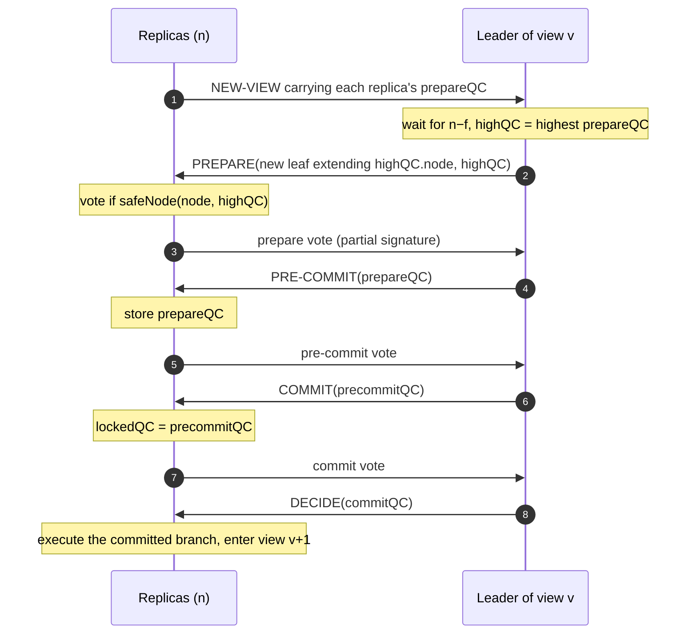
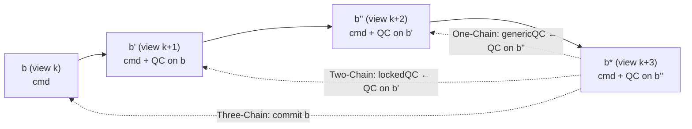
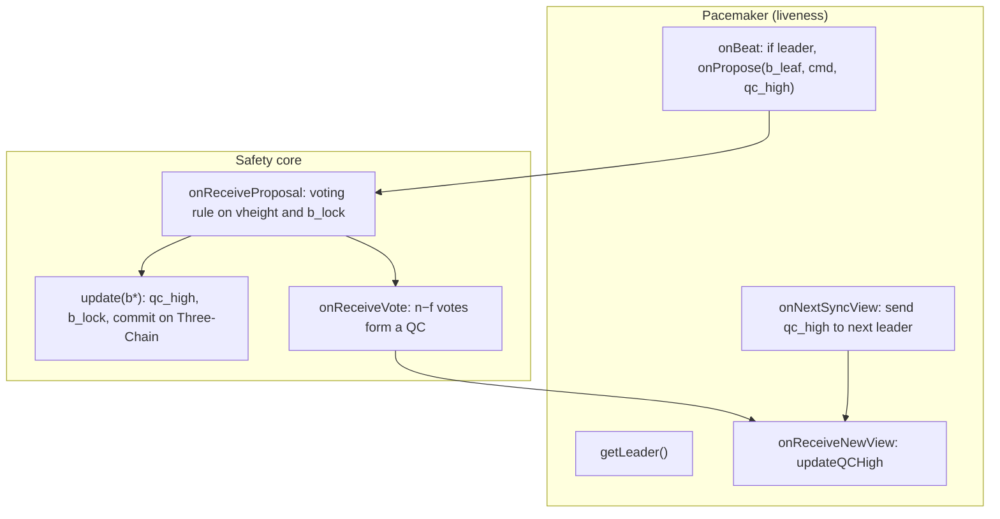

[HotStuff](https://arxiv.org/abs/1803.05069) is a leader-based Byzantine fault-tolerant (BFT) replication protocol published by Maofan Yin, Dahlia Malkhi, Michael K. Reiter, Guy Golan Gueta and Ittai Abraham (VMware Research, Cornell, UNC-Chapel Hill) and presented at PODC 2019. Its consensus core was adopted by Facebook's LibraBFT and its descendants, and HotStuff variants now run several proof-of-stake chains, including Hyperliquid's HyperBFT.

The paper solves a specific problem of the protocols built after PBFT. Replacing a faulty leader in those protocols requires the new leader to forward a proof gathered from a quorum of replicas, which costs $$O(n^2)$$ to $$O(n^3)$$ authenticators per leader change. Blockchain-style protocols such as Tendermint and Casper avoid that proof but make every new leader wait for the maximum network delay $$\Delta$$. HotStuff is the first partially synchronous protocol to combine both properties: a leader change costs $$O(n)$$ authenticators, and a correct leader proceeds as soon as it has heard from $$n - f$$ replicas.

The price is one extra voting phase. This article reads the v6 version of the paper (arXiv 1803.05069v6, July 2019) section by section: the model and the complexity measure, Basic HotStuff and its safety argument, why two phases cannot be both linear and responsive, Chained HotStuff, the event-driven implementation with its Pacemaker, the comparison with DLS, PBFT, Tendermint and Casper, and the evaluation against BFT-SMaRt.

> This article has been made with the help of [Claude Code](https://claude.com/product/claude-code) and several custom skills

[TOC]

## The problem HotStuff addresses

### State machine replication under partial synchrony

A BFT state machine replication (SMR) protocol makes $$n$$ deterministic replicas agree on the order in which they execute client commands, even though up to $$f$$ of them behave arbitrarily. If all correct replicas execute the same commands in the same order, they produce the same responses, and a client that waits for $$f + 1$$ matching replies knows at least one came from a correct replica.

HotStuff uses the *partial synchrony* model of Dwork, Lynch and Stockmeyer (DLS): there is a known bound $$\Delta$$ on message delay, but it only holds after an unknown *Global Stabilization Time* (GST). In this model:

- $$n \geq 3f + 1$$ replicas are needed for safety; the paper fixes $$n = 3f + 1$$.
- Safety must hold at all times, including before GST.
- Progress can be guaranteed only after GST, because the FLP result rules out deterministic consensus in a fully asynchronous network.

### The view-change bottleneck

Since [PBFT](https://pmg.csail.mit.edu/papers/osdi99.pdf) (Castro and Liskov, 1999), most practical BFT protocols use two voting phases per decision. The first phase forms a *quorum certificate* (QC) of $$n - f$$ votes, which guarantees that a proposal is unique within its view. The second phase guarantees that the next leader can convince replicas to vote for a safe proposal.

The second guarantee is where the cost sits. When a leader is replaced (a *view change*), the new leader must prove to replicas that its proposal does not conflict with anything that may have been decided. In PBFT, this proof contains $$n - f$$ messages, each carrying a QC, so a single view change transmits $$O(n^3)$$ authenticators. Combining each QC into one threshold signature, as SBFT does, brings this down to $$O(n^2)$$. If $$O(n)$$ leaders fail in a row before a decision is reached, the totals become $$O(n^4)$$ and $$O(n^3)$$.

### Responsiveness

Tendermint and Casper take a different route. Their new leader simply sends the highest QC it knows, which is linear. The catch is that a correct replica may hold a higher lock that the leader has not seen, and that replica will refuse to vote. To make sure it has seen the highest lock, the leader must wait $$\Delta$$ before proposing.

This forfeits *optimistic responsiveness*: the property that, after GST, a correct leader can drive a decision at the speed of the actual network delay rather than the worst-case bound. Liveness bugs of exactly this kind were reported in deployed systems, for instance [Tendermint issue #1047](https://github.com/tendermint/tendermint/issues/1047) and [Quorum's Istanbul BFT issue #305](https://github.com/jpmorganchase/quorum/issues/305), both cited by the paper.

HotStuff claims two properties together:

- **Linear view change.** After GST, a correct leader sends $$O(n)$$ authenticators to drive a decision, including when it replaces a failed leader. A cascade of $$f$$ leader failures costs $$O(fn)$$, so $$O(n^2)$$ in the worst case.
- **Optimistic responsiveness.** After GST, a correct leader only waits for the first $$n - f$$ responses before making a proposal that is guaranteed to progress.

## Model, cryptography and the complexity measure

### Threshold signatures

HotStuff relies on a $$(k, n)$$ threshold signature scheme with $$k = 2f + 1$$. Every replica holds a distinct private key share and all share one public key:

- `tsign_i(m)` produces a partial signature $$\rho_i$$ on message $$m$$;
- `tcombine(m, {ρ_i})` combines $$k$$ partial signatures into a single signature $$\sigma$$;
- `tverify(m, σ)` checks it against the common public key.

An adversary controlling $$f$$ replicas that obtains partial signatures from fewer than $$k - f$$ correct replicas cannot produce a valid $$\sigma$$ except with negligible probability. A quorum certificate is therefore one constant-size authenticator, regardless of $$n$$. A collision-resistant hash function $$h$$ is also assumed, so that a hash can identify a node of the tree.

### Authenticator complexity

The paper measures cost as *authenticator complexity*: the total number of partial signatures and signatures received by all replicas to reach one decision after GST. The authors prefer it to message complexity because it ignores topology: $$n$$ messages with one signature count the same as one message with $$n$$ signatures. They prefer it to bit complexity because view numbers grow without bound. It also tracks CPU load, since signing and verifying dominate the computation.

Table 1 of the paper summarises the outcome:

| Protocol | Correct leader | Leader failure (view change) | $$f$$ leader failures | Responsive |
|---|---|---|---|---|
| DLS | $$O(n^4)$$ | $$O(n^4)$$ | $$O(n^4)$$ | no |
| PBFT | $$O(n^2)$$ | $$O(n^3)$$ | $$O(fn^3)$$ | yes |
| SBFT | $$O(n)$$ | $$O(n^2)$$ | $$O(fn^2)$$ | yes |
| Tendermint / Casper | $$O(n^2)$$ | $$O(n^2)$$ | $$O(fn^2)$$ | no |
| Tendermint / Casper with threshold signatures | $$O(n)$$ | $$O(n)$$ | $$O(fn)$$ | no |
| HotStuff | $$O(n)$$ | $$O(n)$$ | $$O(fn)$$ | yes |

The fifth row is a hypothetical: the paper notes that Tendermint and Casper could combine signatures with a threshold scheme, although their original descriptions do not.

## Basic HotStuff

### Data structures

Each replica stores a tree of pending commands. A *node* holds a command (or a batch), protocol metadata, and a parent link, in practice the hash of the parent. The *branch* led by a node is the path from that node to the root. Two branches conflict when neither extends the other, and two nodes conflict when their branches do.

A message carries a `type` (`new-view`, `prepare`, `pre-commit`, `commit` or `decide`), the sender's `viewNumber`, an optional `node`, and an optional `justify` QC. A vote additionally carries `partialSig`, a partial signature over the tuple ⟨type, viewNumber, node⟩. A QC over the same tuple is built from $$n - f$$ such votes.

Each replica keeps three variables:

- **`viewNumber`**, starting at 1, incremented after a decision or a timeout;
- **`prepareQC`**, the highest QC for which it voted `pre-commit`;
- **`lockedQC`**, the highest QC for which it voted `commit`.

### The four phases of a view

Protocol time is divided into views, and each view has one leader known to all. A view goes through four phases, each a broadcast from the leader followed by a vote back to the leader.



- **Prepare.** The new leader waits for `new-view` messages from $$n - f$$ replicas, each carrying the sender's `prepareQC`. It selects the one with the highest view as `highQC`, creates a leaf that extends `highQC.node` with a new command, and broadcasts it in a `prepare` message justified by `highQC`. A replica votes if the node extends `highQC.node` and the `safeNode` predicate accepts it.
- **Pre-commit.** On $$n - f$$ prepare votes the leader forms `prepareQC` and broadcasts it. Replicas store it and vote.
- **Commit.** On $$n - f$$ pre-commit votes the leader forms `precommitQC` and broadcasts it. Replicas set `lockedQC` to it and vote. The lock is what protects a proposal that may become a decision.
- **Decide.** On $$n - f$$ commit votes the leader forms `commitQC` and broadcasts it. Replicas execute the branch and move to the next view.

In every phase, a replica that waits too long is interrupted by `nextView(viewNumber)`, sends a `new-view` message carrying its `prepareQC` to the next leader, and moves on. The incumbent leader of a stable regime may skip the `new-view` collection and reuse its own highest `prepareQC`; the paper defers this optimisation to the implementation.

### The safeNode predicate

The `safeNode(node, qc)` predicate decides whether a replica accepts a proposal. It is a disjunction of two rules:

```text
safeNode(node, qc) :=
      (node extends from lockedQC.node)              // safety rule
   OR (qc.viewNumber > lockedQC.viewNumber)          // liveness rule
```

The safety rule lets a replica vote for anything consistent with its lock. The liveness rule lets it abandon a lock when the leader shows a QC formed in a later view than the lock, which proves that a quorum moved on after the lock was taken. Without the second rule, a replica locked on a stale branch could block progress forever.

### Safety argument

Safety rests on two results.

**Lemma 1.** Two valid QCs of the same type on conflicting nodes cannot have the same view number. A QC needs $$2f + 1$$ votes, and two quorums of that size in a system of $$3f + 1$$ intersect in at least

$$
\begin{aligned}
2(2f + 1) - (3f + 1) = f + 1
\end{aligned}
$$

replicas, at least one of which is correct. A correct replica votes once per phase per view, so it cannot have contributed to both.

**Theorem 2.** Two conflicting nodes $$w$$ and $$b$$ cannot both be committed by correct replicas. Suppose `commitQC`s exist for $$w$$ in view $$v_1$$ and for $$b$$ in view $$v_2 \gt v_1$$. Let $$v_s$$ be the lowest view in $$(v_1, v_2]$$ in which a `prepareQC` on a node conflicting with $$w$$ was formed. Some correct replica $$r$$ voted both in the commit phase for $$w$$ (so it locked on $$w$$ in view $$v_1$$) and in the prepare phase of $$v_s$$. By minimality of $$v_s$$, $$r$$ has not released its lock when it evaluates the proposal of $$v_s$$:

- the proposal conflicts with $$w$$, so the safety rule fails;
- the justification of that proposal has a view no higher than $$v_1$$, otherwise $$v_s$$ would not be minimal, so the liveness rule fails.

So $$r$$ could not have voted, which contradicts the existence of the `prepareQC` of $$v_s$$.

### Liveness argument

Safety does not depend on how leaders are chosen or how timeouts are set. Liveness does, and the paper isolates it in two functions, `leader(view)` and `nextView(view)`.

**Lemma 3.** If a correct replica is locked on a `precommitQC`, then at least $$f + 1$$ correct replicas voted for the matching `prepareQC`. This holds because the `precommitQC` required $$n - f$$ pre-commit votes, and each of these voters stored the `prepareQC`.

**Theorem 4.** After GST, if all correct replicas stay in the same view long enough and its leader is correct, a decision is reached. The leader collects $$n - f$$ `new-view` messages. Since $$f + 1$$ correct replicas hold a `prepareQC` matching the highest lock in the system, and only $$f$$ replicas are missing from the leader's set, at least one of those messages carries it. The leader's `highQC` is therefore at least as high as every lock, and every correct replica accepts the proposal through one of the two rules of `safeNode`. The remaining phases then complete in bounded time.

Nothing in that argument waits for $$\Delta$$. This is what makes the protocol optimistically responsive.

For the two functions, the paper suggests a deterministic rotation of leaders over view numbers and an exponential back-off for `nextView`: each replica doubles its timeout every time a view ends without a decision. Eventually the waiting intervals of all correct replicas overlap for long enough under a correct leader.

### Why two phases are not enough

The paper shows that removing the pre-commit phase, so that a replica locks as soon as it sees a `prepareQC`, breaks liveness under an adversarial scheduler:

1. In view $$v$$, a leader proposes $$b$$ and forms a `prepareQC` on it. Only one replica $$r_v$$ receives it and locks on $$b$$. The others move on.
2. In view $$v + 1$$, the new leader collects $$2f + 1$$ `new-view` messages that exclude $$r_v$$. The highest QC among them is from view $$v - 1$$ on a node conflicting with $$b$$. The leader proposes a child of that node.
3. $$2f$$ correct replicas vote for it, but $$r_v$$ refuses: the proposal conflicts with its lock, and the justification is older than its lock. The view times out.
4. A Byzantine replica then sends the missing vote. A `prepareQC` forms in view $$v + 1$$, one replica $$r_{v+1}$$ receives it and locks, and the situation repeats.

The root cause is that a lock in the two-phase protocol may be held by a single replica, and a leader that listens to only $$n - f$$ replicas can miss it. With three phases, a lock implies that $$f + 1$$ correct replicas know the matching `prepareQC` (Lemma 3), so any $$n - f$$ responses reveal it. Two-phase protocols must either wait $$\Delta$$ (Tendermint, Casper) or attach a quorum-sized proof to each proposal (PBFT).

### Complexity

In each phase, only the leader broadcasts, and each replica answers once with a partial signature. The leader's message carries one QC, which is a single threshold signature. Each phase therefore costs $$O(n)$$ authenticators, and with a constant number of phases the cost per view is $$O(n)$$, whether or not the leader changed.

## Chained HotStuff

### One proposal per view

The three phases of Basic HotStuff do no useful work beyond collecting votes, and all of them have the same shape: the leader broadcasts a QC, replicas reply with a vote. Chained HotStuff exploits that symmetry. Every view runs a single *generic* phase in which the leader proposes a new node carrying the latest QC, called `genericQC`. Votes for that node are sent to the *next* leader, who builds the QC and embeds it in its own proposal.

The QC of view $$v + 1$$ then plays several roles at once: it is the prepare QC of the node proposed in $$v + 1$$, the pre-commit QC of the node of $$v$$, and the commit QC of the node of $$v - 1$$. A command proposed in $$v_1$$ is committed at the end of $$v_4$$, but the pipeline accepts a new command in every view. The protocol now has only two message types, `new-view` and `generic`.



### Dummy nodes and chain definitions

A leader may not obtain a QC for the previous view's proposal, because the previous leader crashed or equivocated. To keep view numbers equal to node heights, `createLeaf` fills the gap with blank nodes. As a consequence, the QC carried by a node does not always refer to its direct parent.

The paper defines chains on the relation `b.justify.node`:

- **One-Chain.** A node $$b^\star$$ forms a One-Chain when its QC refers to its direct parent $$b''$$.
- **Two-Chain.** It forms a Two-Chain when, additionally, the QC in $$b''$$ refers to the direct parent $$b'$$ of $$b''$$.
- **Three-Chain.** It forms a Three-Chain when, additionally, the QC in $$b'$$ refers to its direct parent $$b$$.

When a replica receives $$b^\star$$, it reads the chain backwards. A One-Chain means the prepare phase of $$b''$$ succeeded, so the replica updates `genericQC`. A Two-Chain means the pre-commit phase of $$b'$$ succeeded, so it updates `lockedQC` to the QC on $$b'$$. A Three-Chain means the commit phase of $$b$$ succeeded, so $$b$$ and its ancestors are committed and executed.

The paper notes that the first two updates remain safe when the chain is not direct, as long as the new QC is higher than the current one. The commit, however, requires all three links to be direct parents. Appendix A proves safety for this version; its liveness argument needs two consecutive correct leaders after GST.

## The event-driven implementation and the Pacemaker

### State of a replica

Section 6 turns Chained HotStuff into an event-driven specification that is close to the authors' code. Each replica keeps:

| Variable | Meaning |
|---|---|
| `V[·]` | votes collected per node |
| `vheight` | height of the last node this replica voted for |
| `b_lock` | locked node (the equivalent of `lockedQC`) |
| `b_exec` | last executed node |
| `qc_high` | highest known QC (the equivalent of `genericQC`), kept by the Pacemaker |
| `b_leaf` | current leaf of the tree, kept by the Pacemaker |

All replicas share a genesis node $$b_0$$ that contains a hard-coded QC on itself; `b_lock`, `b_exec` and `b_leaf` start at $$b_0$$ and `qc_high` holds its QC.

### The voting rule

On receiving a proposal `b_new`, a replica votes if both conditions hold:

```text
b_new.height > vheight
AND ( b_new extends b_lock                                  // safety
      OR b_new.justify.node.height > b_lock.height )       // liveness
```

It then sets `vheight` to `b_new.height`, sends its vote, and calls `update(b_new)`. The procedure `update` performs the chain reading described above: it raises `qc_high` to `b*.justify`, raises `b_lock` to `b'` if it is higher, and when `b'' ← b'` and `b' ← b` are direct parent links, it commits `b` through `onCommit`, which executes uncommitted ancestors recursively, oldest first.

Appendix B of the paper explains why two constraints are kept:

- **Monotonic `vheight`.** If a replica could vote for a lower height as long as it never voted twice at the same height, it could vote along one branch, then switch to a higher conflicting branch by the locking rule, and contribute to committing both.
- **Direct parents for commit.** Without them, heights of the two conflicting Three-Chains can interleave so that a replica votes on one chain's tail before discovering the other branch, after the first has already been committed.

### The Pacemaker

The liveness logic moves into a separate module, the *Pacemaker*. It has two jobs:

- **Synchronisation.** Bring all correct replicas and a single leader to a common height for long enough after GST, for instance with a predefined leader schedule and timeouts that grow until progress resumes.
- **Proposal selection.** After a view change, the new leader receives `new-view` messages (`onReceiveNewView`) carrying each replica's `qc_high`, and raises its own. During a stable leader's tenure no `new-view` is needed: the leader chains its next proposal on its own last leaf. An application-specific heuristic, such as waiting until the previous proposal has a QC, decides when `onBeat` triggers `onPropose`.

The paper stresses that a faulty Pacemaker, one that proposes at arbitrary times or picks parents and QCs capriciously, cannot break safety. Safety is entirely carried by the voting rule and `update`; the Pacemaker only affects liveness. This separation is one of the reasons HotStuff was adopted as a framework rather than only as a protocol.



### Two-phase variant

The framework accommodates a two-phase variant by changing only `update`: a One-Chain sets the lock and a direct Two-Chain commits. This saves one round trip per decision but loses optimistic responsiveness, for the reason given above. The Pacemaker must then incorporate a wait based on the maximum network delay, which makes the variant similar to Tendermint and Casper.

## DLS, PBFT, Tendermint and Casper in the same framework

Section 7 recasts four earlier protocols as chained protocols that differ in their commit rule and in how a new leader overcomes stale locks.

- **DLS (1988), One-Chain.** A replica locks on the highest node it voted for, and only the leader of a height can commit. If a leader equivocates, two correct replicas may lock on conflicting proposals at the same height, and unlocking requires evidence from $$2f + 1$$ replicas. The unlocking procedure is expensive: in the best case DLS needs $$n$$ leader rotations and $$O(n^4)$$ messages per decision.
- **PBFT (1999), Two-Chain.** A replica locks on a One-Chain. Since two One-Chains at the same height cannot coexist, the DLS deadlock disappears. To unlock replicas holding a higher lock than the leader knows, the leader attaches a proof built from $$n - f$$ replicas' highest One-Chains: $$O(n^3)$$ authenticators in the original PBFT, $$O(n^2)$$ with signature combining (SBFT) or in the PBFT variant that sends the highest One-Chain once plus a signed statement from each quorum member.
- **[Tendermint](https://arxiv.org/abs/1807.04938) (2016) and [Casper](https://arxiv.org/abs/1710.09437) (2017), Two-Chain with delay.** The leader only sends the highest One-Chain it knows, which is linear with threshold signatures. Replicas unlock when shown a higher one. To make sure it knows the highest one, a new leader waits for the maximum network delay. Casper's rule differs from Tendermint's in that the leaf does not need a QC on its direct parent.
- **HotStuff (2018), Three-Chain.** Like Tendermint, the leader sends only its highest QC. The extra QC step guarantees that any $$n - f$$ replies reveal it, so no wait is required.

The framework shows that these protocols differ in where they pay for liveness: DLS in rotations, PBFT in proof size, Tendermint and Casper in latency, and HotStuff in one additional phase that, once chained, does not reduce throughput.

## Evaluation

### Setup

The authors implemented HotStuff as a C++ library of about 4,000 lines, with about 200 lines for the core consensus logic, and published it as [libhotstuff](https://github.com/hot-stuff/libhotstuff). They compared it with [BFT-SMaRt](https://github.com/bft-smart/library), a mature PBFT-style system, on Amazon EC2 `c5.4xlarge` instances with 16 vCPUs each, one replica per instance. The measured TCP bandwidth was about 1.2 GB/s and the latency between machines below 1 ms.

Two details affect the results:

- The prototype signs votes with secp256k1 and represents a QC as a **list of signatures**, not a threshold signature. Verification cost therefore still grows with $$n$$; the authors name a fast threshold scheme as future work.
- BFT-SMaRt authenticates normal-case messages with HMAC-SHA1, which is much cheaper than the asymmetric signatures used by HotStuff, and adds signatures only during view changes.

Both a three-phase (HS3) and a two-phase (HS2) HotStuff were measured, since BFT-SMaRt itself has two phases.

### Results

- **Base performance** ($$n = 4$$, $$f = 1$$, empty requests). With batches of 100, 400 and 800 operations, both HotStuff variants reached latency comparable to BFT-SMaRt and noticeably higher maximum throughput. Above 400 operations per batch, the batching delay outweighs the saved signature cost. HotStuff needs three further full batches (two for HS2) before a batch is decided, which adds latency when the pipeline fills slowly.
- **Payload size.** With 0, 128 and 1,024-byte requests and replies, both variants outperformed BFT-SMaRt in throughput at similar latency.
- **Scalability** (up to 128 replicas, batch of 400). HotStuff kept higher throughput than BFT-SMaRt, with latency comparable and degrading gracefully. With 1,024-byte payloads, BFT-SMaRt's quadratic bandwidth made it scale worse. With 5 ms and 10 ms of injected inter-replica latency, HotStuff outperformed BFT-SMaRt in both settings.
- **View change.** The authors counted authenticators that BFT-SMaRt processes only because the leader changed. They fit at about $$3.1n^3$$ MACs and $$4.2n^2$$ signatures per view change. HotStuff has no such extra authenticators, because a view change costs exactly what a normal view costs. Wall-clock comparison of leader replacement was not possible: BFT-SMaRt got stuck under frequent view changes, and the elapsed time depends heavily on timeout parameters.

## Influence and later work

HotStuff became the starting point for a family of production protocols. Facebook's LibraBFT, later renamed DiemBFT and in turn the basis of AptosBFT, adopted its chained form and its Pacemaker. Hyperliquid's HyperBFT, [described in an earlier article]({{site.url_complet}}/2026/09/02/hyperliquid-protocol-architecture/), is a HotStuff variant with stake-weighted leaders. Tendermint-family engines took the other path, keeping two phases and a timeout, as the article on [Malachite consensus on Arc]({{site.url_complet}}/2026/09/25/malachite-consensus-arc/) shows.

The extra phase did not remain unquestioned. [HotStuff-2](https://eprint.iacr.org/2023/397) (Malkhi and Nayak, 2023) shows that two phases suffice for a linear and responsive protocol in the common case, at the cost of a wait of $$\Delta$$ only when the new leader cannot otherwise prove that it holds the highest lock.

## Conclusion

HotStuff trades one additional voting phase for a leader-replacement protocol that costs the same as a normal view.

- **The third phase is the key change.** Locking on a `precommitQC` rather than a `prepareQC` guarantees that $$f + 1$$ correct replicas know the QC behind any lock, so a leader that hears from $$n - f$$ replicas always learns the highest one.
- **Linearity comes from threshold signatures and a star topology.** The leader broadcasts one QC per phase and each replica answers with one partial signature: $$O(n)$$ authenticators per view, with or without a leader change.
- **Responsiveness comes from the liveness rule of `safeNode`.** A replica releases a stale lock when shown a QC from a later view, so a correct leader never has to wait for $$\Delta$$.
- **Chaining removes the latency cost from throughput.** Each QC serves as prepare, pre-commit and commit certificate for three consecutive proposals, and a direct Three-Chain commits.
- **Safety and liveness are separated.** The voting rule and `update` carry safety; the Pacemaker, which chooses leaders and timeouts, can only delay progress.
- **The framework explains its predecessors.** DLS, PBFT, Tendermint and Casper appear as One-Chain or Two-Chain rules that pay for liveness with rotations, quadratic proofs or a fixed delay.
- **The prototype matched or exceeded BFT-SMaRt** in throughput up to 128 replicas, despite using a list of secp256k1 signatures instead of a threshold scheme, and added no authenticators for a view change.


## Annex

### Key Terms

| Term | Definition |
|------|------------|
| **Byzantine fault** | A failure in which a replica deviates arbitrarily from the protocol, for instance by lying, sending conflicting messages or staying silent; the protocol tolerates up to f such replicas out of n = 3f + 1, where n is the total number of replicas and f the maximum number of Byzantine ones. |
| **State machine replication (SMR)** | Technique in which n deterministic replicas execute the same client commands in the same order, so that correct replicas hold the same state and return the same responses. |
| **Safety and liveness** | Safety means correct replicas never commit conflicting nodes; liveness means new commands are eventually committed. HotStuff guarantees safety at all times and liveness only after GST. |
| **Quorum** | Any set of n − f = 2f + 1 replicas; two quorums share at least f + 1 replicas, so at least one correct replica belongs to both. |
| **Equivocation** | A Byzantine leader sending conflicting proposals for the same view or height to different replicas. |
| **Partial synchrony** | Network model in which a known delay bound Δ holds only after an unknown Global Stabilization Time (GST); safety must hold always, progress only after GST. |
| **Global Stabilization Time (GST)** | The unknown moment after which every message between correct replicas arrives within Δ; before it, messages can be delayed arbitrarily, so a decision may never be reached, and after it HotStuff guarantees progress. |
| **Authenticator complexity** | Total number of signatures and partial signatures received by all replicas to reach one consensus decision after GST. |
| **Quorum certificate (QC)** | Proof that n − f replicas voted for the same ⟨type, view, node⟩ tuple, encoded as one threshold signature. |
| **Threshold signature** | Scheme in which k = 2f + 1 partial signatures from distinct key shares combine into one signature verifiable under a single public key. |
| **View** | A numbered period of the protocol with one predetermined leader; it ends with a decision or a timeout, and its number stamps every message so votes from different views are never combined and QCs can be ranked. |
| **View change** | Replacement of the current leader by the next one after a timeout; the step whose cost HotStuff makes linear. |
| **Optimistic responsiveness** | After GST, a correct leader needs only the first n − f responses to make a proposal that progresses, without waiting for Δ. |
| **safeNode** | Voting predicate that accepts a proposal if it extends the locked node (safety rule) or is justified by a QC from a later view than the lock (liveness rule). |
| **Locked QC** | The precommitQC a replica voted to commit (b_lock in the implementation); it restricts which conflicting proposals the replica may vote for. |
| **Three-Chain** | Three consecutive nodes each carrying a QC on its direct parent; it commits the first node of the chain in Chained HotStuff. |
| **Pacemaker** | Module that elects leaders, synchronises views and chooses when to propose; it affects only liveness, never safety. |

### Security Implementation Checklist

The rows below derive from the paper's algorithms and proofs and apply to any HotStuff-family implementation. Rows about persistence are implementation consequences that the paper's model of non-crashing correct replicas leaves implicit.

#### Voting rules

| Check | Security requirement | Failure mode if violated |
|:---:|------------|------------|
| ☐ | A replica votes at most once per height (per phase per view in Basic HotStuff). | Two conflicting QCs at the same height become possible, which breaks Lemma 1 and the safety proof. |
| ☐ | `vheight` is strictly increasing: a replica never votes for a node at or below the height of its last vote. | A replica can vote along one branch, switch to a conflicting branch through the lock rule, and help commit both (Appendix B). |
| ☐ | The vote is cast only if the proposal extends `b_lock` or its QC refers to a node higher than `b_lock`. | Dropping the safety disjunct lets a replica abandon a lock without evidence; dropping the liveness disjunct lets stale locks halt the chain. |
| ☐ | The QC carried by a proposal refers to an ancestor of the proposed node. | A proposal justified by a QC on an unrelated branch defeats the minimality argument in the safety proof. |
| ☐ | A commit requires a Three-Chain of direct parent links (Two-Chain for the two-phase variant). | Interleaved heights of conflicting chains allow two conflicting commits (Appendix B, "Why direct parent?"). |

#### Quorum certificates and cryptography

| Check | Security requirement | Failure mode if violated |
|:---:|------------|------------|
| ☐ | A QC is accepted only if it verifies against the threshold public key with threshold k = 2f + 1 over the exact ⟨type, view, node⟩ tuple. | A QC built from fewer votes, or reused across types or views, removes the quorum-intersection guarantee. |
| ☐ | Votes are deduplicated per signer before a QC is formed (`onReceiveVote`). | A Byzantine replica counted several times lets the leader reach n − f with fewer than 2f + 1 distinct signers. |
| ☐ | The parent link of a node is a collision-resistant hash of the parent. | A collision lets two different branches share an identifier, so a QC certifies something other than what the voters saw. |
| ☐ | Key shares are generated and distributed so that no coalition of f replicas learns k shares. | The adversary forges QCs on its own and both safety and liveness collapse. |

#### Liveness and persistence

| Check | Security requirement | Failure mode if violated |
|:---:|------------|------------|
| ☐ | Timeouts grow (for instance exponentially) while views fail to decide, and leaders rotate deterministically through all replicas. | Correct replicas never overlap in the same view for long enough after GST, or a faulty leader is never replaced. |
| ☐ | A two-phase variant includes an explicit wait of Δ before a new leader proposes. | The livelock scenario of Section 4.4 halts progress indefinitely. |
| ☐ | `vheight`, `b_lock` and the voted node are written to durable storage before the vote is sent. | A replica that restarts with older state can vote twice at a height or forget its lock, which behaves like an extra Byzantine replica. |
| ☐ | Commands are executed only from committed branches, ancestors first (`onCommit`). | Replicas diverge in state even though consensus itself is safe. |

## Frequently Asked Questions

**Q: What does "authenticator complexity" count, and why do the authors prefer it to message complexity?**

It counts every partial signature and signature received by all replicas until one decision is reached after GST. Unlike message complexity, it does not depend on how authenticators are packed into messages, and unlike bit complexity, it is not distorted by view numbers that grow forever. It also reflects CPU cost, since signature operations dominate computation in these protocols.

**Q: Which variable does a Basic HotStuff replica update in each phase, and which one does it send in a `new-view` message?**

In the pre-commit phase it stores the received QC as `prepareQC`; in the commit phase it stores the `precommitQC` as `lockedQC`; in the decide phase it executes the branch certified by `commitQC`. The `new-view` message carries `prepareQC`, the highest QC for which it voted pre-commit.

**Q: Why does a two-phase protocol lose either linearity or responsiveness, and how does the third phase avoid it?**

In a two-phase protocol, a replica locks as soon as it sees a `prepareQC`, and the scheduler can arrange for a single correct replica to be the only one holding that QC. A new leader that listens to $$n - f$$ replicas may not hear from it, proposes something conflicting, and the locked replica refuses. The protocol then has two options:

- attach a quorum-sized proof that lets the replica unlock, as PBFT does, at quadratic cost or more;
- wait $$\Delta$$ to hear from every correct replica, as Tendermint and Casper do, which gives up responsiveness.

With three phases, a replica locks on a `precommitQC`, which exists only if $$n - f$$ replicas stored the matching `prepareQC`. At least $$f + 1$$ of them are correct, so any $$n - f$$ `new-view` messages include one. The leader's `highQC` is then at least as high as every lock, and the liveness rule of `safeNode` makes every correct replica vote.

**Q: In Chained HotStuff, a replica receives a node $$b^\star$$ that forms a direct Three-Chain $$b \leftarrow b' \leftarrow b'' \leftarrow b^\star$$. What does it update?**

Three things:

- `genericQC` (or `qc_high`) becomes the QC carried by $$b^\star$$, which certifies $$b''$$: the prepare phase of $$b''$$ is done.
- The lock moves to $$b'$$, using the QC carried by $$b''$$: the pre-commit phase of $$b'$$ is done.
- $$b$$ is committed and executed with its uncommitted ancestors: the commit phase of $$b$$ is done.

The first two updates are allowed even when links are not direct, as long as they raise the current value; the commit is not.

**Q: Can a malicious or buggy Pacemaker cause two conflicting blocks to be committed?**

No. The paper states that even a Pacemaker that calls `onPropose` arbitrarily, or picks parents and QCs capriciously, cannot break safety, because every vote still goes through the voting rule (monotonic `vheight`, lock check) and every commit through the direct Three-Chain test in `update`. A bad Pacemaker can only prevent progress, for instance by never synchronising replicas under a correct leader.

**Q: The prototype uses a list of secp256k1 signatures for each QC. How does this affect the linearity claim and the measured scalability?**

Linearity is a property of authenticator complexity with threshold signatures: one QC counts as one authenticator. A list of $$n - f$$ signatures is $$O(n)$$ authenticators per QC, so each broadcast in the prototype costs $$O(n^2)$$ verifications in total.

The authors state that HotStuff scales better than BFT-SMaRt below 32 replicas, attribute this limit to the list of signatures, and name a fast threshold scheme as future work. The view-change measurement is unaffected: HotStuff still sends no extra authenticators when the leader changes, whereas BFT-SMaRt processes about $$3.1n^3$$ MACs and $$4.2n^2$$ signatures.

**Q: How do Tendermint and Casper fit in the HotStuff framework, and what distinguishes them from PBFT?**

All three use a Two-Chain commit rule: a replica locks on a One-Chain and commits on a Two-Chain (Casper's leaf does not need a QC on its direct parent). They differ in how a new leader overcomes stale locks. PBFT attaches a proof of the highest One-Chains reported by a quorum, which is $$O(n^2)$$ or $$O(n^3)$$. Tendermint and Casper send only the leader's own highest One-Chain, which is linear, but require the leader to wait the maximum network delay first.

## References

### HotStuff

- [HotStuff: BFT Consensus in the Lens of Blockchain](https://arxiv.org/abs/1803.05069), Maofan Yin, Dahlia Malkhi, Michael K. Reiter, Guy Golan Gueta, Ittai Abraham, arXiv 1803.05069v6, July 2019 (PODC 2019)
- [hot-stuff/libhotstuff](https://github.com/hot-stuff/libhotstuff), the authors' C++ implementation
- [HotStuff-2: Optimal Two-Phase Responsive BFT](https://eprint.iacr.org/2023/397), Dahlia Malkhi, Kartik Nayak, 2023

### Protocols compared in the paper

- Dwork, Lynch, Stockmeyer, *Consensus in the Presence of Partial Synchrony*, Journal of the ACM 35(2), 1988
- [Practical Byzantine Fault Tolerance](https://pmg.csail.mit.edu/papers/osdi99.pdf), Miguel Castro, Barbara Liskov, OSDI 1999
- [The latest gossip on BFT consensus](https://arxiv.org/abs/1807.04938), Ethan Buchman, Jae Kwon, Zarko Milosevic (Tendermint)
- [Casper the Friendly Finality Gadget](https://arxiv.org/abs/1710.09437), Vitalik Buterin, Virgil Griffith, 2017
- [Casper FFG with one message type, and simpler fork choice rule](https://ethresear.ch/t/casper-ffg-with-one-message-type-and-simpler-fork-choice-rule/103), ethresear.ch, 2017
- [BFT-SMaRt library](https://github.com/bft-smart/library), baseline of the evaluation

### Liveness incidents cited by the paper

- [A livelock bug in the presence of byzantine validator](https://github.com/tendermint/tendermint/issues/1047), Tendermint issue #1047, 2018
- [Istanbul BFT's design cannot successfully tolerate fail-stop failures](https://github.com/jpmorganchase/quorum/issues/305), Quorum issue #305, 2018

### Related articles

- [Tendermint — BFT Consensus over Gossip, Locks and the validValue Termination Mechanism]({{site.url_complet}}/2026/10/01/tendermint-bft-consensus/)
- [Malachite Consensus on Arc — How Circle's L1 Finalises a Block, Compared with CometBFT, HotStuff and Gasper]({{site.url_complet}}/2026/09/25/malachite-consensus-arc/)
- [The Hyperliquid Protocol - HyperCore, HyperEVM and Onchain Perpetual Mechanics]({{site.url_complet}}/2026/09/02/hyperliquid-protocol-architecture/)
- [Ouroboros: How Cardano Reaches Consensus with Proof of Stake]({{site.url_complet}}/2026/07/16/ouroboros-proof-of-stake/)
- [Inside the Zama KMS — Threshold Key Management for FHE, From MPC Protocol to Enclave Deployment]({{site.url_complet}}/2026/09/18/zama-kms-threshold-key-management-architecture-and-operation/)
