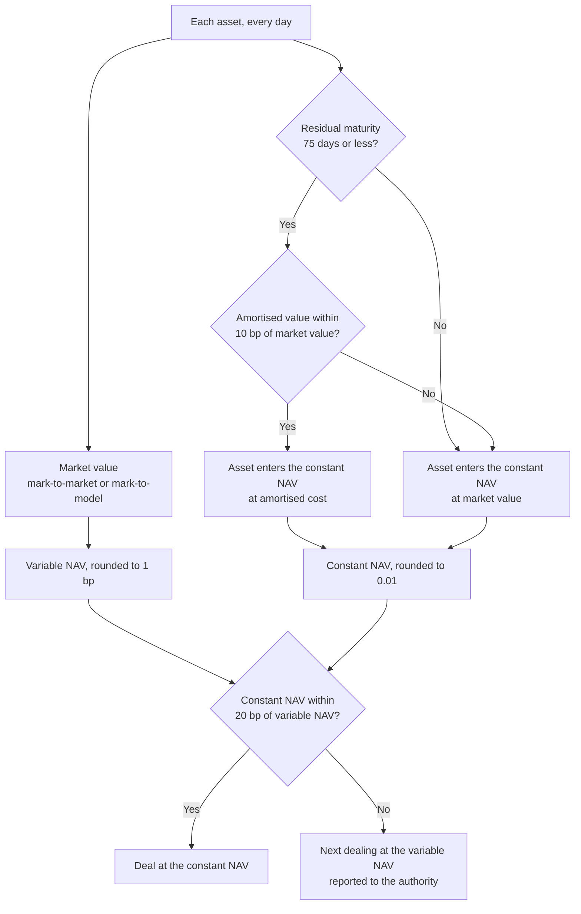
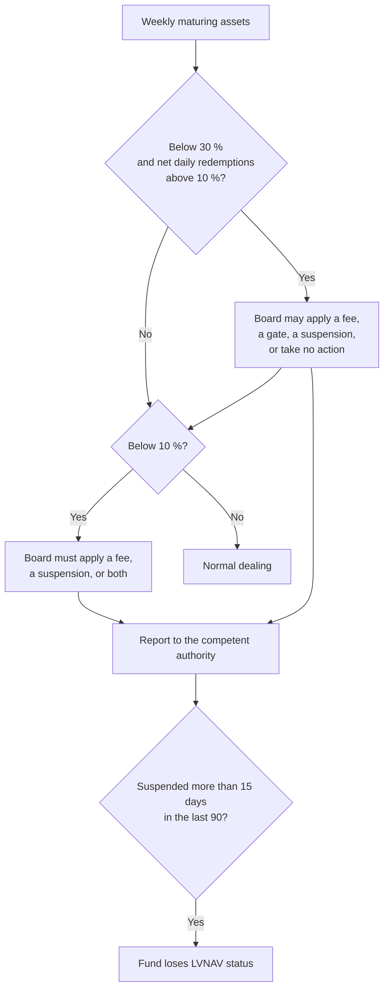

A low volatility net asset value money market fund (LVNAV) is the fund type that most EU corporate treasurers use as a cash account: it lets investors subscribe and redeem at a stable price of, say, EUR 1.00 or USD 1.00 per share, while it invests in bank and corporate paper rather than only in government debt. At the end of 2024 LVNAVs held about 46 % of the net assets of EU money market funds, which the Commission puts at EUR 1.95 trillion across 455 funds; most of them are denominated in US dollars or sterling and domiciled in Ireland or Luxembourg.

The stable price is a privilege that [Regulation (EU) 2017/1131](https://eur-lex.europa.eu/eli/reg/2017/1131/oj) grants under conditions: a 10 basis point tolerance per asset, a 20 basis point band at fund level, and a set of liquidity tools tied to a 30 % weekly-liquidity threshold. A [previous article]({{site.url_complet}}/2026/10/01/eu-money-market-fund-regulation-2017-1131/) covers the Regulation as a whole. This one follows the LVNAV mechanism step by step, with numerical examples, and then looks at how it behaved in the two stress episodes it has been through, March 2020 and the UK gilt crisis of September 2022.

The last part follows the policy debate those episodes started: the FSB, ESRB and ESMA proposals of 2021 and 2022, the Commission's 2023 decision not to amend the Regulation, the liquidity management tools that the revised UCITS and AIFM Directives require from April 2026, and the Commission's May 2026 report, which kept the legal thresholds and added non-binding liquidity benchmarks. Article numbers refer to the MMF Regulation unless another act is named.

> This article has been made with the help of [Claude Code](https://claude.com/product/claude-code) and several custom skills

[TOC]

## What an LVNAV is allowed to do

The Regulation defines three fund types (Art. 3). A VNAV deals at a floating price; a public debt CNAV deals at a constant price but must hold at least 99.5 % of its assets in public debt, reverse repos secured by it, and cash. The LVNAV sits between them: it may deal at a constant price while investing in the same private-sector instruments as a VNAV, provided it meets the specific requirements of Articles 29, 30, 32 and 33(2)(b) (Art. 2(12)).

Three features set it apart:

- **It is always short-term** (Art. 25(3)): WAM of at most 60 days, WAL of at most 120 days, at least 10 % daily maturing assets and 30 % weekly maturing assets (Art. 24).
- **It may value part of its portfolio at amortised cost**, but only assets with a residual maturity of 75 days or less, and only while their amortised value stays within 10 bp of their market value (Art. 29(7)).
- **It may deal at its constant NAV** only while that constant NAV stays within 20 bp of its variable NAV (Art. 33(2)(b)). Beyond that, it deals at the variable NAV like a VNAV.

It also carries the Article 34 regime on liquidity fees, redemption gates and suspensions, which it shares with the public debt CNAV, and the general ban on sponsor support of Article 35.

## Two prices every day

### The variable NAV and the constant NAV

Every LVNAV computes two net asset values each day:

- **The variable NAV per share** (Art. 30): assets valued at mark-to-market or mark-to-model, minus liabilities, divided by shares outstanding, rounded to the nearest basis point and published daily on the fund's website.
- **The constant NAV per share** (Art. 32): the same calculation, but with the eligible assets valued at amortised cost, rounded to the nearest percentage point. For a share worth one currency unit, rounding to a percentage point means rounding to the second decimal, so the constant NAV reads 1.00 as long as the unrounded value stays between 0.995 and 1.005.

The difference between the two is monitored and published daily (Art. 32(4)). The amortised cost method (Art. 2(10)) values an asset at its purchase price adjusted for the amortisation of the discount or premium until maturity. It ignores market movements, which is what makes the constant price possible, and it is also why the Regulation fences it in at two levels.

### First fence: the 10 bp test per asset

Article 29(7) allows amortised cost for an asset with up to 75 days to maturity only while "the price of that asset calculated in accordance with paragraphs 2, 3 and 4 does not deviate from the price of that asset calculated in accordance with the first subparagraph … by more than 10 basis points". The test is applied asset by asset, every day.

A worked example shows how quickly it can bite. Take commercial paper with a face value of 100 and 60 days to maturity, bought at a money market yield of 3.00 % on an actual/360 basis, which gives a purchase price of 99.5025. Amortising the discount on a straight line, the paper is carried at 99.6683 twenty days later. With 40 days left, its market price depends on the yield at which the market now trades it:

| Market yield after 20 days | Market price | Amortised value | Deviation | Valuation |
|---|---|---|---|---|
| 3.60 % | 99.6016 | 99.6683 | 6.7 bp | Amortised cost allowed |
| 4.00 % | 99.5575 | 99.6683 | 11.1 bp | Must be marked to market |

A rise of one percentage point in the yield of a 40-day instrument is enough to cross the tolerance, because the price sensitivity of short paper is small but the tolerance is smaller still. Each breach of the 10 bp test must be reported to the competent authority under Article 37(3)(a). The 75-day limit has the same purpose: the longer an asset's remaining life, the more its market price can move away from its amortised value.

### Second fence: the 20 bp band on the fund

The fund-level test compares the constant NAV with the variable NAV. As long as the gap is at most 20 bp, the fund issues and redeems at the constant NAV. When it exceeds 20 bp, "the following redemption or subscription shall be undertaken at a price that is equal to the NAV per unit or share calculated in accordance with Article 30" (Art. 33(2)).

With a constant NAV of 1.00:

- a variable NAV of 0.9985 is 15 bp away, and the fund keeps dealing at 1.00;
- a variable NAV of 0.9978 is 22 bp away, so the next redeeming investor receives 0.9978, and the event is reported under Article 37(3)(b).

Investors must be warned in writing, before they invest, of the circumstances in which the fund stops dealing at a constant price (Art. 33(2)). The fund does not stop dealing and does not lose its LVNAV authorisation when the band is breached; it deals at the floating price until the gap closes.

### Why the band creates a first-mover advantage

The 20 bp band is what makes the LVNAV useful as a cash account, and it is also its weak point under stress. Suppose the variable NAV is drifting down towards the edge of the band because the paper it holds is losing value. An investor who redeems now receives 1.00.

An investor who waits may receive less than 1.00 once the band is broken, and in the meantime bears a larger share of the losses, because redemptions at 1.00 are paid out of a portfolio worth less than 1.00 per share. The incentive is to redeem early, and the more investors do so, the more the fund has to sell, which can push the variable NAV further down.

The ECB measured that effect in March 2020. Its analysis of EU funds found that "outflows are around 1.8–2.3 percentage points larger for LVNAV funds that were close to the lower valuation threshold". The same logic is behind the policy proposals discussed below to remove amortised cost from LVNAVs altogether.

## Liquidity fees, gates and suspensions

### The two triggers of Article 34

Article 34 ties the fund's liquidity tools to its weekly maturing assets, the share of assets that mature or can be recovered within five working days:

| Trigger | Board obligation | Available measures |
|---|---|---|
| Weekly maturing assets below **30 %** of total assets **and** net daily redemptions above **10 %** of total assets | Documented assessment; may choose | Liquidity fee; redemption gate of at most 10 % of shares per working day for up to 15 working days; suspension for up to 15 working days; or no action beyond restoring compliance (Art. 24(2)) |
| Weekly maturing assets below **10 %** | Documented assessment; must act | Liquidity fee, suspension for up to 15 working days, or both |
| Suspensions above **15 days within 90 days** | None: automatic | The fund ceases to be an LVNAV and informs each investor in writing (Art. 34(2)) |

The board's decisions are reported to the competent authority (Art. 34(3)), and the manager reports every Article 34 event under Article 37(3)(c).

### The threshold effect

The 30 % line was designed as a floor that triggers a board review. In practice it also tells investors when fees or gates become possible, and investors who fear a gate have a reason to redeem before the fund reaches the line. The manager, knowing this, has a reason not to let the fund get there, which means not using the buffer the rule was meant to create.

The ECB found exactly that in March 2020: "LVNAV and VNAV funds reduced their holdings of weekly liquid assets only slightly – by 1 and 3 percentage points respectively" during the peak of the stress. Funds met redemptions by selling longer assets rather than by running down the liquidity they held for that purpose. The Commission's 2023 report and the FSB's 2024 peer review both identified the tie between thresholds and tools as the feature most in need of change.

## Two stress episodes

### March 2020

The pandemic shock reached money market funds in mid-March 2020. Over the two weeks from 11 to 25 March, EU LVNAVs lost EUR 85 billion, 16 % of their total assets, according to the ECB, with US dollar funds under the most pressure. The Commission's 2026 report adds that the shock was uneven: fewer than 6 % of LVNAVs had cumulative outflows above 30 % of their NAV, and part of the US dollar outflows went into public debt CNAVs rather than out of the sector.

Several US dollar LVNAVs came close to the lower edge of their 20 bp band. None broke it, none had to convert to a VNAV, and no EU money market fund imposed fees, gates or a suspension. The stress eased after central banks intervened in short-term funding markets; the ECB's analysis marks 26 March 2020, when purchases under its pandemic emergency purchase programme started, as the turning point.

### September 2022 and the gilt market

The second episode came from outside the sector. In late September 2022, a sharp rise in UK gilt yields caused large losses for pension funds using liability-driven investment (LDI) strategies, which had to meet variation margin calls in cash and redeemed their sterling money market fund holdings to do so. The FSB reports that some sterling funds in the UK and the EU saw outflows "even larger than those seen during the March 2020 dash for cash".

LVNAVs entered the episode already showing NAV deviations, because rising rates had lowered the market value of their holdings, and the deviations widened with the volatility of short-term rate expectations.

"Some LVNAV funds came close to breaking their collar, but none ultimately did," the FSB concludes, and the stress subsided only after the Bank of England's intervention in the gilt market.

The Commission's 2026 figures show how concentrated the shock was: the median sterling LVNAV lost 9 % in a week, the 10th percentile 21 %, and the most affected 1 % of funds nearly 37 % in a single week. Funds used mainly by LDI strategies to hold margin cash took the losses, while sterling LVNAVs with broader cash-management investor bases received inflows.

### What the episodes show

The two episodes point to the same mechanisms, seen from different angles:

- **The band held, but narrowly.** In both cases some funds approached the 20 bp limit, and in both cases central bank action in the underlying market came before any fund broke it.
- **The weekly buffer was barely used.** Funds protected the 30 % line rather than drawing on it, which is the threshold effect the Regulation's design created.
- **The investor base determined the shock.** Funds whose investors held MMF shares as collateral or margin liquidity saw correlated, sudden redemptions; funds used for routine cash management did not. This is the analysis Article 27 requires managers to carry out on their own investor base.

## The policy response

### Proposals of 2021 and 2022

After March 2020, three bodies published reform proposals within four months of each other: the FSB's policy proposals of 11 October 2021, the ESRB's recommendation of 25 January 2022, and ESMA's opinion of February 2022. The Commission's 2023 report lists where they overlapped. All three recommended:

- removing the possibility for LVNAVs to use amortised cost, which would turn them into variable-price funds;
- decoupling the activation of liquidity management tools from regulatory liquidity thresholds for LVNAVs and CNAVs;
- rules on the use of liquidity management tools.

Other proposals, made by some but not all, included changes to the daily and weekly liquidity ratios, making liquidity buffers usable in stress, imposing on redeeming investors the cost of their redemptions, a minimum balance at risk, a capital buffer, and stronger stress testing.

### The Commission's 2023 report: no amendment

The Commission's review report of 20 July 2023 concluded that the Regulation "has enhanced financial stability and overall successfully passed the test of the recent market stress episodes", and that it "will therefore not propose a revision of the legislation at the present stage". On the LVNAV, the report notes that removing amortised cost "would imply a radical change for the EU MMF market and notably the disappearance of the LVNAV market", and that most respondents to its consultation opposed it.

It did identify "scope to further increase the resilience of EU MMFs, notably by decoupling the potential activation of liquidity management tools from regulatory liquidity thresholds", without proposing the amendment. On the 80 % EU public debt quota that Article 46 asked it to assess, it concluded that the merits "remain questionable".

### Liquidity management tools from April 2026

The change that did happen came through the fund directives. [Directive (EU) 2024/927](https://eur-lex.europa.eu/eli/dir/2024/927/oj) amended the AIFM and UCITS Directives to require managers of open-ended funds to select liquidity management tools from a harmonised list: redemption gates, extended notice periods, redemption fees, swing pricing, dual pricing, anti-dilution levies and redemptions in kind. Money market funds must select at least one, other funds at least two. The new rules apply from 16 April 2026. For an LVNAV, the selected tool sits alongside the Article 34 regime, which the directive did not change.

### The Commission's 2026 report: benchmarks, not thresholds

On 11 May 2026 the Commission published a second report, [COM(2026) 350](https://ec.europa.eu/finance/docs/law/260511-money-market-funds-report_en.pdf), on the liquidity of money market funds. It found that most funds keep liquidity well above the regulatory minima and rebuilt their buffers quickly after stress. It then calibrated the weekly liquidity a fund would need to absorb a first-percentile redemption shock, based on March 2020, without selling assets and without drawing its daily liquidity below the minimum.

The result is a "market resilience level" of **40 %** weekly liquid assets for CNAVs and LVNAVs and **20 %** for VNAVs. The Commission considered that setting these levels as binding minima "is not proportionate", given the differences between funds, and proposed them instead as benchmarks for managers' risk functions and as early-warning indicators for national authorities when a fund operates persistently below them. The legal thresholds of Articles 24 and 34 remain 30 % and 10 %.

### The US took the other route

The comparison with the United States shows the alternative the EU did not take. In July 2023 the SEC amended its money market fund rule to raise the minimum to 25 % daily and 50 % weekly liquid assets, to remove the ability to suspend redemptions with temporary gates, and to remove "the regulatory tie between the imposition of liquidity fees and a fund's liquidity level". Institutional prime and institutional tax-exempt funds must instead charge a mandatory liquidity fee when daily net redemptions exceed 5 % of net assets, unless liquidity costs are de minimis. The EU kept both the thresholds and the tie.

## Stress testing an LVNAV

Article 28 requires every money market fund to stress test its portfolio, at a frequency the board sets and that is at least "bi-annual", against changes in liquidity, credit risk, interest and exchange rates, redemption levels, spreads and macro shocks. For an LVNAV, Article 28(2) adds a specific output: the stress tests "shall estimate for different scenarios the difference between the constant NAV per unit or share and the NAV per unit or share". In other words, the fund must estimate how close each scenario brings it to the 20 bp band.

ESMA's guidelines set common reference parameters for these scenarios, and Article 28(7) requires ESMA to update them at least every year; the final report cited below dates from December 2023. When a test reveals a vulnerability, the manager prepares a report and an action plan for the board, keeps them for five years and sends them to the competent authority (Art. 28(4)–(6)). The 2026 benchmarks give that process a reference point: a stress test that leaves an LVNAV below 40 % weekly liquidity after a severe redemption shock is now the situation the Commission expects managers and supervisors to look at more closely.

## Conclusion

An LVNAV keeps a stable dealing price by valuing short assets at amortised cost, within limits the Regulation sets at two levels and a liquidity regime tied to its weekly maturing assets.

- **The 10 bp test** applies daily to each asset with up to 75 days to maturity; a one-point rise in yield on 40-day paper is enough to force it back to market value.
- **The 20 bp band** decides the dealing price for the whole fund; beyond it, the next dealing takes place at the variable NAV, and the fund keeps its LVNAV status.
- **The band creates a first-mover advantage** when the variable NAV approaches its lower edge, which the ECB measured as 1.8 to 2.3 percentage points of extra outflows in March 2020.
- **Article 34 ties fees, gates and suspensions to the 30 % and 10 % weekly-liquidity lines**, which led funds to protect the buffer rather than use it.
- **In March 2020 and September 2022** some LVNAVs approached the band without breaking it, no fund imposed fees or gates, and central bank intervention preceded the recovery.
- **The reforms proposed in 2021 and 2022 were not adopted**: the Commission kept the Regulation unchanged in 2023, the revised fund directives added a mandatory liquidity tool from April 2026, and the 2026 report added non-binding benchmarks of 40 % weekly liquidity for stable-price funds.

## Annex

### Key Terms

| Term | Definition |
|------|------------|
| **Net asset value (NAV)** | A fund's assets minus its liabilities; per share, the price at which a variable-price fund issues and redeems. |
| **Basis point (bp)** | One hundredth of a percentage point, 0.01 %; the unit of the 10 bp and 20 bp tests. |
| **Variable NAV** | The NAV per share computed with assets at market or model value, rounded to the nearest basis point (Art. 30). |
| **Constant NAV** | The NAV per share computed with eligible assets at amortised cost, rounded to the nearest percentage point (Art. 32). |
| **Amortised cost method** | Valuation at purchase price adjusted for the amortisation of discount or premium to maturity, ignoring market moves (Art. 2(10)). |
| **Mark-to-market** | Valuation at independently sourced close-out prices, at the prudent side of bid and offer (Art. 29(3)). |
| **LVNAV** | Low volatility NAV money market fund: may deal at a constant NAV within a 20 bp band and invest in private-sector paper. |
| **Public debt CNAV** | Constant NAV fund investing at least 99.5 % in public debt, related reverse repos and cash; values all assets at amortised cost. |
| **VNAV** | Variable NAV money market fund, which always deals at its floating price. |
| **Price band (collar)** | The 20 bp maximum gap between constant and variable NAV within which an LVNAV may deal at its constant NAV (Art. 33(2)(b)). |
| **First-mover advantage** | The gain to an investor who redeems at the constant price before the band breaks, at the expense of those who remain. |
| **Weekly maturing assets (WLA)** | Assets, reverse repos and cash recoverable within five working days; at least 30 % of an LVNAV's assets (Art. 24(1)(e)). |
| **Daily maturing assets (DLA)** | The same within one working day; at least 10 % of an LVNAV's assets (Art. 24(1)(c)). |
| **Liquidity fee** | A charge on redemptions reflecting the fund's cost of obtaining liquidity (Art. 34(1)). |
| **Redemption gate** | A cap of at most 10 % of shares redeemed per working day, for up to 15 working days (Art. 34(1)(a)(ii)). |
| **Suspension** | A halt of redemptions for up to 15 working days; more than 15 days in 90 ends the LVNAV status (Art. 34(2)). |
| **Threshold effect** | Behaviour caused by a regulatory line itself, such as investors redeeming before a fund reaches the 30 % trigger. |
| **Liquidity management tool (LMT)** | A tool from the harmonised list of the revised UCITS and AIFM Directives, of which a money market fund must select at least one from 16 April 2026. |
| **Market resilience level** | The non-binding weekly-liquidity benchmark of COM(2026) 350: 40 % for CNAVs and LVNAVs, 20 % for VNAVs. |
| **LDI** | Liability-driven investment, a pension-fund strategy using leveraged gilt exposure whose margin calls triggered the September 2022 stress. |

### Requirements Checklist

The rows below are the obligations specific to an LVNAV and its manager. The general MMF requirements in the overview article apply as well.

| Check | # | Requirement |
|:---:|:---:|------------|
| ☐ | 24(1) | WAM ≤ 60 days, WAL ≤ 120 days, daily maturing assets ≥ 10 %, weekly maturing assets ≥ 30 %, with the purchase test applied to new acquisitions. |
| ☐ | 24(1)(g) | Public debt counted in weekly maturing assets is highly liquid, settles in one working day, has ≤ 190 days to maturity and stays within 17.5 % of assets. |
| ☐ | 29(7) | Amortised cost is used only for assets with ≤ 75 days residual maturity, and each such asset is tested daily against the 10 bp tolerance. |
| ☐ | 30 | The variable NAV is computed daily, rounded to 1 bp and published on the public website. |
| ☐ | 32 | The constant NAV is computed daily, rounded to the nearest percentage point, and the gap to the variable NAV is published daily. |
| ☐ | 33(2) | Dealing switches to the variable NAV for the next subscription or redemption when the gap exceeds 20 bp. |
| ☐ | 33(2) | Investors are warned in writing, before contracting, of when the fund stops dealing at a constant NAV. |
| ☐ | 34(1) | Liquidity procedures are described in the fund rules and prospectus, and board escalation is in place for the 30 % and 10 % triggers. |
| ☐ | 34(1)(a) | Gates are capped at 10 % of shares per working day for at most 15 working days; suspensions at 15 working days. |
| ☐ | 34(2) | Suspension days are tracked over a rolling 90 days, and investors are informed in writing if the fund loses its LVNAV status. |
| ☐ | 34(3) | Board decisions under Article 34 are reported promptly to the competent authority. |
| ☐ | 28(2) | Stress tests estimate, for each scenario, the gap between the constant and the variable NAV. |
| ☐ | 36(5) | Investors are told clearly how amortised cost and rounding are used. |
| ☐ | 37(3) | Every 10 bp breach, every 20 bp breach and every Article 34 event is reported to the competent authority. |

## Frequently Asked Questions

**Q: What happens to an LVNAV when its constant NAV deviates from its variable NAV by more than 20 basis points?**

The next subscription or redemption takes place at the variable NAV instead of the constant NAV (Art. 33(2)), and the event is reported to the competent authority (Art. 37(3)(b)).

The fund keeps dealing and keeps its LVNAV authorisation. It returns to dealing at the constant NAV once the gap is back within 20 bp.

**Q: Why can an LVNAV value a 60-day bill at amortised cost but not a 90-day bill?**

Article 29(7) limits amortised cost to assets with a residual maturity of up to 75 days. The longer an asset has to run, the more its market price can move away from its amortised value when rates or credit spreads change. The 90-day bill must therefore be valued at market or model price. The 60-day bill may be carried at amortised cost only while it passes the daily 10 bp test.

**Q: An LVNAV has 28 % weekly maturing assets and net redemptions of 6 % today. Must the board act?**

Not under Article 34. The first trigger requires both conditions, weekly maturing assets below 30 % and net daily redemptions above 10 % of total assets, and only the first is met. The fund is in breach of the 30 % floor of Article 24(1)(e), however, so it must restore compliance as a priority (Art. 24(2)) and may not acquire any asset other than a weekly maturing asset until it does.

**Q: Why did LVNAVs barely use their weekly liquidity in March 2020, and what did the regulators propose about it?**

Under Article 34, falling below 30 % weekly liquidity with heavy redemptions opens the possibility of fees and gates. Investors aware of this had a reason to redeem before the line was reached, so managers kept their funds above it and sold longer assets instead. The ECB measured a drawdown of about 1 percentage point of weekly liquid assets at LVNAVs during the peak.

The FSB, the ESRB and ESMA all proposed decoupling the liquidity tools from the thresholds. The Commission's 2023 report recognised the case for it but did not propose an amendment.

**Q: What did the Commission's May 2026 report change in law?**

Nothing. COM(2026) 350 keeps the 30 % and 10 % thresholds and the Article 34 regime.

It sets weekly liquidity levels of 40 % for CNAVs and LVNAVs and 20 % for VNAVs as non-binding benchmarks for managers' risk functions and as early-warning indicators for supervisors. The change in law that applies from 16 April 2026 comes from Directive (EU) 2024/927, which requires every money market fund to select at least one liquidity management tool under its UCITS or AIFM regime.

**Q: How does the EU approach after 2023 differ from the US one?**

The SEC removed temporary redemption gates and the tie between liquidity levels and fees in July 2023. It raised the minimum weekly liquidity to 50 % and required mandatory liquidity fees for institutional prime and tax-exempt funds above 5 % daily net redemptions.

The EU kept its 30 % threshold, the link between thresholds and tools, and the gate and suspension options for stable-price funds, adding only the directive-level tool requirement and the 2026 benchmarks.

## References

### Legal texts and official reports

- [Regulation (EU) 2017/1131 on money market funds](https://eur-lex.europa.eu/eli/reg/2017/1131/oj), Articles 2(10), 2(12), 24, 28, 29, 30, 32, 33, 34 and 37
- [Directive (EU) 2024/927 amending the AIFM and UCITS Directives](https://eur-lex.europa.eu/eli/dir/2024/927/oj), liquidity management tools
- [Commission adopts report on the functioning of the Money Market Funds Regulation](https://finance.ec.europa.eu/news/commission-adopts-report-functioning-money-market-funds-regulation-mmf-2023-07-20_en), 20 July 2023, and the [report COM(2023) 452](https://finance.ec.europa.eu/system/files/2023-07/230720-report-money-market-funds_en.pdf)
- [Report on the adequacy of Regulation (EU) 2017/1131, COM(2026) 350](https://ec.europa.eu/finance/docs/law/260511-money-market-funds-report_en.pdf), European Commission, 11 May 2026

### Supervisory and central bank analysis

- [How effective is the EU Money Market Fund Regulation? Lessons from the COVID 19 turmoil](https://www.ecb.europa.eu/press/financial-stability-publications/macroprudential-bulletin/html/ecb.mpbu202104_2~a205b46756.en.html), ECB Macroprudential Bulletin, 2021
- [ESMA proposes reforms to improve resilience of Money Market Funds](https://www.esma.europa.eu/press-news/esma-news/esma-proposes-reforms-improve-resilience-money-market-funds), ESMA, February 2022
- [Final Report on Guidelines on stress test scenarios under the MMF Regulation](https://www.esma.europa.eu/sites/default/files/2023-12/ESMA50-43599798-9011_Final_Report_MMF_ST_Guidelines.pdf), ESMA, December 2023
- [Thematic Review on Money Market Fund Reforms](https://www.fsb.org/uploads/P270224.pdf), Financial Stability Board, 27 February 2024
- [Money Market Fund Reforms fact sheet](https://www.sec.gov/files/33-11211-fact-sheet.pdf), US Securities and Exchange Commission, July 2023

### Related articles

- [Tether USDT smart contract - Overview]({{site.url_complet}}/2025/07/06/tether-stablecoin-overview/)
- [Stablecoins Under MiCA — Asset-Referenced Tokens and E-Money Tokens (Titles III and IV)]({{site.url_complet}}/2026/09/17/mica-stablecoins-asset-referenced-tokens-e-money-tokens/)
