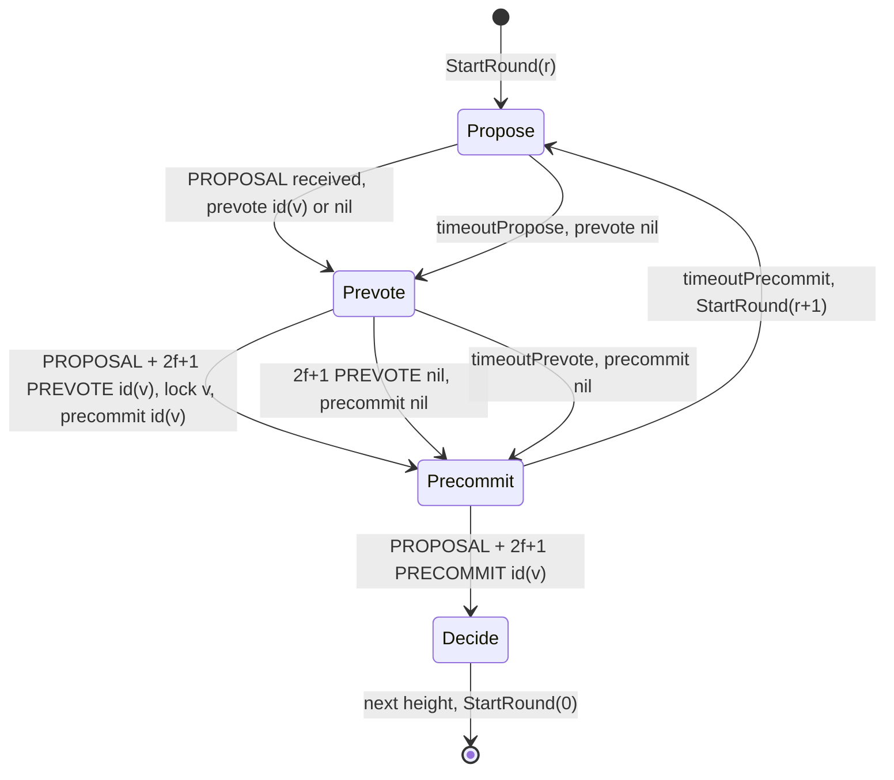
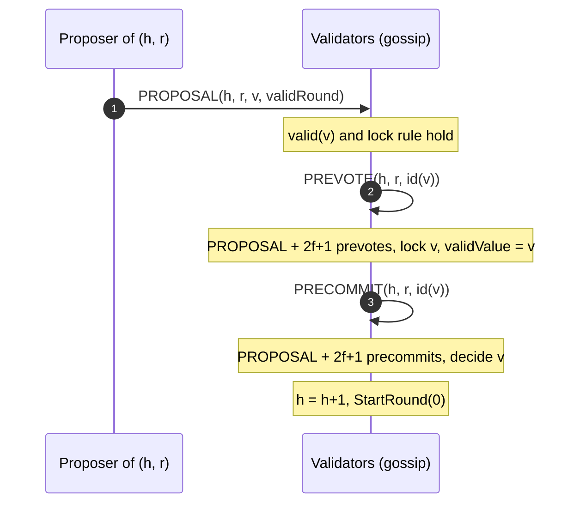

[Tendermint](https://arxiv.org/abs/1807.04938) is the Byzantine fault-tolerant (BFT) consensus algorithm at the core of the Tendermint platform, now maintained as [CometBFT](https://github.com/cometbft/cometbft), which orders the blocks of the Cosmos ecosystem chains. The paper *The latest gossip on BFT consensus*, by Ethan Buchman, Jae Kwon and Zarko Milosevic, describes the algorithm and proves it correct for a network of validators that are weighted by voting power and that communicate through a peer-to-peer gossip layer rather than direct links.

Tendermint keeps the communication pattern of PBFT: a proposal followed by two rounds of votes, *prevote* and *precommit*. What it changes is how the protocol recovers after a failed round. A PBFT-style leader proves the safety of its proposal by attaching signed messages from a quorum, which grows with the number of validators. A Tendermint proposer attaches nothing. It re-proposes the most recent value that it saw collect a quorum of prevotes, and the gossip layer guarantees that, after the network stabilises, every correct validator has seen that same evidence within a bounded delay.

This article reads version 3 of the paper (arXiv 1807.04938v3, November 2019): the system model and the gossip property, the consensus problem it solves, Algorithm 1 rule by rule, the termination mechanism built on `validValue` and `validRound`, the safety and liveness proofs, and how the design compares with [HotStuff]({{site.url_complet}}/2026/10/01/hotstuff-bft-consensus/), which was published the same year with the opposite trade-off.

> This article has been made with the help of [Claude Code](https://claude.com/product/claude-code) and several custom skills

[TOC]

## Why a new BFT algorithm for blockchains

### From data centres to wide-area validator sets

State machine replication (SMR) replicates a service by making every replica start in the same state and execute the same requests in the same order. Classic deployments, such as Google's Chubby lock service, run three to seven replicas in one data centre under one administration, and tolerate crashes only.

Blockchains change four assumptions at once:

- **Scale.** Hundreds or thousands of nodes instead of a handful.
- **Wide-area network.** Delays are larger and more variable than inside a data centre.
- **Mutual distrust.** Nodes belong to different organisations, so some may be malicious (Byzantine).
- **Partial connectivity.** A node is connected to a subset of peers, and messages travel through a gossip protocol rather than direct links.

The paper argues that classic BFT literature, written for the first setting, does not address the last three well, and proposes an algorithm designed around gossip.

### The termination problem in PBFT-style protocols

Partially synchronous BFT protocols must guarantee that, after the network stabilises, some round has a correct proposer whose value every correct process accepts. In PBFT and DLS, the new proposer achieves this in three steps: it collects state from other processes, selects a safe value, and broadcasts that value together with the signed messages that justify it.

The paper identifies the cost of this pattern in a gossip network. In PBFT and DLS, each process reports a set of $$2f + 1$$ signed messages, so the justification grows with the number of processes. In Fast Byzantine Paxos, each process sends the value itself, which in a blockchain is a whole block. Either way, the piggybacked justification does not scale.

Tendermint's contribution is a **termination mechanism that requires no extra messages and no piggybacked proof**. As a consequence there is a single mode of execution: no separate view-change or recovery protocol, which the authors expect to make the algorithm easier to implement correctly. The paper also notes the orthogonal route of reducing message size with signature aggregation, such as BLS signatures in SBFT, without pursuing it.

## System model

### Processes, voting power and faults

Processes are either correct or Byzantine. Each process has a *voting power*, possibly zero. The paper writes $$n$$ for the **total voting power** and $$f$$ for an upper bound on the voting power of faulty processes, and requires

$$
\begin{aligned}
n \gt 3f
\end{aligned}
$$

that is, faulty processes hold less than one third of the voting power. The algorithm is presented for $$n = 3f + 1$$. Every threshold in the algorithm, such as "$$2f + 1$$ prevotes", counts **aggregate voting power** of the senders, not the number of messages.

Messages are signed, so impersonation is impossible, and messages with invalid signatures are dropped before they reach the algorithm. Processes have local clocks to measure timeouts, and process steps are assumed to take zero time.

### Partial synchrony with a gossip property

The network model is a variant of partial synchrony (Dwork, Lynch and Stockmeyer): there is a bound $$\Delta$$ and a Global Stabilization Time (GST) such that, after GST, communication between correct processes is reliable and $$\Delta$$-timely. Neither value needs to be known for safety. Because there is no direct link between every pair of processes, a message may be forwarded by several correct processes before it arrives.

The paper adds one property that captures gossip:

- **Gossip communication.** If a correct process sends a message $$m$$ at time $$t$$, all correct processes receive $$m$$ before $$\max(t, GST) + \Delta$$. If a correct process *receives* $$m$$ at time $$t$$, all correct processes also receive it before $$\max(t, GST) + \Delta$$.

The second half is what Tendermint builds on. Anything a correct process has seen, every correct process will see within $$\Delta$$ after GST, including messages originally sent by Byzantine processes. A proposer therefore does not need to forward evidence: the evidence is already travelling.

The paper notes that the algorithm also works in a weaker model where good periods (reliable and timely) alternate with bad periods (asynchronous, messages may be lost), as long as good periods last long enough.

## The consensus problem

### State machine replication requirements

Following Schneider, a Byzantine-tolerant replicated state machine needs *replica coordination*: all non-faulty replicas receive and process the same sequence of requests. This splits into **Agreement** (every non-faulty replica receives every request) and **Order** (they receive them in the same order). Byzantine tolerance adds a third requirement: only requests that clients proposed are executed. In Tendermint, checking that a transaction is valid is the job of the replicated application, which the consensus engine queries before processing it.

### Validity-predicate-based consensus

Tendermint runs one consensus instance per block, called a **height**. Each instance solves a variant called *Validity Predicate-based Byzantine consensus*, defined by three properties:

- **Agreement.** No two correct processes decide on different values.
- **Termination.** All correct processes eventually decide on a value.
- **Validity.** A decided value satisfies an application-defined predicate `valid()`.

In a blockchain, `valid(v)` fails, for example, when block $$v$$ does not contain the hash of the previous block. Validity here is not "the decided value was proposed by a correct process" but "the decided value passes the application's checks".

## The algorithm

### Heights, rounds and proposers

Within a height, the algorithm proceeds in **rounds**. Each round has one proposer, given by a function `proposer(h, round)` known to all processes. The paper assumes a weighted round-robin: over a sequence of rounds of length $$n$$, every process is proposer in as many rounds as its voting power.

Unlike PBFT, moving to a new round is part of normal operation. A round may end without a decision because the proposer is faulty, because messages were late, or because the votes split; the next round starts with the next proposer. The paper uses "round" for a sequence of communication steps, and notes that the literature also calls it a phase or a view.

### Messages and process state

Three message types exist, each tagged with the height and round:

- **PROPOSAL** ⟨h, round, v, validRound⟩ carries the full value $$v$$ (the block) and the proposer's `validRound`.
- **PREVOTE** ⟨h, round, id(v)⟩ says the sender accepts the proposal; it carries only the identifier `id(v)`, normally a hash, or `nil`.
- **PRECOMMIT** ⟨h, round, id(v)⟩ says the sender has seen the proposal and $$2f + 1$$ matching prevotes; it also carries `id(v)` or `nil`.

Only PROPOSAL carries the block, so votes stay small whatever the block size. Each process $$p$$ keeps:

| Variable | Initial value | Meaning |
|---|---|---|
| `h_p` | 0 | current height |
| `round_p` | 0 | current round |
| `step_p` | propose | current step: propose, prevote or precommit |
| `decision_p[]` | nil | decided value per height |
| `lockedValue_p` | nil | most recent value this process precommitted |
| `lockedRound_p` | −1 | round of that precommit |
| `validValue_p` | nil | most recent *possible decision value* this process has seen |
| `validRound_p` | −1 | round in which `validValue_p` was set |

A **possible decision value** is a value $$v$$ for which a process has received, in some round $$r$$, the PROPOSAL for $$v$$ and $$2f + 1$$ PREVOTE for `id(v)`. The CometBFT documentation calls such a set of prevotes a *polka*. Only a possible decision value can ever be decided, because deciding requires $$2f + 1$$ precommits, and a correct process precommits a value only after seeing such a set of prevotes.

### One round, step by step

The paper writes Algorithm 1 as a set of `upon` rules over a local message log. A rule fires when the log contains messages whose senders' combined voting power reaches the stated threshold. When several rules are enabled, one is picked at random, and correctness does not depend on the choice.

**Propose (lines 11–21).** On `StartRound(round)`, the proposer sends a PROPOSAL. If its `validValue` is not nil, it re-proposes that value with its `validRound`; otherwise it asks the application for a new value through `getValue()`. Every other process schedules `timeoutPropose`.

**Prevote (lines 22–33).** A process in the propose step prevotes for the proposal under one of two rules:

- **Fresh proposal** (`validRound = −1`, line 22): prevote `id(v)` if `valid(v)` holds and the process is not locked (`lockedRound = −1`) or is locked on $$v$$ itself; otherwise prevote nil.
- **Re-proposal** (`validRound = vr ≥ 0` with $$vr \lt round$$, line 28): the rule also requires $$2f + 1$$ PREVOTE for `id(v)` from round $$vr$$ in the log, which proves $$v$$ was a possible decision value in $$vr$$. The process prevotes `id(v)` if `valid(v)` holds and either its lock is not more recent than $$vr$$ (`lockedRound ≤ vr`) or it is locked on $$v$$.

If `timeoutPropose` expires first, the process prevotes nil (line 57).

**Precommit (lines 34–46).** Once a process has seen $$2f + 1$$ prevotes of any kind, it schedules `timeoutPrevote`. Then:

- on the PROPOSAL for $$v$$ and $$2f + 1$$ PREVOTE for `id(v)` while in the prevote step, it **locks** ($$lockedValue \leftarrow v$$, $$lockedRound \leftarrow round$$) and precommits `id(v)`;
- in the same situation in the prevote step *or later*, it also sets `validValue ← v` and `validRound ← round`;
- on $$2f + 1$$ PREVOTE for nil, it precommits nil;
- if `timeoutPrevote` expires, it precommits nil (line 61).

**Decide (lines 47–54).** Once a process has seen $$2f + 1$$ precommits of any kind for its current round, it schedules `timeoutPrecommit`. A process decides $$v$$ when its log contains the PROPOSAL for $$v$$ and $$2f + 1$$ PRECOMMIT for `id(v)` from the **same round $$r$$, which need not be its current round**, and `valid(v)` holds. It then increments the height, resets the lock and valid variables and the message log, and starts round 0 of the next height. If `timeoutPrecommit` expires without a decision, the process starts the next round (line 65).

**Round skipping (line 55).** On receiving any messages from a higher round whose senders hold $$f + 1$$ voting power, a process jumps directly to that round. At least one correct process is already there, so the jump cannot be driven by Byzantine processes alone.

In the best case (correct proposer, timely network), a decision takes three communication steps, the same as the normal case of PBFT: proposal, prevotes, precommits.

### Timeouts

The three timeouts serve three purposes: they stop a process from waiting forever, they keep processes moving from round to round, and, because they grow, they eventually exceed the actual network delay after GST. Each grows linearly with the round and is reset at each new height:

$$
\begin{aligned}
\text{timeoutX}(r) = \text{initTimeoutX} + r \cdot \text{timeoutDelta}
\end{aligned}
$$

The liveness proof needs `timeoutPrevote` and `timeoutPrecommit` greater than $$2\Delta$$, and `timeoutPropose(r)` greater than $$2\Delta$$ plus `timeoutPrecommit(r − 1)`. Linear growth reaches these bounds after a finite number of rounds, whatever the unknown $$\Delta$$.

## The termination mechanism

### The problem it solves

Locking makes the protocol safe but creates a liveness risk. Suppose a correct process locked $$v$$ in round $$r$$, and the next proposer, unaware of it, proposes a different value. The locked process refuses, and if enough voting power is locked on different values, no proposal gathers $$2f + 1$$ prevotes. PBFT breaks this with a proof collected from a quorum. Tendermint uses `validValue` and `validRound` instead.

### How `validValue` and `validRound` break the deadlock

The mechanism has three parts:

- **Recording.** A process sets `validValue` and `validRound` whenever it sees a possible decision value, even if it does not lock it, for instance because it already moved to the precommit step (line 36).
- **Re-proposing.** A correct proposer proposes its `validValue` and announces `validRound`, instead of a fresh value.
- **Accepting.** A locked process accepts a re-proposal whose `validRound` is at least its own `lockedRound` (line 29). The $$2f + 1$$ prevotes from round `validRound` that the rule requires are evidence that the newer value was a possible decision value.

Gossip turns this into a guarantee after GST. **Lemma 6** shows that if a correct process locks $$v$$ in round $$r$$ and `timeoutPrecommit(r)` exceeds $$2\Delta$$, then every correct process sets `validValue = v` and `validRound = r` before starting round $$r + 1$$. The PROPOSAL and the $$2f + 1$$ prevotes that caused the lock reach everyone within $$\Delta$$, and no correct process can leave round $$r$$ that early.

So after GST, either some correct process locked recently, in which case every correct process now holds that value as `validValue` with a `validRound` at least as high as every lock, or no correct process locked, in which case any correct process's `validValue` is acceptable to all. In both cases, the first correct proposer of a later round proposes a value every correct process accepts.

The paper's argument for why a non-deciding sequence of rounds is finite rests on one observation: at the start of every round there is a correct process $$c$$ whose `validValue` and `validRound` are acceptable to every correct process, namely the one that locked most recently (or any, if none did). The weighted round-robin eventually makes $$c$$ the proposer.

Nothing in this mechanism adds a message or a field beyond what the normal case already sends. The `validRound` integer in the PROPOSAL is the only addition, and the justifying prevotes are not forwarded by the proposer: each process already received them through gossip.

### A remark on the acceptance rule

The prose of the paper says a locked process accepts a re-proposal when $$vr \gt lockedRound$$, while the pseudocode at line 29 says $$lockedRound \leq vr$$. The two differ only when $$vr = lockedRound$$ and the locked value is not $$v$$. That case cannot occur: it would require $$2f + 1$$ prevotes for two different values in the same round, which Lemma 1 rules out. Implementations follow the pseudocode.

## Correctness proofs

### Agreement

**Lemma 1.** Any two sets of processes with voting power at least $$2f + 1$$ share at least one correct process, because with $$n = 3f + 1$$:

$$
\begin{aligned}
2(2f + 1) = n + f + 1
\end{aligned}
$$

so the two sets overlap in voting power $$f + 1$$, more than the faulty processes hold.

**Lemma 2.** If correct processes holding $$f + 1$$ voting power lock $$v$$ in round $$r_0$$, then in every later round they prevote only `id(v)` or nil. By induction: in the first later round, the lock rules forbid any other value; in subsequent rounds, a re-proposal of $$v' \neq v$$ would need $$2f + 1$$ prevotes for $$v'$$ in a round after $$r_0$$, which those processes never sent, so Lemma 1 rules it out.

**Lemma 3 (Agreement).** Let $$r_0$$ be the first round in which a correct process decides $$v$$. A decision on $$v'$$ in the same round would need two sets of $$2f + 1$$ precommits, which share a correct process that precommitted twice: impossible. A decision on $$v'$$ in a later round $$r$$ requires a correct process to precommit $$v'$$ in $$r$$, hence $$2f + 1$$ prevotes for $$v'$$ in $$r$$. But the $$2f + 1$$ precommits for $$v$$ in $$r_0$$ include $$f + 1$$ voting power of correct processes locked on $$v$$, and by Lemma 2 they prevote only $$v$$ or nil afterwards. Lemma 1 gives the contradiction.

**Lemma 4 (Validity)** follows from the `valid(v)` check before deciding.

### Termination

**Lemma 5** gives sufficient conditions for all correct processes to decide in a round $$r$$: the first correct process enters $$r$$ after GST, the proposer $$q$$ of $$r$$ is correct, every correct process has `lockedRound ≤ validRound_q`, and the timeouts satisfy the bounds above. Under these conditions, every correct process decides before $$t + 4\Delta + \text{timeoutPrecommit}(r - 1)$$, where $$t$$ is the time the first correct process entered $$r$$.

**Lemma 7 (Termination)** shows that such a round arrives within a bounded time after GST. Either no correct process locks between GST and the round of a suitable correct proposer, or the highest such lock is propagated by Lemma 6 to every correct process's `validValue`. In both cases the conditions of Lemma 5 hold in that proposer's round.

The acknowledgements of the paper credit several researchers with pointing out liveness issues in an earlier version of the algorithm. The proofs above apply to the version described here.

## Tendermint and HotStuff

The two papers appeared in 2018 and address the same leader-replacement problem with opposite choices. The [HotStuff paper]({{site.url_complet}}/2026/10/01/hotstuff-bft-consensus/) classifies Tendermint as a *Two-Chain commit rule with a delay*: two voting steps, a lock on a single quorum of prevotes, and a new proposer that sends only what it knows.

| | Tendermint | HotStuff |
|---|---|---|
| Voting steps per decision | 2 (prevote, precommit) | 3 (prepare, pre-commit, commit) |
| Communication | all-to-all over gossip | star through the leader |
| What a new proposer attaches | `validRound` only | highest QC (one threshold signature) |
| Overcoming stale locks | gossip of the prevotes behind `validValue`, bounded by timeouts above $$2\Delta$$ | third phase guarantees $$n - f$$ replies reveal the highest lock |
| Responsiveness after a failed round | no: progress waits for timeouts that must exceed the network bound | optimistic: a correct leader proceeds on $$n - f$$ replies |
| Votes per round | every process broadcasts to every process | every replica sends one vote to the leader |

Two clarifications keep the comparison fair. First, inside a round that succeeds, Tendermint moves at network speed: processes advance as soon as $$2f + 1$$ votes arrive, and timeouts only matter when something is missing. The loss of responsiveness concerns the transition after a failed round, where Lemma 5 and Lemma 6 need the timeouts to exceed $$2\Delta$$. Second, the paper itself does not use threshold signatures; with every process broadcasting its votes, the number of signatures exchanged per round grows quadratically with the number of processes, which is the $$O(n^2)$$ entry the HotStuff paper gives for Tendermint without signature aggregation.

Tendermint-family engines are still deployed. CometBFT runs the Cosmos chains, and [Malachite, the engine behind Circle's Arc L1]({{site.url_complet}}/2026/09/25/malachite-consensus-arc/), implements the same round with a proposer, prevotes, precommits and growing timeouts.

## Conclusion

Tendermint is a two-step BFT consensus algorithm for validator sets weighted by voting power, designed for a gossip network rather than direct links.

- **One mode of execution.** Every round has the same propose, prevote and precommit steps; there is no separate view-change protocol, and a failed round simply leads to the next proposer.
- **Small votes.** Only PROPOSAL carries the block; PREVOTE and PRECOMMIT carry its identifier, and a decision requires the block plus $$2f + 1$$ precommits for it from one round.
- **Safety from locks.** A correct process precommits only after seeing $$2f + 1$$ prevotes and locks the value; Lemma 1 and Lemma 2 prevent a conflicting value from gathering a quorum in a later round.
- **Termination without proofs.** `validValue` and `validRound` record the latest possible decision value, a correct proposer re-proposes it, and the gossip property guarantees that every correct process has seen the prevotes that justify it.
- **The cost is time, not messages.** Termination after GST relies on timeouts that grow linearly per round until they exceed $$2\Delta$$; HotStuff removes this wait with a third voting step.

## Annex

### Key Terms

| Term | Definition |
|------|------------|
| **Byzantine fault** | A failure in which a process deviates arbitrarily from the protocol, for instance by sending conflicting votes or staying silent. |
| **Voting power** | Weight assigned to each process; n is the total voting power and f bounds the voting power of faulty processes, with n > 3f. Every threshold counts voting power, not messages. |
| **State machine replication (SMR)** | Technique in which replicas start in the same state and execute the same requests in the same order, so their states never diverge. |
| **Agreement, Termination, Validity** | The three properties of the consensus instance: no two correct processes decide differently, every correct process eventually decides, and the decided value satisfies valid(). |
| **valid() predicate** | Application-defined check on a value, for example that a block contains the hash of the previous block; a value failing it is never prevoted or decided. |
| **Partial synchrony** | Network model with a bound Δ on message delay that holds only after an unknown Global Stabilization Time; safety holds always, termination only after it. |
| **Global Stabilization Time (GST)** | The unknown moment after which communication between correct processes is reliable and Δ-timely. |
| **Gossip communication property** | After GST, any message sent or received by a correct process reaches every correct process within Δ. |
| **Height** | One consensus instance, deciding one block; each height starts at round 0 with reset locks. |
| **Round** | A sequence of propose, prevote and precommit steps within a height, with one proposer chosen by weighted round-robin. |
| **Proposer** | The process that sends the PROPOSAL of a round; selected in proportion to its voting power. |
| **PROPOSAL, PREVOTE, PRECOMMIT** | The three message types; only PROPOSAL carries the block, the two votes carry id(v) or nil. |
| **nil vote** | A prevote or precommit for no value, sent when the proposal is invalid, conflicts with a lock, or a timeout expires. |
| **Lock (lockedValue, lockedRound)** | The value a process last precommitted and the round it did so; it restricts which proposals the process may prevote later. |
| **Possible decision value** | A value for which a process has seen the PROPOSAL and 2f + 1 PREVOTE in one round; only such a value can be decided. |
| **validValue and validRound** | The most recent possible decision value a process has seen and its round; a correct proposer re-proposes it, which is the basis of termination. |
| **Polka** | CometBFT's name for a set of 2f + 1 prevotes for the same value in one round. |
| **Round skipping** | Jumping to a higher round on receiving messages from it whose senders hold f + 1 voting power. |

### Security Implementation Checklist

The rows below derive from Algorithm 1 and its proofs, and apply to any Tendermint-family engine. Rows marked as beyond the paper concern implementation aspects that the paper's model (no crashes, fixed voting power) leaves out.

#### Voting rules

| Check | Security requirement | Failure mode if violated |
|:---:|------------|------------|
| ☐ | A process sends at most one PREVOTE and one PRECOMMIT per height and round. | Two conflicting precommits from a correct process break the intersection argument behind Agreement. |
| ☐ | A fresh proposal is prevoted only if the process is unlocked or locked on that value. | A locked process supports a conflicting value, and Lemma 2 no longer holds. |
| ☐ | A re-proposal is prevoted only with 2f + 1 PREVOTE for it from round vr in the log, vr is below the current round, and lockedRound ≤ vr or the lock is on that value. | A Byzantine proposer unlocks correct processes with a fabricated validRound. |
| ☐ | A process locks and precommits a value only after receiving its PROPOSAL and 2f + 1 PREVOTE for its id in the current round, while in the prevote step. | Precommits without a quorum of prevotes allow two values to gather precommits. |
| ☐ | validValue and validRound are updated on every possible decision value seen, including after the precommit step. | Proposers re-propose stale values and correct locks are never released, which can stall termination. |

#### Messages, identities and decisions

| Check | Security requirement | Failure mode if violated |
|:---:|------------|------------|
| ☐ | Every message is signed and the signature covers type, height, round and value id; invalid messages are dropped before the rules run. | Replayed or forged votes are counted towards a quorum. |
| ☐ | Thresholds (2f + 1, f + 1) are computed on the aggregate voting power of distinct senders, not on message counts. | One validator with many messages, or many low-power validators, satisfies a quorum they do not represent. |
| ☐ | id(v) is a collision-resistant hash of the full value. | Votes for one block are counted for another block with the same id. |
| ☐ | A decision requires the full PROPOSAL whose id matches the 2f + 1 PRECOMMIT, and valid(v) is checked before deciding. | A node commits a block it does not hold or one the application rejects. |
| ☐ | Locks, valid variables and the message log are reset only when moving to the next height. | A lock released inside a height lets a correct process vote for a conflicting value. |

#### Liveness and operation

| Check | Security requirement | Failure mode if violated |
|:---:|------------|------------|
| ☐ | timeoutPropose, timeoutPrevote and timeoutPrecommit grow with the round so that they eventually exceed 2Δ (and timeoutPropose exceeds 2Δ plus the previous timeoutPrecommit). | Lemma 5 and Lemma 6 do not apply, and rounds can fail forever after GST. |
| ☐ | A process jumps to a higher round only on f + 1 voting power of messages from that round. | Byzantine processes alone push correct processes through rounds faster than proposals can complete. |
| ☐ | The proposer function is deterministic and weighted by voting power, so every process eventually proposes. | A correct proposer holding the most recent validValue is never scheduled. |
| ☐ | The gossip layer forwards every received consensus message, including messages from faulty senders. | The Gossip communication property fails, and validValue no longer propagates within Δ. |
| ☐ | (Beyond the paper) the last signed height, round and step, and the lock, are persisted before a vote is sent. | A restarted validator signs a second, conflicting vote at the same height and round. |
| ☐ | (Beyond the paper) the voting-power distribution keeps faulty power below one third across validator-set changes. | The n > 3f assumption fails and neither safety nor liveness is guaranteed. |

## Frequently Asked Questions

**Q: What does a PREVOTE carry, and why not the block?**

It carries `id(v)`, a constant-size identifier such as a hash, or `nil`. Only the PROPOSAL carries the full value $$v$$. Blocks may contain many transactions, so sending them once per round instead of once per vote keeps the vote traffic independent of block size. The cost is that deciding requires the PROPOSAL as well as $$2f + 1$$ precommits.

**Q: Why are the thresholds expressed as voting power rather than as numbers of processes?**

Validators are weighted. The algorithm assumes the faulty processes hold less than one third of the total voting power, so every quorum must be measured in the same unit. A set of messages whose senders hold $$2f + 1$$ voting power intersects any other such set in $$f + 1$$ voting power, which includes at least one correct process. Counting messages instead would let a group of low-power validators form an apparent quorum without that intersection property.

**Q: What is the difference between `lockedValue` and `validValue`?**

`lockedValue` is the value a process last precommitted, with the round in `lockedRound`. It restricts what the process may prevote later, and it is the source of safety.

`validValue` is the most recent value for which the process saw the PROPOSAL and $$2f + 1$$ prevotes in one round, whether or not it precommitted it. It is what a correct proposer re-proposes, and it is the source of termination. A process sets both when it locks, but it can update `validValue` without locking, for example when the prevotes arrive after it has already precommitted nil.

**Q: Why does Tendermint terminate without the proposer attaching a proof, and what does it need instead?**

Three ingredients work together:

- **Gossip.** After GST, any message a correct process has received reaches every correct process within $$\Delta$$, so the prevotes that made a value a possible decision value spread on their own.
- **Timeouts above 2Δ.** No correct process leaves a round before that spread completes (Lemma 6), so all correct processes record the latest locked value as `validValue`.
- **Rotation.** The weighted round-robin eventually selects a correct proposer, who re-proposes that `validValue` with a `validRound` no lower than any lock, so every correct process prevotes it.

**Q: Why is a decision in a round $$r$$ accepted even if the process is already in a later round?**

The decision rule at line 49 matches the PROPOSAL and $$2f + 1$$ PRECOMMIT of any round $$r$$ of the current height, not only the current round. A precommit quorum is final: by Lemma 3, no other value can be decided at that height. A process that moved on because of a timeout, and later receives the late precommits, can therefore decide safely, and the gossip property guarantees it will receive them.

**Q: Compare how Tendermint and HotStuff let a new proposer overcome a stale lock, and what each pays for it.**

In Tendermint, the proposer re-proposes its `validValue` and announces `validRound`; correct processes accept it if they hold the matching prevotes and their lock is not newer. The guarantee that everyone has those prevotes comes from gossip and from timeouts larger than $$2\Delta$$, so the protocol pays in latency after a failed round, but with two voting steps.

In HotStuff, the leader collects the highest quorum certificate from $$n - f$$ replicas. A third voting step ensures that any lock is known to $$f + 1$$ correct replicas, so the leader always learns it and never waits for $$\Delta$$. HotStuff pays one extra voting step per decision, which pipelining hides in throughput.

## References

### Paper and implementations

- [The latest gossip on BFT consensus](https://arxiv.org/abs/1807.04938), Ethan Buchman, Jae Kwon, Zarko Milosevic, arXiv 1807.04938v3, November 2019
- [tendermint/tendermint](https://github.com/tendermint/tendermint), the original Go implementation referenced by the paper
- [cometbft/cometbft](https://github.com/cometbft/cometbft), the maintained fork of Tendermint Core

### Background cited by the paper

- Dwork, Lynch, Stockmeyer, *Consensus in the Presence of Partial Synchrony*, Journal of the ACM, 1988
- [Practical Byzantine Fault Tolerance](https://pmg.csail.mit.edu/papers/osdi99.pdf), Miguel Castro, Barbara Liskov, OSDI 1999
- F. B. Schneider, *Implementing fault-tolerant services using the state machine approach: a tutorial*, ACM Computing Surveys, 1990
- [SBFT: a Scalable Decentralized Trust Infrastructure for Blockchains](https://arxiv.org/abs/1804.01626), Golan Gueta et al., 2018
- [Leader/Randomization/Signature-free Byzantine Consensus for Consortium Blockchains](https://arxiv.org/abs/1702.03068), Crain, Gramoli, Larrea, Raynal, 2017 (validity-predicate consensus)

### Comparison

- [HotStuff: BFT Consensus in the Lens of Blockchain](https://arxiv.org/abs/1803.05069), Yin, Malkhi, Reiter, Golan Gueta, Abraham, 2019

### Related articles

- [HotStuff — Linear and Responsive BFT Consensus, from Basic HotStuff to the Event-Driven Pacemaker]({{site.url_complet}}/2026/10/01/hotstuff-bft-consensus/)
- [Malachite Consensus on Arc — How Circle's L1 Finalises a Block, Compared with CometBFT, HotStuff and Gasper]({{site.url_complet}}/2026/09/25/malachite-consensus-arc/)
- [Ouroboros: How Cardano Reaches Consensus with Proof of Stake]({{site.url_complet}}/2026/07/16/ouroboros-proof-of-stake/)
- [The Hyperliquid Protocol - HyperCore, HyperEVM and Onchain Perpetual Mechanics]({{site.url_complet}}/2026/09/02/hyperliquid-protocol-architecture/)
