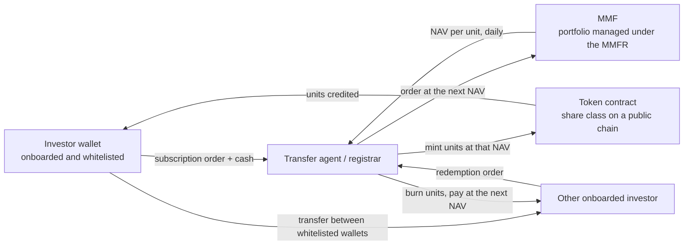
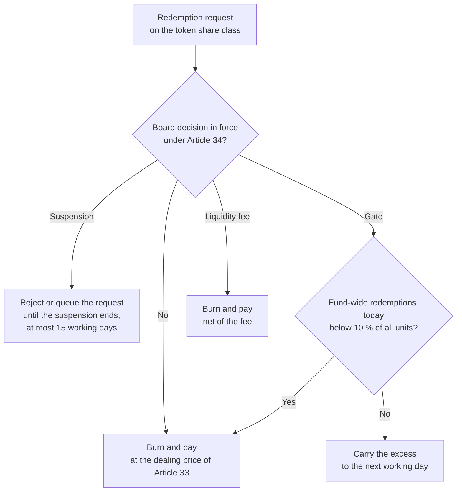

A tokenised money market fund is an ordinary money market fund (MMF) whose units, or one share class of them, are represented by tokens on a blockchain. The fund still holds treasury bills, commercial paper, deposits and repos; what changes is the register of who owns its units, and with it the way units are subscribed, redeemed and transferred. Since 2024 several EU funds have done this on public chains: [Spiko](https://www.spiko.io/)'s AMF-approved UCITS funds keep their unit register on Ethereum and other chains, [Amundi](https://www.amundi.com/institutional/article/amundi-launches-first-tokenised-share-amundi-funds-cash-eur-caceis) added a DLT share class to its Amundi Funds Cash EUR fund with CACEIS, and BlackRock opened tokenised share classes on six Irish-domiciled Institutional Cash Series funds through J.P. Morgan's Kinexys.

For a reader coming from smart contracts, the first question is which rulebook applies. The answer is not MiCA. A unit of an MMF is a financial instrument, and an MMF authorised in the Union stays under [Regulation (EU) 2017/1131](https://eur-lex.europa.eu/eli/reg/2017/1131/oj), the Money Market Fund Regulation (MMFR), whose rules on fund types, portfolio limits, valuation and liquidity tools are covered in [a previous article]({{site.url_complet}}/2026/10/01/eu-money-market-fund-regulation-2017-1131/). Those rules were written for a transfer agent and a daily dealing cut-off, and some of them translate into precise requirements on the token contract and the infrastructure around it.

This article takes the MMFR article by article from the token's point of view: the dealing price a mint or burn may use, what a pause function may and may not do, why a liquidity pool counts as one investor, which "peg" mechanisms run into the ban on external support, and what the token's front end must say. A last section looks at the reverse direction, MMF units held as stablecoin reserves under MiCA. Article numbers refer to the MMFR unless another act is named.

> This article has been made with the help of [Claude Code](https://claude.com/product/claude-code) and several custom skills

[TOC]

## Which regime applies to a tokenised MMF unit

### Not MiCA: a fund unit is a financial instrument

[MiCA](https://eur-lex.europa.eu/eli/reg/2023/1114/oj), Regulation (EU) 2023/1114, regulates crypto-assets that are not already covered by financial-services law. Its Article 2(4) lists the exclusions, and the one that applies to fund units is point (a): MiCA does not apply to crypto-assets that qualify as **financial instruments**. Units in collective investment undertakings are financial instruments under Annex I, Section C(3), of [MiFID II (Directive 2014/65/EU)](https://eur-lex.europa.eu/eli/dir/2014/65/oj), and a token that represents such a unit inherits that qualification.

Article 2(4)(c) of MiCA also excludes "funds, except if they qualify as e-money tokens". It reads like an investment-fund exclusion and is often cited as one, but MiCA defines "funds" in Article 3(1)(14) by reference to the Payment Services Directive: banknotes, coins, scriptural money and electronic money. Point (c) is about money; point (a) is the one that takes a fund unit out of MiCA. The [MiCA scope article]({{site.url_complet}}/2026/09/17/mica-explained-scope-token-categories-timeline/) covers the full list of exclusions.

### The regimes that do apply

Four bodies of law apply to a tokenised MMF, each to a different layer:

- **The MMFR** governs the fund itself: its type, portfolio, valuation, dealing price, liquidity tools, marketing statements and reporting. It applies to the whole fund, so a DLT share class follows the same rules as the conventional classes of the same fund.
- **The UCITS Directive or the AIFMD** governs the fund vehicle, the manager, the depositary and the registrar or transfer agent. An MMF is always one or the other (Art. 1(1), Art. 7).
- **MiFID II** governs the distribution of units to investors: suitability or appropriateness, investor classification and inducements. Amundi's announcement, for example, restricts the information to professional investors under MiFID II.
- **National securities law** decides whether a blockchain can be the legal register of the units. France has allowed fund units to be recorded in a shared electronic registration device (*dispositif d'enregistrement électronique partagé*, DEEP) since the 2017 "blockchain" ordinance and its 2018 implementing decree, which is the basis on which a French fund can keep its unit register on a public chain.

The [DLT Pilot Regime, Regulation (EU) 2022/858](https://eur-lex.europa.eu/eli/reg/2022/858/oj), is a fifth regime, but only for trading and settlement infrastructures. It lets authorised DLT market infrastructures admit units of UCITS whose assets under management are below EUR 500 million. A fund that keeps its register on a chain and processes subscriptions and redemptions through its own transfer agent does not need it.

### Wrappers are a different product

Some on-chain products are not MMF units at all: a third party buys MMF units and issues its own token whose value tracks them, or pays out their yield. Such a wrapper is not a share class of the fund, and it is not covered by the fund's MMF authorisation.

Its classification depends on its terms, and it may be a financial instrument in its own right, an AIF, or, if it references one currency and promises to hold a stable value, an e-money token under MiCA.

Article 6 of the MMFR adds a constraint on the fund side: only an authorised MMF may use the designation "money market fund" or suggest that it is one. The rest of this article concerns tokens that are units of an authorised MMF.

## Three architectures in the market

Public launches in the EU follow three patterns, which differ in where the legal record of ownership sits.

| Pattern | Legal register | Token | Example |
|---|---|---|---|
| **Native on-chain register** | The blockchain is the unit register (French DEEP) | The token *is* the unit | Spiko EU T-Bills and US T-Bills money market funds (French UCITS, AMF, launched June 2024), issued on Ethereum, Polygon and other chains |
| **DLT share class, hybrid fund** | The register lists the DLT share class on Ethereum; other share classes stay in the conventional register | Represents a unit of a dedicated share class | Amundi Funds Cash EUR, share class "J28 EUR DLT", with CACEIS providing wallets and the order platform; first transaction settled on 4 November 2025 |
| **Tokens mirroring the transfer-agent register** | The transfer agent's register stays authoritative | Represents an underlying fund share; the transfer agent updates its records from the chain | BlackRock Institutional Cash Series, 12 tokenised share classes on six Irish UCITS MMFs, minted on Ethereum through Kinexys by J.P. Morgan, announced August 2026 |

The pattern matters for the analysis below in one way: when the chain is the register, every transfer between wallets is a change of unitholder that the fund's registrar must be able to stand behind, so the contract itself has to enforce who may hold units. When the transfer agent's register is authoritative, the contract can be looser, but the agent must reconcile the chain with its records and refuse to recognise a holder it has not identified.

Two flows go through the token contract. Subscriptions and redemptions are dealings with the fund and go through the transfer agent at the fund's price. Transfers between investors are secondary trades in which the fund is not a party. The MMFR regulates the first flow directly and the second only indirectly, through who may be a unitholder.

## Mapping the MMFR onto the token

### Dealing price: mints and burns follow Article 33

Article 33 fixes the price at which units are issued and redeemed: the variable NAV for a VNAV fund, the constant NAV for a public debt CNAV, and for an LVNAV the constant NAV only while it stays within 20 basis points of the variable NAV. A token contract that mints and burns units is executing Article 33, so its pricing has to follow the fund's type:

- **VNAV.** Mint and burn at the variable NAV per unit calculated under Article 30, rounded to the nearest basis point, for the dealing day the order belongs to. Spiko's funds are described as short-term VNAV funds, which is why their token price drifts upward daily rather than staying at 1.00.
- **Public debt CNAV.** Mint and burn at the constant NAV, with income paid out or reinvested as additional units.
- **LVNAV.** Mint and burn at the constant NAV, but switch to the variable NAV for the next dealing as soon as the gap exceeds 20 bp. A contract that hard-codes a price of 1.00 cannot implement this; it needs the deviation as an input and a branch on it.

Secondary transfers are not dealings, so two wallets may agree any price, and the fund does not guarantee one. Article 30(3) also requires the NAV to be published daily on the public section of the fund's website. An on-chain price feed is useful to integrators but does not replace that publication.

Dealing frequency is a related constraint. The fund values its assets at least daily (Art. 29(1)), and orders are priced at a NAV calculated after they are received. A tokenised share class can accept orders around the clock, as Amundi and CACEIS describe as their objective, but it can only settle them at a NAV the fund has struck; BlackRock's tokens are minted during the fund's operating hours for that reason. An instant mint at a stale NAV would let a subscriber trade on a price the fund no longer stands behind.

### Liquidity tools: what a pause function may do

The pause function of a token contract is the obvious place to implement a redemption gate or a suspension, and the MMFR constrains it in four ways.

First, Article 34 applies only to public debt CNAV and LVNAV funds. A VNAV MMF uses the liquidity management tools of its UCITS or AIFMD regime instead, so the token of a VNAV fund cannot simply copy the Article 34 menu.

Second, the tools are triggered by the fund's **board**, after a documented assessment, when weekly liquidity falls below 30 % with net daily redemptions above 10 % of assets, or below 10 %. A role in the contract that can pause redemptions at will does not meet that condition by itself; the role must act on a board decision, and the decision must be reported to the competent authority (Art. 34(3)).

Third, the tools have numerical limits that the contract must not exceed:

| Tool | MMFR limit | Contract implication |
|---|---|---|
| Redemption gate | At most 10 % of the units redeemed per working day, for up to 15 working days | A per-day redemption cap computed on the total units of the **fund**, not of the share class |
| Suspension | Up to 15 working days | An automatic expiry, or an operational check, so a pause cannot run past the board's decision |
| Liquidity fee | Reflects the cost of liquidity, protects remaining investors | A fee parameter applied to redemptions, set by the board |
| Status loss | Suspensions totalling more than 15 days within 90 days end the CNAV or LVNAV status | A rolling 90-day record of suspension days, kept by the fund |

Fourth, the gate is a fund-level measure. The 10 % cap applies to all the fund's units, conventional and tokenised, and all investors must be treated alike: a token class that kept redeeming normally while the conventional classes were gated would favour one group of unitholders over the others.

### Investor concentration: a liquidity pool is one holder

Article 27 is a liquidity rule, not an anti-money-laundering rule. It requires the manager to anticipate concurrent redemptions from the type of investor, the size of each holding and the history of flows, and to consider correlation between investors when one holding exceeds the fund's daily liquidity requirement. Article 27(3) adds that where investors come through an intermediary, the manager must request the information it needs from that intermediary.

On a public chain, the largest holder of a share class can be a smart contract: a lending market that accepts the units as collateral, an automated market maker pool, or a vault that aggregates many end investors. To the fund each of these is one address, but its redemptions are correlated across all the users behind it and can be triggered automatically, for instance by a liquidation cascade in the lending market.

Article 27 therefore requires the manager to know which contracts hold its units, how their users can exit, and how much of the NAV they represent, and Article 27(4) requires that such a holding does not materially impact the fund's liquidity profile. A whitelist that admits contracts only after this analysis is one way to meet the rule; an open token that any contract can hold makes the analysis impossible.

Article 37 points the same way. The quarterly report to the competent authority includes, for the fund's liabilities, the country where each investor is established, the investor category and subscription and redemption activity. A manager who cannot identify the holders of a share class cannot produce that report.

### External support: the peg the fund may not have

Article 35 forbids an MMF to receive external support, defined as support from a third party, including the sponsor, that is intended to guarantee the fund's liquidity or stabilise its NAV per unit, or would have that effect. The list includes "purchase by a third party of units or shares of the MMF in order to provide liquidity to the fund" and "any action by a third party the direct or indirect objective of which is to maintain the liquidity profile and the NAV per unit or share of the MMF".

Several mechanisms common in token design come close to that list, and each needs to be checked against it:

- **An instant-redemption facility** run by the sponsor or a group entity, which buys tokens from holders with its own balance sheet so that they do not have to redeem from the fund. If its purpose or effect is to spare the fund redemptions in stress, it resembles the purchase of units "to provide liquidity to the fund".
- **A market-maker commitment** to buy the token at or near NAV on a secondary venue, financed by the sponsor. The same analysis applies, and the closer the commitment is to an unconditional floor, the closer it is to a guarantee.
- **A stable-price wrapper** issued by the sponsor that holds VNAV units and promises 1.00 per token. The fund's NAV still floats, but a sponsor absorbing the difference for investors is the kind of implicit support that Article 35(2)(d) names, and the marketing rules of Article 36 apply to anything presented as a way to hold the fund.

A secondary market made by independent firms on their own account is not external support; the prohibition targets third parties acting to protect the fund. The analysis turns on who funds the mechanism and why, which is a question for the fund's lawyers rather than for the contract, but the contract is often where the mechanism is built.

### Inside the fund: subscriptions in stablecoins

Article 9(1) lists the only assets an MMF may hold: money market instruments, eligible securitisations and ABCPs, deposits with credit institutions, hedging derivatives, repos and reverse repos, and units of other MMFs, plus ancillary liquid assets under the UCITS Directive. An e-money token is not on that list.

A stablecoin received for a subscription therefore has to be converted into a form the fund may hold, normally a cash deposit, before or as it reaches the fund. CACEIS's stated objective of subscriptions and redemptions "payable in stable coins (EMT) or central bank digital currency" is consistent with this: the payment leg can use a token while the fund's assets stay within Article 9.

Article 9(2) also forbids the fund to lend its securities, encumber its assets, or borrow or lend cash. These prohibitions concern the fund's portfolio. They do not prevent a unitholder from pledging its own tokens as collateral in a lending market, which is a transaction between the holder and a third party, but that use brings the holder back under the concentration analysis of Article 27.

### Transparency: what the front end must say

Article 36 applies to "any external document, report, statement, advertisement, letter or any other written evidence" addressed to investors. A token's name and description, a dApp interface and an explorer page maintained by the manager are all such material. They must state the MMF type and whether it is short-term or standard (Art. 36(1)), and any marketing material must say that the fund is not a guaranteed investment, that it differs from a deposit and its principal may fluctuate, that it does not rely on external support, and that the investor bears the risk of loss (Art. 36(3)).

Article 36(4) adds that no communication may suggest the investment is guaranteed. Describing a tokenised MMF as a "yield-bearing stablecoin" or "digital cash" invites the comparison the Regulation forbids, because both phrases imply a stable claim on money. The weekly information of Article 36(2) is due to all investors, including those who only interact with the fund through a wallet: maturity breakdown, credit profile, WAM and WAL, the top 10 holdings, total assets and net yield.

## The reverse direction: MMF units as stablecoin reserves

MiCA requires issuers of asset-referenced tokens, and issuers of significant e-money tokens through Article 58, to hold a reserve of assets and lets them invest part of it in "highly liquid financial instruments with minimal market risk, credit risk and concentration risk" (MiCA Art. 38(1)). Which instruments qualify is left to regulatory technical standards drafted by the EBA, and MMF units are the point of disagreement between the EBA and the Commission:

- **EBA draft, 13 June 2024.** The EBA's final draft RTS based the list on the highest-quality liquid assets of the banking liquidity coverage ratio and, as the Commission's letter describes it, treated UCITS units through a look-through approach and a 5 % concentration limit per management company.
- **Commission letter, August 2025.** The Commission returned the draft with amendments. It considers that MMFs authorised under the MMFR "should be included as HLFI", citing the Regulation's goal of a "high degree of liquidity, diversification and stability of value", excludes them from the look-through approach, subjects them to a 10 % concentration limit, and deletes the per-management-company limit.
- **EBA opinions, 10 October 2025.** The EBA answered with two opinions (EBA/Op/2025/13 and EBA/Op/2025/14) stating that the amendments are not consistent with MiCA's prudential framework, among other reasons because they classify all MMFs as highly liquid instruments while relaxing concentration and look-through limits.

Under the procedure of Article 10(1) of the EBA Regulation, the Commission may adopt the standard with the amendments it considers relevant once the EBA has given its opinion.

I could not confirm a final adoption at the time of writing; a reader relying on MMF units in a reserve should check the Official Journal for the adopted delegated regulation. Whatever its final form, the reserve rules are MiCA obligations of the stablecoin issuer, and they do not change the MMFR obligations of the fund whose units the issuer holds. A stablecoin issuer holding a large share of an MMF is exactly the kind of concentrated, correlated holder Article 27 asks the fund's manager to anticipate.

## Conclusion

A tokenised unit of an EU money market fund is a financial instrument, so it is outside MiCA (Art. 2(4)(a)) and inside the MMF Regulation, together with the UCITS or AIFMD regime of the fund, MiFID II for its distribution and national law for its register.

- **The architecture decides where control sits.** A fund that keeps its register on the chain must enforce eligible holders in the contract; a fund whose transfer agent stays authoritative must reconcile the chain with its records.
- **Mints and burns execute Article 33.** VNAV tokens deal at the variable NAV, CNAV tokens at the constant NAV, and LVNAV tokens need the 20 bp switch in their pricing logic. Orders can arrive at any time but settle only at a NAV the fund has struck.
- **A pause function is not a liquidity tool by itself.** Gates and suspensions exist only for CNAV and LVNAV funds, follow a board decision, are capped at 10 % per day and 15 working days, and apply to the whole fund.
- **Smart-contract holders are intermediaries** for Article 27 and need the same concentration analysis as any large investor, and the Article 37 report needs identified holders.
- **Sponsor-funded liquidity or price floors** are checked against the Article 35 ban on external support; independent secondary markets are not.
- **Stablecoin payments** stay on the payment leg, because an e-money token is not an eligible MMF asset.
- **The token's front end is marketing material**, subject to the Article 36 statements and the ban on suggesting a guarantee.
- **MMF units in MiCA reserves** were still disputed between the Commission and the EBA in the most recent material I could verify (October 2025).

## Annex

### Key Terms

| Term | Definition |
|------|------------|
| **Money market fund (MMF)** | A UCITS or AIF authorised under Regulation (EU) 2017/1131 that invests in short-term assets and aims at money market returns or preservation of value. |
| **Share class** | A category of units of the same fund with its own features (currency, fees, form of register); a DLT share class is one whose units are represented on a blockchain. |
| **Unit register** | The legal record of who owns the fund's units, kept by the registrar or transfer agent, or in a DEEP when national law allows it. |
| **Transfer agent** | The entity that processes subscriptions, redemptions and transfers and maintains the unit register on behalf of the fund. |
| **DEEP** | *Dispositif d'enregistrement électronique partagé*, the French legal term for a shared electronic ledger on which unlisted securities and fund units may be registered since the 2017 ordinance. |
| **Tokenised share class** | A share class whose units are minted and burned as tokens on a blockchain, either as the legal register or as a mirror of it. |
| **Wrapper token** | A token issued by a third party that holds MMF units and passes on their value or yield; not a unit of the fund. |
| **Financial instrument** | An instrument listed in Annex I, Section C, of MiFID II, including units in collective investment undertakings; excluded from MiCA by its Article 2(4)(a). |
| **Funds (MiCA)** | Money as defined in the Payment Services Directive (banknotes, coins, scriptural money, e-money), MiCA Art. 3(1)(14); not investment funds. |
| **NAV per unit** | Net asset value divided by the number of units, rounded to 1 bp; constant NAV funds also compute a NAV rounded to one percentage point. |
| **VNAV / CNAV / LVNAV** | The three MMF types: variable NAV, public debt constant NAV, and low volatility NAV with a 20 bp collar. |
| **Dealing price** | The price at which units are issued and redeemed under Article 33, which a mint or burn must use. |
| **Redemption gate** | A cap of at most 10 % of a CNAV or LVNAV fund's units redeemed per working day, for up to 15 working days (Art. 34). |
| **External support** | Third-party support that guarantees an MMF's liquidity or stabilises its NAV, prohibited by Article 35. |
| **Whitelist** | The list of wallet addresses a token contract allows to hold or receive units, used to restrict holders to onboarded investors. |
| **E-money token (EMT)** | A MiCA crypto-asset that references one official currency and is treated as electronic money; usable to pay for units but not an eligible MMF asset. |
| **Highly liquid financial instrument (HLFI)** | MiCA Art. 38 category of instruments in which part of a stablecoin reserve may be invested, specified by EBA technical standards. |
| **DLT Pilot Regime** | Regulation (EU) 2022/858, a temporary regime for DLT trading and settlement infrastructures that may admit UCITS units below EUR 500 million of assets. |

### Requirements Checklist

The checklist maps the MMFR provisions discussed above to controls on a tokenised share class. A fund is assessed only against the rows that match its type and register architecture.

| Check | # | Requirement |
|:---:|:---:|------------|
| ☐ | 6 | The token, its name and its front end use the MMF designation only for units of an authorised MMF; wrapper tokens are not presented as the fund. |
| ☐ | 9(1) | Subscriptions paid in stablecoins are converted into eligible assets, normally cash deposits, before forming part of the fund's portfolio. |
| ☐ | 9(2) | The fund does not lend, encumber or borrow against its assets through any on-chain arrangement. |
| ☐ | 27 | Smart-contract holders (lending markets, pools, vaults) are identified, their exit mechanics analysed, and their share of NAV monitored. |
| ☐ | 27(3) | Information on underlying investors is obtained from contract or platform intermediaries where needed for liquidity management. |
| ☐ | 30(3) | The NAV per unit is published daily on the fund's public website, whatever on-chain price feed exists. |
| ☐ | 33 | Mints and burns use the Article 33 dealing price for the fund type and the dealing day, never a stale NAV. |
| ☐ | 33(2) | For an LVNAV, the mint and burn logic switches to the variable NAV when the constant NAV deviates by more than 20 bp. |
| ☐ | 34(1) | Gates, suspensions and liquidity fees on the token class are applied only for CNAV or LVNAV funds and only on a documented board decision. |
| ☐ | 34(1) | Gates cap fund-wide redemptions at 10 % of all units per working day for at most 15 working days; suspensions last at most 15 working days. |
| ☐ | 34(2) | Suspension days are tracked over a rolling 90-day window across all share classes. |
| ☐ | 34(3) | Board decisions affecting the token class are reported to the competent authority. |
| ☐ | 35 | No sponsor-funded redemption facility, market-making floor or stable-price wrapper supports the fund's liquidity or NAV. |
| ☐ | 36(1) | The token's documentation and interface state the MMF type and whether it is short-term or standard. |
| ☐ | 36(3)–(4) | Marketing states non-guarantee, difference from deposits, no external support and investor loss risk, and avoids "stablecoin" or "digital cash" language. |
| ☐ | 36(2) | Weekly portfolio information is available to token holders. |
| ☐ | 37(2) | Holder identity, country and category are available for the quarterly liability report. |

## Frequently Asked Questions

**Q: Why does MiCA not apply to a tokenised MMF unit, and which exclusion is the right one?**

A unit of an MMF is a unit in a collective investment undertaking, which is a financial instrument under Annex I, Section C(3), of MiFID II. MiCA does not apply to crypto-assets that qualify as financial instruments (Art. 2(4)(a)).

The exclusion of "funds" in Article 2(4)(c) is a different one: MiCA defines "funds" by reference to the Payment Services Directive, so it covers money, not investment funds.

**Q: A token contract allows 24/7 transfers. Does that make the MMF a 24/7 dealing fund?**

No. Transfers between wallets are secondary trades in which the fund is not a party, and the MMFR does not set their price. Subscriptions and redemptions are dealings with the fund: they are priced under Article 33 at a NAV the fund has calculated, and the fund values its assets at least daily. A share class can accept orders at any time but settles them at the next NAV.

**Q: Can the operator of a tokenised LVNAV share class use the contract's pause function to stop redemptions during a market sell-off?**

Only within Article 34. The fund's board must have assessed the situation after weekly liquidity fell below the 30 % or 10 % triggers and decided on a suspension, which lasts at most 15 working days and is reported to the competent authority. The pause must apply to the whole fund, not only to the token class, and suspensions totalling more than 15 days in 90 days end the fund's LVNAV status.

A pause triggered by the operator on its own initiative, outside that procedure, has no basis in the MMFR.

**Q: A lending protocol accepts the fund's tokens as collateral and holds 8 % of the fund's NAV. What does the manager need to do?**

Under Article 27 the protocol is one holder whose redemptions are correlated across its users and can be triggered automatically by liquidations. The manager needs to:

- identify the protocol as a holder and measure its share of NAV against the fund's daily and weekly liquidity floors;
- analyse how users exit, for instance whether liquidations sell tokens on a secondary market or redeem them from the fund;
- obtain information on the underlying users where it is needed to manage liquidity (Art. 27(3)).

The manager must also ensure that the holding does not materially impact the fund's liquidity profile (Art. 27(4)).

**Q: The sponsor of a VNAV MMF offers a token that always trades at 1.00 by absorbing the NAV difference. Is this compatible with the MMFR?**

It is unlikely to be. Article 35 prohibits external support, including any explicit or implicit guarantee and any action by a third party whose objective is to maintain the NAV per unit. A sponsor that absorbs the difference between the floating NAV and 1.00 is providing the kind of support the article lists, even if the fund's own NAV is unchanged.

The token would also have to be described in a way consistent with Article 36, which forbids suggesting that an investment in the fund is guaranteed.

**Q: Can a stablecoin issuer hold tokenised MMF units in its MiCA reserve?**

It depends on the final MiCA technical standards on highly liquid financial instruments. The Commission proposed in August 2025 to include MMFs authorised under the MMFR, with a 10 % concentration limit and no look-through. The EBA objected in two opinions of 10 October 2025. The Commission may adopt the standard with its amendments, but the adopted text should be checked before relying on it.

On the fund side, a stablecoin issuer is a large, correlated holder that the MMF's manager has to account for under Article 27.

**Q: What does a register on a public chain change compared with a token that mirrors the transfer agent's register?**

When the chain is the legal register, as with a French fund using a DEEP, each transfer between wallets changes the unitholder of record, so the contract must enforce that only onboarded investors can hold units. When the transfer agent's register stays authoritative, as in BlackRock's structure, the agent reconciles the chain with its own records. In both cases the fund still needs identified holders for the Article 37 report and the Article 27 concentration analysis.

## References

### Legal texts

- [Regulation (EU) 2017/1131 on money market funds](https://eur-lex.europa.eu/eli/reg/2017/1131/oj), Articles 6, 9, 27, 30, 33 to 37
- [Regulation (EU) 2023/1114 on markets in crypto-assets (MiCA)](https://eur-lex.europa.eu/eli/reg/2023/1114/oj), Articles 2(4), 3(1)(14), 36 to 38 and 58
- [Directive 2014/65/EU (MiFID II)](https://eur-lex.europa.eu/eli/dir/2014/65/oj), Annex I, Section C(3)
- [Regulation (EU) 2022/858 on a pilot regime for market infrastructures based on distributed ledger technology](https://eur-lex.europa.eu/eli/reg/2022/858/oj)
- [The Regulation on a Pilot Regime for market infrastructures based on distributed ledger technology](https://www.amf-france.org/en/news-publications/depth/pilot-regime), AMF
- [France renders applicable the use of blockchain for certain financial securities](https://www.gide.com/en/news-insights/france-renders-applicable-the-use-of-blockchain-for-certain-financial-securities-and-confirms-its-worldwide-pioneering-legal-framework/), Gide, on the 2017 ordinance and the 2018 DEEP decree

### Supervisory documents on MiCA reserves

- [EBA, RTS to specify the highly liquid financial instruments in the reserve of assets under MiCAR](https://www.eba.europa.eu/activities/single-rulebook/regulatory-activities/asset-referenced-and-e-money-tokens-micar/regulatory-technical-standards-specify-highly-liquid-financial-instruments-reserve-assets-under)
- [European Commission letter to the EBA on the draft RTS on reserve assets](https://www.eba.europa.eu/sites/default/files/2025-10/8c0c3d6f-f841-4435-a56a-d045caf5460c/SGL%202025%20053%20(Letter%20RTS%20on%20reserve%20assets).pdf), August 2025
- [EBA responds to the Commission's proposed changes to the technical standards on liquidity requirements of the reserve of assets](https://www.eba.europa.eu/publications-and-media/press-releases/eba-responds-commissions-proposed-changes-technical-standards-liquidity-requirements-reserve-assets), 10 October 2025
- [EBA Opinion on the final draft RTS to specify the HLFI with minimal market risk, credit risk and concentration risk](https://www.eba.europa.eu/sites/default/files/2025-10/f853373b-915d-4356-8bae-5f03e5978194/Opinion%20RTS%20to%20specify%20the%20HLFI%20with%20minimal%20market%20risk%20credit%20risk%20and%20concentration%20risk.pdf)

### Market examples

- [Spiko launches the world's first tokenized Money Market Funds](https://www.spiko.io/blog/spiko-launches-the-worlds-first-tokenized-money-market-funds), Spiko, June 2024
- [euTBL — Spiko](https://docs.usual.money/resources-and-ecosystem/fact-sheets/collateral-assets/eutbl-spiko), Usual fact sheet describing the fund as a short-term VNAV UCITS MMF
- [Amundi launches first tokenised share of AMUNDI FUNDS CASH EUR with CACEIS](https://www.amundi.com/institutional/article/amundi-launches-first-tokenised-share-amundi-funds-cash-eur-caceis), Amundi
- [European Asset Manager Amundi Debuts Tokenized Share Class on Ethereum](https://www.coindesk.com/markets/2025/11/28/european-asset-manager-amundi-debuts-tokenized-share-class-on-ethereum), CoinDesk, 28 November 2025
- [BlackRock launches first European tokenized MMFs](https://www.ledgerinsights.com/blackrock-launches-first-european-tokenized-mmfs/), Ledger Insights, August 2026
- [BlackRock's first European tokenized MMFs launched on Kinexys](https://finadium.com/blackrocks-first-european-tokenized-mmfs-launched-on-kinexys/), Finadium

### Related articles

- [MiCA Explained — Scope, Token Categories and Timeline of Regulation (EU) 2023/1114]({{site.url_complet}}/2026/09/17/mica-explained-scope-token-categories-timeline/)
- [Stablecoins Under MiCA — Asset-Referenced Tokens and E-Money Tokens (Titles III and IV)]({{site.url_complet}}/2026/09/17/mica-stablecoins-asset-referenced-tokens-e-money-tokens/)
- [Two Ways to Build a Permissioned Token — Centrifuge's Transfer Hook Against ERC-3643]({{site.url_complet}}/2026/08/18/centrifuge-hook-vs-erc3643/)
- [How Centrifuge Vaults Work — Asynchronous ERC-7540 Investment on a Hub-and-Spoke Protocol]({{site.url_complet}}/2026/08/18/centrifuge-vaults/)
- [Flexible Access Control in smart contracts (CMTAT)]({{site.url_complet}}/2026/01/27/cmtat-access-control/)
