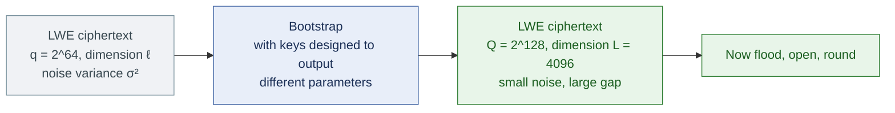

Threshold decryption is the reason nobody holds the key that could read a confidential token's balances. The method behind it has a paper, *Noah's Ark: Efficient Threshold-FHE Using Noise Flooding* by Dahl, Demmler, El Kazdadi, Meyre, Orfila, Rotaru, Smart, Tap and Walter ([eprint 2023/815](https://eprint.iacr.org/2023/815), WAHC 2023), and it has a Rust implementation, [`zama-ai/threshold-fhe`](https://github.com/zama-ai/threshold-fhe).

They are not the same thing, and the gap between them is more interesting than either one alone. The paper solves a specific problem elegantly. The repository solves that problem and then keeps going, under a different normative document, with parameters that do not match the paper's table and a masking bound that is not the paper's formula.

This article reads both: the method first, then six places where they diverge, each checked in the PDF and in the source.

> Paper read at eprint 2023/815 (33 pages). Code read at commit `c668fdd32a33270fc3ad2fd92b49267b734463dd`, 2025-08-07.

> This article has been made with the help of [Claude Code](https://claude.com/product/claude-code) and several custom skills

[TOC]

## The problem in four lines

An LWE ciphertext of a message $$m$$ under a secret key $$s$$ is a pair $$(a, b)$$ with

$$b = a \cdot s + e + \Delta \cdot m \pmod q, \qquad \Delta = \lfloor q/p \rfloor.$$

Secret-share the key as $$[s]$$ and every party can compute, locally, $$[v] = b - a\cdot[s] = [e + \Delta m]$$. Open $$[v]$$, round away the noise, and you have $$m$$ without anyone holding $$s$$.

Except that opening $$[v]$$ also reveals $$e$$, and $$e$$ together with the ciphertext and the message leaks the key. So the parties add a shared masking term $$[E]$$ and open $$[e + E + \Delta m]$$ instead. That is **noise flooding**, and it is a sandwich: too small an $$E$$ leaks $$e$$, too large an $$E$$ and the rounding returns the wrong $$m$$.

## Why TFHE breaks it

Masking $$e$$ with bound $$|e| < B$$ statistically wants $$E$$ uniform over $$[-2^{\mathsf{stat}}B,\, 2^{\mathsf{stat}}B]$$, which forces $$\Delta > 2^{\mathsf{stat}}B$$ and therefore a large modulus $$q$$. For BGV and BFV that is free: bootstrap, or add two or three levels worth 14–24 bits of gap each, and flooding works untouched.

TFHE is the awkward case, and the paper is blunt about why:

> "the only place where noise flooding is in practice a problem is when the FHE parameters are such that the noise gap is tiny, even after a bootstrapping operation is performed. This is exactly the situation in TFHE where one (usually) selects a relatively small q value (for example $$q = 2^{64}$$)."

The small modulus and small LWE dimension force post-bootstrap noise around $$2^{30}$$ just to stay secure, so the gap is too small — **"but only by tens of bits"**. That last clause is the whole paper: the deficit is small enough to engineer around.

## Two contributions

**The two-uniform analysis.** If $$E$$ is built from *at least two* uniform distributions over the flooding range rather than one, the statistical distance comes out at $$2^{-2\cdot\mathsf{stat}}$$ instead of $$2^{-\mathsf{stat}}$$. So $$\mathsf{stat} \approx 40$$ buys 80 bits, and the modulus growth the naive analysis demands is halved.

The alternative was Rényi divergence, as in [BS23] and [CSS+22], which gives smaller parameters still. The paper rejects it for a reason worth repeating, because it explains why this protocol is usable as a component:

> "the general technique of Renyi divergence is hard to apply to security problems which are inherently about distinguishing one distribution from another ... The security games presented in [CSS+22] and [BS23] do not allow such a usage."

Noah's Ark is proved in the simulation paradigm so it can be dropped into a larger protocol as a black box. That is exactly how the KMS treats it.

**Switch-n-Squash**, the operation that names the paper. Before flooding, the ciphertext is moved into a larger, protective one:



It is *just a bootstrap*, with bootstrapping keys built to emit parameters $$(L, Q)$$ instead of the input ones. It switches modulus and dimension and squashes the noise in a single pass, it requires **no interaction**, and the noise-to-modulus ratio afterwards is smaller while security holds because the dimension grew from $$\ell$$ to $$L$$. The message is carried through the flood inside a bigger vessel, which is where the ark comes from.

The paper measures it at 241–317 ms on an AWS `m6i.metal`, depending on the parameter set.

## The two protocols

| | Protocol 1, §4.1 | Protocol 2, §4.2 |
|---|---|---|
| Regime | $$\binom{n}{t}$$ small | $$\binom{n}{t}$$ large |
| Masking term | PRSS, non-interactive | shared random bits from an offline phase |
| Offline phase | **none** | generic MPC |
| Online | one round | one round |
| $$t < n/3$$ | robust, asynchronous | robust, asynchronous |
| $$t < n/2$$ | active-with-abort | active-with-abort |

In Protocol 1 the two-uniform trick is free: two PRSS contributions already are a sum of two uniforms. In Protocol 2 it is explicit, $$[E] = \left(-2^B + \sum [b_i]2^i\right) + \left(-2^B + \sum [b_i']2^i\right)$$.

Sharing is Shamir over **Galois rings**, via [ACD+19], rather than replicated sharing — because replicated share sizes grow with $$\binom{n}{t}$$, and because the natural modulus $$2^{64}$$ is not a prime, so Shamir needs the ring machinery to work at all.

## Six divergences

Everything above is in the repository. So is a good deal more, and some of it disagrees with the paper.

### 1. The paper is not the implementation's specification

This is the one that reframes all the others. The repository's normative reference is **`docs/CryptographicDocumentation.pdf`**, Zama's NIST threshold-cryptography submission, and the source comments say so throughout: *"as described in Fig. 70 of NIST document"*, `//NIST: Level Zero Operation`, *"For now NIST doc doesn't explicitly call this robust_open"*. The paper is cited once, in the README, with a careful hedge:

> "The [Noah's ark](https://eprint.iacr.org/2023/815) paper contains the technical details of **some of our protocols**"

The paper is a published account of one method. The documentation is the specification. When they differ, the code follows the documentation.

### 2. Four decryption modes, not two

```rust
// src/execution/endpoints/decryption.rs:15-25
pub enum DecryptionMode {
    /// nSmall Noise Flooding, this is the default
    #[default]
    NoiseFloodSmall,
    /// nLarge Noise Flooding
    NoiseFloodLarge,
    /// nSmall Bit Decomposition
    BitDecSmall,
    /// nLarge Bit Decomposition
    BitDecLarge,
}
```

The paper's small/large axis is there, with the deployed names `nSmall` and `nLarge`, and `NoiseFloodSmall` — Protocol 1 — is the default. But it is crossed with a second axis the paper does not contain: **bit decomposition**, which avoids flooding by doing the rounding inside a generic MPC. The README attributes it to §2.2.2 of the Cryptographic Documentation. Noah's Ark is the noise-flooding half of a two-technique framework.

### 3. The PRSS mask bound drops the $$\binom{n}{t}$$ normalisation

The paper bounds each PRF output by

$$Bd_1 = \frac{(2^{\mathsf{pow}} - 1)\cdot Bd}{\binom{n}{t}}$$

dividing by the number of sets precisely so that the sum over all of them stays within $$(2^{\mathsf{pow}}-1)\cdot Bd$$. The code does not divide:

```rust
// src/execution/small_execution/prss.rs:165
let bd1 = bd << STATSEC;
```

and its own test accepts a reconstructed mask whose magnitude *grows* with the number of sets:

```rust
// src/execution/small_execution/prss.rs:908-921
assert!(log < (STATSEC + LOG_B_SWITCH_SQUASH + 1 + log_n_choose_t));
```

With `LOG_B_SWITCH_SQUASH = 70` and `STATSEC = 40`, each draw is uniform over $$[-2^{110}, 2^{110})$$ and the total runs to roughly $$2^{121}$$ for $$\binom{13}{4} = 715$$ sets, against the paper's intended $$2^{117}$$.

**This is a re-parameterisation, not an error, and the direction matters.** A larger $$E$$ masks *better*; what it costs is noise gap, and with $$Q = 2^{128}$$ there is gap to spend. The thing to check in any deployment is the other side of the sandwich — that correctness still holds — and that check lives in the parameter sets, not in this constant.

There is no `pow` in the code at all. The paper defines it as $$\log_2|E/e|$$, *"slightly larger than stat (by an extra additive term of $$\log_2 100$$)"*, and Table 1 sets it to 47. The implementation shifts by `STATSEC = 40` and drops the slack.

### 4. The PRF is one AES block, not two

The paper instantiates $$\psi$$ with two AES calls:

$$\psi(\kappa,\mathsf{cnt}) = \left(\mathrm{AES}_\kappa(0\|\mathsf{cnt}) + 2^{128}\cdot\mathrm{AES}_\kappa(1\|\mathsf{cnt})\right) \bmod Bd_1$$

so that $$Bd_1$$ may exceed a single block. The code computes one block reduced modulo $$2\cdot Bd_1$$, refuses $$Bd_1 > 2^{126}$$, and leaves the generalisation as a comment:

```rust
// src/execution/small_execution/prf.rs:122
// TODO iterate over blocks form 0..v here if we ever need Bd1 > 2^126
```

For the deployed bound of $$2^{110}$$ one block is sufficient, so this is a simplification that the current parameters justify and that a future parameter change would invalidate.

### 5. "Small" means something much larger in the code

The paper suggests splitting the regimes when $$\binom{n}{t}$$ exceeds about 100. The implementation caps it at:

```rust
// src/execution/constants.rs
pub(crate) const PRSS_SIZE_MAX: usize = 8192;
```

Two orders of magnitude higher. The production configuration, $$n = 13$$ and $$t = 4$$, gives $$\binom{13}{4} = 715$$: **above the paper's informal cutoff for "small", comfortably below the code's.** The non-interactive protocol is being used in a regime the paper would have called large, which is a deliberate engineering choice — 715 PRF evaluations is cheap, and avoiding an offline phase is worth a great deal.

### 6. Robustness is enforced at reconstruction, not at setup

`SessionParameters::new` checks only that $$t < n$$. The $$t < n/3$$ condition the paper's robustness depends on is enforced where the shares are combined:

```rust
// src/execution/sharing/shamir.rs:250
if degree + 2 * threshold < num_parties && num_heard_from > degree + 2 * threshold
```

With `degree = t` that is exactly $$t < n/3$$. The asynchronous path adds a $$t < n/4$$ fast route with a slower fallback. The practical consequence: a session can be *constructed* with parameters the protocol cannot be robust under, and the failure surfaces later. The paper's $$t < n/2$$ abort-only regime does not appear as a configuration anywhere.

One structural bound the paper does not mention at all: party indices are embedded into the Galois ring extension, and `embed_exceptional_set` rejects an index $$\geq 2^{\text{EXTENSION\_DEGREE}}$$. A default build uses degree 4, so **$$n \leq 15$$**. The thirteen-party deployment sits just under a limit set by the algebra.

## Parameters: what matches and what does not

| Quantity | Paper, Table 1 | Code | |
|---|---|---|---|
| Input modulus $$q$$ | $$2^{64}$$ | `u64` native | match |
| Squashed modulus $$Q$$ | $$2^{128}$$ | `CiphertextModulus::<u128>::new_native()` | match |
| Squashed dimension $$L$$ | 4096 | `GlweDimension(1) × PolynomialSize(4096)` in `NIST_PARAMS_P32_SNS_LWE` | match |
| Input dimension $$\ell$$ | 777 / 870 / 1024 | **928** in `BC_PARAMS_NIGEL` | no match |
| `pow` | 47 | absent; `STATSEC = 40` used directly | no match |
| $$\mathsf{stat}$$ | ≈ 40 | `STATSEC = 40` | match |
| $$B_{\mathsf{SwitchSquash}}$$ | — | $$2^{70}$$, *"always using the upper bound"* | code only |

$$Q$$ and $$L$$ landing exactly on the paper's values is a good sign that Switch-n-Squash is the same operation. The $$\ell$$ mismatch is a different parameter-generation vintage, not a different protocol.

## What the repository has that the paper does not

Beyond bit decomposition, the code carries a system where the paper carries a method:

- **Resharing** of key shares between epochs, 758 lines, so a stolen share expires.
- **A distributed CRS ceremony** for the ZK proofs, 1382 lines, over `bls12_446`.
- **Compression and decompression keys**, dedicated compact public keys, and the matching noise bounds.
- **BGV and BFV**, but behind an `experimental` feature flag and entirely under `src/experimental/`. BFV is 198 lines with no threshold decryption of its own; the docs note it is reachable by converting to BGV. The README's "three FHE schemes" is true only through that conversion and only off the default build.
- **Production engineering**: gRPC, TLS, choreography binaries, Redis-backed preprocessing stores, OpenTelemetry tracing, versioned serialisation, memory measurement, dispute sets.

And the status note that frames all of it:

> "This repository is _not_ actively maintained. It is a snapshot intended for our submission to the NIST call for Multi-Party Threshold Cryptography ... Use at your own risk!"

**That is the most important sentence for anyone auditing it.** `threshold-fhe` is a NIST submission snapshot, not the production KMS. The code running the thirteen organisations is [`zama-ai/kms`](https://github.com/zama-ai/kms), which imports this lineage but is maintained separately. Findings here do not automatically transfer, in either direction.

Two things in the snapshot are worth knowing for that reason. `DummyPreprocessing` is scattered with `unimplemented!()` and is what the gRPC path constructs when no preprocessing session id is supplied. And `switch_and_squash.rs` carries its own modulus-switch routine, copied from an unmerged `tfhe-rs` branch:

> *"copied from the `noise-gap-exp` branch in tfhe-rs-internal (and added error handling) since this branch will likely not be merged in main."*

## Frequently Asked Questions

**Q: Is the paper still the right thing to cite?**

For the method, yes: Switch-n-Squash, the two-uniform analysis and the simulation-based proof are all there and all deployed. For what runs, cite `CryptographicDocumentation.pdf`. The repository itself makes the distinction, crediting the paper with *"some of our protocols"*.

**Q: Does the missing $$\binom{n}{t}$$ normalisation weaken security?**

Not in the direction people assume. A larger masking term hides $$e$$ better; the cost is noise gap, which is what the jump to $$Q = 2^{128}$$ provides. The question it raises is about correctness rather than privacy, and that is settled by the deployed parameter set, not by this constant. It does mean the paper's inequality cannot be applied to the code unchanged.

**Q: Why is the non-interactive protocol used at $$\binom{13}{4} = 715$$ when the paper suggests 100?**

Because the cutoff was always informal, and the cost is a one-off: `PRSS.Init()` enumerates 715 sets and each decryption evaluates a PRF per set. Compared with running a generic-MPC offline phase for every decryption, that is an easy trade.

**Q: Where does the $$n \leq 15$$ limit come from?**

From the Galois ring. Party indices are embedded as exceptional-set elements, and a degree-4 extension has $$2^4 = 16$$ of them. Building with `all_extension_degrees` raises it. Nothing in the paper mentions this; it is an artefact of the [ACD+19] machinery the implementation chose.

**Q: Is bit decomposition better than noise flooding?**

They trade differently: flooding is one round and spends noise gap, bit decomposition avoids the gap problem and spends rounds and preprocessing — `1217` triples and `64` bits per ciphertext in the code's own sizing. The default is flooding.

## Sources

- Dahl, Demmler, El Kazdadi, Meyre, Orfila, Rotaru, Smart, Tap, Walter, [*Noah's Ark: Efficient Threshold-FHE Using Noise Flooding*](https://eprint.iacr.org/2023/815), WAHC 2023
- [`zama-ai/threshold-fhe`](https://github.com/zama-ai/threshold-fhe) at `c668fdd3`, and its `docs/CryptographicDocumentation.pdf`
- Abspoel, Cramer, Damgård, Escudero, Yuan, *Efficient Information-Theoretic MPC over* $$\mathbb{Z}/p^k\mathbb{Z}$$ *via Galois Rings*, TCC 2019
- Damgård & Nielsen, *Scalable and Unconditionally Secure Multiparty Computation*, CRYPTO 2007
- Related: [the threshold KMS in production]({{site.url_complet}}/2026/09/18/zama-kms-threshold-key-management-architecture-and-operation/), [Zama and post-quantum cryptography]({{site.url_complet}}/2026/10/02/zama-post-quantum/)
