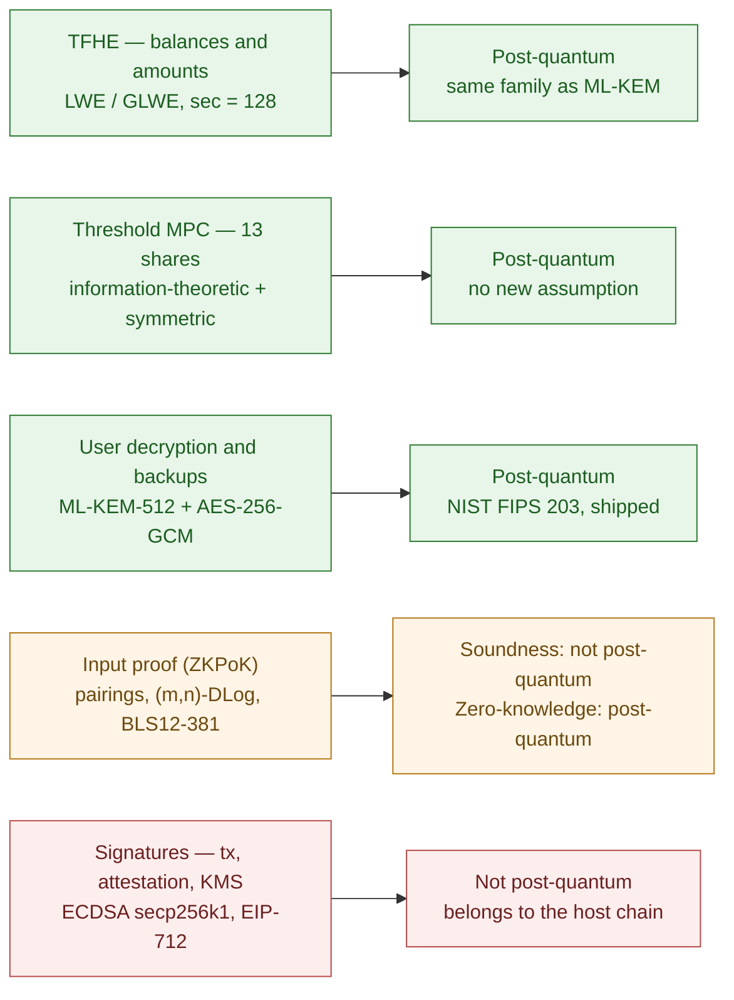

"Is it quantum-safe?" is a fair question to ask of a token whose premise is that an amount stays confidential for as long as the instrument exists. A bond issued today may still be outstanding in 2041, and the most likely thing to end that confidentiality is a cryptographically relevant quantum computer.

The Zama protocol answers it in one sentence, and the sentence is unusually precise. From the KMS Cryptographic Documentation, §6.3:

> "The only place where we utilize pre-quantum primitives is in the ZKPoKs of correct FHE encryption which are based on vector commitments. Here we utilize pairings on elliptic curves, which are not post-quantum secure."

One pairing. Everything else in the protocol proper is lattice-based, information-theoretic, or symmetric. There is a second gap underneath, which belongs to Ethereum rather than to Zama and is usually left out of the discussion.

What follows takes each component in turn, names its primitive and its assumption, and says what an adversary would actually gain by breaking it. The distinction that runs through the whole article is between **soundness** and **zero-knowledge**, or more generally between integrity and confidentiality: both gaps sit on the integrity side, which is a different problem from the one people assume when they hear "not post-quantum".

> This article has been made with the help of [Claude Code](https://claude.com/product/claude-code) and several custom skills

[TOC]

## What a quantum computer actually breaks

Two algorithms matter, and they do different damage.

**Shor's algorithm** solves integer factoring and discrete logarithms in polynomial time. That is not a speedup but a change of complexity class, and it is terminal for RSA, for elliptic-curve signatures, and for any proof system resting on a discrete-log or pairing assumption.

**Grover's algorithm** gives a quadratic speedup on unstructured search, halving the effective security of a symmetric primitive. It is answered by doubling a key length, which is why NIST's post-quantum security levels are pegged to AES-128, AES-192 and AES-256.

Lattice problems sit in neither bucket. The best classical sieving for the shortest-vector problem runs in roughly $$2^{0.292n}$$ and the best known quantum sieving in roughly $$2^{0.265n}$$: a constant-factor improvement in the exponent, not a collapse. Recent resource estimates put a dimension-400 lattice at something like $$10^{13}$$ physical qubits and $$10^{31}$$ years, with essentially no usable quantum speedup at cryptographic dimensions.

That asymmetry is why NIST's standards are lattice-based. In August 2024 it finalised **FIPS 203 (ML-KEM)** and **FIPS 204 (ML-DSA)**, both on Module-LWE, alongside **FIPS 205 (SLH-DSA)** on hash functions alone. The relevance is direct: the problem under ML-KEM is the same family as the problem under Zama's FHE.

## Component 1 — TFHE: the encryption

Every practical fully homomorphic encryption scheme is lattice-based, and Zama's is TFHE, used through TFHE-rs. A ciphertext is an LWE or GLWE sample: a random vector $$a$$ and a body $$b = \langle a, s\rangle + \Delta m + e$$, with $$s$$ the secret key, $$m$$ the message scaled by $$\Delta$$, and $$e$$ a small error. Recovering $$m$$ without $$s$$ means solving an LWE instance.

The documentation fixes the target explicitly: *"We target values of sec = 128, dst = 80 and stt = 40 in this document"* — a computational security level of 128 bits, a statistical distance parameter of 80, and 40 for the masking used in threshold decryption.

The post-quantum claim here is stronger than a vendor assertion, because it is not a claim about an implementation. It is the same hardness assumption NIST standardised twice in 2024 after an eight-year public competition. If Module-LWE falls, ML-KEM and ML-DSA fall with it, and the problem is considerably larger than one confidential token.

**What this covers:** every balance, every transfer, mint and burn amount, and the total supply.

## Component 2 — the threshold MPC: no new assumption

The private key exists only as thirteen shares. Decryption is a multi-party protocol in which each party computes a partial decryption from its own share, with noise flooding, and the parts are combined. The deployment runs $$n = 13$$ with a corruption bound $$t = 4$$, the maximum satisfying $$t < n/3$$.

The post-quantum answer for this layer is that **it introduces no new hardness assumption**. The documentation is explicit that the threshold protocols rest *"mainly on information theoretic constructions"* and lightweight symmetric primitives. Secret sharing is information-theoretic: an adversary holding four shares learns nothing regardless of computational power, quantum or otherwise. Noise flooding is a statistical argument, not a computational one.

The design went out of its way to keep it that way. Choosing the broadcast protocol, the documentation rejects Dolev-Strong partly because it would require chains of digital signatures, and notes the intent to *"base solely on lightweight cryptographic primitives such as symmetric key encryption, MACs and hash functions"*. Avoiding signatures inside the MPC is, among other things, how the layer stays post-quantum without further argument.

## Component 3 — ML-KEM, already in production

This is the part that gets left out of the summaries, and it cuts the other way: the protocol already ships NIST post-quantum cryptography, in two places.

**User decryption.** When a holder reads their own balance, each KMS party returns its share *signcrypted under the requester's key*, and the requester combines locally. That encryption is hybrid **ML-KEM-512 + AES-256-GCM**, visible in the source:

```rust
// kms/core/service/src/cryptography/hybrid_ml_kem.rs
use aes_gcm::{AeadCore, Aes256Gcm, Key, KeyInit, KeySizeUser, aead::Aead};
use ml_kem::{KemCore, kem::{Decapsulate, Encapsulate}};

pub(crate) const ML_KEM_512_CT_LENGTH: usize = 768;  // ciphertext
pub(crate) const ML_KEM_512_PK_LENGTH: usize = 800;  // encapsulation key
pub(crate) const ML_KEM_512_SK_LEN:    usize = 1632; // decapsulation key
```

The keypair a dApp creates with `instance.generateKeypair()` before a user decryption is an ML-KEM-512 keypair. The confidential path from the KMS back to the reader is therefore post-quantum end to end, and `MlKem1024` is marked deprecated, kept only for older relayer SDKs.

**Custodian backup.** The offline custodians who can help rebuild a node's share hold a post-quantum encryption key derived from a BIP39 seed phrase, and the code says why in plain terms:

```rust
// kms/core/service/src/backup/custodian.rs
/// Since the secrets should be kept safe for a long time, the
/// public key encryption scheme should be post quantum.
/// ...
/// the RSA OAEP decryption is stored on AWS KMS, the ML-KEM
/// decryption key is stored on AWS Secret Manager because post
/// quantum algorithms are not supported on AWS KMS at the moment.
```

That comment is worth reading twice. The reason the backup path carries both an RSA key and an ML-KEM key is not cryptographic conservatism, it is that the cloud HSM does not support post-quantum algorithms yet. It is a concrete picture of what a real migration looks like.

## Component 4 — the ZKPoK: the one pairing

An encrypted input is not accepted alone. It travels with a zero-knowledge proof of knowledge that the submitter knows the plaintext and encrypted it correctly. That proof is the pre-quantum piece, and the documentation describes three constructions, not one:

| Proof | Quantum status | Proof size | Deployed |
|---|---|---|---|
| Vector commitment, type 1 (pairings) | pre-quantum soundness | ~1 kB | yes |
| Vector commitment, type 2 (pairings) | pre-quantum soundness | 13 group elements, ~1 kB | yes |
| MPC-in-the-Head | **post-quantum** | *"a few thousand kilobytes"* | no |

The deployed proofs derive from Libert's work on vector commitments with proofs of smallness, and their soundness rests on a parameterised discrete-log assumption:

> "The (m, n)-Discrete Logarithm assumption is used to prove the soundness of the scheme in the random oracle model and in the algebraic group model."

> "Of course, the (m, n)-Discrete Logarithm problem does not resist quantum algorithms. A quantum adversary would actually be able to generate proofs for false statements and break the soundness of the proof system."

**The asymmetry is the important part**, and it is stated precisely:

> "All types of proof are provide post-quantum zero-knowledge, but the two based on elliptic curves are not post-quantum secure with respect to the soundness property, whereas the latter are."

So the zero-knowledge property survives a quantum adversary even for the pairing-based proofs. **A proof recorded on-chain today will not leak its plaintext to a future quantum computer.** What dies is soundness: an adversary could generate a proof for a false statement, that is, have a ciphertext accepted whose plaintext they do not know. That breaks the binding between a ciphertext, a sender and a contract. It reveals nothing.

Two details make the trade-off concrete rather than theoretical:

- **The post-quantum proof already exists.** It is not a research gap, it is a size problem: a few thousand kilobytes against **1.8 kB** for the deployed proof, which the whitepaper measures at 1.3 s proving in a browser and 130 ms verification for ten `euint64` values. A megabyte-scale proof in calldata is not a deployable artefact today.
- **The curve itself is below its nominal level.** The documentation notes BLS12-381 is *"believed to provide slightly less than 128 bits of security (between 117 and 120 bits)"*, and points at BLS12-446 to reach 128. That is a classical observation, independent of quantum anything.

One discrepancy worth flagging for anyone comparing sources. The public litepaper says the replacement will be *"a lattice-based ZK scheme that is post-quantum"*. The Cryptographic Documentation's post-quantum construction is **MPC-in-the-Head**, which is built on commitments and information-theoretic arguments rather than lattices. Both are post-quantum; they are not the same design, and the published roadmap and the technical documentation do not currently describe the same replacement.

## Component 5 — the signatures, which are not Zama's to fix

The broadest exposure is the layer nobody puts on a slide. Nothing in the protocol is reached without classical signatures:

- the transaction calling `confidentialTransfer` is authorised by **ECDSA secp256k1**, like every Ethereum transaction;
- the attestation on an encrypted input is a set of **EIP-712 ECDSA signatures** from the coprocessors, recovered on-chain by `InputVerifier` with `ECDSA.recover`;
- a public decryption result returns with **KMS EIP-712 signatures**, checked by `KMSVerifier`;
- a user decryption request is authenticated by an **EIP-712 signature** from the requester's wallet.

Shor breaks all of it. The whitepaper acknowledges the dependency: the goal is for every component to be post-quantum, *"while this is already the case for our FHE scheme and MPC protocols"*, the underlying blockchains and their signature schemes would have to follow.

And it is structurally locked in, not merely unimplemented. The EVM offers `ecrecover` and nothing else natively, and the contracts hard-code the layout: `InputVerifier` slices the `inputProof` at `65 * numSigners` bytes, which is the ECDSA signature size. The KMS side already supports ML-DSA for its own signing, but it cannot present an ML-DSA signature to a contract that can only recover secp256k1.

The practical consequence is worth stating plainly. On the day Shor is practical, an attacker who cannot read a single balance can still sign transactions as any address whose public key has been revealed, which on Ethereum means every address that has ever sent a transaction.



## The table an auditor wants

| Component | Primitive | Assumption | Post-quantum | What a break gives an adversary |
|---|---|---|---|---|
| Encryption of balances and amounts | TFHE | LWE / GLWE, lattice | **Yes** | every balance and amount, past and present |
| Threshold decryption | Shamir + noise flooding | information-theoretic | **Yes** | nothing by itself |
| User decryption transport, backups | ML-KEM-512 + AES-256-GCM | Module-LWE | **Yes** | the value returned to one reader |
| Input proof, soundness | Vector commitment, pairings on BLS12-381 | (m, n)-Discrete Log | **No** | forge a proof; submit a ciphertext whose plaintext is unknown; no read access |
| Input proof, zero-knowledge | same | — | **Yes** | nothing; proofs do not leak retroactively |
| Transaction and attestation signatures | ECDSA secp256k1, EIP-712 | elliptic-curve discrete log | **No** | sign as any address with a revealed public key; no read access |

Read the last column rather than the fourth. Two rows are not post-quantum, and **neither of them leaks an amount**.

## Harvest now, decrypt later

"Harvest now, decrypt later" means recording ciphertexts today and decrypting them once a quantum computer exists. Against TLS protected by elliptic-curve key exchange the attack works: the traffic is already captured and the key agreement will one day be breakable.

Against this protocol it does not, and the reason is now more complete than "the FHE is lattice-based". Three things an adversary could record today are all useless to them later:

- the **ciphertexts**, protected by LWE;
- the **proofs**, whose zero-knowledge property is post-quantum even though their soundness is not;
- the **signcrypted shares** returned by a user decryption, protected by ML-KEM-512.

For an instrument with a fifteen-year life, that is the difference between a confidentiality guarantee and a countdown.

The honest caveat: *not known to be solvable* is not *proven hard*. Lattice cryptography carries no proof, only an unbroken public record and NIST's judgement after eight years of analysis. A cryptanalytic advance against LWE would be a problem for the whole post-quantum stack, which is a reason for confidence in relative terms and none in absolute ones.

## What this means for a confidential security token

Three statements hold today, in the order that answers three different people:

1. **Amounts and balances are protected by post-quantum cryptography**, and recording them, or the proofs beside them, does not help a future adversary. This answers the issuer and the holder.
2. **The input proof's soundness is not post-quantum.** A break lets an attacker have a ciphertext accepted that they did not create; it does not let them read anything. A post-quantum construction exists in the documentation and is roughly a thousand times larger, which is why it is not deployed. This answers the auditor.
3. **The signature authorising a transaction is not post-quantum**, it is a property of the host chain rather than of the token, and it is the layer with the broadest blast radius. Anyone depending on long-term unforgeability needs the chain's migration plan, not Zama's. This answers the risk committee, and it is the one most often forgotten.

## Frequently Asked Questions

**Q: If the ZKPoK is not post-quantum, are balances at risk?**

No, and the documentation separates the two properties explicitly. Zero-knowledge is post-quantum for all three constructions; only the soundness of the two pairing-based ones is not. Forging a proof means having a ciphertext accepted whose plaintext the submitter does not know. It yields no plaintext.

**Q: Why not deploy the post-quantum proof that already exists?**

Size. The MPC-in-the-Head construction produces proofs *"of the order of a few thousand kilobytes"* against 1.8 kB for the deployed one. The deployed proof is also provable in 1.3 s inside a browser, which is what makes client-side encryption practical at all.

**Q: Does the thirteen-party threshold protocol add quantum exposure?**

No. Secret sharing is information-theoretic, and noise flooding is statistical. The protocol deliberately avoids signature-based broadcast inside the MPC in favour of symmetric primitives, which keeps the layer free of any computational assumption beyond the ciphertext's own.

**Q: Is any NIST post-quantum algorithm already in use?**

Yes. ML-KEM-512 (FIPS 203) with AES-256-GCM protects the shares returned by a user decryption and the custodian backup material. The ML-KEM keypair is generated client-side by the SDK before a decryption request.

**Q: What should an issuer do about the signature layer?**

Track the host chain's post-quantum plan rather than the protocol's. Account abstraction allows a different signature scheme behind an account without changing the chain's native one, which is the most likely path for anyone who needs it before the L1 moves.

**Q: Which source should I trust on the replacement proof system?**

They disagree, so cite both. The litepaper announces a lattice-based replacement; the Cryptographic Documentation presents an MPC-in-the-Head construction. Both are post-quantum, and they are different designs.

## Glossary

| Term | Meaning |
|---|---|
| **LWE / GLWE** | Learning With Errors and its generalisation: the lattice problems under TFHE, the same family as Module-LWE under ML-KEM |
| **Soundness** | The property that a proof cannot be produced for a false statement. The one that is not post-quantum here |
| **Zero-knowledge** | The property that a proof reveals nothing beyond the statement. Post-quantum here, including for the pairing-based proofs |
| **(m, n)-Discrete Log** | The parameterised assumption under the deployed proof, proven in the random oracle and algebraic group models |
| **MPC-in-the-Head** | A proof technique building a zero-knowledge argument from a simulated multi-party computation; post-quantum, and large |
| **Signcryption** | Signing and encrypting in one operation; how each KMS party returns a share to one designated reader |
| **Harvest now, decrypt later** | Recording ciphertexts today to decrypt once a quantum computer exists |

## Sources

Primary documents, read locally:

- *KMS Cryptographic Documentation*, Zama — §4.2 security levels, §4.11.3–4.11.4 the proof systems and their assumptions, §6.3 cryptographic assumptions, §7.6 the quantum status of each proof, §8.6.2 pairing curves
- *FHEVM whitepaper*, Zama — §4.1 the TFHE scheme, Table 4.2 proof timings and sizes
- [zama-ai/kms](https://github.com/zama-ai/kms) — `core/service/src/cryptography/hybrid_ml_kem.rs`, `core/service/src/backup/custodian.rs`, `core/service/src/cryptography/signcryption.rs`
- [zama-ai/fhevm](https://github.com/zama-ai/fhevm) — `host-contracts/contracts/InputVerifier.sol`, `KMSVerifier.sol`

Public references:

- [Zama Confidential Blockchain Protocol Litepaper](https://docs.zama.org/protocol/zama-protocol-litepaper)
- [Zero-knowledge proofs — TFHE-rs documentation](https://docs.zama.org/tfhe-rs/fhe-computation/advanced-features/zk-pok)
- Benoît Libert, [*Vector Commitments with Proofs of Smallness*](https://eprint.iacr.org/2023/800)
- Oded Regev, [*On Lattices, Learning with Errors, Random Linear Codes, and Cryptography*](https://cims.nyu.edu/~regev/papers/qcrypto.pdf)
- [On the practicality of quantum sieving algorithms for the shortest vector problem](https://arxiv.org/pdf/2410.13759)
- [NIST PQC Standards: FIPS 203, 204, 205](https://www.encryptionconsulting.com/nist-pqc-standards-fips-203-204-205/)

Related: [the protocol's zero-knowledge proofs]({{site.url_complet}}/2026/07/24/zero-knowledge-proofs-zama-protocol/), [the whitepaper against the implementation]({{site.url_complet}}/2026/09/18/zama-fhevm-whitepaper-vs-implementation/), [the threshold KMS]({{site.url_complet}}/2026/09/18/zama-kms-threshold-key-management-architecture-and-operation/)
