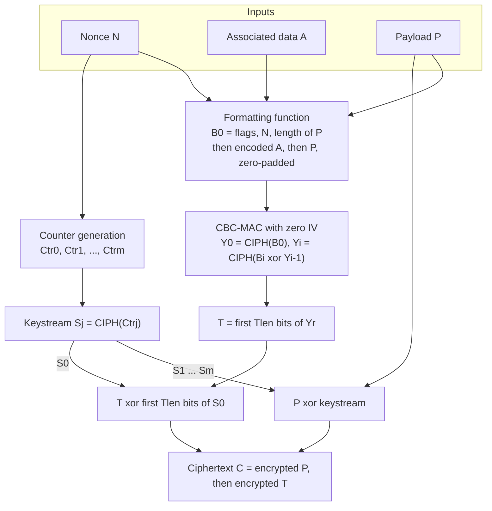
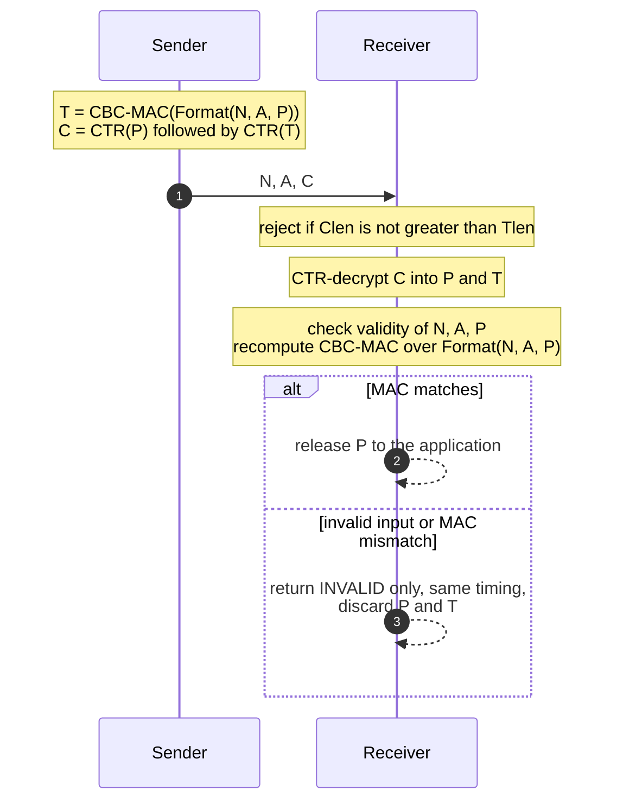

A block cipher such as AES only maps one 128-bit block to another under a key; a *mode of operation* is the algorithm that turns this primitive into something that protects messages of arbitrary length. NIST publishes these modes in the [SP 800-38 series](https://csrc.nist.gov/pubs/sp/800/38/a/final), and the third part, [SP 800-38C](https://csrc.nist.gov/pubs/sp/800/38/c/upd1/final) (May 2004, errata of July 2007), specifies CCM: *Counter with Cipher Block Chaining-Message Authentication Code*. CCM is an authenticated-encryption mode. It encrypts a payload, authenticates it together with unencrypted associated data such as a packet header, and does both with a single key and nothing but the forward direction of the block cipher.

CCM was designed by Doug Whiting, Russ Housley and Niels Ferguson for the IEEE 802.11i amendment, which turned it into the CCMP protocol of WPA2. It is also the AEAD of Bluetooth Low Energy, of IEEE 802.15.4 (as the CCM\* variant), and of two TLS 1.3 cipher suites. Its appeal is its small footprint: an implementation needs only an AES encryption core, with no field multiplier and no decryption circuit. Its cost is that it is sequential and must know the payload length before it starts.

This article walks through the specification: the two primitives it combines, the formatting function and its three security properties, the two processes step by step, the concrete encoding of Appendix A, and the guidance of Appendix B on choosing the MAC length. The four test vectors of Appendix C were re-computed from an independent implementation of the specification while writing it.

> This article has been made with the help of [Claude Code](https://claude.com/product/claude-code) and several custom skills

[TOC]

## Scope and requirements of the Recommendation

SP 800-38C is a NIST Recommendation, and its normative requirements are the sentences containing *shall*. Implementations are validated against them under the Cryptographic Module Validation Program (CMVP). The document itself is short: six pages of specification, an example encoding (Appendix A), guidance on the MAC length (Appendix B) and test vectors (Appendix C).

### What CCM protects

The inputs to CCM are three data elements:

- **The payload $$P$$**, which is both encrypted and authenticated. It may be empty, in which case CCM degenerates into a MAC over the associated data.
- **The associated data $$A$$**, which is authenticated but not encrypted, for example a header that routers must read. It may also be empty.
- **The nonce $$N$$**, a value assigned to the pair $$(P, A)$$ that must not repeat under a given key. It is not required to be random.

The output is a single ciphertext $$C$$, the encrypted payload followed by the encrypted MAC. CCM therefore expands the payload by exactly the MAC length $$T_{len}$$. The associated data is not part of $$C$$: the receiver must obtain it by other means, typically because it travels in clear next to $$C$$.

The Recommendation states the intended environment explicitly: CCM is for *packet* processing, where all the data is in memory before the mode is applied. It is not designed for stream processing or for partial processing of a message whose length is not yet known.

### Requirements on the block cipher and the key

Section 5.1 sets the following constraints:

- the block cipher shall be approved and shall have a **128-bit block**. In practice this means AES ([FIPS 197](https://csrc.nist.gov/pubs/fips/197/final)); Triple DES, with its 64-bit block, is explicitly excluded;
- the key shall be generated uniformly (or nearly uniformly) at random and kept secret;
- the key shall be used **only for CCM**;
- the total number of block cipher invocations under one key shall not exceed $$2^{61}$$.

Only the *forward cipher function* $$\mathrm{CIPH_K}$$ is ever used, for both encryption and decryption. An AES-CCM implementation never needs the AES inverse cipher.

## The two primitives inside CCM

CCM is the composition of two older mechanisms from the same family, keyed with the same $$K$$.

### Counter mode for confidentiality

Counter (CTR) mode, specified in SP 800-38A, encrypts a sequence of *counter blocks* $$\mathrm{Ctr_0}, \mathrm{Ctr_1}, \ldots$$ to produce a keystream, and XORs the keystream with the data. The counter blocks need not be secret, but they must be **distinct within one invocation and across all invocations under the key**. If two messages are encrypted with the same counter block, the XOR of the two ciphertexts equals the XOR of the two plaintexts. In CCM this requirement becomes the nonce requirement, because the counter blocks are derived from the nonce.

### CBC-MAC for authenticity

CBC-MAC runs the CBC encryption chain with an all-zero initialisation vector over the data to be authenticated, and keeps only the last output block, possibly truncated, as the MAC. Plain CBC-MAC is only secure for messages of a fixed, agreed length; with variable lengths, an attacker who knows the MACs of some messages can compute the MAC of a concatenation. CCM avoids this by putting the payload length in the very first block, so the input to CBC-MAC is prefix-free. The Recommendation is explicit that it does **not** approve CBC-MAC as a general authentication mode outside CCM; the general-purpose block-cipher MAC is CMAC, from [SP 800-38B](https://csrc.nist.gov/pubs/sp/800/38/b/upd1/final).

### Using one key for both

Reusing a key between two mechanisms is normally poor practice. CCM is safe because the formatting function separates the two uses: the first CBC-MAC input block $$B_0$$ can never equal a counter block. This is the third property of the formatting function described below, and it is what the security proof by Jakob Jonsson (SAC 2002) relies on.

## The formatting function

Before any cryptography, the triple $$(N, A, P)$$ is encoded into a sequence of complete 128-bit blocks $$B_0, B_1, \ldots, B_r$$. SP 800-38C does not fix this encoding in its main body. Instead, Section 5.4 states three properties that any formatting function shall have:

1. **$$B_0$$ uniquely determines the nonce $$N$$.**
2. **The formatted blocks uniquely determine $$P$$ and $$A$$.** Moreover, if two distinct triples share the same nonce, their formatted sequences differ in some block at an index both sequences have. This second clause covers a receiver that does not check for repeated nonces.
3. **$$B_0$$ is distinct from every counter block** used under the key, in every invocation.

The third property means that the formatting function and the counter generation function have to be designed together. A formatting function may also restrict the values it accepts; inputs that satisfy its restrictions are called *valid*. The only universal restriction is that no MAC length below 32 bits shall be valid.

Appendix A gives the one formatting and counter function that everyone uses. With it, SP 800-38C CCM matches the CCM of IEEE 802.11i and of [RFC 3610](https://datatracker.ietf.org/doc/html/rfc3610).

## The generation-encryption process

The prerequisites are fixed for a key: the block cipher, the key $$K$$, the counter generation function, the formatting function, and the MAC length $$T_{len}$$, which shall be the same for every invocation under the key. The inputs are a valid $$N$$, $$A$$ and $$P$$. The specification (Section 6.1) reads, in pseudocode:

```text
GenerationEncryption(N, A, P):
  1. B0, B1, ..., Br = Format(N, A, P)
  2. Y0 = CIPH_K(B0)
  3. for i = 1 to r:  Yi = CIPH_K(Bi XOR Y(i-1))          # CBC-MAC chain
  4. T = MSB_Tlen(Yr)                                    # truncated MAC
  5. Ctr0, Ctr1, ..., Ctrm = CounterGen(N),  m = ceil(Plen / 128)
  6. for j = 0 to m:  Sj = CIPH_K(Ctrj)
  7. S = S1 || S2 || ... || Sm
  8. return C = (P XOR MSB_Plen(S)) || (T XOR MSB_Tlen(S0))
```

The keystream block $$S_0$$ is reserved for the MAC, and the payload is encrypted with $$S_1, \ldots, S_m$$. Encrypting the MAC means an observer never sees the raw CBC-MAC value. The flow, for a message with associated data:



The order of the steps is not fixed. Section 6 notes that the counter blocks, and therefore the keystream, can be computed at any time before use, including in advance. What cannot be avoided is that the CBC-MAC chain is sequential, and that it needs $$B_0$$, which contains the length of $$P$$, before it can start.

Counting block cipher calls, one invocation costs $$r + 1$$ calls for the MAC and $$m + 1$$ for the keystream, so roughly two AES calls per 16 octets of payload. That is the price of building authenticated encryption from the block cipher alone.

## The decryption-verification process

The receiver holds $$N$$, $$A$$ and a *purported* ciphertext $$C$$ of length $$C_{len}$$, and either returns $$P$$ or the single error `INVALID` (Section 6.2):

```text
DecryptionVerification(N, A, C):
  1. if Clen <= Tlen: return INVALID
  2. Ctr0, ..., Ctrm = CounterGen(N),  m = ceil((Clen - Tlen) / 128)
  3. for j = 0 to m:  Sj = CIPH_K(Ctrj)
  4. S = S1 || ... || Sm
  5. P = MSB_(Clen-Tlen)(C) XOR MSB_(Clen-Tlen)(S)
  6. T = LSB_Tlen(C) XOR MSB_Tlen(S0)
  7. if N, A or P is not valid: return INVALID
     else B0, ..., Br = Format(N, A, P)
  8. Y0 = CIPH_K(B0)
  9. for i = 1 to r:  Yi = CIPH_K(Bi XOR Y(i-1))
 10. if T != MSB_Tlen(Yr): return INVALID  else return P
```

The receiver decrypts first, because the MAC is computed over the plaintext, and verifies second. Two rules in Section 6.2 constrain how an implementation behaves when verification fails:

- **When `INVALID` is returned, neither $$P$$ nor $$T$$ shall be revealed.** Decrypting first is unavoidable, so the plaintext exists in memory before it is authenticated; an API that streams it to the caller before step 10 breaks this rule.
- **An unauthorized party shall not be able to tell whether the error came from step 7 or step 10**, for example from the timing of the response. Distinguishing "malformed after decryption" from "MAC mismatch" would give the attacker an oracle on the decrypted content.

The step-10 comparison of $$T$$ with $$\mathrm{MSB_{Tlen}}(Y_r)$$ should also run in constant time. The Recommendation does not phrase this as a separate requirement, but a comparison that exits at the first differing byte leaks how many leading bytes of a forged MAC were correct.



Two small points about the text of the publication itself. Step 9 of Section 6.2 is printed as $$Y_j = \mathrm{CIPH_K}(B_i \oplus Y_{i-1})$$; the index of $$Y$$ should be $$i$$, as in step 3 of Section 6.1. And the 2007 errata update corrected only the formatted-data value $$B$$ in Example 4 of Appendix C, by adding its two final lines.

## Appendix A: the standard encoding

Appendix A requires every input to be an octet string and works with octet lengths: $$n$$ for the nonce, $$a$$ for the associated data, $$p$$ for the payload and $$t$$ for the MAC. A further parameter $$q$$ is the number of octets used to write $$p$$ inside $$B_0$$.

### Length parameters

The encoding imposes:

- $$t \in \{4, 6, 8, 10, 12, 14, 16\}$$;
- $$q \in \{2, 3, \ldots, 8\}$$;
- $$n \in \{7, 8, \ldots, 13\}$$;
- $$n + q = 15$$;
- $$a \lt 2^{64}$$.

The constraint $$n + q = 15$$ is the central trade-off of CCM. The nonce and the payload length share the 15 octets of $$B_0$$ that follow the flags octet, so every octet given to the nonce is taken from the length field. A large $$q$$ allows long messages but leaves a short nonce, which limits the number of messages per key to $$2^{8n}$$; a long nonce limits each message to fewer than $$2^{8q}$$ octets.

| Nonce length $$n$$ | $$q$$ | Maximum payload | Typical use |
|:---:|:---:|---|---|
| 13 | 2 | 65,535 octets | IEEE 802.11i CCMP, Bluetooth LE, IEEE 802.15.4 |
| 12 | 3 | about 16 MiB | [RFC 5116](https://datatracker.ietf.org/doc/html/rfc5116) `AEAD_AES_128_CCM`, TLS |
| 11 | 4 | about 4 GiB | |
| 7 | 8 | $$2^{64} - 1$$ octets in principle, capped by the $$2^{61}$$ call limit | |

### The first block B0

$$B_0$$ consists of a flags octet, then $$N$$, then $$Q = [p\rbrack_{8q}$$, the payload length written in $$q$$ octets:

| Octet | 0 | 1 … 15−q | 16−q … 15 |
|---|---|---|---|
| Content | Flags | $$N$$ | $$Q$$ |

The flags octet packs four fields:

| Bit | 7 | 6 | 5 4 3 | 2 1 0 |
|---|---|---|---|---|
| Content | Reserved (0) | Adata | $$[(t-2)/2\rbrack_3$$ | $$[q-1\rbrack_3$$ |

`Adata` is 1 when $$a \gt 0$$. Neither 3-bit field can be `000` for a permitted value: the smallest MAC, $$t = 4$$, encodes as `001`, and the smallest $$q$$, 2, also as `001`.

The publication decodes one $$B_0$$ in full. Its first octet is `0x6E` = `01101110`: Reserved 0, Adata 1, $$t$$ field `101` so $$t = 2 \cdot 5 + 2 = 12$$, and $$q$$ field `110` so $$q = 7$$. Hence $$n = 8$$, and the last seven octets `00 00 00 00 00 44 01` give a payload of $$0x4401 = 17{,}409$$ octets.

### The associated data blocks

When $$a \gt 0$$, the length $$a$$ is encoded with a variable-size prefix, followed by $$A$$, and the whole string is zero-padded to a multiple of 16 octets. These blocks form $$B_1, \ldots, B_u$$:

| Range of $$a$$ | Encoding | Size |
|---|---|---|
| $$0 \lt a \lt 2^{16} - 2^8$$ | $$[a\rbrack_{16}$$ | 2 octets |
| $$2^{16} - 2^8 \leq a \lt 2^{32}$$ | `0xFF 0xFE` followed by $$[a\rbrack_{32}$$ | 6 octets |
| $$2^{32} \leq a \lt 2^{64}$$ | `0xFF 0xFF` followed by $$[a\rbrack_{64}$$ | 10 octets |

The bound $$2^{16} - 2^8 = 65{,}280$$ keeps the two-octet form below `0xFF00`, so a decoder can always tell the three forms apart from the first two octets. The prefixes `0xFF00` to `0xFFFD` are reserved.

### The payload blocks

The payload follows, zero-padded to complete blocks $$B_{u+1}, \ldots, B_r$$, with $$r = u + \lceil p/16 \rceil$$. The padding is not ambiguous because $$p$$ is already fixed by $$B_0$$.

### The counter blocks

The counter generation function formats the index $$i$$ into a block:

| Octet | 0 | 1 … 15−q | 16−q … 15 |
|---|---|---|---|
| Content | Flags | $$N$$ | $$[i\rbrack_{8q}$$ |

with a flags octet whose bits 7 and 6 are reserved (0), bits 5 to 3 are **always** `000`, and bits 2 to 0 hold the same $$[q-1\rbrack_3$$ as $$B_0$$.

This is how the third property of the formatting function is met. Bits 5 to 3 of $$B_0$$ encode $$t$$ and are never `000`, while those of every counter block are `000`, so $$B_0$$ never collides with a counter block, whatever the nonce. Distinctness *across* invocations comes from the nonce: two messages with different nonces have disjoint counter blocks. The index runs within the $$q$$-octet field, which is why the payload limit and the counter range are the same quantity.

In Example 1 of Appendix C ($$n = 7$$, so $$q = 8$$), $$\mathrm{Ctr_0}$$ starts with the flags octet `0x07`, and $$B_0$$ with `0x4F`: Adata 1, $$t = 4$$ (field `001`), $$q = 8$$ (field `111`).

## Appendix B: choosing the MAC length

### What a successful verification means

Appendix B frames CCM authentication as the *scarcity of ciphertexts*. For a fixed key, nonce and associated data, only a tiny fraction of bit strings are valid ciphertexts, so a party without the key is unlikely to produce one. When decryption-verification returns `INVALID`, the payload and associated data cannot both be authentic. When it returns $$P$$, the assurance is probabilistic: for a single forged input with given $$N$$ and $$A$$, the probability that it passes is at most $$2^{-T_{len}}$$. An attacker who submits many forgeries multiplies their chances accordingly.

The appendix adds two limits of what a MAC can do:

- **The content of an accepted payload is not extra evidence of authenticity.** If the receiver can be induced to reuse a nonce, an attacker holding one valid ciphertext and its plaintext can flip chosen bits of the ciphertext and so control every bit of the decrypted payload. The appendix credits this observation to [Rogaway and Wagner's *A Critique of CCM*](https://eprint.iacr.org/2003/070).
- **CCM has no replay protection.** A legitimate ciphertext captured and resubmitted later verifies again. The controlling protocol has to detect replayed, reordered and missing messages, for example with sequence numbers, as CCMP does with its packet number.

### The MaxErrs / Risk bound

Section B.2 turns this into a selection rule. Let **Risk** be the highest acceptable probability that one inauthentic message is accepted, and **MaxErrs** the number of `INVALID` outputs, summed over all implementations under the key, after which the key is retired. Then $$T_{len}$$ should satisfy:

$$
\begin{aligned}
T_{len} \geq \log_2\left(\frac{\text{MaxErrs}}{\text{Risk}}\right)
\end{aligned}
$$

The publication's two examples:

| MaxErrs | Risk | Minimum $$T_{len}$$ |
|---|---|---|
| $$2^{10}$$ (1,024 failures, then rekey) | $$2^{-20}$$ (about one in a million) | 30, so the minimum allowed 32 |
| $$2^{32}$$ | $$2^{-32}$$ | 64 |

The normative rule follows: although Appendix A allows any multiple of 16 bits from 32 to 128, a $$T_{len}$$ below 64 **shall not** be used without a careful analysis of the risk of accepting forgeries, and should only be used when the protocol bounds the number of failed verifications, through short sessions or a low-bandwidth channel for instance. Even with larger tags, the protocol should limit the number of forgery attempts in proportion to the value of the data.

This is the context of the short-tag deployments. CCMP uses an 8-octet MIC, Bluetooth LE a 4-octet one, and TLS 1.3 defines `TLS_AES_128_CCM_8_SHA256` next to the 16-octet `TLS_AES_128_CCM_SHA256` in [RFC 8446](https://datatracker.ietf.org/doc/html/rfc8446). An 8-octet tag gives a forgery probability of $$2^{-64}$$ per attempt; that is acceptable for link-layer frames and much less so for a channel where an attacker can submit forgeries without limit.

## Appendix C: test vectors

Appendix C gives four encryption examples, all with AES-128 and the key `40414243 44454647 48494a4b 4c4d4e4f`. Each one changes the parameters together, so the set covers four MAC lengths, four nonce lengths and a large associated data string:

| Example | $$T_{len}$$ | $$N_{len}$$ | $$A_{len}$$ | $$P_{len}$$ | Ciphertext $$C$$ (hex) |
|:---:|:---:|:---:|:---:|:---:|---|
| 1 | 32 | 56 | 64 | 32 | `7162015b 4dac255d` |
| 2 | 48 | 64 | 128 | 128 | `d2a1f0e0 … 1fc64fbf accd` |
| 3 | 64 | 96 | 160 | 192 | `e3b201a9 … c1b09951` |
| 4 | 112 | 104 | 524,288 | 256 | `69915dad … ea5b` |

Example 4 exercises the six-octet length encoding, because $$a = 65{,}536 \geq 2^{16} - 2^8$$: its $$B_1$$ starts with `fffe 00010000`. All four ciphertexts, together with the intermediate MACs and counter blocks, were reproduced while writing this article with an implementation written directly from Sections 6.1 and A.2, and cross-checked against the AES-CCM of the PyCryptodome library. Example 1, written out:

```text
K    = 40414243 44454647 48494a4b 4c4d4e4f
N    = 10111213 141516                       (n = 7, so q = 8)
A    = 00010203 04050607
P    = 20212223
B0   = 4f101112 13141516 00000000 00000004   (flags 0x4F, p = 4)
B1   = 00080001 02030405 06070000 00000000   (a = 8, then A, zero padding)
B2   = 20212223 00000000 00000000 00000000   (P, zero padding)
T    = 6084341b
Ctr0 = 07101112 13141516 00000000 00000000
S0   = 2d281146 10676c26 32bad748 559a679a
C    = 7162015b | 4dac255d                    (P xor S1 | T xor S0)
```

## Security properties and limitations

### Nonce uniqueness is the critical requirement

Under one key, every pair $$(P, A)$$ needs its own nonce. If a nonce repeats, the counter blocks repeat, the two payloads are encrypted under the same keystream, and their XOR is exposed. The MAC is also encrypted with the same $$S_0$$, so the XOR of the two MACs is exposed. A repeated nonce therefore destroys confidentiality outright.

On the authentication side the damage is more contained than in [GCM (SP 800-38D)](https://csrc.nist.gov/pubs/sp/800/38/d/final), where a repeated nonce lets an attacker solve for the hash subkey $$H$$ and forge at will; no comparable key-recovery shortcut is known for CCM. Even so, Jonsson's proof no longer applies once nonces repeat, and CCM is not a nonce-misuse-resistant mode.

The nonce need not be random. A counter, or a packet number concatenated with a sender address as in CCMP, is the usual construction, and with short nonces it is the only safe one: a random 7-octet nonce collides after about $$2^{28}$$ messages by the birthday bound.

### What the proof gives

Jonsson's analysis shows that CCM provides confidentiality and authenticity as long as AES behaves as a pseudorandom permutation and nonces do not repeat, with a security loss that grows with the total number of blocks processed under the key. The $$2^{61}$$ invocation limit in Section 5.1 keeps that loss small.

### The criticisms

Rogaway and Wagner's 2003 critique accepted the security proof and objected to the efficiency and usability of the design. The main points:

- **Not on-line.** The payload length is in $$B_0$$, so a sender cannot start the MAC before knowing the full message length. This is the packet-only restriction stated in the Recommendation.
- **No parallelism and no precomputation on the MAC side.** CBC-MAC is a strict chain, and static associated data cannot be processed once and reused, because it is placed after the length-dependent $$B_0$$.
- **Two block cipher calls per block,** against roughly one for GCM or OCB.
- **The $$n + q = 15$$ trade-off** and the length encodings complicate interoperability between protocols that choose different parameters.

These objections motivated EAX, which keeps the same "AES only" property without the length-first restriction. CCM nevertheless stayed in the standards where it was already embedded, because on constrained hardware the cost that matters is often gates and code size rather than cycles per byte.

### CCM next to GCM

| | CCM (SP 800-38C) | GCM (SP 800-38D) |
|---|---|---|
| Block cipher calls per 16-octet block | about 2 | about 1, plus a GHASH multiplication |
| Extra primitive | none | multiplication in GF($$2^{128}$$) |
| Parallelisable | keystream yes, MAC no | yes |
| Length known in advance | required | not required |
| Effect of a repeated nonce | confidentiality lost, no known key recovery | confidentiality lost, hash subkey recoverable |
| Typical deployment | Wi-Fi CCMP, Bluetooth LE, 802.15.4, IoT TLS | TLS, IPsec, SSH, storage |

### Current status

The NIST CSRC page for SP 800-38C states that NIST has decided to revise the publication. The text analysed here is the May 2004 version with its 2007 errata, which remains the current one at the time of writing.

## Conclusion

SP 800-38C specifies CCM as a CBC-MAC over a carefully formatted encoding of $$(N, A, P)$$, followed by counter-mode encryption of the payload and of the MAC, both under one AES key and using only the forward cipher.

- **The formatting function carries the security argument.** $$B_0$$ fixes the nonce and the payload length, which makes the CBC-MAC input prefix-free, and its flags octet guarantees that $$B_0$$ never equals a counter block, which is what allows a single key for both mechanisms.
- **The Appendix A encoding** fixes octet-aligned inputs, $$n + q = 15$$, an even MAC length from 4 to 16 octets, and a three-form length prefix for the associated data.
- **Decryption-verification** must withhold the plaintext until the MAC has been checked and must not reveal which check failed.
- **The MAC length** follows $$T_{len} \geq \log_2(\text{MaxErrs}/\text{Risk})$$, and values below 64 bits require a bounded number of failed verifications.
- **The nonce** must never repeat under a key; CCM itself provides no replay protection.

The design is sequential and requires the message length in advance. In exchange, it needs nothing beyond an AES encryption core, which is why it remains the authenticated encryption of Wi-Fi, Bluetooth LE and IEEE 802.15.4.


## Annex

### Key Terms

| Term | Definition |
|------|------------|
| **Block cipher** | A keyed family of permutations on fixed-length bit strings; CCM requires one with a 128-bit block, in practice AES. |
| **Forward cipher function** | The direction of the block cipher used by CCM, written CIPH_K; the inverse cipher is never needed. |
| **Mode of operation** | An algorithm that uses a block cipher to protect data longer than one block. |
| **Authenticated encryption (AEAD)** | A scheme providing confidentiality and authenticity together, with optional associated data that is authenticated only. |
| **Payload** | The data that CCM both encrypts and authenticates, denoted P. |
| **Associated data** | Data that CCM authenticates but does not encrypt, such as a header, denoted A. |
| **Nonce** | A value assigned to each (P, A) pair that must not repeat under a key; in CCM it need not be random. |
| **Message authentication code (MAC)** | A keyed checksum that detects intentional as well as accidental modification; in CCM it is T, of length Tlen bits. |
| **Counter (CTR) mode** | Encryption by XOR with the block cipher output on a sequence of distinct counter blocks. |
| **CBC-MAC** | The last block of a CBC encryption chain with a zero IV, used as a MAC; secure in CCM because its input is prefix-free. |
| **Formatting function** | The function that encodes (N, A, P) into blocks B0 to Br; it must satisfy the three properties of Section 5.4. |
| **B0** | The first formatted block, holding the flags octet, the nonce and the payload length Q. |
| **Flags octet** | The first octet of B0 or of a counter block; it encodes Adata, t and q in B0, and only q in counter blocks. |
| **Counter block Ctr_i** | A block made of a flags octet, the nonce and the index i; Ctr0 encrypts the MAC, the others the payload. |
| **q and n** | The octet lengths of the payload-length field and of the nonce, bound by n + q = 15. |
| **Generation-encryption** | The CCM process that computes the MAC and encrypts payload and MAC into the ciphertext C. |
| **Decryption-verification** | The CCM process that decrypts C, recomputes the MAC and returns P or INVALID. |
| **MaxErrs and Risk** | The number of INVALID outputs tolerated before rekeying, and the acceptable forgery probability; together they bound Tlen. |
| **CCMP** | The IEEE 802.11i (WPA2) protocol built on AES-CCM with a 13-octet nonce and an 8-octet MIC. |
| **CCM\*** | The IEEE 802.15.4 variant of CCM that also allows encryption-only and authentication-only security levels. |

### Requirements Checklist

SP 800-38C states its normative requirements with the word *shall*; an implementation validated under the CMVP is assessed against all of them, and against the Appendix A requirements when it uses that formatting function.

#### Section 5: preliminaries

| Check | # | Requirement |
|:---:|:---:|------------|
| ☐ | 5.1-a | The underlying block cipher is an approved algorithm. |
| ☐ | 5.1-b | The key is generated uniformly, or nearly uniformly, at random. |
| ☐ | 5.1-c | The key is kept secret and is used only for CCM. |
| ☐ | 5.1-d | The total number of block cipher invocations under one key is limited to 2^61. |
| ☐ | 5.1-e | The block cipher has a 128-bit block size. |
| ☐ | 5.3-a | Distinct (P, A) pairs under the same key are assigned distinct nonces for the key's lifetime. |
| ☐ | 5.3-b | Tlen is fixed for all invocations of CCM under a given key. |
| ☐ | 5.4-a | The formatting function produces a non-empty sequence of complete blocks B0 to Br. |
| ☐ | 5.4-b | B0 uniquely determines the nonce. |
| ☐ | 5.4-c | The formatted data uniquely determines P and A, and distinct triples with the same nonce differ in some common block index. |
| ☐ | 5.4-d | B0 is distinct from every counter block used in every invocation under the key. |
| ☐ | 5.4-e | No Tlen smaller than 32 bits is accepted as valid. |

#### Section 6: CCM processes

| Check | # | Requirement |
|:---:|:---:|------------|
| ☐ | 6-a | The prerequisites and inputs of both processes meet the requirements of Section 5. |
| ☐ | 6.2-a | When INVALID is returned, the decrypted payload P and the MAC T are not revealed. |
| ☐ | 6.2-b | An unauthorized party cannot distinguish an error at step 7 (invalid input) from one at step 10 (MAC mismatch), including by timing. |

#### Appendix A: formatting and counter generation

| Check | # | Requirement |
|:---:|:---:|------------|
| ☐ | A.1-a | N, A and P are octet strings. |
| ☐ | A.1-b | t ∈ {4, 6, ..., 16}, q ∈ {2, ..., 8}, n ∈ {7, ..., 13}, n + q = 15 and a < 2^64. |
| ☐ | A.2.1 | The Reserved bit of the B0 flags octet is 0. |
| ☐ | A.3-a | The Reserved bits (7 and 6) of the counter-block flags octet are 0. |
| ☐ | A.3-b | Bits 5 to 3 of the counter-block flags octet are 0, so counter blocks differ from B0. |

#### Appendix B: MAC length

| Check | # | Requirement |
|:---:|:---:|------------|
| ☐ | B.2 | A Tlen below 64 bits is not used without a careful analysis of the risk of accepting inauthentic data. |

### Security Implementation Checklist

#### Keys and nonces

| Check | Security requirement | Failure mode if violated |
|:---:|------------|------------|
| ☐ | The AES key comes from a CSPRNG or an approved key-establishment scheme and is never shared with another mode or purpose. | A weak key is guessable; a key shared with plain CBC or CTR breaks the domain separation the CCM proof relies on. |
| ☐ | Nonces are generated deterministically (counter, sequence number, sender identity plus counter) and are never reused under a key, including after a reboot or state rollback. | A repeated nonce reuses the keystream and exposes the XOR of two payloads and of two MACs. |
| ☐ | Random nonces are used only when n is large enough that a collision over the key's lifetime is negligible. | A 7- or 8-octet random nonce collides after about 2^28 or 2^32 messages. |
| ☐ | The key is retired before 2^61 block cipher calls, and before MaxErrs failed verifications. | Past these limits the security bound of the mode no longer holds. |

#### Formatting and parameters

| Check | Security requirement | Failure mode if violated |
|:---:|------------|------------|
| ☐ | Tlen is fixed per key and both sides reject any other length. | Accepting several tag lengths under one key lets an attacker work against the shortest. |
| ☐ | Tlen is at least 64 bits unless the protocol bounds failed verifications; it satisfies Tlen ≥ log2(MaxErrs / Risk). | Short tags make forgery by repeated guessing practical. |
| ☐ | B0 flags, Q, the associated-data length prefix and the counter flags follow Appendix A exactly, with bits 5 to 3 of counter flags at zero. | A non-standard encoding can make B0 equal a counter block or make two inputs encode identically. |
| ☐ | Inputs that exceed the limits (p ≥ 2^(8q), a ≥ 2^64, wrong n) are rejected rather than truncated. | A truncated length field authenticates a different message than the one processed. |

#### Decryption and verification

| Check | Security requirement | Failure mode if violated |
|:---:|------------|------------|
| ☐ | The decrypted payload is held in a private buffer and released only after the MAC check succeeds. | Releasing unverified plaintext lets an attacker act on forged data. |
| ☐ | The MAC comparison runs in constant time over the full Tlen. | Early-exit comparison leaks how many leading bytes of a forged tag are correct. |
| ☐ | Invalid-format errors and MAC-mismatch errors are reported identically, with the same timing. | A distinguishable error is a decryption oracle on the content of P. |
| ☐ | On failure, the buffers holding P and T are cleared. | Leftover plaintext or MAC may be leaked by later code. |

#### Protocol integration

| Check | Security requirement | Failure mode if violated |
|:---:|------------|------------|
| ☐ | The protocol detects replayed, reordered and missing messages, for example with a monotonic packet number checked by the receiver. | CCM accepts a captured valid ciphertext again; replay is undetected. |
| ☐ | Every header field the receiver relies on is placed in the associated data. | Unauthenticated header fields can be changed without detection. |
| ☐ | The protocol limits the number of failed verifications per key or per session. | Unlimited forgery attempts erode the 2^(-Tlen) bound. |

## Frequently Asked Questions

**Q: Which parts of a message does CCM encrypt, and which does it authenticate?**

CCM encrypts the payload $$P$$ and authenticates both $$P$$ and the associated data $$A$$. The associated data stays in clear and is not part of the ciphertext; the receiver must have it, typically because it travels with the packet. The nonce is authenticated through $$B_0$$ and also determines the keystream.

**Q: Why does CCM never need the AES decryption function?**

Both of its primitives use only the forward cipher. Counter mode decrypts by regenerating the same keystream with the forward function and XORing it again, and CBC-MAC verification recomputes the MAC in the forward direction and compares. This is one reason CCM fits small hardware: only an AES encryption core is required.

**Q: CCM uses the same key for CBC-MAC and for counter mode. Why is that not a problem?**

Because the formatting function separates the two uses. Bits 5 to 3 of the $$B_0$$ flags octet encode the MAC length and are never `000`, while the same bits in every counter block are always `000`. So the first CBC-MAC input can never equal a counter block, and the block cipher outputs used for the MAC and for the keystream come from disjoint inputs. This is the third property required by Section 5.4, and Jonsson's proof depends on it.

**Q: A protocol uses AES-CCM with a 13-octet nonce. What is the largest payload it can protect, and why?**

With $$n = 13$$, the rule $$n + q = 15$$ gives $$q = 2$$, so the payload length is written in two octets and must be below $$2^{16}$$, at most 65,535 octets. The same two octets hold the counter index, so the keystream cannot extend further. A protocol needing longer messages has to shorten the nonce.

**Q: A system will retire its key after $$2^{20}$$ failed verifications and accepts a forgery probability of $$2^{-40}$$. What MAC length does Appendix B recommend, and which Appendix A value would you choose?**

The bound is $$T_{len} \geq \log_2(2^{20} / 2^{-40}) = 60$$ bits. Appendix A allows multiples of 16 bits, so the next allowed value is 64 bits ($$t = 8$$ octets). Since 64 is not below the 64-bit threshold of Section B.2, no additional risk analysis is required.

**Q: What does a receiver have to do differently from a naive "decrypt then return" implementation?**

At minimum, three things:

- Keep the decrypted payload private until the MAC check at step 10 has succeeded, and never return it with `INVALID`.
- Compare the MAC in constant time.
- Return the same error, with the same timing, whether the failure came from invalid input at step 7 or from the MAC mismatch at step 10.

In addition, the surrounding protocol has to provide replay detection, because CCM accepts a captured ciphertext as often as it is submitted.

**Q: How does a nonce reuse affect CCM compared with GCM?**

In both modes the keystream repeats, so the XOR of the two plaintexts leaks and confidentiality of those messages is lost.

In GCM the two tags also give equations in the authentication subkey $$H$$, from which an attacker can recover $$H$$ and forge arbitrary messages under that key.

In CCM the MAC is a CBC-MAC under the AES key itself, and no comparable recovery is known; the leak is the XOR of the two MACs. That does not make reuse acceptable: the security proof assumes unique nonces, and Appendix B shows that a receiver induced to reuse a nonce lets an attacker choose every bit of the decrypted payload.

## References

### Specifications

- [NIST SP 800-38C, Recommendation for Block Cipher Modes of Operation: The CCM Mode for Authentication and Confidentiality](https://csrc.nist.gov/pubs/sp/800/38/c/upd1/final), M. Dworkin, May 2004, errata update July 20, 2007 ([DOI](https://doi.org/10.6028/NIST.SP.800-38C))
- [NIST SP 800-38A, Recommendation for Block Cipher Modes of Operation: Methods and Techniques](https://csrc.nist.gov/pubs/sp/800/38/a/final)
- [NIST SP 800-38B, Recommendation for Block Cipher Modes of Operation: The CMAC Mode for Authentication](https://csrc.nist.gov/pubs/sp/800/38/b/upd1/final)
- [NIST SP 800-38D, Recommendation for Block Cipher Modes of Operation: Galois/Counter Mode (GCM) and GMAC](https://csrc.nist.gov/pubs/sp/800/38/d/final)
- [FIPS 197, Advanced Encryption Standard (AES)](https://csrc.nist.gov/pubs/fips/197/final)
- [RFC 3610, Counter with CBC-MAC (CCM)](https://datatracker.ietf.org/doc/html/rfc3610)
- [RFC 5116, An Interface and Algorithms for Authenticated Encryption](https://datatracker.ietf.org/doc/html/rfc5116)
- [RFC 4309, Using AES CCM Mode with IPsec ESP](https://datatracker.ietf.org/doc/html/rfc4309)
- [RFC 6655, AES-CCM Cipher Suites for Transport Layer Security (TLS)](https://datatracker.ietf.org/doc/html/rfc6655)
- [RFC 8446, The Transport Layer Security (TLS) Protocol Version 1.3](https://datatracker.ietf.org/doc/html/rfc8446)

### Academic papers

- [P. Rogaway and D. Wagner, A Critique of CCM, Cryptology ePrint Archive 2003/070](https://eprint.iacr.org/2003/070)
- [J. Jonsson, On the Security of CTR + CBC-MAC, Selected Areas in Cryptography (SAC 2002), LNCS 2595](https://doi.org/10.1007/3-540-36492-7_7)

### Related articles

- [Le mode opératoire CTR]({{site.url_complet}}/2022/04/22/counter-mode-ctr/)
- [Le mode opératoire CBC]({{site.url_complet}}/2022/04/22/cipher-block-chaining-cbc/)
- [Le mode opératoire GCM]({{site.url_complet}}/2022/04/24/galois-counter-mode-gcm/)
- [HMAC - Hash-Based Message Authentication Code]({{site.url_complet}}/2024/11/27/hmac/)
- [WPA en bref]({{site.url_complet}}/2021/06/15/protocole-wpa/)

### Tooling

- [Claude Code](https://claude.com/product/claude-code)
