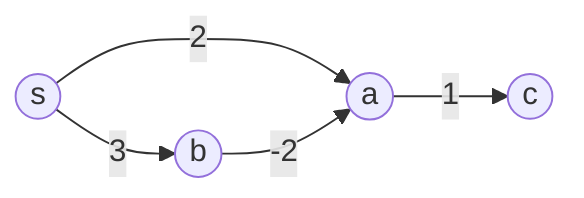
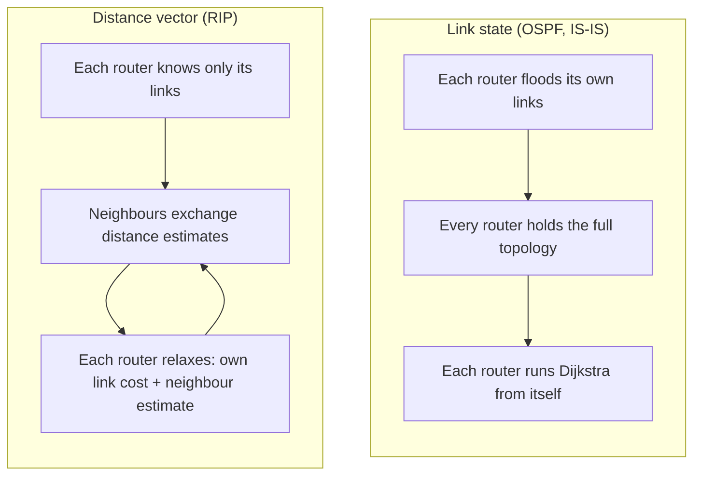
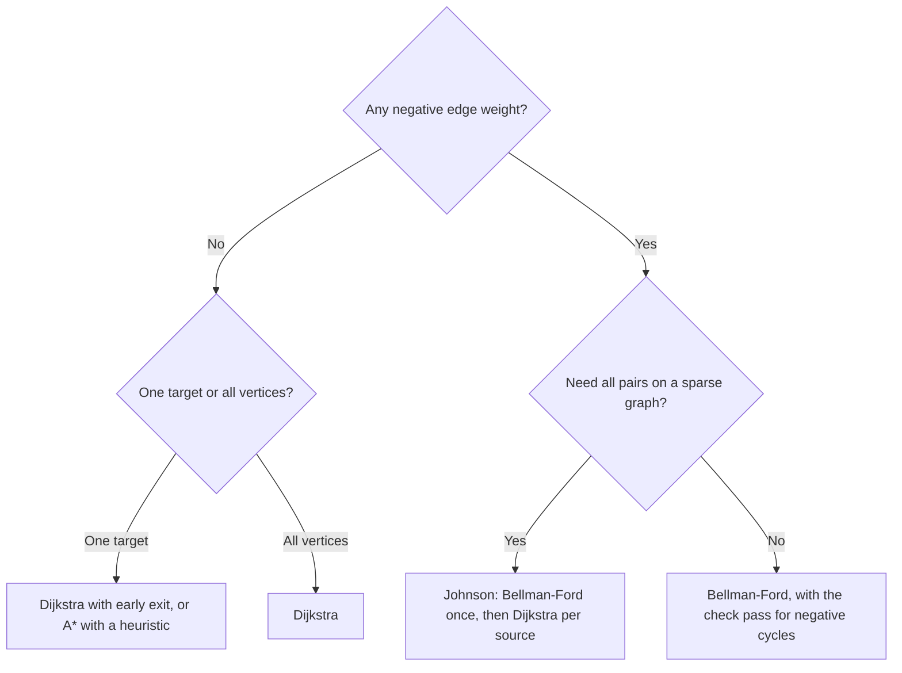

Dijkstra's algorithm and the Bellman-Ford algorithm solve the same problem: given a weighted directed graph and a source vertex, compute the length of the shortest path from the source to every other vertex. Both are built on the same elementary operation, *edge relaxation*, and both produce a shortest-path tree. They differ in the order in which they relax edges and in how many times they do it.

That single difference has measurable consequences. Dijkstra relaxes each edge once, in a greedy order, and runs in $$O(E + V \log V)$$ with a Fibonacci heap, but its result is wrong as soon as one edge weight is negative. Bellman-Ford relaxes every edge up to $$V - 1$$ times, runs in $$O(VE)$$, accepts negative weights, and detects a negative cycle when one is reachable. The same split appears in network routing: link-state protocols such as OSPF run Dijkstra, distance-vector protocols such as RIP run a distributed Bellman-Ford.

This article defines the problem, describes both algorithms with their correctness argument, traces them on a graph where they disagree, and compares where each one is used.

> This article has been made with the help of [Claude Code](https://claude.com/product/claude-code) and several custom skills

[TOC]

## The single-source shortest-path problem

Let $$G = (V, E)$$ be a directed graph with a weight function $$w : E \to \mathbb R$$ and a source $$s \in V$$. The weight of a path $$p = (v_0, v_1, \dots, v_k)$$ is the sum of its edge weights:

$$
\begin{aligned}
w(p) = \sum_{i=1}^{k} w(v_{i-1}, v_i)
\end{aligned}
$$

The shortest-path distance $$\delta(s, v)$$ is the minimum of $$w(p)$$ over all paths from $$s$$ to $$v$$, or $$+\infty$$ when $$v$$ is unreachable. The single-source shortest-path (SSSP) problem asks for $$\delta(s, v)$$ for every $$v$$, together with a predecessor for each vertex so that the paths themselves can be rebuilt. The predecessors form a **shortest-path tree** rooted at $$s$$.

The definition breaks down in one case. If a cycle whose total weight is negative is reachable from $$s$$, a path can loop around it indefinitely and its weight decreases without bound. For any vertex reachable from that cycle, $$\delta(s, v) = -\infty$$, and "shortest path" has no meaning. An algorithm can either assume that no such cycle exists or detect it and report it. Dijkstra does the former (it assumes no negative edge at all); Bellman-Ford does the latter.

Negative weights are not an exotic case. They appear whenever a weight models a gain rather than a cost: a rebate, a transformation of exchange rates into $$-\log$$ values, or the reweighting step inside Johnson's algorithm described later.

## Relaxation, the operation both algorithms share

Both algorithms keep, for each vertex $$v$$, an estimate $$d(v)$$ of its distance and a predecessor $$\pi(v)$$. Initially $$d(s) = 0$$ and $$d(v) = +\infty$$ for every other vertex. **Relaxing** the edge $$(u, v)$$ tests whether going through $$u$$ improves the best known route to $$v$$:

$$
\begin{aligned}
\text{if } d(u) + w(u, v) \lt d(v) \text{ then } d(v) \leftarrow d(u) + w(u, v), \quad \pi(v) \leftarrow u
\end{aligned}
$$

Two properties of relaxation do all the work in the correctness proofs:

- **Upper bound.** At every moment, $$d(v) \ge \delta(s, v)$$. A relaxation only ever sets $$d(v)$$ to the weight of an actual path, so the estimate can never undershoot the true distance. Once $$d(v) = \delta(s, v)$$, it never changes again.
- **Path relaxation.** If $$p = (s, v_1, \dots, v_k)$$ is a shortest path and its edges are relaxed in that order, possibly with other relaxations interleaved, then $$d(v_k) = \delta(s, v_k)$$ afterwards.

The second property reduces the whole problem to a scheduling question: in which order should the edges be relaxed so that every shortest path gets its edges relaxed in sequence? Dijkstra and Bellman-Ford give two different answers.

## Dijkstra's algorithm

[Edsger W. Dijkstra published the algorithm in 1959](https://doi.org/10.1007/BF01386390), in a three-page note that also covered the [minimum spanning tree]({{site.url_complet}}/2021/08/22/arbre-recouvrant-poids-minimum/) problem. Prim's algorithm for that problem has the same structure as Dijkstra's, a priority queue of unsettled vertices, but it keys each vertex by the weight of a single edge instead of a path length. Its answer to the scheduling question is greedy: relax the outgoing edges of vertices in increasing order of their distance from $$s$$.

### The procedure

The algorithm maintains a set $$S$$ of **settled** vertices, whose distance is final, and a priority queue holding the others, keyed by $$d(v)$$. At each step it extracts the unsettled vertex with the smallest estimate, adds it to $$S$$, and relaxes all of its outgoing edges.

```python
import heapq

def dijkstra(graph, source):
    dist = {v: float("inf") for v in graph}
    pred = {v: None for v in graph}
    dist[source] = 0
    heap = [(0, source)]
    settled = set()
    while heap:
        d, u = heapq.heappop(heap)
        if u in settled:
            continue                      # stale entry, u already final
        settled.add(u)
        for v, w in graph[u]:
            if dist[u] + w < dist[v]:     # relaxation
                dist[v] = dist[u] + w
                pred[v] = u
                heapq.heappush(heap, (dist[v], v))
    return dist, pred
```

Python's `heapq` has no decrease-key operation, so this version pushes a new entry on each improvement and discards stale entries when they are popped. The heap can then hold up to $$E$$ entries instead of $$V$$, which does not change the asymptotic bound below because $$\log E \le 2 \log V$$.

### Why it is correct, and why it needs non-negative weights

The invariant is that every vertex in $$S$$ has $$d(v) = \delta(s, v)$$. Suppose $$u$$ is the next vertex extracted, and consider a true shortest path from $$s$$ to $$u$$. Let $$y$$ be the first vertex on it outside $$S$$, and $$x$$ its predecessor on the path, which is in $$S$$. When $$x$$ was settled, the edge $$(x, y)$$ was relaxed, so $$d(y) = \delta(s, y)$$. Then:

$$
\begin{aligned}
d(u) \le d(y) = \delta(s, y) \le \delta(s, u) \le d(u)
\end{aligned}
$$

The first inequality holds because $$u$$ was chosen as the minimum of the queue. The third is the upper-bound property. The second, $$\delta(s, y) \le \delta(s, u)$$, says that the remaining part of the path from $$y$$ to $$u$$ cannot have negative weight, and **this is the only place where non-negative weights are used**. With all weights $$\ge 0$$, the chain collapses to equalities and $$d(u) = \delta(s, u)$$.

If a negative edge exists, that step fails: a vertex can be settled with an estimate that a later, longer path undercuts. Because a settled vertex is never extracted again, the improvement is not propagated to its successors. The worked example below shows this happening.

### Complexity

The algorithm performs $$V$$ extract-min operations and at most $$E$$ decrease-key (or insert) operations. Its running time depends on the priority queue:

| Priority queue | Extract-min | Decrease-key | Total |
|---|---|---|---|
| Unsorted array | $$O(V)$$ | $$O(1)$$ | $$O(V^2)$$ |
| Binary heap | $$O(\log V)$$ | $$O(\log V)$$ | $$O((V + E) \log V)$$ |
| Fibonacci heap | $$O(\log V)$$ amortised | $$O(1)$$ amortised | $$O(E + V \log V)$$ |

The array version is the best choice on dense graphs, where $$E$$ is close to $$V^2$$. The binary heap is what most libraries ship. The Fibonacci heap bound, from [Fredman and Tarjan (1987)](https://doi.org/10.1145/28869.28874), is the textbook optimum for comparison-based Dijkstra, although its constant factors make it rarely faster in practice.

Dijkstra also supports an early exit. If only the distance to one target $$t$$ is needed, the algorithm can stop as soon as $$t$$ is extracted, since its distance is already final at that point. The A* search algorithm extends this idea by ordering the queue with $$d(v) + h(v)$$, where $$h$$ is an admissible estimate of the remaining distance to $$t$$.

## The Bellman-Ford algorithm

The algorithm is named after [Richard Bellman (1958)](https://doi.org/10.1090/qam/102435) and Lester Ford Jr. (1956), and was also published by Edward Moore in 1959. Its answer to the scheduling question does not depend on the weights at all: relax **every** edge, in any fixed order, and repeat the whole pass $$V - 1$$ times.

### The procedure

```python
def bellman_ford(vertices, edges, source):
    dist = {v: float("inf") for v in vertices}
    pred = {v: None for v in vertices}
    dist[source] = 0
    for _ in range(len(vertices) - 1):
        changed = False
        for u, v, w in edges:
            if dist[u] + w < dist[v]:     # relaxation
                dist[v] = dist[u] + w
                pred[v] = u
                changed = True
        if not changed:
            break                         # fixed point reached early
    for u, v, w in edges:                 # the |V|-th pass
        if dist[u] + w < dist[v]:
            raise ValueError("negative cycle reachable from source")
    return dist, pred
```

### Why V − 1 passes are enough

If no negative cycle is reachable from $$s$$, every vertex has a shortest path that is *simple*: removing a cycle from a path never increases its weight when the cycle is non-negative. A simple path visits each vertex at most once, so it has at most $$V - 1$$ edges.

Take such a shortest path $$(s, v_1, \dots, v_k)$$ with $$k \le V - 1$$. Pass 1 relaxes every edge, so in particular $$(s, v_1)$$. Pass 2 relaxes $$(v_1, v_2)$$, and so on. After pass $$i$$, the first $$i$$ edges of the path have been relaxed in order, and by the path-relaxation property $$d(v_i) = \delta(s, v_i)$$. After $$V - 1$$ passes, every vertex is final. Nothing in this argument uses the sign of the weights.

The same reasoning gives a slightly stronger statement that is useful on its own: after $$i$$ passes, $$d(v)$$ is at most the weight of the shortest path to $$v$$ that uses at most $$i$$ edges. This makes Bellman-Ford the natural tool for **hop-limited** shortest paths (for example, the cheapest route with at most $$k$$ intermediate stops), provided each pass reads the distances of the previous pass rather than values updated during the current one.

### Detecting a negative cycle

After $$V - 1$$ passes, all distances are final when no negative cycle is reachable. One more pass therefore decides the question:

- If some edge $$(u, v)$$ still satisfies $$d(u) + w(u, v) \lt d(v)$$, a reachable negative cycle exists.
- If no edge can be relaxed, none exists, and the computed distances are exact.

To report the cycle itself, start from the vertex $$v$$ that was relaxed in that extra pass and follow predecessors $$V$$ times. The walk is then guaranteed to be inside the cycle, and following predecessors from there until a vertex repeats lists its members.

### Complexity

Each pass costs $$O(E)$$ and there are at most $$V$$ of them, so the total is $$O(VE)$$. On a dense graph that is $$O(V^3)$$, against $$O(V^2)$$ for Dijkstra with an array.

Two practical improvements leave the worst case unchanged:

- **Early termination.** If a full pass changes nothing, the distances have reached a fixed point and the loop can stop. On many graphs this happens long before pass $$V - 1$$.
- **Queue-based variant.** Only a vertex whose distance just decreased can enable new relaxations, so a FIFO queue of such vertices avoids rescanning untouched edges. This variant is often called SPFA (Shortest Path Faster Algorithm). It is faster on average but still $$O(VE)$$ in the worst case, and it detects a negative cycle when some vertex is enqueued $$V$$ times.

## A graph on which they disagree

The following graph has four vertices and one negative edge, and no negative cycle. The true distances from $$s$$ are $$\delta(a) = 1$$ (through $$b$$), $$\delta(b) = 3$$ and $$\delta(c) = 2$$.



### Dijkstra's trace

| Step | Extracted | Relaxations | $$d(a)$$ | $$d(b)$$ | $$d(c)$$ |
|---|---|---|---|---|---|
| 0 | | initialisation | $$\infty$$ | $$\infty$$ | $$\infty$$ |
| 1 | $$s$$ (0) | $$(s,a)$$, $$(s,b)$$ | 2 | 3 | $$\infty$$ |
| 2 | $$a$$ (2) | $$(a,c)$$ | 2 | 3 | 3 |
| 3 | $$b$$ (3) | $$(b,a)$$ improves $$a$$ | **1** | 3 | 3 |
| 4 | $$c$$ (3) | none | 1 | 3 | **3** |

At step 2, $$a$$ is settled with $$d(a) = 2$$ because it is the smallest key in the queue, and $$(a, c)$$ is relaxed with that value. At step 3, the negative edge $$(b, a)$$ lowers $$d(a)$$ to 1, but $$a$$ is already settled and will not be extracted again, so the edge $$(a, c)$$ is never relaxed with the corrected value. The algorithm returns $$d(c) = 3$$, whereas $$\delta(c) = 2$$. (An implementation that skips relaxations into settled vertices also leaves $$d(a) = 2$$.)

Removing the `settled` check and letting vertices re-enter the queue does give correct results on graphs without negative cycles, but the procedure is then a label-correcting algorithm rather than Dijkstra, and it can take exponential time in the worst case.

### Bellman-Ford's trace

With the edges processed in the order $$(a,c)$$, $$(b,a)$$, $$(s,a)$$, $$(s,b)$$, which is deliberately unfavourable:

| After pass | $$d(a)$$ | $$d(b)$$ | $$d(c)$$ |
|---|---|---|---|
| 0 | $$\infty$$ | $$\infty$$ | $$\infty$$ |
| 1 | 2 | 3 | $$\infty$$ |
| 2 | 1 | 3 | 3 |
| 3 | 1 | 3 | 2 |
| check | no edge relaxes | | |

Each pass extends the correct prefix of the shortest path $$s \to b \to a \to c$$ by one edge, and three passes ($$V - 1$$) are needed for $$c$$. The check pass finds nothing to relax, so no negative cycle exists. In the order $$(s,a)$$, $$(s,b)$$, $$(b,a)$$, $$(a,c)$$, the same result appears after pass 1, and early termination stops after pass 2: the edge order changes the number of passes, never the result.

### Adding a negative cycle

Adding the edge $$(c, b)$$ with weight $$-1$$ creates the cycle $$b \to a \to c \to b$$ of weight $$-2 + 1 - 1 = -2$$. Every lap reduces the distance to $$a$$, $$b$$ and $$c$$ by 2. Bellman-Ford's check pass finds a relaxable edge and reports the cycle. Dijkstra terminates with some set of finite distances and no indication that none of them is meaningful.

## Side-by-side comparison

| Criterion | Dijkstra | Bellman-Ford |
|---|---|---|
| Strategy | Greedy: settle vertices in increasing distance order | Exhaustive: relax every edge, $$V - 1$$ times |
| Edge weights | Non-negative only | Any real weights |
| Negative cycles | Not detected; output is meaningless | Detected by one extra pass |
| Time complexity | $$O(E + V \log V)$$ (Fibonacci heap), $$O((V+E)\log V)$$ (binary heap) | $$O(VE)$$ |
| Data structure | Priority queue | Edge list and an array |
| Times an edge is relaxed | Once | Up to $$V - 1$$ times |
| Early exit for one target | Yes, when the target is extracted | No, only when a pass changes nothing |
| Hop-limited paths | Not directly | Yes, $$i$$ passes bound paths to $$i$$ edges |
| Distributed execution | Needs the whole graph at each node | Each node only needs its neighbours' estimates |

The last row explains the routing protocols below, and the first three rows explain everything else.

## Where each one is used

### Network routing: link state against distance vector

In a **link-state** protocol, each router floods a description of its own links to the whole area, so every router ends up with the same map of the topology. Each one then runs Dijkstra locally, with itself as the source, to compute its routing table. [OSPF version 2 (RFC 2328)](https://datatracker.ietf.org/doc/html/rfc2328) specifies this calculation in its section 16, and IS-IS works the same way. Link costs are configured as positive values, so Dijkstra's precondition holds by construction.

In a **distance-vector** protocol, no router sees the topology. Each one only knows the cost of its own links and the distance estimates its neighbours advertise. It applies the relaxation rule to those advertisements and sends its own estimates in turn. This is Bellman-Ford executed asynchronously, with each relaxation happening on a different machine. [RIP version 2 (RFC 2453)](https://datatracker.ietf.org/doc/html/rfc2453) is the standard example.

The distributed version inherits a weakness that the centralised one does not have. When a link fails, two routers can keep advertising stale routes to each other through the lost destination, each raising its estimate by one link cost per exchange. This **count-to-infinity** behaviour converges only when the estimate reaches a value treated as unreachable. RIP sets that value to 16 hops, which also caps the network diameter at 15, and mitigates the problem with split horizon and poison reverse. Link-state protocols avoid it because each router recomputes from a complete map.



### Currency arbitrage

Given exchange rates $$r(u, v)$$ between currencies, an arbitrage opportunity is a cycle of conversions whose product of rates exceeds 1. Taking $$w(u, v) = -\log r(u, v)$$ turns the product into a sum:

$$
\begin{aligned}
\prod_{i} r(v_{i-1}, v_i) \gt 1 \iff \sum_{i} -\log r(v_{i-1}, v_i) \lt 0
\end{aligned}
$$

An arbitrage cycle is therefore exactly a negative cycle in the transformed graph. The weights are of mixed sign by construction, so Dijkstra is not applicable, and the question asked is the one Bellman-Ford's check pass answers.

### Johnson's algorithm: both, in sequence

For all-pairs shortest paths on a sparse graph with negative weights, [Johnson's algorithm (1977)](https://doi.org/10.1145/321992.321993) combines the two. It adds a new vertex $$q$$ with a zero-weight edge to every vertex and runs Bellman-Ford from $$q$$, which detects any negative cycle and yields a potential $$h(v) = \delta(q, v)$$. It then reweights every edge:

$$
\begin{aligned}
w'(u, v) = w(u, v) + h(u) - h(v) \ge 0
\end{aligned}
$$

The new weights are non-negative because $$h(v) \le h(u) + w(u, v)$$ holds for the shortest-path distances $$h$$. Along any path from $$x$$ to $$y$$, the potentials telescope, so every path's weight changes by the same amount $$h(x) - h(y)$$ and the shortest paths themselves are unchanged. Dijkstra can then run from every vertex. The total cost is $$O(VE)$$ for the single Bellman-Ford call plus $$V$$ Dijkstra runs, $$O(V^2 \log V + VE)$$ with Fibonacci heaps, which is better than Floyd-Warshall's $$O(V^3)$$ when the graph is sparse.

### Recent theoretical results

Both bounds have been improved upon in the research literature, though neither result has replaced the classical algorithms in practice:

- For non-negative real weights on directed graphs, [Duan, Mao, Mao, Shu and Yin (2025)](https://arxiv.org/abs/2504.17033) give a deterministic $$O(m \log^{2/3} n)$$ algorithm, the first to beat Dijkstra's $$O(m + n \log n)$$ bound on sparse graphs.
- For negative integer weights, [Bernstein, Nanongkai and Wulff-Nilsen (2022)](https://arxiv.org/abs/2203.03456) give a randomised algorithm in $$O(m \log^8 n \log W)$$, where $$W$$ bounds the absolute value of the most negative weight. This is near-linear, against $$O(mn)$$ for Bellman-Ford.

## Choosing between them



Three further considerations sit outside the flowchart:

- **An undirected graph with a negative edge** always contains a negative cycle, since the edge can be traversed back and forth. Neither algorithm gives meaningful distances there; the problem has to be reformulated (for example, as a shortest simple path, which is NP-hard in general).
- **A directed acyclic graph** needs neither algorithm. Relaxing edges in topological order solves SSSP with any weights in $$O(V + E)$$, because one pass in that order relaxes every path's edges in sequence.
- **Bounded hop counts or a distributed setting** favour Bellman-Ford even when all weights are positive, for the reasons given above.

## Conclusion

Dijkstra and Bellman-Ford are two schedules for the same relaxation step, and the choice of schedule determines what each can guarantee.

- **Dijkstra** relaxes each edge once, in increasing order of distance. The greedy order is correct only when no edge is negative, and the result is $$O(E + V \log V)$$ with a Fibonacci heap and an early exit for single-target queries.
- **Bellman-Ford** relaxes every edge $$V - 1$$ times without regard to order. It accepts negative weights, detects reachable negative cycles with one extra pass, and runs in $$O(VE)$$.
- **In routing**, link-state protocols (OSPF, IS-IS) run Dijkstra on a full topology map, while distance-vector protocols (RIP) run Bellman-Ford across routers and inherit the count-to-infinity problem.
- **Johnson's algorithm** uses Bellman-Ford once to compute potentials that make all weights non-negative, then Dijkstra from every source.


## Annex

### Key Terms

| Term | Definition |
|------|------------|
| **Weighted directed graph** | A set of vertices $$V$$ and directed edges $$E$$, each edge carrying a real weight $$w(u, v)$$ that models a cost or a gain. |
| **Single-source shortest paths (SSSP)** | The problem of computing the minimum path weight $$\delta(s, v)$$ from one source $$s$$ to every vertex $$v$$. |
| **Shortest-path tree** | The tree rooted at the source formed by the predecessor pointers $$\pi(v)$$, in which each root-to-vertex path is a shortest path. |
| **Negative cycle** | A cycle whose edge weights sum to a negative value; if reachable from the source, distances to vertices it reaches are $$-\infty$$. |
| **Relaxation** | The test-and-update step $$d(v) \leftarrow \min(d(v), d(u) + w(u, v))$$ applied to an edge $$(u, v)$$, shared by both algorithms. |
| **Upper-bound property** | The fact that a distance estimate never falls below the true distance, so once it equals it, it never changes. |
| **Path-relaxation property** | The fact that relaxing the edges of a shortest path in order, with any other relaxations interleaved, makes the last vertex's estimate exact. |
| **Settled vertex** | In Dijkstra, a vertex extracted from the priority queue, whose distance is final and whose outgoing edges have been relaxed. |
| **Priority queue** | The data structure Dijkstra uses to extract the unsettled vertex with the smallest estimate; its choice sets the running time. |
| **Fibonacci heap** | A priority queue with amortised $$O(1)$$ decrease-key, giving Dijkstra its $$O(E + V \log V)$$ bound. |
| **Pass** | In Bellman-Ford, one relaxation of every edge in the graph; $$V - 1$$ passes suffice without negative cycles. |
| **SPFA** | The queue-based Bellman-Ford variant that only rescans edges leaving vertices whose distance just decreased; still $$O(VE)$$ in the worst case. |
| **Link-state routing** | Routing in which every router learns the full topology and runs Dijkstra locally, as in OSPF and IS-IS. |
| **Distance-vector routing** | Routing in which routers exchange distance estimates with neighbours and apply relaxation, a distributed Bellman-Ford, as in RIP. |
| **Count to infinity** | The slow convergence of distance-vector routing after a failure, as routers raise stale estimates step by step until reaching the unreachable value. |
| **Johnson's algorithm** | An all-pairs method that runs Bellman-Ford once to compute vertex potentials, reweights edges to be non-negative, then runs Dijkstra from each vertex. |

### Invariants

| Invariant | Enforced by | Breaks if |
|-----------|-------------|-----------|
| $$d(v) \ge \delta(s, v)$$ at every step, in both algorithms. | Relaxation only assigns the weight of an existing path. | A negative cycle is reachable: $$\delta$$ is $$-\infty$$ and the estimates keep decreasing. |
| Every settled vertex in Dijkstra has $$d(v) = \delta(s, v)$$. | Extract-min order, together with non-negative weights. | Any edge weight is negative: a later path can undercut a settled vertex. |
| Dijkstra settles vertices in non-decreasing order of distance. | The priority queue returns the minimum key. | The queue is replaced by a FIFO or LIFO structure, or weights are negative. |
| After pass $$i$$ of Bellman-Ford, $$d(v)$$ is at most the weight of the best path to $$v$$ with at most $$i$$ edges. | Each pass relaxes every edge. | Some edges are skipped in a pass. |
| After $$V - 1$$ passes with no reachable negative cycle, no edge can be relaxed. | Every shortest simple path has at most $$V - 1$$ edges. | A negative cycle is reachable, which the extra pass then reports. |

## Frequently Asked Questions

**Q: What operation do Dijkstra and Bellman-Ford have in common?**

Both rely on edge relaxation: for an edge $$(u, v)$$, if $$d(u) + w(u, v) \lt d(v)$$, the estimate of $$v$$ is lowered and its predecessor set to $$u$$. The algorithms differ only in the order in which edges are relaxed and how many times. Dijkstra relaxes each edge once, when its tail is settled; Bellman-Ford relaxes all edges in up to $$V - 1$$ passes.

**Q: Where exactly does Dijkstra's correctness proof use the assumption that weights are non-negative?**

In the step $$\delta(s, y) \le \delta(s, u)$$, where $$y$$ is the first unsettled vertex on a shortest path to the vertex $$u$$ about to be settled. The inequality says that the remainder of the path, from $$y$$ to $$u$$, has non-negative weight. With a negative edge on that remainder, $$u$$ can be settled with an estimate larger than its true distance, and because settled vertices are never revisited, the error propagates to every vertex reached through $$u$$.

**Q: Why does Bellman-Ford need exactly $$V - 1$$ passes, and what does the extra pass do?**

Without a reachable negative cycle, every vertex has a shortest path that is simple, hence of at most $$V - 1$$ edges. Each pass extends the correctly relaxed prefix of such a path by at least one edge, so $$V - 1$$ passes make every distance exact.

The extra pass then tests that claim. If any edge can still be relaxed, the distances have not stabilised, which is only possible when a negative cycle is reachable from the source.

**Q: Why do OSPF and RIP use different algorithms?**

They differ in what each router knows:

- **OSPF** is link-state: routers flood their link descriptions, so each router holds the complete topology and can run Dijkstra on it centrally. Link costs are positive, so the precondition holds.
- **RIP** is distance-vector: a router only knows its own links and its neighbours' advertised distances. Relaxing those advertisements is a Bellman-Ford step, and the computation is spread across all routers.

The distributed approach is simpler to deploy but converges slowly after a failure (count to infinity), which RIP bounds by treating 16 hops as unreachable.

**Q: How does Johnson's algorithm combine the two, and why does the reweighting preserve shortest paths?**

It adds a vertex $$q$$ connected to every vertex by a zero-weight edge, runs Bellman-Ford from $$q$$ to obtain $$h(v) = \delta(q, v)$$, and reweights each edge as $$w'(u, v) = w(u, v) + h(u) - h(v)$$. The triangle inequality $$h(v) \le h(u) + w(u, v)$$ makes every $$w'$$ non-negative.

For any path from $$x$$ to $$y$$, the intermediate potentials cancel, so the reweighted path weight equals the original plus $$h(x) - h(y)$$. That offset is the same for every path between the same endpoints, so the ranking of paths, and therefore the shortest ones, is unchanged. Dijkstra can then be run from every vertex on the reweighted graph.

**Q: A currency exchange graph has rates between pairs of currencies. Which algorithm detects arbitrage, and how?**

Bellman-Ford. Setting $$w(u, v) = -\log r(u, v)$$ turns a cycle whose product of rates exceeds 1 into a cycle of negative total weight. Dijkstra cannot be used because the transformed weights take both signs. Bellman-Ford's extra pass detects a reachable negative cycle, and following predecessors from the relaxed vertex recovers the sequence of conversions.

**Q: On a graph with positive weights only, is there any reason to prefer Bellman-Ford?**

Yes, in two cases. When paths are limited to at most $$k$$ edges, $$k$$ passes of Bellman-Ford (each reading the previous pass's distances) compute exactly the best path within that budget, which Dijkstra does not handle directly. And in a distributed setting, Bellman-Ford needs only local information exchanged between neighbours, whereas Dijkstra needs the whole graph in one place.

## References

### Original papers

- E. W. Dijkstra, [A note on two problems in connexion with graphs](https://doi.org/10.1007/BF01386390), *Numerische Mathematik* 1, 269–271, 1959
- R. Bellman, [On a routing problem](https://doi.org/10.1090/qam/102435), *Quarterly of Applied Mathematics* 16, 87–90, 1958
- L. R. Ford Jr., *Network Flow Theory*, RAND Corporation paper P-923, 1956
- D. B. Johnson, [Efficient Algorithms for Shortest Paths in Sparse Networks](https://doi.org/10.1145/321992.321993), *Journal of the ACM* 24(1), 1–13, 1977
- M. L. Fredman and R. E. Tarjan, [Fibonacci heaps and their uses in improved network optimization algorithms](https://doi.org/10.1145/28869.28874), *Journal of the ACM* 34(3), 1987

### Recent results

- R. Duan, J. Mao, X. Mao, X. Shu, L. Yin, [Breaking the Sorting Barrier for Directed Single-Source Shortest Paths](https://arxiv.org/abs/2504.17033), 2025
- A. Bernstein, D. Nanongkai, C. Wulff-Nilsen, [Negative-Weight Single-Source Shortest Paths in Near-linear Time](https://arxiv.org/abs/2203.03456), 2022

### Routing protocols

- [RFC 2328 — OSPF Version 2](https://datatracker.ietf.org/doc/html/rfc2328)
- [RFC 2453 — RIP Version 2](https://datatracker.ietf.org/doc/html/rfc2453)

### Textbook

- T. H. Cormen, C. E. Leiserson, R. L. Rivest, C. Stein, *Introduction to Algorithms*, MIT Press, chapter "Single-Source Shortest Paths"

### Related articles

- [Arbre recouvrant de poids minimum (MST / ACM)]({{site.url_complet}}/2021/08/22/arbre-recouvrant-poids-minimum/)
- [Hypergraph and Hypertree - Overview]({{site.url_complet}}/2025/11/25/hypergraph-hypertree/)

### Tooling

- [Claude Code](https://claude.com/product/claude-code)
