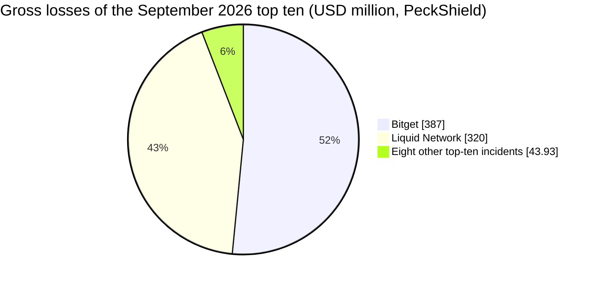
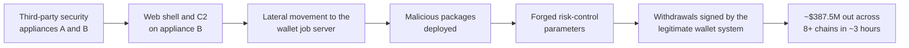
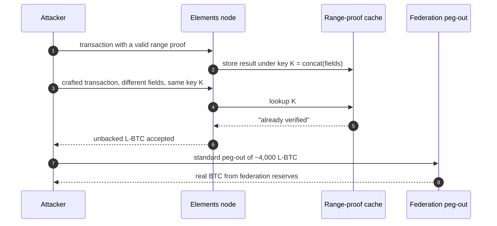

September 2026 was the worst month of the year for crypto theft. PeckShield counted 55 major hacks and ~$766.49M in losses, a rise of about 462% over August's ~$136.3M, and CertiK's dashboard settled at roughly $772.4M, the highest monthly total and the highest incident count of 2026. Two events account for almost all of it:

- **Bitget, ~$387.5M:** the drain of the exchange's hot and warm wallets.
- **Liquid Network, ~$320M:** the minting of about 4,000 unbacked L-BTC on this Bitcoin sidechain, which removed the equivalent BTC from its federation reserves before most of it was returned.

The remaining fifty or so incidents are smaller and repeat a short list of failure classes: leaked or misused privileged keys, bridges that accept a message they should have rejected, contracts that let any caller spend someone else's allowance, lending markets priced from a spot oracle, and accounting code that counts the same asset twice. This article lists and summarises those incidents, grouped by root cause, using three sources: the [CryptoAlertHack](https://t.me/CryptoAlertHack) Telegram channel, a relay of alerts from SlowMist, PeckShield, CertiK, GoPlus, BlockSec Phalcon, Rekt News and others; the [SlowMist Hacked](https://hacked.slowmist.io/) database, and [Rekt News](https://rekt.news/).

> This article has been made with the help of [Claude Code](https://claude.com/product/claude-code) and several custom skills

[TOC]

## Scope, sources and caveats

The article covers incidents that **occurred** between 1 and 30 September 2026. A few events from the last days of August (Tectonic on Cronos, the Cosmos EVM chain of exploits, Aquifer on Solana) were analysed and published in September, mostly by Rekt News; they are mentioned where their follow-up matters but are not counted as September incidents.

Figures come from first alerts and are often revised. Three practical consequences:

- **Totals differ between trackers.** PeckShield reports ~$766.49M for 55 hacks; CertiK first posted ~$766.4M on 30 September and ~$772.4M two days later. The difference comes from scope (phishing, scams and rug pulls are counted differently) and from price snapshots.
- **Gross and net losses differ.** Liquid Network's ~$320M is a gross figure; 3,400 BTC were returned. PeckShield records ~$285M returned, CertiK about $268M, because the BTC was valued at different moments.
- **Per-incident amounts disagree.** Limit Break's Payment Processor V2 appears as ~$6.6M (with ~$3.4M returned) at PeckShield and ~$2.8M at SlowMist; Likwid appears as 74.31 BNB in the alert and ~$55,721 in the database. Where two values exist, both are given.
- **Some incidents are dated by disclosure.** The Nomic nBTC exploit ran on 25 June 2026 and was disclosed on 7 September; SlowMist files it under September, and so does this article.
- **Official post-mortems are the exception.** About half of the top incidents have a written report from the affected project; the others posted a short statement on X or nothing. The section [Official post-mortems and statements](#official-post-mortems-and-statements) lists what exists.

Exploit transaction hashes and addresses are left out of the body; they are in the linked alerts and database entries.

## September 2026 in numbers

PeckShield's top ten for the month:

| Rank | Incident | Category | Reported loss (approx. USD) | Root cause (summary) |
|:---:|----------|----------|--------------:|----------------------|
| 1 | Bitget | CEX | $387M | Zero-day in a third-party security product, then abuse of the wallet withdrawal system |
| 2 | Liquid Network | Sidechain / cross-chain bridge | $320M ($285M returned) | Range-proof verification cache collision in Elements |
| 3 | MEV bot "yoink" front-run (rsETH, unknown Gnosis Safe) | Smart contract (DeFi router) | $7.81M (returned) | Router authorisation bypass; the exploit was front-run by an MEV bot |
| 4 | Duelbits | Crypto casino (custodial) | $7M | Hot-wallet private key compromise |
| 5 | Payment Processor V2 (Limit Break) | Smart contract (NFT marketplace) | $6.6M ($3.4M returned) | Stale marketplace approvals abused for zero-price NFT sales |
| 6 | D'CENT Wallet | Wallet (mobile app) | $6.57M | Abnormal transfers from App Wallet versions before 8.1.0; root cause withheld, no official loss figure |
| 7 | Astroport | Governance (Neutron) | $4.9M | Neutron governance proposal 9 transferred contract admin rights to the attacker; same attack as Drop |
| 8 | Drop | Governance (Neutron) | $4.4M | Same proposal as Astroport; the post-mortem puts the combined withdrawal at ~$6.24M and the net loss at ~$2.23M |
| 9 | Nostra Finance | Smart contract (lending, oracle) | $3.5M | Oracle manipulation of the NSTR price |
| 10 | Nomic nBTC bridge | Cross-chain bridge | $3.15M | Double spend through the custom forwarding mechanism (exploited in June, disclosed in September) |

Two incidents represent about 92% of the gross total. Without Bitget and Liquid, September's losses are about $59M, which is in the range of a normal month in 2026. Net of the Liquid return, the month still lost roughly $480M.

### Statistics from the SlowMist database

The figures below are computed from the September entries of the [SlowMist Hacked](https://hacked.slowmist.io/) database, after removing one duplicate row (Flamincome is listed twice) and one fraud, the fake GIWA bridge, which is covered in [Frauds and scams](#frauds-and-scams) and not counted as a hack. They use the database's own loss figures, before returns, and they give a second count, independent of PeckShield's:

- **49 incidents**, 46 with a stated loss, for a total of **~$760M**. The same calculation for August gives 37 incidents and ~$188M.
- **Median loss: ~$170k.** The mean, ~$16.5M, is meaningless here: the two largest incidents make up 93.1% of the total, and the other 47 add up to ~$52.5M.
- **18 of the 46 priced incidents lost less than $100k.** Most are small DeFi contracts on BNB Chain, Ethereum, Polygon or Base.

| Size band | Incidents | Loss (approx. USD) | Share of loss |
|---|--:|--:|--:|
| ≥ $100M | 2 | $707.50M | 93.1% |
| $1M to $10M | 12 | $47.44M | 6.2% |
| $100k to $1M | 14 | $4.39M | 0.6% |
| < $100k | 18 | $709.2k | 0.1% |
| Not stated | 3 | n/a | n/a |

Grouping the entries by category gives a different picture by count than by value. Smart contract bugs are the most frequent incidents but a small share of the money:

| Category | Incidents | Loss (approx. USD) | Share of loss |
|---|--:|--:|--:|
| Key / infrastructure compromise | 9 | $402.11M | 52.9% |
| Cross-chain bridge / sidechain | 8 | $328.82M | 43.3% |
| Smart contract vulnerability | 22 | $13.79M | 1.8% |
| Other / unknown (D'CENT) | 1 | $6.57M | 0.9% |
| Governance attack | 1 | $4.40M | 0.6% |
| Oracle / price manipulation | 6 | $4.23M | 0.6% |
| Phishing / account takeover | 1 | not stated | n/a |
| Supply chain | 1 | $118k | < 0.1% |

The category is derived from the database's attack method first, and from the target and description when the method is generic. Bitget counts as an infrastructure compromise and Liquid as a sidechain bug. The database also files the Neutron governance attack as two rows, Drop (governance, ~$4.4M) and Astroport (administrator privileges, ~$4.9M, counted under key / infrastructure); the official post-mortem puts the whole attack at ~$6.24M withdrawn and ~$2.23M net, so these tables overstate it by about $3M. The loss is concentrated in time as well: the week of 22 to 28 September (Bitget, Duelbits, Astroport, Drop, Payy, Meter, Limit Break) accounts for 54% of the month's total.

The month's timeline, by date of the incident:

## The two incidents that define the month

### Bitget (~$387.5M), an infrastructure compromise

On 24 September at 18:31 UTC, Bitget's monitoring detected unauthorised transfers from part of its hot and warm wallets. The exchange's [security notice](https://www.bitget.com/support/articles/12560603896024), published three hours later, estimated the funds affected at ~$351.6M, paused withdrawals, stated that the cold wallets were untouched, and said the loss was covered by its User Protection Fund. A [post on 25 September](https://x.com/bitget/status/2103321333405036792) specified that the fund holds 5,500 BTC (~$464M at the time) in publicly verifiable addresses, that it would bear the assessed loss of the hot wallet incident, and that Bitget would replenish it. It declined to name the attack vector until the investigation was complete.

Two days later, on 26 September, Bitget [announced](https://x.com/BitgetJP/status/2103698952600355029) that the vulnerability had been identified and remediated, that Mandiant and SlowMist were supporting the investigation, and that no further unauthorised transfer was possible. Trading and deposits had stayed open. Withdrawals reopened by asset:

- **28 September, 08:00 UTC:** BTC on the Bitcoin network.
- **29 September:** ETH on Ethereum, BSC, Arbitrum, Base and Optimism.
- **30 September:** USDT on Ethereum, BSC, Solana and Tron.
- **2 October:** all other tokens, fiat and P2P.

Bitget's [incident explanation](https://www.bitget.com/academy/12560603896113), updated on 3 October, gives about $388M taken from 12 addresses on 11 chains, and [Rekt News](https://rekt.news/bitget-rekt) uses ~$387.5M. The stolen assets spanned Ethereum, the XRP Ledger, BNB Chain, Arbitrum, Optimism, Base, Avalanche, Tron and other networks; about 103 million XRP (around $157.5M) was the largest single position.

Bitget engaged Mandiant on 25 September (UTC+8) and published its [status report](https://img.bgstatic.com/multiLang/events/MFR26-1029_Status_Update_Bitget_0930.pdf) dated 28 September. Its preliminary findings:

- **Entry.** On 24 September the attacker gained unauthorised privileged access to two of Bitget's third-party security appliances, called A and B in the report.
- **Persistence.** It deployed a web shell on appliance B and opened a command-and-control (C2) connection.
- **Lateral movement.** From appliance B it reached Bitget's production wallet job server and deployed malicious packages there, giving it control of the server.
- **Withdrawals.** On Ethereum, the unauthorised transfers ran alongside legitimate internal wallet operations until about 05:23 UTC+8 (21:23 UTC on 24 September), almost three hours after detection. The stolen assets include XRP, ETH, USDT, USDC, BNB, AVAX, TRX, ZEC and Tether Gold (XAUt).

SlowMist's analysis, relayed by Rekt News, adds detail Mandiant does not give and dates the start earlier. It traces the intrusion to 31 August, through a zero-day in the third-party product used to obtain database credentials, and describes a custom withdrawal tool that forged risk-control parameters and submitted withdrawal requests through the wallet's normal flow. Mandiant's investigation was still ongoing when its report was published.

No private key was stolen. The wallet system signed what its own back end asked it to sign, so key protection, however strong, did not apply. Freezes by Circle and Tether (about $339k) and a halt by NEAR Intents (~$503k) covered roughly 0.22% of the loss.

Four sources point to North Korea, none of them formally:

- **Chainalysis**, in its [report](https://www.chainalysis.com/blog/387m-bitget-theft-2026/) of 1 October, attributes the theft to North Korea and says it takes North Korea's thefts in 2026 above $1B.
- **Elliptic** [assessed](https://www.elliptic.co/insights/bitget-attack-pushes-suspected-north-korea-crypto-heists-over-1-billion-in-2026/) the attack on 25 September as "highly likely" linked to North Korea: XRP from Bitget connected on-chain to ETH from earlier North Korea-attributed thefts and to addresses that laundered the 2025 Bybit theft. It counted more than 51 North Korea-linked incidents in 2026 by then.
- **TRM Labs** found links between the laundering routes and networks used in earlier North Korea-linked thefts.
- **Bitget's CEO**, Gracy Chen, said in a livestream that the attack "displays the signs of a North Korean operation", [according to Protos](https://protos.com/bitgets-eighth-birthday-ends-with-a-352m-hack/).

Chainalysis also describes how fast the funds moved:

- **Dispersion.** Within three hours, the stolen funds were spread across four blockchains: Ethereum (49.7%), the XRP Ledger (40.8%), Zcash (7.6%) and Tron (1.8%).
- **Laundering.** Cross-chain liquidity and messaging protocols, instant swaps and laundering services, with XRP converted to Bitcoin through cross-chain liquidity protocols.
- **Tracing.** Automation cut more than 20 hours of manual bridge reconciliation to under 10 minutes, with investigators reviewing the output.

 According to the later update, private keys were not compromised either; withdrawals fully resumed on 2 October, and the protection fund, drawn on to cover the loss, was replenished to over $300M. The [general threat model of an exchange]({{site.url_complet}}/2025/11/06/crypto-exchange-security-overview/), with its hot/warm/cold separation, assumes the withdrawal path itself is trusted, which is the assumption this attack broke.

### Liquid Network (~$320M), a consensus-level software bug

[Liquid](https://liquid.net/) is a Bitcoin sidechain run by a federation and built on Blockstream's [Elements](https://elementsproject.org/) software. Its L-BTC is pegged one-to-one to BTC held by the federation, and it hides amounts with confidential transactions, so every output carries a range proof showing the hidden amount is not negative.

On 6 September at 15:53 UTC (Liquid block 4,050,336), an attacker created about 4,000 L-BTC with no bitcoin behind them, according to the Liquid Federation's [incident report](https://x.com/Liquid_BTC/status/2097404704028545175) of 8 September. The attacker then went through SideSwap, a federation member holding a peg-out authorisation (PAK) key, to convert them to BTC by the standard peg-out. The invalid transaction had already been accepted at validation time, so SideSwap's node and the functionaries treated the L-BTC as valid and released about 4,000 BTC to SideSwap's whitelisted address, which forwarded them to the attacker. With the other peg-outs processed before the halt, the reserve fell from about 4,205 BTC to 197 BTC.

Blockstream's [incident assessment](https://blog.blockstream.com/liquid-network-security-incident-assessment/) traces it to two bugs in the cache keys of Elements' range-proof verification.

One bug, dating from 2018, left some fields out of the key; the other concatenated variable-length fields without length prefixes, so two different inputs could produce the same key. The attacker used the second. A proof that had been validated once could be "reused" for an output it did not cover. The [Rekt News post-mortem](https://rekt.news/liquid-network-rekt) gives the same mechanism.

The functionaries were not hacked, no key was leaked, and the peg-out worked as designed. USDT and the other assets issued on Liquid were not affected, but they could not move while the network was paused. Blockstream patched the bridge nodes on 7 September at 01:09 UTC.

The attackers consolidated the BTC and left an on-chain message, "we are whitehats. contact us on chain". On 7 September at 16:09 UTC they returned 3,400 BTC to the federation's peg wallet and kept about 598.5 BTC (15% of the total), which they presented as a bounty.

Blockstream refused the claim and called the retention "a crime, not responsible disclosure". The fix shipped on 9 September in [Elements v23.3.4](https://github.com/ElementsProject/elements/releases/tag/elements-23.3.4), which hardens the range-proof cache keys and was reviewed by the Bitcoin Red Team and Alpen Labs among others. The federation's [recovery plan](https://x.com/Liquid_BTC/status/2097695714310521331) has three stages: resume block production with pegs suspended, replay the transactions verified as valid, then resume peg operations once the network state is restored, including a return of funds. The same update warned of fake update sites set up by scammers during the outage.

[Chainalysis' analysis](https://www.chainalysis.com/blog/320m-exploit-liquid-network/) adds the attackers' on-chain messages, written in Bitcoin's `OP_RETURN` field: "The chain is under risk at latest commit. make sure every node is patched." The 3,400 BTC came back in a single transaction once Blockstream confirmed the patch, with the remainder sent as change to an address the attackers controlled. Chainalysis notes that neither side has said whether the roughly 600 BTC kept amounts to a "de facto bounty".

Early reporting by [Protos](https://protos.com/how-4000-btc-walked-out-of-blockstreams-liquid-network/) recorded two observations from the first day: Bitcoin Core contributor Antoine Poinsot noted that Liquid block 4,050,336 "was rejected by @mempool but accepted by @Blockstream", and Jameson Lopp that the public functionary code had not been updated for about two years. The same article's early account of compromised federation keys was contradicted by the federation's own report.

A cache in front of a verifier is part of the verifier. An ambiguous encoding of the cache key, the same problem as hashing `a || b` without a length prefix, turns "this proof was valid for X" into "this proof is valid for anything that encodes like X".

## Infrastructure and key compromise

After Bitget, the largest group by value is off-chain: keys or privileged credentials ended up with the attacker, and the contracts executed authorised calls.

- **Duelbits (~$7M, 24 Sep).** The crypto casino's hot wallets on Ethereum, BNB Chain, Tron, Solana and Bitcoin were drained in under an hour; SlowMist classifies it as a hot-wallet private-key compromise. The attacker swapped the proceeds to about 1,588 ETH.
- **D'CENT Wallet (15 Sep).** The vendor's [incident report](https://store.dcentwallet.com/blogs/post/app-wallet-incident-report) confines the issue to App Wallet versions earlier than 8.1.0 (released November 2025), not the hardware wallets, and asks affected users to create a new recovery phrase and move their funds. It deliberately withholds the root cause and gives no loss figure; SlowMist lists ~$6.57M, and third-party estimates range from about $2.8M to ~$15M of XRP.
- **SingularityNET keyring (about $2.3M, 19-20 Sep).** One attacker drained 8.7M FET (~$1.53M) from the Fetch.ai bridge and minted 408.5M NTX (~$463k) on NuNet, then went after AGIX, WMTX and CGV. BlockSec Phalcon traced it to two leaked privileged accounts, including a deployer. SlowMist's analysis of the Fetch.ai `TokenConversionManagerV3` shows why one key was enough: `conversionIn()` relied on a single EOA's ECDSA signature, had no `checkLimits` modifier (present on `conversionOut()`), and verified no burn or lock proof on the other side. [Rekt News](https://rekt.news/singularitynet-rekt) traced the access to SingularityNET's cloud infrastructure, from which valid bridge signatures were produced.

  SingularityNET's [statement of 22 September](https://x.com/SingularityNET/status/2102221596752482469) confirms it: on 19 September an unauthorised party reached part of its cloud infrastructure and used it to mint tokens and withdraw assets through the bridges. It describes "a coordinated, multi-stage attack with a high degree of automation". The team revoked the access, deactivated the bridges and conversion contracts, and paused AGIX and NTX transfers on Ethereum. Treasury and exchange wallets were not affected, and FET minting controls were intact; the FET loss came from the token converter's balance. NTX, WMTX and CGV saw unauthorised mints.

  In an [update on 24 September](https://x.com/SingularityNET/status/2103104425879347512), SingularityNET announced that AGIX, its legacy token, would be retired and replaced by a new token for affected holders, and asked exchanges to resume FET deposits and withdrawals on Ethereum.
- **Smaller key incidents.** Dominion Market lost ~$238k when 3 of the 5 keys of its Solana treasury multisig were compromised; the owner of WealthManagementV2 on BSC was replaced, and the new owner set `period = 0` and a 528,300,000 interest multiplier through an unbounded, non-timelocked `updatePlanConfig` (~$26k); about 4,011 XRPH Wallet accounts were emptied through leaked seed phrases (~$452k); and a software flaw let an attacker empty a few dozen custodial accounts at Blink Wallet.

Dedaub's classification of 135 Rekt News incidents from January 2024 to August 2026, posted on 28 September, gives the context: stolen keys, phishing, malware and privileged access made up 32.6% of incidents and 66.9% of losses. September fits that pattern, with Bitget alone above the rest of the month combined.

## Bridges and sidechains

Besides Liquid, six bridge-type systems were hit in September. Each released value that no real deposit backed, but through a different flaw, as the last column shows: a double spend, a block-validation bug, misparsed Bitcoin data, a replayed deposit, fabricated RPC events and an invalid proof. The common outcome is the failure class described in the article on [cross-chain bridge hacks]({{site.url_complet}}/2026/07/31/cross-chain-bridge-hacks/).

| Date | System | Loss (approx. USD) | What the bridge accepted |
|------|--------|-----:|--------------------------|
| 7 Sep (exploited 25 Jun) | Nomic nBTC → Osmosis | $3.15M | Nomic did not check that the signer matched the packet sender, and the forwarding logic let self-transfers to the escrow cancel out. 40.65 unbacked nBTC were minted, mostly inside Osmosis' allBTC. Discovery came 74 days late; 22.65 allBTC was frozen, about 18 BTC-equivalent reached Tornado Cash ([Rekt](https://rekt.news/nomic-rekt)). |
| 11 Sep | Symbiosis (BridgeV2, Bitcoin side) | $775k (SlowMist) | Incorrectly parsed Bitcoin transaction data combined with negative fee settings. Symbiosis published no technical report; it recovered about 15 BTC and offered a 20% bounty. Press reports put the attacker's cash-out at about $336k. |
| 12 Sep | Chainflip | $736k | A custom TRON memo attached to a transaction already signed by validators made one deposit count again as a failed swap, and refunded it. Chainflip's [post-mortem](https://chainflip.io/blog/tron-usdt-exploit-what-happened-and-what-happens-next) counts six unauthorised payouts (736,442.17 USDT) and commits to making users whole. |
| 14 Sep | Long bridge (Robinhood Chain vault) | $118k | A third-party RPC fed the keeper fabricated Arc withdrawal events; 46.79 WETH was released. |
| 24 Sep | Meter Passport | $2.3M | Over 1B unbacked wrapped MTRG minted on BNB Chain and partly sold on PancakeSwap; MTRG fell 74%. Meter, as quoted in the press, attributes it to a block-validation vulnerability on Meter mainnet; no written post-mortem was found. |
| 24 Sep | Payy Network rollup | $1.83M (Payy: ~$1.92M) | The Ethereum bridge was emptied of USDC. BlockSec Phalcon observed burns with all-zero `burn_hash` values passing `verifyRollup`. Payy's post-mortem on X rules out a compromised key: its Noir/Barretenberg verifier accepted an invalid burn proof. |

The Long bridge case shows that a bridge's trust boundary includes its data providers: the keeper was honest, but it read events from an RPC endpoint that lied. The Payy case, a proof verifier accepting an invalid proof, adds to the list of [zero-knowledge proof failures in bridges]({{site.url_complet}}/2026/06/19/zkp-cross-chain-bridge-hacks/).

### The Cosmos EVM tail

A Cosmos EVM underflow bug, patched publicly in May but not released until 19 August, kept producing losses. Cosmos Labs' [post-mortem](https://github.com/cosmos/security/blob/main/communications/cosmos_evm_GHSA-7g4w-cg88-2cq2_post_mortem.md) describes an unchecked underflow in `SubBalance`, reached through vesting-account delegation and chained with an overflow; six chains were exploited between 20 and 25 August, for about $5.72M, and the team acknowledges it misjudged the severity and patched silently. These are **August incidents and are not counted in the September figures** above; they appear here because Rekt News published its post-mortems in the first half of September, with the publication date in brackets:

- **MANTRA** (exploited 20 Aug, published 31 Aug): 720,923,967.99 MANTRA, about $3.6M; 94.7% had reached an exchange before the halt. MANTRA's [own statement](https://x.com/MANTRA_Chain/status/2093311678205374867) confirms the Cosmos EVM vulnerability and states that no validator key, admin key or multisig signer was compromised.
- **TAC** (1 Sep): 2.985B TAC (~$7.5M) from its bonded-token pool; the chain halted four hours too late.
- **KiiChain** (2 Sep): 148.3M KII (~$9.7M at pre-exploit price); 54.4% immobilised on-chain, the rest bridged to BNB Chain.
- **Nesa** (11 Sep): 257.7M NES (nominally ~$50M) bridged to Ethereum; Bubblemaps estimated the attacker's net profit at ~$60k after slippage.

The Nesa figure shows how far nominal and realisable losses can diverge for an illiquid token.

## Smart contract vulnerabilities

### Arbitrary calls and allowance abuse

The most frequent on-chain pattern of the month was a contract that holds users' ERC-20 approvals, or a Safe module role, and lets any caller choose whose funds move.

- **Unknown Gnosis Safe (~$7.73M, 15 Sep).** In the `multicall(address, bytes[])` function of a router, the `_contract` parameter could be set to `address(this)`, which made the internal `_isAuthorized` check return `true` unconditionally. The victim's Safe module then executed attacker calldata via `DELEGATECALL` and pushed aEthrsETH into an attacker pool equipped with a Uniswap v4 hook. The attacker was itself front-run: an MEV bot, "yoink", copied the transaction and took the ~$7.81M; PeckShield lists the funds as returned. BlockThreat summarised the week as "a hacker lost ~$7.8M to a faster bot".
- **AtomicQueue used by ether.fi Liquid (11 Sep).** Trackers file this under ether.fi, but ether.fi's CEO [replied](https://x.com/MikeSilagadze/status/2098361664500298092) that it was "an old Veda contract that a small number of users had approved", that the issue was resolved, and that affected users would be reimbursed. `AtomicQueue.solve()` did not check that the caller-supplied `solver` was `msg.sender`, so the attacker named a victim as solver, and the queue called `transferFrom(solver, …)` against that victim's stale allowance. SlowMist reports ~15.45 ETH, the database ~$38,130.

  The queue first calls a `finishSolve` callback on the solver and treats a successful call as consent. On a plain externally owned account that call fails, so a stale approval alone was not enough. According to the whitehat [kankodu](https://x.com/kankodu/status/2098377603396915590), the victim had enabled an [EIP-7702](https://eips.ethereum.org/EIPS/eip-7702) delegation in their wallet three months earlier, and the delegated code silently accepted the unknown callback. The [EIP-7702 threat model]({{site.url_complet}}/2026/02/17/eip-7702-security-threat-model/) covers this class of problem: delegation turns an EOA into code that legacy contracts can call.
- **BSC DEX router (7 Sep, ~$46k).** `uniswapV3SwapCallback` did not authenticate that `msg.sender` was a real V3 pool from a trusted factory, nor bind the `payer` to the original swap. A fake pool named 29 victims as payers.
- **Internet Token (21 Sep, ~$265k).** The `LiquidityUnifier` on Base trusted a caller-supplied Uniswap V3 pool address; a fake pool callback minted about 925M INT.
- **Bonfire (16 Sep, ~$50k)**, **GaslessReservoirEnabler (21 Sep, ~$23k, 997 victims on Polygon)**: router or executor functions that let the caller set `from` without checking `msg.sender == from` or binding the transfer to an authorised owner.
- **Nimiq (16 Sep, ~$50k).** `ERC20PermitHTLCHandler.execute()` discarded its signature and nonce parameters; the only check sat in `preRelayedCall()`, which the GSN RelayHub invokes on the paymaster the attacker chose. The attacker registered as a relay for 1 MATIC, forged `request.from = victim`, and redeemed the HTLC with a secret it controlled. On 17 September Nimiq [announced](https://x.com/nimiq/status/2100661471789412565) that it was investigating an OpenGSN-related issue that might also affect its gas abstraction, and disabled stablecoin transactions using gas abstraction in Nimiq Pay and Nimiq Wallet as a precaution.
- **Limit Break Payment Processor V2 (24 Sep).** Stale Magic Eden EVM marketplace approvals let the attacker take blue-chip NFTs through zero-price sales.
- **Startale (16 Sep, ~$2.9k)**, an [ERC-7579](https://eips.ethereum.org/EIPS/eip-7579) smart account, was exploited through a transient-storage initialisation flag in `initializeAccount`; **GebProxyActions (2 Sep, ~5.94 ETH)** let anyone call `quitSystem` on SAFEs whose owner had previously called it directly instead of through a DSProxy.

The common lesson is that an approval to a router or a module role on a Safe delegates authority to every code path of that contract. A single missing `msg.sender` binding in any of them is enough.

### Oracle and price manipulation

Spot-price oracles remained a reliable source of losses.

- **Nostra (~$3.5M, 17 Sep, Starknet).** A rigged pool fed the oracle an NSTR price 8,306 times its real value, unlocking a ~$3.5M borrow. Pragma, the oracle provider, says it had warned Nostra the feed was high-risk; the money market was still paused without a post-mortem when [Rekt](https://rekt.news/nostra-rekt) published.
- **Spiral (14 Sep, ~10.7 ETH).** `SpiralHookV2.borrow()` valued collateral from the Uniswap v4 `getSlot0()` spot price. A `noSameBlockSwap` guard keyed on `tx.origin` was bypassed with six EOAs.
- **BeatXswap (9 Sep, ~$77.5k)**, **Float Protocol (31 Aug, ~$28k)**: Uniswap V3 `slot0` used as the only price, with no TWAP or deviation bound, combined with a flash loan.
- **Enso / DPI strategy vault (9 Sep, ~5.6 ETH).** The registry's `fee` field was reused as the TWAP `secondsAgo`, giving a near-spot window on an imbalanced pool; 0.683 WETH of FARM was valued at 6.3 WETH.
- **Flamincome (16 Sep, ~$345.9k).** A strategy counted a permissionlessly injectable Convex reward-pool balance as its own assets and valued the USDP/3CRV LP with Curve's `get_virtual_price()` in a depegged pool.
- **Rocket (5 Sep, ~$287k).** Self-trading on dormant perpetual markets at artificial prices created fake profits whose losses were socialised.

The Tectonic incident of 30 August belongs to the same class at a much larger scale: the attacker pumped TONIC about 300 times and borrowed ~$120.4M against it, Cronos rolled back 10,961 blocks to recover $111.2M, and ~$9.19M left the chain ([Rekt](https://rekt.news/tectonic-rekt)). In September, 2,658.9 ETH (~$6.65M) of it was deposited into Tornado Cash.

### Accounting and logic flaws

The rest of the contract incidents are bookkeeping errors, often scaled with a flash loan:

| Date | Protocol | Loss (approx. USD) | Flaw |
|------|----------|-----:|------|
| 3 Sep | Notional Finance (V1) | $1.73M | Two `mintfCashPair()` calls created a -2^128 liability, truncated to 0 by an unsafe `uint128()` downcast in free-collateral valuation. Notional's [post-mortem](https://x.com/NotionalFinance/status/2097463462062408152) gives about 1.65M USDC and 69K DAI taken from the legacy V1 Escrow. |
| 5 Sep | Secured Finance | $180k | The order book treated unfilled orders as filled. |
| 5 Sep | Reddio | ~9.25 ETH | The same stETH backed both rsvETH and rsvstETH vaults (double counting). |
| 5 Sep | Dream Health Chain | $71.9k | A claimed award could be reset to claimable for 0-1 wei and paid again. |
| 7 Sep | Cozy Finance | $160k | Triggers accepted any undisputed UMA Optimistic Oracle "YES" as proof of an attack, with no holder snapshot. |
| 9 Sep | Zentra Finance (Citrea) | $140k | Accounting flaw in `repayWithATokens`. |
| 9 Sep | Amnext | $116k | Mass minting of lottery tickets. |
| 11 Sep | OMNI404 | 2.4 WETH | `transfer()` treated values ≤ 50 as NFT IDs but moved 1e18 units, while the pool accounted wei. |
| 11 Sep | ORBToken | $32.6k | Tax-free sells through a whitelisted core contract with no reentrancy guard, then `burnLP` and `sync()`. |
| 18 Sep | Likwid | 74.31 BNB | The leverage-0 borrow path never updated `pairReserves`, so the same quote repeated 14 times. |
| 21 Sep | DoinGud | ~$35k | `acceptOffer` paid out without deleting the offer, so it was replayed. |
| 21 Sep | RWC Token | $109k | Unprotected burn of the pair's balance followed by `sync()`. |
| 30 Sep | MCN Labs | $92.6k | Reward index divided by one reserve value and multiplied by another. |
| 30 Sep | MUSystem | $36.9k | First-deposit bonus counted both in the refund and the allocation. |

Most of these protocols are small or dormant, and several contracts were years old: Notional V1 and GebProxyActions in September, then Set Protocol's vault and a 2020 MakerDAO keeper proxy in early October.

Notional's [post-mortem](https://x.com/NotionalFinance/status/2097463462062408152) states the problem plainly. V1 had been deprecated in January 2022, but withdrawals stayed open indefinitely, so user assets remained in its Escrow for almost five years. The team paused and upgraded the contract after the exploit, recovered nothing so far, and is working with US law enforcement and the incident response firm ZeroShadow. It now commits to migrating or returning all user assets whenever it deprecates a contract, because "legacy contracts must be handled with the same ongoing scrutiny as production contracts".

The number of old contracts drained within a few weeks suggests that attackers, possibly assisted by automated tools, are now scanning old deployments systematically. BlockThreat's week 38 issue noted "AI bug hunters found chains nobody was watching".

## Governance attacks

### Neutron proposal 9: Astroport and Drop (22 September)

SlowMist lists Drop (~$4.4M, governance attack) and Astroport (~$4.9M, compromised administrator privileges) as two incidents. The [final post-mortem](https://x.com/crypto_crew/status/2104924316357841306) published on 29 September by Solva, Neutron's security maintainer, shows they were one attack, and that no contract was exploited: Neutron's governance module was authorised to change the admin of any CosmWasm contract, and the attacker obtained a vote that used that authority.

- **Two failed attempts.** The attacker bought the 1M NTRN expedited-proposal deposit for a few hundred dollars. Proposal 5 (24 August), presented as a testnet experiment with AI agents, carried ten `MsgUpdateAdmin` messages targeting Astroport and Drop mainnet contracts and was rejected. Proposal 7 (12 September), with the same payload, was heading for a heavy defeat and was cancelled.
- **Proposal 9 (submitted 19 September).** The same payload, plus an eleventh message targeting the Neutron investor vesting contract (76.22M NTRN).
- **The vote was bought.** A second wallet, funded with USDC withdrawn from Secret Network's privacy layer, spent 20,199 USDC on 31.6M NTRN and staked it 11 minutes before voting closed. Native governance weighs stake at the end of the vote, so that stake counted in full: 84.7% of the YES vote, without which the proposal would not have reached quorum.
- **Drain.** At 02:24 UTC on 22 September the eleven admin changes executed with no timelock. Within 26 minutes the attacker migrated ten contracts (six Astroport pools, Astroport Staking, two Drop contracts and the investor vesting) to its own code and withdrew their balances. The Astroport Treasury was taken over but never drained.

The withdrawn assets were worth about $6.24M at the investigation's prices. About $4.01M (64%) was secured: ~$1.86M never left Neutron, because the ICS20 rate limiter blocked repeated transfers and validators halted the chain at 07:43 UTC, and 1,227,121 ATOM (~$2.15M) was moved to a recovery multisig by a one-time state change when the Cosmos Hub restarted. The net loss is about $2.23M. Neutron resumed on 25 September with a recovery release that restored the eleven contracts, removed the purchased stake, locked both attacker accounts, froze new delegations and restricted governance to software upgrades and text proposals.

The post-mortem names the root cause as unrestricted governance authority over contracts: no allowlist of proposal messages, no consent from the contract's own admin, and no delay between passage and execution. Neutron had switched to native Cosmos SDK governance only a few months earlier.

### Other governance cases

- **Ampleforth (12 Sep, attempted).** GoPlus flagged a proposal from a freshly funded EOA asking for 2.5M USDC, nearly the whole liquid treasury, disguised as a grant. The voting power (87,238 FORTH) had been delegated 19 minutes before submission. Passing required 600,000 FORTH, about $160k at the time, against a ~$2.5M payout.

Neutron and Ampleforth follow Term Labs (23 August, ~$8.5M), where near-zero voter participation let one wallet take over the vaults. Where the cost of a quorum is lower than the treasury it controls, a proposal is a cheaper attack than a code exploit.

## Attacks on users and developers

Alerts relayed by the channel in September also covered threats that target people rather than contracts:

- **Signature phishing.** A user who signed a `Permit` 922 days earlier and never revoked it lost about $97k of SYN, then another ~$122k when the phisher came back. In early October another user lost ~$170k of LINK to a `Permit2` signature, and a third ~$305k of DAI to address poisoning.
- **North Korean campaigns.** The "Contagious Interview" campaign of fake job offers and coding tests has compromised over 30,000 devices in 100+ countries and stolen at least ~$10.71M from 7,000+ wallets since it began. A joint report by Japan, the US, Australia and Germany described related job-seeking and laptop-farm schemes, and SentinelOne reported TraderTraitor backdoors on a victim with no crypto activity.
- **Package and extension supply chain.** MemTensor's npm and PyPI packages were compromised to steal developer secrets; two GitHub Actions from May's "Mini Shai-Hulud" campaign were re-enabled with their malicious tags; 13 Packagist packages served an iOS exploit chain that steals wallet seeds; Elastic described the "Kremlin" Chrome/Edge banking extension.
- **Commodity stealers.** Lunex (abusing an AMD driver), Psychedelic Stealer (fake Cloudflare CAPTCHA, ClickFix) and a fake LastPass installer using a Microsoft-signed driver all target browser credentials and wallet files.
- **Scams and enforcement.** The founder of Nano Labs had their X account hijacked to promote a fake token; copycat tokens appeared on day one of the Arc chain launch; US authorities disrupted the Xinbi Guarantee marketplace and froze ~$52.8M.

## Frauds and scams

Some entries in the trackers' lists are frauds rather than hacks: nobody broke into a system, the victims sent their funds to a scheme. They are listed here for completeness and are **not counted in the hack totals** of this article.

| Date | Scheme | Loss (approx. USD) | What happened |
|------|--------|--:|---------------|
| 26 Sep | Fake GIWA bridge | $2M | Scammers deployed a fake network imitating GIWA, an L2 announced by Upbit, and about 1,335 addresses bridged ~767.65 ETH to it. GIWA [stated](https://x.com/GIWA_by_Upbit/status/2104108336228843590) that it has no mainnet running. |

## Official post-mortems and statements

The table records, for the main incidents, what the affected project itself published by 6 October 2026. Links to posts on X are given as cited by the alerts or the press.

| Incident | Official source | What it adds |
|----------|-----------------|--------------|
| Bitget | [Security notice](https://www.bitget.com/support/articles/12560603896024), [Mandiant status report](https://img.bgstatic.com/multiLang/events/MFR26-1029_Status_Update_Bitget_0930.pdf), [Protection Fund post](https://x.com/bitget/status/2103321333405036792), [withdrawal resumption announcement](https://x.com/BitgetJP/status/2103698952600355029), [incident explanation](https://www.bitget.com/academy/12560603896113) | $351.6M, then ~$388M from 12 addresses on 11 chains; third-party security product; keys and cold wallets untouched. |
| Liquid Network | [Blockstream assessment](https://blog.blockstream.com/liquid-network-security-incident-assessment/), [status page](https://status.blockstream.com/incidents/b8b719f3-db70-4487-9cff-946e69509228), [Elements v23.3.4](https://github.com/ElementsProject/elements/releases/tag/elements-23.3.4) | Two cache-key bugs; about 4,000 BTC pegged out through SideSwap; 3,400 BTC returned, about 598.5 BTC outstanding; three-stage recovery plan ([incident report](https://x.com/Liquid_BTC/status/2097404704028545175), [release update](https://x.com/Liquid_BTC/status/2097695714310521331) on X). |
| D'CENT Wallet | [App Wallet incident report](https://store.dcentwallet.com/blogs/post/app-wallet-incident-report) | App Wallet before 8.1.0 only; root cause and loss withheld. |
| Chainflip | [TRON USDT exploit post-mortem](https://chainflip.io/blog/tron-usdt-exploit-what-happened-and-what-happens-next) | Six unauthorised payouts, 736,442.17 USDT; users to be made whole. |
| Cosmos EVM (August) | [Cosmos Labs post-mortem](https://github.com/cosmos/security/blob/main/communications/cosmos_evm_GHSA-7g4w-cg88-2cq2_post_mortem.md) | Underflow via vesting delegation; six chains; ~$5.72M. |
| Astroport, Drop (Neutron) | [Final post-mortem by Solva, Neutron's security maintainer (on X)](https://x.com/crypto_crew/status/2104924316357841306) | One attack via governance proposal 9 and a bought vote; ~$6.24M withdrawn, ~$4.01M secured, ~$2.23M net loss; contracts restored on 25 September. |
| AtomicQueue (ether.fi Liquid) | [CEO replies on X](https://x.com/MikeSilagadze/status/2098361664500298092) | Legacy Veda contract approved by a few users; issue resolved; affected users to be reimbursed; no written post-mortem. |
| Notional Finance | [V1 exploit post-mortem (on X)](https://x.com/NotionalFinance/status/2097463462062408152) | Integer overflow around `mintfCashPair`; ~1.65M USDC and 69K DAI from the legacy V1 Escrow, deprecated since 2022; contract paused; no recovery yet. |
| Nimiq | [Statement on X](https://x.com/nimiq/status/2100661471789412565) | OpenGSN-related issue under investigation; gas-abstraction stablecoin transactions disabled in Nimiq Pay and Nimiq Wallet; no post-mortem yet. |
| Payy Network | [Post-mortem on X](https://x.com/payy_link/status/2105047468639658317) | Verifier accepted an invalid burn proof; ~$1.92M; no key compromise. |
| SingularityNET, Fetch.ai | SingularityNET statements of [22 September](https://x.com/SingularityNET/status/2102221596752482469) and [24 September](https://x.com/SingularityNET/status/2103104425879347512), [Fetch.ai statement](https://x.com/Fetch_ai/status/2101707839979016337), all on X | Unauthorised access to part of the cloud infrastructure on 19 September, automated multi-stage attack; bridges deactivated; treasury, exchange wallets and FET minting unaffected; AGIX to be retired and replaced. |
| rsETH Safe (Kelp) | [Kelp statement on X](https://x.com/KelpDAO/status/2099740756865159562) | Kelp contracts unaffected; the incident concerned one wallet; no post-mortem. |
| Symbiosis | [Statement on X](https://x.com/symbiosis_fi/status/2099566361940795831) | Bounty offer and LP compensation; no technical detail. |
| Duelbits | Statements on X by the company and its co-founder | ~$7M lost, user funds safe; no root cause published. |
| GIWA | [Warning on X](https://x.com/GIWA_by_Upbit/status/2104108336228843590) | No GIWA mainnet exists; unofficial RPCs and bridges are fake. |
| Nostra, Meter, Limit Break, Startale, NuNet | none found | Nostra promised a post-mortem; Magic Eden, not Limit Break, told users to revoke Payment Processor V2 approvals. |

Third-party analyses (SlowMist, Rekt News, CertiK, BlockSec) remain the only technical source for most of the smaller incidents.

## Observations

- **Off-chain compromise dominates value.** Bitget, Duelbits, the SingularityNET keyring and Dominion together come close to $400M. In Bitget's case no key leaked: the signing system was driven through its own back end.
- **Verification shortcuts fail at scale.** Liquid's cache, Payy's proof verifier and Chainflip's memo handling each let a verifier accept something it had never checked. These are the bugs with nine-figure potential, because they mint rather than move.
- **Allowances are a standing liability.** At least seven incidents drained users who had approved a router or module and never revoked it.
- **Spot prices are still used as oracles**, including in new Uniswap v4 hooks (Spiral) and not only in old code.
- **Recovery is mostly negotiated.** Liquid's 3,400 BTC came back through a contested "bounty", the rsETH funds through an MEV operator; chain halts on Neutron and the Cosmos Hub secured 64% of the Neutron loss; freezes recovered 0.22% of Bitget's loss. Tornado Cash remained the main exit (Tectonic, Term Labs, Notional, Nomic).

## Conclusion

September 2026 lost between ~$766M and ~$772M depending on the tracker, the highest monthly total of 2026, and almost all of it in two incidents.

- **Bitget (~$387.5M)** was an infrastructure compromise: compromised third-party security appliances gave the attacker the wallet job server, and the withdrawal system signed forged requests. No private key was stolen.
- **Liquid Network (~$320M)** was a software bug in Elements' range-proof cache that minted unbacked L-BTC; 3,400 BTC were returned and the remaining 598.5 BTC is disputed.
- **Keys and privileged access** account for the next largest group: Duelbits, the SingularityNET keyring, D'CENT and several smaller cases.
- **Bridges** (Nomic, Meter, Symbiosis, Chainflip, Payy, Long) released value that no deposit backed, each through a different flaw, and the Cosmos EVM underflow continued to generate post-mortems.
- **Contract bugs** were individually small and clustered around unbound `from`/`payer` parameters, spot-price oracles and double counting, often in old or dormant code.
- **Governance and social engineering** completed the month, with a bought vote on Neutron governance proposal 9 that handed eleven Astroport, Drop and Neutron contracts to the attacker (~$6.24M withdrawn, ~$2.23M net), and continued signature phishing.

## Annex

### Key Terms

| Term | Definition |
|------|------------|
| **Hot / warm wallet** | Exchange wallets whose keys are online (hot) or semi-online (warm) to process withdrawals quickly; Bitget lost funds from both. |
| **Private key compromise** | Theft or leak of the key, seed or credentials that authorise transactions; the contract then executes the attacker's calls as legitimate. |
| **Sidechain / federation** | A separate chain pegged to a parent chain, where a group of functionaries custodies the reserves backing the pegged asset (Liquid, L-BTC). |
| **Peg-out** | The operation converting a pegged asset back into the original asset from the reserves. |
| **Confidential transaction** | A transaction whose amounts are hidden behind commitments, with a range proof attached to each output. |
| **Range proof** | A zero-knowledge proof that a committed amount lies in a valid range, which prevents creating value from negative amounts. |
| **Cache-key collision** | Two distinct inputs mapping to the same cache entry, so a result computed for one is returned for the other. |
| **Bridge** | A system that locks or burns an asset on one chain and releases or mints its representation on another based on a message or proof. |
| **Allowance (approval)** | The ERC-20 permission letting a spender contract move a holder's tokens with `transferFrom`. |
| **Permit / Permit2** | Signed off-chain approvals ([EIP-2612](https://eips.ethereum.org/EIPS/eip-2612) and Uniswap's Permit2); a phishing signature grants an allowance without an on-chain approval transaction. |
| **Safe module** | A contract authorised to execute transactions from a Safe multisig without owner signatures. |
| **Spot price / slot0** | The instantaneous pool price; it can be moved within one transaction, unlike a time-weighted average (TWAP). |
| **Flash loan** | An uncollateralised loan that must be repaid in the same transaction, used to scale price manipulation or accounting exploits. |
| **MEV front-running** | A searcher copying or reordering a pending transaction to capture its profit, as the "yoink" bot did with the rsETH exploit. |
| **Governance attack** | Using acquired or borrowed voting power to pass a proposal that transfers treasury funds. |
| **Address poisoning** | Sending dust from a look-alike address so that the victim later copies the wrong address from their history. |
| **Supply-chain attack** | Compromise of a dependency (package, extension, CI action, RPC provider) to reach its users. |

## Frequently Asked Questions

**Q: Why do PeckShield and CertiK report different September totals?**

They use different scopes and price snapshots. PeckShield counts "major hacks" (~$766.49M for 55 hacks). CertiK includes exploits and phishing and updated its figure from ~$766.4M to ~$772.4M as incidents were confirmed. Both agree that September was the worst month of 2026.

**Q: In the Bitget incident, why did secure key storage not prevent the theft?**

The attacker never needed the keys. According to Mandiant, it took over two third-party security appliances, moved from one of them to the production wallet job server and deployed malicious packages there; SlowMist adds that it used a custom tool that forged risk-control parameters and submitted withdrawals through the normal process. The wallet system then signed transactions it believed were legitimate.

**Q: How could a cache create money on Liquid Network?**

Elements cached the result of range-proof verification under a key built by concatenating variable-length fields without delimiters. Two different transactions could produce the same key, so a proof validated for one was treated as valid for the other. The attacker used this to create about 4,000 L-BTC with no matching reserves and pegged them out to real BTC.

**Q: What do the AtomicQueue (ether.fi Liquid), Bonfire, GaslessReservoirEnabler and BSC router incidents have in common?**

Each contract held users' ERC-20 allowances and exposed a path where the caller chose whose tokens were moved:

- AtomicQueue accepted any address as `solver`.
- Bonfire and GaslessReservoirEnabler did not check that `msg.sender` was the `from` address.
- The BSC router did not verify that its swap callback came from a real pool or bind the `payer` to the swap.

In all four, revoking stale approvals would have protected the victims.

**Q: Why are spot-price oracles still exploited, and what does the Spiral case add?**

A spot price (`slot0`, `getSlot0()`) can be moved within the transaction that reads it, especially with a flash loan, so any lending or minting logic based on it can be fed an arbitrary price. Spiral had a same-block guard, but keyed it on `tx.origin`, which the attacker bypassed by using six externally owned accounts. A guard that relies on caller identity does not replace a time-weighted price.

**Q: Combining the Liquid and bridge sections, what makes a "mint" bug more dangerous than a "transfer" bug?**

A transfer bug is bounded by the balance the vulnerable contract holds or is approved to spend. A mint bug, such as Liquid's unbacked L-BTC, Meter's 1B MTRG or Nomic's nBTC, creates claims on reserves held elsewhere, and its limit is the liquidity available to redeem or sell them. That is why the largest non-custodial incident of the month, Liquid, minted value rather than moved it, as did the Cosmos EVM exploits that preceded it.

## References

### Telegram channel and alert sources

- [CryptoAlertHack Telegram channel](https://t.me/CryptoAlertHack), September 2026 messages (relay of the sources below)
- [PeckShieldAlert: September 2026 monthly summary](https://x.com/PeckShieldAlert/status/2105505048377848307)
- [CertiK Alert: September 2026 losses](https://x.com/CertiKAlert/status/2105266411358634360) and [CertiK report dashboard](https://www.certik.com/certik-report/dashboard)
- [CertiK: Liquid Network incident analysis](https://www.certik.com/blog/liquid-network-incident-analysis)
- [BlockSec Phalcon: SingularityNET, Fetch.ai and NuNet alert](https://x.com/Phalcon_xyz/status/2101520178047787148)
- [BlockSec Phalcon: Payy Network alert](https://x.com/Phalcon_xyz/status/2103114775324733816)
- [GoPlus Security: Ampleforth proposal alert](https://x.com/GoPlusSecurity/status/2099356365613593053)
- [SlowMist: Notional Finance hack analysis](https://slowmist.medium.com/the-vanishing-debt-an-analysis-of-the-notional-finance-hack-a79b00fa2e47)
- [Dedaub: OpSec research on 135 Rekt incidents](https://go.dedaub.com/opsec-research)

### Official post-mortems and statements

- [Bitget: Security notice, exchange hot wallets incident, 24 September 2026](https://www.bitget.com/support/articles/12560603896024)
- [Mandiant: Bitget incident response status report, 28 September 2026 (PDF)](https://img.bgstatic.com/multiLang/events/MFR26-1029_Status_Update_Bitget_0930.pdf)
- [Bitget: about the Bitget Protection Fund, 25 September 2026 (on X)](https://x.com/bitget/status/2103321333405036792)
- [Bitget Japan: phased withdrawal resumption, 26 September 2026 (on X)](https://x.com/BitgetJP/status/2103698952600355029)
- [Bitget: security incident explained, updated 3 October 2026](https://www.bitget.com/academy/12560603896113)
- [MANTRA Chain: statement on the 20 August 2026 incident (on X)](https://x.com/MANTRA_Chain/status/2093311678205374867)
- [Liquid Federation: incident report, 8 September 2026 (on X)](https://x.com/Liquid_BTC/status/2097404704028545175)
- [Liquid Federation: Elements v23.3.4 release and recovery plan, 9 September 2026 (on X)](https://x.com/Liquid_BTC/status/2097695714310521331)
- [Blockstream: Liquid Network security incident assessment](https://blog.blockstream.com/liquid-network-security-incident-assessment/)
- [Blockstream status: Liquid incident](https://status.blockstream.com/incidents/b8b719f3-db70-4487-9cff-946e69509228)
- [ElementsProject: Elements 23.3.4 release](https://github.com/ElementsProject/elements/releases/tag/elements-23.3.4)
- [D'CENT: App Wallet incident report](https://store.dcentwallet.com/blogs/post/app-wallet-incident-report)
- [Chainflip: TRON USDT exploit, what happened and what happens next](https://chainflip.io/blog/tron-usdt-exploit-what-happened-and-what-happens-next)
- [Cosmos Labs: Cosmos EVM GHSA-7g4w-cg88-2cq2 post-mortem](https://github.com/cosmos/security/blob/main/communications/cosmos_evm_GHSA-7g4w-cg88-2cq2_post_mortem.md)
- [Solva: Neutron governance attack, final post-mortem, 29 September 2026 (on X)](https://x.com/crypto_crew/status/2104924316357841306)
- [Notional Finance: Notional V1 exploit post-mortem, 8 September 2026 (on X)](https://x.com/NotionalFinance/status/2097463462062408152)
- [Nimiq: OpenGSN security issue and gas abstraction pause, 17 September 2026 (on X)](https://x.com/nimiq/status/2100661471789412565)
- [Payy: post-mortem on X](https://x.com/payy_link/status/2105047468639658317)
- [SingularityNET: security incident statement, 22 September 2026 (on X)](https://x.com/SingularityNET/status/2102221596752482469)
- [SingularityNET: security incident update, 24 September 2026 (on X)](https://x.com/SingularityNET/status/2103104425879347512)
- [Fetch.ai: statement on X](https://x.com/Fetch_ai/status/2101707839979016337)
- [ether.fi CEO: replies on the AtomicQueue incident, 11 September 2026 (on X)](https://x.com/MikeSilagadze/status/2098361664500298092) and [second reply](https://x.com/MikeSilagadze/status/2098368411747119327)
- [Kelp DAO: statement on X](https://x.com/KelpDAO/status/2099740756865159562)
- [Symbiosis: statement on X](https://x.com/symbiosis_fi/status/2099566361940795831)
- [GIWA: fake network warning on X](https://x.com/GIWA_by_Upbit/status/2104108336228843590)

### Databases and post-mortems

- [SlowMist Hacked database](https://hacked.slowmist.io/), September 2026 entries
- [Bitget - Rekt](https://rekt.news/bitget-rekt)
- [Liquid Network - Rekt](https://rekt.news/liquid-network-rekt)
- [SingularityNET - Rekt](https://rekt.news/singularitynet-rekt)
- [Nostra - Rekt](https://rekt.news/nostra-rekt)
- [Nomic - Rekt](https://rekt.news/nomic-rekt)
- [Tectonic - Rekt](https://rekt.news/tectonic-rekt)
- [Nesa - Rekt](https://rekt.news/nesa-rekt)
- [KiiChain - Rekt](https://rekt.news/kiichain-rekt)
- [TAC - Rekt](https://rekt.news/tac-rekt)
- [Mantra - Rekt](https://rekt.news/mantra-rekt)

### Threat reports

- [Protos: Bitget's eighth birthday ends with a $352M hack](https://protos.com/bitgets-eighth-birthday-ends-with-a-352m-hack/)
- [Protos: How 4,000 BTC walked out of Blockstream's Liquid Network](https://protos.com/how-4000-btc-walked-out-of-blockstreams-liquid-network/)
- [Chainalysis: How AI helped Chainalysis investigators trace the $387 million North Korea stole from Bitget](https://www.chainalysis.com/blog/387m-bitget-theft-2026/)
- [Elliptic: Bitget attack pushes suspected North Korea crypto heists over $1 billion in 2026](https://www.elliptic.co/insights/bitget-attack-pushes-suspected-north-korea-crypto-heists-over-1-billion-in-2026/)
- [Chainalysis: How the $320M exploit of Liquid Network went down](https://www.chainalysis.com/blog/320m-exploit-liquid-network/)
- [The Hacker News: Contagious Interview campaign](https://thehackernews.com/2026/09/contagious-interview-campaign.html)
- [The Hacker News: Cosmos EVM flaw exploited](https://thehackernews.com/2026/08/cosmos-evm-flaw-exploited-after-cosmos.html)
- [The Hacker News: US disrupts Xinbi Guarantee](https://thehackernews.com/2026/09/us-disrupts-xinbi-guarantee-scam.html)
- [Socket: MemTensor npm and PyPI compromise](https://socket.dev/blog/memtensor-compromise)
- [Socket: Mini Shai-Hulud GitHub Actions](https://socket.dev/blog/mini-shai-hulud-actions)

### Standards and projects

- [Elements project](https://elementsproject.org/) and [Liquid Network](https://liquid.net/)
- [EIP-2612: Permit extension for EIP-20 signed approvals](https://eips.ethereum.org/EIPS/eip-2612)
- [EIP-7702: Set Code for EOAs](https://eips.ethereum.org/EIPS/eip-7702)
- [ERC-7579: Minimal Modular Smart Accounts](https://eips.ethereum.org/EIPS/eip-7579)
- [Claude Code](https://claude.com/product/claude-code)

### Related articles

- [Security of Cryptocurrency Exchanges - Overview]({{site.url_complet}}/2025/11/06/crypto-exchange-security-overview/)
- [Cross-Chain Bridge Hacks - Ten Incidents, Five Failure Classes]({{site.url_complet}}/2026/07/31/cross-chain-bridge-hacks/)
- [Cross-Chain Bridge Threat Model - Assets, Trust Boundaries, STRIDE and Threat Register]({{site.url_complet}}/2026/07/31/cross-chain-bridge-threat-model/)
- [Zero-Knowledge Proof Failures in Cross-Chain Bridges — Exploits, Vulnerabilities, and Bug Bounties]({{site.url_complet}}/2026/06/19/zkp-cross-chain-bridge-hacks/)
- [Tornado Cash Circuits - Overview]({{site.url_complet}}/2025/11/19/tornado-cash-overview/)
- [EIP-7702 Smart Wallet Security: Threat Model and Attack Surface Analysis]({{site.url_complet}}/2026/02/17/eip-7702-security-threat-model/)
