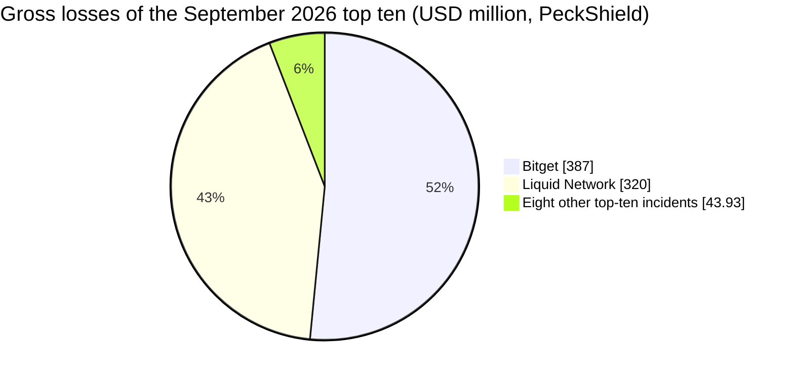
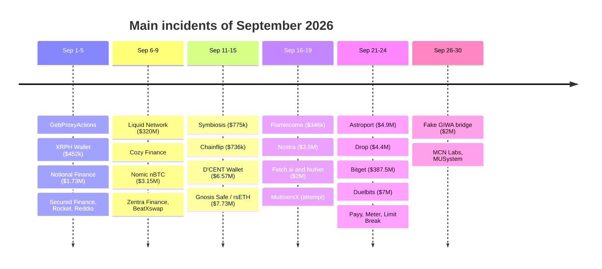
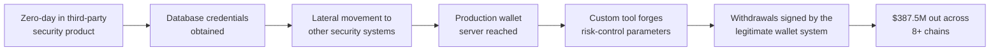
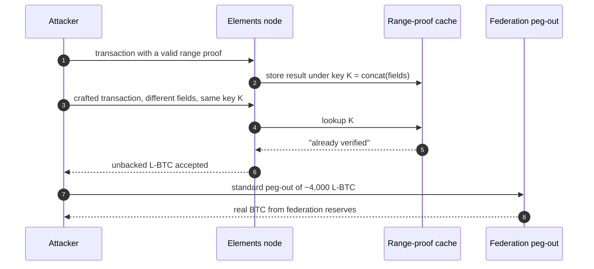

September 2026 was the worst month of the year for crypto theft. PeckShield counted 55 major hacks and $766.49M in losses, a rise of about 462% over August's $136.3M, and CertiK's dashboard settled at roughly $772.4M, the highest monthly total and the highest incident count of 2026. Two events account for almost all of it: the $387.5M drain of Bitget's hot and warm wallets, and the minting of about 4,000 unbacked L-BTC on the Liquid Network sidechain, which removed $320M of BTC from its federation reserves before most of it was returned.

The remaining fifty or so incidents are smaller and repeat a short list of failure classes: leaked or misused privileged keys, bridges that accept a message they should have rejected, contracts that let any caller spend someone else's allowance, lending markets priced from a spot oracle, and accounting code that counts the same asset twice. This article lists and summarises those incidents, grouped by root cause, using three sources: the [CryptoAlertHack](https://t.me/CryptoAlertHack) Telegram channel, a relay of alerts from SlowMist, PeckShield, CertiK, GoPlus, BlockSec Phalcon, Rekt News and others; the [SlowMist Hacked](https://hacked.slowmist.io/) database, and [Rekt News](https://rekt.news/).

> This article has been made with the help of [Claude Code](https://claude.com/product/claude-code) and several custom skills

[TOC]

## Scope, sources and caveats

The article covers incidents that **occurred** between 1 and 30 September 2026. A few events from the last days of August (Tectonic on Cronos, the Cosmos EVM chain of exploits, Aquifer on Solana) were analysed and published in September, mostly by Rekt News; they are mentioned where their follow-up matters but are not counted as September incidents.

Figures come from first alerts and are often revised. Three practical consequences:

- **Totals differ between trackers.** PeckShield reports $766.49M for 55 hacks; CertiK first posted ~$766.4M on 30 September and ~$772.4M two days later. The difference comes from scope (phishing, scams and rug pulls are counted differently) and from price snapshots.
- **Gross and net losses differ.** Liquid Network's $320M is a gross figure; 3,400 BTC were returned. PeckShield records $285M returned, CertiK about $268M, because the BTC was valued at different moments.
- **Per-incident amounts disagree.** Limit Break's Payment Processor V2 appears as $6.6M (with $3.4M returned) at PeckShield and $2.8M at SlowMist; Likwid appears as 74.31 BNB in the alert and $55,721 in the database. Where two values exist, both are given.

Exploit transaction hashes and addresses are left out of the body; they are in the linked alerts and database entries.

## September 2026 in numbers

PeckShield's top ten for the month:

| Rank | Incident | Reported loss | Root cause (summary) |
|:---:|----------|--------------:|----------------------|
| 1 | Bitget | $387M | Zero-day in a third-party security product, then abuse of the wallet withdrawal system |
| 2 | Liquid Network | $320M ($285M returned) | Range-proof verification cache collision in Elements |
| 3 | MEV bot "yoink" front-run (rsETH, unknown Gnosis Safe) | $7.81M (returned) | Router authorisation bypass; the exploit was front-run by an MEV bot |
| 4 | Duelbits | $7M | Hot-wallet private key compromise |
| 5 | Payment Processor V2 (Limit Break) | $6.6M ($3.4M returned) | Stale marketplace approvals abused for zero-price NFT sales |
| 6 | D'CENT Wallet | $6.57M | Abnormal transfers from the mobile software wallet, cause under investigation |
| 7 | Astroport | $4.9M | Probable theft of contract admin privileges on Neutron |
| 8 | Drop | $4.4M | Malicious governance proposal |
| 9 | Nostra Finance | $3.5M | Oracle manipulation of the NSTR price |
| 10 | Nomic nBTC bridge | $3.15M | Double spend through the custom forwarding mechanism |

Two incidents represent about 92% of the gross total. Without Bitget and Liquid, September's losses are about $59M, which is in the range of a normal month in 2026. Net of the Liquid return, the month still lost roughly $480M.

The month's timeline, by date of the incident:

## The two incidents that define the month

### Bitget ($387.5M), an infrastructure compromise

On 24 September, unauthorised transfers emptied part of Bitget's hot and warm wallets. The exchange first reported $351.6M, then revised the figure to [$387.5M](https://rekt.news/bitget-rekt). The stolen assets spanned Ethereum, the XRP Ledger, BNB Chain, Arbitrum, Optimism, Base, Avalanche, Tron and other networks; about 103 million XRP (around $157.5M) was the largest single position.

According to SlowMist's analysis relayed by Rekt News, the attacker started on 31 August by exploiting a zero-day in an unnamed third-party security product. From there it took database credentials, moved laterally to other security systems and reached the production wallet server. Mandiant confirmed "unauthorized privileged access to third-party security appliances". SlowMist recovered a custom withdrawal tool that forged risk-control parameters and submitted withdrawal requests through the wallet's normal flow.

No private key was stolen. The wallet system signed what its own back end asked it to sign, so key protection, however strong, did not apply. Freezes by Circle and Tether (about $339k) and a halt by NEAR Intents ($503k) covered roughly 0.22% of the loss. TRM Labs found links between the laundering routes and networks used in earlier North Korea-linked thefts; attribution is not confirmed. The [general threat model of an exchange]({{site.url_complet}}/2025/11/06/crypto-exchange-security-overview/), with its hot/warm/cold separation, assumes the withdrawal path itself is trusted, which is the assumption this attack broke.

### Liquid Network ($320M), a consensus-level software bug

[Liquid](https://liquid.net/) is a Bitcoin sidechain run by a federation and built on Blockstream's [Elements](https://elementsproject.org/) software. Its L-BTC is pegged one-to-one to BTC held by the federation, and it hides amounts with confidential transactions, so every output carries a range proof showing the hidden amount is not negative.

On 6 September an attacker minted about 4,000 unbacked L-BTC and pegged it out to real BTC, taking the federation's reserves from about 4,205 BTC to about 197 BTC. The root cause, as described in the [Rekt News post-mortem](https://rekt.news/liquid-network-rekt), was in Elements' range-proof verification cache: the cache key concatenated variable-length fields without delimiters, so two different inputs could produce the same key. A proof that had been validated once could be "reused" for an output it did not cover.

The functionaries were not hacked, no key was leaked, and the peg-out worked as designed.

The attackers consolidated the BTC and left an on-chain message, "we are whitehats. contact us on chain". On 7 September they returned 3,400 BTC and kept about 598.5 BTC (15%), which they presented as a bounty. Blockstream refused the claim and called the retention "a crime, not responsible disclosure". The fix shipped in Elements v23.3.4, which hardens the range-proof cache keys.

A cache in front of a verifier is part of the verifier. An ambiguous encoding of the cache key, the same problem as hashing `a || b` without a length prefix, turns "this proof was valid for X" into "this proof is valid for anything that encodes like X".

## Infrastructure and key compromise

After Bitget, the largest group by value is off-chain: keys or privileged credentials ended up with the attacker, and the contracts executed authorised calls.

- **Duelbits ($7M, 24 Sep).** The crypto casino's hot wallets on Ethereum, BNB Chain, Tron, Solana and Bitcoin were drained in under an hour; SlowMist classifies it as a hot-wallet private-key compromise. The attacker swapped the proceeds to about 1,588 ETH.
- **D'CENT Wallet ($6.57M, 15 Sep).** Abnormal transfers from the vendor's mobile software wallet, not its hardware device. The cause had not been published at the time of writing.
- **Astroport ($4.9M, 22 Sep).** A security incident on Neutron that may have exposed the admin privileges of the DEX contracts.
- **SingularityNET keyring (about $2.3M, 19-20 Sep).** One attacker drained 8.7M FET (~$1.53M) from the Fetch.ai bridge and minted 408.5M NTX (~$463k) on NuNet, then went after AGIX, WMTX and CGV. BlockSec Phalcon traced it to two leaked privileged accounts, including a deployer. SlowMist's analysis of the Fetch.ai `TokenConversionManagerV3` shows why one key was enough: `conversionIn()` relied on a single EOA's ECDSA signature, had no `checkLimits` modifier (present on `conversionOut()`), and verified no burn or lock proof on the other side. [Rekt News](https://rekt.news/singularitynet-rekt) traced the access to SingularityNET's cloud infrastructure, from which valid bridge signatures were produced.
- **Smaller key incidents.** Dominion Market lost $238k when 3 of the 5 keys of its Solana treasury multisig were compromised; the owner of WealthManagementV2 on BSC was replaced, and the new owner set `period = 0` and a 528,300,000 interest multiplier through an unbounded, non-timelocked `updatePlanConfig` ($26k); about 4,011 XRPH Wallet accounts were emptied through leaked seed phrases ($452k); and a software flaw let an attacker empty a few dozen custodial accounts at Blink Wallet.

Dedaub's classification of 135 Rekt News incidents from January 2024 to August 2026, posted on 28 September, gives the context: stolen keys, phishing, malware and privileged access made up 32.6% of incidents and 66.9% of losses. September fits that pattern, with Bitget alone above the rest of the month combined.

## Bridges and sidechains

Besides Liquid, seven bridge-type systems were hit in September. In each case the destination side accepted a message that did not correspond to a real deposit, which is the failure class described in the article on [cross-chain bridge hacks]({{site.url_complet}}/2026/07/31/cross-chain-bridge-hacks/).

| Date | System | Loss | What the bridge accepted |
|------|--------|-----:|--------------------------|
| 9 Sep | Nomic nBTC → Osmosis | $3.15M | A double spend through Nomic's custom forwarding logic minted 40.65 unbacked nBTC, leaving Osmosis' allBTC short. Discovery came 74 days late; 22.65 allBTC was frozen, about 18 BTC-equivalent reached Tornado Cash ([Rekt](https://rekt.news/nomic-rekt)). |
| 11 Sep | Symbiosis (BridgeV2, Bitcoin side) | $775k | Incorrectly parsed Bitcoin transaction data combined with negative fee settings. |
| 12 Sep | Chainflip | $736k | A custom TRON memo attached to a transaction already signed by validators made one deposit count again as a separate failed swap. |
| 14 Sep | Long bridge (Robinhood Chain vault) | $118k | A third-party RPC fed the keeper fabricated Arc withdrawal events; 46.79 WETH was released. |
| 24 Sep | Meter Passport | $2.3M | Over 1B unbacked wrapped MTRG minted on BNB Chain and partly sold on PancakeSwap; MTRG fell 74%. |
| 24 Sep | Payy Network rollup | $1.83M | The Ethereum bridge was emptied of USDC. BlockSec Phalcon observed burns with all-zero `burn_hash` values passing `verifyRollup`; whether this is a circuit flaw or compromised infrastructure is not yet known. |
| 26 Sep | Fake GIWA bridge | $2M | Not an exploit: scammers deployed a fake GIWA L2 network, and about 1,335 addresses bridged ~767.65 ETH to it. |

The Long bridge case shows that a bridge's trust boundary includes its data providers: the keeper was honest, but it read events from an RPC endpoint that lied. The Payy case, if it turns out to be a verifier problem, would add to the list of [zero-knowledge proof failures in bridges]({{site.url_complet}}/2026/06/19/zkp-cross-chain-bridge-hacks/).

### The Cosmos EVM tail

A Cosmos EVM underflow bug, patched publicly in May but not released until 19 August, kept producing losses. Cosmos Labs reported six chains exploited after it had confirmed that all Cosmos EVM chains were affected. Rekt News published four post-mortems on this chain in the first half of September:

- **MANTRA** (published 31 Aug): 720M MANTRA, about $3.6M; 94.7% had reached an exchange before the halt.
- **TAC** (1 Sep): 2.985B TAC (~$7.5M) from its bonded-token pool; the chain halted four hours too late.
- **KiiChain** (2 Sep): 148.3M KII (~$9.7M at pre-exploit price); 54.4% immobilised on-chain, the rest bridged to BNB Chain.
- **Nesa** (11 Sep): 257.7M NES (nominally ~$50M) bridged to Ethereum; Bubblemaps estimated the attacker's net profit at $60k after slippage.

The Nesa figure shows how far nominal and realisable losses can diverge for an illiquid token.

## Smart contract vulnerabilities

### Arbitrary calls and allowance abuse

The most frequent on-chain pattern of the month was a contract that holds users' ERC-20 approvals, or a Safe module role, and lets any caller choose whose funds move.

- **Unknown Gnosis Safe ($7.73M, 15 Sep).** In the `multicall(address, bytes[])` function of a router, the `_contract` parameter could be set to `address(this)`, which made the internal `_isAuthorized` check return `true` unconditionally. The victim's Safe module then executed attacker calldata via `DELEGATECALL` and pushed aEthrsETH into an attacker pool equipped with a Uniswap v4 hook. The attacker was itself front-run: an MEV bot, "yoink", copied the transaction and took the ~$7.81M; PeckShield lists the funds as returned. BlockThreat summarised the week as "a hacker lost $7.8M to a faster bot".
- **ether.fi Liquid AtomicQueue (11 Sep).** `AtomicQueue.solve()` did not check that the caller-supplied `solver` was `msg.sender`, so the attacker forced a victim address to act as solver, and the queue called `transferFrom(solver, …)` against that victim's existing allowance. SlowMist reports ~15.45 ETH; the database records $38,130.
- **BSC DEX router (7 Sep, $46k).** `uniswapV3SwapCallback` did not authenticate that `msg.sender` was a real V3 pool from a trusted factory, nor bind the `payer` to the original swap. A fake pool named 29 victims as payers.
- **Internet Token (21 Sep, $265k).** The `LiquidityUnifier` on Base trusted a caller-supplied Uniswap V3 pool address; a fake pool callback minted about 925M INT.
- **Bonfire (16 Sep, ~$50k)**, **GaslessReservoirEnabler (21 Sep, ~$23k, 997 victims on Polygon)**: router or executor functions that let the caller set `from` without checking `msg.sender == from` or binding the transfer to an authorised owner.
- **Nimiq (16 Sep, $50k).** `ERC20PermitHTLCHandler.execute()` discarded its signature and nonce parameters; the only check sat in `preRelayedCall()`, which the GSN RelayHub invokes on the paymaster the attacker chose. The attacker registered as a relay for 1 MATIC, forged `request.from = victim`, and redeemed the HTLC with a secret it controlled.
- **Limit Break Payment Processor V2 (24 Sep).** Stale Magic Eden EVM marketplace approvals let the attacker take blue-chip NFTs through zero-price sales.
- **Startale (16 Sep, $2.9k)**, an [ERC-7579](https://eips.ethereum.org/EIPS/eip-7579) smart account, was exploited through a transient-storage initialisation flag in `initializeAccount`; **GebProxyActions (2 Sep, ~5.94 ETH)** let anyone call `quitSystem` on SAFEs whose owner had previously called it directly instead of through a DSProxy.

The common lesson is that an approval to a router or a module role on a Safe delegates authority to every code path of that contract. A single missing `msg.sender` binding in any of them is enough.

### Oracle and price manipulation

Spot-price oracles remained a reliable source of losses.

- **Nostra ($3.5M, 17 Sep, Starknet).** A rigged pool fed the oracle an NSTR price 8,306 times its real value, unlocking a $3.5M borrow. Pragma, the oracle provider, says it had warned Nostra the feed was high-risk; the money market was still paused without a post-mortem when [Rekt](https://rekt.news/nostra-rekt) published.
- **Spiral (14 Sep, ~10.7 ETH).** `SpiralHookV2.borrow()` valued collateral from the Uniswap v4 `getSlot0()` spot price. A `noSameBlockSwap` guard keyed on `tx.origin` was bypassed with six EOAs.
- **BeatXswap (9 Sep, $77.5k)**, **Float Protocol (31 Aug, $28k)**: Uniswap V3 `slot0` used as the only price, with no TWAP or deviation bound, combined with a flash loan.
- **Enso / DPI strategy vault (9 Sep, ~5.6 ETH).** The registry's `fee` field was reused as the TWAP `secondsAgo`, giving a near-spot window on an imbalanced pool; 0.683 WETH of FARM was valued at 6.3 WETH.
- **Flamincome (16 Sep, $345.9k).** A strategy counted a permissionlessly injectable Convex reward-pool balance as its own assets and valued the USDP/3CRV LP with Curve's `get_virtual_price()` in a depegged pool.
- **Rocket (5 Sep, $287k).** Self-trading on dormant perpetual markets at artificial prices created fake profits whose losses were socialised.

The Tectonic incident of 30 August belongs to the same class at a much larger scale: the attacker pumped TONIC about 300 times and borrowed $120.4M against it, Cronos rolled back 10,961 blocks to recover $111.2M, and $9.19M left the chain ([Rekt](https://rekt.news/tectonic-rekt)). In September, 2,658.9 ETH (~$6.65M) of it was deposited into Tornado Cash.

### Accounting and logic flaws

The rest of the contract incidents are bookkeeping errors, often scaled with a flash loan:

| Date | Protocol | Loss | Flaw |
|------|----------|-----:|------|
| 4 Sep | Notional Finance | $1.73M | Two `mintfCashPair()` calls created a -2^128 liability, truncated to 0 by an unsafe `uint128()` downcast in free-collateral valuation. |
| 5 Sep | Secured Finance | $180k | The order book treated unfilled orders as filled. |
| 5 Sep | Reddio | ~9.25 ETH | The same stETH backed both rsvETH and rsvstETH vaults (double counting). |
| 5 Sep | Dream Health Chain | $71.9k | A claimed award could be reset to claimable for 0-1 wei and paid again. |
| 7 Sep | Cozy Finance | $160k | Triggers accepted any undisputed UMA Optimistic Oracle "YES" as proof of an attack, with no holder snapshot. |
| 9 Sep | Zentra Finance (Citrea) | $140k | Accounting flaw in `repayWithATokens`. |
| 9 Sep | Amnext | $116k | Mass minting of lottery tickets. |
| 11 Sep | OMNI404 | 2.4 WETH | `transfer()` treated values ≤ 50 as NFT IDs but moved 1e18 units, while the pool accounted wei. |
| 11 Sep | ORBToken | $32.6k | Tax-free sells through a whitelisted core contract with no reentrancy guard, then `burnLP` and `sync()`. |
| 18 Sep | Likwid | 74.31 BNB | The leverage-0 borrow path never updated `pairReserves`, so the same quote repeated 14 times. |
| 21 Sep | DoinGud | ~$35k | `acceptOffer` paid out without deleting the offer, so it was replayed. |
| 21 Sep | RWC Token | $109k | Unprotected burn of the pair's balance followed by `sync()`. |
| 30 Sep | MCN Labs | $92.6k | Reward index divided by one reserve value and multiplied by another. |
| 30 Sep | MUSystem | $36.9k | First-deposit bonus counted both in the refund and the allocation. |

Most of these protocols are small or dormant, and several contracts were years old: GebProxyActions in September, then Set Protocol's vault and a 2020 MakerDAO keeper proxy in early October. This suggests attackers, possibly assisted by automated tools, are now scanning old deployments systematically. BlockThreat's week 38 issue noted "AI bug hunters found chains nobody was watching".

## Governance attacks

- **Drop ($4.4M, 22 Sep).** A malicious governance proposal moved treasury funds to the attacker.
- **Ampleforth (12 Sep, attempted).** GoPlus flagged a proposal from a freshly funded EOA asking for 2.5M USDC, nearly the whole liquid treasury, disguised as a grant. The voting power (87,238 FORTH) had been delegated 19 minutes before submission. Passing required 600,000 FORTH, about $160k at the time, against a $2.5M payout.

Both follow Term Labs (23 August, $8.5M), where near-zero voter participation let one wallet take over the vaults. Where the cost of a quorum is lower than the treasury it controls, a proposal is a cheaper attack than a code exploit.

## Attacks on users and developers

Alerts relayed by the channel in September also covered threats that target people rather than contracts:

- **Signature phishing.** A user who signed a `Permit` 922 days earlier and never revoked it lost about $97k of SYN, then another ~$122k when the phisher came back. In early October another user lost ~$170k of LINK to a `Permit2` signature, and a third ~$305k of DAI to address poisoning.
- **North Korean campaigns.** The "Contagious Interview" campaign of fake job offers and coding tests has compromised over 30,000 devices in 100+ countries and stolen at least $10.71M from 7,000+ wallets since it began. A joint report by Japan, the US, Australia and Germany described related job-seeking and laptop-farm schemes, and SentinelOne reported TraderTraitor backdoors on a victim with no crypto activity.
- **Package and extension supply chain.** MemTensor's npm and PyPI packages were compromised to steal developer secrets; two GitHub Actions from May's "Mini Shai-Hulud" campaign were re-enabled with their malicious tags; 13 Packagist packages served an iOS exploit chain that steals wallet seeds; Elastic described the "Kremlin" Chrome/Edge banking extension.
- **Commodity stealers.** Lunex (abusing an AMD driver), Psychedelic Stealer (fake Cloudflare CAPTCHA, ClickFix) and a fake LastPass installer using a Microsoft-signed driver all target browser credentials and wallet files.
- **Scams and enforcement.** The founder of Nano Labs had their X account hijacked to promote a fake token; copycat tokens appeared on day one of the Arc chain launch; US authorities disrupted the Xinbi Guarantee marketplace and froze $52.8M.

## Observations

- **Off-chain compromise dominates value.** Bitget, Duelbits, Astroport, the SingularityNET keyring and Dominion together exceed $400M. In Bitget's case no key leaked: the signing system was driven through its own back end.
- **Verification shortcuts fail at scale.** Liquid's cache, Payy's zero hashes and Chainflip's memo handling each let a verifier accept something it had never checked. These are the bugs with nine-figure potential, because they mint rather than move.
- **Allowances are a standing liability.** At least seven incidents drained users who had approved a router or module and never revoked it.
- **Spot prices are still used as oracles**, including in new Uniswap v4 hooks (Spiral) and not only in old code.
- **Recovery is mostly negotiated.** Liquid's 3,400 BTC came back through a contested "bounty", the rsETH funds through an MEV operator; freezes recovered 0.22% of Bitget's loss. Tornado Cash remained the main exit (Tectonic, Term Labs, Notional, Nomic).

## Conclusion

September 2026 lost between $766M and $772M depending on the tracker, the highest monthly total of 2026, and almost all of it in two incidents.

- **Bitget ($387.5M)** was an infrastructure compromise: a zero-day in a third-party security product led to the wallet server, and the withdrawal system signed forged requests. No private key was stolen.
- **Liquid Network ($320M)** was a software bug in Elements' range-proof cache that minted unbacked L-BTC; 3,400 BTC were returned and the remaining 598.5 BTC is disputed.
- **Keys and privileged access** account for the next largest group: Duelbits, Astroport, the SingularityNET keyring, D'CENT and several smaller cases.
- **Bridges** (Nomic, Meter, Symbiosis, Chainflip, Payy, Long) accepted messages without a matching deposit, and the Cosmos EVM underflow continued to generate post-mortems.
- **Contract bugs** were individually small and clustered around unbound `from`/`payer` parameters, spot-price oracles and double counting, often in old or dormant code.
- **Governance and social engineering** completed the month, with a $4.4M treasury proposal at Drop and continued signature phishing.

## Annex

### Key Terms

| Term | Definition |
|------|------------|
| **Hot / warm wallet** | Exchange wallets whose keys are online (hot) or semi-online (warm) to process withdrawals quickly; Bitget lost funds from both. |
| **Private key compromise** | Theft or leak of the key, seed or credentials that authorise transactions; the contract then executes the attacker's calls as legitimate. |
| **Sidechain / federation** | A separate chain pegged to a parent chain, where a group of functionaries custodies the reserves backing the pegged asset (Liquid, L-BTC). |
| **Peg-out** | The operation converting a pegged asset back into the original asset from the reserves. |
| **Confidential transaction** | A transaction whose amounts are hidden behind commitments, with a range proof attached to each output. |
| **Range proof** | A zero-knowledge proof that a committed amount lies in a valid range, which prevents creating value from negative amounts. |
| **Cache-key collision** | Two distinct inputs mapping to the same cache entry, so a result computed for one is returned for the other. |
| **Bridge** | A system that locks or burns an asset on one chain and releases or mints its representation on another based on a message or proof. |
| **Allowance (approval)** | The ERC-20 permission letting a spender contract move a holder's tokens with `transferFrom`. |
| **Permit / Permit2** | Signed off-chain approvals ([EIP-2612](https://eips.ethereum.org/EIPS/eip-2612) and Uniswap's Permit2); a phishing signature grants an allowance without an on-chain approval transaction. |
| **Safe module** | A contract authorised to execute transactions from a Safe multisig without owner signatures. |
| **Spot price / slot0** | The instantaneous pool price; it can be moved within one transaction, unlike a time-weighted average (TWAP). |
| **Flash loan** | An uncollateralised loan that must be repaid in the same transaction, used to scale price manipulation or accounting exploits. |
| **MEV front-running** | A searcher copying or reordering a pending transaction to capture its profit, as the "yoink" bot did with the rsETH exploit. |
| **Governance attack** | Using acquired or borrowed voting power to pass a proposal that transfers treasury funds. |
| **Address poisoning** | Sending dust from a look-alike address so that the victim later copies the wrong address from their history. |
| **Supply-chain attack** | Compromise of a dependency (package, extension, CI action, RPC provider) to reach its users. |

## Frequently Asked Questions

**Q: Why do PeckShield and CertiK report different September totals?**

They use different scopes and price snapshots. PeckShield counts "major hacks" ($766.49M for 55 hacks). CertiK includes exploits and phishing and updated its figure from ~$766.4M to ~$772.4M as incidents were confirmed. Both agree that September was the worst month of 2026.

**Q: In the Bitget incident, why did secure key storage not prevent the theft?**

The attacker never needed the keys. It exploited a zero-day in a third-party security product, moved to the production wallet server, and used a custom tool that forged risk-control parameters and submitted withdrawals through the normal process. The wallet system then signed transactions it believed were legitimate.

**Q: How could a cache create money on Liquid Network?**

Elements cached the result of range-proof verification under a key built by concatenating variable-length fields without delimiters. Two different transactions could produce the same key, so a proof validated for one was treated as valid for the other. The attacker used this to create about 4,000 L-BTC with no matching reserves and pegged them out to real BTC.

**Q: What do the ether.fi AtomicQueue, Bonfire, GaslessReservoirEnabler and BSC router incidents have in common?**

Each contract held users' ERC-20 allowances and exposed a path where the caller chose whose tokens were moved:

- AtomicQueue accepted any address as `solver`.
- Bonfire and GaslessReservoirEnabler did not check that `msg.sender` was the `from` address.
- The BSC router did not verify that its swap callback came from a real pool or bind the `payer` to the swap.

In all four, revoking stale approvals would have protected the victims.

**Q: Why are spot-price oracles still exploited, and what does the Spiral case add?**

A spot price (`slot0`, `getSlot0()`) can be moved within the transaction that reads it, especially with a flash loan, so any lending or minting logic based on it can be fed an arbitrary price. Spiral had a same-block guard, but keyed it on `tx.origin`, which the attacker bypassed by using six externally owned accounts. A guard that relies on caller identity does not replace a time-weighted price.

**Q: Combining the Liquid and bridge sections, what makes a "mint" bug more dangerous than a "transfer" bug?**

A transfer bug is bounded by the balance the vulnerable contract holds or is approved to spend. A mint bug, such as Liquid's unbacked L-BTC, Meter's 1B MTRG or Nomic's nBTC, creates claims on reserves held elsewhere, and its limit is the liquidity available to redeem or sell them. That is why the largest non-custodial incident of the month, Liquid, minted value rather than moved it, as did the Cosmos EVM exploits that preceded it.

## References

### Telegram channel and alert sources

- [CryptoAlertHack Telegram channel](https://t.me/CryptoAlertHack), September 2026 messages (relay of the sources below)
- [PeckShieldAlert: September 2026 monthly summary](https://x.com/PeckShieldAlert/status/2105505048377848307)
- [CertiK Alert: September 2026 losses](https://x.com/CertiKAlert/status/2105266411358634360) and [CertiK report dashboard](https://www.certik.com/certik-report/dashboard)
- [CertiK: Liquid Network incident analysis](https://www.certik.com/blog/liquid-network-incident-analysis)
- [BlockSec Phalcon: SingularityNET, Fetch.ai and NuNet alert](https://x.com/Phalcon_xyz/status/2101520178047787148)
- [BlockSec Phalcon: Payy Network alert](https://x.com/Phalcon_xyz/status/2103114775324733816)
- [GoPlus Security: Ampleforth proposal alert](https://x.com/GoPlusSecurity/status/2099356365613593053)
- [SlowMist: Notional Finance hack analysis](https://slowmist.medium.com/the-vanishing-debt-an-analysis-of-the-notional-finance-hack-a79b00fa2e47)
- [Dedaub: OpSec research on 135 Rekt incidents](https://go.dedaub.com/opsec-research)

### Databases and post-mortems

- [SlowMist Hacked database](https://hacked.slowmist.io/), September 2026 entries
- [Bitget - Rekt](https://rekt.news/bitget-rekt)
- [Liquid Network - Rekt](https://rekt.news/liquid-network-rekt)
- [SingularityNET - Rekt](https://rekt.news/singularitynet-rekt)
- [Nostra - Rekt](https://rekt.news/nostra-rekt)
- [Nomic - Rekt](https://rekt.news/nomic-rekt)
- [Tectonic - Rekt](https://rekt.news/tectonic-rekt)
- [Nesa - Rekt](https://rekt.news/nesa-rekt)
- [KiiChain - Rekt](https://rekt.news/kiichain-rekt)
- [TAC - Rekt](https://rekt.news/tac-rekt)
- [Mantra - Rekt](https://rekt.news/mantra-rekt)

### Threat reports

- [The Hacker News: Contagious Interview campaign](https://thehackernews.com/2026/09/contagious-interview-campaign.html)
- [The Hacker News: Cosmos EVM flaw exploited](https://thehackernews.com/2026/08/cosmos-evm-flaw-exploited-after-cosmos.html)
- [The Hacker News: US disrupts Xinbi Guarantee](https://thehackernews.com/2026/09/us-disrupts-xinbi-guarantee-scam.html)
- [Socket: MemTensor npm and PyPI compromise](https://socket.dev/blog/memtensor-compromise)
- [Socket: Mini Shai-Hulud GitHub Actions](https://socket.dev/blog/mini-shai-hulud-actions)

### Standards and projects

- [Elements project](https://elementsproject.org/) and [Liquid Network](https://liquid.net/)
- [EIP-2612: Permit extension for EIP-20 signed approvals](https://eips.ethereum.org/EIPS/eip-2612)
- [ERC-7579: Minimal Modular Smart Accounts](https://eips.ethereum.org/EIPS/eip-7579)
- [Claude Code](https://claude.com/product/claude-code)

### Related articles

- [Security of Cryptocurrency Exchanges - Overview]({{site.url_complet}}/2025/11/06/crypto-exchange-security-overview/)
- [Cross-Chain Bridge Hacks - Ten Incidents, Five Failure Classes]({{site.url_complet}}/2026/07/31/cross-chain-bridge-hacks/)
- [Cross-Chain Bridge Threat Model - Assets, Trust Boundaries, STRIDE and Threat Register]({{site.url_complet}}/2026/07/31/cross-chain-bridge-threat-model/)
- [Zero-Knowledge Proof Failures in Cross-Chain Bridges — Exploits, Vulnerabilities, and Bug Bounties]({{site.url_complet}}/2026/06/19/zkp-cross-chain-bridge-hacks/)
- [Tornado Cash Circuits - Overview]({{site.url_complet}}/2025/11/19/tornado-cash-overview/)
