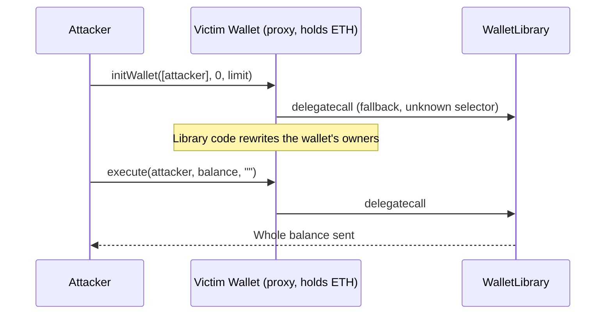
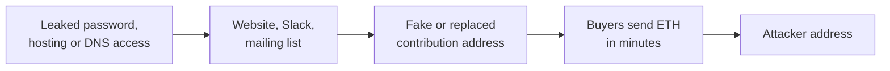

The [recap of the 2017 crypto hacks]({{site.url_complet}}/2026/10/07/crypto-hacks-2017/) summarises each incident in one line: "the wallet initialiser could be called again", "the library was never initialised and was destroyed", "`blockhash` returns zero for old blocks", "the sale address was replaced on the website". This companion article explains those mechanisms for a developer who writes Solidity, knows how proxies and ERC-20 tokens work, and wants to see what exactly broke.

2017 gave Ethereum its most influential smart-contract incidents after the DAO: the two Parity multisig failures, whose lessons are now built into every proxy pattern. The rest of the year's losses came from around the contracts, through ICO websites, domains, email accounts and exchange networks. The technical articles on [2018]({{site.url_complet}}/2026/10/07/crypto-hacks-2018-technical-concepts/) and [2019]({{site.url_complet}}/2026/10/07/crypto-hacks-2019-technical-concepts/) continue the series.

> This article has been made with the help of [Claude Code](https://claude.com/product/claude-code) and several custom skills

> **About the code.** The Parity snippets follow the verified contract sources, shortened; the others are simplified to show the mechanism. Read the linked analyses for the exact contracts.

[TOC]

## Proxies and shared libraries: the two Parity incidents

Parity's multisig wallet was split in two to save gas. Each user deployed a small `Wallet` contract that held the ETH and the wallet's state, and forwarded every call it did not recognise to one shared `WalletLibrary` with `delegatecall`, so the library's code ran on the wallet's own storage:

```solidity
// Wallet (the per-user contract), shortened from the verified source
function() payable {
    if (msg.value > 0)
        Deposit(msg.sender, msg.value);
    else if (msg.data.length > 0)
        _walletLibrary.delegatecall(msg.data);   // any unknown call runs library code on this wallet's storage
}
```

### July: an initialiser anyone could call again (~153,000 ETH)

In the version deployed before July 2017, the library's set-up functions were ordinary public functions, with no access control and no "already initialised" guard:

```solidity
// WalletLibrary (July 2017 version), shortened from the verified source
function initWallet(address[] _owners, uint _required, uint _daylimit) {
    initDaylimit(_daylimit);
    initMultiowned(_owners, _required);
}

function initMultiowned(address[] _owners, uint _required) {
    m_numOwners = _owners.length + 1;
    m_owners[1] = uint(msg.sender);
    m_ownerIndex[uint(msg.sender)] = 1;
    // ... add _owners ...
    m_required = _required;
}
```

The wallet constructor called `initWallet` once. But because the fallback forwarded any unknown call, anyone could send `initWallet([attacker], 0, ...)` to a live wallet: the call reached the library through `delegatecall`, ran on the wallet's storage, and replaced its owners with the attacker. A single `execute(attacker, balance, "")` then emptied it. The attacker drained [153,037 ETH](https://www.openzeppelin.com/news/on-the-parity-wallet-multisig-hack-405a8c12e8f7) (~$31M) from three multisig wallets that held the funds of past token sales. Parity's [post-mortem](https://www.parity.io/the-multi-sig-hack-a-postmortem/) counts 596 vulnerable wallets; the self-titled White Hat Group used the same bug to take control of the others before the attacker could, intending to return them to their owners.



### November: an uninitialised library that could be destroyed (~514,000 ETH frozen)

The fix added an `only_uninitialized` modifier, which checks that the storage has no owners yet:

```solidity
// WalletLibrary (post-July version), shortened from the verified source
modifier only_uninitialized { if (m_numOwners > 0) throw; _; }

function initWallet(address[] _owners, uint _required, uint _daylimit) only_uninitialized {
    initDaylimit(_daylimit);
    initMultiowned(_owners, _required);
}

function kill(address _to) onlymanyowners(sha3(msg.data)) external {
    suicide(_to);
}
```

That protected every wallet, whose storage had owners. It did not protect the library itself: the library contract had never been initialised in its own storage, so its `m_numOwners` was zero. On 6 November, a user called `initWallet` directly on the library, became its sole owner, and then called `kill`, which self-destructed it.

Every Parity multisig deployed after 20 July now delegated to an address with no code: [587 wallets holding 513,774.16 ETH](https://www.parity.io/a-postmortem-on-the-parity-multi-sig-library-self-destruct/) could no longer execute any transaction. The user, posting as "devops199", reported it in a [GitHub issue](https://github.com/openethereum/parity-ethereum/issues/6995) titled "anyone can kill your contract". Nothing was stolen; the funds were frozen, and [EIP-999](https://eips.ethereum.org/EIPS/eip-999), which proposed restoring the library's code through a protocol change, is listed as withdrawn.

The two incidents teach the rules every proxy pattern now follows:

- **Initialise in the same transaction as deployment**, and guard initialisers so they run once.
- **Initialise or disable the implementation itself**, so nobody can take it over (OpenZeppelin's `_disableInitializers()` in the implementation constructor).
- **No `selfdestruct` or `delegatecall` to arbitrary targets in an implementation**, since anything that destroys it destroys every proxy that depends on it.
- **Do not forward every unknown call** to a library; expose an explicit list of functions.

## Contract code

### `blockhash` returns zero for old blocks (SmartBillions)

SmartBillions, a lottery contract that offered a public hacking challenge, decided bets with the hash of a block mined after the bet:

```solidity
// Simplified lottery pattern
function settle(uint betId) public {
    Bet storage b = bets[betId];
    bytes32 h = block.blockhash(b.blockNumber + 1);   // zero if that block is more than 256 blocks old
    uint result = uint(h) % 1000;
    if (result == b.guess) payout(b.player);
}
```

The EVM only exposes the hashes of the most recent 256 blocks; for older ones `blockhash` returns zero. An attacker who bet on the outcome that a zero hash produces, then waited more than 256 blocks before settling, won with certainty. About 400 ETH left the contract during the challenge ([crypto.news](https://crypto.news/blockchain-lottery-smartbillions-hacked-for-120000/), [Security Boulevard](https://securityboulevard.com/2018/01/predicting-random-numbers-in-ethereum-smart-contracts/)). Code that settles on a block hash must settle within 256 blocks or treat an expired bet as void, and block hashes are a weak source of randomness anyway: the [2018 technical article]({{site.url_complet}}/2026/10/07/crypto-hacks-2018-technical-concepts/) covers Fomo3D's version of the problem.

### One character (Zcoin, and HackerGold before it)

HackerGold's token, audited in October 2016, contained this line in `transferFrom`:

```solidity
balances[_to] =+ _value;    // assigns +_value; should be  balances[_to] += _value;
```

`=+ _value` parses as `= (+_value)`, so the recipient's balance was replaced by the amount transferred instead of increased by it; one address fell from 5,000,000 HKG to 0.001 HKG, and the token was reissued. In February 2017, Zcoin suffered a similar one-character error in its Zerocoin implementation: an extra character let an attacker reuse valid proofs and spend the same coins several times, creating about 370,000 XZC ([The Hacker News](https://thehackernews.com/2017/02/zcoin-zerocoin-typo.html)). Unary plus was removed from Solidity in version 0.5, and linters flag `=+`; the general lesson is that invariant tests (total supply equals the sum of balances) catch typos that review misses.

## ICO and wallet front ends

### The address on the sale page (CoinDash, Enigma)

An ICO in 2017 typically published a contribution address on its website and announced the start time on Slack, Telegram and by email. Thousands of buyers sent ETH within minutes. Attackers went after that publication path:

- **CoinDash.** The website was hacked as the sale opened and the address replaced; buyers sent between 37,000 and about 43,400 ETH to the attacker ([Security Affairs](https://securityaffairs.com/61126/cyber-crime/coindash-cyber-heist.html)).
- **Enigma.** Attackers took over the project's website, Slack channel and mailing lists before its sale and announced a fake presale with their own address ([Help Net Security](https://www.helpnetsecurity.com/2017/08/22/enigma-cryptocurrency-hack/)).



The defences that followed are now common: the sale address is a contract whose address is published in advance in several independent channels, such as a signed message, the project's ENS name and a blog post; buyers are told the address will never change during the sale, and team accounts on email, hosting, DNS and chat use hardware second factors.

### Domains and wallet sites (Classic Ether Wallet, EtherDelta, mybtgwallet)

Classic Ether Wallet lost its domain when an attacker convinced its hosting provider to hand it over; EtherDelta's DNS was hijacked; in both cases users loaded a page that sent their keys to the attacker ([BleepingComputer](https://www.bleepingcomputer.com/news/security/classic-ether-wallet-hacked-users-report-massive-losses), [Security Affairs](https://securityaffairs.com/67146/cyber-crime/exchange-etherdelta-dns-attack.html)). mybtgwallet went further: it was a wallet site promoted on the official Bitcoin Gold website, and it recorded users' private keys when they used it to claim their new coins ([TNW](https://thenextweb.com/news/bitcoin-gold-breach-cryptocurrency), [Bitcoin.com News](https://news.bitcoin.com/bitcoin-gold-wallet-stole-private-keys-scooped-3-3-million/)). A web wallet that receives private keys is only as safe as every server, domain and link in front of it, which is why hardware wallets and signing without exporting keys became the norm.

## Custody and issuers

### Spear phishing, then the network (NiceHash)

NiceHash's [investigation update](https://web.archive.org/web/2018id_/https://www.nicehash.com/news/niceHash-security-breach-investigation-update) describes the classic path of an intrusion into a company: a spear-phishing email gave the attacker a foothold, stolen VPN credentials let them move through the data centre, and the hot wallet's keys were within reach of that network. Group-IB describes the same pattern, with malicious documents sent as job applications, in the attacks on Korean exchanges it attributes to Lazarus ([Security Affairs](https://securityaffairs.com/77213/hacking/cyber-attacks-crypto-exchanges.html)). The defences are network ones: wallet-signing systems on an isolated network, no VPN path from staff machines to them, and hardware-backed keys that require several people to approve large transfers.

### An issuer's freeze through a client release (Tether)

USDT on Bitcoin in 2017 was an Omni Layer token: Bitcoin transactions carried Omni data, and balances were computed by Omni software. When $30,950,010 USDT was taken from the treasury wallet, Tether [announced](https://tether.to/tether-critical-announcement/) it would not redeem the tokens and released new builds of the Omni software for exchanges, so that the stolen tokens would be treated as invalid. An issuer controlling the software that interprets balances can freeze tokens without touching the underlying chain; on Ethereum, the same power is a `blacklist` or `pause` function in the token contract, used by USDT and USDC today.

## Protocol bugs

### Inflation through a race (Stellar)

In April 2017, an attacker exploited a race condition in the code of one of Stellar's operations about 110 times and created about 2.25B XLM, which were sold on exchanges. The bug was fixed quietly and disclosed only in 2019; the Stellar Development Foundation burned an equal amount of XLM from its own holdings ([The Block](https://www.theblock.co/post/17389/report-stellar-suffered-a-2-2-billion-xlm-inflation-bug-in-2017)). Supply invariants, such as the sum of all balances never exceeding total issuance, should be checked continuously by monitoring, not only by tests: Stellar's inflation was found after the coins had been sold.

## Summary: from incident to concept

| Incident (2017) | Concept | Section |
|-----------------|---------|---------|
| Parity (July) | Fallback forwarding every call; initialiser callable again | Proxies and shared libraries |
| Parity (November) | Uninitialised library taken over and self-destructed | Proxies and shared libraries |
| SmartBillions | `blockhash` returns zero after 256 blocks | Contract code |
| Zcoin, HackerGold | One-character typos | Contract code |
| CoinDash, Enigma | Sale address replaced through the website or team accounts | ICO and wallet front ends |
| Classic Ether Wallet, EtherDelta, mybtgwallet | Domain hijacks and key-collecting wallet sites | ICO and wallet front ends |
| NiceHash, Korean exchanges | Spear phishing, then lateral movement to wallets | Custody and issuers |
| Tether | Issuer freeze through the client that computes balances | Custody and issuers |
| Stellar | Race condition minting new coins | Protocol bugs |

## Data gaps

This section lists what could not be found or verified while writing this article, so that it can be completed later. Each row says what is missing and where to look first.

| Gap | What is missing or unverified | Where to search |
|-----|-------------------------------|-----------------|
| SmartBillions | The snippet is a generic lottery pattern; the exact SmartBillions code was not reviewed. | Etherscan source of the SmartBillions contract |
| HackerGold | The date the bug surfaced was not confirmed; it may be 2016 rather than 2017. | Ether.Camp announcements, the HKG contract |
| Zcoin | The exact typo in the Zerocoin code was not reviewed. | Zcoin GitHub history, February 2017 |
| Stellar | The operation affected (`MergeOpFrame::doApply`) and the 110 exploits come from Messari's report through press. | Stellar Development Foundation statement, Messari report |
| Defences | The ICO and custody recommendations are general practice, not taken from the projects' post-mortems. | Project statements |

## Conclusion

The 2017 hacks put two lessons into every later smart-contract design and one into every token sale:

- **Proxies and shared libraries** need initialisers that run once and cannot be reached through a catch-all fallback, an implementation that is initialised or locked itself, and no `selfdestruct`: Parity lost 153,037 ETH to the first failure and froze 513,774 ETH through the second.
- **Contract code** failed on EVM limits (`blockhash` after 256 blocks) and single characters (`=+`).
- **ICO and wallet front ends** were the weakest link: replaced sale addresses, hijacked domains and wallet sites that collected keys.
- **Custodians** were reached through spear phishing and their own networks, while an issuer showed it could freeze tokens through software.
- **Protocols** could inflate their own supply through a race condition, unnoticed until the coins were sold.


## Annex

### Key Terms

| Term | Definition |
|------|------------|
| **delegatecall** | A call that runs the target's code on the caller's storage, used by Parity wallets to share one library. |
| **Fallback function** | The function a contract runs when no other function matches the call; Parity's forwarded everything to the library. |
| **Initialiser** | A function that sets up a contract after deployment, in place of a constructor; it must run once. |
| **Implementation (library) contract** | The contract holding shared code; it has its own storage, which must also be initialised or locked. |
| **selfdestruct** | An EVM operation (`suicide` in 2017 Solidity) that deletes a contract's code. |
| **blockhash** | The EVM function returning a recent block's hash; zero for blocks more than 256 blocks old. |
| **Unary plus** | The `+x` operator, which made `=+` valid Solidity until version 0.5. |
| **Contribution address** | The address buyers send funds to in a token sale. |
| **DNS hijack** | Redirecting a domain to an attacker's server. |
| **Lateral movement** | Moving from a first compromised machine to others inside a network. |
| **Omni Layer** | A protocol on Bitcoin used by USDT in 2017; balances are computed by Omni software. |
| **Supply invariant** | The rule that total balances never exceed what the protocol has issued. |

### Security Implementation Checklist

#### Proxies and libraries

| Check | Security requirement | Failure mode if violated |
|:---:|------------|------------|
| ☐ | Initialisers run once (`initializer` modifier) and are called in the deployment transaction. | Anyone re-initialises a live wallet (Parity, July). |
| ☐ | The implementation contract is initialised or locked in its constructor (`_disableInitializers()`). | Anyone takes over the implementation (Parity, November). |
| ☐ | Implementations contain no `selfdestruct` and no `delegatecall` to arbitrary addresses. | One call bricks every proxy that depends on it. |
| ☐ | Proxies forward only an explicit set of functions, or use a standard pattern (ERC-1967, UUPS). | Admin functions are reachable through the fallback. |

#### Contract code

| Check | Security requirement | Failure mode if violated |
|:---:|------------|------------|
| ☐ | Bets settled on a block hash are settled within 256 blocks or voided. | `blockhash` returns zero and the outcome is known (SmartBillions). |
| ☐ | Randomness comes from a VRF or commit-reveal, not block data. | Miners or players predict the result. |
| ☐ | Linters and invariant tests run on every token (sum of balances equals total supply). | Typos like `=+` ship (HackerGold). |

#### Token sales and front ends

| Check | Security requirement | Failure mode if violated |
|:---:|------------|------------|
| ☐ | The sale address is a contract published in advance in several independent channels and never changed. | A hijacked page diverts the sale (CoinDash). |
| ☐ | Team email, hosting, DNS and chat accounts use hardware second factors and unique passwords. | Leaked passwords give access to every channel (Enigma). |
| ☐ | Registrar locks and DNSSEC protect the domains of wallets and exchanges. | Domains are hijacked (Classic Ether Wallet, EtherDelta). |
| ☐ | Users never enter private keys or seeds into web pages, including "claim" tools. | Key-collecting sites drain wallets (mybtgwallet). |

#### Custody and protocol

| Check | Security requirement | Failure mode if violated |
|:---:|------------|------------|
| ☐ | Signing systems are isolated from staff networks and VPNs; large transfers need several approvers. | Spear phishing leads to the hot wallet (NiceHash). |
| ☐ | Token issuers have a documented freeze procedure and monitor treasury wallets. | Stolen tokens circulate before anyone reacts (Tether). |
| ☐ | Supply invariants are monitored continuously in production. | Inflation is discovered after the coins are sold (Stellar). |

Ask of every contract and every account: who can call this, and what happens if they call it twice? Parity's July failure answered "anyone, and they become the owner"; its November failure answered "anyone, and everything breaks".

## Frequently Asked Questions

**Q: Why could anyone call Parity's `initWallet` in July?**

The function had no access control and no check that the wallet was already set up, and the wallet's fallback forwarded every unknown call to the library with `delegatecall`. Sending `initWallet` to a live wallet therefore re-ran it on the wallet's storage, replacing the owners with the caller.

**Q: If the July bug was fixed, why could the library be taken over in November?**

The fix added a guard that refused initialisation once a contract had owners. Every wallet had owners, but the library contract itself had never been initialised in its own storage, so the guard did not stop anyone from initialising the library directly. Its new owner could then call `kill`.

**Q: Why did destroying one library freeze 587 wallets?**

Each wallet held its funds and state but contained almost no code: every operation, including withdrawals, was executed by `delegatecall` into the library. Once the library's code was deleted, those calls reached an address with no code and did nothing, so no wallet could move its ETH.

**Q: How do modern proxies avoid Parity's mistakes?**

They initialise the proxy in the same transaction as its deployment, use an `initializer` modifier that cannot run twice, lock the implementation in its constructor so nobody can initialise it, and avoid `selfdestruct` in implementations. The ERC-1967 and UUPS patterns and OpenZeppelin's `Initializable` encode these rules.

**Q: Why did `blockhash` let the SmartBillions attacker win?**

The EVM keeps only the last 256 block hashes accessible to contracts; for older blocks it returns zero. The lottery settled bets on the hash of a block after the bet without checking its age, so a player who waited long enough knew the hash would be zero and could bet on the matching result.

**Q: Was any 2017 smart-contract bug exploited for more than Parity's July loss?**

No theft from a contract exceeded Parity's 153,037 ETH in 2017. The larger contract event was the November freeze, which locked 513,774 ETH without anyone taking it. The year's other large losses (NiceHash, Tether, CoinDash) happened outside smart contracts.

## References

### Official post-mortems

- [Parity: the multi-sig hack, a postmortem](https://www.parity.io/the-multi-sig-hack-a-postmortem/)
- [Parity: postmortem on the multi-sig library self-destruct](https://www.parity.io/a-postmortem-on-the-parity-multi-sig-library-self-destruct/)
- [GitHub: "anyone can kill your contract" (issue 6995)](https://github.com/openethereum/parity-ethereum/issues/6995)
- [Tether: critical announcement](https://tether.to/tether-critical-announcement/)
- [NiceHash: security breach investigation update (archived)](https://web.archive.org/web/2018id_/https://www.nicehash.com/news/niceHash-security-breach-investigation-update)

### Technical analyses

- [OpenZeppelin: the Parity wallet hack explained](https://www.openzeppelin.com/news/on-the-parity-wallet-multisig-hack-405a8c12e8f7)
- [Haseeb Qureshi: a hacker stole $31M of Ether, how it happened](https://haseebq.com/a-hacker-stole-31m-of-ether/)
- [crypto.news: SmartBillions hacked](https://crypto.news/blockchain-lottery-smartbillions-hacked-for-120000/)
- [The Hacker News: Zcoin typo](https://thehackernews.com/2017/02/zcoin-zerocoin-typo.html), [The Block: Stellar inflation bug](https://www.theblock.co/post/17389/report-stellar-suffered-a-2-2-billion-xlm-inflation-bug-in-2017)
- [Security Affairs: CoinDash](https://securityaffairs.com/61126/cyber-crime/coindash-cyber-heist.html), [Help Net Security: Enigma](https://www.helpnetsecurity.com/2017/08/22/enigma-cryptocurrency-hack/), [Security Affairs: Group-IB on exchange attacks](https://securityaffairs.com/77213/hacking/cyber-attacks-crypto-exchanges.html)
- [DeFiHackLabs](https://github.com/SunWeb3Sec/DeFiHackLabs) reproductions of both Parity incidents

### Standards

- [EIP-999: restore contract code at 0x863DF6...](https://eips.ethereum.org/EIPS/eip-999)
- [ERC-1967: Proxy Storage Slots](https://eips.ethereum.org/EIPS/eip-1967)
- [OpenZeppelin: Initializable](https://docs.openzeppelin.com/contracts/4.x/api/proxy#Initializable)

### Related articles

- [Crypto Hacks of 2017 - Parity, NiceHash, Tether and the ICO Boom]({{site.url_complet}}/2026/10/07/crypto-hacks-2017/)
- [The Technical Concepts Behind the 2018 Crypto Hacks]({{site.url_complet}}/2026/10/07/crypto-hacks-2018-technical-concepts/)
- [The Technical Concepts Behind the 2021 Crypto Hacks]({{site.url_complet}}/2026/10/07/crypto-hacks-2021-technical-concepts/)
- [Programming proxy contracts with OpenZeppelin | Summary]({{site.url_complet}}/2022/10/31/proxy-contract-summary/)
