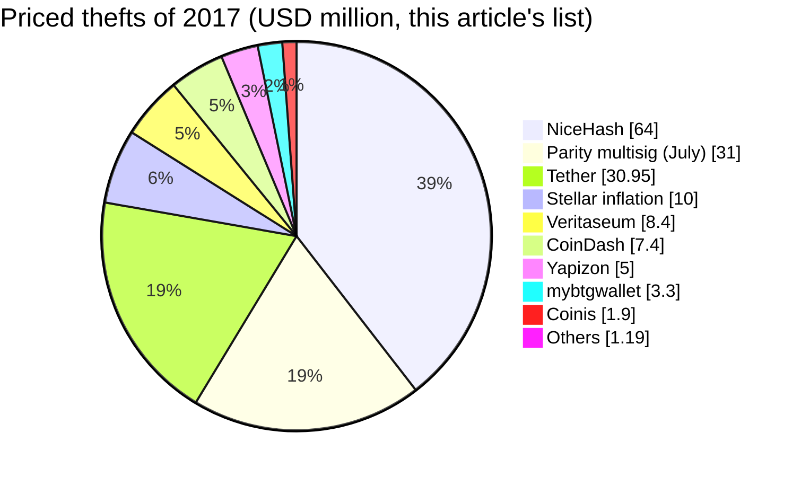
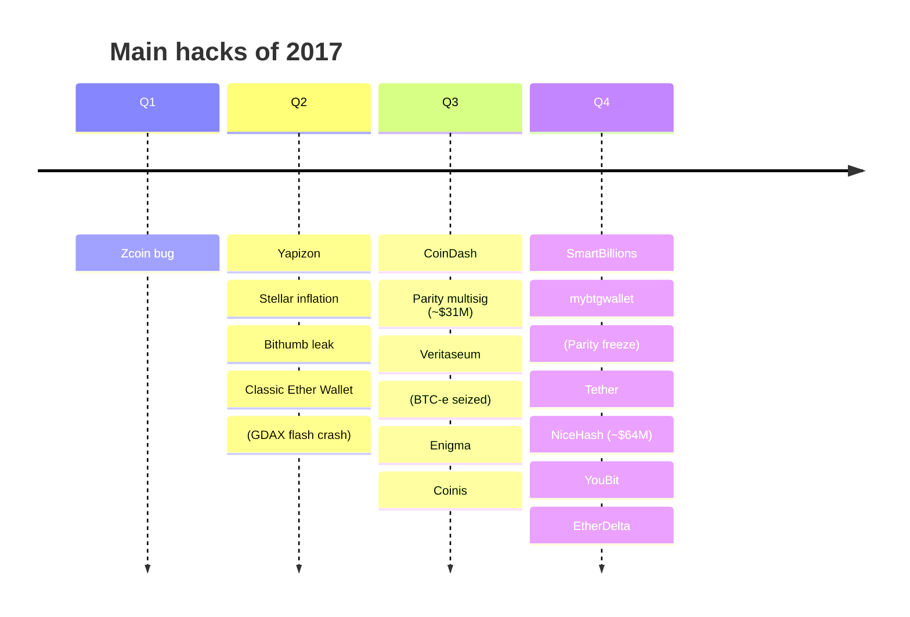
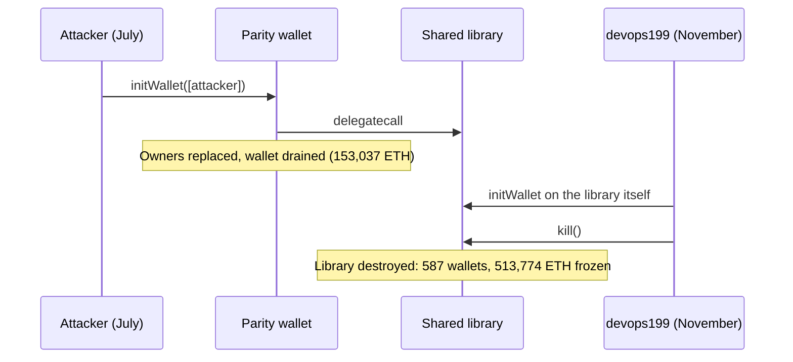

2017 was the year of the ICO boom, and attackers followed the money raised. Ernst & Young estimated that about 10% of the $3.7B raised in token sales had been lost or stolen, and Chainalysis counted about $225M lost to Ethereum scams, pushed up by phishing, by late August. CipherTrace later put thefts from exchanges at about $266M for the whole year. The largest single theft was NiceHash's ~4,736 BTC (~$64M) in December; the largest smart-contract loss, ~153,000 ETH (~$31M) taken from Parity multisig wallets in July.

The most consequential event of the year was not a theft. In November, a user took ownership of the shared library behind Parity's multisig wallets and destroyed it, freezing 513,774 ETH in 587 wallets permanently. This article reviews the year with the method of the site's `crypto-hacks` series, from the [SlowMist Hacked](https://hacked.slowmist.io/) database, the trackers' figures, official statements and analyses. Frauds (Control-Finance, PlexCoin, Confido) and accidents are kept out of the hack totals and listed separately. A companion article, [The Technical Concepts Behind the 2017 Crypto Hacks]({{site.url_complet}}/2026/10/07/crypto-hacks-2017-technical-concepts/), explains the mechanisms for Solidity and exchange developers.

> This article has been made with the help of [Claude Code](https://claude.com/product/claude-code) and several custom skills

[TOC]

## Scope, sources and caveats

The article covers incidents from 1 January to 31 December 2017. No Telegram export of the CryptoAlertHack channel was available, and Rekt News did not exist yet. The figures need five caveats:

- **The databases are thin.** SlowMist lists only ten entries for 2017, three of them priced (~$39M). DeFiLlama lists eight. The article therefore builds its own list from official statements and press, and gives the trackers' figures alongside.
- **The Parity freeze is an accident, not a theft.** Nobody took the 513,774 ETH; they became unspendable. DeFiLlama counts it as a $150M hack; this article lists it in [Accidents and enforcement](#accidents-and-enforcement) and does not count it.
- **BTC-e is an enforcement action.** SlowMist lists BTC-e at "$990M" in July, based on rumours of missing bitcoins. In fact, US authorities indicted its operator and seized the exchange for laundering, including funds from the Mt. Gox hack of 2011 to 2014. It is excluded.
- **Frauds are not hacks.** Control-Finance (≥ $147M), PlexCoin and Confido are listed in [Frauds and exit scams](#frauds-and-exit-scams) and not counted. BitConnect closed in January 2018 and is covered in the [2018 article]({{site.url_complet}}/2026/10/07/crypto-hacks-2018/).
- **USD values are approximate**, valued at the time of each report. ETH's price rose roughly a hundredfold during the year, so ETH amounts and dollar amounts tell different stories.

## 2017 in numbers

### The annual figures

| Source | Figure | Scope |
|--------|--:|------|
| CipherTrace | ~$266M | Stolen from exchanges in 2017, per its later reports ([Insurance Journal](https://www.insurancejournal.com/news/international/2018/10/12/504317.htm)) |
| Ernst & Young (Jan 2018) | ~$400M of $3.7B | ICO funds lost or stolen, more than 10% ([Fox Business / Reuters](https://www.foxbusiness.com/markets/more-than-10-of-3-7b-raised-in-icos-has-been-stolen-ernst-young)) |
| Chainalysis (Aug 2017) | ~$225M | Losses to Ethereum scams in 2017 so far, pushed up by phishing ([Fortune](https://fortune.com/2017/08/28/ethereum-cryptocurrency-stolen-bitcoin/)) |
| [Group-IB](https://securityaffairs.com/77213/hacking/cyber-attacks-crypto-exchanges.html) (Oct 2018) | $882M | 14 exchange attacks in 2017 and the first three quarters of 2018 |
| [DeFiLlama](https://defillama.com/hacks) (computed) | ~$139M | 7 thefts, without the $150M Parity freeze |
| SlowMist database (computed) | ~$39M | 8 incidents, 3 priced; BTC-e and one fraud excluded |
| This article's list | ~$163M | The 14 priced thefts below |

The figures measure different things. CipherTrace counts exchanges only; EY counts ICO losses of every kind; Chainalysis's figure covers scams against individual investors, which phishing pushed up. Group-IB attributed attacks on four Korean exchanges in 2017 (Yapizon, Coinis, YouBit and Bithumb) to North Korea's Lazarus Group, which it says used spear phishing with malicious documents. The UN Panel of Experts' report of March 2018 ([S/2018/171](https://undocs.org/S/2018/171)) does not yet mention cryptocurrency exchanges; its attributions of exchange attacks begin in 2019.

### Month by month

No tracker published monthly figures for 2017. The table groups this article's list by month.

| Month | Priced thefts (approx. USD) | Main incidents |
|-------|--:|------|
| January to March | none | Zcoin bug disclosed (February, < $1M) |
| April | ~$15M | Yapizon; Stellar inflation bug (disclosed in 2019) |
| May | none | |
| June | ~$0.3M | Classic Ether Wallet; Bithumb data leak and phishing; (GDAX flash crash) |
| July | ~$46.8M | Parity multisig, Veritaseum, CoinDash; (BTC-e seized) |
| August | ~$0.5M | Enigma |
| September | ~$1.9M | Coinis |
| October | ~$0.1M | SmartBillions |
| November | ~$34.3M | Tether, mybtgwallet; (Parity freeze) |
| December | ~$64.3M | NiceHash, EtherDelta, YouBit |

### The largest incidents

| Rank | Date | Incident | Category | Reported loss (approx. USD) | Root cause (summary) |
|:---:|------|----------|----------|--:|----------------------|
| 1 | 6 Dec | NiceHash | Mining marketplace | ~$64M (4,736 BTC) | Spear phishing, then stolen VPN credentials; repaid by 2020 |
| 2 | 19 Jul | Parity multisig | Wallet contract | ~$31M (153,037 ETH) | Wallet initialiser callable again through the fallback |
| 3 | 19 Nov | Tether | Stablecoin issuer | ~$31M (30.95M USDT) | Treasury wallet; tokens frozen through a new Omni client |
| 4 | Apr (disclosed 2019) | Stellar | L1 | ~$10M (2.25B XLM) | Race in an operation minted new XLM; burned later by SDF |
| 5 | 23 Jul | Veritaseum | ICO | ~$8.4M (VERI) | Tokens held for the sale stolen and sold |
| 6 | 17 Jul | CoinDash | ICO | ~$7.4M (37,000 to 43,400 ETH) | Sale address replaced on the hacked website |
| 7 | 22 Apr | Yapizon | CEX | ~$5M (3,816 BTC) | Four hot wallets |
| 8 | 13 Nov | mybtgwallet | Wallet site | ~$3.3M | Wallet promoted by Bitcoin Gold collected private keys |
| 9 | 23 Sep | Coinis | CEX | ~$1.9M | Hot wallet; Lazarus (Group-IB) |
| 10 | Jun | Bithumb | CEX | Tens of thousands of dollars (SlowMist: $1M) | Employee PC infected; data of 31,800 users leaked; phishing followed |
| 11 | 21 Aug | Enigma | ICO | ~$500k | Website, Slack and mailing lists taken over |
| 12 | 29 Jun | Classic Ether Wallet | Wallet site | ~$300k | Domain taken through the hosting provider |
| 13 | 20 Dec | EtherDelta | DEX | ~$266k to ~$1.4M | DNS hijack to a phishing clone |
| 14 | 5 Oct | SmartBillions | Lottery contract | ~$120k (400 ETH) | `blockhash` of old blocks returns zero |
| 15 | 19 Dec | YouBit | CEX | 17% of assets | Hot wallet; bankruptcy |

### Statistics from the SlowMist database

SlowMist's 2017 entries are too few for statistics: after excluding BTC-e and the Control-Finance fraud, eight incidents remain, and only three have an amount: Tether $31M, CoinDash $7.4M and Bithumb $1M. The database leaves out NiceHash's amount, Parity's July loss and freeze, Veritaseum, Coinis, Enigma, EtherDelta and others. The year's statistics in this article come from the list above.

## Parity: one theft and one freeze

Parity's multisig wallet stored its logic in a shared library and forwarded calls to it from each user's small wallet contract. On 19 July, an attacker called the library's set-up function through a live wallet, made themselves its owner, and emptied it; they drained [153,037 ETH](https://www.openzeppelin.com/news/on-the-parity-wallet-multisig-hack-405a8c12e8f7) from three wallets holding funds from past token sales. Parity's [post-mortem](https://www.parity.io/the-multi-sig-hack-a-postmortem/) counted 596 vulnerable wallets; the self-titled White Hat Group used the same bug to take control of the other wallets before the attacker could, with the stated aim of returning them.

On 6 November, a user found that the new library, deployed after the July fix, had never been initialised itself. They made themselves its owner and called its `kill` function, which destroyed it. Every Parity multisig deployed since 20 July depended on that library: [587 wallets holding 513,774.16 ETH](https://www.parity.io/a-postmortem-on-the-parity-multi-sig-library-self-destruct/) could no longer move funds. The user reported it in a [GitHub issue](https://github.com/openethereum/parity-ethereum/issues/6995) titled "anyone can kill your contract". [EIP-999](https://eips.ethereum.org/EIPS/eip-999), a proposal to restore the library's code through a protocol change, was not adopted and is listed as withdrawn.

## Exchanges and custodians

- **NiceHash (~$64M, December).** The mining marketplace lost 4,736 BTC. Its [investigation update](https://web.archive.org/web/2018id_/https://www.nicehash.com/news/niceHash-security-breach-investigation-update) says the attacker entered through a spear-phishing email and moved through the data centre with stolen VPN credentials; the indicators it recovered showed similarities with the methods of "a known nation-state threat actor", which it did not name. NiceHash [repaid 4,640 BTC](https://coindesk.com/business/2020/12/17/mining-market-nicehash-refunds-users-4640-bitcoin-lost-in-2017-hack/) to users by December 2020.
- **Tether (~$31M, November).** $30,950,010 USDT was [removed from the treasury wallet](https://tether.to/tether-critical-announcement/) by an external attacker. Tether announced it would not redeem the tokens and released new builds of the Omni Layer software so that exchanges would refuse them.
- **Korean exchanges.** Yapizon lost 3,816 BTC from four hot wallets in April and cut every account by the same share ([BleepingComputer](https://www.bleepingcomputer.com/news/security/hacked-south-korean-bitcoin-exchange-loses-5-5-million/)). Coinis lost about ₩2.1B in September ([TokenPost](https://www.tokenpost.kr/news/blockchain/593)). An employee's PC at Bithumb was infected, data of about 31,800 users leaked, and phishing attempts followed that took "hundreds of millions of South Korean won" according to local media cited by [Fortune](https://www.fortune.com/2017/07/05/bitcoin-ethereum-bithumb-hack); Korea's communications regulator [fined](https://www.financemagnates.com/cryptocurrency/news/south-korean-authority-fines-cryptocurrency-exchange-operator/) its operator. In December, Yapizon, renamed YouBit, lost 17% of its assets in a second attack and [filed for bankruptcy](https://asiatimes.com/2017/12/south-korean-bitcoin-exchange-declares-bankruptcy-attack/). Group-IB attributes all four to Lazarus.

## ICOs and wallet front ends

Token sales collected millions in minutes through a single address published on a website, and attackers went after the website.

- **CoinDash (~$7.4M, July).** As the sale opened, the website was hacked and its contribution address replaced. CoinDash counted 37,000 ETH from more than 2,000 buyers sent to the attacker; on-chain counts reach about 43,400 ETH. Buyers still received their tokens, and the attacker [returned about 30,000 ETH](https://www.hackread.com/hacker-returns-17-million-stolen-ethereum/) in 2017 and 2018 ([Security Affairs](https://securityaffairs.com/61126/cyber-crime/coindash-cyber-heist.html)).
- **Enigma (~$500k, August).** Before its sale, attackers took over the project's website, Slack channel and mailing lists and announced a fake presale with their own address ([Help Net Security](https://www.helpnetsecurity.com/2017/08/22/enigma-cryptocurrency-hack/)).
- **Veritaseum (~$8.4M, July).** VERI tokens the company was selling were stolen and sold on the market; the founder said "at least one corporate partner" may have been at fault ([SiliconANGLE](https://siliconangle.com/2017/07/24/another-initial-coin-offering-hacked-veritaseum-losing-8-4m/)).
- **Classic Ether Wallet (~$300k, June)** and **EtherDelta (December)** lost their domains, through the hosting provider and a DNS hijack respectively, and users were served pages that stole keys ([BleepingComputer](https://www.bleepingcomputer.com/news/security/classic-ether-wallet-hacked-users-report-massive-losses), [Security Affairs](https://securityaffairs.com/67146/cyber-crime/exchange-etherdelta-dns-attack.html)).
- **mybtgwallet (~$3.3M, November).** A wallet site promoted on the Bitcoin Gold website recorded users' private keys when they tried to claim their new coins, and the wallets were emptied overnight ([TNW](https://thenextweb.com/news/bitcoin-gold-breach-cryptocurrency), [Bitcoin.com News](https://news.bitcoin.com/bitcoin-gold-wallet-stole-private-keys-scooped-3-3-million/)).

## Contract and protocol bugs

- **SmartBillions (~$120k, October).** During a public hacking challenge, an attacker took 400 ETH from the lottery, which used `blockhash` for randomness: the EVM returns zero for blocks older than 256, so waiting made the result known ([crypto.news](https://crypto.news/blockchain-lottery-smartbillions-hacked-for-120000/), [Security Boulevard](https://securityboulevard.com/2018/01/predicting-random-numbers-in-ethereum-smart-contracts/)).
- **Stellar (April, disclosed 2019).** A race in an operation's code let an attacker mint about 2.25B XLM, which were sold; the Stellar Development Foundation burned the same amount after the fact ([The Block](https://www.theblock.co/post/17389/report-stellar-suffered-a-2-2-billion-xlm-inflation-bug-in-2017)).
- **Zcoin (February).** A one-character typo in the Zerocoin implementation let an attacker spend the same coins several times ([The Hacker News](https://thehackernews.com/2017/02/zcoin-zerocoin-typo.html)).

## Frauds and exit scams

Frauds are not hacks: no system was broken into. They are listed here and **not counted in this article's hack totals**.

| Date | Scheme | Loss (approx. USD) | What happened |
|------|--------|--:|---------------|
| May to Oct | Control-Finance | ≥ $147M (22,858 BTC) | Bitcoin "trading" Ponzi scheme; CFTC complaint in 2019 ([CFTC](https://www.cftc.gov/PressRoom/PressReleases/7938-19)) |
| Aug to Dec | PlexCoin | up to $15M | ICO promising very high returns; the first case of the SEC's Cyber Unit ([SEC](https://www.sec.gov/news/press-release/2017-219)) |
| Nov | Confido | ~$375k | ICO team disappeared weeks after the sale ([TNW](https://thenextweb.com/news/cryptocurrency-exit-scam-confido)) |
| Jan 2018 | BitConnect | multi-billion | Lending scheme closed in January 2018 ([TechCrunch](https://techcrunch.com/2018/01/16/bitconnect-which-has-been-accused-of-running-a-ponzi-scheme-shuts-down/)) |

## Accidents and enforcement

Accidents are losses with no attacker; enforcement actions are seizures by authorities. Neither is counted.

| Date | Event | Amount | What happened |
|------|-------|--:|---------------|
| 21 Jun | GDAX ETH flash crash | n/a | A large market sell order pushed ETH from about $320 to $224, triggered about 800 stop-loss orders and liquidations, and briefly took it to $0.10; Coinbase [reimbursed](https://techcrunch.com/2017/06/24/coinbase-is-reimbursing-losses-caused-by-the-ethereum-flash-crash) affected customers. |
| 26 Jul | BTC-e seizure | SlowMist "$990M" | US prosecutors [indicted](https://www.justice.gov/usao-ndca/pr/russian-national-and-bitcoin-exchange-charged-21-count-indictment-operating-alleged) Alexander Vinnik and BTC-e for laundering, alleging the exchange received over $4B in bitcoin and laundered Mt. Gox hack proceeds; FinCEN [fined](https://www.fincen.gov/news/news-releases/fincen-fines-btc-e-virtual-currency-exchange-110-million-facilitating-ransomware) BTC-e $110M. |
| 6 Nov | Parity library destroyed | 513,774 ETH frozen (~$150M then) | A user initialised and killed the shared library; the funds remain locked. |

## Official post-mortems and statements

| Incident | Source | What it says |
|----------|--------|--------------|
| Parity (July) | [The multi-sig hack: a postmortem](https://www.parity.io/the-multi-sig-hack-a-postmortem/) | 3 of 596 vulnerable wallets drained; White Hat Group secured the rest |
| Parity (November) | [Library self-destruct postmortem](https://www.parity.io/a-postmortem-on-the-parity-multi-sig-library-self-destruct/) | 587 wallets, 513,774.16 ETH frozen |
| Tether | [Critical announcement](https://tether.to/tether-critical-announcement/) | $30,950,010 USDT removed; tokens flagged; new Omni builds |
| NiceHash | [Investigation update](https://web.archive.org/web/2018id_/https://www.nicehash.com/news/niceHash-security-breach-investigation-update) | Spear phishing and VPN credentials; repayment programme |
| BTC-e | [US DOJ](https://www.justice.gov/usao-ndca/pr/russian-national-and-bitcoin-exchange-charged-21-count-indictment-operating-alleged), [FinCEN](https://www.fincen.gov/news/news-releases/fincen-fines-btc-e-virtual-currency-exchange-110-million-facilitating-ransomware) | Indictment and $110M penalty |
| CoinDash | Statement quoted by [Security Affairs](https://securityaffairs.com/61126/cyber-crime/coindash-cyber-heist.html) | Website hacked; 37,000 ETH; tokens issued to affected buyers |
| Others | Not found | Press reports used |

## Observations

- **ICO sales were a new target.** A single address on a web page collected millions in minutes, so attackers hijacked pages, domains, email accounts and Slack channels rather than contracts.
- **The biggest smart-contract event froze funds instead of stealing them.** Parity's freeze locked more than three times as much ETH as its July bug lost.
- **Scams against individuals rivalled hacks.** Chainalysis counted ~$225M of Ethereum scam losses by August, pushed up by phishing, more than any single hack of the year.
- **North Korea turned to crypto exchanges**, with Group-IB attributing four Korean exchange attacks of 2017 to Lazarus.
- **Issuers could freeze; contracts could not.** Tether blocked its stolen tokens with a software release, while nothing could recover Parity's frozen ETH short of a protocol change the community refused.

## Data gaps

This section lists what could not be found or verified while writing this article, so that it can be completed later. Each row says what is missing and where to look first.

| Gap | What is missing or unverified | Where to search |
|-----|-------------------------------|-----------------|
| Telegram export | No CryptoAlertHack export was available for 2017. | A Telegram export for 2017 |
| Annual figures | No 2017 annual report from Chainalysis, SlowMist, PeckShield or CipherTrace itself was read; CipherTrace's $266M is quoted from its 2018 reports through press. | CipherTrace and Chainalysis archives |
| Bithumb | The phishing losses are reported only as "hundreds of millions of won"; SlowMist's $1M has no source; a 2020 court ruling citing about ₩7B was seen only in search results. | Korean court records, KCC decision |
| Veritaseum | Whether the stolen VERI belonged to the company or to buyers, and the corporate partner's role, were not established. | Veritaseum statements, Bitcointalk thread |
| Enigma | How the attackers got into the accounts was not confirmed by a source opened for this article. | Enigma statements of August 2017 |
| YouBit | No formal attribution of the December attack was confirmed. | NIS and KISA statements |
| Stellar | The April 2017 date comes from Messari's 2019 report through press; the Stellar Development Foundation's own disclosure was not read. | Stellar Development Foundation blog, Messari |
| EtherDelta | DeFiLlama's $1.4M and press's ~$266k differ, probably because of tokens. | Etherscan, US indictment of the attackers |

## Conclusion

2017 was a smaller year for hacks than any that followed: about $266M stolen from exchanges according to CipherTrace, about $163M across the priced thefts in this article.

- **Exchanges and custodians** lost the most: NiceHash (~$64M), Tether (~$31M) and four Korean exchanges attributed to Lazarus.
- **Parity's multisig** lost ~$31M to a re-callable initialiser in July and then froze 513,774 ETH when its uninitialised library was destroyed in November.
- **ICOs and wallet sites** were hijacked through websites, domains and email accounts (CoinDash, Enigma, EtherDelta, mybtgwallet).
- **Frauds** (Control-Finance, PlexCoin, Confido) and **enforcement** (BTC-e) are kept apart from the hack totals.
- **Accidents** (the Parity freeze, the GDAX flash crash) involved no attacker taking funds.

## Annex

### Key Terms

| Term | Definition |
|------|------------|
| **ICO** | Initial coin offering: a token sale collecting ETH or BTC, usually to an address published on a website. |
| **Multisig wallet** | A contract requiring several owners to approve a transaction. |
| **Shared library** | A contract whose code many wallets execute with `delegatecall`; Parity's was destroyed in November. |
| **Initialiser** | A function that sets up a contract's owners; Parity's could be called again in July. |
| **Self-destruct** | An EVM operation that deletes a contract's code; it broke every wallet using Parity's library. |
| **Hot wallet** | An exchange wallet whose keys are online. |
| **Spear phishing** | A targeted phishing email, used against NiceHash and Korean exchanges. |
| **DNS hijack** | Redirecting a domain to an attacker's server, as at EtherDelta. |
| **Omni Layer** | The protocol on Bitcoin that carried USDT in 2017. |
| **Token freeze** | An issuer refusing or blocking specific tokens, as Tether did. |
| **Exit scam** | A project disappearing with investors' funds; a fraud, not a hack. |
| **Enforcement action** | A seizure or indictment by authorities, such as BTC-e's; not a hack. |
| **Accident** | A loss with no attacker taking funds, such as the Parity freeze. |

## Frequently Asked Questions

**Q: How much was stolen in crypto hacks in 2017?**

About $266M from exchanges according to CipherTrace. This article's list of priced thefts totals about $163M; Chainalysis counted about $225M lost to Ethereum scams by August, pushed up by phishing; and Ernst & Young estimated about $400M of ICO funds lost or stolen. No tracker published a complete 2017 figure.

**Q: What is the difference between the two Parity incidents?**

In July, an attacker re-ran the set-up function of individual wallets, became their owner and took 153,037 ETH. In November, a user ran the set-up function of the shared library itself, became its owner and destroyed it; nothing was taken, but 513,774 ETH in 587 wallets that depended on the library could no longer be moved.

**Q: Why was the frozen Parity ETH never recovered?**

Recovering it required changing Ethereum's protocol to restore the destroyed library's code at its address, which EIP-999 proposed. Many in the community opposed an intervention for one set of users after the DAO fork of 2016, and the proposal was not adopted.

**Q: Why is BTC-e not counted as a 2017 hack?**

BTC-e was not hacked in 2017. US authorities indicted its operator for laundering, including proceeds of the Mt. Gox hack of earlier years, and seized the exchange. SlowMist's "$990M" entry repeats rumours about missing bitcoins at the time of the seizure.

**Q: How could Tether freeze stolen USDT on Bitcoin?**

USDT on Bitcoin was an Omni Layer token, whose balances were computed by Omni software rather than by Bitcoin itself. Tether released new versions of the software for exchanges that treated the stolen tokens as invalid, so they could not be deposited or redeemed.

**Q: Why were ICO websites a target?**

During a token sale, thousands of buyers sent ETH to whatever address the project's website showed, within minutes. Changing that address, through a hacked website, domain or announcement channel, diverted millions before the team could react, without touching any smart contract.

## References

### Annual figures

- [Insurance Journal: CipherTrace on 2018 thefts and 2017's $266M](https://www.insurancejournal.com/news/international/2018/10/12/504317.htm)
- [Fox Business / Reuters: more than 10% of $3.7B raised in ICOs has been stolen (EY)](https://www.foxbusiness.com/markets/more-than-10-of-3-7b-raised-in-icos-has-been-stolen-ernst-young)
- [Fortune: Ethereum bandits have stolen $225 million this year (Chainalysis)](https://fortune.com/2017/08/28/ethereum-cryptocurrency-stolen-bitcoin/)
- [Security Affairs: Group-IB on 14 attacks and $882 million](https://securityaffairs.com/77213/hacking/cyber-attacks-crypto-exchanges.html)
- [DeFiLlama hacks](https://defillama.com/hacks)

### Official statements and post-mortems

- [Parity: the multi-sig hack, a postmortem](https://www.parity.io/the-multi-sig-hack-a-postmortem/)
- [Parity: postmortem on the multi-sig library self-destruct](https://www.parity.io/a-postmortem-on-the-parity-multi-sig-library-self-destruct/)
- [GitHub: "anyone can kill your contract" (issue 6995)](https://github.com/openethereum/parity-ethereum/issues/6995)
- [EIP-999: restore contract code at 0x863DF6...](https://eips.ethereum.org/EIPS/eip-999)
- [Tether: critical announcement](https://tether.to/tether-critical-announcement/)
- [NiceHash: security breach investigation update (archived)](https://web.archive.org/web/2018id_/https://www.nicehash.com/news/niceHash-security-breach-investigation-update)
- [US DOJ: BTC-e indictment](https://www.justice.gov/usao-ndca/pr/russian-national-and-bitcoin-exchange-charged-21-count-indictment-operating-alleged), [FinCEN: BTC-e fine](https://www.fincen.gov/news/news-releases/fincen-fines-btc-e-virtual-currency-exchange-110-million-facilitating-ransomware)
- [CFTC: Control-Finance](https://www.cftc.gov/PressRoom/PressReleases/7938-19), [SEC: PlexCoin](https://www.sec.gov/news/press-release/2017-219)

### Analyses and press

- [OpenZeppelin: the Parity wallet hack explained](https://www.openzeppelin.com/news/on-the-parity-wallet-multisig-hack-405a8c12e8f7), [Haseeb Qureshi: a hacker stole $31M of Ether](https://haseebq.com/a-hacker-stole-31m-of-ether/)
- [CoinDesk: NiceHash refunds 4,640 BTC](https://coindesk.com/business/2020/12/17/mining-market-nicehash-refunds-users-4640-bitcoin-lost-in-2017-hack/)
- [Security Affairs: CoinDash](https://securityaffairs.com/61126/cyber-crime/coindash-cyber-heist.html), [HackRead: CoinDash attacker returns ETH](https://www.hackread.com/hacker-returns-17-million-stolen-ethereum/)
- [BleepingComputer: Yapizon](https://www.bleepingcomputer.com/news/security/hacked-south-korean-bitcoin-exchange-loses-5-5-million/), [TokenPost: Coinis](https://www.tokenpost.kr/news/blockchain/593), [Asia Times: YouBit bankruptcy](https://asiatimes.com/2017/12/south-korean-bitcoin-exchange-declares-bankruptcy-attack/), [Finance Magnates: Bithumb fine](https://www.financemagnates.com/cryptocurrency/news/south-korean-authority-fines-cryptocurrency-exchange-operator/)
- [Help Net Security: Enigma](https://www.helpnetsecurity.com/2017/08/22/enigma-cryptocurrency-hack/), [SiliconANGLE: Veritaseum](https://siliconangle.com/2017/07/24/another-initial-coin-offering-hacked-veritaseum-losing-8-4m/), [TNW: Bitcoin Gold wallet](https://thenextweb.com/news/bitcoin-gold-breach-cryptocurrency)
- [BleepingComputer: Classic Ether Wallet](https://www.bleepingcomputer.com/news/security/classic-ether-wallet-hacked-users-report-massive-losses), [Security Affairs: EtherDelta](https://securityaffairs.com/67146/cyber-crime/exchange-etherdelta-dns-attack.html)
- [crypto.news: SmartBillions](https://crypto.news/blockchain-lottery-smartbillions-hacked-for-120000/), [The Block: Stellar inflation bug](https://www.theblock.co/post/17389/report-stellar-suffered-a-2-2-billion-xlm-inflation-bug-in-2017), [The Hacker News: Zcoin typo](https://thehackernews.com/2017/02/zcoin-zerocoin-typo.html)
- [TechCrunch: Coinbase reimburses flash-crash losses](https://techcrunch.com/2017/06/24/coinbase-is-reimbursing-losses-caused-by-the-ethereum-flash-crash), [TNW: Confido](https://thenextweb.com/news/cryptocurrency-exit-scam-confido), [TechCrunch: BitConnect shuts down](https://techcrunch.com/2018/01/16/bitconnect-which-has-been-accused-of-running-a-ponzi-scheme-shuts-down/)

### Related articles

- [The Technical Concepts Behind the 2017 Crypto Hacks]({{site.url_complet}}/2026/10/07/crypto-hacks-2017-technical-concepts/)
- [Crypto Hacks of 2018 - Coincheck, BitGrail and the Year of Exchange Breaches]({{site.url_complet}}/2026/10/07/crypto-hacks-2018/)
- [Programming proxy contracts with OpenZeppelin | Summary]({{site.url_complet}}/2022/10/31/proxy-contract-summary/)
- [Security of Cryptocurrency Exchanges - Overview]({{site.url_complet}}/2025/11/06/crypto-exchange-security-overview/)
