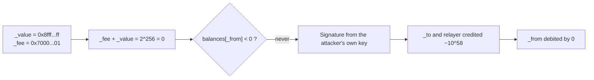

The [recap of the 2018 crypto hacks]({{site.url_complet}}/2026/10/07/crypto-hacks-2018/) summarises each incident in one line: "the product wrapped around to zero", "the token re-entered the timeout function", "the airdrop drew its randomness from block data", "a network operator announced Amazon's DNS prefixes". This companion article explains those mechanisms for a developer who writes Solidity, knows how ERC-20 tokens and exchanges work, and wants to see what exactly broke.

2018 is Solidity before SafeMath was everywhere and before Solidity 0.8 made arithmetic checked by default. Many of its bugs look elementary today, which is why they are worth reading: each one explains a default that modern tooling now enforces. The largest losses, however, were not in contracts at all but in exchange hot wallets, admin keys, consensus and the network paths between users and their wallets. The technical articles on [2019]({{site.url_complet}}/2026/10/07/crypto-hacks-2019-technical-concepts/) and [2020]({{site.url_complet}}/2026/10/07/crypto-hacks-2020-technical-concepts/) continue the story.

> This article has been made with the help of [Claude Code](https://claude.com/product/claude-code) and several custom skills

> **About the code.** The BeautyChain, SmartMesh and SpankChain snippets follow the verified contract sources, shortened; the others are simplified to show the mechanism. Read the linked analyses for the exact contracts.

[TOC]

## Arithmetic

### A multiplication that wrapped to zero (BeautyChain, batchOverflow)

Before Solidity 0.8, `uint256` arithmetic wrapped around silently: `2^255 * 2` is `0`. BeautyChain's `batchTransfer` let a holder send the same amount to several recipients, and computed the total with a bare multiplication, although the rest of the function used SafeMath:

```solidity
// BecToken.batchTransfer (pragma ^0.4.16), shortened
function batchTransfer(address[] _receivers, uint256 _value) public whenNotPaused returns (bool) {
    uint cnt = _receivers.length;
    uint256 amount = uint256(cnt) * _value;                 // no SafeMath: 2 * 2^255 == 0
    require(cnt > 0 && cnt <= 20);
    require(_value > 0 && balances[msg.sender] >= amount);  // passes with a zero balance

    balances[msg.sender] = balances[msg.sender].sub(amount);
    for (uint i = 0; i < cnt; i++) {
        balances[_receivers[i]] = balances[_receivers[i]].add(_value);   // each receives 2^255
    }
    return true;
}
```

With two receivers and `_value = 2^255`, `amount` wrapped to zero, the balance check compared the sender's balance with zero, nothing was debited, and each receiver was credited about 5.8 × 10^58 BEC, against a legitimate supply of 7 billion ([NVD CVE-2018-10299](https://nvd.nist.gov/vuln/detail/CVE-2018-10299)). One unchecked operator in an otherwise protected function was enough.

### An addition that wrapped, and a signer chosen by the attacker (SmartMesh, proxyOverflow)

SmartMesh's `transferProxy` let a relayer submit a transfer signed by the holder and collect a fee. Its first check added two attacker-chosen values:

```solidity
// SMT.transferProxy (Solidity 0.4.x), shortened
function transferProxy(address _from, address _to, uint256 _value, uint256 _feeSmt,
                       uint8 _v, bytes32 _r, bytes32 _s) public returns (bool) {
    if (balances[_from] < _feeSmt + _value) revert();       // wraps to 0

    bytes32 h = keccak256(_from, _to, _value, _feeSmt, nonces[_from]);
    if (_from != ecrecover(h, _v, _r, _s)) revert();          // any key the attacker owns

    balances[_to] += _value;                                 // huge
    balances[msg.sender] += _feeSmt;                         // huge
    balances[_from] -= _value + _feeSmt;                     // minus 0
    nonces[_from]++;
    return true;
}
```

With `_value + _feeSmt == 2^256`, the sum is zero, so a `_from` with no tokens passes the check, and the final subtraction removes nothing. The signature check did not help: it proves that `_from` signed, and the attacker simply signed with a fresh key and used its address as `_from`. MESH, SMT and several other tokens with the same function were exploited on 24 and 25 April ([PeckShield](https://web.archive.org/web/2019id_/https://peckshield.com/2018/04/25/proxyOverflow/)).



The fixes are the ones that became standard: SafeMath on every operation in pre-0.8 code, checked arithmetic by default since Solidity 0.8, and `unchecked` blocks only where an overflow is provably impossible. Overflow also hit EOS that year (EOS Fomo3D lost 60,686 EOS when its pot went negative) and Tron (Tronwin, 2M TRX in December): the bug is a language default, not an Ethereum problem.

### A missing allowance check (EDU, BAI)

In May, the EDU and BAI tokens shipped a `transferFrom` that never compared the amount with the allowance, and decreased the allowance with a plain subtraction:

```solidity
// Vulnerable (pattern of EDU and BAI)
function transferFrom(address _from, address _to, uint256 _value) public returns (bool) {
    require(balances[_from] >= _value);
    balances[_from] -= _value;
    balances[_to] += _value;
    allowed[_from][msg.sender] -= _value;     // underflows instead of reverting
    return true;
}
```

Anyone could move anyone's tokens; more than 2B EDU left exchange wallets ([CertiK](https://www.certik.com/skynet-report/how-formal-verification-could-have-prevented-the-loss-of-2-billion-educoin)). ERC-20 implementations should come from audited libraries such as OpenZeppelin's, whose `transferFrom` spends the allowance with a check before moving the balance.

## Contract control flow

### Reentrancy through a token the attacker chose (SpankChain, ~$38k)

SpankChain's `LedgerChannel` let a party open a payment channel with ETH and an ERC-20 token of their choosing, and reclaim the deposit through `LCOpenTimeout` if the counterparty never joined. The function paid out before deleting the channel:

```solidity
// LedgerChannel.LCOpenTimeout, shortened
function LCOpenTimeout(bytes32 _lcID) public {
    require(msg.sender == Channels[_lcID].partyAddresses[0] && Channels[_lcID].isOpen == false);
    require(now > Channels[_lcID].LCopenTimeout);

    if (Channels[_lcID].initialDeposit[0] != 0) {
        Channels[_lcID].partyAddresses[0].transfer(Channels[_lcID].ethBalances[0]);   // ETH out
    }
    if (Channels[_lcID].initialDeposit[1] != 0) {
        require(Channels[_lcID].token.transfer(                                        // attacker's "token"
            Channels[_lcID].partyAddresses[0], Channels[_lcID].erc20Balances[1]));
    }
    delete Channels[_lcID];                                                            // state cleared last
}
```

The attacker opened a channel whose "token" was their own contract. Its `transfer` called `LCOpenTimeout` again; the channel still existed, so each nested call sent the ETH deposit again. About 165 ETH left the contract before the call stack unwound ([SpankChain](https://web.archive.org/web/2019id_/https://medium.com/spankchain/we-got-spanked-what-we-know-so-far-d5ed3a0f38fe)). The DAO in 2016 had the same shape; SpankChain added a caller-chosen token, the pattern that reappeared at Akropolis in 2020 and Grim Finance in 2021. Delete the channel before paying out, use a reentrancy guard, and never call a token address supplied by the user without an allowlist.

### Randomness from block data and the extcodesize bypass (Fomo3D airdrop)

Fomo3D paid a random "airdrop" to some buyers. The draw combined block fields and the buyer's address:

```solidity
// Simplified from Fomo3D's airdrop()
function airdrop() private view returns (bool) {
    uint256 seed = uint256(keccak256(abi.encodePacked(
        block.timestamp, block.difficulty, block.coinbase, block.gaslimit, block.number, msg.sender
    )));
    return (seed % 1000) < airDropTracker_;
}
```

Every one of those values is known to a contract executing in the same block. Attackers deployed contracts that computed the result first and bought keys only when they would win. Fomo3D tried to block contracts with an `isHuman` modifier based on `extcodesize(msg.sender) == 0`, but a contract's code size is zero while its constructor runs, so the attack code ran from constructors. Two lessons follow: block data is not randomness (use a VRF or commit-reveal), and `extcodesize == 0` does not prove the caller is an externally owned account.

### Block stuffing (Fomo3D round 1)

Fomo3D's first round ended when a timer expired without a new key purchase. On 22 August, the leading player filled several consecutive blocks with high-fee transactions that consumed their gas limit, so no one else's purchase could be included before the timer ran out, and won about 10,469 ETH. This was not a bug in the contract but in the assumption that anyone can always get a transaction into the next blocks. Any mechanism that ends on a deadline (auctions, liquidations, games) must tolerate an adversary who can buy the block space around it.

## Keys and admin powers

### Single-key hot wallets (Coincheck, Zaif)

Coincheck's NEM hot wallet could be emptied with one private key, although NEM offered native multisignature accounts, according to reports at the time; 523M XEM left in hours. Zaif lost about $60M from hot wallets in September. A hot wallet is a trade-off between withdrawal speed and exposure, and the controls that limit it are well known:

- **Keep little online.** A hot wallet holds what withdrawals need for hours, not the exchange's reserves.
- **Require several signers** (multisig or MPC) for anything above a threshold, on separate machines.
- **Rate-limit and alert** on outflows by asset and destination, as described in the [2019 technical article]({{site.url_complet}}/2026/10/07/crypto-hacks-2019-technical-concepts/).

### Owner keys that can mint, burn or withdraw (KICKICO, Bancor)

KICKICO's token contract gave its owner functions to destroy and create tokens at any address, added for a Bancor integration. With the owner key, the attacker burned 70M KICK at 40 addresses and minted the same amount at 40 others: a theft with no transfer at all. Bancor's converters let their owner withdraw reserves; a compromised upgrade wallet withdrew about $23.5M, and Bancor used another owner power, a token freeze, to block the stolen BNT.

```solidity
// The shape of an owner power that turns a key leak into a theft
function destroy(address _from, uint256 _amount) public onlyOwner {
    balances[_from] -= _amount;
    totalSupply -= _amount;
}

function issue(address _to, uint256 _amount) public onlyOwner {
    balances[_to] += _amount;
    totalSupply += _amount;
}
```

Every privileged function is a theft path for whoever holds the key. Keep them out of production contracts if possible; otherwise put them behind a multisig and a timelock, and emit events that monitoring can alert on.

### Withdrawals that were not idempotent (BitGrail)

According to a court-appointed expert, one withdrawal request at BitGrail could produce several send calls to the Nano node, so users could withdraw the same balance more than once, and the deficit grew to 17M Nano over months. An exchange's withdrawal pipeline needs three properties that BitGrail lacked:

- **Idempotency.** Each withdrawal gets a unique ID, and a send for an ID that already has one is refused.
- **Debit first.** The internal balance is debited atomically before the on-chain send, not after.
- **Reconciliation.** On-chain wallet balances are compared continuously with the sum of user balances, and withdrawals stop when they diverge.

## Consensus

### 51% attacks and confirmation depth (Bitcoin Gold)

Bitcoin Gold used the Equihash algorithm, and enough hash power to outmine its network could be rented. From 16 to 19 May, an attacker deposited BTG on exchanges, traded and withdrew other assets, then released a longer private chain in which the deposits never happened, double-spending about 388,000 BTG ([Bitcoin Gold](https://web.archive.org/web/2019id_/https://forum.bitcoingold.org/t/double-spend-attacks-on-exchanges/1362)). ZenCash lost about 23,000 ZEN in a 38-block reorganisation in June.

```mermaid
sequenceDiagram
    participant A as Attacker
    participant E as Exchange
    participant P as Public chain
    participant S as Attacker's private chain
    A->>P: Deposit BTG to the exchange
    A->>S: Mine a longer chain without the deposit
    P-->>E: Deposit confirmed (N blocks)
    E-->>A: Credit; attacker trades and withdraws BTC
    A->>P: Publish the private chain (longer)
    Note over P,E: Deposit disappears; exchange is short
```

Exchanges set the number of confirmations per coin; after these attacks several raised them sharply or delisted the coins. The right number depends on how much it costs to rent the hash power to rewrite that many blocks, compared with the value at risk.

### Timestamp spoofing (Verge)

Verge mined blocks with five algorithms and adjusted each algorithm's difficulty from recent block timestamps. In April and May, an attacker forged timestamps about an hour in the past, which made the difficulty for one algorithm collapse, and mined blocks at around one per second, collecting the block rewards. Timestamps are miner-supplied data; consensus rules that depend on them need tight bounds on how far they may deviate from the network's time.

### A removed duplicate-input check (Bitcoin, CVE-2018-17144)

An optimisation introduced in Bitcoin Core 0.14 skipped the check that a transaction does not spend the same input twice, when validating blocks. In some versions it caused a crash; in later ones a miner could have created bitcoins. It was fixed before anyone exploited it ([Bitcoin Core](https://bitcoincore.org/en/2018/09/20/notice/)). The lesson applies to contracts as well: a check that seems redundant because another path covers it should stay until a test proves the other path covers every case.

## Front ends and supply chain

### BGP and DNS hijacks (MyEtherWallet, BlackWallet)

On 24 April, a network operator announced through BGP the IP prefixes of Amazon Route 53, the DNS service used by myetherwallet.com. For about two hours, part of the internet sent DNS queries to the attacker's servers, which answered with the address of a phishing site serving a self-signed certificate ([Cloudflare](https://blog.cloudflare.com/bgp-leaks-and-crypto-currencies/)). Users who clicked through the browser warning lost about $150k. BlackWallet lost about $400k in January after an attacker took over its hosting account and changed its DNS records.

For a wallet front end, the defences are HSTS with preloading (so browsers refuse an invalid certificate without offering to continue), DNSSEC, strong protection and alerts on registrar, DNS and hosting accounts, and monitoring of the routes announced for your DNS providers.

### A payload aimed at one application (event-stream and Copay)

In November, a new maintainer of the popular npm package `event-stream` added a dependency, `flatmap-stream`, whose payload was encrypted. The decryption key was the `description` field of the `package.json` of BitPay's Copay wallet, so the code ran only inside Copay builds, where it stole wallet keys ([Snyk](https://snyk.io/blog/a-post-mortem-of-the-malicious-event-stream-backdoor/), [BitPay](https://web.archive.org/web/2019id_/https://blog.bitpay.com/npm-package-vulnerability-copay/)). Generic malware scanning could not see it, because it did nothing anywhere else.

The same month, an attacker modified the StatCounter analytics script, served to hundreds of thousands of websites, so that it acted only on Gate.io's withdrawal page and replaced the bitcoin address ([ESET](https://www.welivesecurity.com/2018/11/06/supply-chain-attack-cryptocurrency-exchange-gate-io/)). Lockfiles, review of dependency changes (including transitive ones), and loading no third-party script on pages that handle keys or withdrawals are the defences.

## Summary: from incident to concept

| Incident (2018) | Concept | Section |
|-----------------|---------|---------|
| BeautyChain | Unchecked multiplication wrapping to zero | Arithmetic |
| SmartMesh, MESH | Unchecked addition; signature from an attacker key | Arithmetic |
| EOS Fomo3D, Tronwin | Overflow on other chains | Arithmetic |
| EDU, BAI | `transferFrom` without an allowance check | Arithmetic |
| SpankChain | Reentrancy via a caller-chosen token | Contract control flow |
| Fomo3D airdrop | Randomness from block data; `extcodesize` in a constructor | Contract control flow |
| Fomo3D round 1 | Block stuffing before a deadline | Contract control flow |
| Coincheck, Zaif | Single-key hot wallets | Keys and admin powers |
| KICKICO, Bancor | Owner mint, burn and withdraw powers | Keys and admin powers |
| BitGrail | Non-idempotent withdrawals | Keys and admin powers |
| Bitcoin Gold, ZenCash | 51% attacks against confirmation depth | Consensus |
| Verge | Timestamp spoofing in difficulty adjustment | Consensus |
| Bitcoin | Removed duplicate-input check | Consensus |
| MyEtherWallet, BlackWallet | BGP and DNS hijacks | Front ends |
| Copay, Gate.io | Targeted npm payload; third-party script | Supply chain |

## Data gaps

This section lists what could not be found or verified while writing this article, so that it can be completed later. Each row says what is missing and where to look first.

| Gap | What is missing or unverified | Where to search |
|-----|-------------------------------|-----------------|
| EDU and BAI code | The snippet shows the pattern described by CertiK, not the exact deployed code. | Etherscan verified sources for EDU and BAI |
| Fomo3D | The airdrop seed and the `isHuman` check are reconstructed from memory of the published contract; the block-stuffing details come from search results. | Fomo3D contract on Etherscan, Hackernoon analysis |
| KICKICO and Bancor | The owner functions are illustrative; the exact KICKICO and BancorConverter code was not reviewed. | Etherscan, Bancor GitHub (2018 contracts) |
| Coincheck | The absence of multisig is from press reports, not an official technical account. | Coincheck and FSA reports of 2018 |
| BitGrail | The expert's findings were read through press reports, not the court documents. | Florence court documents, Italian press |
| Verge | The exact timestamp window and algorithms involved were not checked against the Verge code. | Verge GitHub, the Bitcointalk analysis |
| Defences | HSTS, DNSSEC and route-monitoring recommendations are general practice, not taken from the MyEtherWallet post-mortem. | MyEtherWallet statements, Cloudflare |

## Conclusion

The 2018 hacks show the defaults that modern tooling now enforces, and the risks no tooling removes:

- **Arithmetic** wrapped silently: a multiplication (BEC), an addition (SMT) and an allowance subtraction (EDU) minted or moved tokens at will, which made SafeMath and then checked arithmetic standard.
- **Control flow** trusted the wrong things: a token chosen by the caller (SpankChain), block data as randomness, `extcodesize` as proof of a human, and the assumption that block space is always available (Fomo3D).
- **Keys and admin powers** turned one compromise into a large loss: single-key hot wallets (Coincheck, Zaif), owner mint and withdraw functions (KICKICO, Bancor), and a withdrawal pipeline without idempotency (BitGrail).
- **Consensus** could be rented (Bitcoin Gold, ZenCash) or bent through timestamps (Verge).
- **Front ends and supply chains** were attacked through BGP, DNS, npm and a third-party analytics script.


## Annex

### Key Terms

| Term | Definition |
|------|------------|
| **Integer overflow** | An arithmetic result exceeding the type's range and wrapping around modulo 2^256. |
| **SafeMath** | An OpenZeppelin library that reverts on overflow, used before Solidity 0.8. |
| **Checked arithmetic** | Solidity 0.8's default behaviour of reverting on overflow; `unchecked` opts out. |
| **ecrecover** | The EVM precompile returning the address that signed a hash; it proves who signed, not that they own anything. |
| **Allowance** | The amount a spender may move from a holder with `transferFrom`. |
| **Reentrancy** | A callback into a contract before it has finished updating its state. |
| **extcodesize** | The code size at an address; zero for externally owned accounts and for contracts still in their constructor. |
| **Block stuffing** | Filling blocks with high-fee transactions so that others' transactions cannot be included. |
| **Hot wallet** | A wallet whose keys are online to process withdrawals. |
| **Idempotency** | The property that repeating a request has the same effect as making it once. |
| **Owner power** | A function restricted to an admin key, such as mint, burn, freeze or withdraw. |
| **51% attack** | Rewriting recent blocks with majority hash power to reverse transactions. |
| **Difficulty adjustment** | The rule that sets mining difficulty from recent block times, which Verge's timestamps distorted. |
| **BGP hijack** | Announcing IP prefixes one does not own so that traffic is routed to the attacker. |
| **HSTS** | HTTP Strict Transport Security, which makes browsers refuse invalid certificates for a site. |
| **Supply-chain attack** | Compromising a dependency, script or service that the target relies on. |

### Security Implementation Checklist

#### Arithmetic and tokens

| Check | Security requirement | Failure mode if violated |
|:---:|------------|------------|
| ☐ | Contracts use Solidity ≥ 0.8, or SafeMath on every operation in older code. | Products or sums wrap to zero (BEC, SMT). |
| ☐ | `unchecked` blocks are limited to operations proven not to overflow. | A gas optimisation reintroduces wrapping. |
| ☐ | Token implementations come from an audited library. | `transferFrom` ignores the allowance (EDU, BAI). |
| ☐ | Fuzz tests use extreme values (0, 1, 2^255, 2^256 − 1) for every amount parameter. | Overflow inputs are never tested. |

#### Control flow and randomness

| Check | Security requirement | Failure mode if violated |
|:---:|------------|------------|
| ☐ | State is deleted or updated before ETH or token transfers, behind a reentrancy guard. | Nested calls pay out repeatedly (SpankChain). |
| ☐ | Token addresses supplied by users are allowlisted. | The attacker's "token" calls back into the contract. |
| ☐ | Randomness comes from a VRF or commit-reveal, never block data. | Contracts play only when they win (Fomo3D airdrop). |
| ☐ | No check relies on `extcodesize == 0` or `tx.origin` to detect humans. | Contracts attack from their constructors. |
| ☐ | Deadline-based mechanisms tolerate a few blocks without user transactions. | Block stuffing wins the game or auction. |

#### Keys and exchange operations

| Check | Security requirement | Failure mode if violated |
|:---:|------------|------------|
| ☐ | Hot wallets hold a small share of funds; larger transfers need multisig or MPC. | One key empties the wallet (Coincheck, Zaif). |
| ☐ | Mint, burn, freeze and withdraw powers sit behind a multisig and a timelock, with alerts. | A stolen owner key moves or recreates tokens (KICKICO, Bancor). |
| ☐ | Withdrawals are idempotent, debited before sending, and reconciled with on-chain balances. | The same balance is withdrawn twice (BitGrail). |
| ☐ | Confirmation depth per chain reflects the cost of renting hash power. | Deposits reversed by reorganisation (Bitcoin Gold, ZenCash). |

#### Front ends and dependencies

| Check | Security requirement | Failure mode if violated |
|:---:|------------|------------|
| ☐ | Wallet sites use preloaded HSTS, DNSSEC and protected registrar, DNS and hosting accounts. | DNS or BGP hijack serves a phishing site (MyEtherWallet, BlackWallet). |
| ☐ | Dependencies are locked and every change, including transitive, is reviewed. | A targeted payload steals keys (Copay). |
| ☐ | Pages handling keys or withdrawals load no third-party scripts. | An analytics script swaps addresses (Gate.io). |

Each 2018 bug removed a check that someone assumed was unnecessary: the overflow check on one line, the allowance check, the state update before the call, the second signature on the hot wallet, the duplicate-input check in Bitcoin. Before deleting or skipping a check, write the test that shows what it protects.

## Frequently Asked Questions

**Q: Why did BeautyChain's overflow pass the balance check?**

The total to debit was computed as `cnt * _value` without overflow protection. With two receivers and `_value = 2^255`, the product is exactly 2^256, which wraps to zero in a `uint256`. The check then compared the sender's balance with zero, which always passes, and each receiver was credited the full `_value`.

**Q: Didn't SmartMesh's signature check stop the attack?**

The signature only proved that `_from` had signed the transfer. The attacker generated a fresh key, signed with it and passed its address as `_from`. Since the overflow made the balance check pass for an account with no tokens, it did not matter that `_from` owned nothing.

**Q: How did contracts beat Fomo3D's `isHuman` check?**

`isHuman` rejected callers with code by checking `extcodesize(msg.sender) == 0`. A contract has no code yet while its constructor runs, so attackers placed the attack logic in the constructor. The check passed, and the constructor computed the airdrop result before deciding whether to buy.

**Q: Is a 51% attack a hack of the chain or of the exchange?**

Of both, in a sense. The attacker breaks no cryptography: they rewrite recent history with more hash power, which the protocol allows. The loss falls on whoever treated a deposit as final too early, usually an exchange. Raising confirmation requirements moves the cost of an attack beyond what a double spend can earn.

**Q: What made the event-stream attack hard to detect?**

Its payload was encrypted, and the key was a string found only in Copay's own `package.json`. In any other project the code decrypted to nothing useful and did nothing, so tests, scanners and other users saw no malicious behaviour. Only reviewing the dependency's code change itself revealed it.

**Q: Which of these bugs could still happen today?**

Overflow is unlikely in Solidity 0.8 code outside `unchecked` blocks. Every other class still occurs: reentrancy through user-chosen tokens, randomness from block data, admin keys with mint powers, non-idempotent withdrawal systems, rented hash power against small chains, and supply-chain attacks on wallet front ends.

## References

### Official statements and post-mortems

- [SpankChain: what we know so far (archived)](https://web.archive.org/web/2019id_/https://medium.com/spankchain/we-got-spanked-what-we-know-so-far-d5ed3a0f38fe)
- [Bitcoin Gold: double-spend attacks on exchanges (archived)](https://web.archive.org/web/2019id_/https://forum.bitcoingold.org/t/double-spend-attacks-on-exchanges/1362)
- [ZenCash: statement on double-spend attack (archived)](https://web.archive.org/web/2019id_/https://blog.zencash.com/zencash-statement-on-double-spend-attack/)
- [BitPay: npm package vulnerability in Copay (archived)](https://web.archive.org/web/2019id_/https://blog.bitpay.com/npm-package-vulnerability-copay/)
- [Bitcoin Core: CVE-2018-17144 full disclosure](https://bitcoincore.org/en/2018/09/20/notice/)

### Technical analyses

- [NVD: CVE-2018-10299 (batchOverflow)](https://nvd.nist.gov/vuln/detail/CVE-2018-10299)
- [PeckShield: proxyOverflow (archived)](https://web.archive.org/web/2019id_/https://peckshield.com/2018/04/25/proxyOverflow/)
- [CertiK: how formal verification could have prevented the EDU loss](https://www.certik.com/skynet-report/how-formal-verification-could-have-prevented-the-loss-of-2-billion-educoin)
- [Cloudflare: BGP leaks and cryptocurrencies](https://blog.cloudflare.com/bgp-leaks-and-crypto-currencies/)
- [Snyk: post-mortem of the event-stream backdoor](https://snyk.io/blog/a-post-mortem-of-the-malicious-event-stream-backdoor/), [event-stream issue 116](https://github.com/dominictarr/event-stream/issues/116)
- [ESET: supply-chain attack on Gate.io](https://www.welivesecurity.com/2018/11/06/supply-chain-attack-cryptocurrency-exchange-gate-io/)
- [DeFiHackLabs](https://github.com/SunWeb3Sec/DeFiHackLabs) reproductions of BEC, SmartMesh and SpankChain

### Standards and tools

- [Solidity 0.8 breaking changes: checked arithmetic](https://docs.soliditylang.org/en/latest/080-breaking-changes.html)
- [OpenZeppelin Contracts: ERC20](https://docs.openzeppelin.com/contracts/erc20)
- [Chainlink VRF](https://docs.chain.link/vrf)

### Related articles

- [Crypto Hacks of 2018 - Coincheck, BitGrail and the Year of Exchange Breaches]({{site.url_complet}}/2026/10/07/crypto-hacks-2018/)
- [The Technical Concepts Behind the 2019 Crypto Hacks]({{site.url_complet}}/2026/10/07/crypto-hacks-2019-technical-concepts/)
- [The Technical Concepts Behind the 2020 Crypto Hacks]({{site.url_complet}}/2026/10/07/crypto-hacks-2020-technical-concepts/)
- [Security of Cryptocurrency Exchanges - Overview]({{site.url_complet}}/2025/11/06/crypto-exchange-security-overview/)
