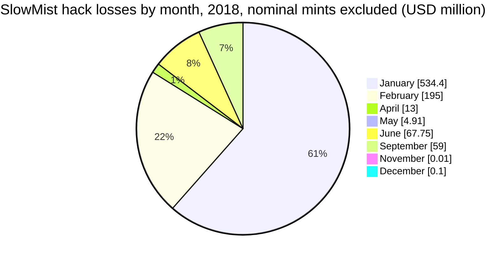
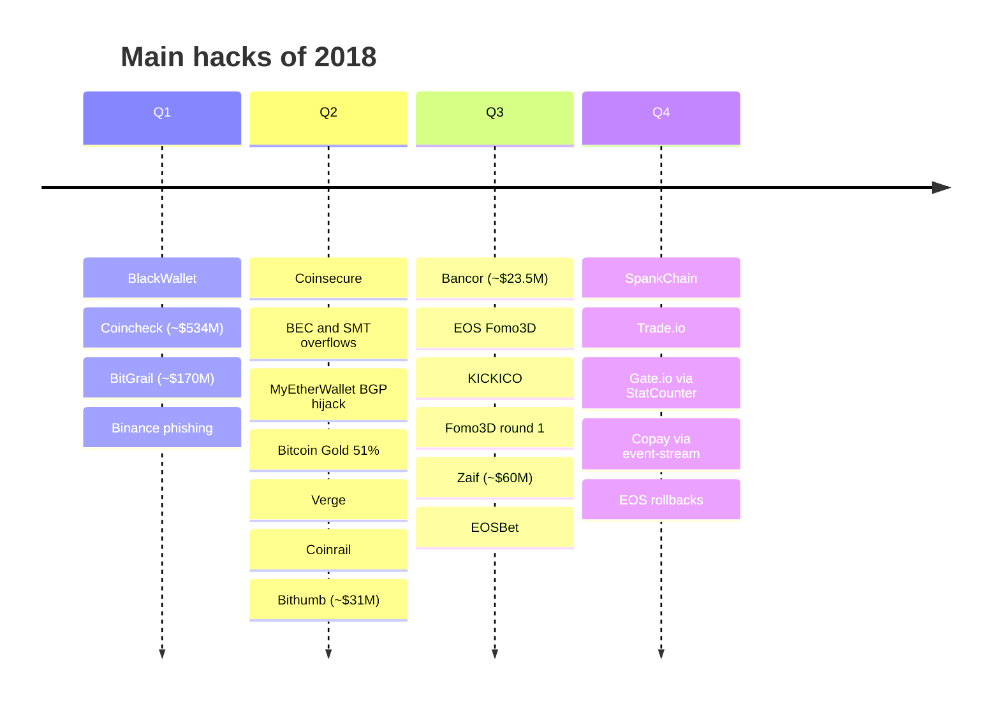
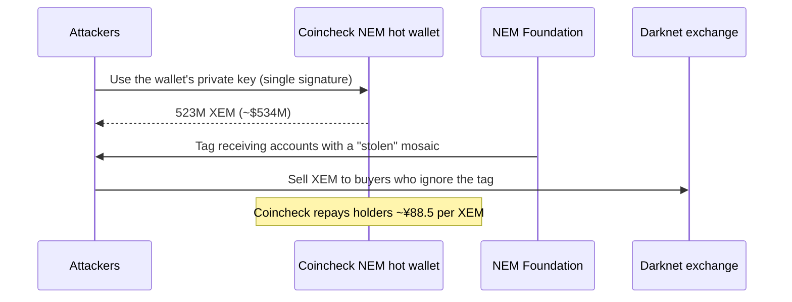

2018 began with the largest crypto theft on record at the time. On 26 January, about 523M NEM, worth about $534M, left the hot wallet of the Japanese exchange Coincheck. Two weeks later, the Italian exchange BitGrail announced it had lost about 17M Nano (~$170M). By the end of the year, CipherTrace counted about $950M stolen from exchanges and wallet infrastructure, nearly four times 2017's figure, plus about $725M lost to exit scams. Coincheck alone accounts for more than half of the year's thefts.

The year also brought the first large wave of token contract bugs: integer overflows in BeautyChain (BEC) and SmartMesh (SMT) minted astronomical amounts of tokens in April and led exchanges to suspend ERC-20 deposits. This article reviews the year with the method of the site's `crypto-hacks` series: statistics computed from the [SlowMist Hacked](https://hacked.slowmist.io/) database, the trackers' annual figures, official statements and analyses. Frauds such as BitConnect and Pincoin are kept out of the hack totals and listed separately. A companion article, [The Technical Concepts Behind the 2018 Crypto Hacks]({{site.url_complet}}/2026/10/07/crypto-hacks-2018-technical-concepts/), explains the mechanisms for smart-contract and exchange developers.

> This article has been made with the help of [Claude Code](https://claude.com/product/claude-code) and several custom skills

[TOC]

## Scope, sources and caveats

The article covers incidents from 1 January to 31 December 2018. No Telegram export of the CryptoAlertHack channel was available, and Rekt News did not exist yet. The figures need six caveats:

- **Token overflow mints are not dollar losses.** SlowMist values BeautyChain at ~$1B and SmartMesh at ~$140M, but those are the paper values of tokens created from nothing, which were never sold. The incidents are covered in [Token contract bugs](#token-contract-bugs) and excluded from the dollar totals.
- **The Blockchain.info phishing campaign is not a 2018 theft.** SlowMist lists it at ~$50M in February 2018, the month Cisco Talos disclosed it, but the campaign ran for about three years. It is excluded.
- **Frauds are not hacks.** BitConnect, the Pincoin and iFan schemes in Vietnam (~$660M) and MapleChange (an exchange that claimed a hack and disappeared) are listed in [Frauds and exit scams](#frauds-and-exit-scams) and not counted.
- **Some SlowMist amounts are wrong.** MyEtherWallet's DNS hijack is listed at ~$13M, but Cloudflare and The Register report about $150k; KICKICO is listed as "7,000 KICK" for about 70M KICK (~$7.7M). DeFiLlama lists a $235M "Gate" key compromise in April 2018 that matches no known incident; it is ignored.
- **BitGrail is a hack and a failure of the exchange.** An Italian court found its owner negligent for not preventing a double-withdrawal bug and for delaying disclosure; it did not find fraud. It is counted as a hack.
- **USD values are approximate**, valued at the time of each report.

## 2018 in numbers

### The annual figures

| Source | Stolen (approx. USD) | Scope | Notable split |
|--------|--:|------|---------------|
| CipherTrace (Q4 2018 report) | $950M | Exchanges and infrastructure | Up from ~$266M in 2017; ~$725M more in exit scams; total $1.7B ([Reuters via Carrier Management](https://www.carriermanagement.com/news/2019/01/29/189094.htm)) |
| [DeFiLlama](https://defillama.com/hacks) (computed) | ~$889M | 30 incidents | $1.12B as listed, including an unexplained $235M "Gate" row |
| SlowMist database (computed) | ~$874M | 79 incidents, 12 priced | ~$861M with MyEtherWallet's figure corrected |
| [Group-IB](https://www.group-ib.com/media-center/press-releases/gib-crypto-summary/) | $882M | 14 exchanges, 2017 to Q3 2018 | Lazarus behind five attacks for ~$571M, including Coincheck |
| Chainalysis (Crypto Crime Report, Jan 2019) | ~$1B over the groups' lifetimes | Two hacking groups | At least 60% of publicly reported hacks ([MIT Technology Review](https://www.technologyreview.com/2019/01/28/137700/just-two-hacker-groups-may-have-stolen-1-billion-in-cryptocurrency)) |
| [PeckShield](https://www.coinspeaker.com/eos-dapps-lost-1m-breaches-report/) | ~400,000 EOS | EOS DApps, July to November | 27 incidents in the first months of EOS mainnet |

The trackers that exclude frauds converge on about $0.9B for the year. The UN Panel of Experts [cited Group-IB's figure](https://www.cyberscoop.com/un-report-accuses-north-korean-hackers-stealing-571-million-crytocurrency-exchanges/) of $571M stolen by North Korea from five Asian exchanges between January 2017 and September 2018, and listed the June 2018 Bithumb theft as a suspected North Korean attack in a later report. No government has attributed Coincheck officially.

### Month by month

No monthly series from CertiK or PeckShield exists for 2018. The table gives SlowMist's incident count and computed loss (overflow mints and the phishing campaign excluded) and DeFiLlama's monthly sums without the unexplained Gate row.

| Month | SlowMist incidents | SlowMist loss | DeFiLlama loss | Largest hack |
|-------|--:|--:|--:|------|
| January | 2 | ~$534.4M | ~$534.0M | Coincheck, BlackWallet |
| February | 1 | ~$195.0M | ~$170.0M | BitGrail |
| March | 1 | none priced | none | Binance phishing (trades reversed) |
| April | 4 | ~$13.0M (MEW overstated) | ~$3.3M | Coinsecure, MyEtherWallet; BEC and SMT mints |
| May | 7 | ~$4.9M | ~$19.8M | Bitcoin Gold, Verge, Taylor |
| June | 4 | ~$67.8M | ~$68.8M | Coinrail, Bithumb, ZenCash |
| July | 4 | none priced | ~$31.2M | Bancor, KICKICO, EOS Fomo3D |
| August | 3 | none priced | none | Fomo3D round 1 |
| September | 9 | ~$59.0M | ~$60.3M | Zaif, EOSBet |
| October | 8 | none priced | ~$0.5M | Trade.io, EOSBet, SpankChain |
| November | 16 | ~$0.01M | ~$0.6M | Gate.io via StatCounter, Copay via event-stream, EOS DApps |
| December | 20 | ~$0.1M | ~$0.1M | EOS rollback attacks, Vertcoin |

The year's losses were front-loaded: Coincheck and BitGrail alone account for about 80% of the total. From August, the number of incidents grew as EOS gambling applications were attacked, but each was worth little in dollars.

### The largest incidents

| Rank | Date | Incident | Category | Reported loss (approx. USD) | Root cause (summary) |
|:---:|------|----------|----------|--:|----------------------|
| 1 | 26 Jan | Coincheck | CEX | $530M to $534M (523M NEM) | NEM held in a hot wallet without multisig; Lazarus (Group-IB) |
| 2 | Feb | BitGrail | CEX | $170M to $195M (17M Nano) | The exchange's software could send the same withdrawal twice |
| 3 | 14 Sep | Zaif | CEX | ~$60M | Hot wallet holding BTC, MONA and BCH |
| 4 | 10 Jun | Coinrail | CEX | $37M to $40M | "Network intrusion"; ICO tokens, partly frozen by issuers |
| 5 | 20 Jun | Bithumb | CEX | ~$31M | Hot wallet; suspected North Korea (UN) |
| 6 | 9 Jul | Bancor | DEX | $23.5M gross, ~$13.5M net | Key of the wallet used to upgrade contracts; BNT frozen |
| 7 | 16 to 19 May | Bitcoin Gold | L1 | ~$18M (388,201 BTG) | 51% attack with double spends against exchanges |
| 8 | 20 Oct | Trade.io | CEX | $7.5M to $8M (50M TIO) | "Cold" hardware wallet emptied |
| 9 | 26 Jul | KICKICO | Token | ~$7.7M (70M KICK, restored) | Owner key used to burn and re-mint tokens |
| 10 | Apr | Coinsecure | CEX | $3.3M to $3.5M (438 BTC) | Funds vanished during a key operation; the CSO was accused |
| 11 | Apr, May | Verge | L1 | $1.75M to $4.8M | Timestamp spoofing in multi-algorithm mining |
| 12 | 22 May | Taylor | Startup | ~$1.35M | A device and a 1Password file were stolen |
| 13 | 13 Jan | BlackWallet | Wallet | ~$400k | Hosting account and DNS hijacked |
| 14 | 24 Apr | MyEtherWallet | Wallet | ~$150k | BGP hijack of Amazon's DNS servers |
| 15 | 6 Oct | SpankChain | Payment channel | ~$38k (returned) | Reentrancy through a fake token |

### Statistics from the SlowMist database

Computed from the 2018 entries of the SlowMist Hacked database, after removing one fraud (MapleChange), the two nominal overflow mints and the multi-year phishing campaign:

- **79 incidents**, of which only **12 have a stated loss**, for **~$874M** (~$861M with MyEtherWallet corrected). Coincheck and BitGrail are 83% of it.
- **36 entries concern EOS DApps**, all without a dollar amount, mostly from September to December.

| Size band | Incidents | Loss (approx. USD) | Share of loss |
|---|--:|--:|--:|
| ≥ $100M | 2 | $729.0M | 83.4% |
| $10M to $100M | 4 | $139.2M | 15.9% |
| $1M to $10M | 1 | $4.8M | 0.6% |
| < $1M | 5 | $1.2M | 0.1% |
| Not stated | 67 | n/a | n/a |

| Category | Incidents | Loss (approx. USD) | Share of loss |
|---|--:|--:|--:|
| Key / infrastructure compromise | 10 | $623.0M | 71.3% |
| Other / unknown | 62 | $251.2M | 28.7% |
| Smart contract vulnerability | 7 | not stated | n/a |

"Other / unknown" holds BitGrail and Coinrail (filed as "unknown" and "network intrusion"), the 51% attacks, the DNS hijacks and most EOS DApp attacks.

## Coincheck (~$534M, January): the largest theft of its time

In the early hours of 26 January (Japan time), 523M NEM were sent from Coincheck's NEM wallet in a series of transactions. The wallet was a hot wallet, and it was not protected by NEM's native multisignature, according to reports at the time ([Bitcoin Magazine](https://bitcoinmagazine.com/business/following-massive-cryptocurrency-hack-coincheck-pledges-improve-operations-refund-losses)). Coincheck suspended deposits and withdrawals and, two days later, [announced](https://web.archive.org/web/2018id_/http://corporate.coincheck.com/2018/01/28/30.html) it would repay about 260,000 NEM holders ¥88.549 per XEM from its own funds.

The NEM Foundation [tagged the attacker's accounts](https://forum.nem.io/t/coincheck-incident-details-stolen-mosaic-tracker/14209) with a "mosaic" so that exchanges could refuse the coins, but the attackers sold them through a darknet exchange; Japanese police later [charged about 30 people](https://decrypt.co/39454/japan-officials-to-seize-funds-from-530-million-coincheck-hack) for buying them. Group-IB attributed the theft to Lazarus, a claim the UN Panel of Experts repeated by citing it.

## BitGrail (~$170M, February): a double-withdrawal bug

BitGrail, a small Italian exchange that was the main market for Nano, announced in February that 17M Nano had been lost to "unauthorised transactions". Its owner first blamed the Nano protocol. A court-appointed expert later found that BitGrail's own software could turn one user request into several withdrawal calls to the Nano node, so users could withdraw the same balance more than once; the losses had been building for months before disclosure. In January 2019 a Florence court [declared](https://decrypt.co/4679/court-rules-against-bitgrail) the company and its owner bankrupt and held him personally liable for failing to put safeguards in place.

## Other exchange thefts

- **Zaif (~$60M, September).** About ¥6.7B in BTC, MONA and BCH left the Japanese exchange's hot wallet, ¥4.5B of it customer funds. Fisco provided ¥5B and took control of the exchange ([Bitcoin Magazine](https://bitcoinmagazine.com/business/another-cryptocurrency-exchange-hack-hits-japan)).
- **Coinrail (~$37M to ~$40M, June).** The Korean exchange lost ICO tokens (NPXS, ATX, Dent) after a "network intrusion"; issuers froze or recovered part of them ([BleepingComputer](https://www.bleepingcomputer.com/news/security/south-korean-cryptocurrency-exchange-coinrail-gets-hacked/)).
- **Bithumb (~$31M, June).** About ₩35B left the hot wallet of Korea's largest exchange, which compensated users ([TechCrunch](https://techcrunch.com/2018/06/19/korean-crypto-exchange-bithumb-says-it-lost-over-30m-following-a-hack)). The UN lists it as a suspected North Korean attack laundered through YoBit.
- **Bancor (~$23.5M gross, July).** A wallet used to upgrade Bancor's contracts was compromised; it had owner rights over the converters and withdrew 24,984 ETH, 229M NPXS and 3.2M BNT. Bancor froze the BNT with its own token-freeze power, which reduced the net loss to about $13.5M and reopened the debate on how decentralised Bancor was ([BleepingComputer](https://www.bleepingcomputer.com/news/security/hacker-steals-135-million-from-bancor-cryptocurrency-exchange/)).
- **Trade.io (~$7.5M, October).** 50M TIO disappeared from a hardware wallet kept in a bank safe-deposit box; the company suspected "actors with access at the point of installation" ([Finance Magnates](https://www.financemagnates.com/cryptocurrency/news/hack-trade-io-loses-50-million-tio-tokens-from-cold-wallet)).
- **Coinsecure (~$3.3M, April).** 438 BTC vanished while the Indian exchange's chief security officer was extracting Bitcoin Gold for users; the company accused him in a police complaint ([CNBC](https://www.cnbc.com/2018/04/13/coinsecure-cryptocurrency-exchange-lost-3-million-and-it-thinks-its-security-chief-stole-it.html)).
- **Binance (March, no loss).** Attackers phished credentials through a lookalike domain, created API keys and sold users' BTC for the illiquid VIA token; Binance reversed the trades ([CoinDesk](https://www.coindesk.com/markets/2018/03/07/all-funds-are-safe-binance-denies-crypto-hack-rumors/)).

## Token contract bugs

### BeautyChain and SmartMesh: overflows that minted billions

On 22 April, an attacker called BeautyChain's `batchTransfer` with two recipients and a value of 2^255. The function multiplied the two without overflow protection, the product wrapped around to zero, the balance check passed, and each recipient received about 5.8 × 10^58 BEC. Two days later, SmartMesh's `transferProxy` was exploited the same way through an addition. PeckShield's monitoring flagged both and found more than a dozen other affected tokens ([PeckShield on proxyOverflow](https://web.archive.org/web/2019id_/https://peckshield.com/2018/04/25/proxyOverflow/), [NVD CVE-2018-10299](https://nvd.nist.gov/vuln/detail/CVE-2018-10299)). OKEx suspended ERC-20 deposits and Huobi suspended deposits and withdrawals while exchanges checked which tokens they listed.

The tokens' market value collapsed, but the minted amounts were never sold for their nominal value, so SlowMist's $1B and $140M are not losses in the sense of the rest of this article. In May, EDU and BAI tokens showed a different flaw: `transferFrom` did not check the allowance, so anyone could move anyone's tokens ([CertiK](https://www.certik.com/skynet-report/how-formal-verification-could-have-prevented-the-loss-of-2-billion-educoin)).

### SpankChain, KICKICO and Fomo3D

- **SpankChain (~$38k, October).** The payment-channel contract let the opener choose the token; the attacker's "token" re-entered the timeout function and withdrew the ETH deposit repeatedly. The attacker returned the funds for a bounty ([SpankChain](https://web.archive.org/web/2019id_/https://medium.com/spankchain/we-got-spanked-what-we-know-so-far-d5ed3a0f38fe)).
- **KICKICO (~$7.7M, July).** The attacker obtained the token contract's owner key and used burn and mint functions, added for a Bancor integration, to destroy 70M KICK at 40 addresses and create them at 40 others; KICKICO restored the balances ([Finance Magnates](https://www.financemagnates.com/cryptocurrency/news/kickico-hacked-for-7-7-million-but-all-funds-will-be-restored/)).
- **Fomo3D.** The Ethereum game's airdrop drew its randomness from block data, and contracts played only when they would win. On 22 August, the first round's winner took about 10,469 ETH by filling blocks with high-fee transactions so that nobody else could buy a key before the timer expired. That was a strategy within the game's rules rather than a theft, and it is not counted.

## Chains, wallets and supply chains

- **51% attacks.** Bitcoin Gold lost about 388,000 BTG (~$18M) to double spends against exchanges in May ([Bitcoin Gold forum](https://web.archive.org/web/2019id_/https://forum.bitcoingold.org/t/double-spend-attacks-on-exchanges/1362)). Verge was attacked twice through timestamp spoofing, ZenCash suffered a 38-block reorganisation with three double spends ([ZenCash](https://web.archive.org/web/2019id_/https://blog.zencash.com/zencash-statement-on-double-spend-attack/)), and Monacoin, Litecoin Cash and Vertcoin were attacked as well.
- **MyEtherWallet (~$150k, April).** A network operator announced Amazon Route 53's IP prefixes through BGP, so DNS queries for myetherwallet.com were answered by the attacker's servers and users were sent to a phishing copy ([Cloudflare](https://blog.cloudflare.com/bgp-leaks-and-crypto-currencies/)).
- **BlackWallet (~$400k, January).** The attacker took over the Stellar wallet's hosting account, changed its DNS and injected a script that moved users' XLM ([BleepingComputer](https://www.bleepingcomputer.com/news/security/hackers-hijack-dns-server-of-blackwallet-to-steal-400-000/)).
- **Gate.io via StatCounter (November).** Code injected into the StatCounter analytics script, loaded by hundreds of thousands of sites, activated only on Gate.io's withdrawal page and replaced the destination bitcoin address ([ESET](https://www.welivesecurity.com/2018/11/06/supply-chain-attack-cryptocurrency-exchange-gate-io/)).
- **Copay via event-stream (November).** A new maintainer of the npm package `event-stream` added a dependency whose payload decrypted only inside BitPay's Copay wallet, where it stole keys ([BitPay](https://web.archive.org/web/2019id_/https://blog.bitpay.com/npm-package-vulnerability-copay/), [Snyk](https://snyk.io/blog/a-post-mortem-of-the-malicious-event-stream-backdoor/)).
- **Bitcoin CVE-2018-17144 (September).** An optimisation had removed the check for duplicate inputs in a block; in recent versions it would have allowed inflation. It was patched before anyone exploited it ([Bitcoin Core](https://bitcoincore.org/en/2018/09/20/notice/)).

## EOS: the mainnet's first year

EOS's mainnet launched in June 2018, and its gambling applications became targets within weeks. PeckShield counted [27 incidents and about 400,000 EOS lost](https://www.coinspeaker.com/eos-dapps-lost-1m-breaches-report/) between July and late November. The main ones:

- **EOS Fomo3D (July, 60,686 EOS).** An overflow drove the game's pot accounting negative.
- **EOSBet (September and October).** First, the contract accepted fake EOS issued by an attacker's contract (~40,000 to ~44,000 EOS, [TNW](https://thenextweb.com/news/eos-gambling-app-hacked)); then, on 15 October, a forwarded transfer notification paid out about 65,000 EOS by TNW's count, 145,321 by SlowMist's ([TNW](https://thenextweb.com/news/eos-dapp-hacked)).
- **Rollback attacks (December).** BetDice (~200,000 EOS), EOS Max (~55,500), ToBet (~22,000) and others paid out on unconfirmed state from their own nodes; attackers made sure only their winning bets reached block producers.

The techniques, which continued through 2019, are explained in the [2019 technical article]({{site.url_complet}}/2026/10/07/crypto-hacks-2019-technical-concepts/).

## Frauds and exit scams

Frauds are not hacks: no system was broken into. They are listed here and **not counted in this article's hack totals**. CipherTrace counts about $725M lost to exit scams in 2018.

| Date | Scheme | Loss (approx. USD) | What happened |
|------|--------|--:|---------------|
| Jan | BitConnect | Multi-billion Ponzi (2016 to 2018) | Lending platform closed after US state cease-and-desist orders ([TNW](https://thenextweb.com/news/bitconnect-shut-down-closed)) |
| Apr | Pincoin and iFan (Modern Tech, Vietnam) | ~$660M | ICO schemes promising 48% a month; the team disappeared ([TechCrunch](https://techcrunch.com/2018/04/13/exit-scammers-run-off-with-660-million-in-ico-earnings)) |
| Oct | MapleChange | ~$5.85M (913 BTC) | Canadian exchange claimed a hack, then deleted its accounts ([SiliconANGLE](https://siliconangle.com/2018/10/28/canadian-cryptocurrency-exchange-closes-possible-exit-scam/)) |
| Feb to Mar | Giza | ~$2.4M | ICO funds drained; its executive probably did not exist ([CNBC](https://www.cnbc.com/2018/03/09/cryptocurrency-scammers-of-giza-make-off-with-2-million-after-ico.html)) |
| Jan | Prodeum | negligible | ICO replaced its website with an obscenity |
| Dec | QuadrigaCX | ≥ C$169M | Founder's death, disclosed in January 2019; covered in the [2019 article]({{site.url_complet}}/2026/10/07/crypto-hacks-2019/) |

## Accidents and excluded entries

No large accident (a loss with no attacker) was found for 2018. EOS Poker lost 1,374 EOS in October to what SlowMist files as an "operational mistake", and Bitcoin's CVE-2018-17144 was a critical bug fixed before any loss. Three SlowMist entries are excluded from the totals for the reasons given in the scope section: BeautyChain and SmartMesh (nominal mints) and the Blockchain.info phishing campaign (multi-year).

## Official post-mortems and statements

| Incident | Source | What it says |
|----------|--------|--------------|
| Coincheck | [Coincheck notice](https://web.archive.org/web/2018id_/http://corporate.coincheck.com/2018/01/28/30.html) | Repayment of NEM holders at ¥88.549 per XEM |
| Coincheck | [NEM Foundation tracker](https://forum.nem.io/t/coincheck-incident-details-stolen-mosaic-tracker/14209) | Tagging of the attacker's accounts |
| Bitcoin Gold | [Forum post](https://web.archive.org/web/2019id_/https://forum.bitcoingold.org/t/double-spend-attacks-on-exchanges/1362) | Double spends; exchanges told to raise confirmations |
| ZenCash | [Statement](https://web.archive.org/web/2019id_/https://blog.zencash.com/zencash-statement-on-double-spend-attack/) | 38-block reorganisation, three double spends |
| SpankChain | [What we know](https://web.archive.org/web/2019id_/https://medium.com/spankchain/we-got-spanked-what-we-know-so-far-d5ed3a0f38fe) | Reentrancy; funds returned |
| Copay | [BitPay statement](https://web.archive.org/web/2019id_/https://blog.bitpay.com/npm-package-vulnerability-copay/) | Malicious dependency in versions 5.0.2 to 5.1.0 |
| Bitcoin Core | [CVE-2018-17144 notice](https://bitcoincore.org/en/2018/09/20/notice/) | No known exploitation |
| BitGrail | Court ruling (reported by [Decrypt](https://decrypt.co/4679/court-rules-against-bitgrail)) | Owner liable; bankruptcy |
| Bancor, Bithumb, Zaif, KICKICO, EOSBet | Not found | Press reports used instead |

## Observations

- **Exchange hot wallets were the year's single point of failure.** Coincheck, Zaif, Bithumb and Coinrail together lost about $660M from online wallets.
- **Japan and Korea were hit hardest.** CipherTrace puts 58% of exchange thefts in the two countries.
- **Token contracts showed basic arithmetic bugs.** BEC and SMT made SafeMath standard practice, years before Solidity 0.8 checked arithmetic by default.
- **Admin keys were a design choice with consequences.** Bancor's and KICKICO's owners could move or recreate tokens, which let attackers steal and let the projects freeze or restore.
- **Attacks moved up the stack.** BGP, DNS, a hosting account, an analytics script and an npm package each reached users without touching a smart contract.
- **EOS gambling arrived with its own attack classes**, from fake tokens to rollbacks, that dominated 2019's incident counts.

## Data gaps

This section lists what could not be found or verified while writing this article, so that it can be completed later. Each row says what is missing and where to look first.

| Gap | What is missing or unverified | Where to search |
|-----|-------------------------------|-----------------|
| Telegram export | No CryptoAlertHack export was available for 2018. | A Telegram export for 2018 |
| Chainalysis | The 2019 Crypto Crime Report was read only through press coverage; no chainalysis.com URL was found, and it gives no 2018-only figure. | Chainalysis report archive |
| CipherTrace | The primary Q4 2018 release returned 403; figures come from Reuters and others. | CipherTrace archive, Wayback Machine |
| SlowMist and PeckShield | No 2018 annual report found for either; PeckShield's EOS figure covers July to November only. | SlowMist and PeckShield blogs, January 2019 |
| DeFiLlama Gate row | The $235M "Gate" key compromise of April 2018 matches no known incident. | DeFiLlama source data |
| Coincheck | The single-signature hot wallet detail and the malware on employee PCs come from press reports; no Japanese government attribution was found. | FSA orders, Japanese police statements |
| Official statements | Bancor, Bithumb, Zaif, KICKICO and EOSBet statements were not located. | Project blogs, Wayback Machine |
| Verge, Vertcoin | Loss figures and dates conflict (Verge $1.75M to $4.82M; Vertcoin early or mid-December). | Verge and Vertcoin announcements, exchange notices |
| Coinrail recovery | The share frozen or recovered by token issuers was seen only in search results. | Coinrail notices, NPXS and Dent statements |
| Fomo3D | The airdrop exploit and the block-stuffing round were described from search results; the main write-up page had no title. | Etherscan, the Fomo3D contracts |
| Frauds | BitConnect's total, Tidex and Coinroom were not researched; Electroneum's 51% attack (SlowMist) was not verified. | DOJ releases, Polish press |

## Conclusion

2018 was the year exchanges lost the most: about $950M stolen from exchanges and infrastructure according to CipherTrace, about $0.87B in the SlowMist and DeFiLlama data once nominal mints and errors are removed.

- **Coincheck** (~$534M) was more than half the year on its own, and **BitGrail** (~$170M) showed that an exchange's own software could leak funds for months.
- **Other exchanges** (Zaif, Coinrail, Bithumb, Bancor) lost hot wallets or admin keys.
- **Token contracts** suffered overflow bugs (BEC, SMT) that minted billions of worthless tokens and made SafeMath standard.
- **Chains and front ends** were attacked through 51% attacks, BGP and DNS hijacks, and supply-chain compromises.
- **Frauds** (BitConnect, Pincoin and iFan, MapleChange) are kept apart from the hack totals.

## Annex

### Key Terms

| Term | Definition |
|------|------------|
| **Hot wallet** | An exchange wallet whose keys are online; Coincheck's NEM wallet was one. |
| **Multisignature** | Requiring several keys to sign a transaction; NEM supported it natively, but Coincheck did not use it. |
| **Mosaic** | A NEM token type; the NEM Foundation used one to tag the stolen coins. |
| **Integer overflow** | An arithmetic result exceeding the type's maximum and wrapping around, as in BEC and SMT. |
| **SafeMath** | A Solidity library that reverts on overflow, standard after 2018. |
| **Allowance** | The amount a spender may move with `transferFrom`; EDU and BAI did not check it. |
| **Reentrancy** | Calling back into a contract before it has updated its state, as at SpankChain. |
| **Block stuffing** | Filling blocks with high-fee transactions to keep others out, used to win Fomo3D's first round. |
| **51% attack** | Mining a longer chain with majority hash power to reverse transactions. |
| **BGP hijack** | Announcing someone else's IP addresses so that traffic reaches the attacker, as with Amazon's DNS for MyEtherWallet. |
| **Supply-chain attack** | Compromising a dependency or service the target uses, such as event-stream or StatCounter. |
| **Token freeze** | An issuer's power to block tokens, used by Bancor on stolen BNT. |
| **Exit scam** | A project or exchange disappearing with users' funds; a fraud, not a hack. |
| **Nominal loss** | The paper value of tokens taken or minted, which may never be realisable. |

## Frequently Asked Questions

**Q: How much was stolen in crypto hacks in 2018?**

About $950M from exchanges and infrastructure according to CipherTrace, which counted $1.7B including exit scams. DeFiLlama and SlowMist give about $0.87B to $0.89B once nominal token mints, a multi-year phishing campaign and an unexplained entry are removed. Coincheck alone is more than half of it.

**Q: How did Coincheck lose $534M?**

Its NEM was held in a hot wallet whose key could sign transfers on its own; the NEM network supported multisignature, but Coincheck did not use it, according to reports at the time. An attacker with the key moved 523M XEM in a few hours. Coincheck repaid customers from its own funds, and Group-IB attributed the theft to North Korea's Lazarus Group.

**Q: Did the BeautyChain overflow really cost $1B?**

No. The overflow created about 10^59 BEC from nothing, and SlowMist's $1B is a notional value. The real damage was the collapse of BEC's market value and the suspension of ERC-20 deposits at major exchanges while they checked their tokens. The minted tokens could not be sold for anything near their face value.

**Q: Was BitGrail hacked or did it commit fraud?**

An Italian court found that BitGrail's software could process the same withdrawal more than once, that its owner failed to put safeguards in place and that he delayed disclosing the losses for months. It held him liable and declared him and the company bankrupt, but did not find fraud. This article counts BitGrail as a hack.

**Q: Was the Fomo3D win a hack?**

Not in the sense of a theft. The winner of the first round filled Ethereum blocks with high-fee transactions so that nobody else could buy a key before the timer ran out, which the game's rules allowed. It showed that a game ending on a timer can be won by whoever controls block space at the deadline.

**Q: Why were 51% attacks so common in 2018?**

Many small proof-of-work coins shared mining algorithms with larger ones, so hash power could be rented on marketplaces for less than the value of a double spend against an exchange. Bitcoin Gold, Verge, ZenCash, Monacoin and others were attacked; exchanges responded by raising confirmation requirements or delisting the coins.

## References

### Annual reports and figures

- [Reuters via Carrier Management: thefts and scams hit $1.7 billion in 2018 (CipherTrace)](https://www.carriermanagement.com/news/2019/01/29/189094.htm)
- [Group-IB: cryptocurrency exchange attacks summary](https://www.group-ib.com/media-center/press-releases/gib-crypto-summary/)
- [MIT Technology Review: two hacker groups may have stolen $1 billion (Chainalysis)](https://www.technologyreview.com/2019/01/28/137700/just-two-hacker-groups-may-have-stolen-1-billion-in-cryptocurrency)
- [CyberScoop: UN report on North Korean hackers stealing $571 million](https://www.cyberscoop.com/un-report-accuses-north-korean-hackers-stealing-571-million-crytocurrency-exchanges/)
- [Coinspeaker: EOS DApps lost over $1M (PeckShield)](https://www.coinspeaker.com/eos-dapps-lost-1m-breaches-report/)
- [DeFiLlama hacks](https://defillama.com/hacks)

### Official statements and post-mortems

- [Coincheck: compensation notice (archived)](https://web.archive.org/web/2018id_/http://corporate.coincheck.com/2018/01/28/30.html)
- [NEM Foundation: stolen mosaic tracker](https://forum.nem.io/t/coincheck-incident-details-stolen-mosaic-tracker/14209)
- [Bitcoin Gold: double-spend attacks on exchanges (archived)](https://web.archive.org/web/2019id_/https://forum.bitcoingold.org/t/double-spend-attacks-on-exchanges/1362)
- [ZenCash: statement on double-spend attack (archived)](https://web.archive.org/web/2019id_/https://blog.zencash.com/zencash-statement-on-double-spend-attack/)
- [SpankChain: what we know so far (archived)](https://web.archive.org/web/2019id_/https://medium.com/spankchain/we-got-spanked-what-we-know-so-far-d5ed3a0f38fe)
- [BitPay: npm package vulnerability in Copay (archived)](https://web.archive.org/web/2019id_/https://blog.bitpay.com/npm-package-vulnerability-copay/)
- [Bitcoin Core: CVE-2018-17144 full disclosure](https://bitcoincore.org/en/2018/09/20/notice/)

### Technical analyses

- [PeckShield: proxyOverflow (archived)](https://web.archive.org/web/2019id_/https://peckshield.com/2018/04/25/proxyOverflow/), [NVD: CVE-2018-10299](https://nvd.nist.gov/vuln/detail/CVE-2018-10299)
- [CertiK: how formal verification could have prevented the EDU loss](https://www.certik.com/skynet-report/how-formal-verification-could-have-prevented-the-loss-of-2-billion-educoin)
- [Cloudflare: BGP leaks and cryptocurrencies](https://blog.cloudflare.com/bgp-leaks-and-crypto-currencies/)
- [ESET: supply-chain attack on Gate.io](https://www.welivesecurity.com/2018/11/06/supply-chain-attack-cryptocurrency-exchange-gate-io/), [Snyk: post-mortem of the event-stream backdoor](https://snyk.io/blog/a-post-mortem-of-the-malicious-event-stream-backdoor/)
- [Cisco Talos: Coinhoarder phishing campaign](https://blog.talosintelligence.com/coinhoarder/)

### Press

- [Bitcoin Magazine: Coincheck pledges to refund losses](https://bitcoinmagazine.com/business/following-massive-cryptocurrency-hack-coincheck-pledges-improve-operations-refund-losses), [Decrypt: Japan to seize funds from the Coincheck hack](https://decrypt.co/39454/japan-officials-to-seize-funds-from-530-million-coincheck-hack)
- [Decrypt: court rules against BitGrail](https://decrypt.co/4679/court-rules-against-bitgrail), [Bitcoin Magazine: Zaif hack](https://bitcoinmagazine.com/business/another-cryptocurrency-exchange-hack-hits-japan)
- [BleepingComputer: Coinrail](https://www.bleepingcomputer.com/news/security/south-korean-cryptocurrency-exchange-coinrail-gets-hacked/), [TechCrunch: Bithumb](https://techcrunch.com/2018/06/19/korean-crypto-exchange-bithumb-says-it-lost-over-30m-following-a-hack), [BleepingComputer: Bancor](https://www.bleepingcomputer.com/news/security/hacker-steals-135-million-from-bancor-cryptocurrency-exchange/)
- [Finance Magnates: Trade.io](https://www.financemagnates.com/cryptocurrency/news/hack-trade-io-loses-50-million-tio-tokens-from-cold-wallet), [Finance Magnates: KICKICO](https://www.financemagnates.com/cryptocurrency/news/kickico-hacked-for-7-7-million-but-all-funds-will-be-restored/), [CNBC: Coinsecure](https://www.cnbc.com/2018/04/13/coinsecure-cryptocurrency-exchange-lost-3-million-and-it-thinks-its-security-chief-stole-it.html)
- [CoinDesk: Binance denies hack](https://www.coindesk.com/markets/2018/03/07/all-funds-are-safe-binance-denies-crypto-hack-rumors/), [BleepingComputer: BlackWallet DNS hijack](https://www.bleepingcomputer.com/news/security/hackers-hijack-dns-server-of-blackwallet-to-steal-400-000/)
- [TNW: EOSBet hacked (September)](https://thenextweb.com/news/eos-gambling-app-hacked), [TNW: EOSBet hacked again (October)](https://thenextweb.com/news/eos-dapp-hacked)
- [TNW: BitConnect shut down](https://thenextweb.com/news/bitconnect-shut-down-closed), [TechCrunch: Pincoin and iFan](https://techcrunch.com/2018/04/13/exit-scammers-run-off-with-660-million-in-ico-earnings), [SiliconANGLE: MapleChange](https://siliconangle.com/2018/10/28/canadian-cryptocurrency-exchange-closes-possible-exit-scam/), [CNBC: Giza](https://www.cnbc.com/2018/03/09/cryptocurrency-scammers-of-giza-make-off-with-2-million-after-ico.html)

### Related articles

- [Crypto Hacks of 2017 - Parity, NiceHash, Tether and the ICO Boom]({{site.url_complet}}/2026/10/07/crypto-hacks-2017/)
- [The Technical Concepts Behind the 2018 Crypto Hacks]({{site.url_complet}}/2026/10/07/crypto-hacks-2018-technical-concepts/)
- [Crypto Hacks of 2019 - Binance, Upbit, CoinBene and the EOS Casino Attacks]({{site.url_complet}}/2026/10/07/crypto-hacks-2019/)
- [Security of Cryptocurrency Exchanges - Overview]({{site.url_complet}}/2025/11/06/crypto-exchange-security-overview/)
