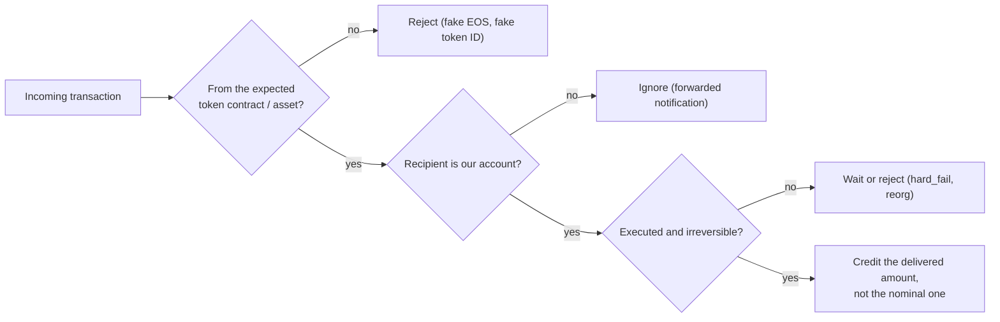

The [recap of the 2019 crypto hacks]({{site.url_complet}}/2026/10/07/crypto-hacks-2019/) summarises each incident in one line: "API keys and 2FA codes collected by phishing", "fake EOS", "transaction congestion", "XRP partial payments credited at face value". This companion article explains those mechanisms for a developer who writes smart contracts, knows how exchanges and token transfers work, and wants to see what exactly broke.

2019's material is different from later years. Ethereum DeFi held little value, and its worst bugs were found before anyone exploited them. The losses came from exchanges and from gambling contracts on EOS and Tron, and most of their bugs answer the same question wrongly: did the money really arrive, and could the other side have known the outcome in advance? The technical articles on [2020]({{site.url_complet}}/2026/10/07/crypto-hacks-2020-technical-concepts/) and [2021]({{site.url_complet}}/2026/10/07/crypto-hacks-2021-technical-concepts/) pick up where Ethereum DeFi takes over.

> This article has been made with the help of [Claude Code](https://claude.com/product/claude-code) and several custom skills

> **About the code.** The C++, Solidity and JSON snippets are simplified to show the mechanism. They are not the deployed code of the projects named; read the linked analyses for the exact contracts.

[TOC]

## Was the deposit real?

A platform that credits users for incoming funds must decide, from on-chain data, that a specific amount of a specific asset arrived at its own account and will not be reversed. Several 2019 incidents broke one part of that decision.

### Fake EOS: the token contract was not checked

On EOS, a token is a contract, and `EOS` is the token issued by the `eosio.token` contract. Any account can deploy a copy of `eosio.token` and issue its own token with the symbol `EOS`. A contract learns about incoming transfers through its `apply(receiver, code, action)` entry point, where `code` is the contract that emitted the action. Vulnerable dispatchers handled `transfer` from any `code`:

```cpp
// Vulnerable: any contract's "transfer" action is treated as a real EOS transfer
extern "C" void apply(uint64_t receiver, uint64_t code, uint64_t action) {
    if (action == N(transfer)) {
        execute_action(&dicegame::transfer);
    }
}

// Fixed: only eosio.token's transfer is accepted, and the symbol is checked in the handler
extern "C" void apply(uint64_t receiver, uint64_t code, uint64_t action) {
    if ((code == receiver && action != N(transfer)) ||
        (code == N(eosio.token) && action == N(transfer)) ||
        action == N(onerror)) {
        // dispatch
    }
}
```

An attacker issued worthless "EOS" from their own contract, bet it, and was paid in real EOS. idicefungame, EOSlots, UnicornBet and BitDice were hit in 2019 ([SlowMist best practices](https://github.com/slowmist/eos-smart-contract-security-best-practices)). The Solidity equivalent is accepting any `token` address in a deposit function, which cost Akropolis and Grim Finance in later years.

### Fake transfer notifications: the recipient was not checked

`eosio.token` notifies both the sender and the recipient of a transfer with `require_recipient`. A contract receiving a notification can itself call `require_recipient` and forward it to a third account. That third account's `apply` then runs with `code == eosio.token` and `action == transfer`, exactly like a real incoming transfer, although the funds moved between two other accounts.

```cpp
// Vulnerable handler: checks only that the transfer is not outgoing
void transfer(name from, name to, asset quantity, std::string memo) {
    if (from == _self) return;
    // ... treat as a bet of `quantity` from `from`
}

// Fixed
void transfer(name from, name to, asset quantity, std::string memo) {
    if (from == _self || to != _self) return;
    // ...
}
```

The attacker sent real EOS from one of their accounts to another, forwarded the notification to the game, and was credited with a bet they never paid. nkpaymentcap lost 50,000 EOS this way in March 2019; SlowMist files the class as "transfer error prompt".

### hard_fail: a transaction that exists but did not execute

EOS can delay a transaction with `delay_sec`. If a delayed transaction fails when it is due, it is still included in a block, with status `hard_fail`. Some game servers watched the chain for an incoming bet transaction and paid out once they found it, without checking its status.

The attacker sent a delayed bet designed to fail, the server saw the transaction and paid, and the bet never moved any funds. EOS Vegas Town lost about 2,219 EOS in March 2019 ([SlowMist](https://slowmist.medium.com/hard-fail-status-attack-for-eos-7cfa73ae7d4b)). Off-chain watchers must check that the transaction's status is `executed`, and act only once the block is irreversible.

### Tron's fake token ID (TronBank)

Tron lets a contract call carry a TRC-10 token alongside TRX, exposed in Solidity as `msg.tokenid` and `msg.tokenvalue`. TronBank's investment function checked the amount but not which token it was:

```solidity
// Vulnerable
function invest() public payable {
    require(msg.tokenvalue >= MIN_INVEST);
    // ... credit msg.sender with msg.tokenvalue BTT
}

// Fixed
function invest() public payable {
    require(msg.tokenid == 1002000, "BTT only");   // BitTorrent token ID
    require(msg.tokenvalue >= MIN_INVEST);
    // ...
}
```

The attacker issued a token named "BTTx" with a different ID, invested it, and withdrew about 170M real BTT within an hour ([BlockTempo](https://www.blocktempo.com/tron-dapp-tronbank-was-fishing-170mln-btt/)).

### XRP partial payments: the nominal amount is not the delivered amount

An XRP Ledger `Payment` has an `Amount` field. With the `tfPartialPayment` flag set, the payment succeeds with result `tesSUCCESS` even if it delivers much less than `Amount`, because `Amount` is then only a maximum. The delivered amount is in the transaction metadata:

```json
{
  "TransactionType": "Payment",
  "Account": "rAttacker...",
  "Destination": "rExchange...",
  "DestinationTag": 12345,
  "Amount": "1000000000000",
  "Flags": 131072,
  "meta": {
    "TransactionResult": "tesSUCCESS",
    "delivered_amount": "3000"
  }
}
```

An exchange that credited `Amount` gave the attacker a million XRP for a few thousandths of one. BitoPro lost about 7M XRP in May 2019 ([ForkLog](https://forklog.com/zloumyshlennik-vyvel-s-birzhi-bitopro-7-mln-xrp-cherez-uyazvimost-chastichnogo-platezha/)) and Beaxy was hit in August. The [XRPL documentation](https://xrpl.org/docs/concepts/payment-types/partial-payments) describes the exploit and the fix: always credit `delivered_amount`. The same "false top-up" class appeared in 2018 with Omni USDT transactions marked invalid that exchanges credited anyway.



## Randomness and atomicity on EOS and Tron

### Seeds anyone can compute

Gambling contracts need a random number that the player cannot know when betting. Many EOS games built it from values available to any contract in the same block:

```cpp
// Vulnerable seed (pattern seen in eosbocai and similar games)
uint64_t mixd = tapos_block_prefix() * tapos_block_num()
              + player.value + game_id - current_time() + total_eos.amount;
uint8_t roll = sha256(mixd) % 100;
```

An attacker's contract can compute the same expression in the same block and bet only when the result wins. uugame, EOSLuck, OnePlay and EOSlots lost thousands of EOS this way in 2019, and TronWow lost about 2.17M TRX over 1,203 attacks.

Games then moved the draw to a later block and used that block's ID as a seed. In September 2019, EOSPlay lost about 30,000 EOS to a refinement ([SlowMist](https://slowmist.medium.com/details-of-a-new-type-random-number-attack-on-eos-ede0211d9cc2)). The attacker rented large amounts of CPU through REX and filled the chain so that the seed block would contain only predictable content; when the predicted result was a loss, they added a small transaction to change the block ID.

### Transaction congestion (CVE-2019-6199)

EOS deferred transactions could be scheduled by a contract and went directly into the producer's queue, and a deferred transaction could schedule more of them. When an attacker's bet looked like a loss, their contract flooded the network with deferred transactions that looped until they ran out of CPU, pushing the casino's reveal into a later block and changing its time-based seed. PeckShield showed that 300 deferred transactions costing about 0.4 EOS of CPU produced 269 nearly empty blocks ([PeckShield](https://blog.peckshield.com/2019/01/15/eos_CVE-2019-6199/)). Block producers capped the CPU deferred transactions could use per block in January 2019, but games relying on time-based seeds kept being attacked through the year.

### Rollback: losing bets that never happened

When a game settles a bet in the same transaction as the bet (through inline actions), the bettor can revert the whole transaction if the outcome is bad:

```cpp
// Attacker contract (simplified)
void attacker::attack() {
    asset before = get_balance(_self);
    // inline bet: the game draws and pays within this transaction
    action(permission_level{_self, N(active)}, N(eosio.token), N(transfer),
           std::make_tuple(_self, N(dicegame), asset(10000, S(4, EOS)), std::string("roll:50"))
    ).send();
    // runs after the game's inline payout
    action(permission_level{_self, N(active)}, _self, N(check),
           std::make_tuple(before)).send();
}

void attacker::check(asset before) {
    eosio_assert(get_balance(_self) > before, "lost: revert everything");
}
```

Losing bets are reverted, winning bets stand, and the attacker wins every time they keep. WinDice, TGON and ZION lost EOS this way in 2019; on Tron, SPOKpark and 7Tron lost hundreds of thousands of TRX. A variant used accounts blacklisted by block producers: the casino's own node accepted the bet and broadcast a payout, producers dropped the bet, and only the payout was included ([SlowMist](https://medium.com/@slowmist/roll-back-attack-about-blacklist-in-eos-adf53edd8d69)).

The fix for all three classes is structural. Settle the draw in a separate transaction, after the bet is irreversible, with a seed the player cannot influence: a commit-reveal scheme with a server seed committed before the bet, or a verifiable random function. On Ethereum, the equivalent mistakes are using `block.timestamp` or `blockhash` of the current block, and the equivalent fix is Chainlink VRF or commit-reveal.

### Self-transfers on Tron (TronCrush)

TronCrush's token `transfer` did not reject `to == from`, and it cached balances before writing them, so transferring to oneself created tokens. The same bug cost bZx about $8M in September 2020 and is explained in the [2020 technical article]({{site.url_complet}}/2026/10/07/crypto-hacks-2020-technical-concepts/).

## Exchange controls

### API keys and 2FA codes (Binance, ~$40M)

Binance's attackers did not break the exchange's wallets. They collected users' API keys, 2FA codes and other data over time through phishing and malware, and then submitted withdrawals from many accounts at once, sized so that each passed the existing per-account checks. The combined withdrawal of 7,074 BTC left in one transaction ([Binance](https://binance.zendesk.com/hc/en-us/articles/360028031711)).

The lessons for exchange and wallet back ends are about aggregation:

- **Scope API keys.** Withdrawal permission off by default, mandatory IP allowlists for keys that can withdraw, and withdrawals only to pre-approved addresses.
- **Check the total, not only each request.** Rate limits and anomaly detection on aggregate outflows by asset, destination and time window catch many accounts acting together.
- **Keep the hot wallet small.** A withdrawal larger than a fraction of the hot wallet should require a manual or cold-wallet step.

### Human review as an attack surface (Bitrue)

Bitrue's attacker exploited "a vulnerability in the Risk Control team's second review process" to take over about 90 accounts and reach the hot wallet ([Bitrue on X](https://twitter.com/BitrueOfficial/status/1144066874147131392)). Review steps are code paths too: the tools reviewers use to approve or change accounts need the same access control, logging and dual approval as the withdrawal service itself.

### Hot wallets with one key (Upbit, BITPoint, CoinTiger)

Upbit lost 342,000 ETH from its Ethereum hot wallet in November; BITPoint emptied hot wallets for five assets; CoinTiger lost PTT from a wallet controlled by a single signature. None of the official statements explained how the keys were reached. The common design questions are how much a hot wallet holds, whether a single key can move it, and whether outflows above a threshold need a second, independent signer.

## Ethereum near-misses

### Return data from a call to an address without code (0x v2)

0x v2 let an order be signed by a smart-contract wallet: the exchange called the wallet's `isValidSignature` and read a boolean back. The code was written in assembly, with the output buffer overlapping the input:

```solidity
// Simplified from 0x v2 isValidWalletSignature
assembly {
    let cdStart := add(callData, 32)
    let success := staticcall(
        gas,
        walletAddress,
        cdStart, mload(callData),   // input
        cdStart, 32                 // output written over the start of the input
    )
    isValid := and(success, mload(cdStart))
}
```

A call to an address without code succeeds and returns no data, so nothing overwrote the buffer, and `mload(cdStart)` read the start of the input, which was not zero. The check returned true for any externally owned account: anyone could create orders "signed" by any user who had approved 0x.

samczsun found it in July 2019, and 0x shut down and replaced the exchange contract with no loss ([samczsun](https://samczsun.com/the-0x-vulnerability-explained/), [ConsenSys Diligence](https://diligence.consensys.io/blog/2019/07/return-data-length-validation-a-bug-we-missed)). Two rules follow: check `extcodesize` before calling a contract you expect to exist, and check `returndatasize()` before reading return data. Solidity's high-level calls check that the target has code and validate the length of return data; low-level calls and assembly do not.

### An oracle with too few sources (Synthetix)

Synthetix aggregated foreign-exchange prices from several API feeds and filtered outliers. An outage had left only two feeds for the Korean won, and one of them reported KRW at about 1,000 times its value. With two sources, the filter could not tell which was wrong. A trading bot exchanged into sKRW and back and made more than $1B in synthetic assets in under an hour; it agreed to reverse the trades for a bounty ([Synthetix](https://blog.synthetix.io/response-to-oracle-incident/)).

An aggregator needs a minimum number of live sources and must stop, not continue, below it. A circuit breaker that pauses a market when its price moves more than a set percentage between updates would also have caught a thousandfold move.

### Reentrancy through ERC-777 (Uniswap v1, a warning)

In April 2019, ConsenSys Diligence's [audit of Uniswap](https://diligence.consensys.io/blog/2019/04/uniswap-audit) warned that tokens calling hooks during transfers, such as ERC-777, would let a seller re-enter a Uniswap v1 exchange before its reserves were updated. No such token had a Uniswap pool yet. When imBTC did, a year later, the attack happened exactly as described, and the same hook cost Lendf.Me about $25M the next day ([2020 technical article]({{site.url_complet}}/2026/10/07/crypto-hacks-2020-technical-concepts/)).

### A governance contract that could lock funds (MakerDAO DSChief)

In May 2019, OpenZeppelin [found a flaw](https://www.openzeppelin.com/news/makerdao-critical-vulnerability) in MakerDAO's DSChief, the contract where MKR holders lock tokens to vote. Exploited, it could have locked more than $100M of MKR permanently. Maker deployed a fixed contract and asked holders to move their MKR. The case is a reminder that a governance contract holds user funds and needs the same scrutiny as a vault.

## Below the contracts

### 51% attacks and confirmation depth (Ethereum Classic, Vertcoin)

In January 2019, Coinbase observed 15 reorganisations of Ethereum Classic, the deepest 57 blocks, 12 of which contained double spends worth 219,500 ETC ([Coinbase](https://www.coinbase.com/blog/deep-chain-reorganization-detected-on-ethereum-classic-etc)). The attacker rented hash power, deposited ETC on exchanges, withdrew other assets once the deposits were confirmed, and then published a longer chain without the deposits. Vertcoin suffered the same in December, with 603 blocks replaced. The defence is on the receiving side: set the confirmation depth per chain from the cost of renting enough hash power to rewrite that many blocks, and monitor for deep reorganisations. The site's [2020 technical article]({{site.url_complet}}/2026/10/07/crypto-hacks-2020-technical-concepts/) covers the August 2020 ETC attacks.

### A signature check that could be bypassed (NULS)

In December 2019, an attacker sent a crafted transaction that passed NULS v2.2's "transaction signature verification logic" without the team account's key, and moved 2M NULS from it ([Decrypt](https://decrypt.co/15556/nuls-could-have-accidentally-frozen-funds-following-476000-hack)). NULS froze the remaining funds with a mandatory hard fork. The exact flaw was not published. Signature verification at the protocol level is a single point of failure for every account on the chain; it deserves differential testing against a reference implementation and fuzzing of malformed signatures.

### Supply chain: npm, browser scripts and wallet servers

Three 2019 incidents reached users through code they did not write:

- **npm.** The `electron-native-notify` package, a dependency of Komodo's Agama wallet, received a version that sent wallet seeds to an attacker. npm and Komodo used the same seeds to move more than $13M to safety first ([npm](https://blog.npmjs.org/post/185397814280/plot-to-steal-cryptocurrency-foiled-by-the-npm)).
- **Browser scripts.** MyDashWallet loaded a script from a third-party site; when the script was hijacked, it sent private keys out for two months.
- **Wallet servers.** Electrum displayed error messages from servers as rich text, so malicious servers showed a formatted message urging users to download a fake update ([Electrum issue](https://github.com/spesmilo/electrum/issues/4968)).

Pin dependency versions with lockfiles, review updates to small packages that handle keys, serve scripts from your own origin with subresource integrity, and never render untrusted server data as rich content.

## Summary: from incident to concept

| Incident (2019) | Concept | Section |
|-----------------|---------|---------|
| idicefungame, EOSlots, BitDice | Token contract (`code`) not checked | Was the deposit real? |
| nkpaymentcap, Gamble EOS | Forwarded transfer notification, `to` not checked | Was the deposit real? |
| EOS Vegas Town | Transaction status `hard_fail` not checked | Was the deposit real? |
| TronBank | `msg.tokenid` not checked | Was the deposit real? |
| BitoPro, Beaxy | XRP partial payment, `Amount` instead of `delivered_amount` | Was the deposit real? |
| uugame, EOSLuck, EOSPlay, TronWow | Predictable random seeds | Randomness and atomicity |
| EOS.WIN, FarmEOS | Deferred-transaction congestion | Randomness and atomicity |
| WinDice, TGON, SPOKpark | Rollback of losing bets | Randomness and atomicity |
| TronCrush | Self-transfer with cached balances | Randomness and atomicity |
| Binance | API keys and 2FA codes; per-account checks | Exchange controls |
| Bitrue | Review tooling as an attack path | Exchange controls |
| Upbit, BITPoint, CoinTiger | Single-key hot wallets | Exchange controls |
| 0x v2 | Return data read from a call to an address without code | Ethereum near-misses |
| Synthetix | Aggregator with too few sources | Ethereum near-misses |
| Uniswap v1 | ERC-777 reentrancy warning | Ethereum near-misses |
| Ethereum Classic, Vertcoin | Reorganisation deeper than confirmation depth | Below the contracts |
| NULS | Protocol signature verification bypass | Below the contracts |
| Agama, MyDashWallet, Electrum | Supply chain | Below the contracts |

## Data gaps

This section lists what could not be found or verified while writing this article, so that it can be completed later. Each row says what is missing and where to look first.

| Gap | What is missing or unverified | Where to search |
|-----|-------------------------------|-----------------|
| Deployed code | Snippets are simplified; the EOS and Tron contracts were not compared with deployed code, and the 0x assembly is reconstructed from samczsun's description. | EOS and Tron explorers, 0x v2 GitHub |
| EOS rollback | The attacker contract is a generic illustration, not the code of a specific 2019 attack. | SlowMist and PeckShield incident analyses |
| eosblue memo attack | The payload that broke the off-chain memo parser is not public. | PeckShield DAppShield, bcsec.org |
| Binance | Which security checks the withdrawals passed was not detailed by Binance. | Binance follow-up posts of May 2019 |
| Exchange keys | How the Upbit, BITPoint, CoinTiger and Cryptopia keys were reached was never published. | Korean police report of 2024, Remixpoint filings |
| NULS | The exact signature verification flaw was not published. | NULS GitHub (v2.2 fix), NULS blog |
| MakerDAO DSChief | The flaw's mechanism is not described here; only OpenZeppelin's summary was read. | OpenZeppelin post, DSChief source |
| XRP flag value | The `tfPartialPayment` value (131072) is from memory; the docs page describes the flag. | XRPL documentation, transaction flags |

## Conclusion

The 2019 hacks mostly answer two questions wrongly:

- **Was the deposit real?** Fake EOS tokens, forwarded notifications, `hard_fail` transactions, fake Tron token IDs and XRP partial payments all made platforms credit value they never received.
- **Could the outcome be known in advance?** EOS and Tron casinos used seeds attackers could compute or influence, settled bets in the same transaction, and let losing bets be reverted.
- **Exchanges** lost the most through compromised user credentials checked one account at a time (Binance), review tooling (Bitrue) and single-key hot wallets (Upbit, BITPoint).
- **Ethereum's** near-misses (0x, Synthetix, Uniswap's ERC-777 warning, DSChief) foreshadowed the bug classes that DeFi would pay for in 2020.
- **Below the contracts**, 51% attacks, a protocol signature bug and supply-chain compromises reached funds no contract could protect.


## Annex

### Key Terms

| Term | Definition |
|------|------------|
| **apply** | The entry point of an EOS contract, called with the receiving account, the emitting contract (`code`) and the action. |
| **eosio.token** | The system contract that issues the real EOS token. |
| **require_recipient** | An EOS call that notifies another account of the current action; notifications can be forwarded. |
| **Inline action** | An EOS action executed within the same transaction; if any fails, the whole transaction reverts. |
| **Deferred transaction** | An EOS transaction scheduled for later execution, which could be chained to congest blocks. |
| **hard_fail** | The status of a delayed EOS transaction that failed when executed but is still recorded. |
| **TAPOS** | "Transaction as proof of stake": block references in each EOS transaction, readable by contracts and misused as seeds. |
| **REX** | EOS's resource exchange, where CPU and bandwidth can be rented. |
| **msg.tokenid** | The TRC-10 token ID sent with a Tron contract call. |
| **Partial payment** | An XRP payment that may deliver less than its `Amount`; the real amount is `delivered_amount`. |
| **Commit-reveal** | A randomness scheme where a party commits to a secret before the bet and reveals it after. |
| **VRF** | Verifiable random function: a random output with a proof that it was computed correctly from a committed key. |
| **returndatasize** | The EVM opcode giving the size of the last call's return data. |
| **extcodesize** | The EVM opcode giving the code size at an address; zero for externally owned accounts. |
| **Confirmation depth** | The number of blocks a platform waits before treating a deposit as final. |
| **API key scoping** | Limiting what an API key can do: trading only, withdrawals only to allowlisted addresses, from allowlisted IPs. |

### Security Implementation Checklist

#### Crediting deposits

| Check | Security requirement | Failure mode if violated |
|:---:|------------|------------|
| ☐ | EOS contracts accept `transfer` only from `eosio.token` (or an explicit allowlist) and check the symbol. | Fake EOS is paid out as real EOS. |
| ☐ | Transfer handlers require `to == _self`. | Forwarded notifications are credited. |
| ☐ | Off-chain watchers require status `executed` and an irreversible block. | `hard_fail` transactions or reorganised deposits are credited. |
| ☐ | Tron contracts check `msg.tokenid` as well as `msg.tokenvalue`. | A fake TRC-10 token is accepted. |
| ☐ | XRP deposits credit `meta.delivered_amount`, never `Amount`. | Partial payments credited at face value. |
| ☐ | Confirmation depth per chain is set from the cost of a reorganisation. | Double spends after a 51% attack. |

#### Randomness and settlement

| Check | Security requirement | Failure mode if violated |
|:---:|------------|------------|
| ☐ | Seeds never use block data, timestamps or balances available in the betting block. | Attackers bet only when they win. |
| ☐ | Draws use commit-reveal or a VRF, with the commitment made before the bet. | Seeds are predicted or influenced. |
| ☐ | Bets are settled in a later transaction, after the bet is irreversible. | Losing bets are rolled back. |
| ☐ | Games pause when chain congestion or abnormal win rates are detected. | Congestion and rented CPU shift draws. |

#### Exchange controls

| Check | Security requirement | Failure mode if violated |
|:---:|------------|------------|
| ☐ | API keys cannot withdraw by default; withdrawal keys require IP and address allowlists. | Stolen keys withdraw to the attacker (Binance). |
| ☐ | Outflows are monitored and limited in aggregate, across accounts. | Many compromised accounts each pass per-account checks. |
| ☐ | Hot wallets hold a small share of assets and large outflows need independent signers. | One key empties the hot wallet (Upbit, BITPoint). |
| ☐ | Internal review and support tools have access control, logging and dual approval. | Review tooling gives access to accounts (Bitrue). |

#### Contracts and infrastructure

| Check | Security requirement | Failure mode if violated |
|:---:|------------|------------|
| ☐ | Low-level calls check `extcodesize` and `returndatasize` before reading results. | Calls to addresses without code return "true" (0x v2). |
| ☐ | Price aggregators require a minimum number of live sources and circuit-break on large jumps. | One faulty feed sets the price (Synthetix). |
| ☐ | Contracts that accept arbitrary tokens assume transfer hooks and use reentrancy guards. | ERC-777 reentrancy (Uniswap v1 warning). |
| ☐ | Dependencies are pinned and reviewed; third-party scripts are self-hosted with SRI. | Malicious package or script steals keys (Agama, MyDashWallet). |
| ☐ | Untrusted server data is never rendered as rich content in wallets. | Fake update prompts (Electrum). |

Trust nothing that arrives with a transaction until you have checked who sent it, to whom, what asset it is, how much really moved and whether it is final. Almost every 2019 contract bug in this article skipped one of those five checks.

## Frequently Asked Questions

**Q: What is the difference between fake EOS and a fake transfer notification?**

With fake EOS, the transfer is real but the token is not: it comes from an attacker's copy of `eosio.token`, so the victim must check `code`. With a fake notification, the token is real but the transfer did not go to the victim: it moved between two attacker accounts and the notification was forwarded, so the victim must check `to`.

**Q: How could an attacker reverse only their losing bets?**

When a game draws and pays out within the same transaction as the bet, an attacker's contract can place the bet, check its balance afterwards, and fail the transaction if it lost. On EOS and Tron, a failed transaction reverts everything, including the bet, so only winning bets remain.

**Q: Why is `delivered_amount` different from `Amount` on the XRP Ledger?**

A payment with the partial-payment flag may deliver less than `Amount` when exchange paths cannot supply the full amount, and still succeed. `Amount` is the maximum the sender asked for; `delivered_amount` in the metadata is what arrived. Crediting `Amount` lets an attacker send almost nothing and be credited the maximum.

**Q: Why did the 0x v2 bug accept signatures for any user?**

The exchange asked a "wallet" to confirm the signature with a low-level call whose output buffer overlapped its input. A call to an address without code succeeds and writes nothing, so the code read its own input back as the answer, which was non-zero and therefore "valid". Any externally owned account could be named as the signer.

**Q: How did Binance's attackers get around its security checks?**

They collected API keys and 2FA codes from many users over time, then submitted withdrawals from many accounts at once, each sized to pass the per-account checks. The checks did not consider the total leaving the hot wallet across accounts, which reached 7,074 BTC in a single transaction.

**Q: Did any Ethereum DeFi protocol lose large amounts in 2019?**

No significant losses were recorded. Auditors and researchers found the serious bugs in 0x v2, MakerDAO's DSChief and Uniswap v1 before anyone exploited them, and Synthetix's oracle error was reversed. Large DeFi exploits began in 2020, once flash loans and yield farming arrived.

## References

### Official statements and post-mortems

- [Binance: security breach update](https://binance.zendesk.com/hc/en-us/articles/360028031711)
- [Bitrue (on X)](https://twitter.com/BitrueOfficial/status/1144066874147131392)
- [Synthetix: response to oracle incident](https://blog.synthetix.io/response-to-oracle-incident/)
- [Coinbase: deep chain reorganisation detected on Ethereum Classic](https://www.coinbase.com/blog/deep-chain-reorganization-detected-on-ethereum-classic-etc)
- [npm: plot to steal cryptocurrency foiled](https://blog.npmjs.org/post/185397814280/plot-to-steal-cryptocurrency-foiled-by-the-npm)
- [Electrum: issue 4968](https://github.com/spesmilo/electrum/issues/4968)

### Technical analyses

- [PeckShield: EOS CVE-2019-6199](https://blog.peckshield.com/2019/01/15/eos_CVE-2019-6199/)
- [SlowMist: transaction congestion attack and defences](https://slowmist.medium.com/slowmist-eos-dapp-new-transaction-congestion-attack-and-general-defense-suggestions-63b61515a235), [hard_fail status attack](https://slowmist.medium.com/hard-fail-status-attack-for-eos-7cfa73ae7d4b), [blacklist rollback attack](https://medium.com/@slowmist/roll-back-attack-about-blacklist-in-eos-adf53edd8d69), [new random number attack](https://slowmist.medium.com/details-of-a-new-type-random-number-attack-on-eos-ede0211d9cc2)
- [SlowMist: EOS smart contract security best practices](https://github.com/slowmist/eos-smart-contract-security-best-practices)
- [BlockTempo: TronBank fake BTT](https://www.blocktempo.com/tron-dapp-tronbank-was-fishing-170mln-btt/)
- [ForkLog: BitoPro XRP partial payment](https://forklog.com/zloumyshlennik-vyvel-s-birzhi-bitopro-7-mln-xrp-cherez-uyazvimost-chastichnogo-platezha/)
- [samczsun: the 0x vulnerability explained](https://samczsun.com/the-0x-vulnerability-explained/), [ConsenSys Diligence: return data length validation](https://diligence.consensys.io/blog/2019/07/return-data-length-validation-a-bug-we-missed)
- [ConsenSys Diligence: Uniswap audit](https://diligence.consensys.io/blog/2019/04/uniswap-audit), [OpenZeppelin: MakerDAO critical vulnerability](https://www.openzeppelin.com/news/makerdao-critical-vulnerability)
- [Decrypt: NULS hack and hard fork](https://decrypt.co/15556/nuls-could-have-accidentally-frozen-funds-following-476000-hack)

### Standards and documentation

- [XRPL: partial payments](https://xrpl.org/docs/concepts/payment-types/partial-payments)
- [ERC-777: Token Standard](https://eips.ethereum.org/EIPS/eip-777)
- [Chainlink VRF](https://docs.chain.link/vrf)

### Related articles

- [Crypto Hacks of 2019 - Binance, Upbit, CoinBene and the EOS Casino Attacks]({{site.url_complet}}/2026/10/07/crypto-hacks-2019/)
- [The Technical Concepts Behind the 2020 Crypto Hacks]({{site.url_complet}}/2026/10/07/crypto-hacks-2020-technical-concepts/)
- [The Technical Concepts Behind the 2021 Crypto Hacks]({{site.url_complet}}/2026/10/07/crypto-hacks-2021-technical-concepts/)
- [Security of Cryptocurrency Exchanges - Overview]({{site.url_complet}}/2025/11/06/crypto-exchange-security-overview/)
