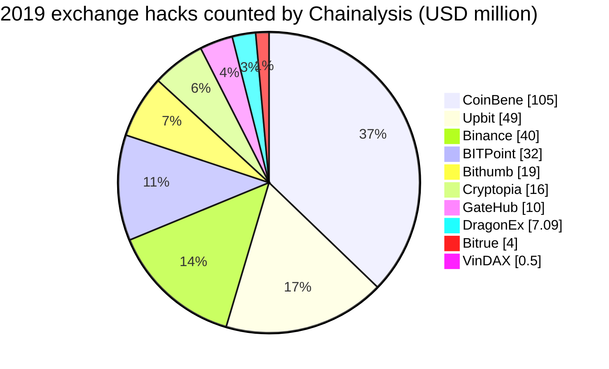
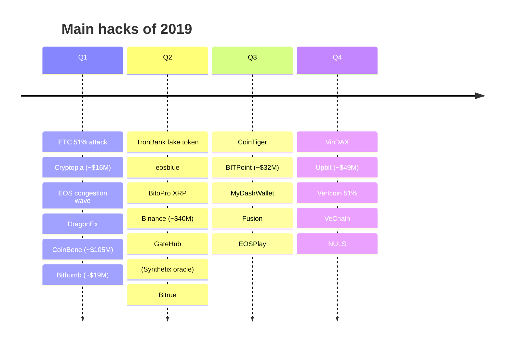
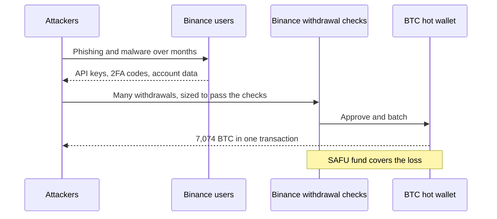

2019 was a year of exchange hacks. Chainalysis counted eleven successful attacks on exchanges, more than in any previous year, for about $283M stolen, much less than 2018's ~$876M from six attacks. The largest were CoinBene (~$105M by on-chain analysis, though the exchange denied being hacked), Upbit (342,000 ETH, ~$49M), Binance (7,074 BTC, ~$40M) and BITPoint (~$28M to ~$32M). DeFi barely existed, and its only large incident, a Synthetix oracle error that briefly let a bot earn more than $1B, was reversed.

The most frequent victims were not exchanges but gambling applications on EOS and Tron. SlowMist lists about 70 attacks on them in 2019, each worth hundreds or thousands of EOS or TRX, using techniques specific to those chains. This article reviews the year with the method of the site's `crypto-hacks` series: statistics from the [SlowMist Hacked](https://hacked.slowmist.io/) database, the trackers' annual figures, official statements and analytics firms. Frauds (PlusToken, WoToken, QuadrigaCX) and accidents are kept out of the hack totals and listed separately. A companion article, [The Technical Concepts Behind the 2019 Crypto Hacks]({{site.url_complet}}/2026/10/07/crypto-hacks-2019-technical-concepts/), explains the mechanisms for smart-contract and exchange developers.

> This article has been made with the help of [Claude Code](https://claude.com/product/claude-code) and several custom skills

[TOC]

## Scope, sources and caveats

The article covers incidents from 1 January to 31 December 2019. No Telegram export of the CryptoAlertHack channel was available, and Rekt News did not exist yet. The figures need six caveats:

- **SlowMist's database is almost unpriced for 2019.** Only 9 of its 111 hack entries carry an amount, and it leaves out Binance, Upbit, Cryptopia, Bithumb, GateHub and Bitrue. Its computed total (~$86M) is not a usable figure for the year; the article relies on Chainalysis, CipherTrace and DeFiLlama instead.
- **Frauds are not hacks.** PlusToken (~$2B to ~$3B), WoToken (~$1.1B), QuadrigaCX and the ~$850M Bitfinex lost at its payment processor Crypto Capital are listed in [Frauds and collapses](#frauds-and-collapses) and not counted. Coinbin (~$26M), whose loss was an employee's embezzlement, is treated the same way.
- **Accidents are not hacks.** The Kraken flash crash of 1 June and the Synthetix oracle error of 25 June involved no attacker breaking into a system. They are listed in [Accidents](#accidents) and not counted.
- **Insider or outsider is disputed.** Bithumb called its March loss insider embezzlement, while the UN Panel of Experts lists it as a North Korean attack. It is counted as a hack, as Chainalysis does.
- **CoinBene denied being hacked.** It blamed "maintenance" while about $105M of tokens left its wallets. Chainalysis counts it as the year's largest hack; this article does too, and flags it.
- **USD values are approximate**, valued at the time of each report.

## 2019 in numbers

### The annual figures

| Source | Stolen (approx. USD) | Incidents | Notable split |
|--------|--:|--:|---------------|
| [Chainalysis](https://go.chainalysis.com/rs/503-FAP-074/images/2020-Crypto-Crime-Report.pdf) (2020 Crypto Crime Report) | $283M (exchanges only) | 11 exchange hacks | Down from ~$876M in 2018; scams took ~$4.3B, 92% of it Ponzi schemes |
| [CipherTrace](https://decrypt.co/18988/crypto-fraud-theft-doubled-4-5-billion-2019-new-report) (Q4 2019 report) | $371M thefts and hacks | n/a | Fraud and misappropriation ~$4.1B; total ~$4.5B |
| [SlowMist summary](https://slowmist.medium.com/slowmist-2019-blockchain-security-major-events-summary-c51f91b9d54b) | > $5B (incl. frauds) | > 130 | PlusToken counted at ~$2B |
| [PeckShield](https://www.blocktempo.com/peckshield-cyber-security-report-2019/) (2019 annual, press summary) | ~$7.7B (incl. frauds) | 177 | Includes PlusToken and other Ponzi schemes |
| [DeFiLlama](https://defillama.com/hacks) (computed) | ~$241M | 24 | $277M as listed, minus the Kraken flash crash and Coinbin |

The trackers that exclude frauds land between about $240M and $370M; those that include them, between $4.5B and $7.7B. The difference is almost entirely PlusToken, WoToken and Bitfinex's Crypto Capital loss.

North Korea's 2019 activity is mostly known through the [UN Panel of Experts](https://documents.un.org/doc/undoc/gen/n19/243/04/pdf/n1924304.pdf), which estimated the country's revenue from cyber operations at up to $2B over several years and noted that in 2019 its hackers "shifted focus to targeting cryptocurrency exchanges". Its list for 2019 includes DragonEx and Bithumb. Chainalysis attributes only DragonEx by name. South Korea's police attributed the Upbit theft to Lazarus and Andariel in [November 2024](https://www.koreajoongangdaily.com/korea/north-korea-confirmed-perpetrator-of-2019-upbit-crypto-theft/12160981).

### Month by month

No monthly series from CertiK or PeckShield exists for 2019, and SlowMist prices too few entries for a monthly total. The table gives SlowMist's incident count and DeFiLlama's monthly sums, with the Kraken flash crash and Coinbin removed.

| Month | SlowMist incidents | DeFiLlama loss | Largest hack |
|-------|--:|--:|------|
| January | 29 | ~$16.3M | Cryptopia; ETC 51% attack; EOS congestion attacks |
| February | 5 | none | Mostly EOS DApps (Coinbin moved to frauds) |
| March | 22 | ~$66.1M | CoinBene, Bithumb, DragonEx |
| April | 7 | none priced | TronBank fake token, eosblue memo attack |
| May | 8 | ~$44.3M | Binance, BitoPro (XRP) |
| June | 7 | ~$14.2M | GateHub, Bitrue |
| July | 11 | ~$27.6M | BITPoint, MyDashWallet |
| August | 7 | ~$9.2M | CoinTiger (disclosed; breach in July) |
| September | 3 | ~$6.4M | Fusion, EOSPlay |
| October | 2 | none | BitDice (fake EOS) |
| November | 6 | ~$49.8M | Upbit, VinDAX |
| December | 4 | ~$7.0M | VeChain Foundation, NULS, Vertcoin 51% attack |

DeFiLlama lists the January Ethereum Classic attack as "$219,500", which is the number of ETC double-spent according to Coinbase (about $1.1M), not dollars.

### The largest incidents

| Rank | Date | Incident | Category | Reported loss (approx. USD) | Root cause (summary) |
|:---:|------|----------|----------|--:|----------------------|
| 1 | 25 Mar | CoinBene | CEX | $40M to $105M | Unknown; the exchange denied a hack while 109 tokens left its wallets |
| 2 | 27 Nov | Upbit | CEX | $49M (342,000 ETH) | Hot wallet emptied; Lazarus and Andariel (Korean police, 2024) |
| 3 | 7 May | Binance | CEX | $40M (7,074 BTC) | User API keys and 2FA codes collected by phishing and malware |
| 4 | 11 Jul | BITPoint | CEX | $28M to $32M | Hot-wallet keys for five assets |
| 5 | 29 Mar | Bithumb | CEX | $19M to $20M | Hot wallet; insider (Bithumb) or North Korea (UN) |
| 6 | 14 Jan | Cryptopia | CEX | $16M | Private keys of deposit wallets |
| 7 | 1 Jun | GateHub | Wallet / exchange | $10M (XRP) | Database of API access tokens; encrypted keys pulled through the API |
| 8 | 1 Jul | CoinTiger | CEX | $9.2M (PTT) | Single-signature key; disclosed 47 days later |
| 9 | 24 Mar | DragonEx | CEX | $6M to $9M | Trojanised trading bot; Lazarus (Chainalysis, UN) |
| 10 | 13 Dec | VeChain Foundation | L1 foundation | $6.5M (1.1B VET) | Buyback account set up outside procedure |
| 11 | 28 Sep | Fusion | L1 | $6.4M | Swap wallet key leaked |
| 12 | 27 Jun | Bitrue | CEX | $4.2M to $4.7M | Flaw in the risk team's second-review process |
| 13 | ~2 May | BitoPro | CEX | $2.2M (7M XRP) | XRP partial payments credited at face value |
| 14 | Jan to Apr | Electrum phishing | Wallet users | $4.6M cumulative | Malicious servers pushing fake updates |
| 15 | 5 to 7 Jan | Ethereum Classic | L1 | $1.1M double-spent | 51% attack with rented hash power |

### Statistics from the SlowMist database

Computed from the 2019 entries of the SlowMist Hacked database, after removing 13 frauds and four entries that were not hacks: the two accidents below, the Trezor research disclosure, and Waltonchain, where no theft was found.

- **111 incidents**, of which only **9 have a stated loss**, for ~$86M. CoinBene and BITPoint are 84% of it.
- **About 70 entries concern EOS and Tron gambling applications**, almost all without a dollar amount. The rest are exchanges, chains, wallets and data leaks.

| Category | Incidents | Loss (approx. USD) |
|---|--:|--:|
| Other / unknown (mostly EOS and Tron DApps) | 92 | $52.2M |
| Key / infrastructure compromise | 12 | $34.1M |
| Smart contract vulnerability | 5 | not stated |
| Oracle / price manipulation | 1 | not stated |
| Phishing / account takeover | 1 | not stated |

SlowMist files the EOS DApp attacks under labels such as "transaction congestion" (24 entries), "roll back" (16), "fake EOS" (4) and "hard_fail" (3), plus random-number attacks. These are explained in the [companion article]({{site.url_complet}}/2026/10/07/crypto-hacks-2019-technical-concepts/).

## Exchanges: the year's main target

### Binance (~$40M, May)

On 7 May at 17:15 UTC, a single Bitcoin transaction withdrew 7,074 BTC from Binance's hot wallet, about 2% of its BTC holdings. Binance [explained](https://binance.zendesk.com/hc/en-us/articles/360028031711) that the attackers had collected "a large number of user API keys, 2FA codes, and potentially other info" through phishing and malware, and had waited to structure withdrawals from many accounts so that they passed the exchange's existing security checks at once. The SAFU insurance fund covered the loss in full, and deposits and withdrawals were suspended for about a week.

Binance's CEO briefly floated asking miners to reorganise the Bitcoin chain to reverse the theft, then dropped the idea after criticism. The incident shaped exchange practices: withdrawal limits per API key, address allowlists for API withdrawals and anomaly detection on aggregated outflows, not only per account.

### Upbit (~$49M, November)

On 27 November, 342,000 ETH moved from Upbit's Ethereum hot wallet to a single address ([Security Affairs](https://securityaffairs.com/94463/cyber-crime/upbit-exchange-hacked.html)). Upbit's operator Dunamu covered the loss. Five years later, [South Korea's police](https://www.koreajoongangdaily.com/korea/north-korea-confirmed-perpetrator-of-2019-upbit-crypto-theft/12160981) attributed the theft to North Korea's Lazarus and Andariel groups, citing IP addresses, the flow of funds and North Korean vocabulary; 57% of the ETH had been swapped for bitcoin at a discount on three exchanges suspected of being run by North Korea.

### CoinBene (~$105M, March): a hack the exchange denied

From 25 March, tokens worth about $105M across 109 ERC-20 assets left CoinBene's wallets ([Elementus](https://elementus.io/blog/coinbene-analysis)). The exchange announced "maintenance" and denied any hack, while on-chain analysts traced the funds to decentralised exchanges ([Cointelegraph](https://cointelegraph.com/features/over-100-million-missing-coinbene-claims-maintenance-a-month-of-questions-point-toward-a-hack)). Chainalysis counts it as the year's largest exchange hack; SlowMist (~$45M) and DeFiLlama ($40M) give lower figures. No cause was ever published.

### The other exchange hacks

- **BITPoint (~$28M to ~$32M, July).** Hot-wallet keys for BTC, BCH, ETH, LTC and XRP were used to empty the hot wallet of the Japanese exchange. Remixpoint, its parent, [revised the loss](https://www.remixpoint.co.jp/corporate/ir/2019/5812) to about ¥3.02B after part of it was found at other exchanges.
- **Bithumb (~$19M, March).** About 3M EOS and 20M XRP left the hot wallet. Bithumb's [own notice](https://cafe.bithumb.com/view/board-contents/1640037) called it insider embezzlement; the UN lists it as North Korea's fourth attack on Bithumb.
- **Cryptopia (~$16M, January).** The attacker held the private keys of more than 76,000 Ethereum deposit wallets of the New Zealand exchange and drained them over several days ([Elementus](https://elementus.io/blog/cryptopia-hack-transparency)). Cryptopia went into liquidation in May.
- **GateHub (~$10M, June).** Attackers accessed a database of API access tokens and pulled users' encrypted secret keys through the API; 103 wallets lost XRP ([GateHub](https://gatehub.net/blog/gatehub-preliminary-statement/)). French authorities later seized part of the proceeds.
- **DragonEx (~$7M, March).** Staff were given a trojanised trading bot by a fake company, a technique attributed to Lazarus by Chainalysis and the UN ([Bitcoin Magazine](https://bitcoinmagazine.com/articles/lazarus-hacker-group-continues-target-crypto-using-faked-trading-software)).
- **Bitrue (~$4.2M to ~$4.7M, June).** A flaw in the risk-control team's second-review process gave access to about 90 user accounts and then the hot wallet. Other exchanges froze about $1.35M ([Bitrue on X](https://twitter.com/BitrueOfficial/status/1144066874147131392)).
- **CoinTiger (~$9.2M, July).** About 402M PTT tokens left a wallet controlled by a single key; the exchange disclosed it 47 days later.
- **BitoPro (~$2.2M, May).** An attacker sent XRP payments with the "partial payment" flag and was credited with the nominal amount instead of the amount actually delivered, then withdrew about 7M XRP ([ForkLog](https://forklog.com/zloumyshlennik-vyvel-s-birzhi-bitopro-7-mln-xrp-cherez-uyazvimost-chastichnogo-platezha/)). Beaxy was hit the same way in August.

## EOS and Tron gambling applications

Most of SlowMist's 2019 entries are attacks on dice, lottery and casino contracts on EOS and Tron, which held large balances and settled bets on-chain. Individually small, they show techniques specific to those chains:

- **Transaction congestion.** An attacker filled blocks with deferred transactions so that a casino's reveal landed in a later block and its time-based seed changed (CVE-2019-6199, patched in January, [PeckShield](https://blog.peckshield.com/2019/01/15/eos_CVE-2019-6199/)). EOS.WIN, FarmEOS, playgames and many others were hit.
- **Rollback.** An attacker's contract placed a bet and reverted the whole transaction if it lost, as at WinDice, TGON and ZION; on Tron, SPOKpark and 7Tron lost hundreds of thousands of TRX this way.
- **Fake EOS and fake notifications.** Contracts credited transfers of a token named "EOS" issued by the attacker, or transfer notifications forwarded from transfers between the attacker's own accounts (nkpaymentcap lost 50,000 EOS in March).
- **Predictable random numbers.** EOSPlay lost about 30,000 EOS in September to an attacker who rented CPU to congest the chain and predict the block used as a seed ([SlowMist](https://slowmist.medium.com/details-of-a-new-type-random-number-attack-on-eos-ede0211d9cc2)).
- **Fake tokens on Tron.** TronBank accepted a token the attacker issued, because it checked the amount sent but not the token ID, and lost about 170M BTT in April ([BlockTempo](https://www.blocktempo.com/tron-dapp-tronbank-was-fishing-170mln-btt/)).

No reliable 2019 total exists for these losses. The largest single entries are Poker EOS (~27,000 EOS, a key leak), EOSPlay (~30,000 EOS) and Royale (~18,000 EOS), each worth around $100k or less at 2019 prices.

## Chains, wallets and users

- **Ethereum Classic 51% attack (January).** Coinbase [detected](https://www.coinbase.com/blog/deep-chain-reorganization-detected-on-ethereum-classic-etc) 15 chain reorganisations, 12 with double spends worth 219,500 ETC (~$1.1M). Gate.io lost about $200k; the attacker [returned $100k](https://www.coindesk.com/markets/2019/01/14/exchange-says-51-attacker-returned-100k-worth-of-ethereum-classic/). Vertcoin was attacked again in December.
- **NULS (December).** A bug in transaction signature verification let an attacker move 2M NULS (~$480k) from the team account; a hard fork froze the rest ([Decrypt](https://decrypt.co/15556/nuls-could-have-accidentally-frozen-funds-following-476000-hack)).
- **VeChain Foundation (December).** 1.1B VET (~$6.5M) left the foundation's buyback account, which a team member had set up outside the agreed procedure ([CoinDesk](https://www.coindesk.com/business/2019/12/13/vechain-foundation-hacked-for-65m-in-vet-token-theft/)).
- **Fusion (September).** The key of the swap wallet leaked and about 38% of the circulating supply was taken ([Decrypt](https://decrypt.co/9766/the-fusion-network-hacked)).
- **Electrum phishing.** From December 2018, malicious servers showed Electrum users an error message urging a fake update; by April, about $4.6M had been stolen ([Malwarebytes](https://www.malwarebytes.com/blog/news/2019/04/electrum-ddos-botnet-reaches-152000-infected-hosts)).
- **Supply chain.** An npm package used by Komodo's Agama wallet was modified to steal seeds; npm and Komodo [moved more than $13M](https://blog.npmjs.org/post/185397814280/plot-to-steal-cryptocurrency-foiled-by-the-npm) of user funds before the attacker could. MyDashWallet loaded a third-party script that was hijacked to send out private keys.
- **Data leaks and SIM swaps.** GateHub's breach exposed data of 1.4M accounts ([Have I Been Pwned](https://haveibeenpwned.com/api/v3/breach/GateHub)); Binance (KYC photos) and BitMEX (an email without BCC) leaked customer data. SIM swaps drained individual accounts, such as the ~$100k [described by one victim](https://medium.com/coinmonks/the-most-expensive-lesson-of-my-life-details-of-sim-port-hack-35de11517124).

## DeFi near-misses

Ethereum DeFi held little value in 2019, and its most serious bugs were found before anyone exploited them:

- **0x v2 (July).** The signature type that asked a wallet contract to validate a signature accepted any address without code, so anyone could sign orders on behalf of accounts that had approved 0x; samczsun [found it](https://samczsun.com/the-0x-vulnerability-explained/) and the exchange contract was shut down and replaced, with no loss.
- **MakerDAO DSChief (May).** OpenZeppelin [found a flaw](https://www.openzeppelin.com/news/makerdao-critical-vulnerability) in the governance contract that could have locked more than $100M of MKR; Maker redeployed it.
- **Uniswap v1 and ERC-777 (April).** A ConsenSys Diligence [audit](https://diligence.consensys.io/blog/2019/04/uniswap-audit) warned that tokens with transfer hooks allowed reentrancy into Uniswap v1. The warning was exploited a year later, in April 2020.

## Frauds and collapses

Frauds and collapses are not hacks: no system was broken into. They are listed here and **not counted in this article's hack totals**.

SlowMist lists 13 frauds for 2019 with stated losses of about $1.99B, most of it WoToken and Bitfinex.

| Date | Scheme | Loss (approx. USD) | What happened |
|------|--------|--:|---------------|
| Jun | PlusToken | $2B (Chainalysis) to $3B | Wallet Ponzi scheme in China and Korea; withdrawals frozen, arrests in 2019 and 2020 ([Chainalysis](https://blog.chainalysis.com/reports/plustoken-scam-bitcoin-price)) |
| Aug 2018 to Nov 2019 | WoToken | ~$1.1B | Ponzi scheme in China; operators sentenced in 2020 |
| Apr | Bitfinex / Crypto Capital | ~$850M | Funds lost at a Panamanian payment processor; New York's attorney general alleged a cover-up using Tether reserves ([NYAG](https://ag.ny.gov/press-release/2019/attorney-general-james-announces-court-order-against-crypto-currency-company)) |
| Jan (disclosed) | QuadrigaCX | ≥ C$169M | Presented as keys lost at the founder's death; Ontario's securities regulator found fraud by the founder ([OSC](https://www.osc.ca/quadrigacxreport/index.html)) |
| Feb | Coinbin | ~$26M | Employee embezzlement; the Korean exchange went bankrupt |
| Jun | Bitsane | not stated | Irish exchange vanished with its users' funds |
| Jun | TokenStore | not stated | Announced a "hack", then disappeared |
| Jul | Bitmarket | not stated | Polish exchange shut down citing a loss of liquidity |
| Jul | Tron-linked Ponzi schemes | ≥ $30M | Investigated by Beijing police |

## Accidents

Accidents are losses with no attacker breaking into a system. They are listed here and **not counted in this article's hack totals**.

| Date | Incident | Amount | What happened |
|------|----------|--:|---------------|
| 1 Jun | Kraken flash crash | ~$10.5M (DeFiLlama) | The BTC/CAD price fell from about C$11,000 to C$101 for a few minutes, and one user's 1,155 BTC were sold at the crash price. DeFiLlama lists it as a hack; no attacker was involved. |
| 25 Jun | Synthetix oracle | > $1B, reversed | One of Synthetix's price feeds reported the Korean won at 1,000 times its value; with only two feeds left after an outage, the outlier filter failed. A trading bot profited more than $1B in synthetic assets in under an hour, then agreed to reverse the trades for a bounty ([Synthetix](https://blog.synthetix.io/response-to-oracle-incident/)). |

The Synthetix bot exploited a price it had not manipulated, so Chainalysis also leaves it out of its hack figures.

## Official post-mortems and statements

| Incident | Source | What it says |
|----------|--------|--------------|
| Binance | [Security breach update](https://binance.zendesk.com/hc/en-us/articles/360028031711) | 7,000 BTC; API keys and 2FA codes; SAFU covers |
| BITPoint | [Remixpoint notice](https://www.remixpoint.co.jp/corporate/ir/2019/5812) | Hot wallet; revised loss |
| Bithumb | [Apology notice](https://cafe.bithumb.com/view/board-contents/1640037) | Insider embezzlement suspected |
| GateHub | [Preliminary statement](https://gatehub.net/blog/gatehub-preliminary-statement/), [criminal proceedings](https://gatehub.net/blog/gatehub-update-criminal-proceedings-in-france-2/) | Access tokens, keys pulled via API; French investigation |
| Bitrue | [Statement on X](https://twitter.com/BitrueOfficial/status/1144066874147131392) | Second-review flaw; funds frozen elsewhere |
| Coinbase on ETC | [Deep chain reorganisation](https://www.coinbase.com/blog/deep-chain-reorganization-detected-on-ethereum-classic-etc) | 219,500 ETC double-spent |
| Synthetix | [Response to oracle incident](https://blog.synthetix.io/response-to-oracle-incident/) | KRW feed error, trades reversed |
| npm / Komodo | [npm blog](https://blog.npmjs.org/post/185397814280/plot-to-steal-cryptocurrency-foiled-by-the-npm) | Malicious package; funds moved first |
| Upbit | Notice on upbit.com (not readable) | Korean police attribution used instead |
| CoinBene | None (denied) | Elementus analysis used |
| Cryptopia | Facebook post and police statement (quoted by press) | Breach confirmed; liquidation later |

## Observations

- **Exchanges were the target, and their hot wallets the weak point.** All five largest hacks hit exchanges, through hot-wallet keys, user accounts or a cause never disclosed (CoinBene).
- **Attackers learned to work around exchange controls.** Binance's withdrawals were sized to pass its checks; Bitrue's attacker went through its human review process.
- **"Was the deposit real?" was the question most systems got wrong**: XRP partial payments, fake EOS tokens, forwarded notifications and Tron fake tokens all made platforms credit value they never received.
- **On-chain gambling exposed the limits of on-chain randomness**, with dozens of EOS casinos losing to predictable seeds, congestion and rollbacks.
- **Frauds were more than ten times larger than hacks.** PlusToken alone was worth about seven times all the year's exchange hacks.
- **North Korean attributions arrived late.** DragonEx was attributed in 2019, Upbit only in 2024.

## Data gaps

This section lists what could not be found or verified while writing this article, so that it can be completed later. Each row says what is missing and where to look first.

| Gap | What is missing or unverified | Where to search |
|-----|-------------------------------|-----------------|
| Telegram export | No CryptoAlertHack export was available for 2019. | A Telegram export for 2019 |
| SlowMist amounts | Only 9 of 111 hack entries are priced; Binance, Upbit, Cryptopia, Bithumb, GateHub and Bitrue are unpriced. | SlowMist database, SlowMist 2019 report |
| CoinBene | No cause was ever published; SlowMist's ~$45M has no named source; the "maintenance" statement was not found. | CoinBene's X account, Elementus, Wayback Machine |
| PeckShield and CertiK | PeckShield's 2019 report was read only through a press summary; no CertiK 2019 report was found; no monthly series exists. | PeckShield blog, January–February 2020 |
| Upbit | The original Upbit notice is JavaScript-rendered and was not read. | upbit.com notice 1085, Wayback Machine |
| Smaller exchanges | No official statements found for Coinbin, CoinTiger and VinDAX; GateHub's 23.2M XRP is from press. | Exchange websites, Wayback Machine |
| Binance reorg | The CEO's tweet about a Bitcoin reorganisation was not located. | X archive of May 2019 |
| EOS and Tron totals | No reliable 2019-only total for EOS and Tron DApp losses; the eosblue memo payload is not public. | PeckShield DAppShield, DappTotal archives |
| Remitano | The XRP false-deposit case was not verified. | Remitano statements, SlowMist |
| Frauds | WoToken's arrest date, TokenStore's amount and the QuadrigaCX report date were seen only in search results. | Chinese court records, OSC report |
| Synthetix | The ~37M sETH figure is from memory and not used. | Synthetix blog, Etherscan |
| Attribution | Chainalysis gives no dollar share for Lazarus in 2019; Bithumb's attribution conflicts between Bithumb and the UN. | UN S/2020/151, Chainalysis |

## Conclusion

2019 was the year of exchange hacks: about $283M stolen in eleven attacks according to Chainalysis, $240M to $370M across the trackers that exclude frauds.

- **Exchanges** lost the most: CoinBene (~$105M, denied), Upbit (~$49M), Binance (~$40M), BITPoint, Bithumb, Cryptopia and GateHub.
- **EOS and Tron casinos** were attacked dozens of times through congestion, rollbacks, fake tokens and predictable randomness.
- **Chains and users** lost money to 51% attacks, key leaks, fake wallet updates and a supply-chain attack on npm.
- **Frauds** (PlusToken, WoToken, QuadrigaCX, the Bitfinex Crypto Capital loss) dwarfed the hacks and are kept apart.
- **Accidents** (the Kraken flash crash, the Synthetix oracle error) involved no attacker and are not counted.

## Annex

### Key Terms

| Term | Definition |
|------|------------|
| **Hot wallet** | An exchange wallet whose keys are online to process withdrawals; the target of most 2019 hacks. |
| **API key** | A credential letting software trade or withdraw on a user's behalf; stolen en masse in the Binance attack. |
| **2FA code** | A one-time code from a second factor; Binance's attackers collected them along with API keys. |
| **SAFU** | Binance's insurance fund, which covered the May 2019 theft. |
| **Partial payment** | An XRP Ledger payment that may deliver less than its nominal amount; exchanges must credit the delivered amount. |
| **Deferred transaction** | An EOS transaction scheduled for a later block, abused to congest blocks. |
| **Rollback attack** | Reverting one's own losing bet within the same transaction. |
| **Fake EOS** | A token named EOS issued by an attacker's contract instead of `eosio.token`. |
| **Transfer notification** | An EOS mechanism telling a contract about a transfer; attackers forwarded notifications of transfers that did not involve the victim. |
| **51% attack** | Rewriting recent blocks with majority hash power to reverse transactions. |
| **Chain reorganisation** | The replacement of recent blocks by a longer competing chain. |
| **Supply-chain attack** | Compromising a dependency or service that the target's software uses. |
| **Ponzi scheme** | A fraud paying early investors with later investors' money; not a hack. |
| **Accident** | A loss with no attacker, such as a flash crash or an oracle error; not counted as a hack. |

## Frequently Asked Questions

**Q: How much was stolen in crypto hacks in 2019?**

About $283M from eleven exchange attacks according to Chainalysis, and about $371M in thefts and hacks according to CipherTrace. DeFiLlama's list gives about $241M once a flash crash and an embezzlement are removed. Totals of $4.5B to $7.7B include frauds such as PlusToken and WoToken.

**Q: How did attackers take 7,000 BTC from Binance?**

They did not break into Binance's wallet directly. Over time, they collected API keys and 2FA codes of many Binance users through phishing and malware, then placed withdrawals from those accounts, sized and timed so that they passed Binance's checks and left in one transaction. Binance's insurance fund covered the loss.

**Q: Why did CoinBene deny being hacked?**

CoinBene said its wallets were under maintenance while on-chain analysts saw about $105M of tokens move out and be sold on decentralised exchanges. The exchange never published an explanation, so the cause, and whether it was an external hack, remain unknown. Chainalysis counts it as the year's largest exchange hack.

**Q: Why were EOS casinos attacked so often?**

They held large balances, settled bets on-chain, and had to generate random numbers on a chain where the inputs they used (block data, timestamps) were visible or influenceable. EOS also offered features that attackers turned into weapons: deferred transactions to congest blocks, inline actions to revert losing bets, and notifications that could be forwarded.

**Q: Is the Upbit hack attributed to North Korea?**

Yes, but only since November 2024, when South Korea's police named the Lazarus and Andariel groups based on IP addresses, fund flows and vocabulary. At the time of the theft, no attribution was made.

**Q: Why are PlusToken and QuadrigaCX not counted?**

Both were frauds by their operators. PlusToken was a Ponzi scheme presented as a wallet, and QuadrigaCX's missing funds, first blamed on keys lost at the founder's death, were found by Ontario's securities regulator to have been taken by the founder through fake accounts. No outside attacker broke into either system.

## References

### Annual reports and figures

- [Chainalysis: 2020 Crypto Crime Report](https://go.chainalysis.com/rs/503-FAP-074/images/2020-Crypto-Crime-Report.pdf)
- [Decrypt: crypto fraud and theft doubled to $4.5 billion in 2019 (CipherTrace)](https://decrypt.co/18988/crypto-fraud-theft-doubled-4-5-billion-2019-new-report)
- [SlowMist: 2019 blockchain security major events summary](https://slowmist.medium.com/slowmist-2019-blockchain-security-major-events-summary-c51f91b9d54b)
- [BlockTempo: PeckShield 2019 security report](https://www.blocktempo.com/peckshield-cyber-security-report-2019/)
- [UN Panel of Experts report S/2019/691](https://documents.un.org/doc/undoc/gen/n19/243/04/pdf/n1924304.pdf)
- [DeFiLlama hacks](https://defillama.com/hacks)

### Official statements and post-mortems

- [Binance: security breach update](https://binance.zendesk.com/hc/en-us/articles/360028031711)
- [Remixpoint: BITPoint notice](https://www.remixpoint.co.jp/corporate/ir/2019/5812)
- [Bithumb: apology notice](https://cafe.bithumb.com/view/board-contents/1640037)
- [GateHub: preliminary statement](https://gatehub.net/blog/gatehub-preliminary-statement/), [investigation update](https://gatehub.net/blog/gatehub-update-investigation-continues/), [criminal proceedings in France](https://gatehub.net/blog/gatehub-update-criminal-proceedings-in-france-2/)
- [Bitrue (on X)](https://twitter.com/BitrueOfficial/status/1144066874147131392)
- [Coinbase: deep chain reorganisation detected on Ethereum Classic](https://www.coinbase.com/blog/deep-chain-reorganization-detected-on-ethereum-classic-etc)
- [Synthetix: response to oracle incident](https://blog.synthetix.io/response-to-oracle-incident/)
- [npm: plot to steal cryptocurrency foiled](https://blog.npmjs.org/post/185397814280/plot-to-steal-cryptocurrency-foiled-by-the-npm)
- [Ontario Securities Commission: QuadrigaCX report](https://www.osc.ca/quadrigacxreport/index.html)
- [New York Attorney General: court order against Bitfinex and Tether](https://ag.ny.gov/press-release/2019/attorney-general-james-announces-court-order-against-crypto-currency-company)

### Analytics firms and technical analyses

- [Chainalysis: cryptocurrency exchange hacks in 2019](https://blog.chainalysis.com/reports/cryptocurrency-exchange-hacks-2019), [PlusToken scam](https://blog.chainalysis.com/reports/plustoken-scam-bitcoin-price)
- [Elementus: CoinBene analysis](https://elementus.io/blog/coinbene-analysis), [Cryptopia hack transparency](https://elementus.io/blog/cryptopia-hack-transparency)
- [PeckShield: EOS CVE-2019-6199](https://blog.peckshield.com/2019/01/15/eos_CVE-2019-6199/), [SlowMist: new random number attack on EOS](https://slowmist.medium.com/details-of-a-new-type-random-number-attack-on-eos-ede0211d9cc2)
- [samczsun: the 0x vulnerability explained](https://samczsun.com/the-0x-vulnerability-explained/), [OpenZeppelin: MakerDAO critical vulnerability](https://www.openzeppelin.com/news/makerdao-critical-vulnerability), [ConsenSys Diligence: Uniswap audit](https://diligence.consensys.io/blog/2019/04/uniswap-audit)
- [Korea JoongAng Daily: North Korea confirmed perpetrator of 2019 Upbit theft](https://www.koreajoongangdaily.com/korea/north-korea-confirmed-perpetrator-of-2019-upbit-crypto-theft/12160981)
- [Bitcoin Magazine: Lazarus and faked trading software (DragonEx)](https://bitcoinmagazine.com/articles/lazarus-hacker-group-continues-target-crypto-using-faked-trading-software)
- [Malwarebytes: Electrum DDoS botnet](https://www.malwarebytes.com/blog/news/2019/04/electrum-ddos-botnet-reaches-152000-infected-hosts)

### Press

- [Security Affairs: Upbit hacked](https://securityaffairs.com/94463/cyber-crime/upbit-exchange-hacked.html), [Cointelegraph: CoinBene claims maintenance](https://cointelegraph.com/features/over-100-million-missing-coinbene-claims-maintenance-a-month-of-questions-point-toward-a-hack)
- [CoinDesk: ETC attacker returned $100k](https://www.coindesk.com/markets/2019/01/14/exchange-says-51-attacker-returned-100k-worth-of-ethereum-classic/), [CoinDesk: VeChain Foundation hacked](https://www.coindesk.com/business/2019/12/13/vechain-foundation-hacked-for-65m-in-vet-token-theft/)
- [Decrypt: NULS hack and hard fork](https://decrypt.co/15556/nuls-could-have-accidentally-frozen-funds-following-476000-hack), [Decrypt: Fusion hacked](https://decrypt.co/9766/the-fusion-network-hacked)
- [ForkLog: BitoPro XRP partial payment](https://forklog.com/zloumyshlennik-vyvel-s-birzhi-bitopro-7-mln-xrp-cherez-uyazvimost-chastichnogo-platezha/), [BlockTempo: TronBank fake BTT](https://www.blocktempo.com/tron-dapp-tronbank-was-fishing-170mln-btt/)
- [Have I Been Pwned: GateHub breach](https://haveibeenpwned.com/api/v3/breach/GateHub), [Coinmonks: a SIM port hack](https://medium.com/coinmonks/the-most-expensive-lesson-of-my-life-details-of-sim-port-hack-35de11517124)

### Related articles

- [Crypto Hacks of 2018 - Coincheck, BitGrail and the Year of Exchange Breaches]({{site.url_complet}}/2026/10/07/crypto-hacks-2018/)
- [The Technical Concepts Behind the 2019 Crypto Hacks]({{site.url_complet}}/2026/10/07/crypto-hacks-2019-technical-concepts/)
- [Crypto Hacks of 2020 - KuCoin, Flash Loans and the DeFi Summer]({{site.url_complet}}/2026/10/07/crypto-hacks-2020/)
- [Security of Cryptocurrency Exchanges - Overview]({{site.url_complet}}/2025/11/06/crypto-exchange-security-overview/)
