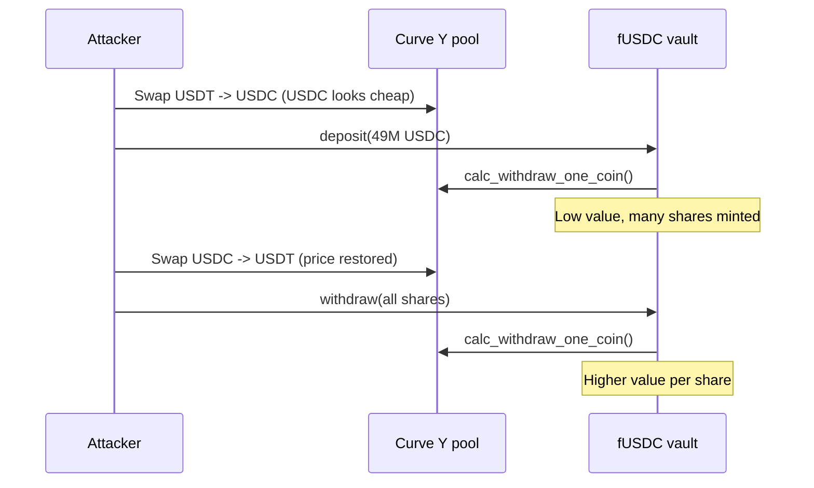
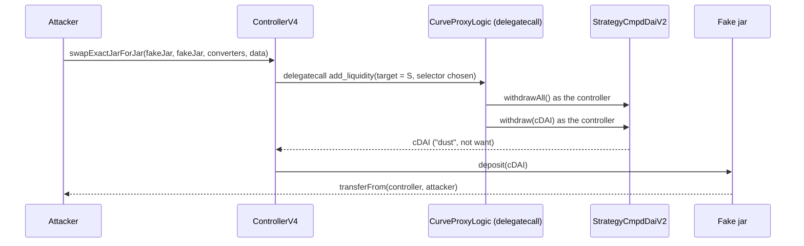

The [recap of the 2020 crypto hacks]({{site.url_complet}}/2026/10/07/crypto-hacks-2020/) summarises each incident in one line: "the first flash-loan attack", "an ERC-777 hook re-entered `withdraw` during a deposit", "a self-transfer doubled the balance". This companion article explains those mechanisms for a developer who writes Solidity, knows how AMMs, lending markets and vaults work, and wants to see what exactly broke.

2020 is where most of DeFi's attack classes start. Flash loans turned every manipulable price into a free attack, tokens with hooks or transfer fees broke contracts written for plain ERC-20s, and small accounting slips (a cached balance, a `msg.value` read inside a loop, a struct copied to memory too early) became million-dollar bugs. The technical articles on [2021]({{site.url_complet}}/2026/10/07/crypto-hacks-2021-technical-concepts/), [2022]({{site.url_complet}}/2026/10/07/crypto-hacks-2022-technical-concepts/), [2023]({{site.url_complet}}/2026/10/07/crypto-hacks-2023-technical-concepts/) and [2024]({{site.url_complet}}/2026/10/07/crypto-hacks-2024-technical-concepts/) follow the same classes into later years.

> This article has been made with the help of [Claude Code](https://claude.com/product/claude-code) and several custom skills

> **About the code.** The Solidity snippets are simplified to show the mechanism. They are not the deployed code of the protocols named; read the linked post-mortems for the exact contracts.

[TOC]

## Flash loans and prices

### Capital for one transaction (bZx, February)

A flash loan lends any amount the pool holds, without collateral, on one condition: the loan is repaid before the transaction ends, or the whole transaction reverts. dYdX's `SoloMargin`, Aave and Uniswap v2's flash swaps all offered them in 2020.

```solidity
// The shape of every 2020 flash-loan attack
function attack() external {
    lender.flashLoan(address(this), WETH, 10_000 ether, "");
}

function onFlashLoan(...) external {
    // 1. move a price the victim reads (swap, deposit, donation)
    // 2. interact with the victim at the distorted price
    // 3. undo the price move
    // 4. repay; keep the difference
}
```

The first attack, on 15 February, combined a loan of 10,000 ETH from dYdX with a 5x short on bZx, whose trade pushed WBTC's price up on Uniswap through Kyber, while the attacker sold WBTC borrowed from Compound at the inflated price. [PeckShield](https://peckshield.medium.com/bzx-hack-full-disclosure-with-detailed-profit-analysis-e6b1fa9b18fc) found that bZx skipped its position health check (`shouldLiquidate`) in a specific branch of the margin trade, so the absurd position was accepted. The second, on 18 February, was a pure oracle attack: sUSD was pumped on Kyber, the exchange bZx used as its price source, and borrowed against.

What changed is the threat model. Before flash loans, manipulating a price required capital the attacker could lose. After them, every value a contract reads on-chain must be safe against an adversary with effectively unlimited capital for one block.

### A share price computed from a Curve pool (Harvest Finance, ~$24M)

Harvest's fUSDC vault minted and burned shares against the value of its strategy, which held Curve Y pool LP tokens valued through the pool's current balances:

```solidity
// Simplified
function getPricePerFullShare() public view returns (uint256) {
    return underlyingBalanceWithInvestment() * 1e18 / totalSupply();
}

// Strategy: value of yCRV in USDC, from Curve's current reserves
function investedUnderlyingBalance() public view returns (uint256) {
    return ycrvPool.calc_withdraw_one_coin(ycrvBalance(), USDC_INDEX);
}
```

The attacker swapped about 17M USDT into the pool, which made USDC look cheaper to `calc_withdraw_one_coin` and lowered the vault's value by about 1%. They deposited about 49M USDC at the lower share price, swapped back, and withdrew at the restored price, keeping the difference. Harvest had a guard that reverted deposits when the Curve price deviated from a reference by more than 3%; the attack needed only about 1% ([post-mortem](https://medium.com/harvest-finance/harvest-flashloan-economic-attack-post-mortem-3cf900d65217)).



Value DeFi's MultiStables vault was drained the same way in November through Curve's 3pool. A deviation threshold is a mitigation only if it is smaller than the profit margin of a round trip; the stronger fixes are to compute share prices from internal accounting, use time-weighted prices for valuation, and charge a deposit or withdrawal fee larger than the manipulation window allows.

### LP tokens priced from reserves (Warp Finance, Cheese Bank)

Warp accepted Uniswap v2 LP tokens as collateral and valued them by summing each reserve times its price and dividing by the LP supply. Reserves are exactly what a swap changes: a flash-loaned swap pushed one side up, and the naive formula valued the pool at about 2.3 times its real worth ([Warp](https://warpfinance.medium.com/warp-finance-exploit-summary-recovery-of-funds-5b8fe4a11898)). Cheese Bank priced its collateral from a Uniswap pool in the same way.

```text
naive:  value(LP) = (reserve0 * price0 + reserve1 * price1) / totalSupply
fair:   value(LP) = 2 * sqrt(reserve0 * reserve1) * sqrt(price0 * price1) / totalSupply
```

The "fair" formula, popularised by Alpha Finance after these incidents, uses the product of reserves, which a swap cannot increase, and external prices for each token. Any LP-token oracle must be built from the invariant, not from the reserves.

## Tokens that do not behave like ERC-20

### ERC-777 hooks (Uniswap v1 and Lendf.Me, April)

ERC-777 tokens look up the sender's and recipient's hooks in the ERC-1820 registry and call them during every transfer. `tokensToSend` is called on the sender **before** balances move. imBTC was an ERC-777 token.

Lendf.Me, a Compound v1 fork, transferred the deposited token in before writing the depositor's new balance, and computed that balance from a value cached at the start:

```solidity
// Lendf.Me MoneyMarket.supply, simplified
function supply(address asset, uint amount) public returns (uint) {
    Balance storage balance = supplyBalances[msg.sender][asset];
    uint newPrincipal = balance.principal + amount;          // computed from the old balance

    doTransferIn(asset, msg.sender, amount);                 // imBTC calls tokensToSend(attacker)
    // inside the hook: attacker calls withdraw(asset, max) -> principal set to 0, tokens sent out

    balance.principal = newPrincipal;                         // overwrites the withdrawal
    return 0;
}
```

During the hook, the attacker withdrew their existing balance. When `supply` resumed, it wrote back `old balance + amount`, erasing the withdrawal. Each round doubled the attacker's recorded collateral, which they then borrowed against across twelve markets ([Quantstamp](https://quantstamp.com/blog/how-the-dforce-hacker-used-reentrancy-to-steal-25-million)).

The day before, the same hook had been used against Uniswap v1's imBTC exchange, written in Vyper. Its token-to-ETH sale read the token reserve, paid out ETH, and only then pulled the seller's tokens with `transferFrom`. Re-entering from `tokensToSend` made a second sale priced against the same reserve as the first. About 1,278 ETH was lost.

The defences are the ones every later reentrancy repeats: update state before external calls, compute new values from storage after the call rather than from a cached copy, and put a `nonReentrant` guard on every function that moves tokens, including deposits. A protocol that lists arbitrary tokens has to assume some of them call back.

### Fee-on-transfer tokens and `gulp()` (Balancer, June)

Balancer pools tracked each token's balance in `_records[token].balance` and priced swaps from that record. STA burned 1% of every transfer, so every time STA entered the pool, Balancer recorded more than it received. Balancer also exposed a permissionless `gulp(token)` that set the record to the real balance.

```solidity
// BPool, simplified
function swapExactAmountIn(address tokenIn, uint amountIn, ...) external {
    ...
    inRecord.balance = inRecord.balance + amountIn;      // assumes amountIn arrived in full
    _pullUnderlying(tokenIn, msg.sender, amountIn);       // STA burns 1% on the way
}

function gulp(address token) external {
    _records[token].balance = IERC20(token).balanceOf(address(this));
}
```

With a dYdX flash loan, the attacker swapped WETH and STA back and forth until the pool's real STA balance was almost zero, called `gulp(STA)` to make the record agree, and then sold 1 wei of STA for a large amount of WETH, calling `gulp` again after each sale ([Balancer](https://medium.com/balancer-protocol/incident-with-non-standard-erc20-deflationary-tokens-95a0f6d46dea)). The STA/WETH pool lost about $500k.

A contract that accepts arbitrary tokens must either measure the amount actually received (balance after minus balance before, under a reentrancy guard) or reject tokens whose transfers do not move the full amount.

### Fake tokens in deposits (Akropolis and Origin OUSD, November)

Akropolis computed the amount credited for a deposit as the difference in the pool's balance before and after the transfer, and accepted any token address. The attacker passed a token they wrote, whose `transferFrom` re-entered the deposit with real DAI. The inner call credited the DAI, and the outer call, seeing the same balance increase, credited it again ([Rekt](https://rekt.news/akropolis-rekt)).

Origin's OUSD had a list of supported assets, but a gas-saving refactor of `mintMultiple` removed the check. A fake token's `transferFrom` re-entered `mint` with real assets and triggered a rebase while OUSD's supply had not yet been increased for the outer mint, so the rebase distributed the vault's value to too few tokens ([Origin](https://blog.originprotocol.com/what-weve-changed-since-the-ousd-attack-5894f2bd77cf)). Origin's fix was one line plus a reentrancy guard.

Both bugs combine two conditions that are each survivable alone: a token address chosen by the caller, and a balance-delta measurement without a lock. The 2021 Grim Finance exploit repeated the pattern ([2021 technical article]({{site.url_complet}}/2026/10/07/crypto-hacks-2021-technical-concepts/)).

## Accounting mistakes

### A self-transfer that doubled balances (bZx, September)

bZx's iTokens implemented their own ERC-20 transfer, caching both balances before writing them:

```solidity
// LoanTokenLogic._internalTransferFrom, simplified
function _internalTransferFrom(address _from, address _to, uint256 _value) internal {
    uint256 _balancesFrom = balances[_from];
    uint256 _balancesTo   = balances[_to];

    balances[_from] = _balancesFrom - _value;
    balances[_to]   = _balancesTo + _value;     // if _from == _to, overwrites the line above
}
```

When `_from` equals `_to`, the second write uses the balance read before the debit, so the debit disappears and the balance grows by `_value`. Four self-transfers turned 199 iETH into about 3,186; burning them for ETH drained the pool. bZx [recovered](https://bzx.network/blog/incident) the funds and fixed the function by reading the recipient's balance after the debit. The same class of bug struck MonoX in 2021 with a token swapped for itself. OpenZeppelin's ERC-20 is immune because it updates `_balances[from]` in storage before reading `_balances[to]`.

### `msg.value` reused inside a loop (Opyn, August)

Opyn's `exercise` let a holder exercise options against several vaults in one call. For ETH puts, the holder had to send the ETH underlying, checked against `msg.value` in each iteration:

```solidity
// oToken, simplified
function exercise(uint256 oTokensToExercise, address payable[] memory vaults) public payable {
    for (uint i = 0; i < vaults.length; i++) {
        uint amt = min(oTokensToExercise, maxFor(vaults[i]));
        _exercise(amt, vaults[i]);
        oTokensToExercise -= amt;
    }
}

function _exercise(uint256 amt, address payable vault) internal {
    uint256 amtUnderlyingToPay = underlyingRequired(amt);
    if (isETH(underlying)) {
        require(msg.value == amtUnderlyingToPay, "Incorrect msg.value");   // same msg.value every iteration
    }
    ...
    transferCollateral(msg.sender, vault, amt);
}
```

`msg.value` is constant for the whole call, so one payment satisfied the check for every vault, and the attacker collected collateral from two vaults for the price of one. They then withdrew their own payment from the vault it had been booked to ([Opyn](https://medium.com/opyn/opyn-eth-put-exploit-c5565c528ad2)). Treat `msg.value` as a budget: subtract from a local remaining amount in each iteration and require the remainder to be zero at the end.

### A stale memory copy of a struct (Cover Protocol, December)

Cover's Blacksmith rewards contract copied a pool struct to `memory`, then updated the pool in storage, then used the memory copy:

```solidity
// Blacksmith.deposit, simplified
function deposit(address _lpToken, uint256 _amount) external {
    Pool memory pool = pools[_lpToken];          // snapshot of accRewardsPerToken
    updatePool(_lpToken);                        // increases pools[_lpToken].accRewardsPerToken in storage

    Miner storage miner = miners[_lpToken][msg.sender];
    miner.amount = miner.amount + _amount;
    miner.rewardWriteoff = miner.amount * pool.accRewardsPerToken / CAL_MULTIPLIER;   // uses the stale snapshot
    ...
}
```

The miner's write-off was computed from the old, lower reward index, while a later claim used the new, higher one, so the depositor could claim the difference. The pool held only 1 wei of LP tokens, so `updatePool` divided the period's rewards by one and increased the index by about 10^17 in a single update. One deposit and claim minted about 40 quintillion COVER ([Cover](https://coverprotocol.medium.com/12-28-post-mortem-34c5f9f718d4)).

Two lessons. A `memory` copy of a struct is a snapshot, not a reference; re-read it, or use `storage`, after any call that modifies it. And reward indices divided by a total stake need a minimum stake, or the first depositor controls the denominator, the same weakness as the share inflation of later years.

### Actions taken on behalf of others (YFValue, August)

YFValue's staking contract let anyone call `stakeOnBehalf(user, amount)`. Each stake reset the user's `lastStakeTime`, and withdrawals were blocked until a waiting period had passed since that time. By staking dust on behalf of others, anyone could freeze their withdrawals indefinitely ([SlowMist](https://slowmist.medium.com/slowmist-analysis-of-yfvalue-attack-2b60344732d3)). Nothing was stolen, which is why the recap counts it as an accident, but it is a clean example of a griefing attack: a function that modifies another user's state must not change anything that restricts them.

## Access control and arbitrary calls

### A public helper that moved approved tokens (Bancor, June)

Bancor's `TokenHandler` wrapped ERC-20 calls in helpers so that tokens without return values would not break it. In the network contract deployed in June 2020, `safeTransferFrom` was `public`:

```solidity
// TokenHandler, simplified
function safeTransferFrom(IERC20Token _token, address _from, address _to, uint256 _value) public {
    // should have been internal
    (bool success, bytes memory data) = address(_token).call(
        abi.encodeWithSelector(TRANSFER_FROM_SELECTOR, _from, _to, _value)
    );
    require(success && (data.length == 0 || abi.decode(data, (bool))), "ERR_TRANSFER_FROM_FAILED");
}
```

Anyone could call it with a victim's address as `_from` and their own as `_to`, and the transfer succeeded because the victim had approved Bancor. Bancor and whitehats raced to move users' funds out before attackers did. The bug is a single keyword; the lesson is that every contract holding user approvals must expose no path where the caller chooses `from`.

### Delegatecall to an approved converter (Pickle Finance, ~$19.7M)

Pickle's `ControllerV4.swapExactJarForJar` moved funds between jars through converter contracts it executed with `delegatecall`, so the converter's code ran with the controller's identity. Two checks were missing:

- **The jars were not validated.** `_fromJar` and `_toJar` were arbitrary addresses, so the attacker passed contracts that imitated jars.
- **One approved converter made an arbitrary call.** `CurveProxyLogic.add_liquidity` ended with `curve.call(callData)`, where both the target and the selector came from the caller.

Through that call, the controller invoked the DAI strategy's privileged functions, which were guarded by `require(msg.sender == controller)`: it withdrew the strategy's Compound position and then called `withdraw(address)`, the "rescue stray tokens" function, which protected only the strategy's `want` token (DAI) and therefore sent the cDAI to the controller. The fake destination jar's `deposit` moved it to the attacker ([Evil Jar analysis](https://github.com/banteg/evil-jar/blob/master/readme.md)).



Delegatecalling a helper gives it all the caller's privileges, so a helper with an arbitrary call is an arbitrary call by the controller. The same "confused deputy" structure cost Poly Network about $611M a year later.

### A bonding curve with a flash loan (Eminence, September)

Eminence's EMN token was minted and burned against DAI on a bonding curve, and its eTokens were minted and burned against EMN on further curves. With a flash loan of DAI, the attacker minted EMN, burned part of it into eTokens to move the curve, and sold the rest at a better price than the curve should have allowed; about $15M was taken from unreleased contracts that users had found and funded ([Rekt](https://rekt.news/eminence-rekt-in-prod)). A bonding curve is an AMM: its price must be path-independent, or a round trip through linked curves will leak value.

## Below the contracts

### Hot wallets (KuCoin, EXMO, Eterbase)

The year's largest losses came from exchange hot wallets whose private keys were stolen. No contract was involved, and contract-level defences did not apply. Two mechanisms limited the damage at KuCoin: token contracts with freeze or upgrade powers (USDT and several project tokens), and exchanges that blocked the addresses. For a developer, the takeaway is about design choices that cut both ways: an admin freeze function is a centralisation risk in normal times and the only recovery path after a theft.

### 51% attacks and confirmation depth (Ethereum Classic, August)

A proof-of-work chain follows the heaviest chain it knows. An attacker with more hash power than the rest of the network can mine a private chain in which their deposit to an exchange never happened, wait for the exchange to credit the deposit and pay out on another asset, and then publish the longer chain. Ethereum Classic suffered reorganisations of 3,693, more than 4,000 and more than 7,000 blocks in August 2020, with rented hash power. Exchanges and bridges set confirmation depths per chain from the cost of renting the hash power to rewrite that many blocks, not from a fixed number.

### Liquidations under congestion (MakerDAO, March)

Maker's auctions sold the collateral of unsafe vaults to the highest bidder within a fixed time. On 12 March, gas prices spiked, most keeper bots failed to submit bids, and auctions closed with a single bid of zero DAI, leaving about 5.4M DAI of bad debt ([MakerDAO](https://blog.makerdao.com/the-market-collapse-of-march-12-2020-how-it-impacted-makerdao/)). Nobody broke a rule; the mechanism assumed competitive bidding that did not exist that day. Maker's later Dutch auctions start at a high price and fall, so a missing bidder delays a sale instead of giving collateral away.

## Summary: from incident to concept

| Incident (2020) | Concept | Section |
|-----------------|---------|---------|
| bZx (February) | Flash-loan capital, skipped health check, DEX price as oracle | Flash loans and prices |
| Harvest, Value DeFi | Share price computed from Curve reserves | Flash loans and prices |
| Warp, Cheese Bank | LP tokens or collateral priced from reserves | Flash loans and prices |
| Lendf.Me, Uniswap v1 | ERC-777 `tokensToSend` reentrancy with a cached balance | Tokens |
| Balancer | Fee-on-transfer token and permissionless `gulp()` | Tokens |
| Akropolis, Origin OUSD | Fake token re-entering a balance-delta deposit | Tokens |
| bZx (September) | Self-transfer with cached balances | Accounting |
| Opyn | `msg.value` checked in each loop iteration | Accounting |
| Cover | Stale `memory` copy of a struct, 1-wei pool | Accounting |
| YFValue | Action on behalf of others resetting their timer | Accounting |
| Bancor | `public` helper calling `transferFrom` | Access control |
| Pickle | Delegatecall to a converter making arbitrary calls | Access control |
| Eminence | Linked bonding curves manipulated with a flash loan | Access control and curves |
| KuCoin | Hot-wallet keys; token freezes as recovery | Below the contracts |
| Ethereum Classic | Reorganisation deeper than confirmation depth | Below the contracts |
| MakerDAO | Auctions without bidders under congestion | Below the contracts |

## Data gaps

This section lists what could not be found or verified while writing this article, so that it can be completed later. Each row says what is missing and where to look first.

| Gap | What is missing or unverified | Where to search |
|-----|-------------------------------|-----------------|
| Deployed code | Snippets are simplified; the Lendf.Me, Balancer, Bancor, Opyn, bZx, Harvest, Pickle and Cover snippets follow local reproductions of the verified sources, the others follow post-mortems only. | Etherscan verified sources, DeFiHackLabs |
| bZx (February) | The exact branch that skipped `shouldLiquidate` is taken from PeckShield's description, not from the bZx source. | bZx Fulcrum contracts on Etherscan |
| Akropolis | The function names and the missing guard were not confirmed; the Notion post-mortem is JavaScript-only. | Akropolis GitHub, Wayback Machine |
| Origin OUSD | The exact line removed from `mintMultiple` was not compared with the commit history. | Origin Dollar GitHub |
| Bancor | The amount moved by attackers versus whitehats in June 2020 was not established. | Bancor blog of June 2020, Etherscan |
| Eminence | The curve parameters and the exact sequence of mints and burns were not reviewed. | Etherscan, Rekt |
| MakerDAO auctions | The description of Maker's later falling-price (Dutch) auctions comes from general knowledge. | MakerDAO Liquidations 2.0 documentation |
| Warp | The "fair LP price" formula is described from general knowledge of Alpha Finance's write-up, not from a fetched source. | Alpha Finance blog, Warp v2 code |

## Conclusion

The 2020 hacks introduced most of the classes that DeFi still fights:

- **Flash loans** made any on-chain price free to manipulate: DEX prices (bZx), vault share prices from Curve (Harvest, Value DeFi) and LP collateral (Warp, Cheese Bank).
- **Tokens** broke contracts written for plain ERC-20s: ERC-777 hooks (Lendf.Me, Uniswap v1), transfer fees (Balancer) and fake tokens (Akropolis, OUSD).
- **Accounting** failed on details: a cached balance on self-transfer (bZx), `msg.value` in a loop (Opyn), a stale memory struct (Cover), a timer others could reset (YFValue).
- **Access control** failed through a `public` helper (Bancor) and a delegatecalled converter with an arbitrary call (Pickle).
- **Below the contracts**, keys (KuCoin), consensus (Ethereum Classic) and congestion (MakerDAO) caused losses that no Solidity check could prevent.


## Annex

### Key Terms

| Term | Definition |
|------|------------|
| **Flash loan** | An uncollateralised loan that must be repaid within the same transaction, or the transaction reverts. |
| **Spot price** | The price implied by a pool's current reserves; a swap in the same transaction moves it. |
| **Deviation threshold** | A guard that rejects actions when a price differs from a reference by more than a set percentage. |
| **Fair LP pricing** | Valuing LP tokens from the product of reserves and external prices, which swaps cannot inflate. |
| **ERC-777** | A token standard with sender and recipient hooks called during transfers. |
| **ERC-1820** | The registry where addresses declare which contract implements their ERC-777 hooks. |
| **tokensToSend** | The ERC-777 hook called on the sender before balances move. |
| **Fee-on-transfer token** | A token whose transfers deliver less than the amount sent. |
| **gulp()** | Balancer's function that syncs a pool's recorded balance with its real token balance. |
| **Balance delta** | Measuring a deposit as the balance after a transfer minus the balance before. |
| **Rebase** | Changing all balances at once to distribute yield or track a price. |
| **Self-transfer** | A transfer whose sender and recipient are the same address. |
| **msg.value** | The ETH sent with the current call; constant for the whole call, including loops. |
| **Memory copy** | A struct copied from storage to memory; later storage writes do not update it. |
| **Reward index** | Cumulative rewards per staked unit; a user's reward is their stake times the index growth. |
| **Griefing** | An attack that harms others without profit to the attacker. |
| **Bonding curve** | A formula setting a token's mint and burn price from its supply. |
| **Confirmation depth** | The number of blocks an exchange waits before treating a deposit as final. |
| **Keeper** | A bot that performs liquidations or bids in auctions. |

### Security Implementation Checklist

#### Prices and flash loans

| Check | Security requirement | Failure mode if violated |
|:---:|------------|------------|
| ☐ | Every on-chain value used for pricing is assumed manipulable with unlimited capital for one block. | Flash-loan attacks (bZx, Cheese Bank). |
| ☐ | Vault share prices come from internal accounting or TWAPs, not live pool reserves. | Deposit low, withdraw high (Harvest, Value DeFi). |
| ☐ | Deviation thresholds are smaller than the profit of one manipulation round trip, and fees cover the rest. | The guard never triggers (Harvest's 3%). |
| ☐ | LP tokens are priced from the invariant and external prices. | Collateral overvalued after a swap (Warp). |
| ☐ | Health checks run on every path that opens or changes a position. | An unhealthy position is accepted (bZx, February). |

#### Tokens

| Check | Security requirement | Failure mode if violated |
|:---:|------------|------------|
| ☐ | State is updated before token transfers, and new balances are computed from storage after them. | ERC-777 hooks erase withdrawals (Lendf.Me). |
| ☐ | Every function that moves tokens is `nonReentrant`, including deposits and swaps. | Hooks or fake tokens re-enter (Uniswap v1, Akropolis, OUSD). |
| ☐ | Accepted tokens are allowlisted; tokens with hooks or transfer fees are rejected or explicitly supported. | Fake or deflationary tokens break accounting (Akropolis, Balancer). |
| ☐ | Received amounts are measured, not assumed, for tokens that may charge fees. | Recorded balances drift from real ones (Balancer). |
| ☐ | Validation checks are covered by tests that fail if a refactor removes them. | A gas optimisation drops a check (OUSD). |

#### Accounting

| Check | Security requirement | Failure mode if violated |
|:---:|------------|------------|
| ☐ | Transfers and swaps are tested with sender equal to recipient and input equal to output. | Balances double (bZx, September). |
| ☐ | `msg.value` is consumed from a local budget across loops and must end at zero. | One payment satisfies many checks (Opyn). |
| ☐ | Structs copied to memory are re-read after any function that updates them in storage. | Rewards computed from a stale index (Cover). |
| ☐ | Pools that divide by total stake are seeded with a minimum that cannot be withdrawn. | A 1-wei pool multiplies rewards (Cover). |
| ☐ | Functions acting on behalf of another user cannot extend that user's locks or timers. | Withdrawals frozen by dust stakes (YFValue). |

#### Access control and calls

| Check | Security requirement | Failure mode if violated |
|:---:|------------|------------|
| ☐ | Helpers that call `transferFrom` are `internal`, and no external function lets the caller choose `from`. | Approved balances drained by anyone (Bancor). |
| ☐ | Contracts reached by `delegatecall` never make calls whose target or selector the user controls. | The caller's privileges are lent out (Pickle). |
| ☐ | Addresses passed as protocol components (jars, vaults, markets) are checked against a registry. | Fake components receive funds (Pickle). |
| ☐ | "Rescue tokens" functions exclude every asset the strategy holds, not only its `want`. | Positions are withdrawn as dust (Pickle). |

#### Infrastructure

| Check | Security requirement | Failure mode if violated |
|:---:|------------|------------|
| ☐ | Hot wallets hold the minimum, with keys in HSMs or MPC and withdrawal limits. | Keys leak and wallets empty (KuCoin, EXMO). |
| ☐ | Confirmation depth per chain reflects the cost of renting hash power. | Deposits reversed by a reorganisation (Ethereum Classic). |
| ☐ | Auctions and liquidations remain fair if few or no bidders participate. | Collateral sold for zero (MakerDAO). |

Read every 2020 incident as a contract trusting something it did not measure: a price it read, an amount it expected, a token it assumed, a caller it did not check. The habit that would have caught most of them is to ask, for every value a function uses, who can change it within the same transaction.

## Frequently Asked Questions

**Q: Why were flash loans such a turning point?**

Before them, manipulating a market required owning the capital to do it and risking losses. A flash loan provides millions for one transaction at no risk: if the attack fails, the transaction reverts and only gas is lost. Any protocol reading a price or balance that can be moved in one transaction became exploitable by anyone.

**Q: How did the ERC-777 hook let the Lendf.Me attacker double their collateral?**

`supply` computed the new balance from the old one, transferred the tokens in, and then wrote the new balance. imBTC's `tokensToSend` hook ran during the transfer, and the attacker used it to withdraw their existing balance. When `supply` resumed, it wrote back the old balance plus the deposit, as if the withdrawal had never happened.

**Q: Why does a self-transfer double a balance in some ERC-20 implementations?**

If the function reads the sender's and recipient's balances into local variables first, then writes the debited sender balance and the credited recipient balance, the second write uses a value read before the first. When sender and recipient are the same, the credit overwrites the debit.

**Q: What is wrong with checking `msg.value` inside a loop?**

`msg.value` is the ETH sent with the whole call. Checking it in each iteration accepts the same payment once per iteration. The loop must track how much of the payment it has already used.

**Q: Why did Harvest's 3% price check not stop the attack?**

The attacker only needed to move Curve's price by about 1% to make a profit on each round trip, which stayed under the threshold. A deviation check only works if the threshold is below the attacker's break-even, which, with flash-loaned capital and no fees, is very small.

**Q: Were the 2020 bugs different from those of later years?**

They were the first instances of most later classes. Share prices from pool reserves returned at Cream in 2021, balance-delta reentrancy at Grim, LP pricing errors in many forks, stale-copy accounting in reward contracts, and arbitrary calls through approved helpers at Poly Network. The 2020 incidents were smaller because DeFi held less, not because the bugs were simpler.

## References

### Official post-mortems

- [Harvest Finance: flash-loan economic attack post-mortem](https://medium.com/harvest-finance/harvest-flashloan-economic-attack-post-mortem-3cf900d65217)
- [Balancer: incident with non-standard ERC20 deflationary tokens](https://medium.com/balancer-protocol/incident-with-non-standard-erc20-deflationary-tokens-95a0f6d46dea)
- [bZx: incident report](https://bzx.network/blog/incident)
- [Opyn: ETH put exploit](https://medium.com/opyn/opyn-eth-put-exploit-c5565c528ad2)
- [Cover Protocol: 12/28 post-mortem](https://coverprotocol.medium.com/12-28-post-mortem-34c5f9f718d4)
- [Origin Protocol: what we've changed since the OUSD attack](https://blog.originprotocol.com/what-weve-changed-since-the-ousd-attack-5894f2bd77cf)
- [Warp Finance: exploit summary](https://warpfinance.medium.com/warp-finance-exploit-summary-recovery-of-funds-5b8fe4a11898)
- [Value DeFi: MultiStables vault exploit post-mortem](https://valuedefi.medium.com/multistables-vault-exploit-post-mortem-d11b0635788f)
- [MakerDAO: the market collapse of 12 March 2020](https://blog.makerdao.com/the-market-collapse-of-march-12-2020-how-it-impacted-makerdao/)

### Technical analyses

- [Pickle Finance: Evil Jar analysis](https://github.com/banteg/evil-jar/blob/master/readme.md)
- [PeckShield: bZx hack full disclosure](https://peckshield.medium.com/bzx-hack-full-disclosure-with-detailed-profit-analysis-e6b1fa9b18fc)
- [Quantstamp: how the dForce hacker used reentrancy](https://quantstamp.com/blog/how-the-dforce-hacker-used-reentrancy-to-steal-25-million)
- [SlowMist: analysis of the YFValue attack](https://slowmist.medium.com/slowmist-analysis-of-yfvalue-attack-2b60344732d3)
- [Harvest Finance - Rekt](https://rekt.news/harvest-finance-rekt), [Pickle Finance - Rekt](https://rekt.news/pickle-finance-rekt), [Akropolis - Rekt](https://rekt.news/akropolis-rekt), [Cover - Rekt](https://rekt.news/cover-rekt), [Warp Finance - Rekt](https://rekt.news/warp-finance-rekt), [Eminence - Rekt](https://rekt.news/eminence-rekt-in-prod), [Hack epidemic - Rekt](https://rekt.news/hack-epidemic)
- [DeFiHackLabs](https://github.com/SunWeb3Sec/DeFiHackLabs) reproductions of Lendf.Me, Uniswap v1 imBTC, Balancer, Bancor, Opyn, bZx, Harvest, Pickle and Cover

### Standards

- [ERC-777: Token Standard](https://eips.ethereum.org/EIPS/eip-777) and [ERC-1820: Pseudo-introspection Registry](https://eips.ethereum.org/EIPS/eip-1820)
- [ERC-3156: Flash Loans](https://eips.ethereum.org/EIPS/eip-3156)

### Related articles

- [The Technical Concepts Behind the 2019 Crypto Hacks]({{site.url_complet}}/2026/10/07/crypto-hacks-2019-technical-concepts/)
- [Crypto Hacks of 2020 - KuCoin, Flash Loans and the DeFi Summer]({{site.url_complet}}/2026/10/07/crypto-hacks-2020/)
- [The Technical Concepts Behind the 2021 Crypto Hacks]({{site.url_complet}}/2026/10/07/crypto-hacks-2021-technical-concepts/)
- [The Technical Concepts Behind the 2023 Crypto Hacks]({{site.url_complet}}/2026/10/07/crypto-hacks-2023-technical-concepts/)
- [The Technical Concepts Behind the 2024 Crypto Hacks]({{site.url_complet}}/2026/10/07/crypto-hacks-2024-technical-concepts/)
- [Compound V2 Overview]({{site.url_complet}}/2024/08/27/compound-protocol-v2/)
