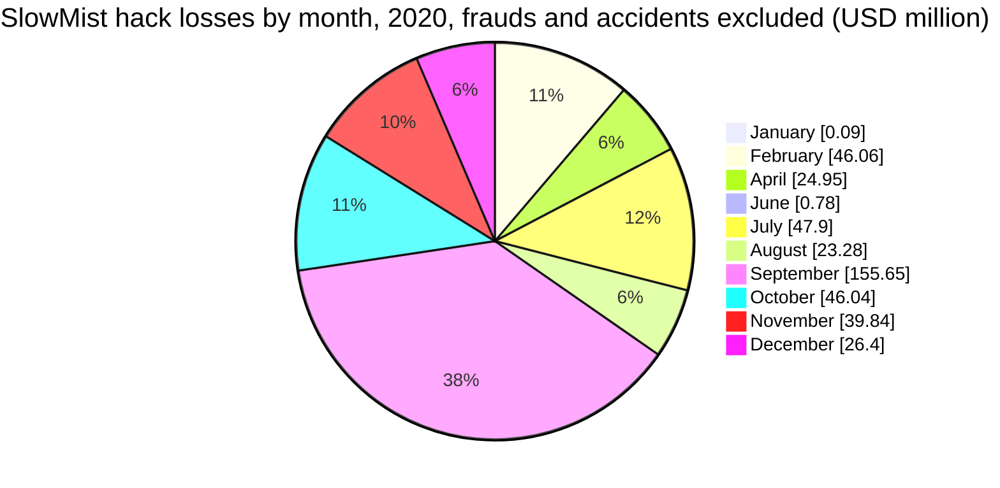
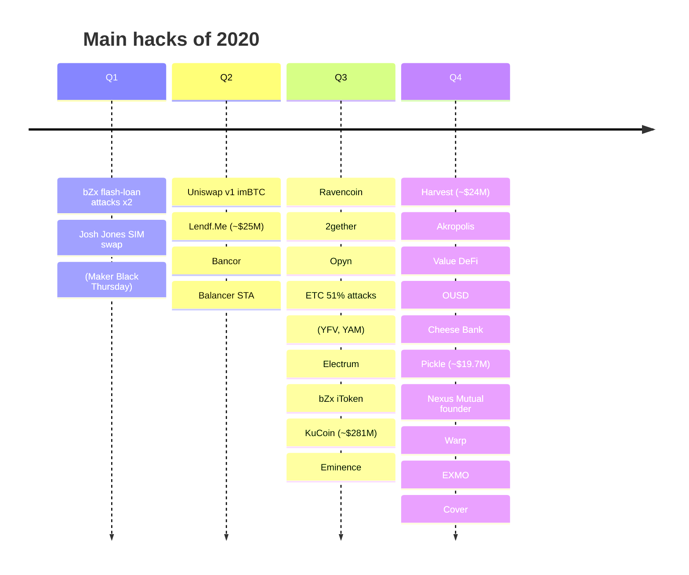
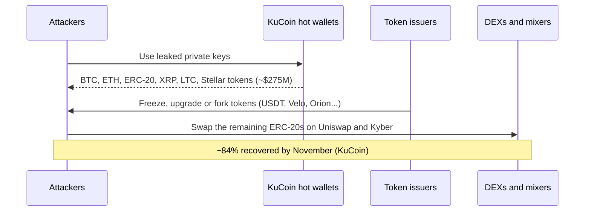
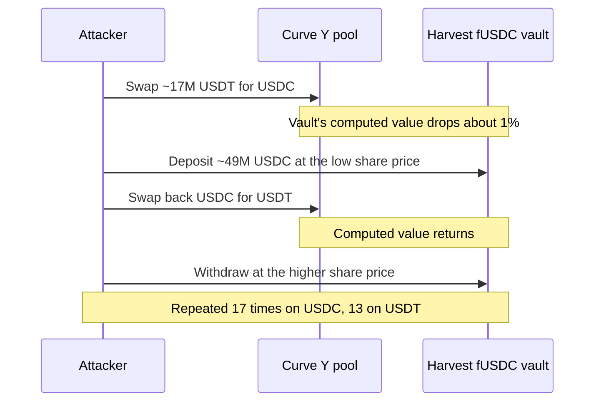

2020 is the last year before crypto theft reached the billions. Chainalysis counts about $520M stolen, and a single incident, the theft of about $275M from the KuCoin exchange in September, accounts for more than half of it. DeFi's share was still small, about 30% according to Chainalysis, but its attack techniques were invented that year: the first flash-loan attacks against bZx in February, ERC-777 reentrancy against Lendf.Me in April, vault share prices manipulated through Curve pools at Harvest in October, and a wave of exploits during the "DeFi summer" of yield farming that followed.

This article reviews the year with the method of the site's `crypto-hacks` series: statistics computed from the [SlowMist Hacked](https://hacked.slowmist.io/) database, the trackers' annual figures, [Rekt News](https://rekt.news/) (which started in September 2020), the analytics firms and official statements. Frauds such as BitClub and OneCoin, and accidents such as the funds locked at YFValue and Saffron Finance, are kept out of the hack totals and listed separately. A companion article, [The Technical Concepts Behind the 2020 Crypto Hacks]({{site.url_complet}}/2026/10/07/crypto-hacks-2020-technical-concepts/), explains the mechanisms for Solidity developers.

> This article has been made with the help of [Claude Code](https://claude.com/product/claude-code) and several custom skills

[TOC]

## Scope, sources and caveats

The article covers incidents from 1 January to 31 December 2020. No Telegram export of the CryptoAlertHack channel was available for that year. The figures need six caveats:

- **Frauds are not hacks.** SlowMist's 2020 list contains 19 frauds with about $3.62B of stated losses, including Wirecard (~$2.13B), a German payments company whose missing cash was not crypto at all. They are listed in [Frauds and scams](#frauds-and-scams) and not counted. Compounder.Finance, filed by SlowMist as "project owner internal operations", is a rug pull and is treated as a fraud.
- **Accidents are not hacks.** Several of SlowMist's largest 2020 entries are funds locked or put at risk by bugs, with no attacker taking them: YFValue (~$170M), Saffron Finance (~$50M), MakerDAO's Black Thursday (~$7.9M), YAM and Hegic. They are listed in [Accidents](#accidents) and not counted.
- **Ransomware against traditional companies is excluded.** CWT (~$4.5M), Foxconn, Banco Estado, Tower Semiconductor and Argentina's immigration service paid or were asked for bitcoin ransoms; these are not crypto-platform incidents.
- **LuBian is kept apart.** About 127,000 BTC (~$3.5B at the time) were taken from the LuBian mining pool on 28 December 2020, but the theft only became public in 2025, and whether it was a third-party hack is disputed. It is described in [its own section](#lubian-a-2020-theft-found-in-2025) and not counted.
- **Several SlowMist amounts are wrong as losses.** Beyond the accidents above, SlowMist values Ravencoin's inflation bug at ~$40M (other sources about $5.7M) and the 2gether theft at ~$7M (the company reported about €1.18M).
- **USD values are approximate**, valued at the time of each report. Atlas VPN's widely quoted "$3.78B stolen in 2020" values SlowMist's data at January 2021 prices and includes frauds.

## 2020 in numbers

### The annual figures

| Source | Stolen (approx. USD) | Incidents | Notable split |
|--------|--:|--:|---------------|
| Chainalysis (2021 Crypto Crime Report) | ~$520M | n/a | KuCoin (~$275M) is [over half of the year's thefts](https://www.chainalysis.com/blog/lazarus-group-kucoin-exchange-hack/); DeFi [about 30%](https://www.chainalysis.com/blog/2022-defi-hacks/) |
| [CipherTrace](https://decrypt.co/55787/defi-rug-pulls-were-cryptos-top-fraud-scheme-in-2020-ciphertrace) | $1.9B (incl. fraud) | n/a | Down from $4.5B in 2019; largest crime the WoToken fraud (~$1.1B); largest hack KuCoin (~$281M) |
| [SlowMist annual review](https://slowmist.medium.com/slowmist-2020-blockchain-security-and-privacy-events-f5d47d3e4042) | No dollar total | 122 | 54 smart contract and token incidents, 29 exchanges, 12 public chains, 12 wallets |
| [Atlas VPN on SlowMist data](https://decrypt.co/54128/hackers-stole-3-8-billion-in-cryptocurrency-hacks-in-2020) | $3.78B (incl. frauds, Jan 2021 prices) | 122 | Wallets $3.03B, Ethereum DApps $436M, exchanges $300M |
| [DeFiLlama](https://defillama.com/hacks) (computed) | $477M (without LuBian) | 45 | $3.98B with LuBian |

The spread comes from scope. CipherTrace and Atlas VPN include frauds; DeFiLlama now includes a theft that nobody knew about until 2025; Chainalysis counts only thefts. Immunefi, CertiK and PeckShield published no annual hack figure for 2020 that could be found.

North Korea's role was smaller than in later years. The [UN Panel of Experts](https://undocs.org/S/2021/211) reports a Member State's estimate of about $316M stolen by North Korea between 2019 and November 2020, and says a September 2020 exchange hack of about $281M, without naming KuCoin, "strongly suggests links" to it. Chainalysis attributes KuCoin to the Lazarus Group.

### Month by month

No monthly series from CertiK or PeckShield was found for 2020, so the table compares SlowMist, computed from the database without frauds, accidents and ransomware, with sums computed from the DeFiLlama hacks dataset (without LuBian).

| Month | SlowMist hacks | SlowMist loss | DeFiLlama loss | Largest hack |
|-------|--:|--:|--:|------|
| January | 2 | ~$0.1M | ~$0.1M | Bitcoin Gold 51% attack |
| February | 7 | ~$46.1M | ~$3.1M | Josh Jones SIM swap, bZx |
| March | 2 | none priced | ~$8.3M | (MakerDAO Black Thursday, an accident) |
| April | 5 | ~$25.0M | ~$25.5M | Lendf.Me |
| May | 6 | none priced | none | No priced incident |
| June | 7 | ~$0.8M | ~$1.0M | Balancer |
| July | 8 | ~$47.9M | ~$4.7M | Ravencoin, 2gether |
| August | 17 | ~$23.3M | ~$7.7M | Electrum phishing, ETC 51% attacks, Opyn |
| September | 10 | ~$155.7M | ~$302.2M | KuCoin, Eminence, bZx |
| October | 6 | ~$46.0M | ~$26.5M | Harvest Finance, Electrum phishing |
| November | 14 | ~$39.8M | ~$40.9M | Pickle Finance, Origin OUSD, Value DeFi |
| December | 9 | ~$26.4M | ~$57.4M | EXMO, Nexus Mutual founder, Warp, Cover |

The DeFi incidents cluster from August to December, after yield farming took off in June. No DeFi attacker kept much more than about $25M from a single protocol; exchange and individual thefts made up the largest losses.

### The largest incidents

| Rank | Date | Incident | Category | Reported loss (approx. USD) | Root cause (summary) |
|:---:|------|----------|----------|--:|----------------------|
| 1 | 25 Sep | KuCoin | CEX | $150M to $281M (~84% recovered) | Hot-wallet private keys leaked; Lazarus (Chainalysis) |
| 2 | 22 Feb | Josh Jones | Individual | $36.5M to $45M | SIM swap of an investor's phone number |
| 3 | 19 Apr | Lendf.Me (dForce) | DeFi lending | $25M (returned) | ERC-777 hook re-entered `withdraw` during a deposit |
| 4 | 26 Oct | Harvest Finance | DeFi yield | $24M profit, $33.8M value lost | Vault share price read from manipulated Curve reserves |
| 5 | Aug to Oct | Electrum phishing | Wallet users | $22M cumulative | Malicious servers pushing a fake wallet update |
| 6 | 21 Nov | Pickle Finance | DeFi yield | $19.7M | Fake jars and an arbitrary call through an approved converter |
| 7 | 28 Sep | Eminence | DeFi (unreleased) | $15M ($8M returned) | Bonding curve manipulated with a flash loan |
| 8 | 21 Dec | EXMO | CEX | $10.5M | Hot-wallet keys compromised |
| 9 | 28 Dec | Cover Protocol | DeFi insurance | $9.4M taken, $3.2M returned | Reward accounting bug in `deposit()`, infinite mint |
| 10 | 13 Sep | bZx | DeFi lending | ~$8M (recovered) | Self-transfer doubled iToken balances |
| 11 | 14 Dec | Nexus Mutual founder | Individual | ~$8M | Compromised PC and modified MetaMask |
| 12 | 17 Dec | Warp Finance | DeFi lending | $7.8M (~73% recovered) | LP token priced from manipulable reserves |
| 13 | 17 Nov | Origin OUSD | DeFi stablecoin | ~$7M | Fake token re-entered `mint` before a rebase |
| 14 | 14 Nov | Value DeFi | DeFi yield | $6M net, $7.4M gross | Vault value read from a manipulated Curve 3pool |
| 15 | 3 Jul | Ravencoin | L1 | ~$5.7M (SlowMist ~$40M) | Inflation bug minted ~315M extra RVN |

### Statistics from the SlowMist database

Computed from the 2020 entries of the SlowMist Hacked database, before recoveries, after removing 19 frauds, six accidents and five ransomware entries:

- **93 incidents**, of which only 38 have a stated loss, for **~$411M**. KuCoin alone is 36% of it.
- **Median loss: ~$2.3M.** Nine incidents of $10M or more make up 85% of the total.

| Size band | Incidents | Loss (approx. USD) | Share of loss |
|---|--:|--:|--:|
| ≥ $100M | 1 | $150.0M | 36.5% |
| $10M to $100M | 8 | $199.7M | 48.6% |
| $1M to $10M | 13 | $57.4M | 14.0% |
| $100k to $1M | 9 | $3.6M | 0.9% |
| < $100k | 7 | $0.3M | < 0.1% |
| Not stated | 55 | n/a | n/a |

| Category | Incidents | Loss (approx. USD) | Share of loss |
|---|--:|--:|--:|
| Key / infrastructure compromise | 11 | $175.5M | 42.7% |
| Other / unknown | 52 | $158.3M | 38.5% |
| Smart contract vulnerability | 17 | $76.1M | 18.5% |
| Oracle / price manipulation | 4 | $1.0M | 0.2% |
| Scam / phishing / account takeover | 9 | $0.1M | < 0.1% |

The category follows the database's attack method. "Other / unknown" holds the SIM swap (~$45M), Ravencoin (~$40M), the Electrum phishing campaign (~$38M over two entries), Pickle (filed as "fake currency for real currency") and the 51% attacks, along with DDoS attacks and data leaks without a stated amount. Smart contract bugs were the most numerous priced category after "other", but they cost less in total than KuCoin alone.

## KuCoin (~$150M to ~$281M, September): the year's largest hack

On 25 September 2020 (26 September in Singapore), large withdrawals left KuCoin's hot wallets. The exchange [traced them](https://www.kucoin.com/announcement/en-kucoin-ceo-livestream-recap-latest-updates-about-security-incident) to a leak of the hot wallets' private keys; cold wallets were unaffected. KuCoin first estimated about $150M. Chainalysis [later counted](https://www.chainalysis.com/blog/kucoin-hack-2020-defi-uniswap/) about $275M: 1,008 BTC, 11,543 ETH, 19.8M USDT, 18.5M XRP, about $147M of ERC-20 tokens and about $87M of Stellar tokens. CipherTrace and the UN give about $281M.

The theft is remembered for how much came back. Token issuers froze, upgraded or forked their contracts so that the stolen tokens became worthless, and law enforcement recovered part of the rest. According to [Rekt](https://rekt.news/epic-hack-homie), Tether froze about $22M of USDT, and Velo, Orion, KardiaChain, Ocean and Ampleforth acted on their own tokens. By November, KuCoin's CEO [said 84%](https://www.theblock.co/post/84248/kucoin-280m-stolen-recovered) had been recovered; KuCoin and its insurance fund covered the remainder. The attackers swapped what they could not sell through Uniswap and Kyber, an early large use of DEXs for laundering, and mixed bitcoin.

Chainalysis [attributes the theft](https://www.chainalysis.com/blog/lazarus-group-kucoin-exchange-hack/) to the Lazarus Group; the UN Panel of Experts describes a $281M exchange hack of September 2020 with links to North Korea, without naming the exchange. No government attribution has been made public.

## DeFi: the year flash loans and reentrancy arrived

### bZx: the first flash-loan attacks (February) and a balance bug (September)

On 15 February, an attacker borrowed 10,000 ETH from dYdX in a flash loan, used part of it to open a leveraged short on bZx that pushed WBTC's price up on Uniswap, and sold WBTC borrowed elsewhere at the inflated price, all in one transaction. The profit was about $356k.

[PeckShield's analysis](https://peckshield.medium.com/bzx-hack-full-disclosure-with-detailed-profit-analysis-e6b1fa9b18fc) shows the root cause was a skipped health check in bZx's margin trade, not the oracle itself. Three days later, a second attacker used a flash loan to pump sUSD on the exchange bZx used as its price source, and borrowed about 6,800 ETH against overpriced sUSD collateral. Together, the two attacks showed that anyone could command millions for one transaction.

In September, bZx lost about $8M to a different kind of bug: transferring iTokens to oneself doubled the sender's balance, because the function read both balances before writing either. The protocol [recovered](https://bzx.network/blog/incident) the funds and covered the debt from its insurance fund.

### Lendf.Me and Uniswap v1: ERC-777 reentrancy (April)

imBTC is an ERC-777 token, which calls a hook on the sender before each transfer. On 18 April, an attacker used the hook to re-enter Uniswap v1's imBTC pool in the middle of a sale, so that two sales were priced against the same reserves; the pool lost about 1,278 ETH. The next day, the same technique was used against dForce's Lendf.Me, a Compound v1 fork: the hook called `withdraw` in the middle of a deposit, and the deposit then wrote back the balance from before the withdrawal, so collateral was counted twice. The attacker borrowed about $25M from twelve markets ([Quantstamp](https://quantstamp.com/blog/how-the-dforce-hacker-used-reentrancy-to-steal-25-million)) and returned all of it within days.

### Harvest Finance (~$24M, October): a share price read from Curve

Harvest's stablecoin vaults valued their holdings through the Curve Y pool. The attacker took flash loans, swapped USDT for USDC in the pool to lower the value Harvest computed, deposited about 49M USDC at the lower share price, swapped back, and withdrew at the higher price, repeating the loop 17 times on the USDC vault and 13 times on the USDT vault ([post-mortem](https://medium.com/harvest-finance/harvest-flashloan-economic-attack-post-mortem-3cf900d65217)). Harvest had a check against price deviations, but its 3% threshold was larger than the ~1% move the attacker needed. The vaults lost about $33.8M of value, the attacker kept about $24M and returned about $2.5M.

The same pattern struck **Value DeFi** in November (about $6M net after the attacker returned 2M DAI): its MultiStables vault priced its Curve LP tokens from the 3pool's reserves, which the attacker unbalanced with an Aave flash loan ([post-mortem](https://valuedefi.medium.com/multistables-vault-exploit-post-mortem-d11b0635788f)).

### Pickle Finance (~$19.7M, November): an arbitrary call through a "jar swap"

Pickle's controller offered `swapExactJarForJar` to move funds between its vaults ("jars") through approved converter contracts. The function did not check that the jars passed in were real Pickle jars, and one approved converter let its caller choose the contract and function it called. The attacker passed fake jars and used the converter to make the controller call the DAI strategy's privileged functions; the strategy treated cDAI as stray "dust" it could send to the controller, and the fake jar then took it. No flash loan was needed. The analysis was published by a group of researchers as the ["Evil Jar" post-mortem](https://github.com/banteg/evil-jar/blob/master/readme.md).

### The November wave and the end of the year

- **Akropolis (~$2M, 12 November).** The deposit amount was computed from the pool's balance before and after the transfer; a fake token re-entered the deposit and the same DAI was counted twice ([Rekt](https://rekt.news/akropolis-rekt)).
- **Origin OUSD (~$7M, 17 November).** A gas-saving refactor of `mintMultiple` dropped the check on supported assets. A fake token re-entered `mint` and triggered a rebase before OUSD's supply was updated. Origin [compensated](https://blog.originprotocol.com/what-weve-changed-since-the-ousd-attack-5894f2bd77cf) users in full.
- **Cheese Bank (~$3.3M, 16 November).** Collateral was priced from a Uniswap pool that a flash loan inflated ([Cheese Bank on X](https://twitter.com/CheeseBank2020/status/1328343819201380353)).
- **Warp Finance (~$7.8M, 17 December).** Uniswap LP tokens used as collateral were priced from the pool's reserves, which flash loans moved; about 73% was [recovered](https://warpfinance.medium.com/warp-finance-exploit-summary-recovery-of-funds-5b8fe4a11898) by seizing the attacker's collateral.
- **Cover Protocol (~$9.4M taken, 28 December).** A bug in the reward contract's `deposit()`, amplified by a pool holding a single wei of LP tokens, let depositors mint an almost unlimited amount of COVER. One of the exploiters, Grap Finance, returned 4,350 ETH ([post-mortem](https://coverprotocol.medium.com/12-28-post-mortem-34c5f9f718d4)).
- **Eminence (~$15M, 28 September).** Andre Cronje's unreleased and unaudited contracts held user deposits; a flash loan manipulated their bonding curve, and the attacker returned about $8M ([Rekt](https://rekt.news/eminence-rekt-in-prod)).
- **Opyn (~$371k, 4 August).** Exercising ETH put options across several vaults in one call let the attacker pay the underlying once and collect collateral from every vault ([post-mortem](https://medium.com/opyn/opyn-eth-put-exploit-c5565c528ad2)).
- **Balancer (~$500k, 28 June).** STA, a token that burns 1% on every transfer, desynchronised a pool's recorded balance from its real one ([Balancer post-mortem](https://medium.com/balancer-protocol/incident-with-non-standard-erc20-deflationary-tokens-95a0f6d46dea)).

## Exchanges, users and chains

- **EXMO (~$10.5M, December).** Hot-wallet keys of the exchange were compromised; it lost about 6% of its assets ([CoinDesk](https://www.coindesk.com/markets/2020/12/22/exmo-exchange-now-says-it-lost-6-of-total-crypto-assets-in-mondays-hack/)).
- **Eterbase (~$5.4M, September).** Six hot wallets of the Slovak exchange were drained ([ZDNet](https://www.zdnet.com/article/slovak-cryptocurrency-exchange-eterbase-discloses-5-4-million-hack/)).
- **Livecoin (December).** The Russian exchange lost control of its servers, and the attackers altered prices before withdrawing ([ZDNet](https://www.zdnet.com/article/russian-crypto-exchange-livecoin-hacked-after-it-lost-control-of-its-servers/)).
- **Individuals.** A SIM swap in February cost the investor Josh Jones about $36.5M to $45M in bitcoin. In December, the founder of Nexus Mutual lost about $8M of NXM after malware on his computer modified MetaMask so that he signed the attacker's transaction.
- **Electrum phishing (~$22M cumulative).** Malicious Electrum servers told users to install a "required update" that was malware; one user lost 1,400 BTC (~$16M) in August ([ZDNet](https://www.zdnet.com/article/bitcoin-wallet-trick-has-netted-criminals-more-than-22-million/)).
- **51% attacks.** Ethereum Classic suffered three chain reorganisations in August, of 3,693, more than 4,000 and more than 7,000 blocks; exchanges that credited deposits too early lost the double-spent coins (OKEx about $5.6M). Aeternity and Bitcoin Gold were attacked the same way.
- **Ravencoin (July).** A bug in the asset-issuance code let an attacker mint about 315M RVN, about 1.5% of the supply.

## LuBian: a 2020 theft found in 2025

On 28 December 2020, about 127,000 BTC, worth about $3.5B at the time, left wallets of the LuBian mining pool. Nobody reported it until Arkham connected the transactions in 2025: the pool's private keys had been generated with weak randomness and could be brute-forced ([Rekt](https://rekt.news/the-one-that-got-away)). In October 2025 the US Department of Justice sought forfeiture of about 127,271 BTC that it links to Chen Zhi and the Prince Group, which it alleges controlled LuBian ([Elliptic](https://www.elliptic.co/blog/15-billion-us-seizure-reveals-prince-groups-connection-to-iran-china-bitcoin-mining-theft)). Whether this was a theft by an outsider or a movement of funds by their owners is unresolved. DeFiLlama counts it as a 2020 hack, which multiplies its 2020 total eightfold; this article does not.

## Frauds and scams

Frauds are not hacks: no system was broken into. They are listed here and **not counted in this article's hack totals**.

SlowMist lists 19 frauds for 2020, about $3.62B in total, most of it Wirecard. CipherTrace's largest fraud of the year, WoToken (~$1.1B), is not in SlowMist's list.

| Date | Scheme | Loss (approx. USD) | What happened |
|------|--------|--:|---------------|
| Jun | Wirecard | $2.13B | Cash missing from a German payments company that issued crypto debit cards; not a crypto loss |
| Jul | BitClub Network | $722M | Mining Ponzi scheme; a guilty plea in the United States in 2020 |
| Dec | OneCoin | $440M (SlowMist) | Ponzi scheme of 2014 to 2018, listed for a prosecution in 2020 |
| Sep | Arbistar | $120M | Spanish investment scheme |
| Aug | Coinbit | $85M | Korean exchange investigated for fraud |
| Dec | Compounder.Finance | $12.5M (SlowMist $80M) | Malicious strategies added after the audit, then drained by the developers ([Rekt](https://rekt.news/deathbed-confessions-c3pr)) |
| Aug | Empire Market | $30M | Darknet market exit scam |
| Nov | SharkTron | $10M | Rug pull on Tron |
| Sep | LV Finance, EMD | $4M, $2.5M | Rug pulls |

## Accidents

Accidents are losses with no attacker: funds made inaccessible by an operational error, a lost key or a bug that nobody exploited for profit. They are listed here and **not counted in this article's hack totals**.

| Date | Incident | SlowMist amount | What happened |
|------|----------|--:|---------------|
| Mar | MakerDAO "Black Thursday" | $7.9M | During the March crash, network congestion stopped most liquidation keepers, and auctions of 4,447 vaults were won with bids of zero DAI. Maker found "insufficient evidence" of an attack and covered the ~5.4M DAI shortfall with a debt auction ([MakerDAO](https://blog.makerdao.com/the-market-collapse-of-march-12-2020-how-it-impacted-makerdao/)). |
| Apr | Hegic | $28.5k | A typo in `unlockAll` permanently locked 152.2 ETH; the team reimbursed users. |
| Aug | YAM | $0.75M | A rebasing bug minted far too many YAM into the reserve, making governance quorum impossible and locking the treasury ([YAM](https://medium.com/yam-finance/yam-post-rescue-attempt-update-c9c90c05953f)). |
| Aug | YFValue (YFV) | $170M | Anyone could stake a dust amount on behalf of another user and reset their withdrawal timer. SlowMist's own [analysis](https://slowmist.medium.com/slowmist-analysis-of-yfvalue-attack-2b60344732d3) says it "will not lead to loss of funds"; the $170M is the value at risk of being locked ([YFV](https://valuedefi.medium.com/yfv-update-staking-pool-exploit-713cb353ff7d)). |
| Nov | Saffron Finance | $50M | A bug prevented redemptions from the first epoch; funds were stuck, not stolen ([Saffron on X](https://twitter.com/saffronfinance_/status/1333086689913425922)). |
| Nov | Rari Capital | not stated | A contract bug, resolved without a reported loss. |

MakerDAO is the borderline case: the keepers that bid zero did take collateral, but they took it in auctions the protocol ran as designed during a congestion nobody caused. Compound's liquidations of about $89M on 26 November, triggered by a brief DAI price spike on Coinbase Pro that its oracle reported, are a similar market and oracle event and are not counted either.

## Official post-mortems and statements

| Incident | Source | What it says |
|----------|--------|--------------|
| KuCoin | [CEO livestream recap](https://www.kucoin.com/announcement/en-kucoin-ceo-livestream-recap-latest-updates-about-security-incident) | Hot-wallet private keys leaked; cold wallets safe; users covered |
| Harvest Finance | [Post-mortem](https://medium.com/harvest-finance/harvest-flashloan-economic-attack-post-mortem-3cf900d65217) | Curve Y pool manipulation; 3% check not triggered |
| Pickle Finance | ["Evil Jar" analysis](https://github.com/banteg/evil-jar/blob/master/readme.md) | Fake jars and arbitrary call through an approved converter |
| bZx (September) | [Incident report](https://bzx.network/blog/incident) | Self-transfer balance duplication; funds recovered |
| Value DeFi | [Post-mortem](https://valuedefi.medium.com/multistables-vault-exploit-post-mortem-d11b0635788f) | 3pool manipulation; 2M DAI returned |
| Origin OUSD | [What we've changed](https://blog.originprotocol.com/what-weve-changed-since-the-ousd-attack-5894f2bd77cf) | Missing asset check, reentrancy into `mint`, full compensation |
| Warp Finance | [Exploit summary](https://warpfinance.medium.com/warp-finance-exploit-summary-recovery-of-funds-5b8fe4a11898) | LP price manipulation; ~73% recovered |
| Cover Protocol | [Post-mortem](https://coverprotocol.medium.com/12-28-post-mortem-34c5f9f718d4) | `deposit()` reward bug; Grap Finance returned ETH |
| Balancer | [Incident report](https://medium.com/balancer-protocol/incident-with-non-standard-erc20-deflationary-tokens-95a0f6d46dea) | Deflationary token and `gulp()` |
| Opyn | [Post-mortem](https://medium.com/opyn/opyn-eth-put-exploit-c5565c528ad2) | Double exercise; sellers reimbursed |
| Cheese Bank | [Statement on X](https://twitter.com/CheeseBank2020/status/1328343819201380353) | Exploit confirmed |
| MakerDAO | [Market collapse of 12 March](https://blog.makerdao.com/the-market-collapse-of-march-12-2020-how-it-impacted-makerdao/) | Zero-bid auctions; no evidence of an attack |
| YFValue | [Update](https://valuedefi.medium.com/yfv-update-staking-pool-exploit-713cb353ff7d) | Staking timers reset by others; "funds are safu" |
| Lendf.Me | None reached | Quantstamp's analysis used instead |
| Akropolis | Notion update, not readable | Rekt used instead |

## Observations

- **One exchange hack was half the year.** KuCoin alone is about half of Chainalysis' total and 36% of SlowMist's.
- **Flash loans were born as an attack tool.** bZx in February was the first; by the end of the year, Harvest, Value DeFi, Cheese Bank, Warp, Akropolis and OUSD had all been attacked with borrowed capital.
- **Token behaviour was assumed, not checked.** ERC-777 hooks (Lendf.Me, Uniswap v1), fee-on-transfer tokens (Balancer) and fake tokens (Akropolis, OUSD) broke contracts written for plain ERC-20s.
- **Prices came from pools.** Harvest, Value DeFi, Cheese Bank and Warp all valued assets from reserves that a single transaction could move.
- **Issuers and exchanges recovered most of the largest theft.** KuCoin's 84% recovery relied on token issuers freezing or upgrading their contracts, an option that does not exist for ETH or BTC.
- **Unaudited and freshly changed code was hit most.** Eminence was unreleased, Pickle's controller had been added after its audits, Value DeFi's vault v2 was unaudited and OUSD's bug came from a refactor.

## Data gaps

This section lists what could not be found or verified while writing this article, so that it can be completed later. Each row says what is missing and where to look first.

| Gap | What is missing or unverified | Where to search |
|-----|-------------------------------|-----------------|
| Telegram export | No CryptoAlertHack export was available for 2020. | A Telegram export for 2020 |
| Chainalysis total | The ~$520M figure and the 30% DeFi share were not read on a Chainalysis page covering 2020 as a whole; KuCoin's "over half" was. | Chainalysis 2021 Crypto Crime Report PDF |
| CertiK, PeckShield, Immunefi | No 2020 annual or monthly figures found; a CertiK "~$500M DeFi losses" figure was seen only in search results. | CertiK and PeckShield posts of January 2021 |
| CipherTrace | Figures come from press coverage; the report PDF was not found. | CipherTrace Cryptocurrency Crime and AML Report, January 2021 |
| Elliptic, TRM Labs, Protos | No Elliptic page on KuCoin (only press quoting it), no TRM page for 2020; Protos not searched. | Google: "elliptic kucoin hack", trmlabs.com, protos.com |
| SlowMist amounts | Ravencoin (~$40M vs ~$5.7M), 2gether ($7M vs €1.18M), Compounder ($80M vs $12.5M) and Cover ($3M vs $9.4M) conflict; bZx September and Eminence have no SlowMist amount. | SlowMist entries, project statements |
| KuCoin recovery split | The split between projects, law enforcement and insurance was seen only in search results. | KuCoin announcements of November 2020 |
| Lendf.Me | No dForce post-mortem reached; the return of funds and the reason for it come from press and search results. | dForce Medium, Wayback Machine |
| Akropolis, Origin | Akropolis' Notion update is JavaScript-only; Origin's first post was unreadable in the archive. | Wayback Machine, project GitHub |
| Individuals | Josh Jones' loss (police figure vs SlowMist), the Nexus Mutual founder theft and the Twitter hack (~$120k scam) were seen only in search results. | Hamilton police release, Nexus Mutual statements, US DOJ |
| Axion, Rari Capital | Axion's ~80B AXN mint (suspected code added after the audit) and Rari's November bug were not verified. | Axion and Rari statements, CertiK |
| LuBian | Whether the 2020 movement was a theft by outsiders is unresolved; the DOJ complaint was read only through Elliptic. | DOJ forfeiture complaint of October 2025, Arkham |
| Attribution | The only official attribution is the UN Panel's unnamed exchange; the second North Korea-linked hack of October 2020 (~$23M) in the UN report is unidentified. | UN S/2021/211 annexes, Chainalysis |

## Conclusion

2020 was the last small year for crypto hacks: about $520M stolen according to Chainalysis, about $411M in the SlowMist database once frauds and accidents are removed.

- **KuCoin** (~$150M to ~$281M) was the largest theft, and about 84% of it was recovered through token freezes and law enforcement.
- **DeFi** invented its attack playbook: flash loans (bZx), ERC-777 reentrancy (Lendf.Me), share prices read from Curve (Harvest, Value DeFi), arbitrary calls (Pickle) and reward bugs (Cover).
- **Users and chains** lost money to SIM swaps, wallet phishing and 51% attacks.
- **Frauds** (Wirecard, BitClub, OneCoin, Compounder) are kept apart from the hack totals.
- **Accidents** (YFValue, Saffron, MakerDAO's Black Thursday, YAM, Hegic) involved no attacker and are not counted either, nor is LuBian, a 2020 theft discovered in 2025.

## Annex

### Key Terms

| Term | Definition |
|------|------------|
| **Flash loan** | An uncollateralised loan repaid within one transaction, first used in an attack against bZx in February 2020. |
| **Hot wallet** | An exchange wallet whose keys are online, as at KuCoin, EXMO and Eterbase. |
| **Token freeze** | An issuer blocking or invalidating stolen tokens, as Tether and others did after KuCoin. |
| **ERC-777** | A token standard that calls hooks on the sender and recipient during transfers, used for reentrancy at Lendf.Me. |
| **Reentrancy** | Calling back into a contract before it has finished updating its state. |
| **Fee-on-transfer token** | A token that burns or redirects part of every transfer, so the recipient gets less than the amount sent. |
| **Share price** | The value of one vault share; Harvest computed it from Curve reserves. |
| **Yield farming** | Depositing tokens in protocols to earn reward tokens, the driver of 2020's "DeFi summer". |
| **Rebase** | An automatic change of every holder's balance to track a target, used by OUSD and YAM. |
| **Bonding curve** | A formula setting a token's price from its supply, manipulated at Eminence. |
| **51% attack** | Mining a longer private chain to reverse transactions, as on Ethereum Classic. |
| **SIM swap** | Moving a victim's phone number to an attacker's SIM to intercept codes. |
| **Rug pull** | Developers taking their users' funds; a fraud, not a hack. |
| **Accident** | A loss or lock with no attacker, such as funds stuck by a bug; not counted as a hack. |
| **Keeper** | A bot that bids in liquidation auctions; most stopped working on Black Thursday. |

## Frequently Asked Questions

**Q: How much was stolen in crypto hacks in 2020?**

About $520M according to Chainalysis, of which KuCoin was more than half. SlowMist's database gives about $411M once frauds, accidents and ransomware are removed. Figures near $2B to $4B include frauds (CipherTrace, Atlas VPN), and DeFiLlama's ~$4B includes LuBian, a theft discovered in 2025.

**Q: Why was so much of KuCoin's loss recovered?**

Most of the stolen value was in tokens whose issuers could act: Tether froze USDT, and several projects froze, upgraded or forked their tokens so that the attacker's balances became worthless. Exchanges blocked the addresses, and law enforcement recovered part of the rest. Bitcoin and ether cannot be frozen this way, which is why the attackers laundered them through DEXs and mixers.

**Q: What made the bZx attacks of February 2020 new?**

They were the first attacks funded with flash loans. The attacker had no capital at risk: they borrowed thousands of ETH, used them to move a price that bZx relied on, profited, and repaid the loan in the same transaction. From then on, any price or balance a protocol read on-chain had to be safe against an attacker with unlimited capital for one block.

**Q: Why are YFValue and Saffron Finance not counted when SlowMist lists them at $170M and $50M?**

Nobody stole their funds. YFValue had a flaw that let anyone reset other users' staking timers, which could lock funds but not take them, and SlowMist's own analysis says so. Saffron's funds were stuck in a contract by a bug and later recoverable through an emergency withdrawal. Counting them would put about $220M of non-thefts into a year whose real thefts were about $400M.

**Q: Was MakerDAO's Black Thursday a hack?**

Not according to MakerDAO, which found insufficient evidence of an attack. Network congestion stopped most liquidation bots, and the few that kept working won auctions with zero bids, taking collateral for free. The protocol ran as designed in conditions its design had not anticipated, which this article classes as an accident.

**Q: What is LuBian, and why is it not in the 2020 total?**

LuBian was a Chinese bitcoin mining pool whose wallets lost about 127,000 BTC on 28 December 2020. The movement was only identified as a theft in 2025, its keys were apparently weak enough to brute-force, and the US government alleges that the funds belonged to the Prince Group. Since it is unclear whether an outsider took the bitcoin, and nobody tracked it at the time, it is reported separately.

## References

### Annual reports and figures

- [Chainalysis: Lazarus Group pulled off 2020's biggest exchange hack](https://www.chainalysis.com/blog/lazarus-group-kucoin-exchange-hack/)
- [Chainalysis: DeFi hacks (DeFi share by year)](https://www.chainalysis.com/blog/2022-defi-hacks/)
- [Decrypt: DeFi rug pulls were crypto's top fraud scheme in 2020 (CipherTrace)](https://decrypt.co/55787/defi-rug-pulls-were-cryptos-top-fraud-scheme-in-2020-ciphertrace)
- [ForkLog: CipherTrace puts 2020 losses at $1.9 billion](https://forklog.com/en/ciphertrace-puts-2020-losses-from-crypto-scams-and-hacks-at-1-9-billion/)
- [SlowMist: 2020 blockchain security and privacy events](https://slowmist.medium.com/slowmist-2020-blockchain-security-and-privacy-events-f5d47d3e4042)
- [Decrypt: hackers stole $3.8 billion in 2020 (Atlas VPN)](https://decrypt.co/54128/hackers-stole-3-8-billion-in-cryptocurrency-hacks-in-2020)
- [UN Panel of Experts report S/2021/211](https://undocs.org/S/2021/211)
- [DeFiLlama hacks](https://defillama.com/hacks)

### Official statements and post-mortems

- [KuCoin: CEO livestream recap](https://www.kucoin.com/announcement/en-kucoin-ceo-livestream-recap-latest-updates-about-security-incident)
- [Harvest Finance: flash-loan economic attack post-mortem](https://medium.com/harvest-finance/harvest-flashloan-economic-attack-post-mortem-3cf900d65217)
- [Pickle Finance: Evil Jar analysis](https://github.com/banteg/evil-jar/blob/master/readme.md)
- [bZx: incident report](https://bzx.network/blog/incident)
- [Value DeFi: MultiStables vault exploit post-mortem](https://valuedefi.medium.com/multistables-vault-exploit-post-mortem-d11b0635788f), [YFV staking pool update](https://valuedefi.medium.com/yfv-update-staking-pool-exploit-713cb353ff7d)
- [Origin Protocol: what we've changed since the OUSD attack](https://blog.originprotocol.com/what-weve-changed-since-the-ousd-attack-5894f2bd77cf)
- [Warp Finance: exploit summary and recovery of funds](https://warpfinance.medium.com/warp-finance-exploit-summary-recovery-of-funds-5b8fe4a11898)
- [Cover Protocol: 12/28 post-mortem](https://coverprotocol.medium.com/12-28-post-mortem-34c5f9f718d4)
- [Balancer: incident with non-standard ERC20 deflationary tokens](https://medium.com/balancer-protocol/incident-with-non-standard-erc20-deflationary-tokens-95a0f6d46dea)
- [Opyn: ETH put exploit](https://medium.com/opyn/opyn-eth-put-exploit-c5565c528ad2)
- [MakerDAO: the market collapse of 12 March 2020](https://blog.makerdao.com/the-market-collapse-of-march-12-2020-how-it-impacted-makerdao/)
- [YAM: post-rescue attempt update](https://medium.com/yam-finance/yam-post-rescue-attempt-update-c9c90c05953f)
- [Cheese Bank (on X)](https://twitter.com/CheeseBank2020/status/1328343819201380353), [Saffron Finance (on X)](https://twitter.com/saffronfinance_/status/1333086689913425922)

### Analytics firms and technical analyses

- [Chainalysis: KuCoin hack, DeFi and Uniswap](https://www.chainalysis.com/blog/kucoin-hack-2020-defi-uniswap/)
- [Elliptic: $15 billion US seizure and the LuBian theft](https://www.elliptic.co/blog/15-billion-us-seizure-reveals-prince-groups-connection-to-iran-china-bitcoin-mining-theft)
- [PeckShield: bZx hack full disclosure](https://peckshield.medium.com/bzx-hack-full-disclosure-with-detailed-profit-analysis-e6b1fa9b18fc)
- [Quantstamp: how the dForce hacker used reentrancy](https://quantstamp.com/blog/how-the-dforce-hacker-used-reentrancy-to-steal-25-million)
- [SlowMist: analysis of the YFValue attack](https://slowmist.medium.com/slowmist-analysis-of-yfvalue-attack-2b60344732d3)
- [The Block: KuCoin says 84% recovered](https://www.theblock.co/post/84248/kucoin-280m-stolen-recovered)
- [CoinDesk: EXMO lost 6% of assets](https://www.coindesk.com/markets/2020/12/22/exmo-exchange-now-says-it-lost-6-of-total-crypto-assets-in-mondays-hack/), [ZDNet: Eterbase](https://www.zdnet.com/article/slovak-cryptocurrency-exchange-eterbase-discloses-5-4-million-hack/), [ZDNet: Livecoin](https://www.zdnet.com/article/russian-crypto-exchange-livecoin-hacked-after-it-lost-control-of-its-servers/), [ZDNet: Electrum phishing](https://www.zdnet.com/article/bitcoin-wallet-trick-has-netted-criminals-more-than-22-million/)

### Databases and Rekt News post-mortems

- [SlowMist Hacked database](https://hacked.slowmist.io/), 2020 entries
- [KuCoin (Epic Hack Homie) - Rekt](https://rekt.news/epic-hack-homie), [Harvest Finance - Rekt](https://rekt.news/harvest-finance-rekt), [Pickle Finance - Rekt](https://rekt.news/pickle-finance-rekt), [Eminence - Rekt](https://rekt.news/eminence-rekt-in-prod), [Cover - Rekt](https://rekt.news/cover-rekt)
- [Warp Finance - Rekt](https://rekt.news/warp-finance-rekt), [Value DeFi - Rekt](https://rekt.news/value-defi-rekt), [Akropolis - Rekt](https://rekt.news/akropolis-rekt), [Hack epidemic (OUSD, Cheese Bank) - Rekt](https://rekt.news/hack-epidemic), [Compounder - Rekt](https://rekt.news/deathbed-confessions-c3pr), [LuBian - Rekt](https://rekt.news/the-one-that-got-away)

### Related articles

- [Crypto Hacks of 2019 - Binance, Upbit, CoinBene and the EOS Casino Attacks]({{site.url_complet}}/2026/10/07/crypto-hacks-2019/)
- [The Technical Concepts Behind the 2020 Crypto Hacks]({{site.url_complet}}/2026/10/07/crypto-hacks-2020-technical-concepts/)
- [Crypto Hacks of 2021 - Poly Network, BitMart, Cream and the DeFi Boom]({{site.url_complet}}/2026/10/07/crypto-hacks-2021/)
- [Compound V2 Overview]({{site.url_complet}}/2024/08/27/compound-protocol-v2/)
- [Security of Cryptocurrency Exchanges - Overview]({{site.url_complet}}/2025/11/06/crypto-exchange-security-overview/)
