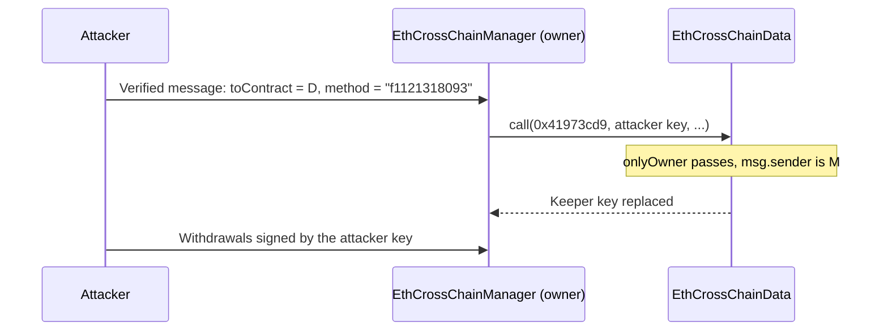

The [recap of the 2021 crypto hacks]({{site.url_complet}}/2026/10/07/crypto-hacks-2021/) summarises each incident in one line: "the keeper key was replaced through a cross-chain call", "the share price was doubled by a donation", "the invariant check used the wrong constant". This companion article explains those mechanisms for a developer who writes Solidity, knows how AMMs, lending markets, vaults and proxies work, and wants to see what exactly broke.

2021 was the year DeFi was copied, forked and composed at speed, and most of its bugs come from that. Prices were read from state that a flash loan could move, accounting assumed tokens would behave, forks changed one constant and not the other, and contracts with privileges executed calls chosen by someone else. The technical articles on [2022]({{site.url_complet}}/2026/10/07/crypto-hacks-2022-technical-concepts/), [2023]({{site.url_complet}}/2026/10/07/crypto-hacks-2023-technical-concepts/) and [2024]({{site.url_complet}}/2026/10/07/crypto-hacks-2024-technical-concepts/) show how several of these patterns returned in later years.

> This article has been made with the help of [Claude Code](https://claude.com/product/claude-code) and several custom skills

> **About the code.** The Solidity snippets are simplified to show the mechanism. They are not the deployed code of the protocols named; read the linked post-mortems for the exact contracts.

[TOC]

## Privileged contracts executing chosen calls

### A selector collision and a confused deputy (Poly Network, ~$611M)

Poly Network's `EthCrossChainManager` executed the payload of a verified cross-chain message by calling a target contract and method named in that message. It built the call like this:

```solidity
// Simplified from EthCrossChainManager._executeCrossChainTx
function _executeCrossChainTx(
    address toContract, bytes memory method, bytes memory args,
    bytes memory fromContract, uint64 fromChainId
) internal returns (bool) {
    (bool ok, bytes memory ret) = toContract.call(
        abi.encodePacked(
            bytes4(keccak256(abi.encodePacked(method, "(bytes,bytes,uint64)"))),
            abi.encode(args, fromContract, fromChainId)
        )
    );
    require(ok, "call failed");
    return abi.decode(ret, (bool));
}
```

Two facts made this fatal. First, nothing restricted `toContract`: it could be any address, including the contracts of Poly Network itself. Second, the manager was the owner of `EthCrossChainData`, the contract storing the keepers' public keys, whose setter was `putCurEpochConPubKeyBytes(bytes)` with selector `0x41973cd9`.

A selector is only four bytes, so 2^32 candidate names are enough to find a collision on average. The attacker searched for a method name such that `bytes4(keccak256("<name>(bytes,bytes,uint64)"))` equals `0x41973cd9`, and found `f1121318093`. The manager then called `EthCrossChainData` with that selector; the function ignored the extra arguments' types and decoded the first `bytes` as the new keeper key; and the `onlyOwner` check passed because the caller was the manager.



This is a **confused deputy**: a contract holding privileges acts on behalf of an untrusted caller. The function selector trick is the reason the method name looked harmless, but the bug was the open `toContract`. Defences:

- A contract that executes arbitrary calls must never own anything; split the executor from privileged roles.
- Restrict call targets to an allowlist, and never allow the protocol's own contracts as targets.
- Do not build selectors from user-supplied strings.

### Delegatecall into an allowlisted proxy (Furucombo, ~$14M)

Furucombo's proxy executed user-chosen "cubes" by `delegatecall` to handlers on an allowlist. The Aave v2 lending pool proxy was on that allowlist. A `delegatecall` runs the target's code with the caller's storage, so calling the Aave proxy's `initialize(implementation, data)` through Furucombo ran it against Furucombo's own storage, where Aave's implementation slot was empty. The attacker set it to their own contract.

After that, every delegatecall from Furucombo to the "Aave handler" went through the Aave proxy code, read the implementation from Furucombo's storage, and delegatecalled the attacker's contract, still in Furucombo's context. That code called `transferFrom` on every token users had approved to Furucombo.

The lesson is that allowlisting an address does not allowlist behaviour. A proxy is a different contract depending on whose storage it runs in. Never delegatecall into contracts you do not control, and treat any contract holding user approvals as a high-value target.

### Initialisers left callable (Punk Protocol, DAO Maker, DODO)

Proxies and clones cannot use constructors, so they use an `initialize` function. If it can be called more than once, or by anyone before the deployer, the caller takes control:

```solidity
// Vulnerable: no guard, so anyone can re-initialise
function initialize(address forge_, address token_) public {
    _forge = forge_;          // attacker sets their own address
    _token = token_;
}

// Fixed (OpenZeppelin Initializable)
function initialize(address forge_, address token_) public initializer {
    _forge = forge_;
    _token = token_;
}
```

Punk Protocol (~$9M, August) forgot the modifier on one model contract, so the attacker made themselves the "forge" allowed to withdraw. DAO Maker's (~$4M, September) vesting clones exposed an `init` that reset the owner. DODO's (~$2M, March) pools allowed `init()` to be called again, swapping the base and quote tokens so that a flash loan appeared repaid. Two related rules:

- Use `initializer` on every initialiser and call `_disableInitializers()` in the implementation's constructor.
- Deploy and initialise in the same transaction, through a factory, so nobody can front-run the call.

## Prices taken from state an attacker controls

### A share price inflated by a donation (Cream Finance, ~$130M)

Cream's oracle valued crYUSD collateral through the yUSD vault's share price:

```solidity
// Yearn-style vault, simplified
function pricePerShare() public view returns (uint256) {
    return totalAssets() * 1e18 / totalSupply();   // totalAssets = token.balanceOf(this) + strategies
}
```

`totalAssets()` includes the vault's raw token balance, so sending tokens directly to the vault (a **donation**) raises the price without minting shares. The attacker first redeemed most of the vault's supply so that a donation of a given size would move the price more, then transferred about $8M of yCrv to the vault. `pricePerShare()` doubled, the value Cream assigned to the attacker's crYUSD collateral doubled, and they borrowed everything in Cream's v1 markets.

The same pattern is the root of the ERC-4626 **inflation attack**, covered in the [2024 technical article]({{site.url_complet}}/2026/10/07/crypto-hacks-2024-technical-concepts/): a share price computed from a balance anyone can increase is a price anyone can set. Defences:

- Never use a vault's share price as an oracle for lending unless the vault tracks deposits internally instead of reading `balanceOf`.
- Cap the collateral factor and the supply of share tokens accepted as collateral.

### Spot reserves used to price minted rewards (PancakeBunny, ~$45M)

PancakeBunny minted BUNNY rewards proportional to the profit of a vault, valued in BNB through PancakeSwap pool reserves read at the moment of the call:

```solidity
// Simplified
function valueOfAsset(address lp, uint amount) public view returns (uint valueInBNB) {
    (uint112 r0, uint112 r1, ) = IPancakePair(lp).getReserves();   // spot reserves
    uint totalSupply = IPancakePair(lp).totalSupply();
    // value of `amount` LP tokens, priced from the current reserves
    ...
}
```

The attacker took flash loans, swapped a large amount through the WBNB/USDT pool to distort its reserves, and called the vault's `getReward()`. The minter valued the "profit" at a hugely inflated price and minted about 6.95M BUNNY, which the attacker sold before repaying the loans.

Spot reserves give the price after the attacker's last trade, not a market price. Use a time-weighted average (Uniswap v2 cumulative prices, v3 `observe`) or an external feed, and never let a pricing function used for minting be callable in the same transaction as a large swap.

### Live balances in share calculations (Spartan, Indexed)

Spartan Protocol's (~$30M, May) AMM tracked its reserves in storage but computed the liquidity share in `removeLiquidity` from the live balance:

```solidity
// Simplified
function calcLiquidityShare(uint units, address token, address pool) public view returns (uint) {
    uint amount = IERC20(token).balanceOf(pool);   // live balance, includes donations
    uint totalSupply = IERC20(pool).totalSupply();
    return amount * units / totalSupply;
}
```

Donating tokens to the pool raised `amount` without updating the stored reserves, so removing liquidity returned the donation plus a share of the other providers' tokens. The attacker repeated the donation and removal in a loop.

Indexed Finance (~$16M, October) had the same weakness at a larger scale. Its pool reweighting was permissionless and valued the pool from live balances; after thinning one token's balance with flash loans, the attacker triggered a reweighting that set a low minimum balance for a newly added token, then minted index tokens cheaply.

Uniswap v2 avoids this by keeping `reserve0` and `reserve1` in storage and calling `sync()` explicitly. A protocol should compute shares from its own accounting, and treat any difference between accounting and balance as a donation to be skimmed or ignored.

### Single-pool prices in leverage and minting (Vee Finance, xToken)

Vee Finance (~$34M, September) used one Pangolin pool price for its leverage trades and did not normalise token decimals in its slippage check, so pools the attacker created themselves passed it. xToken (~$24M, May) minted xSNXa at a price routed through a Uniswap v2 pool that a 61.8k ETH flash loan had just dumped. Both are the PancakeBunny bug with different plumbing.

## Arithmetic and accounting

### A constant changed in one place but not the other (Uranium Finance, ~$50M)

Uranium forked Uniswap v2 and changed the fee from 0.3% to 0.16%, scaling balances by 10,000 instead of 1,000. The invariant check after a swap was left with the old constant:

```solidity
// UraniumPair.swap, simplified
uint balance0Adjusted = balance0.mul(10000).sub(amount0In.mul(16));
uint balance1Adjusted = balance1.mul(10000).sub(amount1In.mul(16));
require(
    balance0Adjusted.mul(balance1Adjusted) >= uint(_reserve0).mul(_reserve1).mul(1000**2),  // should be 10000**2
    "UraniumSwap: K"
);
```

The left side is scaled by 10,000 squared, the right side by 1,000 squared, so the check passes as long as the new product is 1% of the old one. Sending one wei in and taking about 98% of each reserve out satisfied it. Every pool was drained in a few transactions.

Invariant checks should be tested against the property they protect, not only against happy paths. A fuzz or invariant test that asserts `reserve0 * reserve1` never decreases after a swap would have failed immediately.

### An index that started at zero (Compound Proposal 062, ~$80M to ~$147M)

Compound distributes COMP through two indices per market: a global `supplyIndex` that grows with time, and a per-user `supplierIndex` recording where the user last claimed. The reward is `balance × (supplyIndex − supplierIndex)`. Proposal 062 initialised the global index to `compInitialIndex` (1e36) for markets that had no COMP state, and changed how a user's zero index was initialised:

```solidity
// Comptroller.distributeSupplierComp, simplified
uint supplyIndex = compSupplyState[cToken].index;
uint supplierIndex = compSupplierIndex[cToken][supplier];
compSupplierIndex[cToken][supplier] = supplyIndex;

if (supplierIndex == 0 && supplyIndex > compInitialIndex) {   // Proposal 064 changed > to >=
    supplierIndex = compInitialIndex;
}

uint deltaIndex = supplyIndex - supplierIndex;           // 1e36 - 0 when supplyIndex == 1e36
uint supplierDelta = cTokenBalance * deltaIndex / 1e36;   // = the user's whole cToken balance in COMP
```

In six markets the global index was exactly `compInitialIndex`, so the condition was false, the user's index stayed at zero and the delta was 1e36. Each supplier was owed COMP equal to their cToken balance. The fix was a one-character change, but it needed a governance vote and a timelock, and the reserve kept refilling the Comptroller for about a week ([BlockSec](https://blocksec.com/blog/the-butterfly-effect-the-compound-security-incident-caused-by-a-bugfix)).

Two lessons: off-by-one comparisons at boundary values deserve a dedicated test (`==`, not only `<` and `>`), and an upgrade path with no emergency pause means a bad upgrade cannot be stopped faster than a malicious one.

### Rounding at a tiny share supply (Alpha Homora v2 / Iron Bank, ~$37.5M)

Debt in Alpha Homora v2 was recorded in shares: borrowing `amount` added `amount × totalShare / totalDebt` shares, rounded down. In a newly listed sUSD market, the attacker borrowed, then repaid all but one wei through a path that left `totalShare = 1` while `totalDebt` stayed large. From then on:

```solidity
uint share = amount * totalShare / totalDebt;   // amount < totalDebt => share == 0
```

A borrow just below `totalDebt` minted zero shares but still added to `totalDebt`, doubling it each time without anyone owing more. With the debt ratio inflated, the attacker borrowed from Cream's Iron Bank against positions the accounting misvalued. The pattern recurs in later years ([2024 technical article]({{site.url_complet}}/2026/10/07/crypto-hacks-2024-technical-concepts/)): an empty or almost empty market turns rounding into a lever. Round in the protocol's favour (up for debt, down for assets), and seed new markets with a minimum supply that cannot be withdrawn.

### The same token in and out (MonoX, ~$31M)

MonoX's single-sided AMM priced each token against a virtual USD. A swap read both tokens' state, computed new prices, and wrote them back:

```solidity
// Simplified
function swapExactTokenForToken(address tokenIn, address tokenOut, uint amountIn) external {
    PoolInfo memory inInfo  = pools[tokenIn];
    PoolInfo memory outInfo = pools[tokenOut];
    (uint newInPrice, uint newOutPrice) = _computePrices(inInfo, outInfo, amountIn);
    _updateTokenInfo(tokenIn,  newInPrice);    // price of tokenIn goes down
    _updateTokenInfo(tokenOut, newOutPrice);   // price of tokenOut goes up, overwrites the line above
}
```

With `tokenIn == tokenOut == MONO`, the second write overwrote the first, so every MONO-to-MONO swap raised MONO's price. After enough iterations, the attacker's small MONO balance could buy all the pool's other assets. A single `require(tokenIn != tokenOut)` was missing. Whenever a function takes two addresses or IDs and updates state for each, test it with both equal.

### Duplicates in a caller-supplied list (Mirror Protocol, ~$90M)

Mirror's lock contract on Terra released funds for a list of position IDs supplied by the caller, but never checked that the IDs were distinct. The attacker passed their own position's ID many times and was paid for each entry. Found only in May 2022, it had been exploited since October 2021. Any loop over user-supplied IDs that pays per element needs a uniqueness check, or must mark each ID as consumed before moving to the next.

### Transfers that skip reward accounting (Popsicle Finance, ~$20M)

Popsicle's Sorbetto Fragola vault distributed Uniswap v3 fees to holders of its LP token using the usual checkpoint pattern: on deposit and withdrawal, `_updateFeesReward(user)` settled the user's fees and recorded their current index. But the LP token was a plain ERC-20, and `transfer` did not call it:

```solidity
// Missing in Popsicle
function _beforeTokenTransfer(address from, address to, uint256) internal override {
    if (from != address(0)) _updateFeesReward(from);
    if (to   != address(0)) _updateFeesReward(to);
}
```

The attacker deposited, then passed the same LP tokens through several contracts. Each new holder's fees were computed as if they had held the tokens since the last checkpoint, so the same position collected fees many times. Any token whose balance determines a reward must settle rewards for both parties on every balance change: mint, burn and transfer.

## Reentrancy through tokens

### ERC-777-style hooks (Cream Finance, August, ~$18.8M)

AMP implements ERC-1820 hooks: during a transfer, it calls `tokensReceived` on the recipient if it registered one. Cream's crAMP market, derived from Compound, sent the borrowed tokens before writing the borrow:

```solidity
// Simplified borrowFresh, pre-fix ordering
function borrowFresh(address payable borrower, uint borrowAmount) internal {
    ...
    doTransferOut(borrower, borrowAmount);          // AMP calls borrower.tokensReceived(...)
    accountBorrows[borrower].principal = newBorrowBalance;   // recorded after the external call
    totalBorrows = newTotalBorrows;
}
```

The attacker's `tokensReceived` re-entered a different market, crETH, and borrowed again against collateral that did not yet carry the AMP debt. Compound's reentrancy guard is per market, so the second market did not see the first one's lock. Compound itself was safe because it never listed tokens with hooks.

Two rules follow. Effects before interactions, always, even in code inherited from an audited protocol. And a protocol listing arbitrary tokens must either reject tokens with transfer hooks (ERC-777, ERC-1363, AMP) or use a global lock across all its markets.

### A caller-chosen token (Grim Finance, ~$30M; BurgerSwap, ~$7.2M)

Grim's vault had a `depositFor` that took the token as a parameter and computed shares from the balance difference around the transfer:

```solidity
// Simplified
function depositFor(address token, uint amount, address user) public {
    uint before = balance();                                    // vault's want-token balance
    IERC20(token).safeTransferFrom(msg.sender, address(this), amount);   // token chosen by caller
    uint _after = balance();
    uint shares = (_after - before) * totalSupply() / before;
    _mint(user, shares);
}
```

The attacker passed their own contract as `token`. Its `transferFrom` re-entered `depositFor` with the real token, five levels deep. The innermost call deposited real tokens and minted shares; each outer call then saw the same balance increase between its `before` and `_after` and minted shares for it again. There was no `nonReentrant`, and nothing checked that `token` was the vault's want token.

BurgerSwap's router had the same shape: a fake token's transfer re-entered a swap while the router held cached reserve amounts. Never accept a token address from the caller when the contract already knows which token it expects; when a balance delta is the measure of a deposit, the function must be `nonReentrant`.

### Reentrancy across protocols (Rari Capital, ~$11M)

Rari's ETH pool valued its Alpha Homora ibETH position through `Bank.totalETH()`. Alpha's `Bank.work()` calls a user-supplied contract (a "goblin" or spell) in the middle of updating its accounting. During that callback, `totalETH()` returned a transient value, and the attacker deposited into and withdrew from Rari at that price. The pattern is what later became known as **read-only reentrancy**, described in the [2023 technical article]({{site.url_complet}}/2026/10/07/crypto-hacks-2023-technical-concepts/): a view function of another protocol is only trustworthy when that protocol is not in the middle of a call.

## Off-chain components and keys

### Front-end injection and allowances (BadgerDAO, ~$120M)

BadgerDAO's contracts were never at fault. An attacker obtained a Cloudflare API key created on Badger's account and used Cloudflare Workers to inject a script into app.badger.com. For selected wallets with large balances, the script added a transaction asking the user to `approve` or `increaseAllowance` for the attacker's address. Weeks later the attacker called `transferFrom` on all those allowances at once.

For a developer, the defences sit on both sides:

- **Front end.** Pin scripts with subresource integrity, apply a strict content security policy, and monitor the deployed bundle against the repository. Treat the CDN and DNS accounts as production keys.
- **Contracts and wallets.** Prefer exact approvals or `permit`-style signatures scoped to one action. Let users see and revoke allowances, and show the spender's identity in the wallet before signing.

### An observer trusting what it saw (THORChain, ~$5M and ~$8M)

THORChain's Bifrost watched Ethereum for deposits into its router and credited them on THORChain. In July it was exploited twice:

- **First incident.** Bifrost read the deposit amount from the transaction's `msg.value` rather than from the router's `Deposit` event. The attacker called the router through a wrapper contract that sent the ETH elsewhere and passed 0 to the router; Bifrost credited the transaction's full value.
- **Second incident.** Bifrost accepted events shaped like the router's `TransferOut` from an attacker contract. The forged events triggered refunds of real assets.

An off-chain observer has the same job as a bridge's verifier: decide whether an event really happened in the expected contract. Filter logs by emitting address, take amounts only from the canonical event, and handle internal calls and reverts explicitly ([THORChain post-mortem](https://blog.thorchain.org/post-mortem-eth-router-exploits-1-2-and-premature-return-to-trading-incident)).

### ECDSA nonce reuse (Anyswap, ~$7.9M)

An ECDSA signature is a pair `(r, s)` with `r` derived from a random nonce `k` and `s = k⁻¹ · (z + r · d) mod n`, where `z` is the message hash and `d` the private key. If two signatures share the same `k`, they share the same `r`, and anyone can solve the two equations:

```text
k = (z1 - z2) / (s1 - s2)      mod n
d = (s1 · k - z1) / r          mod n
```

Anyswap's MPC signing produced two transactions with the same `r` value on its V3 router. The attacker computed the private key and drained the router. Production signers derive `k` deterministically from the key and message (RFC 6979), and MPC protocols must prove that each party's nonce share is fresh. A monitor that alerts on a repeated `r` value for an address costs nothing.

### Admin keys with direct power (EasyFi, bZx, BXH, Paid Network)

Several of the year's largest losses came from one stolen key that could move funds or upgrade a contract on its own:

- EasyFi's admin key could transfer protocol funds without a timelock.
- bZx's deployer keys on Polygon and BNB Chain were stolen through a phishing macro.
- BXH's admin key leaked.
- Paid Network's proxy admin key was used to upgrade the token and mint 59.47M PAID.

In each case the contracts worked as designed; the design gave one key unlimited power. Upgrade, mint and treasury roles belong behind a multisig with independent signers and a timelock long enough for users to react.

## Summary: from incident to concept

| Incident (2021) | Concept | Section |
|-----------------|---------|---------|
| Poly Network | Executor owning privileged contracts, selector collision | Privileged contracts |
| Furucombo | Delegatecall into an allowlisted proxy | Privileged contracts |
| Punk, DAO Maker, DODO | Re-callable initialiser | Privileged contracts |
| Cream (October) | Share price inflated by donation | Prices |
| PancakeBunny, Vee, xToken | Spot pool price used for minting or leverage | Prices |
| Spartan, Indexed | Live balances in share calculations | Prices |
| Uranium | Constant mismatch in the K check | Arithmetic |
| Compound | Boundary comparison leaving an index at zero | Arithmetic |
| Alpha Homora | Rounding at a tiny share supply | Arithmetic |
| MonoX | Same token as input and output | Arithmetic |
| Mirror | Duplicate IDs in a caller-supplied list | Arithmetic |
| Popsicle | Transfer without reward checkpoint | Arithmetic |
| Cream (August) | Token hook re-entering another market | Reentrancy |
| Grim, BurgerSwap | Caller-chosen token re-entering a deposit | Reentrancy |
| Rari | View function read during another protocol's callback | Reentrancy |
| BadgerDAO | Front-end injection collecting allowances | Off-chain and keys |
| THORChain | Observer trusting unfiltered events and `msg.value` | Off-chain and keys |
| Anyswap | ECDSA nonce reuse | Off-chain and keys |
| EasyFi, bZx, BXH, Paid | Single admin key with direct power | Off-chain and keys |

## Data gaps

This section lists what could not be found or verified while writing this article, so that it can be completed later. Each row says what is missing and where to look first.

| Gap | What is missing or unverified | Where to search |
|-----|-------------------------------|-----------------|
| Deployed code | Snippets are simplified; none was compared line by line with the deployed contracts. | Etherscan verified sources, the protocols' GitHub, DeFiHackLabs |
| Compound condition | The exact pre- and post-fix comparison in `distributeSupplierComp` is reproduced from analyses, not from the verified Comptroller source. | Compound GitHub (Proposals 062 and 064), Etherscan |
| Alpha Homora sequence | The exact order of calls that left one debt share is summarised; the Alpha post-mortem now redirects. | Wayback Machine, Rekt, Alpha's GitHub |
| Furucombo and Anyswap | Both mechanisms come from public analyses not re-read for this article; no official post-mortem was opened. | Furucombo Medium, Anyswap statements, Rekt |
| Grim, Popsicle, xToken | No official written post-mortem was found; their tweets and third-party analyses were used. | Project Medium and GitHub pages, Wayback Machine |
| Mirror | The CosmWasm code of the lock contract was not reviewed. | Mirror Protocol GitHub, Rekt |
| THORChain | The router and Bifrost code paths were not reviewed beyond the post-mortem. | THORChain GitLab |

## Conclusion

The 2021 hacks are mostly failures of assumptions copied from somewhere else:

- **Privileged contracts** executed calls chosen by others: an executor that owned the keeper store (Poly Network), a delegatecall into a proxy (Furucombo), initialisers left open (Punk, DAO Maker, DODO).
- **Prices** came from state a flash loan could move: a vault's share price (Cream), pool reserves (PancakeBunny, Vee, xToken), live balances (Spartan, Indexed).
- **Arithmetic and accounting** broke at the edges: a constant changed in one place (Uranium), a boundary comparison (Compound), rounding at a tiny supply (Alpha Homora), a token swapped for itself (MonoX), duplicate IDs (Mirror), transfers without checkpoints (Popsicle).
- **Tokens re-entered** through hooks and fake contracts (Cream, Grim, BurgerSwap) or through another protocol's callback (Rari).
- **Off-chain components and keys** decided the rest: a CDN account (BadgerDAO), an event observer (THORChain), a reused nonce (Anyswap), and admin keys with unlimited power.


## Annex

### Key Terms

| Term | Definition |
|------|------------|
| **Function selector** | The first four bytes of `keccak256` of a function signature; with only 2^32 values, collisions can be brute-forced. |
| **Confused deputy** | A privileged contract tricked into using its privileges on behalf of an attacker. |
| **delegatecall** | A call that runs the target's code in the caller's storage and context. |
| **Initialiser** | The function that sets up a proxy or clone in place of a constructor; it must run exactly once. |
| **Donation** | Tokens sent directly to a contract without its deposit function, changing its balance without minting shares. |
| **pricePerShare** | A vault's assets divided by its share supply; manipulable when assets are read from `balanceOf`. |
| **Spot price** | The price implied by a pool's current reserves, movable within one transaction. |
| **TWAP** | Time-weighted average price, accumulated across blocks so that one transaction cannot move it much. |
| **Constant-product invariant** | The rule that the product of reserves (adjusted for fees) cannot decrease after a swap. |
| **Reward index** | A cumulative per-unit reward; a user's reward is their balance times the index growth since their checkpoint. |
| **Checkpoint** | Recording a user's current reward index when their balance changes. |
| **ERC-777 / ERC-1820 hooks** | Callbacks to the sender or recipient during a token transfer, which hand them control mid-transfer. |
| **Cross-market reentrancy** | Re-entering a different market of the same protocol, whose lock is separate from the one in progress. |
| **Read-only reentrancy** | Reading another protocol's view function while that protocol is in an inconsistent state during a callback. |
| **Allowance** | The amount a spender may move with `transferFrom`; unlimited allowances were BadgerDAO's attack surface. |
| **Subresource integrity** | A hash in a `<script>` tag that the browser checks before running the file. |
| **ECDSA nonce (k)** | The per-signature secret; reusing it reveals the private key. |
| **RFC 6979** | The standard for deriving the ECDSA nonce deterministically from the key and message. |

### Security Implementation Checklist

#### Privileged calls

| Check | Security requirement | Failure mode if violated |
|:---:|------------|------------|
| ☐ | Contracts that execute arbitrary calls own no privileged role and cannot target the protocol's own contracts. | A message rewrites the protocol's keys (Poly Network). |
| ☐ | Selectors are fixed in code, never built from user strings. | A brute-forced name hits a sensitive function (Poly Network). |
| ☐ | No delegatecall to contracts the protocol does not control, even allowlisted ones. | Foreign code runs in the protocol's storage (Furucombo). |
| ☐ | Every initialiser uses `initializer`, implementations call `_disableInitializers()`, and deployment and initialisation are atomic. | Anyone re-initialises and takes control (Punk, DAO Maker, DODO). |

#### Prices and shares

| Check | Security requirement | Failure mode if violated |
|:---:|------------|------------|
| ☐ | Collateral is never priced from a vault share price or a balance anyone can donate to. | A donation doubles collateral value (Cream). |
| ☐ | Prices used for minting, lending or leverage are TWAPs or external feeds, not spot reserves. | Flash-loan swaps set the price (PancakeBunny, Vee, xToken). |
| ☐ | Shares are computed from internal accounting, not `balanceOf`. | Donations are captured with others' funds (Spartan, Indexed). |
| ☐ | Functions that reweight or rebalance are permissioned or rate-limited. | An attacker chooses when and from what state to rebalance (Indexed). |

#### Arithmetic and accounting

| Check | Security requirement | Failure mode if violated |
|:---:|------------|------------|
| ☐ | Invariant and fuzz tests assert the protocol's core property (for example, K never decreases). | A wrong constant drains every pool (Uranium). |
| ☐ | Boundary values (`==`) are tested for every comparison that initialises state. | An index stays at zero and over-pays (Compound). |
| ☐ | Rounding favours the protocol, and new markets are seeded with a permanent minimum. | Tiny supplies turn rounding into free debt (Alpha Homora). |
| ☐ | Functions taking two tokens or IDs reject equal inputs, and lists of IDs are de-duplicated. | Self-swaps and repeated IDs multiply payouts (MonoX, Mirror). |
| ☐ | Reward checkpoints run on mint, burn and transfer for both parties. | The same tokens claim rewards repeatedly (Popsicle). |
| ☐ | Upgrades that touch reward distribution can be paused faster than governance can fix them. | A bug pays out for a week (Compound). |

#### Reentrancy

| Check | Security requirement | Failure mode if violated |
|:---:|------------|------------|
| ☐ | State is updated before every external call, including token transfers. | Debt is recorded after the borrower re-enters (Cream, August). |
| ☐ | Protocols that list arbitrary tokens reject transfer hooks or use a lock shared by all markets. | A hook re-enters a sibling market (Cream, August). |
| ☐ | Deposit functions accept only the expected token and are `nonReentrant` when using balance deltas. | Nested fake-token calls mint shares repeatedly (Grim, BurgerSwap). |
| ☐ | View functions of other protocols are read only when those protocols are not mid-call. | A transient value is used as a price (Rari). |

#### Off-chain components and keys

| Check | Security requirement | Failure mode if violated |
|:---:|------------|------------|
| ☐ | Front-end scripts use SRI and CSP; CDN, DNS and hosting accounts are protected like production keys. | An injected script collects approvals (BadgerDAO). |
| ☐ | The UI requests exact or single-use approvals and shows the spender. | Unlimited allowances are drained later (BadgerDAO, bZx). |
| ☐ | Off-chain observers filter logs by emitting address and take amounts from canonical events only. | Wrapper calls and forged events are credited (THORChain). |
| ☐ | ECDSA nonces are derived per RFC 6979 or proven fresh in MPC, and repeated `r` values are monitored. | The private key is computed from two signatures (Anyswap). |
| ☐ | Upgrade, mint and treasury roles sit behind independent multisigs and timelocks. | One stolen key drains or mints (EasyFi, bZx, BXH, Paid). |

Read every incident in this article as an assumption about someone else's code. The fork assumed the constant, the vault assumed the token, the lender assumed the share price, and the executor assumed the target. Writing down those assumptions next to the code that relies on them, and testing each one, catches most of 2021's bugs.

## Frequently Asked Questions

**Q: How could a four-byte selector collision cost ~$611M?**

The collision was only the disguise. The real flaw was that Poly Network's executor could call any contract, including the one storing the keeper keys, and that the executor owned it. Without the brute-forced name the attacker would have needed a method literally called `putCurEpochConPubKeyBytes`; with it, a harmless-looking name produced the same four bytes.

**Q: Why is a vault's share price a dangerous oracle?**

Because most vaults compute it from their token balance, and anyone can send tokens to a contract. A donation raises the price without minting shares. If a lending market accepts the shares as collateral, the attacker borrows against a price they just set, as at Cream in October 2021.

**Q: What is the difference between the Cream August and Grim reentrancies?**

At Cream, a real token (AMP) called back into the borrower during a transfer, and the borrower re-entered a different market whose lock was separate. At Grim, the attacker supplied a fake token whose `transferFrom` re-entered the same deposit function, and the balance-delta share calculation counted the same deposit at every level. Both are fixed by updating state before external calls; Grim also needed to reject foreign tokens.

**Q: Why did the Compound bug take a week to stop?**

Compound's Comptroller can only be changed through governance: a proposal, a vote and a timelock. That process protects users from a malicious upgrade, but it applied to the fix as well. Meanwhile the reserve's `drip()` kept refilling the Comptroller with COMP that the bug paid out.

**Q: How does ECDSA nonce reuse reveal a private key?**

Each signature's `s` value combines the nonce, the message hash and the private key in one linear equation. Two signatures with the same nonce give two equations with two unknowns (the nonce and the key), which anyone can solve with modular arithmetic. Seeing the same `r` value twice from one address is the visible sign.

**Q: Were 2021's bugs different from those of later years?**

Mostly not. Donations and share inflation reappeared in ERC-4626 vaults, rounding at tiny supplies in Compound forks, reentrancy in Curve's Vyper pools, and stolen admin keys every year. What changed is the tooling: invariant testing, TWAP oracles, OpenZeppelin's initialiser guards and reentrancy locks became standard largely because of 2021.

## References

### Official post-mortems

- [Cream Finance: post-mortem, exploit of 27 October](https://medium.com/cream-finance/post-mortem-exploit-oct-27-507b12bb6f8e) and [AMP exploit](https://medium.com/cream-finance/c-r-e-a-m-finance-post-mortem-amp-exploit-6ceb20a630c5)
- [Compound: Proposal 062](https://compound.finance/governance/proposals/62)
- [Punk Protocol: incident report](https://medium.com/punkprotocol/punk-finance-fair-launch-incident-report-984d9e340eb)
- [Indexed Finance: post-mortem](https://ndxfi.medium.com/indexed-attack-post-mortem-b006094f0bdc)
- [THORChain: ETH router exploits post-mortem](https://blog.thorchain.org/post-mortem-eth-router-exploits-1-2-and-premature-return-to-trading-incident)
- [EasyFi: security incident post-mortem](https://medium.com/easify-network/easyfi-security-incident-pre-post-mortem-33f2942016e9)

### Technical analyses

- [BlockSec: Poly Network initial analysis](https://blocksecteam.medium.com/the-initial-analysis-of-the-polynetwork-hack-270ac6072e2a), [Compound incident caused by a bugfix](https://blocksec.com/blog/the-butterfly-effect-the-compound-security-incident-caused-by-a-bugfix)
- [Kraken: how the Poly Network hack actually happened](https://blog.kraken.com/post/11078/abusing-smart-contracts-to-steal-600-million-how-the-poly-network-hack-actually-happened/)
- [Mudit Gupta: Cream hack analysis](https://mudit.blog/cream-hack-analysis/)
- [CertiK: Uranium Finance exploit](https://www.certik.org/blog/uranium-finance-exploit-technical-analysis), [Immunefi: Uranium Finance hack analysis](https://immunefi.com/blog/bug-fix-reviews/hack-analysis-uranium-finance-april-2021/)
- [PeckShield: PancakeBunny](https://peckshield.medium.com/pancakebunny-incident-root-cause-analysis-7099f413cc9b), [Spartan](https://peckshield-94632.medium.com/the-spartan-incident-root-cause-analysis-b14135d3415f)
- [SlowMist: MonoX](https://slowmist.medium.com/detailed-analysis-of-the-31-million-monox-protocol-hack-574d8c44a9c8), [Halborn: Grim Finance](https://www.halborn.com/blog/post/explained-the-grim-finance-hack-december-2021)
- [Poly Network - Rekt](https://rekt.news/polynetwork-rekt/), [Furucombo - Rekt](https://rekt.news/furucombo-rekt/), [DAO Maker - Rekt](https://rekt.news/daomaker-rekt/), [Alpha Finance - Rekt](https://rekt.news/alpha-finance-rekt/), [Mirror - Rekt](https://rekt.news/mirror-rekt/), [Popsicle - Rekt](https://rekt.news/popsicle-rekt/)
- [Grim Finance - Rekt](https://rekt.news/grim-finance-rekt/), [BurgerSwap - Rekt](https://rekt.news/burgerswap-rekt/), [Rari Capital - Rekt](https://rekt.news/rari-capital-rekt/), [Badger - Rekt](https://rekt.news/badger-rekt/), [THORChain - Rekt](https://rekt.news/thorchain-rekt/), [THORChain - Rekt 2](https://rekt.news/thorchain-rekt2/), [xToken - Rekt](https://rekt.news/xtoken-rekt/), [Vee Finance - Rekt](https://rekt.news/veefinance-rekt/)

### Standards

- [ERC-777: Token Standard](https://eips.ethereum.org/EIPS/eip-777) and [ERC-1820: Pseudo-introspection Registry](https://eips.ethereum.org/EIPS/eip-1820)
- [ERC-4626: Tokenized Vaults](https://eips.ethereum.org/EIPS/eip-4626)
- [RFC 6979: Deterministic usage of DSA and ECDSA](https://www.rfc-editor.org/rfc/rfc6979)

### Related articles

- [The Technical Concepts Behind the 2020 Crypto Hacks]({{site.url_complet}}/2026/10/07/crypto-hacks-2020-technical-concepts/)
- [Crypto Hacks of 2021 - Poly Network, BitMart, Cream and the DeFi Boom]({{site.url_complet}}/2026/10/07/crypto-hacks-2021/)
- [The Technical Concepts Behind the 2022 Crypto Hacks]({{site.url_complet}}/2026/10/07/crypto-hacks-2022-technical-concepts/)
- [The Technical Concepts Behind the 2023 Crypto Hacks]({{site.url_complet}}/2026/10/07/crypto-hacks-2023-technical-concepts/)
- [The Technical Concepts Behind the 2024 Crypto Hacks]({{site.url_complet}}/2026/10/07/crypto-hacks-2024-technical-concepts/)
- [Programming proxy contracts with OpenZeppelin | Summary]({{site.url_complet}}/2022/10/31/proxy-contract-summary/)
- [Compound V2 Overview]({{site.url_complet}}/2024/08/27/compound-protocol-v2/)
