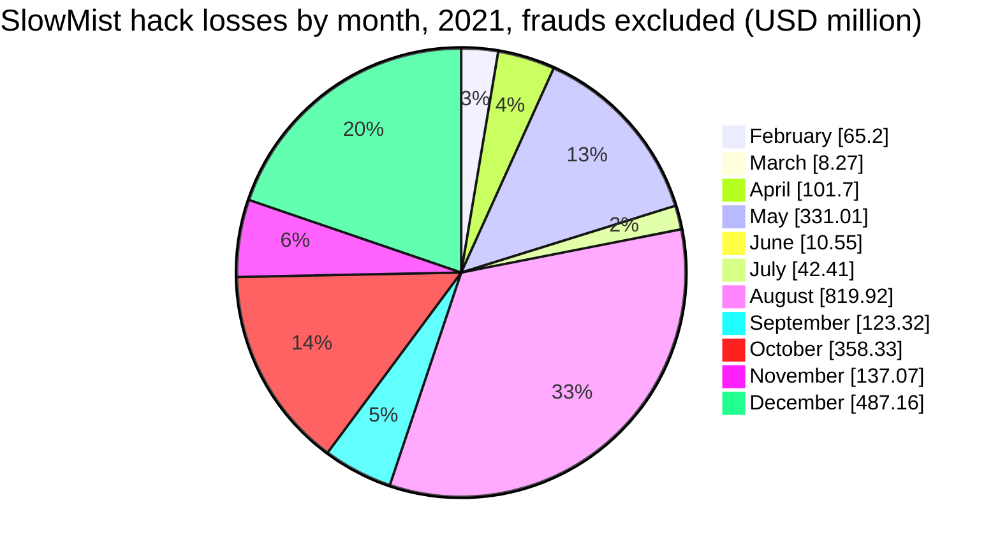
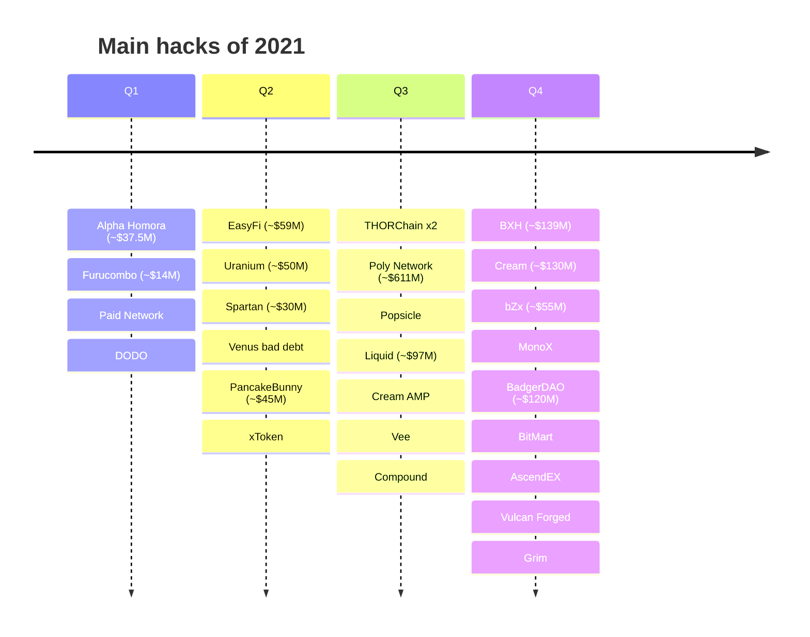
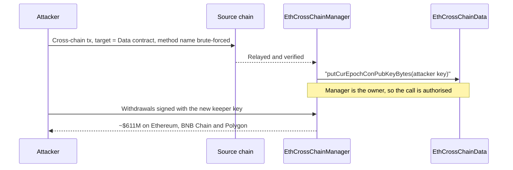
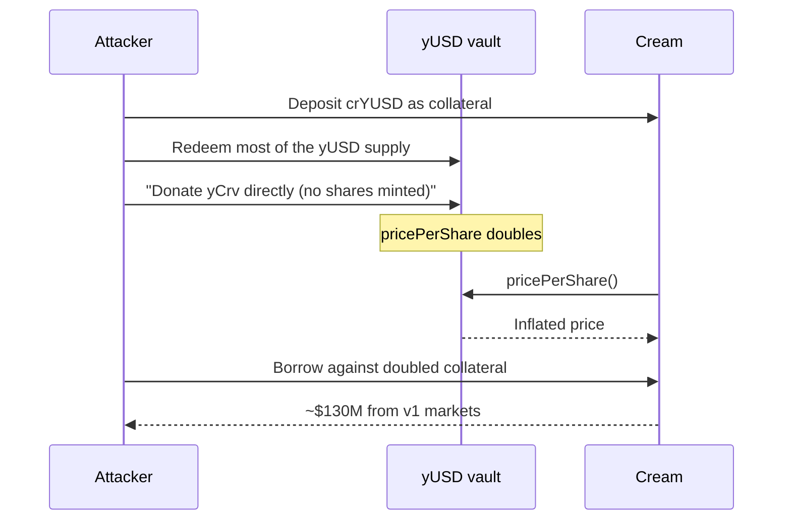

2021 was the year DeFi grew up, and the year attackers followed the money into it. Chainalysis counts about $3.2B stolen, more than five times the 2020 figure, with about 72% of it taken from DeFi protocols. The largest single theft, about $611M from Poly Network in August, was returned in full within two weeks. The rest of the top of the list mixes exchange hot wallets (BitMart, AscendEX, Liquid), stolen admin keys (BXH, Vulcan Forged, EasyFi, bZx), a front-end injection (BadgerDAO, ~$120M) and a long series of DeFi design flaws exploited with flash loans (Cream three times, PancakeBunny, Alpha Homora, Spartan, MonoX, Grim).

This article reviews the year with the method of the site's `crypto-hacks` series: statistics computed from the [SlowMist Hacked](https://hacked.slowmist.io/) database, the trackers' annual figures, [Rekt News](https://rekt.news/), the analytics firms and official statements. Frauds and rug pulls (Thodex, Africrypt, AnubisDAO and others) are kept out of the hack totals and listed separately. A companion article, [The Technical Concepts Behind the 2021 Crypto Hacks]({{site.url_complet}}/2026/10/07/crypto-hacks-2021-technical-concepts/), explains the mechanisms for Solidity developers.

> This article has been made with the help of [Claude Code](https://claude.com/product/claude-code) and several custom skills

[TOC]

## Scope, sources and caveats

The article covers incidents from 1 January to 31 December 2021. No Telegram export of the CryptoAlertHack channel was available for that year. The figures need six caveats:

- **Frauds are not hacks.** SlowMist's 2021 list contains 33 frauds and rug pulls with about $7.08B of stated losses, more than all the year's hacks together. They are listed in [Frauds and scams](#frauds-and-scams) and not counted.
- **Accidents are not hacks.** The ~$75M of ETH staked by StakeHound, made inaccessible when the keys were lost at its custodian Fireblocks, involved no attacker. It is listed in [Accidents](#accidents) and not counted.
- **Two entries are not crypto-platform incidents.** The ransomware attacks on the insurer CNA (~$40M) and the meat producer JBS (~$11M) are excluded.
- **Some entries are borderline.** Venus (~$145M in SlowMist, ~$100M to ~$200M elsewhere) was bad debt created by a pump of the XVS token used as collateral, closer to market manipulation than to a hack. Compound's ~$80M was a bug in a governance upgrade that paid out too much COMP, with no attacker at its origin. Both stay in the totals and are flagged.
- **One incident is listed twice.** SlowMist records Compound on 30 September (~$80M) and again on 4 October (~$68.8M). The database total below includes both; without the second entry it is about $2.42B.
- **Some labels are misleading.** SlowMist's "Curve Finance, ~$30M, governance attack" (November) is the attack on Mochi's USDM through Curve's gauge vote, and its "Sentinel, ~$40M" is the loss of Sentinel funds held at HitBTC.
- **USD values are approximate**, valued at the time of each report. Several incidents have a nominal value far above what the attacker could sell (Paid Network minted ~$27M of tokens but realised about $3M).

## 2021 in numbers

### The annual figures

| Source | Stolen (approx. USD) | Incidents | Notable split |
|--------|--:|--:|---------------|
| [Chainalysis](https://www.chainalysis.com/blog/2022-crypto-crime-report-introduction/) | $3.2B | n/a | ~72% from DeFi; scams ~$7.8B counted separately |
| [Immunefi](https://immunefi.com/blog/research/immunefi-crypto-losses-report-2021/) | $2.33B hacks (+ >$5.5B fraud) | 121 | By quarter: Q1 ~$82M, Q2 ~$525M, Q3 ~$995M, Q4 ~$735M |
| [CertiK](https://www.certik.com/blog/567hEft7IPIS7IKEXMpmkv-the-state-of-defi-security-2021) | $1.3B (DeFi only) | 44 hacks | Centralisation named as the leading attack vector |
| PeckShield | $1.55B (DeFi only) | n/a | Reported only through secondary sources |
| [SlowMist report](https://u.today/cryptocurrency-hackers-stole-98-billion-in-2021-73-of-them-are-defi-incidents) | $9.8B (incl. frauds) | 231 | 170 DeFi and DApp incidents, 15 exchanges |
| [DeFiLlama](https://defillama.com/hacks) (computed) | $2.87B | 127 | Includes some rug pulls and exchanges |

The spread is wider than for later years because the trackers were still defining their scope. CertiK and PeckShield count only DeFi; Chainalysis adds exchanges; SlowMist's headline and Immunefi's first report (about $10.2B, [per Cointelegraph](https://cointelegraph.com/news/immunefi-report-10b-in-defi-hacks-and-losses-across-2021)) include multi-billion frauds such as Thodex and Africrypt.

North Korea was not yet the dominant actor it became in 2022. [Chainalysis](https://www.chainalysis.com/blog/north-korean-hackers-have-prolific-year-as-their-total-unlaundered-cryptocurrency-holdings-reach-all-time-high/) attributes about $400M in seven attacks to it, mostly against exchanges, and uses the Liquid theft as its case study. The [UN Panel of Experts](https://undocs.org/S/2022/132) cites the same figure.

### Month by month

No monthly series from CertiK or PeckShield was found for 2021, so the table compares SlowMist, computed from the database without frauds, with sums computed from the DeFiLlama hacks dataset.

| Month | SlowMist hacks | SlowMist loss | DeFiLlama loss | Largest hack |
|-------|--:|--:|--:|------|
| January | 6 | none priced | ~$0.2M | No large incident |
| February | 13 | ~$65.2M | ~$65.4M | Alpha Homora / Cream Iron Bank |
| March | 11 | ~$8.3M | ~$80.8M | Paid Network, Meerkat (fraud) |
| April | 8 | ~$101.7M | ~$121.4M | Uranium Finance, EasyFi |
| May | 21 | ~$331.0M | ~$287.1M | Venus, PancakeBunny |
| June | 14 | ~$10.6M | ~$116.8M | Alchemix (bug), StakeHound (accident) |
| July | 28 | ~$42.4M | ~$45.9M | THORChain, Anyswap |
| August | 20 | ~$819.9M | ~$798.2M | Poly Network, Liquid |
| September | 20 | ~$123.3M | ~$195.9M | Compound, Vee Finance |
| October | 20 | ~$358.3M | ~$449.0M | BXH, Cream |
| November | 18 | ~$137.1M | ~$119.3M | bZx, MonoX |
| December | 21 | ~$487.2M | ~$588.3M | BitMart, BadgerDAO, Vulcan Forged |

The quarters tell the story of the year: Immunefi's hack losses grew from about $82M in the first quarter to about $995M in the third, as total value locked in DeFi rose. December alone lost more than the whole first half; [TRM Labs](https://www.trmlabs.com/post/grim-finance-hacked-600-million-in-crypto-stolen-in-december) counted more than $600M stolen in its first three weeks.

### The largest incidents

| Rank | Date | Incident | Category | Reported loss (approx. USD) | Root cause (summary) |
|:---:|------|----------|----------|--:|----------------------|
| 1 | 10 Aug | Poly Network | Cross-chain bridge | $611M (all returned) | Cross-chain call reached the keeper-management contract and replaced the keeper key |
| 2 | 4 Dec | BitMart | CEX | $150M to $196M | ETH and BSC hot-wallet private key stolen |
| 3 | 29 Sep | Compound | DeFi lending | $80M at first, up to $147M | Governance upgrade (Proposal 062) over-distributed COMP |
| 4 | 13 Dec | Vulcan Forged | Gaming (custodial wallets) | $103M to $140M | Keys of custodial user wallets exported with the project's credentials |
| 5 | 30 Oct | BXH | DEX (BSC) | $139M | Admin private key leaked |
| 6 | 27 Oct | Cream Finance | DeFi lending | $130M | yUSD share price doubled by a donation, collateral overvalued |
| 7 | 2 Dec | BadgerDAO | DeFi yield | $120M | Malicious script injected into the front end through Cloudflare |
| 8 | 19 Aug | Liquid | CEX | $91M to $97M | Warm wallets compromised; North Korea (Chainalysis) |
| 9 | 8 Oct | Mirror Protocol | DeFi (Terra) | $90M | Same locked position unlocked many times; found only in 2022 |
| 10 | 12 Dec | AscendEX | CEX | $78M | Hot wallets on three chains compromised |
| 11 | 19 Apr | EasyFi | DeFi lending | $47M to $59M | Admin keys stolen from the founder's machine |
| 12 | 28 Apr | Uranium Finance | DEX (BSC) | $50M to $57M | Constant mismatch in the swap's invariant check |
| 13 | 5 Nov | bZx | DeFi lending | $55M | Phishing email stole a developer's keys |
| 14 | 19 May | PancakeBunny | DeFi yield | $45M | Rewards priced with flash-loan-skewed pool reserves |
| 15 | 13 Feb | Alpha Homora / Iron Bank | DeFi lending | $37.5M | Rounding left a debt of 1 share, borrowing doubled it |

Venus (18 May, ~$145M in SlowMist) would rank third by SlowMist's figure but is left out of this table: its loss is bad debt from a price pump, not a theft. Mirror is not in SlowMist's 2021 list at all, because the attack was only discovered in May 2022.

### Statistics from the SlowMist database

Computed from the 2021 entries of the SlowMist Hacked database, before recoveries, after removing 33 frauds, one accident (StakeHound) and the two ransomware entries:

- **200 incidents**, of which 114 have a stated loss, for **~$2.48B** (about $2.42B without Compound's second entry).
- **Median loss: ~$2.5M**, the highest of any year in this series. Seven incidents of $100M or more account for 56% of the total, and the two largest (Poly Network and BitMart) for 31%.

| Size band | Incidents | Loss (approx. USD) | Share of loss |
|---|--:|--:|--:|
| ≥ $100M | 7 | $1,400.1M | 56.3% |
| $10M to $100M | 26 | $919.4M | 37.0% |
| $1M to $10M | 39 | $151.3M | 6.1% |
| $100k to $1M | 33 | $13.8M | 0.6% |
| < $100k | 9 | $0.3M | < 0.1% |
| Not stated | 86 | n/a | n/a |

| Category | Incidents | Loss (approx. USD) | Share of loss |
|---|--:|--:|--:|
| Key / infrastructure compromise | 21 | $704.5M | 28.4% |
| Smart contract vulnerability | 77 | $656.0M | 26.4% |
| Cross-chain bridge / sidechain | 21 | $651.2M | 26.2% |
| Other / unknown | 64 | $409.7M | 16.5% |
| Oracle / price manipulation | 9 | $30.4M | 1.2% |
| Governance attack | 1 | $30.0M | 1.2% |
| Phishing / account takeover | 7 | $3.1M | 0.1% |

The category follows the database's attack method. The bridge row is almost entirely Poly Network. "Other / unknown" holds Venus ("lack of liquidity"), BadgerDAO ("malicious code injection"), MonoX ("price update issue"), Popsicle and Indexed. Smart contract bugs were the most frequent cause by far (77 incidents), while stolen keys caused the largest losses per incident.

## Poly Network (~$611M, August): the largest hack, fully returned

Poly Network connected Ethereum, BNB Chain and Polygon. A cross-chain message was executed on the destination chain by the `EthCrossChainManager` contract, which called whatever contract and method the message named. The same manager also owned `EthCrossChainData`, the contract that stored the public keys of the keepers allowed to sign cross-chain transactions.

The attacker sent a message whose target was `EthCrossChainData` and whose method name was chosen so that its four-byte selector matched `putCurEpochConPubKeyBytes`, the function that replaces the keeper keys. The manager made the call itself, so the ownership check passed, and the attacker's key became the only keeper. From then on the attacker could sign withdrawals on every chain ([BlockSec analysis](https://blocksecteam.medium.com/the-initial-analysis-of-the-polynetwork-hack-270ac6072e2a), [Chainalysis](https://www.chainalysis.com/blog/poly-network-hack-august-2021/)).

The funds could not be laundered quickly: Tether froze about $33M of USDT, the addresses were watched by every exchange, and the attacker began returning the funds within a day, presenting the hack as a demonstration. Poly Network called the attacker "Mr. White Hat", offered a $500k reward, and [announced](https://x.com/PolyNetwork2/status/1425130017546149891) the return of the assets; the last of the funds came back on 23 August. No attribution was ever made official. The flaw is a classic confused deputy: a privileged contract executing arbitrary calls on behalf of untrusted messages.

## Exchanges and stolen keys

Six of the twelve largest hacks of 2021 were key compromises. None involved a code bug:

- **BitMart (~$150M to ~$196M, December).** A hot-wallet private key on Ethereum and BNB Chain was stolen. BitMart [announced](https://x.com/BitMartExchange/status/1467350568481878016) it would cover the losses from its own funds.
- **AscendEX (~$78M, December).** Hot wallets on Ethereum, BNB Chain and Polygon were drained a week after BitMart. The exchange covered the losses.
- **Liquid (~$91M to ~$97M, August).** The Japanese exchange's warm wallets were compromised ([ESET](https://www.welivesecurity.com/2021/08/20/hackers-swipe-100million-cryptocurrency-exchange/)). Chainalysis later used the case to show how North Korean hackers swap stolen tokens on DEXs and mix the ETH.
- **Bilaxy (~$22M, August).** Another exchange hot wallet, with no public post-mortem.
- **BXH (~$139M, October).** An admin private key of the BNB Chain DEX leaked; the team suspected an insider and offered a $10M bounty ([Halborn](https://www.halborn.com/blog/post/explained-the-bxh-exchange-hack-october-2021)).
- **Vulcan Forged (~$103M to ~$140M, December).** The game held its users' wallets with the custodial provider Venly. The attacker used Vulcan Forged's own credentials to export the private keys of user wallets: 96 according to [Venly](https://www.venly.io/post/venly-informs-of-vulcan-forged-hack-with-at-least-96-vulcan-forged-wallets-affected), 148 according to [Vulcan Forged](https://x.com/VulcanForged/status/1470201106626224140), which [refunded users](https://x.com/VulcanForged/status/1470365117774770180) from its treasury.
- **EasyFi (~$47M to ~$59M, April).** The founder's computer was compromised and the admin MetaMask keys taken. The admin key could move protocol funds directly, without a timelock ([post-mortem](https://medium.com/easify-network/easyfi-security-incident-pre-post-mortem-33f2942016e9)).
- **bZx (~$55M, November).** A developer opened a phishing email with a malicious Word macro, which stole their seed phrase and with it the deployer keys of bZx on Polygon and BNB Chain. The attacker drained the protocol and the wallets of users who had granted unlimited approvals ([bZx](https://bzx.network/blog/prelminary-post-mortem)).

## DeFi design failures

Most of the year's incident count came from DeFi protocols on Ethereum and, increasingly, BNB Chain, Polygon and Fantom, where forks of popular protocols were deployed with little review. Flash loans turned almost every pricing or accounting flaw into a one-transaction drain.

### Cream Finance, three times

Cream lost money in February (through Alpha Homora), August and October:

- **February, ~$37.5M.** Alpha Homora v2 could borrow from Cream's Iron Bank. The attacker used an unsupported sUSD market, repaid one wei less than the debt so that a rounding left a total of one debt share, and then borrowed amounts that were recorded as zero shares, doubling the debt each round. Alpha and Cream agreed to split the repayment ([Alpha](https://x.com/AlphaFinanceLab/status/1360623172433760256)).
- **August, ~$18.8M.** The AMP token calls a hook on the recipient during transfers. Cream's crAMP market sent the borrowed tokens before recording the debt, so the hook re-entered another market and borrowed again ([Cream post-mortem](https://medium.com/cream-finance/c-r-e-a-m-finance-post-mortem-amp-exploit-6ceb20a630c5)).
- **October, ~$130M.** Cream priced its crYUSD collateral from the yUSD vault's `pricePerShare()`. The attacker reduced the vault's supply, then donated tokens to it directly, which doubled the share price and therefore the value of their collateral; they borrowed everything Cream's v1 markets held ([Cream post-mortem](https://medium.com/cream-finance/post-mortem-exploit-oct-27-507b12bb6f8e), [Mudit Gupta](https://mudit.blog/cream-hack-analysis/)).

### Compound (~$80M to ~$147M, September)

Compound's Proposal 062 upgraded the Comptroller to fix a COMP distribution issue. In six markets the new code set the market's supply index to its initial value while users' own index stayed at zero, so the next claim paid each supplier COMP as if they had been earning since the beginning.

About $80M of COMP was at risk at first; the reserve kept refilling the Comptroller during the days a governance fix needed, and Rekt's tally reached $147M. Robert Leshner [asked recipients](https://x.com/rleshner/status/1443730726751506432) to return the COMP and keep 10%; part of it came back ([BlockSec](https://blocksec.com/blog/the-butterfly-effect-the-compound-security-incident-caused-by-a-bugfix)). No attacker caused the bug, but nobody could stop it either: the governance timelock that protects Compound from malicious upgrades also delayed the fix.

### Pricing and accounting bugs

- **PancakeBunny (~$45M, May).** Rewards were valued from the spot reserves of a PancakeSwap pool. A flash loan skewed the pool, about 6.95M BUNNY were minted as rewards and dumped ([PeckShield](https://peckshield.medium.com/pancakebunny-incident-root-cause-analysis-7099f413cc9b)).
- **Uranium Finance (~$50M, April).** A fork of Uniswap v2 scaled balances by 10,000 for its fee but kept 1,000 in the invariant check, so a swap only had to keep 1% of the pool's product. One wei in returned almost the whole reserve. US authorities seized ~$31M in 2025 ([TRM Labs](https://www.trmlabs.com/post/u-s-authorities-seize-31-million-in-uranium-finance-exploits-investigation)) and later charged a suspect ([The Record](https://therecord.media/us-indicts-maryland-man-54-million-crypto-theft)).
- **Spartan Protocol (~$30M, May).** The liquidity-share calculation read the pool's live token balance while removals updated only the stored reserves; donating tokens and then removing liquidity captured the donation and part of other providers' share ([PeckShield](https://peckshield-94632.medium.com/the-spartan-incident-root-cause-analysis-b14135d3415f)).
- **MonoX (~$31M, November).** Swaps did not reject the same token as input and output. Swapping MONO for MONO updated its price twice on the same storage, ratcheting it up until the attacker's MONO could buy the pool's other assets ([MonoX](https://x.com/MonoXFinance/status/1465692925791137799), [SlowMist](https://slowmist.medium.com/detailed-analysis-of-the-31-million-monox-protocol-hack-574d8c44a9c8)).
- **Popsicle Finance (~$20M, August).** Liquidity-provider tokens were transferable, but transfers did not update fee accounting. The attacker moved the same tokens through several contracts, each claiming the full fees ([Popsicle](https://x.com/PopsicleFinance/status/1422748604524019713)).
- **Indexed Finance (~$16M, October).** Pool reweighting was permissionless and read live balances; after thinning the pool with flash loans, the attacker minted index tokens cheaply ([post-mortem](https://ndxfi.medium.com/indexed-attack-post-mortem-b006094f0bdc)). The US Department of Justice [charged](https://www.justice.gov/usao-edny/pr/canadian-national-charged-stealing-approximately-65-million-cryptocurrency-two-defi) a suspect in 2025.
- **Vee Finance (~$34M, September)** and **xToken (~$24M, May)** read spot prices from a single DEX pool that the attacker could move.

### Reentrancy, initialisation and delegatecall

- **Grim Finance (~$30M, December).** The vault's `depositFor` accepted a token chosen by the caller. A fake token re-entered the deposit from its `transferFrom` five times, and shares were computed from the balance difference, which counted every nested deposit ([Grim](https://x.com/FinanceGrim/status/1472357770846519312), [Halborn](https://www.halborn.com/blog/post/explained-the-grim-finance-hack-december-2021)).
- **Rari Capital (~$11M, May).** Rari priced its ibETH from Alpha's `Bank.totalETH()`, and Alpha's `work()` handed control to the attacker mid-update ([Rari](https://x.com/RariCapital/status/1391050253621678080)).
- **Furucombo (~$14M, February).** The proxy executed delegatecalls to handlers on a whitelist that included the Aave v2 proxy. Through it, the attacker made Furucombo delegatecall their own contract, which spent users' approvals.
- **Punk Protocol (~$9M, August), DAO Maker (~$4M, September) and DODO (~$2M, March)** all left an `initialize` or `init` function callable again. A whitehat front-ran the Punk attack and recovered about $4.95M ([Punk](https://medium.com/punkprotocol/punk-finance-fair-launch-incident-report-984d9e340eb)).

### THORChain and the bridges

THORChain lost about $5M and about $8M in two July incidents. Its Bifrost observer trusted what the Ethereum router's events and transaction value appeared to say: first a wrapper contract made a zero-value deposit look like a real one, then forged router events triggered refunds ([THORChain post-mortem](https://blog.thorchain.org/post-mortem-eth-router-exploits-1-2-and-premature-return-to-trading-incident)). Anyswap lost about $7.9M in July when two signatures from its MPC wallet reused the same ECDSA nonce, which reveals the private key. Bridges were not yet the main target: apart from Poly Network, their 2021 losses were small.

## Supply chain: BadgerDAO and SushiSwap MISO

**BadgerDAO (~$120M, December)** lost nothing through its contracts. An attacker obtained a Cloudflare API key that had been created on Badger's account without the team's authorisation, and used it to inject a script into the app's front end. For weeks the script asked selected users to sign an extra `approve` or `increaseAllowance` for the attacker's address; on 2 December the attacker used those approvals to empty the users' vault positions ([BadgerDAO](https://x.com/BadgerDAO/status/1466263899498377218), [CoinDesk on the post-mortem](https://www.coindesk.com/business/2021/12/10/badgerdao-reveals-details-of-how-it-was-hacked-for-120m/)). About $9M was frozen in Badger's vaults before it could be withdrawn.

**SushiSwap MISO (~$3M, September)** was an insider supply-chain attack: a contractor committed code that replaced an auction's payment address with their own wallet. All 864.8 ETH were returned ([Cointelegraph](https://cointelegraph.com/news/sushi-s-token-launchpad-miso-hacked-for-3m)).

## Frauds and scams

Frauds and rug pulls are not hacks: no system was broken into. They are listed here and **not counted in this article's hack totals**.

SlowMist lists 33 frauds for 2021, about $7.08B in total (about $7.05B after removing Snowdog DAO, which appears twice). Three schemes account for almost all of it:

| Date | Scheme | Loss (approx. USD) | What happened |
|------|--------|--:|---------------|
| Apr | Thodex (Turkey) | $2B to $2.5B | Exchange closed and its founder fled; he was later convicted in Turkey |
| Apr to Jun | Africrypt (South Africa) | $2.3B to $3.6B (disputed) | Investment platform claimed a hack; founders disappeared |
| Aug | BitConnect (listed in 2021) | $2B | Ponzi scheme that ran from 2016 to 2018, listed by SlowMist in August 2021 |
| Aug | Finiko (Russia) | $100M | Pyramid scheme |
| Oct | AnubisDAO | ~$60M (13,556 ETH) | Liquidity pulled a day after launch; not priced by SlowMist |
| May | DeFi100 | $32M | Rug pull |
| Mar | Meerkat Finance | $31M | Vault upgraded by its deployer and drained a day after launch ([Rekt](https://rekt.news/meerkat-finance-bsc-rekt/)) |
| Nov | Snowdog DAO | $30M | Rug pull |
| Nov | Squid Game token (SQUID) | $3M to $12M | Holders could not sell; developers withdrew the liquidity |
| Jun | StableMagnet | $1.75M to $27M | Backdoor in the contract |

The dates of the largest frauds are reporting dates rather than the dates of the losses: Africrypt's collapse began in April and became public in June, and BitConnect's losses date from earlier years.

## Accidents

Accidents are losses with no attacker: funds made inaccessible by an operational error, a lost key or a bug that nobody exploited. They are listed here and **not counted in this article's hack totals**.

| Date | Incident | Loss (approx. USD) | What happened |
|------|----------|--:|---------------|
| Jun | StakeHound / Fireblocks | $75M (about 38,000 ETH) | StakeHound, a liquid-staking provider, announced that the private keys of the ETH it had staked on the Ethereum 2.0 deposit contract were lost at its custodian Fireblocks. Without the keys the validators' funds cannot be withdrawn. SlowMist files it as an "operation error" under Fireblocks. |

Responsibility for the loss was disputed between StakeHound and Fireblocks. The case still matters for a security review: a custodian's backup and recovery process is part of the attack surface even when nobody attacks, and staked ETH whose withdrawal keys are lost is gone as surely as stolen ETH.

Compound's Proposal 062 bug (September) is close to an accident, since no attacker caused it, but it stays in the hack totals: users actively claimed the excess COMP, and most trackers count it.

## Official post-mortems and statements

| Incident | Source | What it says |
|----------|--------|--------------|
| Poly Network | [Statement on X](https://x.com/PolyNetwork2/status/1425130017546149891) | Hack confirmed; appeal to the attacker, then return of the funds |
| Compound | [Proposal 062](https://compound.finance/governance/proposals/62), [Robert Leshner on X](https://x.com/rleshner/status/1443730726751506432) | Upgrade bug; appeal to return COMP and keep 10% |
| Cream (October) | [Post-mortem](https://medium.com/cream-finance/post-mortem-exploit-oct-27-507b12bb6f8e) | Oracle on yUSD share price manipulated by donation |
| Cream (August) | [Post-mortem](https://medium.com/cream-finance/c-r-e-a-m-finance-post-mortem-amp-exploit-6ceb20a630c5) | Reentrancy through AMP's transfer hook |
| BadgerDAO | [Statement on X](https://x.com/BadgerDAO/status/1466263899498377218) | Unauthorised approvals; contracts paused |
| BitMart | [Statement on X](https://x.com/BitMartExchange/status/1467350568481878016) | Hot wallets compromised; losses covered |
| Vulcan Forged | [Statements on X](https://x.com/VulcanForged/status/1470201106626224140), [Venly](https://www.venly.io/post/venly-informs-of-vulcan-forged-hack-with-at-least-96-vulcan-forged-wallets-affected) | Wallet keys exported with Vulcan Forged's credentials; users refunded |
| EasyFi | [Post-mortem](https://medium.com/easify-network/easyfi-security-incident-pre-post-mortem-33f2942016e9) | Admin keys stolen from the founder's machine |
| bZx | [Preliminary post-mortem](https://bzx.network/blog/prelminary-post-mortem) | Phishing macro; Polygon and BNB Chain keys taken |
| Alpha Homora | [Statement on X](https://x.com/AlphaFinanceLab/status/1360623172433760256) | Exploit through the sUSD market; repayment with Cream |
| MonoX | [Statement on X](https://x.com/MonoXFinance/status/1465692925791137799) | Exploit confirmed |
| Grim Finance | [Statement on X](https://x.com/FinanceGrim/status/1472357770846519312) | Reentrancy exploit on vaults |
| Popsicle | [Statement on X](https://x.com/PopsicleFinance/status/1422748604524019713) | Sorbetto Fragola exploited |
| Rari Capital | [Statement on X](https://x.com/RariCapital/status/1391050253621678080) | ETH pool drained through ibETH |
| Punk Protocol | [Incident report](https://medium.com/punkprotocol/punk-finance-fair-launch-incident-report-984d9e340eb) | Re-initialisation; part recovered by a whitehat |
| Indexed Finance | [Post-mortem](https://ndxfi.medium.com/indexed-attack-post-mortem-b006094f0bdc) | Reweighting manipulation |
| THORChain | [Post-mortem](https://blog.thorchain.org/post-mortem-eth-router-exploits-1-2-and-premature-return-to-trading-incident) | Two ETH router exploits |

## Observations

- **Losses followed total value locked.** Quarterly hack losses grew about twelvefold between the first and third quarters, in step with DeFi's growth.
- **Forks multiplied bugs.** Uranium, Spartan, BurgerSwap and many BNB Chain projects modified audited code (Uniswap v2, Compound) without the review the original had.
- **Flash loans were the default tool.** PancakeBunny, Cream, Spartan, Indexed and xToken were all one-transaction attacks with borrowed capital; Chainalysis counts about $364M taken in flash-loan attacks.
- **Prices from a protocol's own state were the most common weakness**: pool reserves, vault share prices and live balances, all movable within a transaction.
- **Centralised keys caused the largest losses per incident**, at exchanges (BitMart, AscendEX, Liquid) and in DeFi admin roles (BXH, EasyFi, bZx).
- **Governance safety cut both ways.** Compound's timelock, built to stop malicious upgrades, kept a bug paying out for a week.
- **Frauds dwarfed hacks.** SlowMist's frauds total about $7B, almost three times its hack total.

## Data gaps

This section lists what could not be found or verified while writing this article, so that it can be completed later. Each row says what is missing and where to look first.

| Gap | What is missing or unverified | Where to search |
|-----|-------------------------------|-----------------|
| Telegram export | No CryptoAlertHack export was available for 2021. | A Telegram export for 2021 |
| PeckShield figures | The ~$1.55B DeFi figure comes only from secondary sources; no monthly figures. | PeckShieldAlert posts on X, January 2022 |
| CertiK figures | The 2021 report PDF is behind a download form; the press release could not be fetched; no monthly series. | CertiK State of DeFi Security 2021 PDF, BusinessWire release |
| SlowMist report | The original annual report (WeChat) and its PDF were not reached; figures come from secondary coverage. | SlowMist blog, mp.weixin.qq.com |
| Elliptic and TRM Labs | No Elliptic annual figure or Liquid write-up was found; TRM's only verified 2021 figure is December's. | Google: "elliptic 2021 liquid hack", trmlabs.com |
| UN report | The content of S/2022/132 was seen only through search results. | undocs.org/S/2022/132 |
| SlowMist entries | Compound counted twice; "Curve Finance" is Mochi; Sentinel is HitBTC; January has no priced entry; Mirror is missing. | SlowMist database entries, Rekt News |
| Venus | Bad-debt amount varies from ~$100M to ~$200M; classification as a hack is debatable. | Venus statements of May 2021, Rekt |
| Official statements | BitMart support article unreachable; Popsicle, Grim and xToken written post-mortems not found; BadgerDAO's own post-mortem returns 404; Alpha's post-mortem now redirects. | Wayback Machine, project websites |
| Smaller incidents | pNetwork, Value DeFi, BurgerSwap, Belt, Visor, Polygon's MRC20 bug (~$2M) and Saddle are mentioned briefly or not at all and were not verified in detail. | Rekt News, project channels |
| StakeHound accident | The ETH amount (about 38,000), the date of the announcement and how responsibility was settled between StakeHound and Fireblocks were not verified against StakeHound's own statement. | StakeHound blog and X account, Fireblocks statements, press coverage of June 2021 |
| Frauds | Africrypt's amount (69,000 BTC, disputed), the Thodex sentence and AnubisDAO's laundering were seen only in search results. | Court records, Bloomberg, Decrypt |
| Attribution | No official DPRK attribution was found for BitMart, AscendEX or Vulcan Forged. | FBI, Chainalysis, Elliptic |

## Conclusion

2021 brought hacks to DeFi's scale: about $3.2B stolen according to Chainalysis, $1.3B to $2.5B across the trackers that exclude frauds or exchanges.

- **Poly Network** (~$611M) was the largest hack, and all of it came back.
- **Exchange and admin keys** caused the largest losses per incident: BitMart, AscendEX, Liquid, BXH, Vulcan Forged, EasyFi and bZx.
- **DeFi design flaws** were the most numerous: share prices and pool reserves used as oracles, accounting that ignored transfers, rounding and constants copied wrongly into forks.
- **Supply chain attacks** reached users through the front end (BadgerDAO) and the codebase (MISO).
- **Frauds** (Thodex, Africrypt, AnubisDAO) are kept apart from the hack totals; they dwarf them.
- **Accidents** such as StakeHound's ~$75M of ETH lost at Fireblocks are also kept apart: no attacker was involved.

## Annex

### Key Terms

| Term | Definition |
|------|------------|
| **Flash loan** | An uncollateralised loan repaid within one transaction; it gives any attacker the capital to move a price or a balance. |
| **Spot price** | The current price of a DEX pool, derived from its reserves; it can be moved within one transaction. |
| **Share price (pricePerShare)** | The value of one vault share in underlying tokens; at Cream it was used as an oracle and inflated by a donation. |
| **Donation** | Sending tokens directly to a contract without going through its deposit function, which changes its balance without minting shares. |
| **Constant-product invariant (K)** | The rule `x * y >= k` checked after each swap in Uniswap v2 and its forks; Uranium's check used the wrong scaling constant. |
| **Reentrancy** | A call back into a contract before it has finished updating its state, here through token hooks (AMP) or a fake token (Grim). |
| **ERC-777 hook** | A function called on the sender or recipient during a token transfer, which gives them control in the middle of it. |
| **Confused deputy** | A privileged contract tricked into using its privileges for an attacker, as Poly Network's manager was. |
| **Function selector** | The first four bytes of the hash of a function's signature, which picks the function called; different names can share one. |
| **Initialiser** | A function setting up a proxy or clone after deployment; if it can be called again, anyone can take control. |
| **Hot wallet** | An exchange wallet whose keys are online, as at BitMart, AscendEX and Liquid. |
| **Front-end injection** | Modifying the website of a protocol so that users sign malicious transactions, as at BadgerDAO. |
| **Rug pull** | A project whose developers take the users' funds; a fraud, not a hack. |
| **Accident** | A loss with no attacker, such as keys lost by a custodian; not counted as a hack. |
| **Bad debt** | Loans whose collateral is worth less than the debt and that will not be repaid, as at Venus. |
| **Timelock** | A delay between the approval and execution of a governance change; it slowed Compound's fix. |

## Frequently Asked Questions

**Q: How much was stolen in crypto hacks in 2021?**

About $3.2B according to Chainalysis, including exchanges. Immunefi counts ~$2.33B in hacks, CertiK ~$1.3B and PeckShield ~$1.55B in DeFi only. The SlowMist database gives ~$2.48B after frauds are removed. The headline figures near $10B include frauds such as Thodex and Africrypt.

**Q: Why did the Poly Network hacker return the money?**

The hacker never explained beyond public messages presenting the attack as a demonstration. The assets were visible on public chains, about $33M was frozen by Tether and exchanges watched the addresses, so selling ~$611M of tokens would have been hard. Poly Network offered a $500k reward and called the attacker "Mr. White Hat"; no one was charged.

**Q: What is a flash loan attack, and why were there so many in 2021?**

A flash loan lets anyone borrow millions without collateral if they repay within the same transaction. On its own it is harmless; it becomes an attack tool when a protocol reads a price or a balance that the borrowed capital can move. In 2021 many protocols priced assets from DEX reserves or vault share prices, so a single transaction could inflate a value, profit from it and repay the loan.

**Q: Was the Compound incident a hack?**

Not in the usual sense. A governance upgrade contained a bug that paid users far more COMP than they had earned, and some users claimed it. Nobody broke in, but the protocol lost tokens it could not recover through governance in time, so trackers list it alongside hacks.

**Q: How did BadgerDAO lose ~$120M without a smart contract bug?**

The attacker controlled Badger's website through a Cloudflare API key and injected a script that asked users to approve the attacker's address on their tokens. Users signed what looked like a normal transaction. Weeks later the attacker used the approvals to withdraw their vault tokens. The contracts did exactly what the signatures allowed.

**Q: Why are Thodex and Africrypt not counted as hacks?**

Both were frauds: the operators of the platforms took the customers' money, and Africrypt's claim of a hack was not credible. Counting them would triple the year's total and make the comparison with other years meaningless.

## References

### Annual reports and figures

- [Chainalysis: 2022 Crypto Crime Report introduction](https://www.chainalysis.com/blog/2022-crypto-crime-report-introduction/)
- [Chainalysis: DeFi hacks](https://www.chainalysis.com/blog/2022-defi-hacks/)
- [Chainalysis: North Korean hackers have prolific year](https://www.chainalysis.com/blog/north-korean-hackers-have-prolific-year-as-their-total-unlaundered-cryptocurrency-holdings-reach-all-time-high/)
- [Immunefi: crypto losses report 2021](https://immunefi.com/blog/research/immunefi-crypto-losses-report-2021/)
- [Cointelegraph: Immunefi report, $10B in DeFi hacks and losses across 2021](https://cointelegraph.com/news/immunefi-report-10b-in-defi-hacks-and-losses-across-2021)
- [CertiK: the state of DeFi security 2021](https://www.certik.com/blog/567hEft7IPIS7IKEXMpmkv-the-state-of-defi-security-2021)
- [U.Today: SlowMist 2021 annual report coverage](https://u.today/cryptocurrency-hackers-stole-98-billion-in-2021-73-of-them-are-defi-incidents)
- [UN Panel of Experts report S/2022/132](https://undocs.org/S/2022/132)
- [DeFiLlama hacks](https://defillama.com/hacks)

### Official statements and post-mortems

- [Poly Network: statement (on X)](https://x.com/PolyNetwork2/status/1425130017546149891)
- [Compound: Proposal 062](https://compound.finance/governance/proposals/62) and [Robert Leshner (on X)](https://x.com/rleshner/status/1443730726751506432)
- [Cream Finance: post-mortem, exploit of 27 October](https://medium.com/cream-finance/post-mortem-exploit-oct-27-507b12bb6f8e) and [AMP exploit](https://medium.com/cream-finance/c-r-e-a-m-finance-post-mortem-amp-exploit-6ceb20a630c5)
- [BadgerDAO: statement (on X)](https://x.com/BadgerDAO/status/1466263899498377218)
- [BitMart: statement (on X)](https://x.com/BitMartExchange/status/1467350568481878016)
- [Vulcan Forged: statements (on X)](https://x.com/VulcanForged/status/1470201106626224140), [refund (on X)](https://x.com/VulcanForged/status/1470365117774770180) and [Venly](https://www.venly.io/post/venly-informs-of-vulcan-forged-hack-with-at-least-96-vulcan-forged-wallets-affected)
- [EasyFi: security incident post-mortem](https://medium.com/easify-network/easyfi-security-incident-pre-post-mortem-33f2942016e9)
- [bZx: preliminary post-mortem](https://bzx.network/blog/prelminary-post-mortem)
- [Alpha Finance (on X)](https://x.com/AlphaFinanceLab/status/1360623172433760256), [MonoX (on X)](https://x.com/MonoXFinance/status/1465692925791137799), [Grim Finance (on X)](https://x.com/FinanceGrim/status/1472357770846519312), [Popsicle (on X)](https://x.com/PopsicleFinance/status/1422748604524019713), [Rari Capital (on X)](https://x.com/RariCapital/status/1391050253621678080)
- [Punk Protocol: incident report](https://medium.com/punkprotocol/punk-finance-fair-launch-incident-report-984d9e340eb), [Indexed Finance: post-mortem](https://ndxfi.medium.com/indexed-attack-post-mortem-b006094f0bdc), [THORChain: ETH router exploits post-mortem](https://blog.thorchain.org/post-mortem-eth-router-exploits-1-2-and-premature-return-to-trading-incident)
- [US DOJ: charges in the Indexed Finance and KyberSwap exploits](https://www.justice.gov/usao-edny/pr/canadian-national-charged-stealing-approximately-65-million-cryptocurrency-two-defi)

### Analytics firms and technical analyses

- [Chainalysis: Poly Network hack](https://www.chainalysis.com/blog/poly-network-hack-august-2021/)
- [TRM Labs: Grim Finance and $600M stolen in December](https://www.trmlabs.com/post/grim-finance-hacked-600-million-in-crypto-stolen-in-december), [Uranium Finance seizure](https://www.trmlabs.com/post/u-s-authorities-seize-31-million-in-uranium-finance-exploits-investigation)
- [ESET: hackers swipe $100M from a cryptocurrency exchange (Liquid)](https://www.welivesecurity.com/2021/08/20/hackers-swipe-100million-cryptocurrency-exchange/)
- [BlockSec: Poly Network initial analysis](https://blocksecteam.medium.com/the-initial-analysis-of-the-polynetwork-hack-270ac6072e2a), [Compound incident](https://blocksec.com/blog/the-butterfly-effect-the-compound-security-incident-caused-by-a-bugfix)
- [PeckShield: PancakeBunny](https://peckshield.medium.com/pancakebunny-incident-root-cause-analysis-7099f413cc9b), [Spartan](https://peckshield-94632.medium.com/the-spartan-incident-root-cause-analysis-b14135d3415f)
- [SlowMist: MonoX](https://slowmist.medium.com/detailed-analysis-of-the-31-million-monox-protocol-hack-574d8c44a9c8), [Halborn: BXH](https://www.halborn.com/blog/post/explained-the-bxh-exchange-hack-october-2021), [Halborn: Grim Finance](https://www.halborn.com/blog/post/explained-the-grim-finance-hack-december-2021), [Mudit Gupta: Cream](https://mudit.blog/cream-hack-analysis/)
- [CoinDesk: BadgerDAO reveals how it was hacked](https://www.coindesk.com/business/2021/12/10/badgerdao-reveals-details-of-how-it-was-hacked-for-120m/), [The Record: Uranium Finance indictment](https://therecord.media/us-indicts-maryland-man-54-million-crypto-theft), [Cointelegraph: SushiSwap MISO](https://cointelegraph.com/news/sushi-s-token-launchpad-miso-hacked-for-3m)

### Databases and Rekt News post-mortems

- [SlowMist Hacked database](https://hacked.slowmist.io/), 2021 entries
- [Poly Network - Rekt](https://rekt.news/polynetwork-rekt/), [BitMart - Rekt](https://rekt.news/bitmart-rekt/), [Compound - Rekt](https://rekt.news/compound-rekt/), [Vulcan Forged - Rekt](https://rekt.news/vulcan-forged-rekt/), [Cream - Rekt 2](https://rekt.news/cream-rekt-2/), [Badger - Rekt](https://rekt.news/badger-rekt/)
- [Mirror - Rekt](https://rekt.news/mirror-rekt/), [AscendEX - Rekt](https://rekt.news/ascendex-rekt/), [EasyFi - Rekt](https://rekt.news/easyfi-rekt/), [Uranium - Rekt](https://rekt.news/uranium-rekt/), [bZx - Rekt](https://rekt.news/bzx-rekt/), [PancakeBunny - Rekt](https://rekt.news/pancakebunny-rekt/)
- [Alpha Finance - Rekt](https://rekt.news/alpha-finance-rekt/), [Vee Finance - Rekt](https://rekt.news/veefinance-rekt/), [MonoX - Rekt](https://rekt.news/monox-rekt/), [Spartan - Rekt](https://rekt.news/spartan-rekt/), [Grim Finance - Rekt](https://rekt.news/grim-finance-rekt/), [Popsicle - Rekt](https://rekt.news/popsicle-rekt/)
- [Cream - Rekt](https://rekt.news/cream-rekt/), [Indexed Finance - Rekt](https://rekt.news/indexed-finance-rekt/), [Furucombo - Rekt](https://rekt.news/furucombo-rekt/), [Rari Capital - Rekt](https://rekt.news/rari-capital-rekt/), [THORChain - Rekt](https://rekt.news/thorchain-rekt/), [THORChain - Rekt 2](https://rekt.news/thorchain-rekt2/)

### Related articles

- [Crypto Hacks of 2020 - KuCoin, Flash Loans and the DeFi Summer]({{site.url_complet}}/2026/10/07/crypto-hacks-2020/)
- [The Technical Concepts Behind the 2021 Crypto Hacks]({{site.url_complet}}/2026/10/07/crypto-hacks-2021-technical-concepts/)
- [Crypto Hacks of 2022 - Ronin, Wormhole, Nomad and the Year of Bridge Hacks]({{site.url_complet}}/2026/10/07/crypto-hacks-2022/)
- [Cross-Chain Bridge Hacks - Ten Incidents, Five Failure Classes]({{site.url_complet}}/2026/07/31/cross-chain-bridge-hacks/)
- [Compound V2 Overview]({{site.url_complet}}/2024/08/27/compound-protocol-v2/)
- [Security of Cryptocurrency Exchanges - Overview]({{site.url_complet}}/2025/11/06/crypto-exchange-security-overview/)
