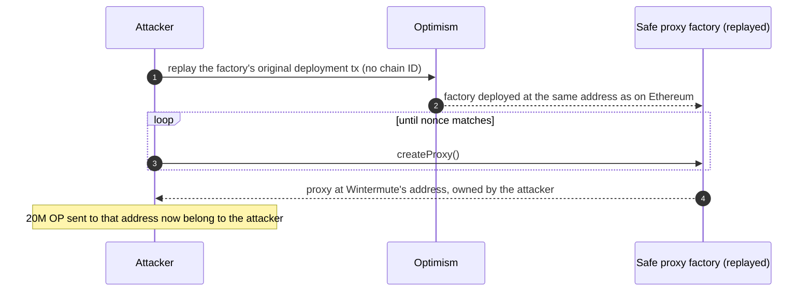

The [recap of the 2022 crypto hacks]({{site.url_complet}}/2026/10/07/crypto-hacks-2022/) covers the record year in one-line causes: "an upgrade made the zero root trusted", "signature verification spoofed through a deprecated function", "flash-loaned voting power". This companion article explains those mechanisms for a developer who writes Solidity, knows how bridges, lending markets and proxies work, and wants to see what exactly broke.

It follows the technical articles on [2023]({{site.url_complet}}/2026/10/07/crypto-hacks-2023-technical-concepts/) and [2024]({{site.url_complet}}/2026/10/07/crypto-hacks-2024-technical-concepts/) and links to them where a mechanism recurs. 2022's material is mostly about verification: how a bridge decides a message is real, how a Solana program decides an account is the one it expects, how governance decides who may vote, and how a key or an address is created in the first place.

> This article has been made with the help of [Claude Code](https://claude.com/product/claude-code) and several custom skills

> **About the code.** The Solidity and Rust snippets are simplified to show the mechanism. They are not the deployed code of the protocols named; read the linked post-mortems for the exact contracts.

[TOC]

## Bridge message verification

A bridge locks assets on chain A and releases or mints them on chain B when it believes a message saying "this deposit happened". Everything depends on how chain B checks that message. The site's article on [cross-chain bridge hacks]({{site.url_complet}}/2026/07/31/cross-chain-bridge-hacks/) analyses these incidents as a set; this section shows the four checks that failed in 2022.

### A threshold that counted keys, not parties (Ronin, ~$625M)

Ronin released funds when 5 of its 9 validators signed. Four validators belonged to Sky Mavis, and a fifth, the Axie DAO's, had allowlisted Sky Mavis to sign on its behalf during a traffic peak; the allowlist was never revoked. Compromising one company therefore produced five signatures. The check was implemented correctly; the threshold assumed independent signers that did not exist.

### A trusted zero root (Nomad, ~$190M)

Nomad's replica contract accepted a message if the Merkle root it was proven against had been confirmed:

```solidity
// Simplified
mapping(bytes32 => uint256) public confirmAt;     // root => time it becomes valid
mapping(bytes32 => bytes32) public messages;      // message hash => proven root

function acceptableRoot(bytes32 root) public view returns (bool) {
    uint256 t = confirmAt[root];
    return t != 0 && block.timestamp >= t;
}

function process(bytes memory message) external {
    bytes32 h = keccak256(message);
    require(acceptableRoot(messages[h]), "!proven");   // unproven message => messages[h] == 0
    _dispatch(message);
}
```

For a message that was never proven, `messages[h]` is the zero value. An upgrade in June 2022 initialised the contract with a committed root of `0x00` and set `confirmAt[0x00] = 1`, so the zero root became acceptable, and with it every unproven message. Once the first attacker showed that copying a withdrawal transaction and changing the recipient was enough, hundreds of addresses did the same. The lesson: a mapping's default value must never be a valid state.

### A proof hash that ignored a field (BNB Chain token hub, ~$570M minted)

The BNB Chain bridge accepted cross-chain packages with an IAVL Merkle proof against an earlier block. Its verifier computed the root by hashing up the proof path, and an inner node's hash took either its left or its right child. When one was set, the other was ignored.

The attacker built a proof containing an extra, fake leaf in the field the hash ignored: the computed root matched a genuine block, and the fake leaf was accepted as proven. Two packages minted 1M BNB each. The general rule for any proof verifier: every byte of the proof must affect the result, or it can carry anything.

### The zero address treated as ETH (Qubit, ~$80M)

Qubit's bridge handled ETH deposits through a separate function, but its token handler treated the zero address as "ETH" in its whitelist. Calling the ERC-20 deposit path with token address `0x0` reached a low-level transfer:

```solidity
// Simplified
function deposit(address token, uint256 amount) external {
    // token == address(0) passes the whitelist (it stands for ETH elsewhere)
    (bool ok, ) = token.call(abi.encodeWithSelector(IERC20.transferFrom.selector, msg.sender, address(this), amount));
    require(ok, "transfer failed");   // a call to an address with no code returns ok = true
    _emitDeposit(token, amount);      // minted on the other side, nothing received here
}
```

A `call` to an address with no code succeeds and returns no data. Nothing was transferred, but the deposit event was emitted, and the other chain minted unbacked tokens that were used as collateral. OpenZeppelin's `SafeERC20` rejects calls to addresses without code; hand-written low-level transfers must check `token.code.length > 0` themselves.

## Solana account validation

On Solana, a program receives every account it touches as an input from the transaction. Nothing guarantees that an account is the one the program expects; the program has to check its address, owner and contents. Two of 2022's largest Solana exploits were missing checks of this kind.

### A fake system account (Wormhole, ~$326M)

Wormhole's guardian signatures were verified with Solana's secp256k1 program, in a separate instruction of the same transaction. Wormhole then read the result through the *instructions sysvar*, a special account listing the transaction's instructions, using a function that was being deprecated because it did not check which account it was given:

```rust
// Simplified (Rust, Solana)
pub fn verify_signatures(ctx: Context<VerifySignatures>) -> Result<()> {
    let ix_sysvar = &ctx.accounts.instructions;          // supplied by the caller
    // missing: require!(ix_sysvar.key() == sysvar::instructions::ID)
    let secp_ix = load_instruction_at(0, &ix_sysvar.data.borrow())?; // deprecated, unchecked
    // trusts secp_ix as proof that the guardians signed
    Ok(())
}
```

The attacker passed an account it had created itself, containing a fabricated "secp256k1 verification succeeded" instruction. Wormhole accepted it, built a valid-looking message (VAA) from it, and minted 120,000 wrapped ETH on Solana with no deposit behind them. The replacement function, `load_instruction_at_checked`, verifies the account address; frameworks like Anchor make such checks declarative (`address = sysvar::instructions::ID`).

### A collateral chain nobody checked to the root (Cashio, ~$52M)

Cashio minted its CASH stablecoin against Saber LP tokens, validating collateral through a chain of accounts: the deposited token account, the collateral record, the LP pool, its mint. One link of the chain, the mint of the pool's LP token, was never checked against a trusted value. The attacker created a chain of fake accounts, each consistent with the next, ending in a worthless token it had minted, and Cashio minted about 2B CASH against it. Validation that checks each link against the next, but not the first against a trusted root, validates nothing.

## Governance, oracles and collateral

### Voting power for one transaction (Beanstalk, ~$182M)

A governance system has to answer "who may vote, and with how much?". Beanstalk counted voting power at the moment of the vote and let a two-thirds supermajority execute a proposal immediately:

```solidity
// Simplified
function emergencyCommit(uint32 bip) external {
    require(votesFor(bip) * 3 >= totalVotingPower() * 2, "no supermajority");
    _execute(bip);   // same transaction, no delay
}
```

With a flash loan of about $1B, the attacker deposited into Beanstalk's pools, received a supermajority of voting power, voted for its own proposal (BIP-18) and executed it, all before repaying the loan. Two standard defences would each have stopped it:

- **Snapshots.** Voting power is read at a block before the proposal was created (OpenZeppelin's `ERC20Votes` and `Governor` do this), so tokens acquired afterwards do not count.
- **Timelocks.** An approved proposal executes only after a delay, during which anyone can react.

### Unrealised profit as collateral (Mango Markets, ~$115M)

Mango let traders borrow against their account value, including unrealised profit on perpetual futures, priced by an oracle that followed MNGO's spot markets. The attacker opened a large long perpetual on MNGO from one account, sold the other side from a second, then bought MNGO on thin spot markets until its price rose about tenfold. The oracle followed; the long position showed an enormous unrealised profit, and Mango let the account borrow almost all of the protocol's assets against it.

A protocol that accepts unrealised profit as collateral must price it with an oracle that cannot be moved cheaply, cap the collateral value of illiquid assets, and limit position size relative to market depth.

### An oracle that stopped at a floor (Venus, Blizz, May 2022)

Chainlink aggregators have `minAnswer` and `maxAnswer` bounds, a circuit breaker on the reported price. During the LUNA crash, LUNA's market price fell below the feed's $0.10 floor while the feed kept reporting $0.10. Users bought LUNA on the market for a fraction of that, deposited it at the floor value, and borrowed other assets: Venus lost about $13.5M and Blizz about $8.3M. A consumer of a price feed should treat a value at the feed's bounds as suspect and pause the market, not lend against it:

```solidity
(, int256 answer, , uint256 updatedAt, ) = feed.latestRoundData();
require(answer > minAnswer && answer < maxAnswer, "price at circuit-breaker bound");
require(block.timestamp - updatedAt <= maxDelay, "stale price");
```

## Contract mechanics

### Interactions before effects (Fei / Rari Fuse, ~$80M)

The checks-effects-interactions pattern says a function should update its own state before calling out. Rari's Fuse pools, forks of Compound, sent ETH to the borrower before recording the borrow:

```solidity
// Simplified
function borrow(uint256 amount) external {
    require(_isAllowedToBorrow(msg.sender, amount));
    doTransferOut(payable(msg.sender), amount);    // ETH sent: borrower's fallback runs
    accountBorrows[msg.sender] += amount;          // effect recorded after the interaction
}
```

From its fallback, the attacker called the comptroller's `exitMarket`, which checked whether the account had any debt (not yet recorded) and released its collateral. The attacker kept both the borrowed ETH and the collateral, across seven pools. The [2024 technical article]({{site.url_complet}}/2026/10/07/crypto-hacks-2024-technical-concepts/) covers reentrancy through callbacks; Fei/Rari is the plainest case of it.

### Proxy storage collision (Audius, ~$6M nominal)

An upgradeable proxy and its implementation share storage. If the proxy keeps its own variables at ordinary slots, they can overlap the implementation's variables. Audius' proxy stored its admin address in slot 0, where OpenZeppelin's `Initializable` keeps its `initialized` and `initializing` flags. The bytes of the admin address made the initializer believe initialisation was allowed again, so the attacker re-initialised the governance contract with itself in control and moved the treasury's AUDIO. Modern proxies store their own data at pseudo-random slots defined by [ERC-1967](https://eips.ethereum.org/EIPS/eip-1967) precisely to avoid this; the site's [proxy summary]({{site.url_complet}}/2022/10/31/proxy-contract-summary/) covers the layout.

### A deployer key that could mint (Ankr, December)

Ankr's aBNBc token was upgradeable by a deployer key. Ankr says a former employee planted a malicious package in its build and obtained that key; the attacker upgraded the token to an implementation that minted without limit and sold the result. Cheap aBNBc was then used as collateral on Helio. An upgrade key is a mint key in disguise; it needs the same timelock and multisig protection as any other.

## Keys and addresses

### A vanity address from a 32-bit seed (Wintermute, ~$160M)

Profanity generated vanity addresses, addresses with a chosen prefix such as `0x0000…`, by starting from a random private key and incrementing it until the derived address matched. The starting key came from a 32-bit seed, so there were only about 4.3 billion possible starting points. Given a target address, an attacker can run the same search backwards from each seed with GPUs and recover the private key.

1inch published the weakness on 15 September 2022; on 20 September, Wintermute's hot wallet, a Profanity address, was drained. The rule: never derive a key from less than 128 bits of entropy, and treat any "convenience" key generator as suspect (the site's article on the [COLDCARD entropy defect]({{site.url_complet}}/2026/07/31/coldcard-rng-entropy-incident/) shows the same failure in a hardware wallet, four years later).

### An address that existed on one chain only (Wintermute's 20M OP)

A contract created with `CREATE` gets the address `keccak256(rlp(sender, nonce))[12:]`. It depends only on the creator and its nonce, not on the chain. Wintermute gave Optimism the address of its Safe on Ethereum to receive 20M OP, but that Safe had not been deployed on Optimism. The attacker replayed, on Optimism, the old transaction that had deployed the Safe proxy factory (a transaction signed without a chain ID, so valid on any chain), then called the factory repeatedly until its nonce produced Wintermute's address, with the attacker as owner. [EIP-155](https://eips.ethereum.org/EIPS/eip-155) chain IDs prevent the first step, and `CREATE2` with an owner-dependent salt prevents the second.



### SIM swaps and missing 2FA (FTX, Crypto.com)

Some of the year's largest thefts involved no cryptography at all. US prosecutors say the ~$477M FTX drain began with a SIM swap: the attackers took over an employee's phone number, then the accounts protected by codes sent to it. At Crypto.com, withdrawals were approved for 483 users without the second factor being checked. Phone numbers are not a second factor, and a second factor that can be skipped is not one.

## Summary: from incident to concept

| Incident (2022) | Concept | Section |
|-----------------|---------|---------|
| Ronin | Threshold of keys held by one party, stale allowlist | Bridge verification |
| Nomad | Default value of a mapping accepted as valid | Bridge verification |
| BNB Chain | Proof hash ignoring part of the proof | Bridge verification |
| Qubit | Low-level call to an address with no code | Bridge verification |
| Wormhole | Caller-supplied system account not checked | Solana accounts |
| Cashio | Account chain not anchored to a trusted root | Solana accounts |
| Beanstalk | Voting power counted at vote time, executed immediately | Governance |
| Mango | Unrealised profit priced by a movable oracle | Oracles |
| Venus, Blizz | Price feed stuck at its minimum bound | Oracles |
| Fei / Rari | External call before the state update | Contract mechanics |
| Audius | Proxy variable overlapping the implementation's flags | Contract mechanics |
| Ankr | Upgrade key used to mint | Contract mechanics |
| Wintermute | Key from a 32-bit seed | Keys and addresses |
| Wintermute (OP) | CREATE address replayed on another chain | Keys and addresses |
| FTX, Crypto.com | SIM swap, skippable 2FA | Keys and addresses |

## Data gaps

This section lists what could not be found or verified while writing this article, so that it can be completed later. Each row says what is missing and where to look first.

| Gap | What is missing or unverified | Where to search |
|-----|-------------------------------|-----------------|
| Deployed code | Snippets are simplified; none was compared line by line with the deployed contracts or programs. | Etherscan, Solana explorers, the protocols' GitHub |
| BNB Chain proof bug | The description of which IAVL proof field was ignored comes from public analyses, not from the patched code. | BNB Chain's patch commit, the Rekt and samczsun analyses |
| Audius storage collision | The exact slots involved were summarised; the Audius post-mortem link is dead. | Audius GitHub, Wayback Machine |

## Conclusion

The 2022 hacks are mostly failures of verification:

- **Bridges** verified the wrong thing: keys that were not independent (Ronin), a default value (Nomad), a proof that did not commit to all its data (BNB Chain), a transfer that never happened (Qubit).
- **Solana programs** trusted accounts they were handed (Wormhole, Cashio).
- **Governance and oracles** measured values an attacker could set within one transaction (Beanstalk, Mango) or that stopped at a floor (Venus, Blizz).
- **Contract mechanics** broke on old rules: checks-effects-interactions (Fei/Rari), storage layout (Audius), upgrade keys (Ankr).
- **Keys and addresses** were weaker than they looked: a 32-bit seed (Profanity), an address that existed on one chain only (OP), a phone number as second factor (FTX).


## Annex

### Key Terms

| Term | Definition |
|------|------------|
| **Validator threshold** | The number of signatures a bridge requires to release funds; meaningful only if the signers are independent. |
| **Allowlist** | A permission letting one party act for another; Ronin's was never revoked. |
| **Merkle root** | The hash committing to a set of messages; a bridge accepts a message proven against a trusted root. |
| **Default value** | The zero value an unset mapping entry returns in Solidity; Nomad's zero root made it valid. |
| **IAVL proof** | The Merkle proof format of the Cosmos-based BNB Beacon Chain; its verifier ignored part of the proof. |
| **Low-level call** | `address.call(...)`, which succeeds against an address with no code. |
| **Instructions sysvar** | A Solana system account listing the current transaction's instructions; Wormhole read it without checking its address. |
| **Account validation** | On Solana, checking that each input account has the expected address, owner and data. |
| **VAA** | Wormhole's verified action approval, the signed message that authorises a mint. |
| **Snapshot voting** | Counting voting power at a block before the proposal, so newly acquired tokens do not count. |
| **Timelock** | A delay between a proposal's approval and its execution. |
| **Unrealised PnL** | Profit on an open position at the current price, which Mango accepted as collateral. |
| **minAnswer / maxAnswer** | Chainlink aggregator bounds; the reported price stops at them even if the market moves beyond. |
| **Checks-effects-interactions** | Updating a contract's state before making external calls. |
| **Storage collision** | Two variables of a proxy and its implementation occupying the same storage slot. |
| **ERC-1967** | The standard defining pseudo-random storage slots for proxy data. |
| **Vanity address** | An address with a chosen pattern, found by brute-force key generation. |
| **CREATE address** | `keccak256(rlp(sender, nonce))`, the same on every chain for the same creator and nonce. |
| **EIP-155** | Chain IDs in transaction signatures, preventing replay of a transaction on another chain. |
| **SIM swap** | Moving a victim's phone number to an attacker's SIM to intercept codes. |

### Security Implementation Checklist

#### Bridges and proofs

| Check | Security requirement | Failure mode if violated |
|:---:|------------|------------|
| ☐ | Signers counted toward a threshold are independent, and delegations are revoked when no longer needed. | One compromise yields a quorum (Ronin). |
| ☐ | No mapping's default value is a valid state, especially after initialisation. | Every unproven message is accepted (Nomad). |
| ☐ | Every field of a proof contributes to the computed root. | A fake leaf hides in an ignored field (BNB Chain). |
| ☐ | Token transfers check that the token address has code and that the balance actually changed. | A deposit event is emitted for nothing (Qubit). |

#### Solana programs

| Check | Security requirement | Failure mode if violated |
|:---:|------------|------------|
| ☐ | Every system account (sysvars, programs) is checked against its known address. | A fake account fabricates a verification result (Wormhole). |
| ☐ | Account chains used for validation are anchored to a trusted mint or program. | A self-consistent chain of fake accounts is accepted (Cashio). |

#### Governance, oracles and contracts

| Check | Security requirement | Failure mode if violated |
|:---:|------------|------------|
| ☐ | Voting power is snapshotted before proposals, and approved proposals wait for a timelock. | Flash-loaned votes execute a proposal instantly (Beanstalk). |
| ☐ | Collateral value of illiquid assets and unrealised profit is capped and priced robustly. | A thin market is pumped to borrow everything (Mango). |
| ☐ | Prices at a feed's min/max bound, or stale, pause the market. | Assets are lent against a frozen floor price (Venus, Blizz). |
| ☐ | State is updated before external calls, and lending functions are `nonReentrant`. | Collateral is released before debt is recorded (Fei/Rari). |
| ☐ | Proxies use ERC-1967 slots and storage layouts are checked on every upgrade. | Implementation flags are overwritten by proxy data (Audius). |
| ☐ | Upgrade and mint keys are behind a multisig and a timelock. | A stolen deployer key mints without limit (Ankr). |

#### Keys and operations

| Check | Security requirement | Failure mode if violated |
|:---:|------------|------------|
| ☐ | Keys come from at least 128 bits of entropy from a vetted generator. | Keys are brute-forced from a small seed (Profanity). |
| ☐ | Contract addresses given to third parties exist on the chain where funds will arrive. | An attacker deploys to the address first (20M OP). |
| ☐ | Second factors are enforced on every sensitive path and are not tied to phone numbers. | SIM swaps and skipped 2FA (FTX, Crypto.com). |

## Frequently Asked Questions

**Q: Why did Nomad's upgrade make every message valid?**

Nomad accepted a message if the root it was proven against had a non-zero confirmation time. For a message never proven, the stored root is the mapping's default, `0x00`. The upgrade set a confirmation time for root `0x00`, so the default became a trusted root, and any message passed `process`.

**Q: How could Wormhole be tricked into believing guardians had signed?**

Wormhole read the result of the signature check from the instructions sysvar, an account the caller passed in, using a deprecated function that did not verify the account's address. The attacker passed an account it had created with a fake "signatures verified" entry, and Wormhole minted 120,000 wrapped ETH on that basis.

**Q: What would have stopped the Beanstalk governance attack?**

Either of two standard defences:

- **Snapshot voting**: counting voting power at a block before the proposal was created, so tokens obtained through a flash loan afterwards carry no votes.
- **A timelock**: delaying execution after approval, so that a proposal could not be voted and executed inside the same transaction.

Beanstalk had neither for emergency proposals.

**Q: Why is a vanity address generated by Profanity unsafe?**

Profanity derived its starting private key from a 32-bit seed, so there were only about 4.3 billion possible starting points. For a given address, an attacker can test each seed's search path with GPUs and find the private key. Wintermute's hot wallet was drained five days after the weakness was published.

**Q: How could someone take control of an address Wintermute had given to Optimism?**

A `CREATE` address depends only on the creator and its nonce. The attacker replayed on Optimism the old, chain-ID-less transaction that had deployed the Safe proxy factory on Ethereum, then called the factory until its nonce produced Wintermute's address, owned by the attacker. Wintermute's Safe existed on Ethereum, but nobody had deployed it on Optimism.

**Q: Combining Qubit and Wormhole, what single habit would have prevented both?**

Verify identity, not just success. Qubit trusted a call that returned "success" without checking that the target was a real token contract; Wormhole trusted an account that reported "verified" without checking that it was the real system account. In both cases, the check that mattered was who answered, not what the answer said.

## References

### Official post-mortems

- [Beanstalk: governance exploit](https://bean.money/blog/beanstalk-governance-exploit)
- [Ankr: after-action report on the aBNBc exploit](https://www.ankr.com/blog/after-action-report-our-findings-from-abnbc-token-exploit/)
- [BNB Chain: ecosystem update](https://www.bnbchain.org/en/blog/bnb-chain-ecosystem-update)
- [Optimism forum: message from Wintermute](https://gov.optimism.io/t/message-to-optimism-community-from-wintermute/2595)

### Technical analyses

- [Wormhole - Rekt](https://rekt.news/wormhole-rekt), [Nomad - Rekt](https://rekt.news/nomad-rekt), [BNB Bridge - Rekt](https://rekt.news/bnb-bridge-rekt), [Qubit - Rekt](https://rekt.news/qubit-rekt), [Ronin - Rekt](https://rekt.news/ronin-rekt)
- [Cashio - Rekt](https://rekt.news/cashio-rekt), [Beanstalk - Rekt](https://rekt.news/beanstalk-rekt), [Mango Markets - Rekt](https://rekt.news/mango-markets-rekt), [Venus Blizz - Rekt](https://rekt.news/venus-blizz-rekt), [Fei Rari - Rekt](https://rekt.news/fei-rari-rekt), [Audius - Rekt](https://rekt.news/audius-rekt)
- [Wintermute - Rekt 2](https://rekt.news/wintermute-rekt-2), [Wintermute (OP) - Rekt](https://rekt.news/wintermute-rekt), [Ankr Helio - Rekt](https://rekt.news/ankr-helio-rekt)
- [Chainalysis: cross-chain bridge hacks in 2022](https://www.chainalysis.com/blog/cross-chain-bridge-hacks-2022/)

### Standards

- [ERC-1967: Proxy Storage Slots](https://eips.ethereum.org/EIPS/eip-1967)
- [EIP-155: Simple replay attack protection](https://eips.ethereum.org/EIPS/eip-155)
- [Claude Code](https://claude.com/product/claude-code)

### Related articles

- [Cross-Chain Bridge Hacks - Ten Incidents, Five Failure Classes]({{site.url_complet}}/2026/07/31/cross-chain-bridge-hacks/)
- [Cross-Chain Bridge Threat Model - Assets, Trust Boundaries, STRIDE and Threat Register]({{site.url_complet}}/2026/07/31/cross-chain-bridge-threat-model/)
- [Programming proxy contracts with OpenZeppelin | Summary]({{site.url_complet}}/2022/10/31/proxy-contract-summary/)
- [When the Hardware RNG Was Not Called - Anatomy of an Entropy Defect]({{site.url_complet}}/2026/07/31/coldcard-rng-entropy-incident/)
- [Compound V2 Overview]({{site.url_complet}}/2024/08/27/compound-protocol-v2/)
