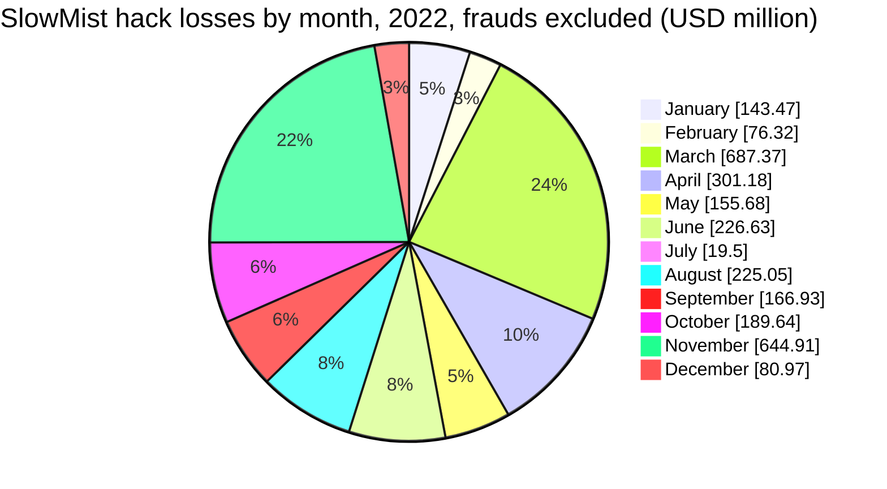
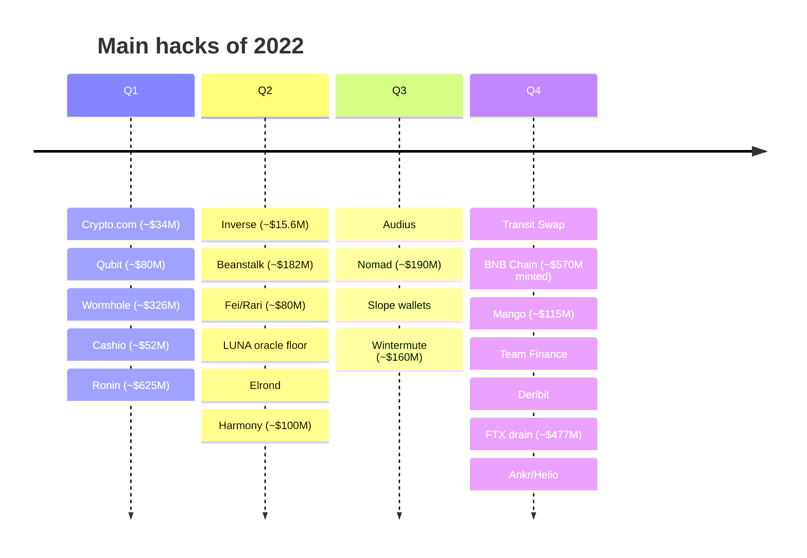
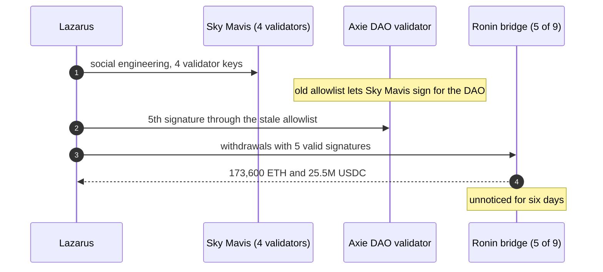
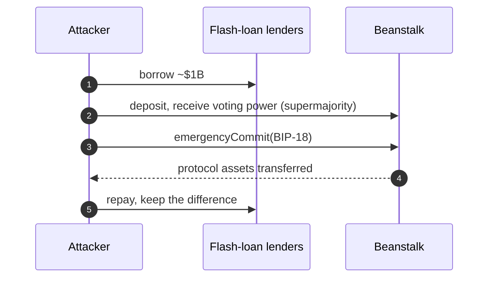

2022 set the record for crypto theft at the time. Chainalysis counts about $3.8B stolen, more than in any previous year of its data, and Immunefi about $3.77B in hacks alone. Two thirds of DeFi's losses came from one kind of target: cross-chain bridges. Ronin lost about $625M in March, Wormhole about $326M in February, Nomad about $190M in August, the BNB Chain bridge minted about $570M of BNB in October, and Harmony's bridge lost about $100M in June.

The year also brought the first large flash-loan governance attack (Beanstalk, ~$182M), the oracle manipulation of Mango Markets (~$115M), whose perpetrator was convicted in 2024 and then had all convictions vacated in 2025, and the ~$477M drain of FTX's wallets on the day it filed for bankruptcy. This article reviews the year with the method of the site's `crypto-hacks` series: statistics computed from the [SlowMist Hacked](https://hacked.slowmist.io/) database, the trackers' annual figures, [Rekt News](https://rekt.news/), the analytics firms and official statements. The 2022 collapses (Terra, Celsius, FTX itself) and other frauds are kept out of the hack totals and covered separately. A companion article, [The Technical Concepts Behind the 2022 Crypto Hacks]({{site.url_complet}}/2026/10/07/crypto-hacks-2022-technical-concepts/), explains the mechanisms for Solidity developers.

> This article has been made with the help of [Claude Code](https://claude.com/product/claude-code) and several custom skills

[TOC]

## Scope, sources and caveats

The article covers incidents from 1 January to 31 December 2022. No Telegram export of the CryptoAlertHack channel was available for that year. The figures need five caveats:

- **Collapses and frauds are not hacks.** The failures of Terra, Celsius, Three Arrows Capital, Voyager and the FTX exchange destroyed far more value than all the year's hacks combined, but nobody broke into a system to cause them. They are listed in [Frauds and collapses](#frauds-and-collapses), and so are Vires Finance (~$530M, linked to fraud allegations against its founder) and the Ponzi schemes and rug pulls in SlowMist's list.
- **The FTX hack is not the FTX collapse.** On 11–12 November, hours after FTX filed for bankruptcy, about $477M was drained from its wallets. That theft is a hack and is counted; the exchange's collapse is not.
- **SlowMist leaves out two large incidents.** Wormhole and the BNB Chain bridge appear in the database without a stated loss, so its computed total misses them. SlowMist also values the FTX drain at ~$600M, against ~$477M elsewhere.
- **Nominal and realised losses differ.** The BNB Chain attacker minted 2M BNB (~$570M) but moved only about $100M to $137M off the chain; Beanstalk lost ~$182M but its attacker kept ~$76M to ~$80M.
- **USD values are approximate**, valued at the time of each report.

## 2022 in numbers

### The annual figures

| Source | Stolen (approx. USD) | Incidents | Notable split |
|--------|--:|--:|---------------|
| [Chainalysis](https://www.chainalysis.com/blog/2022-biggest-year-ever-for-crypto-hacking/) | $3.8B | n/a | DeFi $3.1B (82.1%), 64% of it from bridges (~$2B); North Korea ~$1.7B |
| [Immunefi](https://immunefi.com/blog/research/immunefi-crypto-losses-report-2022/) | $3.77B hacks (+ $174.9M fraud) | 134 hacks | DeFi 80.5%; $204.2M recovered (5.2%) |
| [CertiK Hack3d](https://www.certik.com/resources/blog/2aHoafYEoeRguK2gE9fD1s-hack3d-the-web3-security-report-2022) | $3.7B (incl. scams) | n/a | Nine bridge incidents: 1.5% of incidents, more than a third of losses |
| [SlowMist report](https://kyt.slowmist.com/blog/slowmist-2022-blockchain-security-and-aml-analysis-annual-report/) | $3.78B | 303 | Bridges: 16 incidents, ~$1.21B; DeFi 183 incidents, ~$2.08B |
| PeckShield | ~$3B by 31 October | n/a | October ~$760M gross across 44 exploits ([post](https://twitter.com/PeckShieldAlert/status/1587112410082512897)) |

North Korea's 2022 total has the widest range of any year. The [UN Panel of Experts](https://undocs.org/S/2023/171) reported South Korea's estimate of about $630M and a cybersecurity firm's estimate of more than $1B, while Chainalysis attributes about $1.7B, including $1.1B from DeFi.

### Month by month

PeckShield's monthly posts for 2022 could not be recovered for this article, so the table compares CertiK, which counts hacks, exploits and scams, with SlowMist computed from the database without frauds. CertiK revised several months in successive reports; its monthly figures add up to about $3.51B against its annual $3.7B.

| Month | CertiK | SlowMist hacks | SlowMist loss | Largest hack |
|-------|--:|--:|--:|------|
| January | ~$179.3M | 17 | ~$143.5M | Qubit, Crypto.com |
| February | ~$414.3M | 17 | ~$76.3M (Wormhole not priced) | Wormhole |
| March | ~$715.9M | 25 | ~$687.4M | Ronin |
| April | ~$378.3M | 23 | ~$301.2M | Beanstalk, Fei/Rari |
| May | ~$99.6M | 29 | ~$155.7M | Mirror Protocol |
| June | ~$268.4M | 27 | ~$226.6M | Harmony, Elrond |
| July | ~$66.7M | 18 | ~$19.5M | Audius |
| August | ~$255.1M | 20 | ~$225.1M | Nomad |
| September | ~$181.9M | 11 | ~$166.9M | Wintermute |
| October | ~$290.1M | 35 | ~$189.6M (BNB not priced) | BNB Chain, Mango |
| November | ~$596.8M | 13 | ~$644.9M (FTX at ~$600M) | FTX |
| December | ~$62.2M | 15 | ~$81.0M | Ankr/Helio |

October shows how much definitions matter: Chainalysis calls it the worst month in its history (~$775.7M in 32 attacks), PeckShield counts ~$760M gross, and CertiK ~$290M, because only some trackers value the BNB Chain mint.

### The largest incidents

| Rank | Date | Incident | Category | Reported loss (approx. USD) | Root cause (summary) |
|:---:|------|----------|----------|--:|----------------------|
| 1 | 23 Mar | Ronin bridge | Cross-chain bridge | $540M to $625M | 5 of 9 validator keys obtained, 4 through social engineering; Lazarus (FBI) |
| 2 | 6 Oct | BNB Chain token hub | Cross-chain bridge | $570M minted, $100M to $137M moved out | Forged IAVL Merkle proof accepted |
| 3 | 11 Nov | FTX (post-bankruptcy drain) | CEX | $477M | SIM swap of an employee's phone number, per a DOJ indictment |
| 4 | 2 Feb | Wormhole | Cross-chain bridge | $326M (replaced by Jump) | Signature verification spoofed through a deprecated function |
| 5 | 1 Aug | Nomad | Cross-chain bridge | $190M | An upgrade made the zero root trusted; hundreds copied the exploit |
| 6 | 17 Apr | Beanstalk | DeFi (stablecoin) | $182M | Flash-loaned voting power passed a malicious proposal instantly |
| 7 | 20 Sep | Wintermute | Market maker | $160M | Vanity address generated with Profanity, key brute-forced |
| 8 | 11 Oct | Mango Markets | DeFi (perpetuals) | $110M to $117M ($67M returned) | MNGO price pumped to borrow against unrealised profit |
| 9 | 5 Jun | Elrond (Maiar) | L1 | $113M (recovered, per Elrond) | Virtual-machine function let a contract act with the caller's context |
| 10 | 23 Jun | Harmony Horizon bridge | Cross-chain bridge | $100M | 2 of 5 multisig keys compromised; Lazarus (FBI) |
| 11 | 28 Jan | Qubit | Cross-chain bridge | $80M | Zero address treated as ETH in `deposit()` |
| 12 | 30 Apr | Fei / Rari Fuse | DeFi lending | $80M | Reentrancy in `borrow()` through `exitMarket()` |
| 13 | 23 Mar | Cashio | Stablecoin | $48M to $52M | Collateral accounts not validated; 2B CASH minted |
| 14 | 17 Jan | Crypto.com | CEX | $34M (reimbursed) | Withdrawals approved without 2FA |
| 15 | 1 Nov | Deribit | CEX | $28M | Hot wallets compromised |

### Statistics from the SlowMist database

Computed from the 2022 entries of the SlowMist Hacked database, before recoveries, after removing 63 frauds (scams, rug pulls and Vires Finance), which are not counted as hacks:

- **250 incidents**, of which 129 have a stated loss, for **~$2.92B**. Adding Wormhole (~$326M), which the database lists without an amount, would bring it to about $3.24B; SlowMist's own report gives $3.78B.
- **Median loss: ~$2.0M**, far higher than in later years: 2022's incidents were fewer and larger. Eight incidents of $100M or more make up about 69% of the total.

| Size band | Incidents | Loss (approx. USD) | Share of loss |
|---|--:|--:|--:|
| ≥ $100M | 8 | $2,019.0M | 69.2% |
| $10M to $100M | 23 | $701.6M | 24.0% |
| $1M to $10M | 56 | $188.0M | 6.4% |
| $100k to $1M | 29 | $8.6M | 0.3% |
| < $100k | 13 | $0.4M | < 0.1% |
| Not stated | 121 | n/a | n/a |

| Category | Incidents | Loss (approx. USD) | Share of loss |
|---|--:|--:|--:|
| Other / unknown | 62 | $1,092.3M | 37.4% |
| Key / infrastructure compromise | 35 | $857.7M | 29.4% |
| Smart contract vulnerability | 92 | $696.8M | 23.9% |
| Cross-chain bridge / sidechain | 15 | $202.6M | 6.9% |
| Oracle / price manipulation | 15 | $41.5M | 1.4% |
| Phishing / account takeover | 30 | $26.8M | 0.9% |

The category follows the database's attack method. The bridge row looks small only because SlowMist files Ronin and Harmony as key leaks, leaves Wormhole and BNB Chain unpriced, and lists unusual labels under "Other / unknown" (FTX, Wintermute's "operational mistake", Elrond's VM bug, Scream's depeg-driven bad debt). By incident, bridges took about $1.2B to $2B in 2022, depending on the tracker.

## The year of bridge hacks

Bridges were the defining target of 2022. A bridge holds the assets of one chain and mints their representation on another on the strength of a message, a signature set or a proof; whoever forges that message mints value. The site's article on [cross-chain bridge hacks]({{site.url_complet}}/2026/07/31/cross-chain-bridge-hacks/) analyses several of these incidents in depth; this section summarises them.

### Ronin (~$540M to ~$625M, March)

Ronin, the sidechain of the game Axie Infinity, accepted withdrawals signed by 5 of its 9 validators. Four validators were run by Sky Mavis, the game's developer, and a fifth, run by the Axie DAO, had allowlisted Sky Mavis to sign on its behalf during a load peak months earlier, an allowlist that was never revoked. The attackers obtained Sky Mavis' keys through social engineering of an employee, used the stale allowlist for the fifth signature, and withdrew 173,600 ETH and 25.5M USDC on 23 March. Nobody noticed for six days ([Ronin statement](https://x.com/Ronin_Network/status/1508828719711879168)).

The FBI attributed the theft to the Lazarus Group on 14 April 2022, and the US Treasury sanctioned the receiving address the same day. About $30M was seized later in the year with Chainalysis' help ([Chainalysis](https://www.chainalysis.com/blog/axie-infinity-ronin-bridge-dprk-hack-seizure/)). [Elliptic](https://www.elliptic.co/blog/540-million-stolen-from-the-ronin-defi-bridge) valued the loss at $540M at the time of the theft; the $625M figure is its value at disclosure.

### The other bridges

| Date | Bridge | Loss (approx. USD) | What the bridge accepted |
|------|--------|--:|--------------------------|
| 28 Jan | Qubit | $80M | `deposit()` treated the zero address as ETH, and a transfer from an address with no code succeeded silently, so unbacked tokens were minted |
| 2 Feb | Wormhole | $326M (replaced by Jump) | Signature verification relied on a deprecated function that let the attacker supply a fake instruction account, so a forged message minted 120,000 wrapped ETH on Solana ([Wormhole](https://x.com/wormholecrypto/status/1489001949881978883)) |
| 23 Jun | Harmony Horizon | $100M | Two of five multisig keys compromised; the FBI attributed it to Lazarus in January 2023 |
| 1 Aug | Nomad | $190M | An upgrade marked the zero root as trusted, so any message passed; after the first exploit, hundreds of addresses copied the transaction, and ~$32M to ~$37M came back from whitehats |
| 6 Oct | BNB Chain token hub | $570M minted, ~$100M to ~$137M moved | A bug in IAVL Merkle proof verification accepted a forged proof against an old block; the chain was halted and most of the BNB stayed frozen |

Each bridge failed differently, through keys (Ronin, Harmony), a signature check (Wormhole), an initialisation (Nomad), a proof verifier (BNB Chain) or a deposit edge case (Qubit), but the result was the same: the destination chain released or minted value that no deposit backed.

## DeFi design failures

### Beanstalk (~$182M, April): governance bought with a flash loan

Beanstalk, a stablecoin protocol, let holders of its governance stake vote on proposals and execute any proposal with a two-thirds supermajority immediately through `emergencyCommit`. The attacker took a flash loan of about $1B, deposited it into Beanstalk's pools to obtain a supermajority of voting power for one transaction, and executed a proposal (BIP-18) that sent the protocol's assets to itself, all before repaying the loan ([Beanstalk](https://bean.money/blog/beanstalk-governance-exploit)). The protocol lost ~$182M; the attacker kept ~$76M to ~$80M after repaying the flash loan.

Voting power that can be acquired and used inside one transaction is not governance. Snapshots of voting power taken before a proposal, and a delay between approval and execution, prevent it.

### Mango Markets (~$115M, October): an oracle and a court case

Avraham Eisenberg used two accounts to open a large perpetual position on the MNGO token, then pushed MNGO's spot price up about tenfold on thin markets. Mango's oracle valued his position's unrealised profit at the new price, and he borrowed nearly all of the protocol's assets against it. He then negotiated with the DAO, which voted to let him keep about $47M if he returned $67M. US prosecutors charged him with fraud and manipulation; he was convicted in April 2024, but a federal judge vacated all the convictions in May 2025 ([TRM Labs](https://www.trmlabs.com/resources/blog/breaking-federal-judge-overturns-all-criminal-convictions-in-mango-markets-case-against-avraham-eisenberg)). Whatever the legal outcome, the mechanism is a classic oracle manipulation.

### Contract bugs

| Date | Protocol | Loss (approx. USD) | Flaw |
|------|----------|--:|------|
| 15 Mar | Agave, Hundred (Gnosis Chain) | $5.5M + $6.2M | A token's `callAfterTransfer` hook allowed reentrancy into `borrow` before debt was updated |
| 23 Mar | Cashio | $48M to $52M | Collateral account chain not validated; a fake chain minted 2B CASH |
| 2 Apr | Inverse Finance | $15.6M | A thin, single-source TWAP was pumped to borrow against INV |
| 13 Apr | Elephant Money | $11.2M to $22.2M | Flash-loan manipulation of the price used to mint TRUNK |
| 28 Apr | Deus | $13.4M | A Solidly pool's VWAP was moved with flash swaps |
| 30 Apr | Fei / Rari Fuse | $80M | `borrow()` sent ETH before updating state; reentrancy through `exitMarket()` |
| 30 Apr | Saddle Finance | $11M (+$3.8M rescued) | An outdated library mispriced LP tokens in metapool swaps |
| 12 May | Venus, Blizz | $13.5M + $8.3M | Chainlink's LUNA feed stopped at a $0.10 floor while LUNA traded far below it |
| 23 Jul | Audius | ~$6M nominal | Storage collision between the proxy and its initializer let the attacker re-initialise governance |
| 2 Oct | Transit Swap | $21M (~70% returned) | Unvalidated input let `transferFrom` spend users' approvals |
| 27 Oct | Team Finance | $14.5M to $15.8M | `migrate()` moved locked liquidity into pools the attacker had priced |
| 12 Dec | Lodestar | $6.5M | `donate()` inflated the price of plvGLP used as collateral |

Many of these mechanisms recur in later years; the site's [technical article on 2024]({{site.url_complet}}/2026/10/07/crypto-hacks-2024-technical-concepts/) explains approval drains and reentrancy, and the [2023 one]({{site.url_complet}}/2026/10/07/crypto-hacks-2023-technical-concepts/) oracle and accounting failures, in more depth.

## Keys, operations and infrastructure

- **FTX drain (11–12 November, ~$477M).** Hours after FTX filed for Chapter 11, its wallets were emptied. In early 2024, US prosecutors indicted three people for a SIM-swap scheme that took over an employee's phone number and, through it, the company's accounts; the indictment refers to the victim as "Company-1". [Elliptic](https://www.elliptic.co/blog/the-477-million-ftx-hack-following-the-blockchain-trail) traced the funds.
- **Wintermute (20 September, ~$160M).** The market maker's hot wallet had a vanity address generated with Profanity, a tool whose 32-bit seed made keys recoverable by brute force once 1inch disclosed the weakness five days earlier ([Wintermute's CEO](https://x.com/EvgenyGaevoy/status/1572134271011225601)). Wintermute had earlier lost 20M OP when an address it gave Optimism existed on Ethereum but not yet on Optimism, and an attacker deployed a contract to it first.
- **Elrond (5 June, ~$113M).** A new virtual-machine function let a contract execute with its caller's context; the attacker drained EGLD from the Maiar DEX. Elrond says the funds were recovered.
- **Exchanges.** Crypto.com approved withdrawals without 2FA for 483 users (~$34M, reimbursed); Deribit lost ~$28M from hot wallets; LCX ~$7.9M from a hot-wallet key.
- **Keys and developers.** Ankr says a former employee planted a malicious package and obtained the deployer key, minting a huge amount of aBNBc, which was then used to drain Helio ([Ankr report](https://www.ankr.com/blog/after-action-report-our-findings-from-abnbc-token-exploit/)); Raydium's owner key was exposed by a trojan.
- **Wallet software.** The Slope mobile wallet sent key material to a logging service, and 9,231 Solana wallets were drained ([Solana](https://solana.com/news/8-2-2022-application-wallet-incident)); tampered BitKeep Android packages stole keys in December.

## Frauds and collapses

Collapses and frauds are not hacks: no system was broken into. They are listed here and **not counted in this article's hack totals**.

**Collapses of 2022.** Terra's UST stablecoin and LUNA collapsed in May, wiping out tens of billions of dollars of value; Celsius froze withdrawals in June and filed for bankruptcy in July; Three Arrows Capital and Voyager failed in June and July; FTX filed for bankruptcy on 11 November, and its founder Sam Bankman-Fried was convicted of fraud in November 2023. These were failures of solvency and, in several cases, fraud by insiders.

**Frauds in SlowMist's list.** SlowMist lists 63 frauds for 2022, about $822M in total. The largest:

| Date | Scheme | Loss (approx. USD) | What happened |
|------|--------|--:|---------------|
| Apr | Vires Finance (Waves) | $530M | Outflows from the lending protocol linked by researchers to its founder, who faces fraud allegations he denies; filed by SlowMist under "Unknown" and treated here as a fraud |
| May | Mining Capital Coin | $62M | A crypto-mining investment scheme charged as fraud in the United States |
| Dec | mgnr | $52M | Rug pull |
| Nov | DeFiAI | $40M | Rug pull |
| Jul | TBIS | $21M | Scam |
| Jul | Raccoon Network, Freedom Protocol | $20M | Scam |

## Official post-mortems and statements

| Incident | Source | What it says |
|----------|--------|--------------|
| Ronin | [Statement on X](https://x.com/Ronin_Network/status/1508828719711879168) | 5 of 9 validator keys used; withdrawals forged on 23 March |
| Wormhole | [Statement on X](https://x.com/wormholecrypto/status/1489001949881978883), [Jump on X](https://x.com/jump_/status/1489301013408497666) | Exploit confirmed; Jump replaced the 120,000 ETH |
| Nomad | [Statement on X](https://x.com/nomadxyz_/status/1554246853348036608) | Bridge exploited; recovery address for whitehats |
| BNB Chain | [Ecosystem update](https://www.bnbchain.org/en/blog/bnb-chain-ecosystem-update) | Forged proof on the token hub; chain halted and patched |
| Beanstalk | [Governance exploit post-mortem](https://bean.money/blog/beanstalk-governance-exploit) | Flash-loaned votes passed BIP-18 through `emergencyCommit` |
| Wintermute | [CEO statement on X](https://x.com/EvgenyGaevoy/status/1572134271011225601) | Profanity-generated hot wallet compromised; firm solvent |
| Harmony | [Statement on X](https://x.com/harmonyprotocol/status/1540110924400324608) | Horizon bridge exploited |
| Ankr | [After-action report](https://www.ankr.com/blog/after-action-report-our-findings-from-abnbc-token-exploit/) | Former employee, malicious package, deployer key |
| Slope / Solana | [Solana incident note](https://solana.com/news/8-2-2022-application-wallet-incident) | Key material sent to a logging service |
| Ronin, Harmony attribution | FBI statements (April 2022, January 2023) | Lazarus Group / APT38 |

## Observations

- **Bridges were the year's weakest link.** Five of the ten largest hacks were bridges, and Chainalysis puts bridge losses at about $2B, two thirds of DeFi's losses.
- **Bridges failed in five different ways**: keys, signatures, initialisation, proof verification and deposit edge cases. A bridge has as many critical components as it has ways to accept a message.
- **North Korea specialised in bridges and keys**, with official FBI attributions for Ronin and Harmony and estimates of its total between ~$630M and ~$1.7B.
- **Flash loans turned design flaws into nine-figure losses**: Beanstalk's governance and Mango's oracle were both exploitable by anyone with enough capital for one transaction.
- **Key generation was a vulnerability of its own**: Profanity's weak seed cost Wintermute ~$160M.
- **The headline losses of 2022 were collapses, not hacks.** Terra, Celsius and FTX destroyed far more than all the year's hacks combined.

## Conclusion

2022 set the record for crypto hacks at the time: about $3.8B stolen (Chainalysis), $3.7B to $3.8B across the other trackers.

- **Bridges** lost about $2B: Ronin (~$625M), Wormhole (~$326M), Nomad (~$190M), Harmony (~$100M), and the BNB Chain mint (~$570M nominal).
- **DeFi design failures** let flash-loan capital take governance (Beanstalk) or inflate an oracle (Mango).
- **Keys and operations** failed at FTX (a SIM swap), Wintermute (a weak vanity key) and Crypto.com (missing 2FA).
- **North Korea** was the largest single actor, with FBI attributions for Ronin and Harmony.
- **Collapses and frauds** (Terra, Celsius, FTX, Vires Finance) are kept apart from the hack totals.

## Annex

### Key Terms

| Term | Definition |
|------|------------|
| **Cross-chain bridge** | A system that locks or burns assets on one chain and releases or mints their representation on another, on the strength of a message, signatures or a proof. |
| **Validator threshold** | The number of bridge validators that must sign a withdrawal; Ronin required 5 of 9. |
| **Allowlist** | A permission letting one party sign or act for another; Ronin's was never revoked. |
| **Merkle proof** | A proof that an item belongs to a committed tree; BNB Chain's IAVL proof verifier accepted a forged one. |
| **Zero root** | An uninitialised Merkle root; Nomad's upgrade marked it as trusted, so every message was valid. |
| **Signature verification** | Checking that a message was signed by the expected parties; Wormhole's check could be spoofed. |
| **Flash loan** | An uncollateralised loan repaid within one transaction, used for Beanstalk's voting power and many price manipulations. |
| **Governance attack** | Using acquired or borrowed voting power to pass a proposal that transfers assets. |
| **emergencyCommit** | Beanstalk's function executing a proposal immediately with a supermajority. |
| **Oracle manipulation** | Moving the price a protocol reads so that collateral or profit is overvalued, as at Mango. |
| **Perpetual future** | A derivative with no expiry; Mango valued unrealised profit on perpetuals as collateral. |
| **Vanity address** | An address with a chosen pattern; Profanity generated them from a 32-bit seed, making keys recoverable. |
| **SIM swap** | Taking over a phone number to intercept codes and reset accounts, used in the FTX drain per the DOJ. |
| **Hot wallet** | An exchange wallet whose keys are online, as at Deribit and LCX. |
| **Collapse** | The failure of a project or company through insolvency or fraud, without a break-in; not counted as a hack. |
| **Nominal vs realised loss** | The paper value of what was taken or minted, against what the attacker could actually withdraw. |

## Frequently Asked Questions

**Q: How much was stolen in crypto hacks in 2022?**

About $3.8B according to Chainalysis, a record at the time. Immunefi counts ~$3.77B in hacks, CertiK ~$3.7B including scams, and SlowMist's report $3.78B. The database-derived figure in this article, ~$2.92B, is lower because SlowMist lists Wormhole and the BNB Chain bridge without amounts and because frauds are excluded.

**Q: Why were bridges hacked so often in 2022?**

A bridge mints or releases assets on one chain when it believes a deposit happened on another, so whoever can make it believe a false message can create value. In 2022 that belief was produced in five ways:

- **Keys**: Ronin (5 of 9) and Harmony (2 of 5).
- **Signature checks**: Wormhole.
- **Initialisation**: Nomad's trusted zero root.
- **Proof verification**: BNB Chain's IAVL proofs.
- **Deposit edge cases**: Qubit's zero address.

**Q: How did a flash loan let an attacker take over Beanstalk's governance?**

Beanstalk granted voting power on deposit and allowed a two-thirds supermajority to execute a proposal immediately. With a ~$1B flash loan, the attacker held that supermajority for a single transaction, executed a proposal sending the protocol's assets to itself, and repaid the loan before the transaction ended.

**Q: Was the Mango Markets exploit a crime?**

Prosecutors argued it was, and a jury convicted Avraham Eisenberg in April 2024, but a federal judge vacated all the convictions in May 2025. The technical mechanism is not in dispute: he inflated MNGO's price on thin markets so that Mango's oracle overvalued his position, and borrowed the protocol's assets against it.

**Q: Why are Terra, Celsius and the FTX collapse not in the hack totals, while the FTX drain is?**

The collapses were failures of solvency, and in some cases fraud by insiders; no attacker broke into a system to cause them. The FTX drain, by contrast, was a theft of about $477M from FTX's wallets by outsiders, which US prosecutors attributed to a SIM-swap scheme. Mixing the two would make 2022's hack total meaningless.

**Q: Combining Ronin and Wintermute, what do they say about key management?**

Neither involved a code bug:

- **Ronin** had a 5-of-9 threshold, but four keys belonged to one company and the fifth could be borrowed through a stale allowlist, so one compromise was enough.
- **Wintermute** used a vanity-address generator whose keys came from a 32-bit seed, so anyone willing to brute-force it could recover the key once the weakness was public.

In both cases the cryptography of the signature was sound; what failed was who held the keys and how they were created.

## References

### Annual reports and figures

- [Chainalysis: 2022 biggest year ever for crypto hacking](https://www.chainalysis.com/blog/2022-biggest-year-ever-for-crypto-hacking/)
- [Immunefi: crypto losses report 2022](https://immunefi.com/blog/research/immunefi-crypto-losses-report-2022/)
- [CertiK: Hack3d, the Web3 security report 2022](https://www.certik.com/resources/blog/2aHoafYEoeRguK2gE9fD1s-hack3d-the-web3-security-report-2022)
- [SlowMist: 2022 blockchain security and AML analysis annual report](https://kyt.slowmist.com/blog/slowmist-2022-blockchain-security-and-aml-analysis-annual-report/)
- [PeckShieldAlert: October 2022 and year-to-date figures (on X)](https://twitter.com/PeckShieldAlert/status/1587112410082512897)
- [UN Panel of Experts report S/2023/171](https://undocs.org/S/2023/171)

### Official statements and post-mortems

- [Ronin: statement (on X)](https://x.com/Ronin_Network/status/1508828719711879168)
- [Wormhole: statement (on X)](https://x.com/wormholecrypto/status/1489001949881978883) and [Jump: replacement of the ETH (on X)](https://x.com/jump_/status/1489301013408497666)
- [Nomad: statement (on X)](https://x.com/nomadxyz_/status/1554246853348036608)
- [BNB Chain: ecosystem update](https://www.bnbchain.org/en/blog/bnb-chain-ecosystem-update)
- [Beanstalk: governance exploit](https://bean.money/blog/beanstalk-governance-exploit)
- [Wintermute: CEO statement (on X)](https://x.com/EvgenyGaevoy/status/1572134271011225601)
- [Harmony: statement (on X)](https://x.com/harmonyprotocol/status/1540110924400324608)
- [Ankr: after-action report on the aBNBc exploit](https://www.ankr.com/blog/after-action-report-our-findings-from-abnbc-token-exploit/)
- [Solana: application wallet incident, 2 August 2022](https://solana.com/news/8-2-2022-application-wallet-incident)

### Analytics firms

- [Chainalysis: Axie Infinity Ronin bridge hack and seizure](https://www.chainalysis.com/blog/axie-infinity-ronin-bridge-dprk-hack-seizure/), [cross-chain bridge hacks in 2022](https://www.chainalysis.com/blog/cross-chain-bridge-hacks-2022/), [oracle manipulation attacks](https://www.chainalysis.com/blog/oracle-manipulation-attacks-rising/)
- [Elliptic: $540 million stolen from the Ronin DeFi bridge](https://www.elliptic.co/blog/540-million-stolen-from-the-ronin-defi-bridge), [the $477 million FTX hack](https://www.elliptic.co/blog/the-477-million-ftx-hack-following-the-blockchain-trail)
- [TRM Labs: federal judge overturns all criminal convictions in the Mango Markets case](https://www.trmlabs.com/resources/blog/breaking-federal-judge-overturns-all-criminal-convictions-in-mango-markets-case-against-avraham-eisenberg)

### Databases and Rekt News post-mortems

- [SlowMist Hacked database](https://hacked.slowmist.io/), 2022 entries
- [Ronin - Rekt](https://rekt.news/ronin-rekt), [BNB Bridge - Rekt](https://rekt.news/bnb-bridge-rekt), [Wormhole - Rekt](https://rekt.news/wormhole-rekt), [Nomad - Rekt](https://rekt.news/nomad-rekt), [Harmony - Rekt](https://rekt.news/harmony-rekt), [Qubit - Rekt](https://rekt.news/qubit-rekt)
- [Beanstalk - Rekt](https://rekt.news/beanstalk-rekt), [Mango Markets - Rekt](https://rekt.news/mango-markets-rekt), [Wintermute - Rekt 2](https://rekt.news/wintermute-rekt-2), [Fei Rari - Rekt](https://rekt.news/fei-rari-rekt), [Cashio - Rekt](https://rekt.news/cashio-rekt), [Crypto.com - Rekt](https://rekt.news/cryptocom-rekt)
- [Deribit - Rekt](https://rekt.news/deribit-rekt), [Ankr Helio - Rekt](https://rekt.news/ankr-helio-rekt), [Transit Swap - Rekt](https://rekt.news/transit-swap-rekt), [Team Finance - Rekt](https://rekt.news/teamfinance-rekt), [Inverse Finance - Rekt](https://rekt.news/inverse-finance-rekt), [Audius - Rekt](https://rekt.news/audius-rekt)

### Related articles

- [Cross-Chain Bridge Hacks - Ten Incidents, Five Failure Classes]({{site.url_complet}}/2026/07/31/cross-chain-bridge-hacks/)
- [Cross-Chain Bridge Threat Model - Assets, Trust Boundaries, STRIDE and Threat Register]({{site.url_complet}}/2026/07/31/cross-chain-bridge-threat-model/)
- [Security of Cryptocurrency Exchanges - Overview]({{site.url_complet}}/2025/11/06/crypto-exchange-security-overview/)
- [Tornado Cash Circuits - Overview]({{site.url_complet}}/2025/11/19/tornado-cash-overview/)
