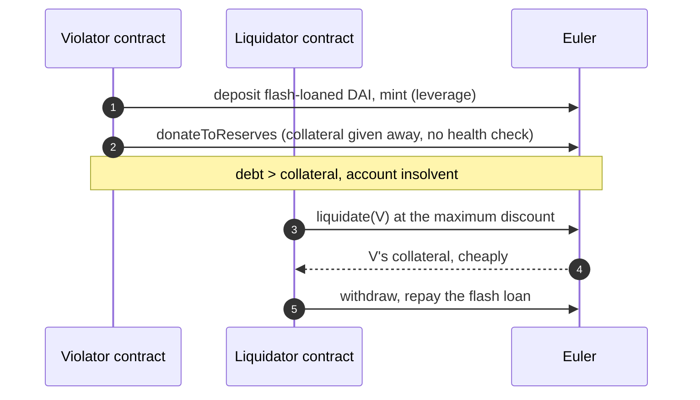
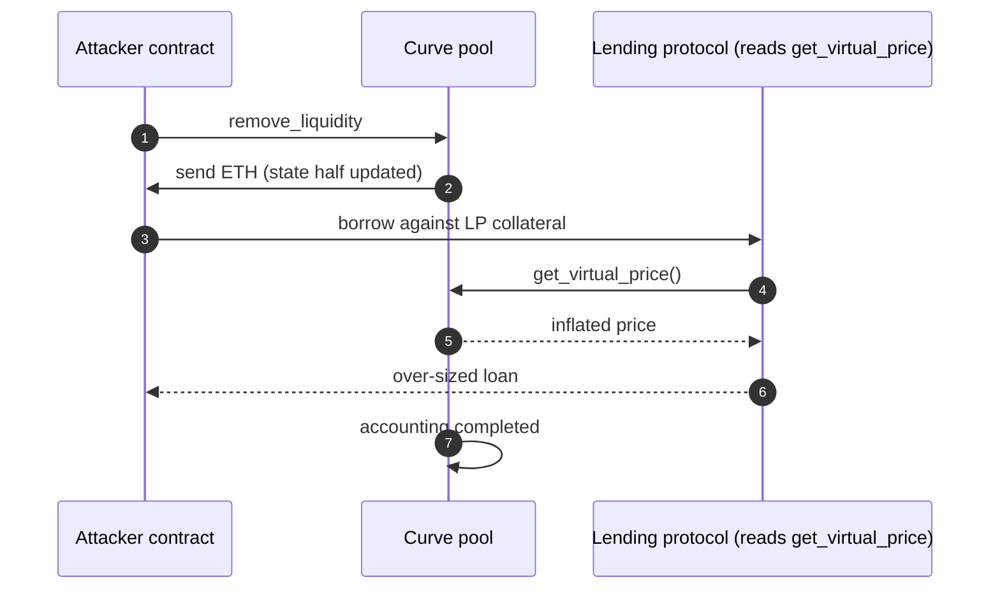

The [recap of the 2023 crypto hacks]({{site.url_complet}}/2026/10/07/crypto-hacks-2023/) names each incident's cause in a line: "a donation function without a health check", "a compiler bug in the reentrancy lock", "rounding at tick boundaries double-counted liquidity". This companion article explains those mechanisms for a developer who writes Solidity and knows how lending markets, AMMs and approvals work, but who has not taken each of these bugs apart.

It follows the [technical article on 2024]({{site.url_complet}}/2026/10/07/crypto-hacks-2024-technical-concepts/) and does not repeat what that one covers: Safe signing, upgrade initialisation, approval drains, empty Compound markets and spot-price oracles. 2023 adds different material. A lending protocol could be made insolvent on purpose, a compiler broke contracts that were correct in source, a pool's view function lied during a callback, an AMM's tick accounting counted liquidity twice, an oracle was read before it could be disputed, and Ethereum's block-building pipeline itself was exploited.

> This article has been made with the help of [Claude Code](https://claude.com/product/claude-code) and several custom skills

> **About the code.** The Solidity and Vyper snippets are simplified to show the mechanism. They are not the deployed code of the protocols named; read the linked post-mortems for the exact contracts.

[TOC]

## Lending accounting

### Making an account insolvent on purpose (Euler, ~$197M)

A lending protocol's core invariant is that every account's collateral, weighted by its collateral factor, covers its debt. Every function that can lower collateral or raise debt must end with that check:

```solidity
function withdraw(uint256 amount) external {
    _decreaseCollateral(msg.sender, amount);
    require(_isHealthy(msg.sender), "undercollateralised");   // the check every exit needs
}
```

Euler represented deposits with eTokens and debt with dTokens, and let a user `mint` both at once to build leverage. An upgrade added `donateToReserves`, which burned part of the caller's eTokens and credited them to the protocol's reserves. It was a way to lose collateral, and it had no health check:

```solidity
// Simplified
function donateToReserves(uint256 amount) external nonReentrant {
    eBalance[msg.sender] -= amount;
    reserveBalance += amount;
    // missing: require(_isHealthy(msg.sender));
}
```

The attack used two contracts ([Chainalysis](https://www.chainalysis.com/blog/euler-finance-flash-loan-attack/)):

1. **Violator.** Deposits a flash-loaned 20M DAI, uses `mint` to reach roughly ten times leverage, repays part, mints again, then calls `donateToReserves` to give away most of its eTokens. Its debt now exceeds its collateral.
2. **Liquidator.** Liquidates the violator. Euler's liquidation discount grew with how unhealthy the account was, up to 20%, so a deliberately insolvent account was very profitable to liquidate: the liquidator received the eTokens at a deep discount, and the protocol kept the bad debt.



Two lessons apply beyond Euler. Every new entry point needs the same invariant check as the old ones, and a liquidation incentive that grows with insolvency rewards whoever can create insolvency. The attacker returned all recoverable funds within three weeks.

### A withdrawal that forgot the debt (Platypus, ~$8.5M)

Platypus let LP-token holders borrow its USP stablecoin against their LP position. Its `emergencyWithdraw`, meant as an escape hatch from the staking contract, returned the LP tokens without checking that the user's USP debt was still covered:

```solidity
// Simplified
function emergencyWithdraw(uint256 pid) external {
    uint256 amount = userInfo[pid][msg.sender].amount;
    userInfo[pid][msg.sender].amount = 0;
    lpToken[pid].safeTransfer(msg.sender, amount);
    // missing: require(usp.debtOf(msg.sender) == 0 || _isSolvent(msg.sender));
}
```

With a flash loan, the attacker deposited LP tokens, borrowed the maximum USP against them, took the LP tokens back through `emergencyWithdraw`, and kept the USP. Emergency functions bypass normal paths by design, which is exactly why they need the invariants spelled out.

### A share price computed from the wrong asset (Yearn yUSDT, ~$11M)

A vault prices its shares as `totalAssets / totalSupply`. If `totalAssets` is wrong, so is every deposit and withdrawal. Yearn's 2020 yUSDT vault, immutable and long superseded, held part of its funds through a lending integration whose address pointed at the iUSDC token instead of iUSDT. It therefore valued that position wrongly: after the attacker withdrew most of the vault's real holdings and triggered a rebalance into the misconfigured position, the vault valued itself at almost nothing.

A tiny deposit then minted an enormous number of shares, about 1.25 quadrillion yUSDT for roughly $10k, which the attacker swapped out through Curve pools that still held yUSDT ([Rekt](https://rekt.news/yearn2-rekt/)). The same arithmetic as the empty-market attack described in the [2024 article]({{site.url_complet}}/2026/10/07/crypto-hacks-2024-technical-concepts/), reached through a misconfiguration nobody could fix because the contract could not be upgraded.

## Reentrancy beyond the contract

### A compiler that broke correct code (Curve pools, ~$70M)

Curve's older pools are written in Vyper. A function marked `@nonreentrant("lock")` takes a lock stored in contract storage; every function marked with the same key is supposed to share it, so none of them can be entered while another is running:

```python
# Vyper, simplified
@external
@nonreentrant("lock")
def remove_liquidity(_amount: uint256, _min_amounts: uint256[2]) -> uint256[2]:
    # ... compute amounts, update pool balances
    raw_call(msg.sender, b"", value=eth_amount)   # sends ETH: runs the caller's fallback
    # ... finish the accounting (LP supply)
    return amounts

@external
@payable
@nonreentrant("lock")
def add_liquidity(_amounts: uint256[2], _min_mint_amount: uint256) -> uint256:
    # ... mints LP tokens from the current balances and LP supply
```

In Vyper 0.2.15, 0.2.16 and 0.3.0, the compiler allocated a **separate** storage slot for the lock of each function, even when they used the same key ([Vyper post-mortem](https://hackmd.io/@vyperlang/HJUgNMhs2)). `remove_liquidity` took its own lock, sent ETH, and while the attacker's fallback ran, `add_liquidity` checked a different, unlocked slot and executed against pool state that `remove_liquidity` had not finished updating. LP tokens were minted at a wrong rate and redeemed for more than they were worth.

The source code was correct; the bytecode was not. Audits that read source could not find it, and the bug sat in pools deployed years earlier. JPEG'd, Alchemix, Metronome and Curve's CRV/ETH pool lost about $70M on 30 July, and whitehats recovered about 70% of it.

### Read-only reentrancy (dForce, ~$3.65M; Sentiment, ~$1M)

Reentrancy guards protect state-changing functions. View functions are usually left unguarded, and that is the gap read-only reentrancy uses: during a callback, a pool's view can return a value computed from half-updated state.

Curve's `get_virtual_price()` returns the value of one LP token, roughly `D / totalSupply`, where `D` reflects the pool's balances. During `remove_liquidity` with ETH, the pool sends ETH before its accounting is consistent, so a view called from the receiver's fallback can see an inflated LP price. A protocol that uses `get_virtual_price` as an oracle for LP collateral, as dForce did, will overvalue that collateral for the duration of the callback:



dForce lost $3.65M this way in February (returned for a bounty), and Sentiment about $1M in April through the equivalent situation in a Balancer pool. The defence is to check, before reading the view, that the pool is not mid-operation: call a function protected by the same lock (Curve's guidance), or use Balancer's `ensureNotInVaultContext` helper.

## AMM mathematics

### Ticks and the liquidity that was counted twice (KyberSwap Elastic, ~$48M to ~$55M)

KyberSwap Elastic was a concentrated-liquidity AMM, like Uniswap v3. Liquidity providers choose a price range, ranges are delimited by *ticks*, and the pool keeps a single number, the active liquidity, for the current price. When a swap moves the price across a tick, the pool adds or removes the liquidity of the positions that start or end there:

```solidity
// Simplified swap loop of a concentrated-liquidity pool
while (amountRemaining != 0) {
    (uint160 sqrtPNext, uint256 used) =
        computeSwapStep(sqrtP, sqrtPAtNextTick, activeLiquidity, amountRemaining);
    sqrtP = sqrtPNext;
    amountRemaining -= used;
    if (sqrtP == sqrtPAtNextTick) {
        activeLiquidity = _crossTick(nextTick, activeLiquidity); // add or remove liquidity
        nextTick = _nextInitializedTick(...);
    }
}
```

The loop is correct only if "the price reached the next tick" and "the tick was crossed" always happen together. KyberSwap added a reinvestment curve, which compounds fees into liquidity, and the amount needed to reach the tick was rounded in the wrong direction.

With carefully chosen amounts, the attacker made a swap push the price just past a tick boundary **without** the pool registering the crossing, so the liquidity of that tick was not updated. A reverse swap then crossed the same boundary in the other direction and applied the liquidity change again: the liquidity was counted twice ([KyberSwap post-mortem](https://blog.kyberswap.com/post-mortem-kyberswap-elastic-exploit/), [BlockSec analysis](https://blocksec.com/blog/kyberswap-incident-masterful-exploitation-of-rounding-errors-with-exceedingly-subtle-calculations)). With inflated active liquidity, swaps returned more tokens than the pool held for that range, and pools on six chains were drained.

It is the most mathematically demanding exploit of the year. The general lesson is simpler: when two values must change together, compute one from the other, and make every rounding favour the pool.

### A rebalance anyone could sandwich (Jimbos, ~$7.5M)

Jimbos managed protocol-owned liquidity and rebalanced it into new price ranges through a function anyone could trigger, with no slippage limit. The attacker moved the pool price with a flash loan, triggered the rebalance so the protocol added its liquidity at the manipulated price, and swapped back against it. A protocol trade without a minimum output is a trade at whatever price the attacker sets, the same lesson as spot-price oracles.

## Oracles that could be read too early (BonqDAO)

An *optimistic* oracle such as Tellor accepts a value from any staked reporter and relies on a dispute window: if the value is wrong, someone disputes it and the reporter loses its stake. The design works only if consumers wait for the window to pass.

BonqDAO read the newest Tellor value immediately. Reporting required staking only 10 TRB, a few hundred dollars at the time, so the attacker:

1. reported an enormous price for WALBT, used it as collateral and minted 100M BEUR;
2. reported a tiny price a few minutes later and liquidated other users' troves.

The nominal loss was about $120M, but the BEUR could not be sold at face value, and the realised loss was under $2M. The fix is to read a value old enough to have survived disputes, for example Tellor's `getDataBefore(queryId, block.timestamp - delay)`, and to bound how far a price may move between reads.

## Infrastructure below the contracts

### MEV-Boost and the relay that revealed a block (~$25M)

On Ethereum, block building is split between *builders*, who assemble profitable blocks, and *proposers* (validators), who sign them, through *relays* such as MEV-Boost relays. The relay holds a block's contents until the proposer has signed its header, so the proposer cannot steal the transactions it commits to.

In April 2023, a relay released block contents to a proposer in exchange for a signed header **without checking that the signature was valid**. The attackers, running their own validators, first lured sandwich bots with bait transactions, then, when it was their turn to propose, obtained the block contents with an invalid header signature, rewrote the block so the bots' purchases executed against the attackers' trades, and took about $25M from the bots. US prosecutors later charged two brothers over the scheme. The relay was patched within hours. It is a reminder that "the blockchain" includes off-chain components whose checks are part of its security.

### A library loaded at "latest" (Ledger Connect Kit, ~$600k)

Many dApps loaded Ledger's Connect Kit through a small loader that fetched the newest version from a CDN at runtime. In December 2023, an attacker phished a former Ledger employee whose npm publishing token had never been revoked, and published versions 1.1.5 to 1.1.7 containing a wallet drainer. For a few hours, every dApp using the loader served the drainer to its users ([Ledger report](https://www.ledger.com/blog/security-incident-report)). The defences are ordinary software hygiene that front ends often skip: pin dependency versions, use Subresource Integrity for scripts loaded from CDNs, and revoke credentials when people leave.

### Threshold keys with one operator (Multichain, ~$126M)

Multichain's bridge used MPC: each vault's key was split into shares held by several nodes, so no single node could sign. That protects against one compromised node, not against one person controlling all of them. After the CEO's arrest in May, the team said he controlled the servers, and in July the vaults were emptied. A threshold scheme is only as decentralised as the parties who operate the shares, the same point the 2024 article makes about multisig thresholds.

## Small logic bugs with real losses

- **Duplicate claims (Level Finance, ~$1.1M).** A referral contract's `claimMultiple(epochs[])` paid each epoch in the array without checking for repeats, so the same epoch could be claimed many times in one call. Batch functions need the same uniqueness checks as their single-item versions.
- **An unvalidated market address (Exactly, ~$7.2M).** `DebtManager.leverage()` accepted a market address from the caller; the attacker passed its own contract, which let it bypass the permit check and move victims' collateral. It is the approval-drain class described in the [2024 article]({{site.url_complet}}/2026/10/07/crypto-hacks-2024-technical-concepts/).
- **Empty markets (Hundred Finance, ~$7.4M).** The same donation-and-rounding attack on a Compound v2 fork that hit Sonne a year later.

## Summary: from incident to concept

| Incident (2023) | Concept | Section |
|-----------------|---------|---------|
| Euler | Missing health check, liquidation discount rewarding insolvency | Lending accounting |
| Platypus | Emergency withdrawal ignoring debt | Lending accounting |
| Yearn yUSDT | Share price from a misconfigured asset | Lending accounting |
| Curve pools (Vyper) | Compiler allocated one lock per function | Reentrancy |
| dForce, Sentiment | Read-only reentrancy through a pool's view | Reentrancy |
| KyberSwap | Rounding at a tick boundary, liquidity counted twice | AMM mathematics |
| Jimbos | Protocol rebalance without slippage control | AMM mathematics |
| BonqDAO | Optimistic oracle read before its dispute window | Oracles |
| MEV bots | Relay revealed a block for an invalid signature | Infrastructure |
| Ledger Connect Kit | Library loaded at "latest", unrevoked npm token | Infrastructure |
| Multichain | MPC shares under one operator | Infrastructure |
| Level, Exactly, Hundred | Duplicate claims, unvalidated address, empty market | Small logic bugs |

## Conclusion

The 2023 hacks add a set of mechanisms to those of 2024:

- **Invariants must hold on every path**: Euler's donation and Platypus' emergency withdrawal each skipped the solvency check that the main paths enforced.
- **Security can fail below the source code**: Vyper's compiler broke reentrancy locks in contracts that were correct as written.
- **View functions are inputs to other protocols**, and read-only reentrancy makes them lie during callbacks.
- **AMM accounting depends on rounding direction** and on paired updates staying paired, as KyberSwap's tick bug showed.
- **Optimistic oracles are safe only after their dispute window.**
- **Off-chain infrastructure is part of the attack surface**: block relays, CDN-loaded libraries and the people who operate MPC shares.


## Annex

### Key Terms

| Term | Definition |
|------|------------|
| **Health check** | The verification that an account's weighted collateral covers its debt after an action. |
| **eToken / dToken** | Euler's tokens representing an account's deposits and debt. |
| **Liquidation discount** | The bonus a liquidator receives; Euler's grew with the account's insolvency. |
| **Self-liquidation** | Liquidating one's own deliberately insolvent position from a second address to capture the discount. |
| **Emergency withdrawal** | An escape-hatch function that skips normal checks, and needs its own solvency check. |
| **Share price** | `totalAssets / totalSupply` of a vault; wrong if either side is wrong. |
| **`@nonreentrant`** | Vyper's reentrancy lock, keyed by name and meant to be shared by all functions using the key. |
| **Read-only reentrancy** | Calling a view function during another contract's callback, when its state is temporarily inconsistent. |
| **`get_virtual_price`** | Curve's view returning the value of one LP token, used by other protocols as an oracle. |
| **Tick** | A price boundary in a concentrated-liquidity AMM where position liquidity starts or ends. |
| **Active liquidity** | The liquidity available at the current price, updated each time a tick is crossed. |
| **Reinvestment curve** | KyberSwap Elastic's mechanism compounding fees into liquidity, which interacted with the rounding bug. |
| **Optimistic oracle** | An oracle that accepts reported values unless disputed within a window, such as Tellor. |
| **Dispute window** | The period during which an optimistic oracle's value can be challenged; consumers should wait it out. |
| **Proposer-builder separation** | Ethereum's split between builders who assemble blocks and proposers who sign them. |
| **MEV-Boost relay** | The intermediary that holds a builder's block until the proposer signs its header. |
| **Subresource Integrity (SRI)** | A browser check that a script loaded from a CDN matches an expected hash. |
| **MPC wallet** | A wallet whose key is split into shares held by several parties, which jointly sign. |

### Security Implementation Checklist

#### Lending and vaults

| Check | Security requirement | Failure mode if violated |
|:---:|------------|------------|
| ☐ | Every function that lowers collateral or raises debt ends with the solvency check. | An account is made insolvent on purpose (Euler). |
| ☐ | Liquidation incentives are capped so that creating insolvency is not profitable. | Self-liquidation captures the discount (Euler). |
| ☐ | Emergency and admin paths enforce the same debt invariants as normal paths. | Collateral is withdrawn while debt remains (Platypus). |
| ☐ | Vault accounting addresses are validated against the asset they must represent. | Share price collapses and shares are minted cheaply (Yearn yUSDT). |

#### Reentrancy and oracles

| Check | Security requirement | Failure mode if violated |
|:---:|------------|------------|
| ☐ | The compiler version is checked against known compiler bugs, and critical locks are tested at bytecode level. | Locks that look shared in source are not (Vyper). |
| ☐ | Prices read from another protocol's view are only read when that protocol is not mid-operation. | Read-only reentrancy inflates collateral value (dForce, Sentiment). |
| ☐ | Optimistic oracle values are read only after their dispute window, with bounds on price changes. | A cheaply reported price mints or liquidates (BonqDAO). |
| ☐ | Paired AMM state updates are derived from each other, and rounding always favours the pool. | Liquidity is counted twice (KyberSwap). |
| ☐ | Protocol-initiated swaps and rebalances enforce a minimum output. | The protocol trades at a manipulated price (Jimbos). |

#### Infrastructure

| Check | Security requirement | Failure mode if violated |
|:---:|------------|------------|
| ☐ | Front-end dependencies are pinned and CDN scripts use Subresource Integrity. | A compromised library version runs in every dApp (Ledger Connect Kit). |
| ☐ | Publishing tokens and credentials are revoked when people leave. | A former employee's access is phished (Ledger). |
| ☐ | MPC or multisig shares are operated by independent parties. | One person controls all the shares (Multichain). |
| ☐ | Batch functions reject duplicate items. | The same reward is claimed repeatedly (Level Finance). |

## Frequently Asked Questions

**Q: Why was `donateToReserves` dangerous if it only gave money away?**

Because giving collateral away is the same, for solvency, as withdrawing it. Without a health check, the attacker could make its own account insolvent on purpose. Euler's liquidation discount, which grew with insolvency, then let a second attacker contract liquidate that account and take the collateral cheaply, leaving the bad debt to the protocol.

**Q: How could Curve pools be exploited if their code used reentrancy locks correctly?**

The Vyper source declared one shared lock, but three compiler versions placed each function's lock in its own storage slot. `remove_liquidity` took its lock and sent ETH; the attacker's fallback called `add_liquidity`, whose separate lock was free, and minted LP tokens from half-updated state. Only the bytecode was wrong.

**Q: What is read-only reentrancy, and why does a reentrancy guard on the pool not prevent it?**

The pool's guard protects its state-changing functions, but views such as `get_virtual_price` are unguarded. During a callback, the pool's state is temporarily inconsistent and the view returns a wrong value. The victim is a different protocol that reads that view as a price; the defence is for that protocol to check the pool is not mid-operation before reading it.

**Q: In simple terms, what went wrong at KyberSwap?**

A swap is supposed to update the active liquidity exactly when the price crosses a tick. Because of rounding in the wrong direction, the attacker could move the price just past a tick without the pool recording the crossing, and then cross it back with the liquidity change applied a second time. The pool believed it had twice the liquidity it had, and swaps paid out accordingly.

**Q: Why did BonqDAO's nominal $120M loss realise less than $2M?**

The attacker minted 100M BEUR against a fake price, but BEUR had little liquidity; selling it crashed its price. The second step, liquidating other users with a near-zero price, gave the attacker collateral tokens whose value also collapsed. The damage to users was real, but the attacker could not convert most of it into other assets.

**Q: Combining the MEV-Boost and Ledger cases, what do they say about trust outside smart contracts?**

Both systems worked as designed on-chain:

- the MEV-Boost relay, an off-chain service, skipped one signature check and revealed blocks it should have held back;
- the Ledger loader, a front-end convention, ran whatever version the CDN served, and an unrevoked publishing token decided what that was.

Security reviews that stop at the contracts miss both; the checklist above covers the off-chain parts a dApp depends on.

## References

### Official post-mortems

- [Vyper: post-mortem of the reentrancy lock bug](https://hackmd.io/@vyperlang/HJUgNMhs2)
- [KyberSwap: post-mortem of the Elastic exploit](https://blog.kyberswap.com/post-mortem-kyberswap-elastic-exploit/)
- [Ledger: security incident report](https://www.ledger.com/blog/security-incident-report)
- [Sentiment: post-mortem](https://hackmd.io/@sentimentxyz/SJCySo1z2)

### Technical analyses

- [Chainalysis: Euler Finance flash loan attack](https://www.chainalysis.com/blog/euler-finance-flash-loan-attack/)
- [BlockSec: KyberSwap incident, masterful exploitation of rounding errors](https://blocksec.com/blog/kyberswap-incident-masterful-exploitation-of-rounding-errors-with-exceedingly-subtle-calculations)
- [SlowMist: a deep dive into the KyberSwap hack](https://slowmist.medium.com/a-deep-dive-into-the-kyberswap-hack-3e13f3305d3a)
- [Immunefi: hack analysis, BonqDAO, February 2023](https://immunefi.com/blog/bug-fix-reviews/hack-analysis-bonqdao-february-2023/)
- [Halborn: explained, the MEV bots hack (April 2023)](https://halborn.com/blog/post/explained-the-mev-bots-hack-april-2023)
- [Euler - Rekt](https://rekt.news/euler-rekt/), [Curve/Vyper - Rekt](https://rekt.news/curve-vyper-rekt/), [dForce - Rekt](https://rekt.news/dforce-network-rekt/), [Platypus - Rekt](https://rekt.news/platypus-finance-rekt/), [Yearn - Rekt 2](https://rekt.news/yearn2-rekt/), [KyberSwap - Rekt](https://rekt.news/kyberswap-rekt/), [Jimbos - Rekt](https://rekt.news/jimbo-rekt/), [BonqDAO - Rekt](https://rekt.news/bonq-rekt/), [Level Finance - Rekt](https://rekt.news/level-finance-rekt/), [Exactly - Rekt](https://rekt.news/exactly-protocol-rekt/), [Multichain - Rekt 2](https://rekt.news/multichain-rekt2/)

### Standards and tools

- [Vyper documentation](https://docs.vyperlang.org/)
- [Claude Code](https://claude.com/product/claude-code)

### Related articles

- [Compound V2 Overview]({{site.url_complet}}/2024/08/27/compound-protocol-v2/)
- [How to build a blockchain oracle]({{site.url_complet}}/2024/04/16/build-blockchain-oracle/)
- [Security of Cryptocurrency Exchanges - Overview]({{site.url_complet}}/2025/11/06/crypto-exchange-security-overview/)
- [Cross-Chain Bridge Hacks - Ten Incidents, Five Failure Classes]({{site.url_complet}}/2026/07/31/cross-chain-bridge-hacks/)
