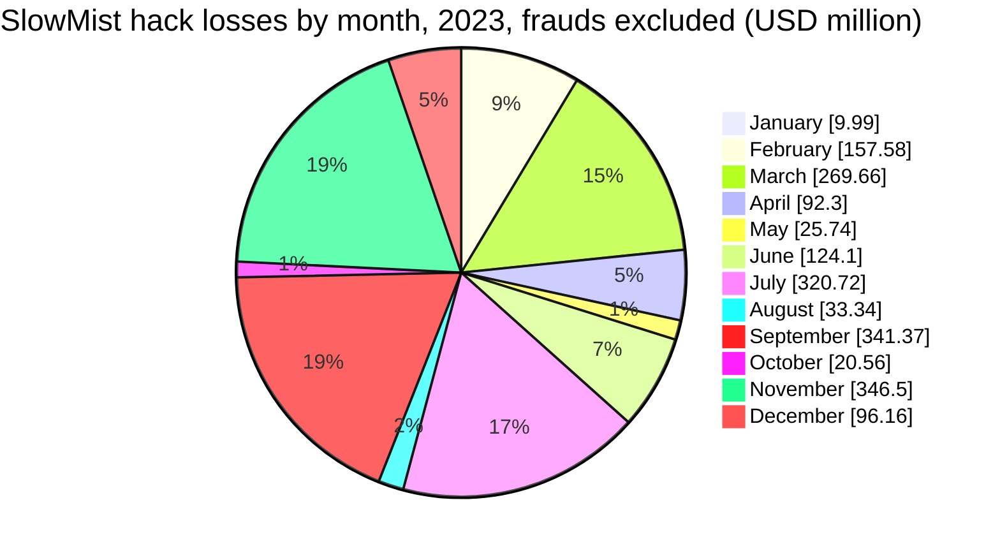
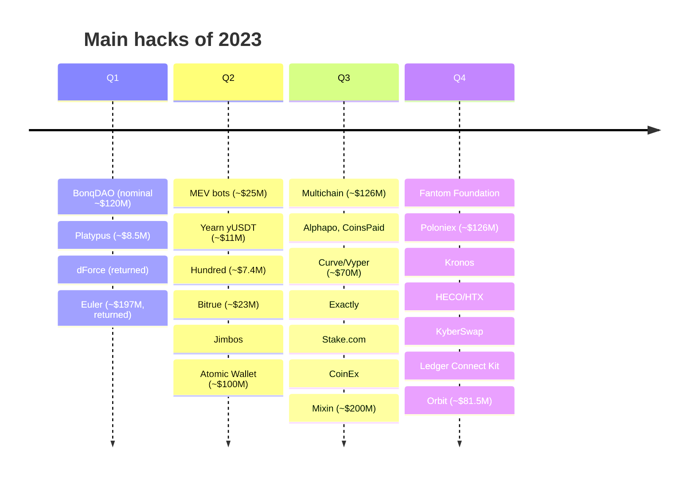
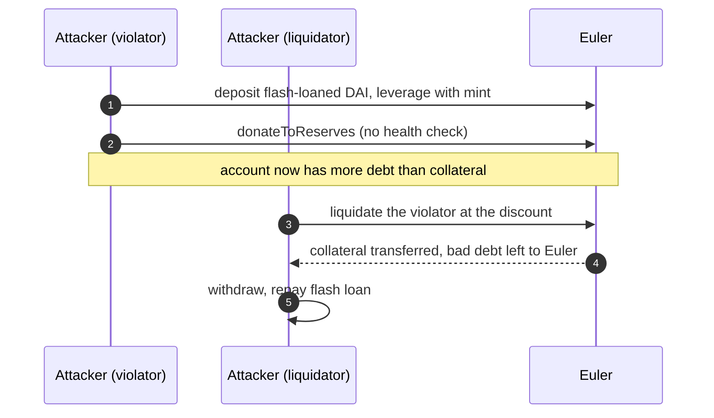
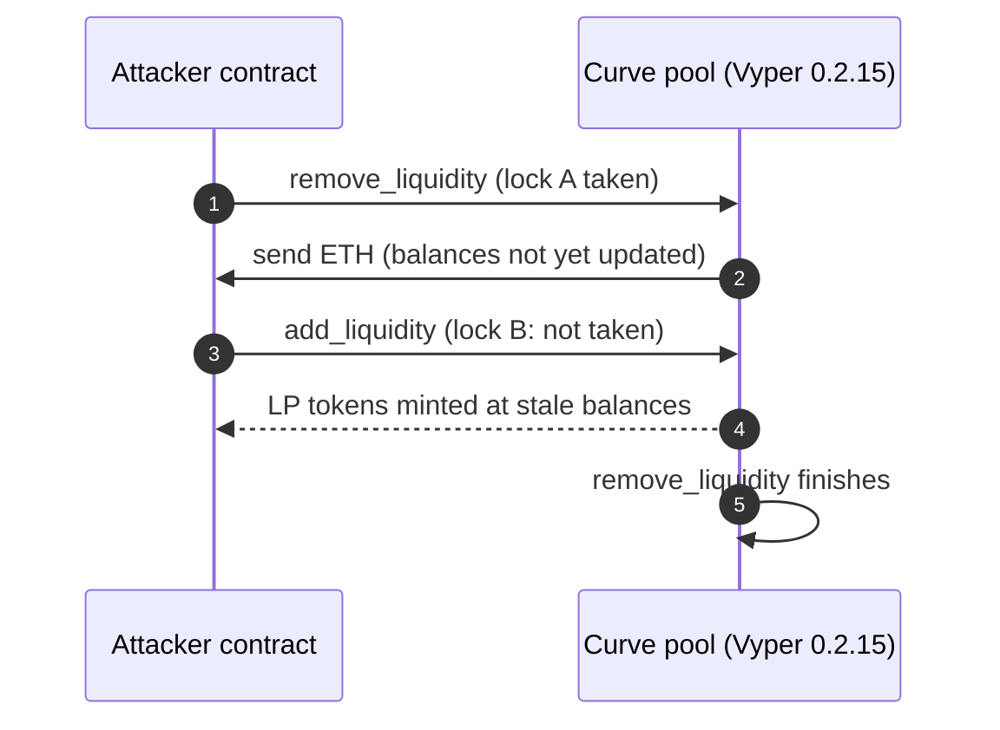

In 2023, attackers stole about $1.7B from crypto platforms and users, according to both Chainalysis and TRM Labs, less than half of 2022's record of about $3.7B. The largest incidents were spread across very different targets. Mixin Network lost ~$200M through its cloud provider's database, Euler Finance ~$197M through a lending bug (all of it later returned), Poloniex ~$126M from its hot wallets, and Multichain ~$126M from bridge vaults its arrested CEO controlled. A compiler bug in Vyper also drained several Curve pools in a single day.

North Korea had its busiest year by number of thefts. The FBI named the Lazarus Group for Atomic Wallet, Alphapo, CoinsPaid and Stake.com, and the UN Panel of Experts investigated 17 heists worth more than $750M. This article reviews the year with the method of the site's other recaps in the `crypto-hacks` series: statistics computed from the [SlowMist Hacked](https://hacked.slowmist.io/) database, the trackers' annual figures, [Rekt News](https://rekt.news/), the analytics firms' reports and official statements. Frauds, which SlowMist lists next to hacks, are kept out of the totals and covered in their own section. A companion article, [The Technical Concepts Behind the 2023 Crypto Hacks]({{site.url_complet}}/2026/10/07/crypto-hacks-2023-technical-concepts/), explains the mechanisms for Solidity developers.

> This article has been made with the help of [Claude Code](https://claude.com/product/claude-code) and several custom skills

[TOC]

## Scope, sources and caveats

The article covers incidents from 1 January to 31 December 2023. No Telegram export of the CryptoAlertHack channel was available for that year. Four caveats apply to the figures:

- **Frauds are not hacks.** SlowMist's 2023 list includes exchange frauds and Ponzi schemes such as JPEX (~$194M), a South Korean "blockchain for dog nose wrinkles" Ponzi (~$127M) and the Solar Techno Alliance (~$120M). They are excluded from every hack total here and listed in [Frauds and scams](#frauds-and-scams).
- **Trackers count differently.** Chainalysis counts hacks only; CertiK's $1.84B includes scams; PeckShield's $2.61B and SlowMist's report ($2.49B) include scams and frauds; TRM's $1.7B runs to the end of November.
- **Nominal values inflate some incidents.** BonqDAO's ~$120M is the paper value of tokens minted against a manipulated price; less than $2M was realised. BALD's ~$25.6M is a valuation at peak, of which 1,034 ETH was withdrawn.
- **USD values are approximate** and written with "about" or "~". Several incidents have estimates that differ by tens of millions (Atomic Wallet: ~$65M to ~$129M).

## 2023 in numbers

### The annual figures

| Source | Stolen (approx. USD) | Incidents | Notable split |
|--------|--:|--:|---------------|
| [Chainalysis](https://www.chainalysis.com/blog/crypto-hacking-stolen-funds-2024/) | $1.7B | 231 | DeFi ~$1.1B (64%); North Korea ~$1.0B in 20 incidents, later revised to ~$660.5M |
| [TRM Labs](https://www.trmlabs.com/post/hack-hauls-halve-from-2022) | $1.7B (to end of November) | 160 | Key and seed-phrase compromise ~58–60%; top ten hacks ~70% |
| [CertiK Hack3d](https://www.certik.com/resources/blog/hack3d-the-web3-security-report-2023) | $1.84B (incl. scams) | 751 | Private key compromise ~$881M in 47 incidents; median loss ~$101k |
| [Immunefi](https://immunefi.com/blog/research/immunefi-crypto-losses-report-2023/) | $1.70B hacks (+ $103.4M fraud) | 247 hacks | DeFi 77.3%; Lazarus ~$308.6M |
| [PeckShield](https://x.com/PeckShieldAlert/status/1751788344281886726) | $1.51B hacks (+ $1.1B scams) | 600+ | Excludes Multichain; ~$674.9M recovered |
| [SlowMist report](https://kyt.slowmist.com/blog/2023-blockchain-security-and-anti-money-laundering-annual-report/) | $2.49B (incl. frauds; ~$1.84B without) | 464 | Wallet drainers ~$295M from ~324,000 victims |

North Korea's share is the most uncertain number of the year:

- **UN Panel of Experts:** more than $750M across 17 heists it [investigated](https://documents.un.org/doc/undoc/gen/n24/032/68/pdf/n2403268.pdf).
- **TRM Labs:** at least $600M, possibly ~$700M, about a third of all stolen funds, with North Korean hacks averaging ten times the damage of others ([TRM](https://www.trmlabs.com/post/north-korean-hackers-stole-600-million-in-crypto-in-2023)).
- **Chainalysis:** ~$1.0B in 20 incidents in its January 2024 report, revised to ~$660.5M a year later.
- **Immunefi:** ~$308.6M, counting only incidents attributed at the time.

### Month by month

PeckShield's figures come from the monthly strip of its annual infographic and count hacks only (they add up to its $1.51B); CertiK's combine hacks and scams from its monthly reports; SlowMist's are computed from the database without frauds.

| Month | PeckShield | CertiK | SlowMist hacks | SlowMist loss | Largest hack |
|-------|--:|--:|--:|--:|------|
| January | ~$20.9M | ~$28.0M | 19 | ~$10.0M | LendHub |
| February | ~$38.2M | ~$51.5M | 22 | ~$157.6M (BonqDAO nominal) | BonqDAO, Platypus |
| March | ~$217.1M | ~$240.5M | 27 | ~$269.7M | Euler Finance (returned) |
| April | ~$91.5M | ~$103.7M | 21 | ~$92.3M | MEV bots, Bitrue, Yearn |
| May | ~$20.2M | ~$59.8M | 35 | ~$25.7M | Jimbos |
| June | ~$93.2M | n/a | 25 | ~$124.1M | Atomic Wallet |
| July | ~$173.6M (excl. Multichain) | ~$303M | 37 | ~$320.7M | Multichain, Alphapo, Curve/Vyper |
| August | ~$17.3M | ~$45.9M | 25 | ~$33.3M | Exactly, Steadefi |
| September | ~$339.2M | ~$332M | 47 | ~$341.4M | Mixin, CoinEx, Stake.com |
| October | ~$33.3M | ~$32.3M | 32 | ~$20.6M | Fantom Foundation |
| November | ~$364.4M | ~$363.4M | 24 | ~$346.5M | Poloniex, HECO/HTX, KyberSwap |
| December | ~$99.2M | ~$116.5M | 24 | ~$96.2M | Orbit bridge (31 December) |

The three trackers agree on the shape: September and November were the worst months, driven by exchange and bridge thefts in the second half, while the first half was dominated by DeFi (Euler).

### The largest incidents

| Rank | Date | Incident | Category | Reported loss (approx. USD) | Root cause (summary) |
|:---:|------|----------|----------|--:|----------------------|
| 1 | 23 Sep | Mixin Network | Custodial wallet / cross-chain | $200M | Cloud provider's database breached, exposing hot-wallet assets |
| 2 | 13 Mar | Euler Finance | DeFi lending | $197M (returned) | `donateToReserves` without a health check, then self-liquidation |
| 3 | 10 Nov | Poloniex | CEX | $114M to $130M | Hot-wallet private keys compromised |
| 4 | 6 Jul | Multichain | Cross-chain bridge | $126M | MPC vault assets moved while the CEO, who held the keys, was in custody |
| 5 | 22 Nov | HECO bridge and HTX | Bridge and CEX | $99M to $113M | Bridge operator key and HTX hot-wallet keys compromised |
| 6 | 2 Jun | Atomic Wallet | Non-custodial wallet | $65M to $129M | About 5,500 wallets drained; cause never confirmed; Lazarus (FBI) |
| 7 | 31 Dec | Orbit bridge | Cross-chain bridge | $81.5M | 7 of 10 multisig signer keys compromised |
| 8 | 30 Jul | Curve pools (Vyper) | DEX | $69M to $74M (~70% recovered) | Vyper compiler bug broke reentrancy locks |
| 9 | 22 Jul | Alphapo | Payments | $60M | Hot wallets drained; Lazarus (FBI) |
| 10 | 12 Sep | CoinEx | CEX | $43M to $70M | Hot-wallet private key leaked |
| 11 | 22 Nov | KyberSwap Elastic | DEX | $48M to $55M | Rounding at tick boundaries double-counted liquidity |
| 12 | 4 Sep | Stake.com | Crypto casino | $41M | Hot wallets drained; Lazarus (FBI) |
| 13 | 22 Jul | CoinsPaid | Payments | $37.3M | Employee ran malware in a fake job interview; Lazarus (FBI) |
| 14 | 18 Nov | Kronos Research | Market maker | $26M | API keys compromised |
| 15 | 1 Feb | BonqDAO | DeFi (CDP) | $120M nominal, < $2M realised | Tellor oracle price pushed with a 10 TRB stake |

### Statistics from the SlowMist database

Computed from the 2023 entries of the SlowMist Hacked database, before recoveries, after removing one duplicate row and 127 frauds (scams, Ponzi schemes and rug pulls), which are not counted as hacks:

- **338 incidents**, of which 210 have a stated loss, for **~$1.84B**. With frauds, the figure would be ~$2.48B, close to SlowMist's own report.
- **Median loss: ~$721k.** Seven incidents of $100M or more make up about 54% of the total; another 21 between $10M and $100M add 33%.
- **Some entries overlap.** SlowMist counts Euler (~$197M) and Angle Protocol (~$17.6M, its deposit in Euler) separately, and BonqDAO at its nominal ~$120M; the database total overstates the year's realised hack losses by roughly $135M for those two reasons alone.

| Size band | Incidents | Loss (approx. USD) | Share of loss |
|---|--:|--:|--:|
| ≥ $100M | 7 | $986.3M | 53.7% |
| $10M to $100M | 21 | $614.0M | 33.4% |
| $1M to $10M | 64 | $199.6M | 10.9% |
| $100k to $1M | 79 | $36.7M | 2.0% |
| < $100k | 39 | $1.4M | 0.1% |
| Not stated | 128 | n/a | n/a |

| Category | Incidents | Loss (approx. USD) | Share of loss |
|---|--:|--:|--:|
| Other / unknown | 81 | $606.8M | 33.0% |
| Smart contract vulnerability | 102 | $433.4M | 23.6% |
| Cross-chain bridge / sidechain | 16 | $339.3M | 18.5% |
| Key / infrastructure compromise | 37 | $297.5M | 16.2% |
| Oracle / price manipulation | 21 | $146.1M | 8.0% |
| Phishing / account takeover | 76 | $9.2M | 0.5% |
| Governance attack | 5 | $5.6M | 0.3% |

The category comes from the database's attack method, then from the target and description when the method is generic. "Other / unknown" is large because SlowMist filed several of the year's biggest thefts with an "Unknown" method (Mixin, Poloniex, Atomic Wallet, CoinsPaid), although all of them were key or infrastructure compromises; moved there, that row would hold about half of the losses.

## The two largest incidents

### Mixin Network (~$200M, September)

On 23 September, the database of the cloud service provider Mixin used was breached, and the attacker took about $200M of assets held in Mixin's hot wallets ([Mixin statement](https://twitter.com/MixinKernel/status/1706139175018529139)). Mixin brought in Google and SlowMist to investigate, refunded users 50% of their losses and paid the rest in bond tokens, and offered a $20M bounty for the return of the funds. [Elliptic](https://www.elliptic.co/insights/mixin-network-hacked-for-200-million/) covered the theft; no official attribution followed, and asset-level tallies suggest a figure closer to ~$141M than Mixin's $200M.

### Euler Finance (~$197M, March, returned)

Euler was a lending protocol whose eTokens represented deposits and dTokens debt. An upgrade (EIP-14) had added `donateToReserves`, which let a user give part of their deposit to the protocol's reserves, and it did not check the account's health afterwards. The attacker combined it with Euler's leverage function and its liquidation discount ([Chainalysis](https://www.chainalysis.com/blog/euler-finance-flash-loan-attack/), [Rekt](https://rekt.news/euler-rekt/)):

1. A flash loan of DAI was deposited and leveraged with Euler's `mint`, creating large matching eToken and dToken balances.
2. `donateToReserves` gave away most of the eTokens, leaving the account with more debt than collateral, which the missing health check allowed.
3. A second contract liquidated the now-insolvent account; Euler's liquidation discount let it take the collateral cheaply, and the protocol was left with the bad debt.

The attacker returned all recoverable funds between 18 March and 3 April, worth about $240M at later prices. Angle Protocol, which had ~$17.6M deposited in Euler, was exposed through that deposit.

## North Korea's busiest year

North Korean groups carried out the year's most frequent large thefts, against custodial services rather than DeFi. [Elliptic](https://www.elliptic.co/blog/how-the-lazarus-group-is-stepping-up-crypto-hacks-and-changing-its-tactics) counted about $240M taken by Lazarus in 104 days in mid-2023, and the FBI named the group publicly twice:

- **Atomic Wallet (2 June, ~$100M).** About 5,500 wallets of a non-custodial wallet app were drained; Atomic [never confirmed the cause](https://atomicwallet.io/blog/articles/june-3rd-event-statement). The FBI attributed it to Lazarus (TraderTraitor) on 22 August.
- **Alphapo (22 July, ~$60M) and CoinsPaid (22 July, ~$37.3M).** Two payment processors lost hot-wallet funds the same day. CoinsPaid described a six-month campaign that ended with an employee running malware during a fake job interview, after which the attackers sent authorised withdrawals.
- **Stake.com (4 September, ~$41M).** The casino's hot wallets on Ethereum, BSC and Polygon were drained; the FBI attributed it to Lazarus on 6 September and put North Korea's 2023 thefts at more than $200M so far.
- **CoinEx, Poloniex, HECO/HTX, Orbit.** Attributed by the UN Panel of Experts and analysts (Elliptic for CoinEx, through an address shared with Stake), not by the FBI.

The pattern is the one the site's [2024 recap]({{site.url_complet}}/2026/10/07/crypto-hacks-2024/) found at larger scale: hot wallets and the people who operate them, reached through social engineering such as fake recruiters.

## Bridges and custody

- **Multichain (6 July, ~$126M).** Assets in the bridge's MPC vaults on Fantom, Moonriver and Dogechain were moved to unknown wallets. The CEO, who controlled the keys, had been in Chinese police custody since 21 May; Chainalysis called it a "possible hack or rug pull", and PeckShield excludes it from its hack total as an unauthorised withdrawal. Circle and Tether froze about $65M.
- **HECO bridge and HTX (22 November, ~$99M to ~$113M).** The bridge operator's key and HTX hot-wallet keys were compromised; the bridge's Ethereum vault was emptied. HTX had already lost ~$8M from a hot wallet on 24 September, returned for a 250 ETH bounty.
- **Orbit bridge (31 December, ~$81.5M).** Seven of ten multisig keys were compromised; Ozys, Orbit's developer, alleges that its former security chief weakened the firewall before leaving. It is counted in 2023 here, as by SlowMist and the UN, and in 2024 by PeckShield and Immunefi.

## Code and compilers

### The Vyper reentrancy bug (30 July)

Curve pools written in Vyper used the `@nonreentrant` decorator, which should give every protected function the same lock. In Vyper versions 0.2.15, 0.2.16 and 0.3.0, the compiler allocated a separate storage slot per function, so a lock taken by one function did not block another. Pools that send raw ETH during `remove_liquidity` let the receiver re-enter `add_liquidity` before balances were updated. JPEG'd, Alchemix, Metronome and Curve's CRV/ETH pool lost ~$69M to ~$74M in total; whitehats, including the MEV searcher coffeebabe.eth, and partial returns by exploiters recovered about 70% ([Vyper post-mortem](https://hackmd.io/@vyperlang/HJUgNMhs2)). The contracts had been audited; the compiler had not been.

### DeFi contract bugs

| Date | Protocol | Loss (approx. USD) | Flaw |
|------|----------|--:|------|
| 1 Feb | BonqDAO | $120M nominal, < $2M realised | Tellor price for WALBT moved with a 10 TRB stake, then 100M BEUR minted |
| 10 Feb | dForce | $3.65M (returned) | Read-only reentrancy in Curve's `get_virtual_price` inflated the oracle |
| 16 Feb | Platypus | $8.5M | `emergencyWithdraw` ignored the user's USP debt |
| 4 Apr | Sentiment | $1M (~90% returned) | Read-only reentrancy during a Balancer exit mispriced the LP oracle |
| 13 Apr | Yearn yUSDT | $10M to $11.6M | A 2020 vault pointed at the wrong Fulcrum token, mispricing shares |
| 15 Apr | Hundred Finance | $7.4M | Empty-market donation and rounding on a Compound fork |
| 1 May | Level Finance | $1.1M | Referral rewards for one epoch claimable twice |
| 28 May | Jimbos | $7.5M | Liquidity rebalancing without slippage control |
| 18 Aug | Exactly | $7.2M to $7.6M | `leverage()` accepted an attacker-supplied market address |
| 22 Nov | KyberSwap Elastic | $48M to $55M | Rounding at tick boundaries double-counted liquidity across six chains ([post-mortem](https://blog.kyberswap.com/post-mortem-kyberswap-elastic-exploit/)) |

Several of these mechanisms are explained for Solidity developers in [The Technical Concepts Behind the 2024 Crypto Hacks]({{site.url_complet}}/2026/10/07/crypto-hacks-2024-technical-concepts/): the empty-market attack that hit Hundred in 2023 hit Sonne in 2024, and read-only reentrancy belongs to the same family as Penpie's callback bug.

### Other notable incidents

- **MEV bots (3 April, ~$25M).** A validator exploited a flaw in the block-building software MEV-Boost to front-run sandwich bots' own transactions; US prosecutors later charged two brothers over it.
- **Kronos Research (18 November, ~$26M).** API keys were compromised and used to withdraw funds from an exchange account; the firm covered the loss.
- **Exchanges.** Bitrue (~$23M, April), GDAC (~$13M, April), Remitano (~$2.7M, September, a third-party breach of hot-wallet credentials).
- **Fantom Foundation (17 October).** About $550k of Foundation funds and several million in an employee's wallets were taken through stolen keys; the UN lists it as North Korean.
- **Ledger Connect Kit (14 December, ~$600k).** A former employee was phished, and an npm token that had never been revoked let the attacker publish versions 1.1.5 to 1.1.7 with a wallet drainer, which loaded on many dApps for a few hours ([Ledger report](https://www.ledger.com/blog/security-incident-report)).

## Frauds and scams

Frauds are not hacks: nobody broke into a system, the victims handed funds to a scheme or a team that took them. SlowMist lists 127 of them for 2023, about $642M in total, and they are **not counted in this article's hack totals**. The largest:

| Date | Scheme | Loss (approx. USD) | What happened |
|------|--------|--:|---------------|
| Sep | JPEX | $194M | An unlicensed Hong Kong trading platform flagged by the SFC; withdrawals stopped and police arrested people linked to it. |
| Jun | "Blockchain for dog nose wrinkles" | $127M | A South Korean Ponzi scheme promoting an app that identified dogs by their nose wrinkles; the technology was fake. |
| Aug | Solar Techno Alliance | $120M | A crypto Ponzi scheme in Odisha, India, using green-energy branding; two organisers arrested. |
| May | CoinDeal | $45M | An investment fraud with more than 10,000 victims, charged by the US Department of Justice. |
| May | Fintoch | $31.6M | A BNB Chain platform promising 1% a day and falsely linked to Morgan Stanley; withdrawals stopped. |
| Jul | BALD | $25.6M peak value (1,034 ETH withdrawn) | A Base memecoin whose deployer removed the liquidity. |
| Jun | Ichioka Ventures | $21M | An alleged Ponzi scheme sued by the US CFTC. |
| Nov | HOUNAX | $19.8M | A fake trading platform investigated by Hong Kong police. |

The other 119 are smaller rug pulls and fake tokens. PeckShield's ~$1.1B of scams and CertiK's figure use wider definitions that include phishing.

## Official post-mortems and statements

| Incident | Source | What it says |
|----------|--------|--------------|
| Mixin Network | [Statement on X](https://twitter.com/MixinKernel/status/1706139175018529139) | Cloud provider database breached; 50% refund, bonds for the rest. |
| Euler Finance | [Statement on X](https://twitter.com/eulerfinance/status/1635218198042918918) | Attack confirmed; funds later returned in full. |
| Poloniex | [Statement on X](https://x.com/Poloniex/status/1722956238160536049) | Hot wallets affected; users to be reimbursed. |
| Multichain | [Statement on X](https://twitter.com/MultichainOrg/status/1677096839731097600) | Abnormal movement of locked assets; CEO unreachable. |
| Atomic Wallet | [June 3rd event statement](https://atomicwallet.io/blog/articles/june-3rd-event-statement) | Probable causes listed; none confirmed. |
| Curve / Vyper | [Vyper post-mortem](https://hackmd.io/@vyperlang/HJUgNMhs2) | Reentrancy lock allocated per function in three compiler versions. |
| CoinEx | [Announcement](https://www.coinex.com/en/announcements/detail/19187420867348) | Hot-wallet private key leaked; losses covered by CoinEx. |
| KyberSwap | [Post-mortem](https://blog.kyberswap.com/post-mortem-kyberswap-elastic-exploit/) | Tick-boundary rounding; grant programme for victims. |
| Ledger | [Security incident report](https://www.ledger.com/blog/security-incident-report) | Phished former employee, unrevoked npm token. |
| Atomic, Alphapo, CoinsPaid, Stake.com | FBI press releases (22 August and 6 September 2023) | Lazarus Group / TraderTraitor attribution. |

## Observations

- **The total fell by half but the targets shifted.** DeFi still lost most money (Chainalysis: ~64%), but the second half of the year was dominated by custodial services: exchanges, payment processors, a casino and wallet providers.
- **North Korea ran more operations than ever,** with hot wallets and fake job offers as the usual way in, and the FBI naming it within weeks for four incidents.
- **Custody concentrated risk.** Multichain's keys sat with one person; Orbit's seven keys and HECO's operator key fell together; Mixin's funds depended on a cloud provider's database.
- **The toolchain became an attack surface.** The Vyper bug sat below audited contracts, and the Ledger Connect Kit showed how one npm token reaches every dApp that loads a library.
- **Recovery came from returns and whitehats.** Euler's attacker returned everything, Curve's whitehats recovered most of the Vyper losses, HTX's September thief returned funds for a bounty.
- **Frauds rival hacks in size.** About $642M of frauds in SlowMist's list alone, and PeckShield's ~$1.1B of scams, are a reminder that headline "losses" mix both.

## Data gaps

This section lists what could not be found or verified while writing this article, so that it can be completed later. Each row says what is missing and where to look first.

| Gap | What is missing or unverified | Where to search |
|-----|-------------------------------|-----------------|
| Telegram export | No CryptoAlertHack export was available for 2023. | A Telegram export for 2023 |
| CertiK figures | CertiK's June 2023 monthly figure was not found (~$150M only implied by the Q2 total); its annual phishing and exit-scam totals were not verified. | CertiK monthly reports, Hack3d 2023 PDF |
| FBI statements | The FBI releases of 22 August and 6 September 2023 could not be fetched (HTTP 403); their content comes from search results and press. | fbi.gov press releases |
| FBI date | The 22 August release reportedly dates Alphapo and CoinsPaid to "June 22"; the thefts occurred on 22 July. | The FBI release text |
| Official statements | No company URL verified for CoinsPaid; Bitrue seen only in search; GDAC none; Jimbos and BonqDAO posts deleted. | Company websites, Wayback Machine |
| Attribution | No South Korean police attribution found for Orbit; Elliptic's HECO/HTX attribution is known through Cointelegraph, not Elliptic's page. | Korean National Police Agency, elliptic.co |
| Mixin amount | Mixin's $200M is higher than asset-level tallies of about $141M to $143M. | Mixin statements, Rekt, Elliptic |
| MEV-Boost case outcome | The article says only that two brothers were charged; the trial outcome was not checked. | US DOJ, SDNY court records |

## Conclusion

In 2023, attackers stole about $1.7B (Chainalysis, TRM Labs), roughly half of 2022's total.

- **The largest losses came from very different failures**: a cloud database (Mixin), a lending bug later reversed (Euler), hot-wallet keys (Poloniex) and keys held by one person (Multichain).
- **North Korea had its busiest year by count**, with official FBI attributions for Atomic Wallet, Alphapo, CoinsPaid and Stake.com and estimates between ~$600M and ~$1.0B.
- **A compiler and a library were attack surfaces** alongside contracts: Vyper's reentrancy locks and Ledger's Connect Kit.
- **DeFi bugs** ranged from a missing health check to oracle manipulation and rounding, many of them recurring in 2024.
- **Frauds** of about $642M in SlowMist's list are reported separately and not counted as hacks.

## Annex

### Key Terms

| Term | Definition |
|------|------------|
| **Hot wallet** | A wallet whose keys are online and used automatically, the main target of 2023's exchange and payment thefts. |
| **MPC wallet** | A wallet whose key is split between parties by multi-party computation; Multichain's MPC nodes were controlled by one person in practice. |
| **Multisig** | A wallet requiring M of N signatures; Orbit's required 7 of 10, all compromised. |
| **Lazarus Group / TraderTraitor** | North Korean hacking groups named by the FBI for Atomic Wallet, Alphapo, CoinsPaid and Stake.com. |
| **eToken / dToken** | Euler's tokens representing deposits and debt. |
| **Health check** | A lending protocol's verification that an account's collateral covers its debt after an action. |
| **Liquidation discount** | The bonus a liquidator receives for repaying an unhealthy position, which Euler's attacker captured. |
| **Reentrancy lock** | A guard that stops a function from being called again before it finishes; Vyper's was allocated per function. |
| **Read-only reentrancy** | Reading a pool's state, such as `get_virtual_price`, during a callback when it is temporarily inconsistent. |
| **Empty-market attack** | Inflating a nearly empty lending market's exchange rate by donation, then exploiting rounding. |
| **Tick (concentrated liquidity)** | A price boundary in an AMM like KyberSwap Elastic; rounding there double-counted liquidity. |
| **Oracle manipulation** | Moving the price a protocol reads; BonqDAO's Tellor price could be updated with a small stake. |
| **Supply-chain attack** | Compromising a dependency, such as the Ledger Connect Kit npm package. |
| **Ponzi scheme** | A fraud paying earlier investors with later investors' money; several of 2023's largest "losses" were Ponzis. |
| **Rug pull** | A project team removing liquidity or funds and abandoning the project. |
| **Nominal vs realised loss** | The paper value of what was taken or minted, against what the attacker could actually withdraw. |

## Frequently Asked Questions

**Q: How much was stolen in crypto hacks in 2023?**

About $1.7B according to Chainalysis and TRM Labs. Other trackers give ~$1.51B (PeckShield, hacks only, excluding Multichain), ~$1.70B (Immunefi, hacks), ~$1.84B (CertiK, including scams) and ~$1.84B (SlowMist entries without frauds). PeckShield's $2.61B and SlowMist's $2.49B headline figures include scams and frauds.

**Q: Why does this article leave out JPEX and the Solar Techno Alliance?**

Because they are frauds, not hacks: no system was broken into, and investors handed money to schemes that kept it. SlowMist lists 127 such entries worth ~$642M for 2023, including the three largest in its list after Mixin and Euler. They appear in the Frauds and scams section and are excluded from every hack total.

**Q: How did Euler lose $197M, and how did it get the money back?**

An upgrade added `donateToReserves` without a health check. The attacker leveraged a flash-loaned deposit, donated most of the collateral to make the account insolvent, and liquidated it from a second contract at a discount. After weeks of on-chain negotiation, the attacker returned all recoverable funds between 18 March and 3 April.

**Q: What was the Vyper bug, and why did audits not catch it?**

Three Vyper compiler versions allocated a separate reentrancy lock for each function instead of one shared lock, so a function sending ETH could be re-entered through another function. The Curve pools' source code was correct; the bytecode the compiler produced was not, which is why reviews of the contracts did not find it.

**Q: Which 2023 thefts are officially attributed to North Korea?**

The FBI attributed four:

- **Atomic Wallet, Alphapo and CoinsPaid**, on 22 August 2023;
- **Stake.com**, on 6 September 2023.

The UN Panel of Experts also lists CoinEx, Poloniex, HTX, the HECO bridge, Orbit and others among 17 heists it investigated, and Elliptic linked CoinEx to the Stake theft through a shared address.

**Q: Combining Multichain and Mixin, what do they say about custody risk?**

Neither was a smart contract bug. Multichain's bridge keys were controlled in practice by its CEO, so his arrest left funds that could be moved by whoever had access. Mixin's hot-wallet assets depended on the security of a cloud provider's database. In both cases the users' funds were exactly as safe as one person or one supplier, whatever the protocol's design said.

## References

### Annual reports and figures

- [Chainalysis: crypto hacking and stolen funds 2024 (2023 data)](https://www.chainalysis.com/blog/crypto-hacking-stolen-funds-2024/) and [2025 update with the revised North Korea figure](https://www.chainalysis.com/blog/crypto-hacking-stolen-funds-2025/)
- [TRM Labs: hack hauls halve from 2022](https://www.trmlabs.com/post/hack-hauls-halve-from-2022) and [North Korean hackers stole $600 million in crypto in 2023](https://www.trmlabs.com/post/north-korean-hackers-stole-600-million-in-crypto-in-2023)
- [CertiK: Hack3d, the Web3 security report 2023](https://www.certik.com/resources/blog/hack3d-the-web3-security-report-2023)
- [Immunefi: crypto losses report 2023](https://immunefi.com/blog/research/immunefi-crypto-losses-report-2023/)
- [SlowMist: 2023 blockchain security and anti-money-laundering annual report](https://kyt.slowmist.com/blog/2023-blockchain-security-and-anti-money-laundering-annual-report/)
- [PeckShieldAlert: 2023 annual figures (on X)](https://x.com/PeckShieldAlert/status/1751788344281886726)
- [UN Panel of Experts report S/2024/215](https://documents.un.org/doc/undoc/gen/n24/032/68/pdf/n2403268.pdf) and [The Record's summary](https://therecord.media/north-korea-cryptocurrency-hacks-un-experts)

### Official statements and post-mortems

- [Mixin Network: statement (on X)](https://twitter.com/MixinKernel/status/1706139175018529139)
- [Euler Finance: statement (on X)](https://twitter.com/eulerfinance/status/1635218198042918918)
- [Poloniex: statement (on X)](https://x.com/Poloniex/status/1722956238160536049)
- [Multichain: statement (on X)](https://twitter.com/MultichainOrg/status/1677096839731097600)
- [Atomic Wallet: June 3rd event statement](https://atomicwallet.io/blog/articles/june-3rd-event-statement)
- [Vyper: post-mortem of the reentrancy lock bug](https://hackmd.io/@vyperlang/HJUgNMhs2)
- [CoinEx: announcement](https://www.coinex.com/en/announcements/detail/19187420867348)
- [KyberSwap: post-mortem of the Elastic exploit](https://blog.kyberswap.com/post-mortem-kyberswap-elastic-exploit/)
- [Ledger: security incident report](https://www.ledger.com/blog/security-incident-report)

### Analytics firms

- [Chainalysis: Euler Finance flash loan attack](https://www.chainalysis.com/blog/euler-finance-flash-loan-attack/), [Multichain exploit](https://www.chainalysis.com/blog/multichain-exploit-july-2023/), [Curve Finance liquidity pool hack](https://www.chainalysis.com/blog/curve-finance-liquidity-pool-hack/)
- [Elliptic: Mixin Network hacked for $200 million](https://www.elliptic.co/insights/mixin-network-hacked-for-200-million/), [North Korea-linked Atomic Wallet heist tops $100 million](https://www.elliptic.co/insights/north-korea-linked-atomic-wallet-heist-tops-100-million/), [How the Lazarus Group is stepping up crypto hacks](https://www.elliptic.co/blog/how-the-lazarus-group-is-stepping-up-crypto-hacks-and-changing-its-tactics)

### Databases and Rekt News post-mortems

- [SlowMist Hacked database](https://hacked.slowmist.io/), 2023 entries
- [Mixin - Rekt](https://rekt.news/mixin-rekt/), [Euler - Rekt](https://rekt.news/euler-rekt/), [Poloniex - Rekt](https://rekt.news/poloniex-rekt/), [Multichain - Rekt 2](https://rekt.news/multichain-rekt2/), [HECO/HTX - Rekt](https://rekt.news/heco-htx-rekt/), [Atomic Wallet - Rekt](https://rekt.news/atomic-wallet-rekt/)
- [Orbit Bridge - Rekt](https://rekt.news/orbit-bridge-rekt/), [Curve/Vyper - Rekt](https://rekt.news/curve-vyper-rekt/), [Alphapo - Rekt](https://rekt.news/alphapo-rekt/), [CoinEx - Rekt](https://rekt.news/coinex-rekt/), [KyberSwap - Rekt](https://rekt.news/kyberswap-rekt/), [Stake - Rekt](https://rekt.news/stake-rekt/)
- [BonqDAO - Rekt](https://rekt.news/bonq-rekt/), [Platypus - Rekt](https://rekt.news/platypus-finance-rekt/), [Yearn - Rekt 2](https://rekt.news/yearn2-rekt/), [Hundred Finance - Rekt 2](https://rekt.news/hundred-rekt2/), [Exactly Protocol - Rekt](https://rekt.news/exactly-protocol-rekt/), [dForce - Rekt](https://rekt.news/dforce-network-rekt/), [Kronos - Rekt](https://rekt.news/kronos-rekt/), [BALD - Rekt](https://rekt.news/bald-rekt/)

### Related articles

- [Security of Cryptocurrency Exchanges - Overview]({{site.url_complet}}/2025/11/06/crypto-exchange-security-overview/)
- [Cross-Chain Bridge Hacks - Ten Incidents, Five Failure Classes]({{site.url_complet}}/2026/07/31/cross-chain-bridge-hacks/)
- [Compound V2 Overview]({{site.url_complet}}/2024/08/27/compound-protocol-v2/)
