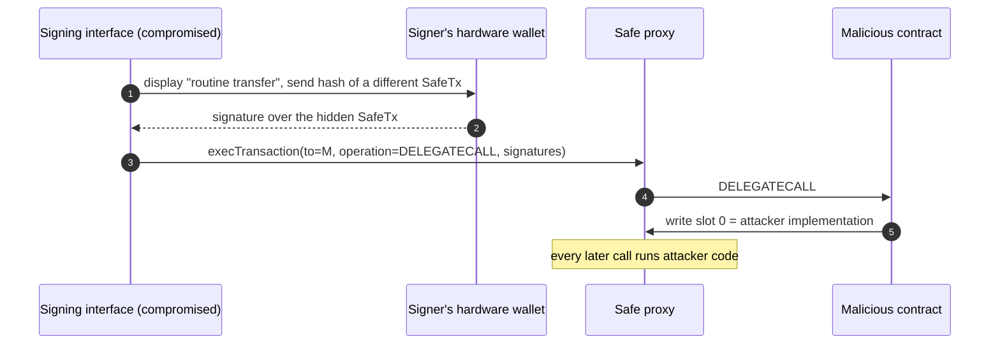
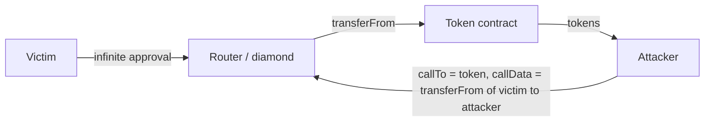
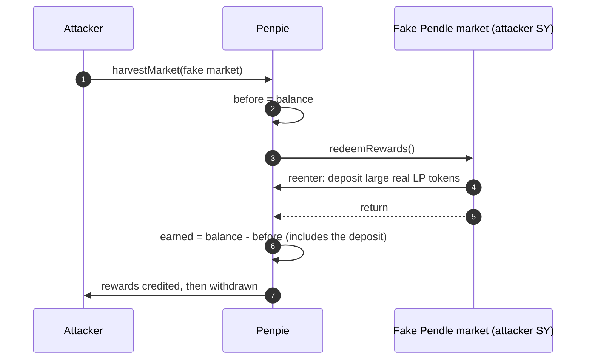

The [recap of the 2024 crypto hacks]({{site.url_complet}}/2026/10/07/crypto-hacks-2024/) summarises each incident in a sentence or two: "the signers approved a payload that differed from what their interface showed", "an approval granted on creation was never revoked on cancel", "a donation attack on an empty market". Those sentences are accurate, but each one compresses a mechanism that is not obvious even to someone who writes Solidity every day.

This article unpacks those mechanisms. It assumes you know how a smart contract, an ERC-20 approval and a proxy work, and it does not re-explain them; it explains the parts that are specific: what a Safe signer actually signs, why an uninitialised variable can disable a bridge's quorum, how an approval becomes an attack surface, what a callback lets an attacker do, why an empty lending market is dangerous, and what makes a price manipulable. Each section names the 2024 incidents it explains.

> This article has been made with the help of [Claude Code](https://claude.com/product/claude-code) and several custom skills

> **About the code.** The Solidity snippets are simplified to show the mechanism. They are not the deployed code of the protocols named; read the linked post-mortems for the exact contracts.

[TOC]

## Multisig signing: what the signer actually approves

*Explains: WazirX (~$235M), Radiant Capital (~$50M), and, in 2025, Bybit.*

### The Safe transaction

A [Safe](https://safe.global/) wallet is a proxy whose only storage slot that matters here is slot 0, which holds the address of its implementation (the "singleton" or "master copy"). Every action goes through one function:

```solidity
function execTransaction(
    address to,
    uint256 value,
    bytes calldata data,
    Enum.Operation operation,   // 0 = CALL, 1 = DELEGATECALL
    uint256 safeTxGas,
    uint256 baseGas,
    uint256 gasPrice,
    address gasToken,
    address payable refundReceiver,
    bytes memory signatures
) public payable returns (bool success);
```

The owners do not sign these fields one by one. Each owner signs a single 32-byte value, the [EIP-712](https://eips.ethereum.org/EIPS/eip-712) hash of all of them plus the Safe's nonce (the `safeTxHash`). The contract recomputes the hash, checks that at least the threshold of owners signed it, and executes.

Two consequences follow:

- **The signature covers whatever the hash covers, and nothing the screen showed.** If the interface displays "transfer 100 USDT" but the hash is computed over a different `to`, `data` or `operation`, the signer has approved the hidden transaction. A hardware wallet that shows only the hash, or a hash the user cannot recompute, gives no protection: this is *blind signing*.
- **`operation = 1` runs foreign code in the Safe's own storage.** With [`DELEGATECALL`]({{site.url_complet}}/2025/04/03/solidity-multicall/), the target's code executes with the Safe's storage, so a target that writes slot 0 replaces the wallet's implementation:

```solidity
// Simplified: a contract that, when DELEGATECALLed by a Safe,
// overwrites the Safe's implementation pointer (slot 0).
contract SlotZeroWriter {
    address public singleton; // occupies slot 0, like the Safe proxy's

    function transfer(address newImpl, uint256) external {
        singleton = newImpl;   // writes the CALLER's slot 0 under DELEGATECALL
    }
}
```

Once slot 0 points to the attacker's implementation, every later call to the wallet runs the attacker's code, which can move every asset without any further signature.

### How the 2024 incidents used it

- **WazirX.** The Safe was co-signed through the custody provider Liminal's interface. What the signers saw did not match the payload they signed, and the signed transaction changed the wallet's implementation to one the attacker controlled; more than 200 assets were then drained ([WazirX report](https://wazirx.com/blog/preliminary-report-cyber-attack-on-wazirx-multisig-wallet/)).
- **Radiant Capital.** Malware on three contributors' devices showed legitimate transactions in the Safe interface while their hardware wallets signed others, calls that transferred ownership of the lending pool contracts. Failed submissions prompted signers to sign again, which helped the attacker collect enough signatures.
- **Bybit (February 2025, ~$1.4B).** The same pattern on a larger scale: a manipulated interface, a `DELEGATECALL` to a contract that rewrote slot 0.



The defence is to recompute the `safeTxHash` from the decoded fields on an independent device and compare it with what the hardware wallet displays, and to treat any `DELEGATECALL` to an unknown address as an emergency. The site's guide to [creating a Safe multisig]({{site.url_complet}}/2022/08/12/multisig-wallet-gnosis/) covers the basic setup.

## Exchange wallets and their suppliers

*Explains: DMM Bitcoin (~$305M), BtcTurk, BingX, Indodax, Rain, M2.*

A centralised exchange holds most funds in **cold** storage (keys offline), a working balance in **warm** wallets (keys online but behind approvals), and the funds that serve withdrawals in **hot** wallets, whose keys are used automatically by a signing service. The [exchange security overview]({{site.url_complet}}/2025/11/06/crypto-exchange-security-overview/) describes this layering.

The attacker rarely needs the cold keys. Two routes worked in 2024:

- **Take the hot wallet's signer.** If the attacker controls the server that holds or uses the hot keys, it signs withdrawals like any other; that is the likely route at BtcTurk, BingX, M2 and Indodax (where the withdrawal system itself was breached).
- **Alter the request before it is signed.** At DMM Bitcoin, North Korean operators compromised the company that supplied the wallet software, then modified a legitimate transaction request submitted by a DMM employee, so that the signing process sent 4,502.9 BTC to them. Nothing in the signature was forged; the input was.

## Privileged keys and thresholds

*Explains: PlayDapp, Gala Games, Orbit bridge (~$81.5M).*

### Minter roles

A mintable token usually restricts `mint` to an address with a role:

```solidity
function mint(address to, uint256 amount) external onlyRole(MINTER_ROLE) {
    _mint(to, amount);
}
```

The role is only as safe as the key holding it, and as the key that can grant it. At PlayDapp, a leaked key was used to grant `MINTER_ROLE` to a new address, which minted about 1.79B PLA; at Gala Games, a dormant minter key minted 5B GALA. This is why these incidents are reported twice:

- **Nominal value**: the minted amount times the market price (~$290M, ~$216M).
- **Realised value**: what the attacker could sell before the price collapsed and exchanges blocked the token (about $32M and $21M).

The useful number for a reader is the second.

### M-of-N thresholds

A multisig with threshold M of N resists M−1 compromised keys, not M. The Orbit bridge required 7 of 10 signers; the attacker compromised 7. A threshold says nothing about whether the keys are *independent*: keys held by the same organisation, on the same kind of device or in the same cloud account fall together, as they did again in 2026 at Humanity Protocol (seven keys on one laptop).

## Upgrades and initialisation

*Explains: Ronin bridge (~$12M, returned), Munchables (~$62.5M, returned).*

### A value that was never initialised

With an upgradeable [proxy]({{site.url_complet}}/2022/10/31/proxy-contract-summary/), a new implementation's state is set by an initialiser, not a constructor. If the upgrade forgets to call it, every variable it should have set reads as zero.

Ronin's bridge computed the minimum vote weight for a withdrawal from the total operator weight:

```solidity
// Simplified
function _minimumVoteWeight() internal view returns (uint256) {
    return (_num * _totalOperatorWeight + _denom - 1) / _denom;
}

function withdraw(Receipt calldata r, Signature[] calldata sigs) external {
    uint256 weight = _sumWeightOfValidSigners(r, sigs);
    require(weight >= _minimumVoteWeight(), "insufficient votes");
    _release(r);
}
```

The August 2024 upgrade left `_totalOperatorWeight` uninitialised, so the minimum weight was 0 and any withdrawal passed with no valid signature. An MEV bot copied the exploit and returned the ~$12M. The lesson for an upgrade script: assert, after the upgrade, every invariant the new code relies on (`_minimumVoteWeight() > 0`), in the same transaction if possible.

### State written before the code you audited

Storage belongs to the proxy, not to the implementation. Whatever an earlier implementation wrote stays there after an upgrade to clean code.

At Munchables, a developer the team had hired (four "developers" turned out to be one person) set, through an implementation he controlled, a very large balance for his own address in the proxy's storage, then upgraded to the implementation the team expected. The audited code was correct; the state it inherited was not. He later returned all 17,412.6 ETH. Verifying an upgradeable contract therefore means checking its storage as well as its code, and controlling who can upgrade before launch.

## Approvals as an attack surface

*Explains: LI.FI (~$10M), Seneca (~$6.4M), Hedgey (~$44.7M).*

An ERC-20 approval lets a spender call `transferFrom(owner, anyone, amount)` up to the allowance. Users routinely grant *infinite* approvals to routers and aggregators, so the router's code decides who can move their tokens.

### Arbitrary calls from an approved contract

If the approved contract makes an external call whose target and calldata come from the caller, the caller can make the contract call `token.transferFrom(victim, attacker, balance)`:

```solidity
// Simplified: a "swap" helper with an unrestricted call
function swapAndBridge(address callTo, bytes calldata callData) external {
    (bool ok, ) = callTo.call(callData);   // callTo = token, callData = transferFrom(victim, attacker, x)
    require(ok);
}
```

- **LI.FI (July)**: a newly added `GasZipFacet` passed user-supplied swap data into such a call; 153 wallets that had approved the LI.FI diamond were drained.
- **Seneca (February)**: `performOperations` accepted an arbitrary call action; users' approvals to the contract were spent the same way.

The same class reappears every year, including the "unknown Gnosis Safe" and ether.fi AtomicQueue cases of [September 2026]({{site.url_complet}}/2026/10/06/crypto-hacks-september-2026/). The rules are to never call a caller-supplied address with caller-supplied calldata from a contract that holds approvals, or to whitelist targets and selectors, and, as a user, to revoke approvals you no longer use.



### An approval granted to an address the caller chose

Hedgey's claim campaigns let a creator lock tokens for recipients. Creating a "locked" campaign approved a token locker to pull the tokens, and the locker's address came from the caller's input; cancelling the campaign refunded the tokens but left the approval:

```solidity
// Simplified
function createLockedCampaign(Campaign calldata c, ClaimLockup calldata lockup) external {
    IERC20(c.token).safeTransferFrom(msg.sender, address(this), c.amount);
    IERC20(c.token).safeIncreaseAllowance(lockup.tokenLocker, c.amount); // tokenLocker is caller input
}

function cancelCampaign(bytes16 id) external {
    // refunds the unclaimed tokens to the creator
    // ...but never resets the allowance granted above
}
```

The attacker created and cancelled campaigns with flash-loaned tokens, named its own contract as `tokenLocker`, and then used the leftover allowances to pull other users' tokens from the Hedgey contract. Two rules are broken: never approve an address taken from calldata, and undo every side effect when you undo an operation.

## Callbacks: trusting code you call

*Explains: Penpie (~$27M), Prisma Finance (~$11.6M).*

### Reentrancy through a fake market

Any external call can execute attacker code. Reward-accounting functions often measure rewards as "balance after minus balance before" around a call:

```solidity
// Simplified
function harvestMarket(address market) external {
    uint256 before = rewardToken.balanceOf(address(this));
    IMarket(market).redeemRewards(address(this));   // external call into the market
    uint256 earned = rewardToken.balanceOf(address(this)) - before;
    _distribute(market, earned);
}
```

Penpie let anyone register a Pendle market, and Pendle let anyone create one with any standardised yield (SY) token. The attacker registered a market built on its own SY token. During `redeemRewards`, that token called back into Penpie and deposited a large amount of real Pendle LP tokens, so the "after" balance included the deposit; Penpie credited it as earned rewards. The function had no reentrancy guard, and the registration had no allowlist.



### A flash-loan callback that did not check who started the loan

In an [ERC-3156](https://eips.ethereum.org/EIPS/eip-3156) flash loan, the lender calls `onFlashLoan(initiator, token, amount, fee, data)` on the receiver. The receiver must check both who is calling (the lender) and who *started* the loan (the `initiator`):

```solidity
function onFlashLoan(address initiator, address, uint256 amount, uint256 fee, bytes calldata data)
    external returns (bytes32)
{
    require(msg.sender == address(debtToken), "untrusted lender");
    require(initiator == address(this), "untrusted initiator");   // the check Prisma's zap lacked
    (address account, ...) = abi.decode(data, (address, ...));
    // ... close and reopen `account`'s position
}
```

Prisma's migration zap checked the lender but not the initiator. Anyone could ask the debt token to flash-lend to the zap with crafted `data` naming a victim who had delegated to the zap; the zap then closed the victim's trove and reopened it with less collateral, and the attacker kept the difference ([Prisma post-mortem](https://hackmd.io/@PrismaRisk/PostMortem0328)).

## Accounting and rounding

*Explains: Sonne Finance (~$20M), Abracadabra (~$6.5M), Velocore (~$6.8M), Thala (~$25.5M, recovered).*

### Empty markets in Compound v2 forks

In [Compound v2]({{site.url_complet}}/2024/08/27/compound-protocol-v2/) and its forks, each market's share (cToken) price is:

```solidity
// exchangeRate = (cash + borrows - reserves) / totalSupply
function exchangeRateStored() public view returns (uint256) {
    if (totalSupply == 0) return initialExchangeRate;
    return (getCash() + totalBorrows - totalReserves) * 1e18 / totalSupply;
}
```

`getCash()` is the contract's token balance, so anyone can raise it by transferring tokens directly: a *donation*. In a market with almost no supply, the attacker:

1. mints a tiny number of cTokens (a few wei of shares);
2. donates a large amount of the underlying, so each share is now worth a huge amount;
3. uses those few shares as collateral to borrow other assets;
4. redeems the underlying with `redeemUnderlying`, which computes `shares = amount / exchangeRate` **rounded down**, so it burns fewer shares than the amount is worth.

This is the same arithmetic as the "inflation attack" on ERC-4626 vaults. At Sonne Finance, a new VELO market went live through timelocked governance actions that anyone could execute, and the attacker executed them in an order that left the market empty when collateral was enabled. The standard defence is to seed every new market with liquidity and burn some shares in the same transaction that enables it.

### Shares and amounts: the elastic/base pair

Many protocols track a total as two numbers: `elastic` (the real amount, which grows with interest) and `base` (the number of shares). A user's debt is `part * elastic / base`. Conversions round, and the rounding is safe only if the ratio stays in a sane range. In Abracadabra's CauldronV4, the attacker repaid everyone's debt (`repayForAll` plus manual repayments) until `elastic` reached zero while `base` did not; the library did not handle that case, and a loop of borrow and repay inflated the ratio until rounding let it borrow without matching collateral.

### Unchecked arithmetic

Since Solidity 0.8, overflow reverts, except inside `unchecked` blocks, which developers use to save gas when they believe a value cannot overflow. Velocore's pool computed a factor as:

```solidity
unchecked {
    uint256 factor = 1e18 - ((1e18 - k) * effectiveFee1e9) / 1e9;   // underflows if effectiveFee1e9 > 1e9
}
```

The attacker called the pool's execution function three times to push the fee multiplier, and with it `effectiveFee1e9`, above 100%; the subtraction then wrapped around to a huge number, and a small single-token withdrawal minted a huge amount of LP tokens. An `unchecked` block is a claim that a bound holds; that bound has to be enforced, not assumed.

Thala, on Aptos, shows the simplest version of the same idea in Move: the v1 farming update did not check that the amount withdrawn was at most the amount staked. The attacker returned $25.2M for a $300k bounty.

## Prices you can move

*Explains: Polter Finance (~$8.7M to ~$12M), UwU Lend (~$19.4M).*

### A price read from pool reserves

A price computed from an AMM pair's reserves is the price at that instant, and a flash loan can change it within the same transaction:

```solidity
// Simplified: "oracle" reading a Uniswap V2-style pair
function price() external view returns (uint256) {
    (uint112 r0, uint112 r1, ) = pair.getReserves();
    return uint256(r1) * 1e18 / r0;     // spot price, movable by one large swap
}
```

Polter Finance, a fork of Geist on Fantom, priced BOO from SpookySwap reserves. The attacker flash-borrowed BOO out of the pools, so the remaining reserves made BOO look extremely expensive, deposited a little BOO as collateral, and borrowed everything else. Time-weighted averages (TWAP) or external price feeds exist precisely because a reserve ratio is not a price an attacker cannot set.

### A median is only as strong as its majority

UwU Lend priced sUSDe with the median of 11 sources, which sounds robust. According to [SlowMist's analysis](https://slowmist.medium.com/analysis-of-the-uwu-lend-hack-9502b2c06dbe), five of them were Curve pools read with `get_p`, an instantaneous price that Curve advises against using as an oracle. With flash loans, the attacker pushed those pools down, borrowed sUSDe at the low price, pushed them up, and liquidated positions at the high price, all in one transaction. A median resists manipulation only if most of its inputs cannot be moved in the same block.

## Attacks on users

*Explains: the ~$68M WBTC address poisoning, the ~$55M DAI phishing, the ~$238M social-engineering theft.*

- **Address poisoning.** The attacker generates an address whose first and last characters match one the victim uses, then sends the victim a zero-value or dust transfer from it, so it appears in the victim's history. The next time the victim copies "the" address from history, they paste the attacker's. In May 2024, a holder sent 1,155 WBTC this way; most was returned after negotiation.
- **Ownership and permit phishing.** A signature can transfer more than tokens. In August 2024, a victim signed a transaction that made an Inferno Drainer address the owner of their Maker DSProxy, the contract that held their vault; the attacker then minted 55.47M DAI against it. An [EIP-2612](https://eips.ethereum.org/EIPS/eip-2612) `permit` or a Permit2 signature does the same for allowances, without any on-chain approval for the victim to notice.
- **Social engineering.** No contract is involved: in August 2024, callers posing as Google and Gemini support talked a Genesis creditor into giving access to 4,064 BTC.

## Summary: from incident to concept

| Incident (2024) | Concept | Section |
|-----------------|---------|---------|
| WazirX, Radiant | Blind signing, `DELEGATECALL`, slot-0 overwrite | Multisig signing |
| DMM Bitcoin, BtcTurk, BingX, Indodax | Hot-wallet signer, supplier compromise | Exchange wallets |
| PlayDapp, Gala, Orbit | Minter role, M-of-N threshold, nominal vs realised | Privileged keys |
| Ronin | Uninitialised state after an upgrade | Upgrades |
| Munchables | Storage written before the audited implementation | Upgrades |
| LI.FI, Seneca | Arbitrary call spends existing approvals | Approvals |
| Hedgey | Approval to a caller-chosen address, not revoked | Approvals |
| Penpie | Reentrancy through a permissionless fake market | Callbacks |
| Prisma | Flash-loan callback without an initiator check | Callbacks |
| Sonne | Empty-market donation and rounding | Accounting |
| Abracadabra | elastic/base rounding at zero | Accounting |
| Velocore, Thala | Unchecked underflow, missing bound | Accounting |
| Polter, UwU Lend | Spot price from reserves, manipulable median | Prices |
| Address poisoning, DAI phishing | Look-alike addresses, ownership signatures | Users |

## Conclusion

The 2024 hacks rest on a small set of mechanisms that recur from year to year:

- **Signatures** cover a hash, not a screen; `DELEGATECALL` and slot 0 turn one signed transaction into permanent control of a wallet.
- **Keys and roles** are as strong as their custody, and a threshold counts keys, not independent failures.
- **Upgrades** carry state and need their invariants asserted after initialisation.
- **Approvals** delegate authority to every code path of the approved contract.
- **Callbacks** hand control to code the protocol does not own, during its own accounting.
- **Share accounting and rounding** break at the edges: empty markets, zero totals, `unchecked` arithmetic.
- **Prices** read from a pool within the transaction are prices the attacker sets.


## Annex

### Key Terms

| Term | Definition |
|------|------------|
| **Safe singleton (master copy)** | The implementation a Safe proxy delegates to; its address sits in the proxy's storage slot 0. |
| **safeTxHash** | The EIP-712 hash of a Safe transaction's fields and nonce; the only thing each owner actually signs. |
| **Blind signing** | Approving a hash or payload without being able to verify what it does. |
| **DELEGATECALL** | A call that runs the target's code in the caller's storage context. |
| **Hot / warm / cold wallet** | Exchange wallets with keys online and automated, online behind approvals, or offline. |
| **Minter role** | An access-control role allowed to create new tokens. |
| **M-of-N threshold** | A multisig that executes when M of its N owners sign. |
| **Initialiser** | The function that sets an upgradeable contract's state in place of a constructor. |
| **Infinite approval** | An ERC-20 allowance set to the maximum value, so the spender can move any balance. |
| **Arbitrary call** | An external call whose target and calldata are chosen by the caller. |
| **Reentrancy** | An external call that calls back into the caller before it has finished updating its state. |
| **ERC-3156 initiator** | The address that started a flash loan, passed to the receiver's `onFlashLoan`. |
| **Exchange rate (cToken)** | In Compound v2 forks, `(cash + borrows - reserves) / totalSupply`. |
| **Donation attack** | Sending tokens directly to a contract to inflate a share price based on its balance. |
| **elastic / base** | A pair of totals tracking real amounts and shares; conversions between them round. |
| **unchecked block** | Solidity code where overflow and underflow wrap instead of reverting. |
| **Spot price** | A price read from current pool reserves, movable within a transaction. |
| **TWAP** | A time-weighted average price, harder to move within one block. |
| **Address poisoning** | Planting a look-alike address in a victim's history so that they copy it. |

### Security Implementation Checklist

#### Signing and keys

| Check | Security requirement | Failure mode if violated |
|:---:|------------|------------|
| ☐ | Signers recompute the `safeTxHash` from decoded fields on an independent device before signing. | A compromised interface obtains signatures for a hidden transaction (WazirX, Radiant). |
| ☐ | Any `DELEGATECALL` to a non-allowlisted address is rejected or escalated. | A signed call rewrites slot 0 and hands the wallet to the attacker. |
| ☐ | Multisig keys are held by independent people on independent devices. | One compromised device or account yields M keys (Orbit). |
| ☐ | Minter and admin roles are timelocked, monitored and revocable. | A single leaked key mints or upgrades instantly (PlayDapp, Gala). |

#### Upgrades

| Check | Security requirement | Failure mode if violated |
|:---:|------------|------------|
| ☐ | Every upgrade calls its initialiser and asserts post-conditions in the same transaction. | Uninitialised values disable security checks (Ronin). |
| ☐ | Storage is reviewed, not only code, before and after any upgrade. | Pre-seeded state survives into audited code (Munchables). |

#### Approvals and calls

| Check | Security requirement | Failure mode if violated |
|:---:|------------|------------|
| ☐ | Contracts holding user approvals never call caller-supplied targets with caller-supplied calldata. | `transferFrom` is called on users' tokens (LI.FI, Seneca). |
| ☐ | Approvals are never granted to addresses taken from calldata, and are reset when an operation is cancelled. | Leftover allowances drain the contract (Hedgey). |
| ☐ | Functions that measure balance changes around external calls are `nonReentrant`, and permissionless registrations are restricted. | Reentrant deposits are counted as earnings (Penpie). |
| ☐ | Flash-loan receivers check both `msg.sender` (lender) and `initiator`. | Anyone triggers the callback with crafted data (Prisma). |

#### Accounting and prices

| Check | Security requirement | Failure mode if violated |
|:---:|------------|------------|
| ☐ | New lending markets are seeded and some shares burned before collateral is enabled. | Donation and rounding drain the market (Sonne). |
| ☐ | Share/amount conversions handle zero totals and round in the protocol's favour. | Rounding at the edges creates unbacked debt or shares (Abracadabra). |
| ☐ | Every `unchecked` block has its bound enforced by code. | Underflow mints arbitrary amounts (Velocore). |
| ☐ | Prices come from TWAPs or external feeds, and medians use sources that cannot be moved in one block. | Flash-loan price manipulation (Polter, UwU Lend). |

## Frequently Asked Questions

**Q: If a Safe requires several signatures, how could WazirX and Radiant lose control of theirs?**

The threshold was met: enough owners signed. They signed a hash that did not correspond to what their screens showed, because the interface (WazirX) or their devices (Radiant) were compromised. A multisig protects against a single stolen key, not against several signers being shown a false transaction. Recomputing the hash independently is what closes that gap.

**Q: Why is `operation = DELEGATECALL` in a Safe transaction so dangerous?**

A `DELEGATECALL` runs the target's code with the Safe's storage. A target that writes slot 0 replaces the address of the Safe's implementation, after which every call to the wallet runs the attacker's code without needing any signature. A normal `CALL` cannot change the Safe's own storage.

**Q: How can a contract's approval be used against users who never interact with the attacker?**

Users approve a router or aggregator once, often for an unlimited amount. If any function of that contract lets a caller choose the target and calldata of an external call, the caller can make the contract call `token.transferFrom(victim, attacker, amount)`, and the token accepts it because the contract is an approved spender. LI.FI and Seneca were drained this way.

**Q: Why are empty Compound v2 markets vulnerable when the code is unchanged from Compound?**

The cToken exchange rate divides the market's token balance by the number of shares. With almost no shares, a direct transfer of tokens makes each share worth a large amount, and `redeemUnderlying` rounds the number of shares to burn down. The attacker uses a few inflated shares as collateral, borrows other assets, and redeems more than it put in. Compound's own markets were seeded; new markets in forks often were not.

**Q: What is the difference between the Penpie and Prisma callback bugs?**

They are two ways of trusting a callback:

- **Penpie** called into a market the attacker created, and that market re-entered Penpie mid-calculation, so a deposit was counted as rewards. The fix is a reentrancy guard and an allowlist of markets.
- **Prisma** received a flash-loan callback that anyone could trigger, because it checked the lender but not who started the loan. The fix is the `initiator == address(this)` check required by ERC-3156.

**Q: Combining the Ronin and Munchables cases, what should an upgrade review check beyond the new code?**

The state the code will run with:

- **Initialisation.** Ronin's new code was correct, but the value it needed (the total operator weight) was never set, so the vote threshold was zero.
- **Inherited storage.** Munchables' final code was correct, but storage written by an earlier implementation gave the developer a huge balance.

An upgrade review checks the storage layout and values, calls the initialiser, and asserts the invariants after the upgrade, not only the diff of the code.

## References

### Official post-mortems

- [WazirX: preliminary report on the cyber attack on the WazirX multisig wallet](https://wazirx.com/blog/preliminary-report-cyber-attack-on-wazirx-multisig-wallet/)
- [Prisma Finance: post-mortem, 28 March 2024](https://hackmd.io/@PrismaRisk/PostMortem0328)
- [LI.FI: incident report, 16 July 2024](https://li.fi/knowledge-hub/incident-report-16th-july)
- [Japan National Police Agency: TraderTraitor and the DMM Bitcoin theft](https://www.npa.go.jp/bureau/cyber/koho/caution/caution20241224.html)

### Technical analyses

- [SlowMist: analysis of the UwU Lend hack](https://slowmist.medium.com/analysis-of-the-uwu-lend-hack-9502b2c06dbe)
- [Verichains: Velocore incident analysis](https://blog.verichains.io/p/velocores-incident-analysis)
- [Ronin Network - Rekt II](https://rekt.news/roninnetwork-rektII), [Munchables - Rekt](https://rekt.news/munchables-rekt), [Hedgey Finance - Rekt](https://rekt.news/hedgey-finance-rekt), [Penpie - Rekt](https://rekt.news/penpie-rekt)
- [Sonne Finance - Rekt](https://rekt.news/sonne-finance-rekt), [Abracadabra - Rekt](https://rekt.news/abra-rekt/), [Polter Finance - Rekt](https://rekt.news/polter-finance-rekt), [Seneca - Rekt](https://rekt.news/seneca-protocol-rekt), [LI.FI - Rekt](https://rekt.news/lifi-jumper-rekt), [Radiant Capital - Rekt 2](https://rekt.news/radiant-capital-rekt2)

### Standards

- [EIP-712: Typed structured data hashing and signing](https://eips.ethereum.org/EIPS/eip-712)
- [ERC-3156: Flash Loans](https://eips.ethereum.org/EIPS/eip-3156)
- [EIP-2612: Permit extension for EIP-20 signed approvals](https://eips.ethereum.org/EIPS/eip-2612)
- [Safe smart account](https://safe.global/)
- [Claude Code](https://claude.com/product/claude-code)

### Related articles

- [Compound V2 Overview]({{site.url_complet}}/2024/08/27/compound-protocol-v2/)
- [Programming proxy contracts with OpenZeppelin | Summary]({{site.url_complet}}/2022/10/31/proxy-contract-summary/)
- [Multicall in Solidity: CALL vs DELEGATECALL Explained]({{site.url_complet}}/2025/04/03/solidity-multicall/)
- [How to create a multisig wallet with Gnosis Safe]({{site.url_complet}}/2022/08/12/multisig-wallet-gnosis/)
- [Security of Cryptocurrency Exchanges - Overview]({{site.url_complet}}/2025/11/06/crypto-exchange-security-overview/)
