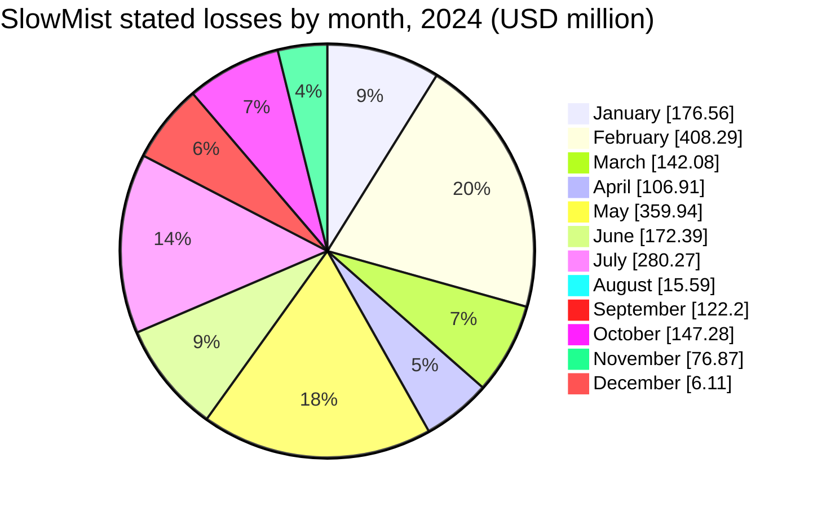
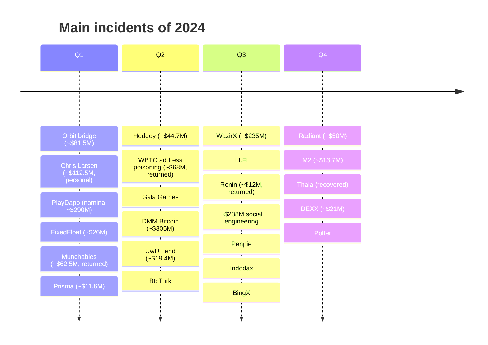
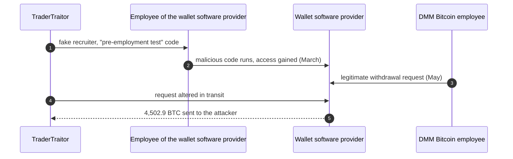
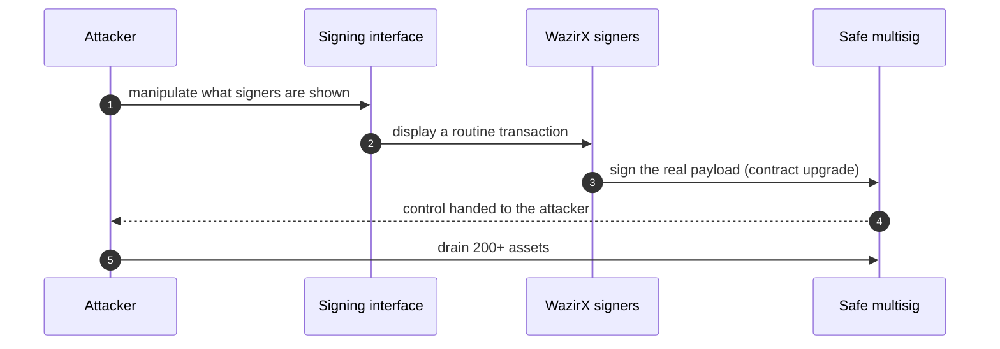

In 2024, attackers stole about $2.2B from crypto platforms and users, according to both Chainalysis and TRM Labs, a rise of roughly a fifth over 2023. The year belonged to centralised exchanges. DMM Bitcoin in Japan lost about $305M in May, and WazirX in India about $235M in July; BtcTurk, BingX, Indodax, Lykke, Rain and M2 followed with hot-wallet losses of their own. Chainalysis attributes about $1.34B, 61% of the total, to North Korea, and the FBI and the governments of the United States, Japan and South Korea formally named North Korean groups for DMM Bitcoin, WazirX, Radiant Capital and Rain.

This article reviews the year with the same method as the site's 2026 recaps: statistics computed from the [SlowMist Hacked](https://hacked.slowmist.io/) database, annual and monthly figures from the main trackers, [Rekt News](https://rekt.news/) post-mortems, and the projects' and authorities' own statements. The common thread will be familiar to readers of the [2026 recap]({{site.url_complet}}/2026/10/07/crypto-hacks-2026-year-to-date/): the largest losses came from compromised operators and signers, not from smart contract bugs. A companion article, [The Technical Concepts Behind the 2024 Crypto Hacks]({{site.url_complet}}/2026/10/07/crypto-hacks-2024-technical-concepts/), explains the mechanisms in more depth for Solidity developers.

> This article has been made with the help of [Claude Code](https://claude.com/product/claude-code) and several custom skills

[TOC]

## Scope, sources and caveats

The article covers incidents from 1 January to 31 December 2024. Unlike the 2026 articles, no Telegram export of the CryptoAlertHack channel was available for 2024, so the alert-level detail comes from SlowMist, Rekt News and the trackers' reports.

Four caveats apply to every figure below:

- **Trackers measure different things.** Chainalysis and TRM Labs count stolen funds; CertiK adds phishing; PeckShield's $3.01B adds scams; Immunefi's $1.49B counts fewer incidents. The headline totals therefore range from about $1.5B to $3.0B.
- **Minted tokens are not stolen money.** PlayDapp (about 1.79B PLA minted) and Gala Games (5B GALA minted) are often valued at ~$290M and ~$216M, the nominal market value of the new tokens. What the attackers could sell was far less: Immunefi counts about $32M for PlayDapp, and Gala's realised loss was about $21M. Monthly figures that use the nominal values (PeckShield's February and May) are inflated accordingly.
- **The year boundary is blurred.** The Orbit bridge (~$81M) was drained on 31 December 2023 and confirmed on 1 January 2024; PeckShield and Immunefi count it in 2024, SlowMist in 2023.
- **USD values are approximate**, valued at the time of each report, and are written with "about" or "~".

## 2024 in numbers

### The annual figures

| Source | Stolen (approx. USD) | Incidents | Notable split |
|--------|--:|--:|---------------|
| [Chainalysis](https://www.chainalysis.com/blog/crypto-hacking-stolen-funds-2025/) | $2.2B | 303 | North Korea $1.34B in 47 incidents (61%); private key compromise 43.8% of stolen funds |
| [TRM Labs](https://www.trmlabs.com/resources/blog/category-deep-dive-2-2-billion-was-stolen-in-crypto-related-hacks-in-2024) | $2.2B | n/a | North Korea ~$800M (35%); infrastructure attacks (keys, seeds) ~70% |
| [CertiK Hack3d](https://www.certik.com/resources/blog/hack3d-the-web3-security-report-2024) | $2.36B | 760 | Phishing ~$1.05B in 296 incidents; private key compromise ~$855M in 65; median loss ~$151k |
| [PeckShield](https://x.com/PeckShieldAlert/status/1877258501623525797) | $3.01B ($2.15B hacks) | 300+ | Scams ~$834.5M; ~$488.5M recovered |
| [SlowMist](https://kyt.slowmist.com/blog/slowmist-2024-blockchain-security-and-anti-money-laundering-annual-report/) | $2.01B | 410 | DeFi 339 incidents (~$1.03B); wallet drainers ~$494M |
| [Immunefi](https://immunefi.com/blog/research/immunefi-crypto-losses-2024-report/) | $1.49B | 232 | DeFi ~$769M, CeFi ~$726M; DMM and WazirX 36% of the total |

The North Korea figures diverge the most. Chainalysis puts it at ~$1.34B, TRM Labs at ~$800M, and the [joint statement](https://www.mofa.go.jp/press/release/pressite_000001_00914.html) of the United States, Japan and South Korea of January 2025 at "more than $659 million", made up of DMM Bitcoin (~$308M), WazirX (~$235M), Radiant (~$50M) and Rain (~$16.1M); each counts only the incidents it can attribute with its own evidence. A UN-affiliated monitoring team (MSMT), working with Chainalysis and Mandiant, later estimated $2.8B stolen by North Korea over 2024 and 2025 and wrote that these heists made up about one-third of the country's foreign currency revenue in 2024; [Protos](https://protos.com/chart-north-korea-stole-2-8b-in-crypto-hacks-since-2024-report/) reported that Taylor Monahan disputed several of its attributions.

### Month by month

Monthly figures are less reliable than annual ones: trackers revise them (PeckShield raised October from ~$88M to ~$102M, and May from ~$575M to ~$662M), and CertiK's monthly posts do not add up to its quarterly totals. The table gives PeckShield and CertiK as first reported in the press, next to SlowMist computed from the database.

| Month | PeckShield | CertiK | SlowMist incidents | SlowMist loss | Largest incident |
|-------|--:|--:|--:|--:|------|
| January | ~$86.0M | ~$193.1M | 61 | ~$176.6M | Chris Larsen (personal XRP), Orbit (if counted) |
| February | ~$360.8M (PlayDapp nominal) | ~$160M | 27 | ~$408.3M | PlayDapp |
| March | ~$187.3M | ~$79M | 37 | ~$142.1M | Munchables (returned) |
| April | ~$60.2M | ~$25.7M | 45 | ~$106.9M | Hedgey |
| May | ~$574.6M | ~$302M (annual report: ~$444.4M) | 34 | ~$359.9M | DMM Bitcoin |
| June | ~$176M | n/a | 29 | ~$172.4M | BtcTurk |
| July | ~$266M | ~$278.8M | 39 | ~$280.3M | WazirX |
| August | ~$313.9M | ~$310M | 28 | ~$15.6M | ~$238M individual theft (not in SlowMist) |
| September | ~$120.2M | ~$161.1M | 29 | ~$122.2M | BingX, Penpie, Indodax |
| October | ~$88.5M | ~$129.6M | 32 | ~$147.3M | Radiant Capital |
| November | ~$85.5M | ~$63.8M | 21 | ~$76.9M | Thala (recovered), DEXX |
| December | ~$24.7M | ~$28.6M | 29 | ~$6.1M | none above ~$2M |

August shows how much scope matters: the ~$238M taken from one person by social engineering appears in PeckShield's and CertiK's figures but not in SlowMist's, which lists protocol and platform incidents. In the database, the second half of the year was quieter than the first, and December was the lowest month of 2024 for every tracker.

### The largest incidents

| Rank | Date | Incident | Category | Reported loss (approx. USD) | Root cause (summary) |
|:---:|------|----------|----------|--:|----------------------|
| 1 | 31 May | DMM Bitcoin | CEX (Japan) | $305M (4,502.9 BTC) | Wallet software provider compromised, a legitimate transaction request altered; TraderTraitor (FBI) |
| 2 | 18 Jul | WazirX | CEX (India) | $235M | Multisig signers approved a payload that differed from what their interface showed |
| 3 | 9 Feb | PlayDapp | Game token | $290M nominal (~$32M per Immunefi) | Leaked private key used to add a minter |
| 4 | 31 Jan | Chris Larsen (personal) | Individual | $112.5M | Personal XRP accounts accessed |
| 5 | 1 Jan | Orbit bridge | Cross-chain bridge | $81.5M | 7 of 10 multisig signer keys compromised |
| 6 | 26 Mar | Munchables (Blast) | DeFi / GameFi | $62.5M (returned) | A developer the team hired altered a storage slot before an upgrade |
| 7 | 22 Jun | BtcTurk | CEX (Turkey) | $55M to $90M | Hot wallets for ten assets drained |
| 8 | 16 Oct | Radiant Capital | DeFi lending | $50M | Malware on three contributors' devices spoofed the Safe interface; UNC4736 (Mandiant) |
| 9 | 20 Sep | BingX | CEX | $45M to $52M | Hot wallet compromise |
| 10 | 19 Apr | Hedgey Finance | DeFi (token claims) | $44.7M | An approval granted by `createLockedCampaign` was never revoked on cancel |
| 11 | 3 Sep | Penpie | DeFi (Pendle yield) | $27M | Reentrancy in reward harvesting through a fake Pendle market |
| 12 | 17 Feb | FixedFloat | Instant exchange | $26M | "External attack" on the company's infrastructure |
| 13 | 15 Nov | Thala | DeFi (Aptos) | $25.5M ($25.2M recovered) | Withdrawal amount not checked against the user's stake |
| 14 | 11 Sep | Indodax | CEX (Indonesia) | $22M | Withdrawal system breached to drain hot wallets |
| 15 | 20 May | Gala Games | Game token | $216M nominal, ~$21M realised | Dormant minter key compromised |

Three individual losses would also rank in this table: about $238M (4,064 BTC) taken from a Genesis creditor in August by callers impersonating Google and Gemini support, ~$68M of WBTC lost to address poisoning in May (almost all returned), and ~$55M of DAI lost to a phishing signature in August.

### Statistics from the SlowMist database

Computed from the 2024 entries of the SlowMist Hacked database (one duplicate row removed), before recoveries:

- **411 incidents**, of which 275 have a stated loss, for **~$2.01B**, matching SlowMist's own annual report.
- **Median loss: ~$464k.** Four incidents of $100M or more make up about 47% of the total; another 30 between $10M and $100M add 39%.
- **136 incidents have no stated loss**, mostly phishing, rug pulls and account takeovers.

| Size band | Incidents | Loss (approx. USD) | Share of loss |
|---|--:|--:|--:|
| ≥ $100M | 4 | $937.5M | 46.5% |
| $10M to $100M | 30 | $787.0M | 39.1% |
| $1M to $10M | 77 | $251.0M | 12.5% |
| $100k to $1M | 107 | $36.7M | 1.8% |
| < $100k | 57 | $2.3M | 0.1% |
| Not stated | 136 | n/a | n/a |

| Category | Incidents | Loss (approx. USD) | Share of loss |
|---|--:|--:|--:|
| Key / infrastructure compromise | 40 | $1,279.5M | 63.5% |
| Smart contract vulnerability | 120 | $274.4M | 13.6% |
| Other / unknown | 64 | $268.2M | 13.3% |
| Scam / phishing / rug pull | 159 | $119.1M | 5.9% |
| Oracle / price manipulation | 17 | $43.0M | 2.1% |
| Cross-chain bridge / sidechain | 9 | $30.2M | 1.5% |

The category comes from the database's attack method, then from the target and description when the method is generic. Several exchanges are filed with an "Unknown" method (BtcTurk, Lykke, Rain), which is why "Other / unknown" holds 13% of the money; they were almost certainly key or hot-wallet compromises as well, which would push that row above 70%. Smart contract bugs, once again, are the most numerous incidents and a small share of the losses.

## The two largest incidents

### DMM Bitcoin (~$305M, May)

On 31 May, DMM Bitcoin, a Japanese exchange, lost 4,502.9 BTC (¥48.2bn). In December 2024, the FBI, the US Department of Defense Cyber Crime Center and Japan's National Police Agency [attributed the theft](https://www.npa.go.jp/bureau/cyber/koho/caution/caution20241224.html) to TraderTraitor, a North Korean group also tracked as Jade Sleet and UNC4899. The attack did not touch DMM's own systems first:

- **The supplier.** In late March 2024, a North Korean operator posing as a recruiter sent a "pre-employment test" to an employee of a Japanese company that made the wallet software DMM used. The malicious code compromised the employee's machine and, through it, the company's systems.
- **The transaction.** In late May, the attackers used that access to alter a legitimate transaction request submitted by a DMM employee, so that the signed transaction sent the bitcoin to them.

On the day of the theft, [Elliptic](https://www.elliptic.co/blog/dmm-bitcoin-loses-308-million-in-unauthorized-leak) observed the bitcoin already split across new wallets and noted it would be the largest theft since FTX's ~$477M in November 2022. DMM's parent group compensated customers; the exchange closed in December 2024 and its accounts moved to SBI VC Trade.

### WazirX (~$235M, July)

On 18 July, one of WazirX's multisig wallets, a Safe wallet whose signing was mediated by the custody provider Liminal, was emptied. WazirX's [preliminary report](https://wazirx.com/blog/preliminary-report-cyber-attack-on-wazirx-multisig-wallet/) describes the mechanism: what the signers saw in the interface did not match the payload they signed, and the transaction they approved upgraded the wallet's contract and handed control to the attacker. More than 200 different assets were then drained, including nearly $100M of SHIB. [Protos](https://protos.com/a-single-malicious-transaction-led-to-230m-drained-from-wazirx/) quoted Polygon's security chief: two signers were "tricked into signing malicious transaction (sic) in the name of a normal USDT transfer", and the attacker had rehearsed the attack on-chain for at least eight days.

[Elliptic](https://www.elliptic.co/insights/235-million-lost-by-wazirx-in-north-korea-linked-breach/) attributed the hack to North Korea-affiliated hackers on the day, and the [US-Japan-South Korea joint statement](https://www.mofa.go.jp/press/release/pressite_000001_00914.html) of January 2025 confirmed it. The same "what you see is not what you sign" failure drained Bybit of about $1.4B in February 2025, and multisig signers were again the target at Drift in 2026.

## Exchanges and custodial platforms

Centralised platforms lost about half of the year's money, nearly all through hot wallets or the systems that sign for them:

- **BtcTurk (22 June, ~$55M to ~$90M).** Hot wallets for ten assets were drained; Binance froze about $5.3M.
- **BingX (20 September, ~$45M to ~$52M)** and **Indodax (11 September, ~$22M).** Hot-wallet compromises; for Indodax, the withdrawal system itself was breached. Analysts suspected Lazarus in both cases; neither attribution is official.
- **Rain (29 April, ~$14.8M to ~$16M).** The Bahraini exchange's losses became public only when ZachXBT reported them; the January 2025 joint statement attributes them to North Korea.
- **Lykke (June, ~$22M), M2 (October, ~$13.7M), FixedFloat (February, ~$26M), XT.com (November, ~$1.7M).** Hot-wallet thefts of different sizes; M2 and XT.com covered their users, Lykke later collapsed.
- **DEXX (November, ~$21M).** A Solana trading terminal whose users' keys appear to have leaked, affecting more than 900 accounts.

The site's overview of [exchange security]({{site.url_complet}}/2025/11/06/crypto-exchange-security-overview/) describes the hot, warm and cold wallet model these platforms rely on. In 2024, attackers went after the hot wallets and, in DMM's and WazirX's cases, after the signing process that refills them.

## Keys, signers and insiders in DeFi

- **Radiant Capital (16 October, ~$50M).** Malware on three contributors' devices showed them legitimate-looking transactions in the Safe interface while they signed others that transferred ownership of the lending pools. Radiant's investigation with Mandiant attributed it to UNC4736, the North Korean group that Drift would attribute its own loss to in 2026. Radiant was later wound down.
- **Orbit bridge (1 January, ~$81.5M).** Seven of the bridge's ten multisig signer keys were compromised; Lazarus was suspected by analysts, not officially.
- **PlayDapp (February) and Gala Games (May).** A leaked or dormant minter key let the attackers create billions of tokens ([Elliptic on PlayDapp](https://www.elliptic.co/blog/crypto-gaming-platform-playdapp-suffers-290-million-breach)). Gala recovered the ETH from its sale on 22 May and blocklisted the remaining tokens.
- **Munchables (26 March, ~$62.5M, returned).** A developer hired by the team, four "developers" who turned out to be one person, edited a storage slot before an upgrade to credit himself; all 17,412.6 ETH were returned after the Blast community traced him.
- **Personal wallets.** Ripple co-founder Chris Larsen (~$112.5M of XRP, January), Axie Infinity co-founder Jihoz (~$10M, February).

## DeFi contract bugs

DeFi contract exploits were numerous and individually smaller. The main ones, grouped by mechanism:

| Date | Protocol | Loss (approx. USD) | Flaw |
|------|----------|--:|------|
| 28 Feb | Seneca | $6.4M (about 80% returned) | Arbitrary call in `performOperations` spent users' approvals |
| 28 Mar | Prisma Finance | $11.6M | `MigrateTroveZap.onFlashLoan` did not validate its input |
| 19 Apr | Hedgey Finance | $44.7M | An approval granted when creating a campaign was not revoked when cancelling it |
| 14 May | Sonne Finance | $20M | Known donation attack on an empty Compound-v2-fork market |
| 2 Jun | Velocore | $6.8M | Overflow in fee logic |
| 10 Jun | UwU Lend | $19.4M (plus $3.7M three days later) | Oracle medianised 11 sources, five of them manipulable Curve pools |
| 16 Jul | LI.FI | $9.7M to $11.6M | A new facet allowed arbitrary calls that drained infinite approvals of 153 wallets |
| 6 Aug | Ronin bridge | $12M (returned) | An upgrade left the operator-weight threshold uninitialised; MEV white hats returned the funds |
| 3 Sep | Penpie | $27M | Reentrancy through a fake Pendle market |
| 15 Nov | Thala | $25.5M ($25.2M recovered) | Withdrawal amount not checked against the stake |
| 16 Nov | Polter Finance | $8.7M to $12M | Spot-price oracle for BOO manipulated with a flash loan |

Two patterns recur. Arbitrary-call bugs that spend users' existing approvals (Seneca, LI.FI) are the same class that drained the "unknown Gnosis Safe" and ether.fi's AtomicQueue users in [September 2026]({{site.url_complet}}/2026/10/06/crypto-hacks-september-2026/). And spot or near-spot oracles (UwU Lend, Polter) remained the cheapest way to borrow against inflated collateral.

## Attacks on people

- **Social engineering (19 August, ~$238M).** A Genesis creditor lost 4,064 BTC (more than 4,100 BTC per the indictment) to callers who posed as Google and Gemini support. The US Department of Justice [charged two men](https://www.justice.gov/usao-dc/pr/indictment-charges-two-230-million-cryptocurrency-scam) after an investigation in which ZachXBT traced the funds.
- **Address poisoning (3 May, ~$68M).** A holder sent 1,155 WBTC to a look-alike address; after on-chain negotiation, about $65.7M was returned in ETH on 10 May.
- **Phishing (20 August, ~$55M).** A signature handed ownership of a Maker DSProxy to an Inferno Drainer address. CertiK counts about $1.05B of phishing losses across 2024, more than any other vector.
- **Rug pulls.** ZKasino (~$33M), IBXtrade (~$21.8M) and Essence Finance (~$20M) are listed by SlowMist as exit scams rather than hacks.

## Official post-mortems and statements

The table lists, for the main incidents, the official or primary source found as of 7 October 2026.

| Incident | Source | What it says |
|----------|--------|--------------|
| DMM Bitcoin | [Japan National Police Agency](https://www.npa.go.jp/bureau/cyber/koho/caution/caution20241224.html) and FBI joint attribution (December 2024) | TraderTraitor compromised a wallet software provider and altered a legitimate transaction. |
| WazirX | [Preliminary report](https://wazirx.com/blog/preliminary-report-cyber-attack-on-wazirx-multisig-wallet/), [joint statement](https://www.mofa.go.jp/press/release/pressite_000001_00914.html) | Interface and signed payload differed; the multisig contract was upgraded to the attacker's. |
| Radiant Capital | Radiant post-mortem with Mandiant (Medium; URL not verified) | Malware on three devices; UNC4736 (DPRK). |
| Prisma Finance | [Post-mortem](https://hackmd.io/@PrismaRisk/PostMortem0328) | Unvalidated flash-loan callback data in `MigrateTroveZap`. |
| LI.FI | [Incident report](https://li.fi/knowledge-hub/incident-report-16th-july) | Arbitrary call in the new `GasZipFacet`. |
| Genesis creditor theft | [US Department of Justice indictment](https://www.justice.gov/usao-dc/pr/indictment-charges-two-230-million-cryptocurrency-scam) | Social-engineering scam; two men charged. |
| PlayDapp, Orbit, Gala Games, Hedgey, Penpie, Ronin, BtcTurk, BingX | not located | Statements on X or Discord are reported in the press but were not verified for this article. |

## Observations

- **Exchanges carried the year.** DMM Bitcoin, WazirX, BtcTurk, BingX, Indodax and others made centralised platforms about half of the losses (Immunefi: ~$726M CeFi against ~$769M DeFi).
- **North Korea was the largest single actor**, with about 61% of stolen value by Chainalysis' count, and the only one formally named by governments: TraderTraitor for DMM, and North Korean groups for WazirX, Radiant and Rain.
- **The signing interface became the target.** WazirX and Radiant were lost by signers who approved something other than what they saw; the same failure produced Bybit in 2025 and Drift in 2026.
- **Suppliers are part of the attack surface.** DMM was reached through its wallet software provider, not directly.
- **Minting keys inflate the headlines.** PlayDapp and Gala minted hundreds of millions of dollars of nominal value but realised a small fraction of it.
- **Recovery came from people, not systems**: Munchables' developer, Thala's attacker, Ronin's MEV white hats and the WBTC address-poisoner returned funds, while exchange losses were mostly absorbed by the exchanges or their owners.

## Conclusion

In 2024, attackers stole about $2.2B (Chainalysis, TRM Labs), with trackers ranging from ~$1.5B to ~$3.0B depending on scope.

- **Centralised exchanges were the main target**, led by DMM Bitcoin (~$305M) and WazirX (~$235M), both attributed to North Korea.
- **Keys, signers and suppliers** account for most of the money: a compromised wallet software provider, spoofed signing interfaces, leaked minter keys and multisig keys.
- **DeFi contract bugs** were the most frequent incidents but a small share of the losses, with recurring approval-draining and oracle flaws.
- **Individuals** lost large sums to social engineering, address poisoning and phishing, which CertiK ranks as the costliest vector of the year.

## Annex

### Key Terms

| Term | Definition |
|------|------------|
| **CEX (centralised exchange)** | A platform that holds users' crypto in its own wallets; DMM Bitcoin, WazirX and BingX are examples. |
| **Hot / warm / cold wallet** | Exchange wallets whose keys are online, semi-online or offline; most 2024 exchange losses came from hot wallets. |
| **Multisig** | A wallet that requires M of N signatures; WazirX, Radiant and Orbit used them and still lost funds. |
| **Safe** | A widely used smart-contract multisig wallet, formerly Gnosis Safe. |
| **Signing interface** | The software that shows a signer what a transaction does; when it lies, the signer approves something else. |
| **Supply-chain compromise** | Reaching a target through a supplier, as with DMM's wallet software provider. |
| **TraderTraitor** | A North Korean hacking group, also tracked as Jade Sleet and UNC4899, attributed DMM Bitcoin by the FBI. |
| **UNC4736** | A North Korean group, also linked to AppleJeus, attributed Radiant Capital by Mandiant. |
| **Minter key** | A key allowed to create new tokens; PlayDapp's and Gala's were compromised. |
| **Nominal vs realised loss** | The market value of tokens taken or minted, against what the attacker could actually sell or withdraw. |
| **Approval drain** | Spending a user's existing token approval through a contract that lets any caller choose whose tokens move. |
| **Donation attack** | Inflating a lending market's exchange rate by sending tokens directly to it, typically on an empty market. |
| **Oracle manipulation** | Moving the price a protocol reads so that collateral is overvalued. |
| **Address poisoning** | Sending dust from a look-alike address so that the victim later copies the wrong one. |
| **Rug pull** | A project's own team taking users' funds and abandoning the project. |

## Frequently Asked Questions

**Q: How much was stolen in crypto hacks in 2024?**

About $2.2B according to Chainalysis and TRM Labs, in roughly 300 incidents. Other trackers give ~$1.49B (Immunefi), ~$2.01B (SlowMist), ~$2.36B (CertiK, including phishing) and ~$3.01B (PeckShield, including scams). The differences come from what each counts: stolen funds only, phishing, scams, or nominal token values.

**Q: Why was 2024 called a year of exchange breaches?**

The two largest thefts hit centralised exchanges (DMM Bitcoin, WazirX), and a series of others lost hot-wallet funds: BtcTurk, BingX, Indodax, Lykke, Rain, M2, FixedFloat. Immunefi counts almost as much lost by centralised platforms (~$726M) as by all of DeFi (~$769M), in only 11 incidents against 221.

**Q: How did the WazirX and Radiant attacks get past multisig protection?**

Both multisigs worked as designed; the signers were deceived. At WazirX, the interface showed a routine transaction while the signers approved a contract upgrade; at Radiant, malware on three contributors' devices did the same through the Safe interface. A multisig protects against one stolen key, not against several signers being shown a false transaction.

**Q: Why are PlayDapp and Gala Games sometimes counted as ~$290M and ~$216M losses?**

Because their attackers minted billions of new tokens, and some trackers value those tokens at market price. Most could not be sold: minting so much crashed the price and exchanges blocked the tokens. Immunefi counts about $32M for PlayDapp, and Gala's realised loss was about $21M.

**Q: Combining DMM Bitcoin and WazirX, what do they say about where exchange security fails?**

Neither attacker stole a key from the exchange directly:

- At DMM, North Korean operators compromised the wallet software provider and altered a legitimate request in transit.
- At WazirX, the signers' interface was made to show something other than what they signed.

In both, the weak point was the process between a legitimate request and its signature, which is where the following years' largest thefts (Bybit, Bitget) also landed.

**Q: Who was attributed what in 2024, and on what authority?**

Four attributions are official, all to North Korea:

- **DMM Bitcoin:** TraderTraitor, named by the FBI, the US Defense Cyber Crime Center and Japan's National Police Agency in December 2024.
- **WazirX, Radiant Capital and Rain:** named in the joint statement of the United States, Japan and South Korea of January 2025; Mandiant had also named UNC4736 for Radiant.

The attributions for Orbit, BingX, Indodax, Lykke and Munchables come from analysts or the companies themselves.

## References

### Annual reports and figures

- [Chainalysis: 2024 crypto hacking and stolen funds (Crypto Crime Report 2025)](https://www.chainalysis.com/blog/crypto-hacking-stolen-funds-2025/)
- [TRM Labs: $2.2 billion was stolen in crypto-related hacks in 2024](https://www.trmlabs.com/resources/blog/category-deep-dive-2-2-billion-was-stolen-in-crypto-related-hacks-in-2024)
- [CertiK: Hack3d, the Web3 security report 2024](https://www.certik.com/resources/blog/hack3d-the-web3-security-report-2024)
- [Immunefi: crypto losses 2024 report](https://immunefi.com/blog/research/immunefi-crypto-losses-2024-report/)
- [SlowMist: 2024 blockchain security and anti-money-laundering annual report](https://kyt.slowmist.com/blog/slowmist-2024-blockchain-security-and-anti-money-laundering-annual-report/)
- [PeckShieldAlert: 2024 annual figures (on X)](https://x.com/PeckShieldAlert/status/1877258501623525797) and [Decrypt's summary](https://decrypt.co/300204/crypto-losses-3-billion-2024-peckshield)

### Official statements and post-mortems

- [Joint statement of the United States, Japan and South Korea on North Korean cryptocurrency thefts, 14 January 2025](https://www.mofa.go.jp/press/release/pressite_000001_00914.html)
- [Japan National Police Agency: TraderTraitor and the DMM Bitcoin theft, 24 December 2024](https://www.npa.go.jp/bureau/cyber/koho/caution/caution20241224.html)
- [WazirX: preliminary report on the cyber attack on the WazirX multisig wallet](https://wazirx.com/blog/preliminary-report-cyber-attack-on-wazirx-multisig-wallet/)
- [Prisma Finance: post-mortem, 28 March 2024](https://hackmd.io/@PrismaRisk/PostMortem0328)
- [LI.FI: incident report, 16 July 2024](https://li.fi/knowledge-hub/incident-report-16th-july)
- [US Department of Justice: indictment charges two in $230 million cryptocurrency scam](https://www.justice.gov/usao-dc/pr/indictment-charges-two-230-million-cryptocurrency-scam)

### Databases and Rekt News post-mortems

- [SlowMist Hacked database](https://hacked.slowmist.io/), 2024 entries
- [DMM - Rekt](https://rekt.news/dmm-rekt), [WazirX - Rekt](https://rekt.news/wazirx-rekt), [Radiant Capital - Rekt 2](https://rekt.news/radiant-capital-rekt2), [Orbit Bridge - Rekt](https://rekt.news/orbit-bridge-rekt), [Munchables - Rekt](https://rekt.news/munchables-rekt)
- [BingX - Rekt](https://rekt.news/bingx-rekt), [Indodax - Rekt](https://rekt.news/indodax-rekt), [M2 Exchange - Rekt](https://rekt.news/m2-exchange-rekt), [Gala Games - Rekt](https://rekt.news/gala-games-rekt)
- [Hedgey Finance - Rekt](https://rekt.news/hedgey-finance-rekt), [Penpie - Rekt](https://rekt.news/penpie-rekt), [Sonne Finance - Rekt](https://rekt.news/sonne-finance-rekt), [UwU Lend - Rekt](https://rekt.news/uwulend-rekt), [Prisma - Rekt](https://rekt.news/prismafi-rekt)
- [LI.FI - Rekt](https://rekt.news/lifi-jumper-rekt), [Ronin Network - Rekt II](https://rekt.news/roninnetwork-rektII), [Polter Finance - Rekt](https://rekt.news/polter-finance-rekt), [Velocore - Rekt](https://rekt.news/velocore-rekt), [Seneca - Rekt](https://rekt.news/seneca-protocol-rekt), [Shezmu - Rekt](https://rekt.news/shezmu-rekt)

### Threat reports

- [Protos: A single malicious transaction led to $230M drained from WazirX](https://protos.com/a-single-malicious-transaction-led-to-230m-drained-from-wazirx/)
- [Protos: North Korea stole $2.8B in crypto hacks since 2024, report](https://protos.com/chart-north-korea-stole-2-8b-in-crypto-hacks-since-2024-report/)
- [Elliptic: DMM Bitcoin loses $308 million in unauthorized leak](https://www.elliptic.co/blog/dmm-bitcoin-loses-308-million-in-unauthorized-leak)
- [Elliptic: $235 million lost by WazirX in North Korea-linked breach](https://www.elliptic.co/insights/235-million-lost-by-wazirx-in-north-korea-linked-breach/)
- [Elliptic: crypto gaming platform PlayDapp suffers $290 million breach](https://www.elliptic.co/blog/crypto-gaming-platform-playdapp-suffers-290-million-breach)

### Related articles

- [Security of Cryptocurrency Exchanges - Overview]({{site.url_complet}}/2025/11/06/crypto-exchange-security-overview/)
- [Cross-Chain Bridge Hacks - Ten Incidents, Five Failure Classes]({{site.url_complet}}/2026/07/31/cross-chain-bridge-hacks/)
- [How to create a multisig wallet with Gnosis Safe]({{site.url_complet}}/2022/08/12/multisig-wallet-gnosis/)
