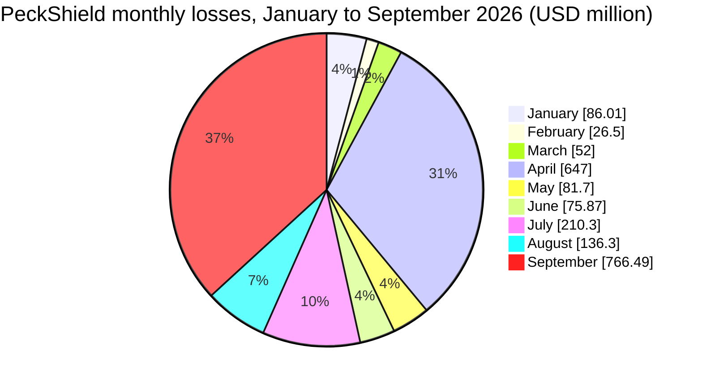
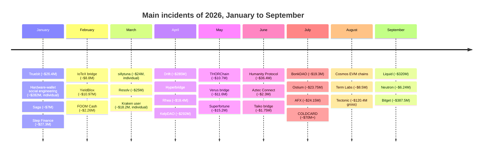
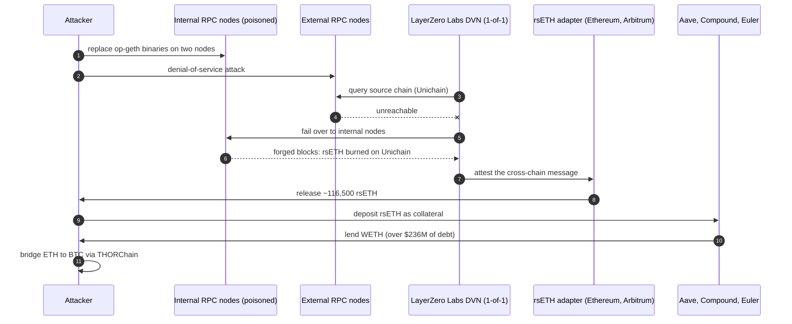
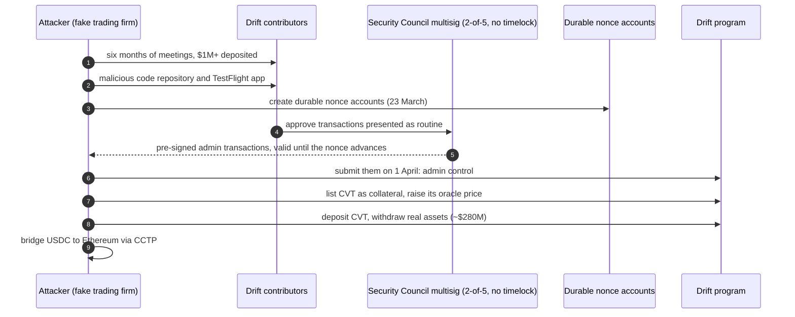

From January to September 2026, the crypto industry lost about $2.1B to hacks. PeckShield counted 306 major hacks for about $2.08B, the SlowMist Hacked database lists 303 incidents for about $2.13B (frauds excluded), and CertiK, which also counts phishing, reached about $2.44B. The year had two spikes. In April, KelpDAO (about $292M) and Drift (about $285M) were drained within three weeks of each other; in September, Bitget (about $387.5M) and the Liquid Network sidechain (about $320M, most of it returned) did the same.

The four largest incidents share one trait: none of them was a smart contract bug in the usual sense. Two came from compromised operators (Bitget's security appliances, KelpDAO's single-verifier cross-chain message path), one from multisig signers who were socially engineered (Drift), and one from a verification cache in node software (Liquid). This article summarises the year so far, month by month and by root cause, using the [CryptoAlertHack](https://t.me/CryptoAlertHack) Telegram channel, the [SlowMist Hacked](https://hacked.slowmist.io/) database, [Rekt News](https://rekt.news/) and the projects' own post-mortems. The month of September has its own article, [Crypto Hacks of September 2026]({{site.url_complet}}/2026/10/06/crypto-hacks-september-2026/), which this one does not repeat in detail.

> This article has been made with the help of [Claude Code](https://claude.com/product/claude-code) and several custom skills

[TOC]

## Scope, sources and caveats

The article covers incidents that occurred between 1 January and 30 September 2026, with a short note on the first week of October. Three sources are combined:

- **The CryptoAlertHack Telegram channel.** It relays alerts from PeckShield, CertiK, SlowMist, GoPlus, BlockSec Phalcon, Cyvers, Beosin, Rekt News, ZachXBT and others. The export used here holds 1,505 messages from 1 January to 7 October 2026, including the monthly summaries PeckShield and CertiK post at each month end.
- **The SlowMist Hacked database.** It gives one row per incident with a date, an attack method and a stated loss. The statistics below are computed from it with a script, not by hand.
- **Rekt News and official post-mortems.** They give the root cause of the larger incidents.

The figures need four caveats:

- **Trackers count differently.** PeckShield counts "major hacks" and leaves scams out; CertiK includes phishing (about $311M of its January total comes from phishing); SlowMist lists anything it can document, including incidents with no stated loss. The three totals are therefore close but not equal.
- **USD values are approximate.** A loss in crypto is valued at a moment (first alert, post-mortem, month end) and at a price, so every USD figure here is written with "about" or "~".
- **Gross is not net.** Liquid's ~$320M includes 3,400 BTC that were returned; Tectonic's ~$120.4M includes ~$111.2M recovered by a chain rollback. Where a recovery is known, it is given.
- **Individual victims are tracked separately.** The ~$282M hardware-wallet social-engineering theft of 10 January, the ~$24M taken from one holder under threat of physical harm in March, and the ~$18.2M Kraken user theft are not protocol hacks. CertiK counts some of them as phishing; PeckShield and SlowMist mostly do not.

## 2026 in numbers

### Month by month

The table puts the trackers' monthly figures side by side. PeckShield and CertiK are taken from their month-end posts relayed in the channel; SlowMist is computed from the database.

| Month | PeckShield hacks | PeckShield loss | CertiK loss | SlowMist incidents | SlowMist loss | Largest incident |
|-------|--:|--:|--:|--:|--:|------|
| January | 16 | ~$86.0M | ~$370.3M (incl. ~$311.3M phishing) | 22 | ~$100.2M | Step Finance |
| February | 15 | ~$26.5M | ~$35.7M | 13 | ~$23.0M | YieldBlox (Blend V2) |
| March | 20 | ~$52M | ~$59.5M | 28 | ~$40.3M | Resolv |
| April | 40 | ~$647M | ~$651M | 41 | ~$639.0M | KelpDAO, Drift |
| May | 40 | ~$81.7M | ~$68.3M | 41 | ~$79.0M | Superfortune |
| June | 40 | ~$75.9M | ~$81.7M | 38 | ~$74.6M | Humanity Protocol |
| July | 30 | ~$210.3M | ~$187.7M | 34 | ~$224.5M | COLDCARD |
| August | 50 | ~$136.3M | ~$214.7M | 37 | ~$187.7M | Tectonic |
| September | 55 | ~$766.5M | ~$772.4M | 49 | ~$760.0M | Bitget |
| **Total** | **306** | **~$2.08B** | **~$2.44B** | **303** | **~$2.13B** | |

Two details explain most of the differences:

- **January.** CertiK's ~$370.3M includes ~$311.3M of phishing, most of it the ~$282M individual theft; PeckShield's hack-only figure is ~$86.0M.
- **July.** PeckShield's July post gives ~$210.3M, but its August post refers to "July's $270M", presumably after the COLDCARD losses grew. CertiK also revised its first quarter to about $501M across 145 incidents, above the sum of its three monthly posts, and its [Hack3d H1 2026 report](https://www.certik.com/skynet-report/certik-hack3d-h1-2026-report) gives about $1.32B across 344 incidents for the first half.

April and September together hold about 68% of the year's losses by PeckShield's count. In the seven other months the total stayed between ~$26.5M and ~$210M.

For comparison, PeckShield put 2025 at about $4.04B of total theft, of which ~$2.67B came from hacks and ~$1.37B from scams and phishing. By the end of September, 2026 hacks had already reached about 78% of the 2025 hack total.

### The largest incidents

The table combines the trackers' rankings. The category names what was attacked; the loss is the gross figure, with recoveries noted.

| Rank | Date | Incident | Category | Reported loss (approx. USD) | Root cause (summary) |
|:---:|------|----------|----------|--:|----------------------|
| 1 | 24 Sep | Bitget | CEX | $387.5M | Third-party security appliances compromised, wallet job server taken over, forged withdrawals |
| 2 | 6 Sep | Liquid Network | Sidechain / cross-chain bridge | $320M (3,400 BTC returned) | Range-proof verification cache collision in Elements |
| 3 | 18 Apr | KelpDAO (rsETH) | Cross-chain bridge (LayerZero) | $292M (Kelp: 163,200 ETH shortfall) | Poisoned RPC nodes made the 1-of-1 DVN attest a forged message; LayerZero attributes it to DPRK (preliminary) |
| 4 | 1 Apr | Drift Protocol | DeFi (Solana perpetuals DEX) | $285M | Multisig signers socially engineered into pre-signing durable-nonce admin transactions |
| 5 | 30 Aug | Tectonic | DeFi lending (Cronos) | $120.4M ($111.2M recovered by rollback) | TONIC collateral pumped ~300x, then borrowed against |
| 6 | July | COLDCARD | Hardware wallet | $70M to $130M | Firmware fell back to a guessable software RNG, seeds brute-forced offline |
| 7 | 9 Jun | Humanity Protocol | Token / infrastructure | $31M to $36.4M | A foundation member's keys compromised; seven admin keys on one laptop, per Rekt News |
| 8 | 31 Jan | Step Finance | DeFi (Solana) | $27.3M to $40M (Step: ~$40M) | Executive team's devices compromised, treasury drained |
| 9 | 8 Jan | Truebit | Smart contract (legacy) | $26.4M | Integer overflow in the TRU purchase pricing of unverified bytecode |
| 10 | 22 Mar | Resolv (USR) | Stablecoin | $25M | AWS KMS key compromised through a contractor; 80M USR minted |
| 11 | 22 Jul | AFX | Cross-chain bridge (Arbitrum) | $24.15M | Five of seven validator signatures produced by the attacker |
| 12 | 15 Jul | Ostium | DeFi (perpetuals) | $23.75M | Off-chain price-feed infrastructure compromised, forged price reports |
| 13 | 6 Jul | BonkDAO | Governance | $19.3M to $21M | Malicious treasury proposal passed with 2.9% turnout |
| 14 | 16 Apr | Rhea Finance | DeFi (NEAR) | $18.4M ($9M frozen or recovered) | Margin parser counted fake swap-route minimums as collateral |

Below them, about seventeen incidents sit between $10M and $20M, and 75 between $1M and $10M. Two individual thefts would rank in this table if counted: the ~$282M hardware-wallet social-engineering scam of 10 January and the ~$24M taken from one holder in March under threat of physical harm.

### Statistics from the SlowMist database

The figures below are computed from the entries of the [SlowMist Hacked](https://hacked.slowmist.io/) database dated from January to September, after removing one duplicate row and one fraud (the fake GIWA bridge, covered in [Frauds and scams](#frauds-and-scams) and not counted as a hack). They use the database's own loss figures, before recoveries:

- **303 incidents**, of which 270 have a stated loss, for **~$2.13B**.
- **Median loss: ~$407k.** Six incidents of $100M or more make up about 71% of the total; the 70 incidents below $100k add up to about $3M.
- **Monthly variation.** The database records between 13 incidents (February) and 50 (September) per month, and the monthly loss varies by a factor of about 33.

| Size band | Incidents | Loss (approx. USD) | Share of loss |
|---|--:|--:|--:|
| ≥ $100M | 6 | $1.51B | 70.8% |
| $10M to $100M | 17 | $310.9M | 14.6% |
| $1M to $10M | 73 | $269.5M | 12.7% |
| $100k to $1M | 104 | $38.9M | 1.8% |
| < $100k | 70 | $3.0M | 0.1% |
| Not stated | 33 | n/a | n/a |

By category, smart contract bugs are again the most frequent incidents and a small share of the money:

| Category | Incidents | Loss (approx. USD) | Share of loss |
|---|--:|--:|--:|
| Key / infrastructure compromise | 44 | $726.9M | 34.2% |
| Cross-chain bridge / sidechain | 39 | $418.3M | 19.7% |
| Supply chain | 15 | $299.2M | 14.1% |
| Phishing / social engineering | 17 | $289.0M | 13.6% |
| Oracle / price manipulation | 31 | $181.8M | 8.5% |
| Smart contract vulnerability | 125 | $128.1M | 6.0% |
| Other / unknown | 26 | $49.7M | 2.3% |
| Governance attack | 6 | $35.3M | 1.7% |

The category is derived from the database's attack method first, and from the target and description when the method is generic. SlowMist files KelpDAO as a supply chain attack and Drift as social engineering, which places the two April incidents in different rows although both were operator compromises; read the table as a classification of attack methods, not of victims. The first six entries of October (~$4.8M) are excluded.

## The four largest incidents

### Bitget (~$387.5M, September)

Bitget's hot and warm wallets were drained on 24 September. According to [Mandiant's status report](https://img.bgstatic.com/multiLang/events/MFR26-1029_Status_Update_Bitget_0930.pdf), the attacker gained privileged access to two third-party security appliances, installed a web shell and a command-and-control connection on one of them, moved to the production wallet job server and deployed malicious packages there. The wallet system then signed the withdrawals itself; no private key was stolen. Bitget covered the loss from its Protection Fund (5,500 BTC).

[Chainalysis](https://www.chainalysis.com/blog/387m-bitget-theft-2026/) attributes the theft to North Korea, which it says takes North Korea's thefts in 2026 above $1B, and [Elliptic](https://www.elliptic.co/insights/bitget-attack-pushes-suspected-north-korea-crypto-heists-over-1-billion-in-2026/) rates the link "highly likely" on the strength of on-chain connections to earlier North Korean thefts, including Bybit's laundering addresses; the funds were spread across four blockchains within three hours. The [September article]({{site.url_complet}}/2026/10/06/crypto-hacks-september-2026/) covers the incident in detail.

### Liquid Network (~$320M, September)

On 6 September, an attacker created about 4,000 L-BTC with no bitcoin behind them on the Liquid sidechain and pegged them out to real BTC. Elements, Liquid's node software, cached range-proof verification results under a key built by concatenating variable-length fields without length prefixes, so two different transactions could share one cache entry. The attackers returned 3,400 BTC as a self-declared "whitehat" and kept about 598.5 BTC, which the Liquid Federation disputes; [Chainalysis' analysis](https://www.chainalysis.com/blog/320m-exploit-liquid-network/) reproduces the on-chain messages they used to negotiate. The fix shipped in Elements v23.3.4.

### KelpDAO (~$292M, April)

On 18 April, an attacker released about 116,500 rsETH from KelpDAO's LayerZero adapter on Ethereum and Arbitrum. Kelp's [statement](https://x.com/KelpDAO/status/2046332070277091807) puts the initial shortfall at 163,200 ETH; LayerZero's [statement](https://x.com/LayerZero_Core/status/2046081551574983137) gives about $290M.

The rsETH path from Unichain relied on a single decentralised verifier network (DVN), LayerZero Labs' own, in a 1-of-1 configuration. LayerZero's [incident statement](https://layerzero.network/blog/kelpdao-incident-statement) and [Chainalysis' analysis](https://www.chainalysis.com/blog/kelpdao-bridge-exploit-april-2026/) describe the same sequence:

- **Reconnaissance.** The attackers obtained the list of RPC nodes the DVN queried, and gained access to two internal nodes running on separate clusters.
- **Poisoned nodes.** They replaced the `op-geth` binaries on those nodes. The modified nodes answered the DVN with forged data while returning truthful data to every other client, which kept monitoring blind.
- **Forced failover.** A simultaneous denial-of-service attack on the external RPC nodes left the DVN with only the two poisoned nodes to query.
- **Forged attestation.** Those nodes reported blocks in which rsETH had been burned on Unichain, a burn that never happened. With no second DVN required to agree, the attestation was enough, and the adapter on Ethereum and Arbitrum released about 116,500 rsETH.

A second attempt on 40,000 rsETH (~$95M) was blocked.

LayerZero and Chainalysis both attribute the attack to the Lazarus Group, more specifically its TraderTraitor sub-group. The two companies disagree on responsibility: Kelp points to LayerZero's 1-of-1 default; LayerZero writes that it had communicated "best practices around DVN diversification" and that "despite these recommendations, KelpDAO chose to utilize a 1/1 DVN configuration". LayerZero now refuses new 1-of-1 configurations and is asking single-DVN applications to migrate; according to The Block, it later apologised publicly.

The aftermath spread to lending markets:

- **Collateral, not just cash.** The attacker deposited the stolen rsETH in Aave V3, Compound V3 and Euler and borrowed WETH against it, leaving more than $236M of debt. Aave froze the affected WETH and rsETH reserves and set the WETH loan-to-value to zero while a coalition, DeFi United, organised the recovery described below. The run on Aave was larger than the theft: [according to Protos](https://protos.com/aave-tvl-still-down-43-since-kelpdao-hack/), deposits fell by more than $8B within two days, its stablecoin pools hit 100% utilisation, combined bad debt on Aave and Compound was estimated at ~$246M, and Aave's TVL was still about 43% below its level on the day of the hack in August, although its contracts and liquidations had worked as designed.
- **A Layer 2 freeze.** The Arbitrum Security Council froze 30,766 ETH (~$70M) held by the attacker on Arbitrum One, acting, in its words, "with input from law enforcement". Kelp also recovered 40,300 rsETH and blocked a further attempt on 40,000 rsETH; its [recovery update](https://x.com/KelpDAO/status/2047599909692727799) leaves a gap of about 89,500 ETH, of which partners pledged about 43,500 ETH.
- **Precautionary pauses elsewhere.** Projects using the same bridge stack reacted before the root cause was known. The Morpho Association [paused](https://x.com/Morpho/status/2045760409244725340) the LayerZero bridge for its MORPHO token on Arbitrum the same day, until the cause of the rsETH incident was identified; LayerZero said at the time that all other applications remained safe.
- **Laundering.** The rest was moved to Bitcoin, about 1,979 BTC, mostly through THORChain, within six days.

The recovery, coordinated by Aave and the DeFi United coalition with Kelp, LayerZero, Compound and several DAOs, took about a month. Aave's posts give the sequence:

- **28 April, plan.** The [technical implementation plan](https://x.com/aave/status/2048958367658332413) found about 107,000 of the 116,500 rsETH in seven attacker addresses with positions on Aave and Compound. It had two goals: restore rsETH's backing at its exchange ratio of 1.07 ETH by depositing ETH into the bridge lockbox, and unwind the attacker's positions through a controlled liquidation, with the rsETH oracle price adjusted temporarily for that purpose. The plan expected to recover about 13,000 ETH on Aave and about 16,776 ETH on Compound "without socializing losses".
- **1 to 9 May, a court detour.** Plaintiffs holding judgments against North Korea served a restraining notice on Arbitrum DAO to seize the ~$71M of ETH frozen by its Security Council. Aave LLC contested it, and the judge [authorised](https://x.com/aave/status/2052928584667275472) an Arbitrum DAO vote to move the ETH to Aave LLC, with the restraining order following it; Aave borrowed separate funds to cover the gap meanwhile. Arbitrum DAO and Mantle DAO passed proposals to join the recovery.
- **6 May, liquidation.** The attacker's eight positions on Aave V3 were liquidated and the rsETH sent to a Recovery Guardian; other users, including Umbrella stakers, were not affected.
- **12 May, supply neutralised.** The liquidated rsETH was [burned on Arbitrum](https://x.com/aave/status/2054307857642971225), and Kelp retired the pending LayerZero packet so that it could not mint rsETH on Ethereum.
- **13 and 14 May, restart.** The [first tranche](https://x.com/aave/status/2054651122082791528) of rsETH went back into the LayerZero adapter and bridging reopened; rsETH was [unpaused](https://x.com/aave/status/2054989148159873499) on Aave's Ethereum Core, Arbitrum, Base, Linea and Mantle markets, and withdrawals resumed, with the remaining tranches due over two weeks.
- **17 May, normal operation.** WETH loan-to-value ratios were [restored](https://x.com/aave/status/2056049190841594179) to their pre-incident values on all affected Aave V3 deployments.

The [cross-chain bridge threat model]({{site.url_complet}}/2026/07/31/cross-chain-bridge-threat-model/) states the same rule for any bridge: the security of a cross-chain token is the security of its weakest message verifier, and a 1-of-1 configuration has no second opinion.

### Drift Protocol (~$285M, April)

Drift, a perpetuals exchange on Solana, was drained on 1 April of more than half its TVL. Drift's [first statement](https://x.com/DriftProtocol/status/2039564441256083878) says the attack was enabled by "pre-signed durable nonce transactions, allowing delayed execution" and the "compromise of multiple multisig signers' approvals, likely through targeted social engineering or transaction misrepresentation", and that no program was buggy and no seed phrase was compromised.

The attack ran in four steps, as reconstructed by SlowMist, GoPlus and Beosin:

- **Preparation.** A week earlier, Drift had moved to a 2-of-5 Security Council multisig with no timelock. On 23 March, the attacker created durable nonce accounts tied to council members.
- **Signatures.** Signers were led to approve transactions that, thanks to Solana's durable nonces, stayed valid indefinitely and could be submitted later.
- **Takeover.** On 1 April, the pre-signed transactions gave the attacker admin control of the Drift state account. It listed a worthless token, CVT, as collateral and pushed its oracle price up.
- **Drain.** CVT deposits were used to withdraw real assets, about $280M in seconds. Over $230M of USDC was then bridged from Solana to Ethereum through Circle's CCTP over several hours without being frozen, which ZachXBT criticised publicly.

Drift's [follow-up](https://x.com/DriftProtocol/status/2040611161121370409) describes a six-month operation. A fake "quant trading firm" built a relationship with the team, met contributors in person and deposited more than $1M; two contributors were then led to open a malicious code repository and a TestFlight app, which gave the attacker the access it needed to obtain the pre-signatures. Drift attributes the operation with medium-high confidence to UNC4736 (AppleJeus), a DPRK group it links to the Radiant hack, while noting that the people met in person were not North Korean. [Elliptic](https://www.elliptic.co/insights/drift-protocol-exploited-for-286-million-in-suspected-dprk-linked-attack/) reached the same conclusion from on-chain behaviour, laundering methods and network-level indicators, and counted Drift as the 18th North Korea-linked incident of 2026.

Press reports describe a Tether-led recovery package of up to about $147.5M.

## Operators, keys and infrastructure

Bitget, KelpDAO and Drift set the pattern for the rest of the year: the code did what it was told, and the attacker controlled who told it. The other incidents of this class:

- **Step Finance (31 January, ~$27.3M to ~$40M).** Step's [statement](https://x.com/StepFinance_/status/2018379876642804213) says the executive team's devices were compromised, through "a well known attack vector", and gives a loss of about $40M; trackers counted the 261,854 SOL unstaked from a treasury stake account (~$27.3M to ~$28.9M). About $4.7M was recovered. Rekt News: "The smart contracts worked flawlessly. The humans didn't."
- **Resolv (22 March, ~$25M).** Resolv's [post-mortem](https://x.com/ResolvLabs/status/2040480752643580252) traces a chain of access: a contractor's credential leaked from another, compromised project; it gave GitHub access; a malicious workflow pulled cloud credentials; and the attacker reached the signing key of the off-chain minting service (an AWS KMS key, according to press reports). With no effective mint cap and no oracle check, 80M USR were minted against about $200k to $300k of USDC and sold; the 80% depeg left bad debt in Morpho, Euler and Fluid markets that used USR. About 46M USR were later neutralised by burns and blacklisting.
- **Humanity Protocol (9 June, ~$31M to ~$36.4M).** Humanity's [statement](https://x.com/Humanityprot/status/2064167144120877127) says the private keys of a foundation member were compromised and links the exploit to DPRK-affiliated actors. Rekt News adds that seven admin keys were held on one laptop with no timelock; the attacker upgraded the H token contract with a backdoor and moved tokens from about 280 wallets. Humanity replaced the token with a new one airdropped from a pre-attack snapshot, excluding the attacker's addresses.
- **AFX (22 July, ~$24.15M)** and **Ostium (15 July, ~$23.75M).** At AFX, five of seven bridge validator signatures cleared the two-thirds threshold; at Ostium, whose [statement](https://x.com/Ostium/status/2078640436688941194) gives a loss of 23,752,746 USDC, the off-chain price-feed infrastructure was compromised, and forged but valid-looking price reports (a $60k Bitcoin quote, per Rekt News) let the attacker open and close large positions against the LP vault.
- **THORChain (15 May, ~$10.7M).** THORChain's [exploit report](https://blog.thorchain.org/thorchain-exploit-report-1) describes a node operator, churned in two days earlier, that used a flaw in the GG20 threshold-signature scheme to leak key shares over signing rounds and rebuild one vault's key. Automatic solvency checks halted the network.
- **Others.** IoTeX's ioTube bridge (February, private key), Triple-A (July, ~$10M), Grinex (April, ~$13.7M, a sanctioned exchange that then shut down), Duelbits (September, ~$7M), D'CENT (September), and the Neutron governance takeover (September).

Dedaub's classification of 135 Rekt News incidents from January 2024 to August 2026 gives the long-run picture: stolen keys, phishing, malware and privileged access made up 32.6% of incidents and 66.9% of losses.

## Verification bugs in bridges, chains and proofs

The second class mints value instead of moving it: a verifier accepts something it never checked. These are the incidents with nine-figure potential, because the loss is bounded by what can be redeemed, not by a contract's balance.

| Date | System | Loss (approx. USD) | What was accepted or minted |
|------|--------|--:|---------------------------|
| 22 Jan | Saga (SagaEVM) | $7M | Forged IBC messages; Cosmos Labs traced the bug to the Ethermint codebase |
| 26 Feb | FOOM Cash (and Veil Cash) | $2.26M (net ~$420k after recovery) | Groth16 proofs forged because the verifier's setup step was skipped (`delta2 == gamma2`) |
| 13 Apr | Hyperbridge | $2.5M | A replayed or forged MMR proof that changed a token admin and minted 1B DOT |
| 18 May, 23 Jul | Verus-Ethereum bridge | $11.6M (75% returned) and $7.5M | Two different gaps in cross-chain import validation |
| 7 to 8 Jun | Syscoin bridge | $10M (Rekt: $8.56M; SYS returned on 10 Jun) | The relay path accepted a transaction proof it should have rejected, creating about 5 billion unbacked SYS |
| June | Aztec Connect, Aztec bridge | ~$4M combined | Proof and settlement layer processed different transaction sets |
| 21 to 22 Jun | Taiko bridge | ~$1.75M (users made whole) | Forged proofs from rogue SGX provers: the enclave signing key had been committed to Taiko's public repository, and attestation accepted debug-mode enclaves |
| 11 Jul | Bonzo Lend (Hedera) | $9.05M | A zero BLS signature `[0,0]` passed the oracle's pairing check |
| 21 Jul | Wanchain Cardano-BNB bridge | $10M (SlowMist; ~$13M per PeckShield) | A forged message minted 203M NIGHT |
| 20 to 25 Aug | Six Cosmos EVM chains (MANTRA, TAC, KiiChain…) | $5.72M (Cosmos Labs) | An unchecked underflow in `SubBalance` reached through vesting delegation |
| 6 Sep | Liquid Network | $320M | Range-proof cache key collision |
| 24 Sep | Payy | $1.92M | The verifier accepted an invalid burn proof |

Several of these exploited cryptographic verification itself, which the site's record of [zero-knowledge proof hacks]({{site.url_complet}}/2026/06/19/zkp-hacks-history/) tracks. Rekt News called the FOOM and Veil cases "the first confirmed live exploits of ZK cryptography", caused by "a setup ceremony nobody finished".

## Smart contracts, oracles and governance

### Legacy code

Old, unmaintained contracts were a recurring target. Truebit (January, ~$26.4M), the year's first large hack, was an integer overflow in the pricing of a legacy purchase contract whose bytecode was never verified; Rekt News noted that "the archives have clearly become a shopping list". It was followed by DxSale's 2021 locker (May, ~$7.3M), Aztec Connect (June), Notional V1 (September, deprecated since 2022) and others. In one week of June, BlockThreat counted five retired contracts hacked.

### Oracle and price manipulation

- **Tectonic (30 August, ~$120.4M gross).** TONIC was pumped about 300 times on Cronos and used as collateral; Cronos rolled back 10,961 blocks to recover ~$111.2M, leaving ~$9.19M lost.
- **YieldBlox on Blend V2 (February, ~$10.97M).** An illiquid collateral, USTRY, was pumped 100x on the Stellar DEX and the oracle reported the price.
- **Rhea Finance (April, ~$18.4M).** Fake tokens and swap routes misled the margin parser on NEAR.
- **Moonwell (February, ~$1.78M).** An oracle misconfiguration priced cbETH at $1.12 instead of about $2,200; Rekt News noted the commit was co-authored by an AI model.
- **Aave (March, ~$27.8M liquidated).** A misconfigured oracle cap triggered healthy wstETH liquidations; no attacker was involved, and Aave planned full reimbursement.

### Governance

Token-weighted governance with low turnout was attacked three times. BonkDAO (July, ~$19.3M) passed a treasury transfer hidden in a routine proposal with 2.9% turnout; Term Labs (August, ~$8.5M) fell to near-zero participation; and the Neutron takeover (September) bought the deciding stake for about $20k, 11 minutes before the vote closed.

## Wallets and individuals

- **COLDCARD (July).** Coinkite's [warning](https://blog.coinkite.com/coldcard-mk3-seed-generation-warning/) and [technical backgrounder](https://blog.coinkite.com/entropy-technical-backgrounder/) explain the defect: from firmware 4.0.1 (March 2021), a build and link error made the library function `rng_get()` resolve to MicroPython's Yasmarang software generator instead of the hardware random number generator. Seeds generated on Mk2 and Mk3 devices became brute-forceable offline; on later models the effective entropy fell to about 72 bits instead of 128. Coinkite gives no loss figure and states that the devices were not "hacked". [Protos](https://protos.com/coldcard-co-founder-is-deleting-x-posts-as-losses-top-130m/) reported losses above $130M by early August and a public apology from co-founder NVK, who also deleted an early post saying there was "no need to panic". Estimates grew from ~$38M at disclosure to ~$70M (PeckShield's July figure) and ~$130M stolen by at least 15 attackers (Rekt News, August). The site covers the defect in [When the Hardware RNG Was Not Called]({{site.url_complet}}/2026/07/31/coldcard-rng-entropy-incident/).
- **Hardware-wallet social engineering (10 January, ~$282M).** A victim lost 2.05M LTC and 1,459 BTC to a scam impersonating hardware-wallet support. The attacker converted part of it to Monero, which moved the XMR price.
- **Wrench attacks.** About $24M was taken from one holder in March under threat of physical harm; CertiK counted 29 wrench attacks in Europe in 2025, and at least 13 in France by mid-March 2026.
- **Phishing and address poisoning.** Losses of $12.3M (January), $600k (February) and $305k (October) to address poisoning, and a steady stream of `Permit` and approval phishing.
- **Supply chain.** Compromised browser extensions (MEXC API keys, January), Open VSX and npm packages (GlassWorm, Mini Shai-Hulud), a Holdstation app update (February, 462,000 USDT) and malicious AI-agent skills (OpenClaw) all targeted wallet keys.

## Frauds and scams

Frauds are not hacks: nobody broke into a system, the victims sent their funds to a scheme. They are listed here and **not counted in the hack totals** of this article. The trackers' lists for 2026 contain few of them:

| Date | Scheme | Loss (approx. USD) | What happened |
|------|--------|--:|---------------|
| 26 Sep | Fake GIWA bridge | $2M | A fake network imitating Upbit's GIWA L2 collected ~767.65 ETH from about 1,335 addresses. |

Two other losses described above are close to fraud but are counted differently. The ~$282M taken from one person in January was a social-engineering theft of the victim's own wallet, which CertiK counts as phishing. Trove Markets, which [Rekt News](https://rekt.news/trove-of-bs) described as keeping $9.4M raised from investors, is a project-conduct case rather than a hack and is not in the SlowMist totals.

## Official post-mortems and statements

The table records, for the year's main incidents, what the affected project published itself, as of 7 October 2026. Posts on X are read through a public mirror and labelled as such. Incidents of September are covered in the [September article]({{site.url_complet}}/2026/10/06/crypto-hacks-september-2026/).

| Incident | Official source | What it says |
|----------|-----------------|--------------|
| KelpDAO / LayerZero | [Kelp statement](https://x.com/KelpDAO/status/2046332070277091807), [Kelp recovery update](https://x.com/KelpDAO/status/2047599909692727799), [LayerZero statement](https://x.com/LayerZero_Core/status/2046081551574983137), all on X; [LayerZero incident statement](https://layerzero.network/blog/kelpdao-incident-statement), Aave's [recovery plan](https://x.com/aave/status/2048958367658332413) and [updates](https://x.com/aave/status/2052928584667275472) on X | 163,200 ETH shortfall; poisoned RPC nodes and a 1-of-1 DVN; 40,300 rsETH recovered; DPRK attribution (preliminary); the two disagree on responsibility; DeFi United restored rsETH backing by mid-May. |
| Drift Protocol | [First statement](https://x.com/DriftProtocol/status/2039564441256083878) and [follow-up](https://x.com/DriftProtocol/status/2040611161121370409) on X | Durable-nonce pre-signatures and signers compromised through a six-month social-engineering operation; UNC4736 (DPRK), medium-high confidence. |
| COLDCARD (Coinkite) | [Mk3 seed-generation warning](https://blog.coinkite.com/coldcard-mk3-seed-generation-warning/), [entropy technical backgrounder](https://blog.coinkite.com/entropy-technical-backgrounder/), [adding to the public record](https://blog.coinkite.com/adding-to-public-record/) | `rng_get()` linked to a software PRNG since firmware 4.0.1; patched firmware; no loss figure. |
| Step Finance | [Statement on X](https://x.com/StepFinance_/status/2018379876642804213) | Executive devices compromised; ~$40M; ~$4.7M recovered. |
| Humanity Protocol | [Statement](https://x.com/Humanityprot/status/2064167144120877127) and [recovery plan](https://x.com/Humanityprot/status/2066825020530127313) on X | Foundation member's keys compromised; DPRK-linked; new token airdropped from a pre-attack snapshot. |
| Truebit | [Statement on X](https://x.com/Truebitprotocol/status/2009328032813850839) | Names the Purchase contract only; no root cause or loss figure. |
| Resolv | [Post-mortem on X](https://x.com/ResolvLabs/status/2040480752643580252) | Contractor credential, GitHub workflow, cloud credentials, minting key; ~46M USR neutralised; pre-hack holders redeemed 1:1. |
| AFX | [Statements on X](https://x.com/AFX_XYZ/status/2080126901205770734) | Custody bridge compromised; vector under investigation with Zellic. |
| BonkDAO | [Statement on X](https://x.com/bonk_inu/status/2074191403781906800) | Malicious governance proposal; attacker bought BONK beforehand. |
| Ostium | [Statement on X](https://x.com/Ostium/status/2078640436688941194) | 23,752,746 USDC; price-feed infrastructure compromised; Ostium Labs to cover from its balance sheet. |
| Rhea Finance | [Statement on X](https://x.com/rhea_finance/status/2045203607856042118) | Slippage check summed `min_amount_out` across chained swaps; part of the funds re-deposited or frozen. |
| Superfortune | [First statement](https://x.com/SUPERFORTUNE888/status/2059818459421372485) and [update](https://x.com/SUPERFORTUNE888/status/2060250707757044150) on X | First suspected address poisoning, then a compromised multisig signer key. |
| SwapNet, Aperture | Matcha Meta post-mortem (not reachable for verification), [Aperture statement on X](https://x.com/ApertureFinance/status/2015938720453820752) | Arbitrary call in closed-source contracts; Matcha counts ~$13.43M for 18 users, Aperture ~$3.4M to ~$3.7M. |
| Triple-A | [Official statement](https://triple-a.io/newsroom/official-statement-regarding-recent-wallet-activity) | Unauthorised access to treasury wallets; absorbed by the company; client funds unaffected. |
| Verus-Ethereum bridge (May) | [Statements on X](https://x.com/VerusCoin/status/2058171278096228621) | 4,052 ETH (about 75%) returned; the rest kept as a bounty. |
| THORChain | [Exploit report](https://blog.thorchain.org/thorchain-exploit-report-1) | GG20 key-share leak by a newly churned node; recovery left to governance. |
| YieldBlox (Blend V2) | [Script3 statements on X](https://x.com/script3official/status/2026013344453501130) | Contained to one community pool; about 48M XLM quarantined by validators; depositors compensated. |
| Syscoin bridge | [Preliminary post-mortem](https://x.com/syscoin/status/2063749418365665413) and [update](https://x.com/syscoin/status/2064616775829102889) on X | Relay accepted a wrong proof; the SYS was returned on 10 June. |
| Taiko | [Post-mortem](https://paragraph.com/@taiko-labs/taiko-security-incident-a-postmortem-and-next-steps) | Enclave signing key committed to the public repository and debug-mode enclaves accepted by attestation; ~$1.75M taken, more than $11M held back by withdrawal limits; users made whole and the bridge reopened on 2 July. |
| Wanchain, Grinex | none found | No official write-up located; Chainalysis suggests Grinex's "cyberattack" looks more like insider fraud or an exit scam. |
| Hardware-wallet victim (January) | [ZachXBT's report](https://t.me/investigations/302) | Not a protocol; no victim statement. |

Official reports changed several figures, as the table shows: Step Finance and Ostium give higher losses than the trackers; Coinkite and Truebit give none; Matcha's SwapNet figure is lower than PeckShield's, which merged in Aperture. The Drift and Resolv posts now display under renamed accounts (VelocityDEX, Vault_St) but were published by the original handles.

## Observations

- **Losses concentrate in a few events.** Six incidents of $100M or more account for about 70% of the SlowMist total, and two months (April, September) for about two-thirds of PeckShield's.
- **The largest losses came from operators, not from contract code.** Bitget, KelpDAO, Drift, Step, Resolv, Humanity, AFX and Ostium were all lost through infrastructure, keys or signers.
- **Minting bugs set the ceiling.** When a verifier accepts a false message or proof (Liquid, KelpDAO's forged message, Verus, Syscoin), the loss is bounded by what can be redeemed, which is why these incidents rank so high.
- **North Korea is named in the largest cases.** Drift (UNC4736, medium-high confidence), LayerZero for KelpDAO (Lazarus / TraderTraitor, preliminary) and Humanity Protocol attribute their incidents to DPRK-linked actors in their own statements, and Chainalysis and Elliptic both attribute Bitget to North Korea, putting its 2026 thefts above $1B (Elliptic counts more than 51 incidents); PeckShield noted that Humanity proceeds were commingled with KelpDAO funds.
- **Recovery came from chains, coalitions and negotiation.** The Cronos rollback, the Arbitrum Security Council freeze, the DeFi United recovery of rsETH, the Neutron and Cosmos Hub halts, and the Liquid return recovered far more than stablecoin freezes did.
- **THORChain and Tornado Cash remained the main exits**, used in almost every large case.

## Data gaps

This section lists what could not be found or verified while writing this article, so that it can be completed later. Each row says what is missing and where to look first.

| Gap | What is missing or unverified | Where to search |
|-----|-------------------------------|-----------------|
| Official post-mortems | None found for Wanchain, Grinex, Nostra, Meter, Limit Break, Startale and NuNet; Matcha's SwapNet post-mortem could not be opened for verification. | Project websites and X accounts; meta.matcha.xyz |
| Truebit, AFX | Truebit published no root cause or loss figure; AFX's vector was still under investigation with Zellic. | Truebit and AFX accounts, Zellic |
| COLDCARD total | Coinkite gives no loss figure; estimates range from ~$70M (PeckShield) to ~$130M (Rekt). | Coinkite blog, Galaxy Research, TRM Labs, CertiK |
| PeckShield monthly figures | February's summary was read in an earlier export but is missing from the final one; July is given as ~$210.3M in July's post and ~$270M in August's. | PeckShieldAlert posts of 1 March and 1 August 2026 |
| CertiK quarterly figure | CertiK's Q1 total (~$501M) exceeds the sum of its January–March posts (~$465.5M). | CertiK Hack3d Q1 2026 report |
| Telegram export coverage | The export has no messages for 2–4 January and 25–27 April 2026. | The CryptoAlertHack channel itself, or a new export |
| Press-only claims | LayerZero's public apology and end of 1-of-1 support (The Block) and Drift's Tether-led recovery package (~$147.5M) were seen only in press reports. | LayerZero and Drift official channels |
| Humanity Protocol dispute | ZachXBT first called the incident "possibly staged", then revised; not covered in the article. | ZachXBT's posts, The Block |
| Elliptic reports | Found for Bitget and Drift only; none for KelpDAO, Liquid, Resolv, COLDCARD, Humanity or Tectonic. | elliptic.co/insights, Google search |
| Taiko key exposure | The post-mortem says the enclave signing key was committed to the public repository but not when, nor whether it came in through a pull request. | Commit history of `docker/enclave-key.pem` in Taiko's raiko repository |

## Conclusion

From January to September 2026, trackers counted about 300 hacks and $2.1B to $2.4B in losses, depending on scope.

- **Two months dominate.** April (KelpDAO, Drift) and September (Bitget, Liquid) hold about two-thirds of the losses.
- **Operators were the main attack surface.** Compromised infrastructure, keys and multisig signers account for the largest incidents, and smart contract bugs, though most numerous, for a small share of the money.
- **Verification failures minted value** in bridges, chains and proof systems, from Liquid's cache to forged Groth16 proofs.
- **Legacy contracts, oracles and low-turnout governance** produced a long tail of smaller losses.
- **Individuals lost large sums outside protocol hacks**, through social engineering, physical threats and a hardware wallet RNG defect.

## Annex

### Key Terms

| Term | Definition |
|------|------------|
| **Hot / warm wallet** | Exchange wallets whose keys are online or semi-online to process withdrawals quickly; Bitget lost funds from both. |
| **Multisig** | A wallet or program that requires M of N signatures to act, such as Drift's 2-of-5 Security Council. |
| **Durable nonce** | A Solana mechanism that keeps a signed transaction valid indefinitely, used against Drift to submit pre-signed admin transactions later. |
| **Social engineering** | Manipulating people (signers, support staff, holders) into approving or revealing something, rather than breaking code. |
| **Private key compromise** | Theft or leak of the key, seed or credentials that authorise transactions; the contracts then execute the attacker's calls as legitimate. |
| **Bridge** | A system that locks or burns an asset on one chain and releases or mints its representation on another on the strength of a message or proof. |
| **DVN (decentralised verifier network)** | In LayerZero, an entity that attests a cross-chain message; an application chooses how many must agree, and KelpDAO's rsETH path used one. |
| **Sidechain / peg-out** | A chain pegged to Bitcoin whose reserves are custodied by a federation; a peg-out converts the pegged asset back into BTC. |
| **Range proof** | A zero-knowledge proof that a hidden amount is in a valid range; Liquid cached their verification results. |
| **Groth16 trusted setup** | The parameter generation of a Groth16 verifier; skipping a step left `delta2 == gamma2` in FOOM and Veil and allowed forged proofs. |
| **Oracle manipulation** | Moving or forging the price a protocol reads, so that worthless collateral can be borrowed against. |
| **Governance attack** | Using acquired or borrowed voting power to pass a proposal that transfers treasury funds or contract control. |
| **Legacy contract** | A deprecated contract that still holds funds or approvals, a frequent target in 2026. |
| **Threshold signature (TSS)** | A key split among nodes so that a quorum can sign; THORChain's GG20 implementation leaked key material. |
| **Address poisoning** | Sending dust from a look-alike address so that the victim later copies the wrong address. |
| **Wrench attack** | Theft under threat of physical violence. |
| **Supply-chain attack** | Compromise of a dependency (package, extension, app update, contractor) to reach its users. |

## Frequently Asked Questions

**Q: How much was stolen in crypto hacks in 2026 so far, and why do the totals differ?**

From January to September, PeckShield counted 306 major hacks and about $2.08B, SlowMist lists 303 incidents and about $2.13B (frauds excluded), and CertiK reports about $2.44B. CertiK includes phishing, which adds about $311M in January alone, while PeckShield counts hacks only. Valuation dates and revisions explain the rest.

**Q: Which were the largest incidents of the year, and what did they have in common?**

Bitget (~$387.5M), Liquid Network (~$320M), KelpDAO (~$292M) and Drift (~$285M). None was a classic smart contract bug:

- Bitget lost control of its withdrawal infrastructure through third-party security appliances.
- KelpDAO's bridge accepted a forged message through a single verifier.
- Drift's multisig signers were socially engineered into pre-signing admin transactions.
- Liquid's node software accepted transactions through a flawed verification cache.

**Q: How did durable nonces make the Drift attack possible?**

A normal Solana transaction expires quickly because it references a recent blockhash. A durable nonce replaces that blockhash with a stored nonce, so a signed transaction stays valid until the nonce is advanced. The attacker obtained signers' approvals in advance and submitted them later, at the moment of its choosing, which gave it admin control without a live compromise of the keys at that time.

**Q: Why do bridge and proof verification bugs cause such large losses?**

A transfer bug is limited by the balance a contract holds or is approved to spend. A verification bug creates claims: unbacked L-BTC on Liquid, rsETH released by a forged message, SYS outputs on Syscoin. Those claims can then be redeemed against reserves or used as collateral elsewhere, as KelpDAO's rsETH was on Aave, so the loss is limited only by available liquidity.

**Q: What did the year teach about recovery?**

Recovery came mostly from chain-level actions and negotiation rather than from stablecoin freezes:

- Cronos rolled back 10,961 blocks after Tectonic and recovered ~$111.2M.
- The Arbitrum Security Council froze 30,766 ETH linked to KelpDAO, and the DeFi United coalition restored rsETH's backing within a month by liquidating the attacker's Aave and Compound positions.
- Neutron and the Cosmos Hub halted and recovered about 64% of the Neutron loss.
- Liquid recovered 3,400 BTC through a contested "bounty"; Verus recovered 75%.

Stablecoin freezes, by contrast, recovered about 0.22% of Bitget's loss, and Circle was criticised for not freezing Drift's USDC during hours of CCTP transfers.

**Q: Combining the COLDCARD and Resolv cases, what do hardware and cloud key incidents share?**

In both, the cryptography was sound but the key's origin was not. COLDCARD devices generated seeds from a guessable software fallback instead of the hardware RNG, and the attacker obtained Resolv's minting key in AWS KMS through a compromised contractor. A key is as strong as the process that creates and holds it, which no on-chain check can verify.

## References

### Telegram channel and monthly summaries

- [CryptoAlertHack Telegram channel](https://t.me/CryptoAlertHack), messages from 1 January to 7 October 2026
- PeckShieldAlert monthly summaries: [January](https://x.com/PeckShieldAlert/status/2017925703489200292), [February](https://x.com/PeckShieldAlert/status/2028052972543127797), [March](https://x.com/PeckShieldAlert/status/2039198453012787514), [April](https://x.com/PeckShieldAlert/status/2050181065546023268), [May](https://x.com/PeckShieldAlert/status/2061353830437249033), [June](https://x.com/PeckShieldAlert/status/2072122134584004810), [July](https://x.com/PeckShieldAlert/status/2083388287688049084), [August](https://x.com/PeckShieldAlert/status/2094631045845164273), [September](https://x.com/PeckShieldAlert/status/2105505048377848307)
- [CertiK: Hack3d H1 2026 report](https://www.certik.com/skynet-report/certik-hack3d-h1-2026-report)
- [CertiK Alert: September 2026 losses](https://x.com/CertiKAlert/status/2105266411358634360) and [CertiK report dashboard](https://www.certik.com/certik-report/dashboard)
- [Dedaub: OpSec research on 135 Rekt incidents](https://go.dedaub.com/opsec-research)

### Official post-mortems and statements

- [Kelp DAO: rsETH incident statement (on X)](https://x.com/KelpDAO/status/2046332070277091807) and [recovery update (on X)](https://x.com/KelpDAO/status/2047599909692727799)
- [LayerZero: rsETH incident statement (on X)](https://x.com/LayerZero_Core/status/2046081551574983137)
- [LayerZero: KelpDAO incident statement](https://layerzero.network/blog/kelpdao-incident-statement)
- [Morpho: MORPHO OFT bridge on Arbitrum paused, 19 April 2026 (on X)](https://x.com/Morpho/status/2045760409244725340)
- Aave on X: [DeFi United technical implementation plan, 28 April 2026](https://x.com/aave/status/2048958367658332413), [recovery plan Phase II, 9 May 2026](https://x.com/aave/status/2052928584667275472), [first recovery steps complete, 12 May](https://x.com/aave/status/2054307857642971225), [first rsETH tranche and bridging reopened, 13 May](https://x.com/aave/status/2054651122082791528), [rsETH unpaused, 14 May](https://x.com/aave/status/2054989148159873499), [WETH LTVs restored, 17 May](https://x.com/aave/status/2056049190841594179)
- [Drift Protocol: incident statement (on X)](https://x.com/DriftProtocol/status/2039564441256083878) and [follow-up (on X)](https://x.com/DriftProtocol/status/2040611161121370409)
- [Coinkite: COLDCARD Mk3 seed generation warning](https://blog.coinkite.com/coldcard-mk3-seed-generation-warning/), [entropy technical backgrounder](https://blog.coinkite.com/entropy-technical-backgrounder/) and [adding to the public record](https://blog.coinkite.com/adding-to-public-record/)
- [Step Finance: statement (on X)](https://x.com/StepFinance_/status/2018379876642804213)
- [Humanity Protocol: statement (on X)](https://x.com/Humanityprot/status/2064167144120877127) and [recovery plan (on X)](https://x.com/Humanityprot/status/2066825020530127313)
- [Resolv: post-mortem (on X)](https://x.com/ResolvLabs/status/2040480752643580252)
- [Taiko Labs: Taiko security incident, a postmortem and next steps](https://paragraph.com/@taiko-labs/taiko-security-incident-a-postmortem-and-next-steps)
- [Ostium: statement (on X)](https://x.com/Ostium/status/2078640436688941194)
- [THORChain: exploit report](https://blog.thorchain.org/thorchain-exploit-report-1)
- [Triple-A: official statement regarding recent wallet activity](https://triple-a.io/newsroom/official-statement-regarding-recent-wallet-activity)
- [Mandiant: Bitget incident response status report, 28 September 2026 (PDF)](https://img.bgstatic.com/multiLang/events/MFR26-1029_Status_Update_Bitget_0930.pdf)
- [Liquid Federation: incident report, 8 September 2026 (on X)](https://x.com/Liquid_BTC/status/2097404704028545175)
- [Cosmos Labs: Cosmos EVM GHSA-7g4w-cg88-2cq2 post-mortem](https://github.com/cosmos/security/blob/main/communications/cosmos_evm_GHSA-7g4w-cg88-2cq2_post_mortem.md)
- [Solva: Neutron governance attack, final post-mortem (on X)](https://x.com/crypto_crew/status/2104924316357841306)

### Databases and Rekt News post-mortems

- [SlowMist Hacked database](https://hacked.slowmist.io/), January to September 2026 entries
- [Bitget - Rekt](https://rekt.news/bitget-rekt), [Liquid Network - Rekt](https://rekt.news/liquid-network-rekt), [KelpDAO - Rekt](https://rekt.news/kelpdao-rekt), [Drift Protocol - Rekt](https://rekt.news/drift-protocol-rekt)
- [Tectonic - Rekt](https://rekt.news/tectonic-rekt), [COLDCARD - Rekt](https://rekt.news/coldcard-rekt), [Humanity Protocol - Rekt](https://rekt.news/humanity-protocol-rekt), [Step Finance - Rekt](https://rekt.news/step-finance-rekt)
- [Truebit - Rekt](https://rekt.news/truebit-rekt), [Resolv Labs - Rekt](https://rekt.news/resolv-labs-rekt), [AFX - Rekt](https://rekt.news/afx-trade-rekt), [Ostium - Rekt](https://rekt.news/ostium-rekt), [BonkDAO - Rekt](https://rekt.news/bonkdao-rekt), [Rhea Finance - Rekt](https://rekt.news/rhea-finance-rekt)
- [THORChain - Rekt 3](https://rekt.news/thorchain-rekt3), [VerusCoin - Rekt](https://rekt.news/veruscoin-rekt), [Syscoin - Rekt](https://rekt.news/syscoin-rekt), [Hyperbridge - Rekt](https://rekt.news/hyperbridge-rekt), [Saga - Rekt](https://rekt.news/saga-rekt), [Aztec Connect - Rekt](https://rekt.news/aztec-connect-rekt)
- [YieldBlox - Rekt](https://rekt.news/yieldblox-rekt), [Moonwell - Rekt](https://rekt.news/moonwell-rekt), [Aave - Rekt](https://rekt.news/aave-rekt), [Bonzo Finance - Rekt](https://rekt.news/bonzo-finance-rekt), [DxSale - Rekt](https://rekt.news/dxsale-rekt), [IoTeX - Rekt](https://rekt.news/iotex-rekt)
- [Default settings (FOOM and Veil Cash) - Rekt](https://rekt.news/default-settings)

### Threat reports

- [Chainalysis: KelpDAO bridge exploit, April 2026](https://www.chainalysis.com/blog/kelpdao-bridge-exploit-april-2026/)
- [Chainalysis: How AI helped Chainalysis investigators trace the $387 million North Korea stole from Bitget](https://www.chainalysis.com/blog/387m-bitget-theft-2026/)
- [Elliptic: Drift Protocol exploited for $286 million in suspected DPRK-linked attack](https://www.elliptic.co/insights/drift-protocol-exploited-for-286-million-in-suspected-dprk-linked-attack/)
- [Elliptic: Bitget attack pushes suspected North Korea crypto heists over $1 billion in 2026](https://www.elliptic.co/insights/bitget-attack-pushes-suspected-north-korea-crypto-heists-over-1-billion-in-2026/)
- [Protos: Aave TVL still down 43% since KelpDAO hack](https://protos.com/aave-tvl-still-down-43-since-kelpdao-hack/)
- [Protos: COLDCARD co-founder is deleting X posts as losses top $130M](https://protos.com/coldcard-co-founder-is-deleting-x-posts-as-losses-top-130m/)
- [Chainalysis: How the $320M exploit of Liquid Network went down](https://www.chainalysis.com/blog/320m-exploit-liquid-network/)
- [The Hacker News: $285M Drift hack traced to six-month operation](https://thehackernews.com/2026/04/285-million-drift-hack-traced-to-six.html)
- [The Hacker News: $13.74M hack shuts down sanctioned Grinex](https://thehackernews.com/2026/04/1374m-hack-shuts-down-sanctioned-grinex.html)
- [CertiK: Verus incident analysis](https://www.certik.com/blog/verus-incident-analysis)

### Standards and projects

- [Elements project](https://elementsproject.org/)
- [Claude Code](https://claude.com/product/claude-code)

### Related articles

- [When the Hardware RNG Was Not Called - Anatomy of an Entropy Defect]({{site.url_complet}}/2026/07/31/coldcard-rng-entropy-incident/)
- [Cross-Chain Bridge Hacks - Ten Incidents, Five Failure Classes]({{site.url_complet}}/2026/07/31/cross-chain-bridge-hacks/)
- [Cross-Chain Bridge Threat Model - Assets, Trust Boundaries, STRIDE and Threat Register]({{site.url_complet}}/2026/07/31/cross-chain-bridge-threat-model/)
- [Zero-Knowledge Proof Hacks — A Documented Record of Exploits and Vulnerabilities (2023–2026)]({{site.url_complet}}/2026/06/19/zkp-hacks-history/)
- [Security of Cryptocurrency Exchanges - Overview]({{site.url_complet}}/2025/11/06/crypto-exchange-security-overview/)
