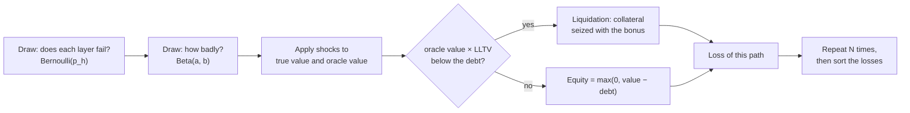

A DeFi position rarely depends on a single protocol. A leveraged loan backed by a yield-bearing token relies on the settlement chain, on the issuer of the token, on the oracle that prices it, on the market where it trades and on the lending venue that holds it as collateral. Each of these layers can fail, rarely and with very different consequences, and the loss they cause does not add up linearly because a liquidation threshold sits between the shock and the position.

Monte Carlo simulation is the standard way to reason about such a system. Instead of deriving the loss distribution in closed form, it draws thousands of possible futures at random, computes the loss in each one with a deterministic model of the position, and reads risk measures off the resulting sample. This article explains how the method works, how a DeFi position is modelled for it, which numbers come out of it and how they support a decision, and where the method's limits lie.

> This article has been made with the help of [Claude Code](https://claude.com/product/claude-code) and several custom skills

[TOC]

## Why risk analysis needs simulation

A risk manager holding a position wants three answers: how much the position loses on average over a horizon, how bad the bad cases are, and whether the expected loss justifies paying the cost of leaving now. All three are properties of a probability distribution of losses.

For a single asset with normally distributed returns, that distribution has a formula. A DeFi position does not fit that mould, for four reasons:

- **Several sources of risk.** An oracle failure, a depeg of the collateral's issuer, an exploit of the lending venue and a chain halt are separate events, each with its own frequency and severity.
- **A non-linear loss.** Below the liquidation threshold, a 5 % fall in the collateral's price costs 5 % of the collateral's value. Above it, the same fall triggers a liquidation, the liquidator takes a bonus, and the loss jumps.
- **Limited liability.** A borrower whose collateral falls below the debt walks away with zero equity. The loss is capped at the equity, while the lenders take the remainder as bad debt.
- **Rare events.** Most months nothing happens. The interesting part of the distribution sits in the few percent of outcomes where something does.

Combining these analytically means convolving several mixed distributions through a piecewise function. Simulation sidesteps the algebra: it only needs a way to draw the random inputs and a function that turns one draw into one loss.

## How Monte Carlo works

### Estimating an expectation by sampling

The method was named and published by [Metropolis and Ulam in 1949](https://doi.org/10.1080/01621459.1949.10483310), after its use in neutron-transport calculations at Los Alamos. Its core is one observation. If $$L = f(X)$$ is the loss produced by random inputs $$X$$, its expectation can be approximated by drawing $$N$$ independent samples $$x_1, \dots, x_N$$ of $$X$$ and averaging:

$$
\begin{aligned}
\mathbb E[L] \approx \hat\mu_N = \frac{1}{N} \sum_{i=1}^{N} f(x_i)
\end{aligned}
$$

The **law of large numbers** guarantees that $$\hat\mu_N$$ converges to $$\mathbb E[L]$$ as $$N$$ grows. Nothing in this requires $$f$$ to be smooth, linear or even written as a formula: it can be any program, including one with thresholds and branches.

The same sample gives far more than the mean. Sorting the $$N$$ losses gives an empirical distribution, from which any quantile, any tail average and any probability of exceeding a threshold can be read.

### How accurate the estimate is

By the **central limit theorem**, the error of $$\hat\mu_N$$ is approximately normal with standard deviation $$\sigma / \sqrt N$$, where $$\sigma$$ is the standard deviation of $$L$$. With $$\hat\sigma$$ the sample standard deviation, a 95 % confidence interval is:

$$
\begin{aligned}
\hat\mu_N \pm 1.96 \, \frac{\hat\sigma}{\sqrt N}
\end{aligned}
$$

Two consequences follow:

- **The error shrinks as $$1/\sqrt N$$.** Ten times more precision costs a hundred times more samples.
- **The error does not depend on the number of inputs.** A model with six risk layers converges at the same rate as a model with one, which is why simulation scales where numerical integration does not.

### Pseudo-random numbers and seeds

A computer draws from a **pseudo-random number generator**: a deterministic algorithm that produces a sequence statistically indistinguishable from uniform draws on $$[0, 1)$$. Given the same **seed**, it produces the same sequence. Risk tools fix the seed for two reasons: a report can be reproduced exactly, and two runs of a model that differ in one parameter use the same random draws, so the difference in their outputs comes from the parameter and not from sampling noise. Modern libraries such as [NumPy's `Generator`](https://numpy.org/doc/stable/reference/random/generator.html) provide seeded generators with long periods and good statistical properties.

### Turning uniform draws into the right distribution

Every distribution is reached from uniform draws. The general tool is the **inverse transform**: if $$U$$ is uniform on $$[0, 1)$$ and $$F$$ is a cumulative distribution function, then $$F^{-1}(U)$$ follows $$F$$. Two cases cover most of a risk model:

- **Did the event happen?** A Bernoulli draw with probability $$p$$: the event happens when $$U \lt p$$.
- **How bad was it?** A severity between 0 and 1, typically drawn from a [Beta distribution](https://en.wikipedia.org/wiki/Beta_distribution) $$\mathrm{Beta}(a, b)$$, whose mean is $$a / (a + b)$$. Small $$a$$ and large $$b$$ give mostly mild events with a long tail towards severe ones, which matches how incidents tend to look.

## Modelling a position for simulation

### Each dependency as a random event

The model starts from the dependency graph of the position. Each layer gets a **frequency**, the probability that it fails in a year, and a **severity distribution**, the fraction of value lost when it does. The layers of a typical leveraged collateral position look like this:

| Layer | Event | What the severity means |
|---|---|---|
| Settlement chain | halt or reorganisation | value lost or locked |
| Collateral issuer | depeg, or loss of backing | fall of the collateral's market price |
| Oracle | misreports or is misconfigured | fall of the price the lending venue sees, with no real loss of value |
| Trading venue of the collateral | exploit or drained pool | value lost, and a worse exit |
| Lending venue | exploit | collateral stolen from the market |

Frequencies are usually quoted per year, while the analysis runs over a horizon of $$h$$ days. Assuming a constant hazard, the probability over the horizon is:

$$
\begin{aligned}
p_h = 1 - (1 - p)^{h/365}
\end{aligned}
$$

A depeg with a 12 % yearly probability becomes $$1 - 0.88^{30/365} \approx 1.05\,\%$$ over 30 days.

Where the frequencies come from is the model's weakest point, and it is a separate subject from the simulation itself. Common sources are hack records per protocol category and size, depeg histories, insurance prices and expert judgement, each written down with its basis so the number can be challenged.

### The loss function

The loss function is the deterministic part: given which layers failed and how badly, it returns the position's loss. For a borrower with collateral of true value $$V^{t}$$, oracle value $$V^{o}$$, debt $$D$$, liquidation loan-to-value $$\lambda$$ and liquidation incentive factor $$\phi$$, after applying the shocks to $$V^{t}$$ and $$V^{o}$$:

- **Liquidated** if $$V^{o} \lambda \lt D$$. The liquidator repays the debt and seizes collateral worth $$D \phi$$ at the oracle price, a share $$s = \min(1, D \phi / V^{o})$$ of it. The borrower keeps $$V^{t} (1 - s)$$.
- **Not liquidated** otherwise. The borrower keeps $$\max(0, V^{t} - D)$$: limited liability.

The loss is the equity before the shock minus the equity after it. The distinction between $$V^{t}$$ and $$V^{o}$$ carries much of the model. An oracle that follows the market turns a temporary depeg into a liquidation and a realised loss. An oracle that does not follow the market lets the borrower ride the depeg out, and moves the loss onto the lenders if the price never recovers.

### One simulated path

A worked path makes the mechanics concrete. Take collateral worth 1,000,000 USD, a debt of 850,000 USD, a liquidation loan-to-value of 91.5 % and an incentive factor of 1.03. In this path, the issuer depegs by 10 % and the oracle follows the market:

1. The oracle value falls to 900,000. Since $$900{,}000 \times 0.915 = 823{,}500 \lt 850{,}000$$, the position is liquidated.
2. The liquidator seizes $$850{,}000 \times 1.03 / 900{,}000 \approx 97.3\,\%$$ of the collateral.
3. The borrower keeps 2.7 % of 900,000, about 24,500 USD, against an equity of 150,000 before the shock: a loss of about 125,500 USD for a 10 % price move.

The simulation repeats this for every path, with independent draws for every layer:

## From samples to risk measures

### The measures

With the $$N$$ losses sorted, the standard measures are direct reads:

| Measure | How it is read from the sample | What it says |
|---|---|---|
| Expected loss | the mean of all losses | the average cost of holding the position |
| P(any loss) | the share of paths with a loss above zero | how often something goes wrong |
| P(liquidation) | the share of paths ending in a liquidation | how often the threshold is crossed |
| VaR at level $$q$$, $$V_q$$ | the $$q$$-quantile of the losses | the loss exceeded in a fraction $$1 - q$$ of paths |
| CVaR at level $$q$$, $$C_q$$ | the mean of the losses at or above $$V_q$$ | the average loss in the worst $$1 - q$$ of paths |

Formally:

$$
\begin{aligned}
V_q &= \inf \{ \ell : \mathbb P(L \le \ell) \ge q \} \\
C_q &= \mathbb E[L \mid L \ge V_q]
\end{aligned}
$$

CVaR, also called expected shortfall, is preferred over VaR for tail risk because it is a coherent risk measure in the sense of Artzner et al.: in particular it is subadditive, so splitting a book into parts never makes its tail look smaller than the sum of the parts' tails. VaR does not have that property.

### Choosing the confidence level

When incidents are rare, the confidence level has to match. If something goes wrong in only 2 % of simulated months, then 95 % of paths have a loss of zero, and $$V_{0.95}$$ reads zero whatever the severity of the bad months. The 99 % level lands inside the paths where something happened, so tail measures for this kind of model are usually quoted at 99 %.

The estimate of a tail measure rests on few samples. With $$N = 20{,}000$$ paths, $$C_{0.99}$$ is the average of the worst 200 losses. That is enough for a stable number, but it is a reason to report how many paths a tail figure rests on.

### Attribution

A decision-maker wants to know which layer drives the risk. A simple attribution runs each layer alone: draw only that layer's events, compute the mean loss, and call it the layer's **standalone contribution**. The sum of the standalone contributions differs from the full expected loss by an **interaction term**. That term is negative when two failures in the same path overlap, because the second one finds less equity left to destroy; it is positive when one failure makes another worse, for example a depeg that pushes a position close enough to its threshold for a small oracle error to liquidate it.

## Turning the distribution into a decision

A loss distribution is not yet an answer to "should we stay or exit?". It becomes one when it is compared with what staying earns and what leaving costs, over the same horizon:

- **Carry**: what the position earns by staying, for a loan the yield on the collateral minus the interest on the debt.
- **Exit cost**: what leaving costs now, mostly price impact and fees, ideally from a real quote at the position's size.
- **Expected loss**: from the simulation.

A rule built on them reads as follows. Exit when the expected loss exceeds carry plus exit cost; reduce when the carry does not cover the expected loss, or when the CVaR exceeds a tail budget set as a share of equity; stay otherwise.

Because the probabilities feeding the simulation are the most uncertain input, it helps to report a figure that does not depend on them. For a scenario $$s$$ with loss $$L_s$$ if it happens over the horizon, exiting pays when the probability of $$s$$ exceeds the **breakeven probability**:

$$
\begin{aligned}
p^\star = \frac{E + K}{L_s}
\end{aligned}
$$

where $$E$$ is the exit cost and $$K$$ the carry given up. A portfolio manager who cannot defend "the depeg probability is 1.05 % this month" can still judge whether it is above or below $$p^\star$$. The simulation and the breakeven answer the same question from two sides: one from estimated probabilities, the other from the probability at which the decision flips.

## Dependence between layers

The simplest model draws each layer independently. Real incidents rarely respect that: an exploit of a stablecoin's issuer comes with a depeg, a depeg drains the liquidity pool where the collateral trades, and contagion between issuers that lend to one another produces several depegs in the same week. Independence makes joint failures rare and therefore makes the tail look thinner than it is.

Four techniques add dependence, from the simplest to the most general:

- **Conditional links.** When event A implies event B, draw A first and force B in the paths where A happened. An issuer exploit, for example, implies a depeg at least as deep.
- **A common shock.** Draw a latent "stress period" with a small probability, and multiply every layer's probability within it. Failures then cluster in the same paths.
- **Copulas.** Draw a correlated multivariate normal vector, turn each coordinate into a uniform with the standard normal distribution function (a Gaussian copula), and feed each layer's inverse transform with those uniforms. A t-copula adds dependence in the extremes.
- **Named scenarios.** Replay a historical chain of failures as a fixed set of shocks, alongside the random draws.

## Rare events and convergence

The $$1/\sqrt N$$ rule hides a problem for rare events. Estimating a probability $$p$$ from $$N$$ paths has a relative error of about:

$$
\begin{aligned}
\sqrt{\frac{1 - p}{N p}}
\end{aligned}
$$

With $$N = 20{,}000$$, an event with $$p = 1\,\%$$ is estimated within about 7 %, but an event with $$p = 0.1\,\%$$ only within about 22 %. Reaching 10 % on the latter takes about 100,000 paths. Variance-reduction techniques lower that cost:

- **Importance sampling** draws rare events more often than they occur and reweights each path by the ratio of the true probability to the sampling probability, so the estimate stays unbiased while the tail gets many more samples.
- **Stratified sampling** splits the input space into strata and samples each one in proportion, which removes the variance due to uneven coverage.
- **Antithetic variates** pair each draw $$U$$ with $$1 - U$$, so errors in opposite directions cancel.
- **Common random numbers**, the seeded generator mentioned earlier, make comparisons between two variants of a model far more precise than their separate errors suggest.
- **Quasi-Monte Carlo** replaces random draws with low-discrepancy sequences that cover the space more evenly; it converges faster for smooth integrands, less so for the thresholds of a liquidation model.

## Uncertainty in the inputs

A simulation that draws incidents from fixed probabilities treats those probabilities as known. They are not: a yearly hack rate estimated from a few dozen events in a size and category cell carries a wide error of its own. A **nested** (or second-order) simulation addresses this. An outer loop draws the probabilities themselves, for instance from a Beta distribution fitted to the event counts; an inner loop runs the usual simulation with them. The output is then a range for each risk measure rather than a single number, and a cautious rule compares the carry with the upper end of the expected-loss range.

The same idea gives a quick sensitivity check without a full nested run: rerun the simulation with one input changed, such as the oracle's behaviour or a doubled depeg probability, and report whether the decision changes. A verdict that survives every plausible variant is worth more than one that flips on an input nobody can pin down.

## Limits

Monte Carlo inherits every limit of the model it runs:

- **The inputs decide the output.** Frequencies drawn from a short or biased history give a precise estimate of the wrong number. Protocols destroyed by a hack disappear from current-size statistics, which biases historical rates downward.
- **The loss function decides what risk exists.** A model of incidents misses losses that need no incident: a rise in the borrow rate, a move in the yield the market prices the collateral at, a liquidation caused by a thin pool being pushed.
- **Liquidations are not instant and free.** Liquidators sell the collateral they seize; when much of it hits a thin market at once, the price falls further and liquidates more positions. Capturing that cascade requires a market-impact model inside the loss function.
- **A single horizon hides timing.** How fast a failure reaches the position, and whether the position can be exited first, is not visible in a loss distribution over 30 days.
- **Stationarity.** The method assumes the future is drawn from the same distribution as the inputs. In a field whose attack mix changes year to year, that assumption needs explicit care, such as weighting recent incidents more.

None of these is a flaw of sampling itself. They are the reason the simulation is usually paired with named scenarios, sensitivity runs and a breakeven probability, so that a reader can see which conclusions rest on which assumptions.

## Conclusion

Monte Carlo simulation estimates the loss distribution of a position by drawing many possible futures and computing the loss in each, which makes it suited to positions whose loss depends on several rare, non-linear events.

- **The method** averages a function of random inputs, with an error that falls as $$1/\sqrt N$$ whatever the number of inputs, and reproducible results when the generator is seeded.
- **The model** gives each dependency a frequency and a severity distribution, and passes the draws through a deterministic loss function that encodes liquidation and limited liability.
- **The outputs** are expected loss, the probability of a loss or a liquidation, VaR and CVaR at a confidence level matched to how rare the events are, and an attribution per layer.
- **The decision** compares expected loss and tail with carry and exit cost, and the breakeven probability $$p^\star$$ states the same trade-off without relying on the estimated probabilities.
- **The refinements** add dependence between layers, variance reduction for rare events, and uncertainty on the inputs themselves.
- **The limits** come from the inputs and the loss function, not from the sampling, which is why simulation is reported next to scenarios and sensitivity checks.

## Annex

### Key Terms

| Term | Definition |
|------|------------|
| **Random variable** | A quantity whose value is determined by chance, described by a probability distribution, such as the loss of a position over a month. |
| **Expectation** | The probability-weighted average value of a random variable; for a loss, the expected loss. |
| **Law of large numbers** | The theorem that the average of independent samples converges to the expectation as the number of samples grows. |
| **Central limit theorem** | The theorem that the error of a sample average is approximately normal with a standard deviation of $$\sigma/\sqrt N$$, which gives Monte Carlo its confidence intervals. |
| **Pseudo-random number generator** | A deterministic algorithm whose output is statistically indistinguishable from uniform random draws; the same seed reproduces the same sequence. |
| **Inverse transform sampling** | Drawing from a distribution by applying the inverse of its cumulative distribution function to a uniform draw. |
| **Bernoulli draw** | A random yes-or-no outcome with probability $$p$$, used to decide whether an event happens in a path. |
| **Beta distribution** | A distribution on $$[0, 1]$$ with two shape parameters, used for severities expressed as a fraction of value lost. |
| **Path** | One simulated future: a full set of draws for every risk layer and the loss it produces. |
| **Liquidation loan-to-value (LLTV)** | The debt-to-collateral ratio, at the oracle price, above which a lending position can be liquidated. |
| **Liquidation incentive factor** | The multiple of the repaid debt that a liquidator receives in collateral, the bonus that makes liquidation profitable. |
| **Limited liability** | The rule that a borrower's loss stops at their equity; any shortfall beyond it becomes the lenders' bad debt. |
| **Bad debt** | Debt that the remaining collateral can no longer cover, borne by the lenders of the market. |
| **Value at Risk (VaR)** | The loss exceeded with probability $$1-q$$ over the horizon, the $$q$$-quantile of the loss distribution. |
| **Conditional Value at Risk (CVaR)** | The average loss in the worst $$1-q$$ fraction of outcomes; also called expected shortfall. |
| **Coherent risk measure** | A risk measure satisfying monotonicity, translation invariance, positive homogeneity and subadditivity; CVaR is one, VaR is not. |
| **Carry** | What staying in a position earns over the horizon, such as the collateral's yield minus the interest on the debt. |
| **Breakeven probability** | The probability of a scenario above which exiting costs less than staying, equal to exit cost plus carry divided by the scenario's loss. |
| **Copula** | A function that joins marginal distributions into a joint distribution with a chosen dependence structure. |
| **Importance sampling** | A variance-reduction technique that samples rare events more often and reweights them to keep the estimate unbiased. |

## Frequently Asked Questions

**Q: Why use simulation rather than a formula for the loss distribution of a DeFi position?**

The loss combines several independent sources of risk, each with its own frequency and severity, and passes them through a non-linear rule:

- below the liquidation threshold, a price fall costs its size;
- past it, a liquidation and its bonus add a jump;
- limited liability caps the borrower's loss at the equity.

Convolving those distributions through a piecewise function has no convenient closed form. Simulation only needs a way to draw the inputs and a program that computes one loss from one draw.

**Q: How many paths are needed, and what decides it?**

The error of an average falls as $$1/\sqrt N$$, so the answer depends on the quantity being estimated:

- **The expected loss** of a typical position stabilises with a few tens of thousands of paths.
- **A rare probability** needs more: the relative error is about $$\sqrt{(1-p)/(Np)}$$, so an event with $$p = 0.1\,\%$$ needs about 100,000 paths for a 10 % relative error.
- **A tail measure** such as CVaR at 99 % rests only on the worst 1 % of paths, 200 of them at $$N = 20{,}000$$.

When rare events dominate the result, variance reduction such as importance sampling is cheaper than adding paths.

**Q: Why can VaR at 95 % be zero for a position that can lose everything?**

When something goes wrong in fewer than 5 % of simulated months, at least 95 % of the paths have a loss of zero, and the 95 % quantile is therefore zero. The loss distribution of a position exposed to rare incidents is mostly a spike at zero with a thin tail. The confidence level has to sit inside the tail, which is why such models quote VaR and CVaR at 99 %.

**Q: What is the difference between the oracle value and the true value in the loss function, and why does it matter?**

The true value is what the collateral is worth on the market; the oracle value is what the lending venue believes it is worth, and liquidation is decided on the oracle value.

- **An oracle that follows the market** turns a temporary depeg into a liquidation, so the borrower realises a loss even if the price recovers later.
- **An oracle that does not follow the market** leaves the borrower untouched by the depeg; if the price does not recover, the shortfall falls on the lenders as bad debt.

The same shock therefore produces different losses, and lands on different parties, depending on the oracle.

**Q: Why does assuming independent layers understate the risk?**

Independent draws make two failures in the same path as rare as the product of their probabilities. In practice failures are linked: an exploit of an issuer comes with a depeg, a depeg drains the pool where the collateral trades, and issuers that lend to one another fail together. The joint failures sit in the tail, so independence thins the tail and lowers VaR and CVaR. Conditional links, a common stress factor, copulas or named scenarios restore the co-movement.

**Q: How does the breakeven probability complement the Monte Carlo result?**

The Monte Carlo result depends on estimated probabilities, which are the least reliable input. The breakeven probability $$p^\star = (E + K)/L_s$$ is computed from the exit cost, the carry and the scenario's loss only, and states the probability above which leaving pays. A decision-maker can then compare $$p^\star$$ with their own belief about the scenario. When the simulated verdict and the breakeven agree across the scenarios that matter, the decision does not rest on a single disputed number.

**Q: A simulation reports an expected loss of 6,000 with a 95 % confidence interval of plus or minus 300. Does that mean the true risk is known to within 5 %?**

No. The confidence interval measures only the sampling error: how far the estimate could be from the expectation of the model as specified. It says nothing about whether the model's frequencies, severities and loss function are right.

If the yearly probabilities were estimated from a biased history, or the loss function ignores a channel such as rate risk, the estimate converges precisely to the wrong value. Nested simulation over the uncertain inputs, and sensitivity runs, are the tools for that second kind of error.

## References

### Method

- N. Metropolis and S. Ulam, ["The Monte Carlo Method"](https://doi.org/10.1080/01621459.1949.10483310), *Journal of the American Statistical Association* 44(247), 1949.
- Art B. Owen, [*Monte Carlo theory, methods and examples*](https://artowen.su.domains/mc/), book draft, Stanford University.
- Paul Glasserman, *Monte Carlo Methods in Financial Engineering*, Springer, 2003.
- [NumPy random `Generator` documentation](https://numpy.org/doc/stable/reference/random/generator.html).

### Risk measures

- P. Artzner, F. Delbaen, J.-M. Eber and D. Heath, ["Coherent Measures of Risk"](https://doi.org/10.1111/1467-9965.00068), *Mathematical Finance* 9(3), 1999.
- R. T. Rockafellar and S. Uryasev, "Optimization of Conditional Value-at-Risk", *Journal of Risk* 2(3), 2000.
- A. J. McNeil, R. Frey and P. Embrechts, *Quantitative Risk Management: Concepts, Techniques and Tools*, Princeton University Press, revised edition 2015.

### DeFi risk practice

- [Gauntlet, improved VaR methodology](https://www.gauntlet.xyz/resources/improved-var-methodology).
- [Morpho documentation, liquidation](https://docs.morpho.org/learn/concepts/liquidation).
- [Bundi, DeFi loss frequency and severity (arXiv 2609.00911)](https://arxiv.org/pdf/2609.00911).

### Related articles

- [How Morpho Blue Works - Isolated Lending Markets, Shares, Liquidations and Bad Debt]({{site.url_complet}}/2026/10/10/morpho-blue-lending-markets/)
- [Monitoring a Morpho Vault V2 - What a Depositor Needs to Watch]({{site.url_complet}}/2026/10/10/morpho-vault-v2-risk-monitoring/)
- [The Unified Risk Layer for DeFi - From Price Oracles to Protocol-Owned Risk Oracles]({{site.url_complet}}/2026/07/02/defi-unified-risk-layer-llama-guard/)
- [Insuring Composable DeFi - First-Loss Capital Along the Attack Graph]({{site.url_complet}}/2026/07/02/defi-composable-first-loss-capital-insurance/)
- [The Black-Scholes Model - Pricing Options and Corporate Liabilities]({{site.url_complet}}/2026/07/18/black-scholes-option-pricing-model/)
