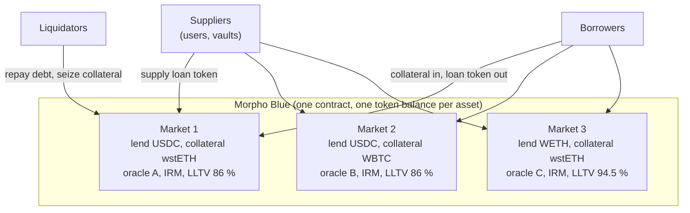
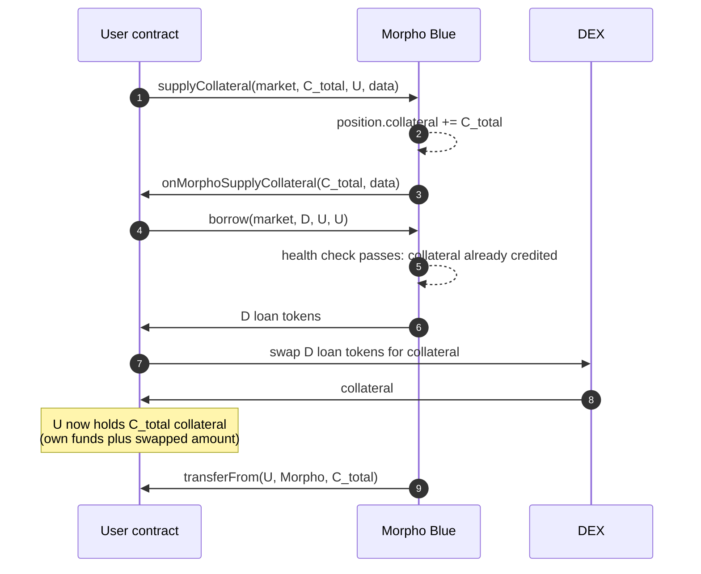

[Morpho](https://morpho.org/) is a lending protocol on Ethereum and other EVM chains. Its base layer, Morpho Blue, is a single immutable contract in which anyone can create a lending market by choosing five parameters: the asset lent, the asset used as collateral, the price oracle, the interest-rate model, and the loan-to-value at which borrowers are liquidated. Markets are isolated from each other, so a bad collateral or a faulty oracle affects only the market that chose it.

This article reads Morpho Blue from its source code, `Morpho.sol`, 557 lines of Solidity with no proxy and no pause. It covers how a market is identified and created, how supply and borrow positions are tracked with shares, how interest accrues, when a position can be liquidated and how large the liquidator's bonus is, how bad debt is written off, and the developer features built into the contract: callbacks, flash loans and authorizations. The vaults described in the other articles of this series, [Morpho Vault V1]({{site.url_complet}}/2026/10/10/morpho-vault-v1-metamorpho/) and [Morpho Vault V2]({{site.url_complet}}/2026/10/10/morpho-vault-v2-architecture/), are suppliers to these markets.

> This article has been made with the help of [Claude Code](https://claude.com/product/claude-code) and several custom skills

[TOC]

## One contract, many markets

Pooled lending protocols such as [Compound V2]({{site.url_complet}}/2024/08/27/compound-protocol-v2/) or Aave put many assets into one shared risk pool: a depositor of USDC is exposed to every collateral the protocol accepts, and governance decides which assets enter the pool and with which parameters. Morpho Blue takes the opposite approach. Each market has exactly one loan token and one collateral token, and its risk parameters are fixed when it is created.



All markets live in the same contract, `Morpho`, which is why it is called a singleton. Tokens are pooled at the contract level, so the contract's USDC balance serves every USDC market, but accounting is per market: a supplier in market 1 can only lose money through market 1's borrowers.

The design has three consequences that the rest of the article returns to:

- **Market creation is permissionless.** Anyone can create a market with any loan token, collateral token and oracle, as long as the interest-rate model and the LLTV are on lists approved by the owner.
- **Markets are immutable.** Once created, a market's parameters never change. A market with a bad oracle cannot be fixed; suppliers leave it and a new market is created.
- **Risk selection moves to the supplier.** Blue does not decide which markets are safe. A supplier, or a vault curator acting for depositors, chooses which markets to lend to.

## Markets

### Parameters and identifier

A market is defined by five values:

```solidity
struct MarketParams {
    address loanToken;       // the asset lent and borrowed
    address collateralToken; // the asset borrowers deposit
    address oracle;          // prices one unit of collateral in loan tokens
    address irm;             // interest-rate model
    uint256 lltv;            // liquidation loan-to-value, in WAD
}
```

The market's identifier is the `keccak256` hash of these 160 bytes. Two markets with the same tokens but a different oracle or LLTV are different markets with different ids, separate liquidity and separate risk.

`createMarket(marketParams)` can be called by anyone. It checks that the IRM and the LLTV are enabled, that the market does not exist yet, records the parameters, and calls the IRM once so that a stateful model can initialise.

### State

Each market stores six numbers, packed in three storage slots:

```solidity
struct Market {
    uint128 totalSupplyAssets;
    uint128 totalSupplyShares;
    uint128 totalBorrowAssets;
    uint128 totalBorrowShares;
    uint128 lastUpdate;
    uint128 fee;
}
```

Each account has one position per market:

```solidity
struct Position {
    uint256 supplyShares;
    uint128 borrowShares;
    uint128 collateral;
}
```

Supply and borrow are tracked as shares, collateral as a plain token amount. Collateral earns nothing and is never lent out: it stays in the contract until it is withdrawn or seized.

### What the owner controls

Blue has an owner, a governance address, with a short list of powers:

| Power | Constraint |
|-------|-----------|
| Enable an interest-rate model for future markets | Cannot be disabled afterwards |
| Enable an LLTV for future markets | Must be below 100 %; cannot be disabled afterwards |
| Set a market's fee | At most 25 % of the interest; accrues to `feeRecipient` |
| Set the fee recipient | One address for all markets |
| Transfer ownership | One step, no confirmation |

The owner cannot pause the contract, change an existing market's parameters, move funds, or remove an IRM or LLTV that markets already use. The fee is the only setting that affects an existing market, and it is capped and only reduces suppliers' interest.

## Shares and interest

### Share accounting

A supply share represents a fraction of the market's total supply, and a borrow share a fraction of its total debt. Interest is accrued by increasing `totalSupplyAssets` and `totalBorrowAssets` without touching the shares, so every share gains value at the same rate. The conversion uses one virtual asset and a million virtual shares:

$$
\begin{aligned}
\text{shares} &= a \cdot \frac{S + 10^{6}}{A + 1} \\
\text{assets} &= s \cdot \frac{A + 1}{S + 10^{6}}
\end{aligned}
$$

where $$A$$ is the total assets and $$S$$ the total shares on the relevant side. The virtual amounts make the first share expensive to manipulate. Every conversion is rounded in favour of the protocol:

| Operation | Rounding | Effect |
|-----------|----------|--------|
| `supply` by assets | shares down | Supplier receives at most what they paid for |
| `withdraw` by assets | shares up | Supplier burns at least enough shares |
| `borrow` by assets | shares up | Borrower owes at least what they took |
| `repay` by assets | shares down | Borrower clears at most what they paid |
| Health check | debt up | A position at the exact limit counts as unhealthy by one unit |

Every function that changes a position takes either `assets` or `shares`, and exactly one of them must be zero. Repaying by `shares` is how a borrower clears a debt completely, since the asset amount of a debt changes every second.

### Interest accrual

Interest is accrued lazily: only when someone interacts with the market, or calls `accrueInterest`. The IRM returns a borrow rate per second $$r$$, and the contract approximates continuous compounding over the elapsed time $$\Delta t$$ with the first three terms of the exponential series:

$$
\begin{aligned}
x &= r \cdot \Delta t \\
I &= B \cdot \left(x + \frac{x^{2}}{2} + \frac{x^{3}}{6}\right) \approx B \cdot \left(e^{x} - 1\right)
\end{aligned}
$$

$$I$$ is added to both total borrow and total supply, so borrowers owe it and suppliers earn it. If the market has a fee $$f$$, the fee recipient receives new supply shares worth $$I \cdot f$$, which dilutes the other suppliers by exactly that amount. A market whose IRM is `address(0)` skips this step entirely and accrues no interest.

Morpho's standard interest-rate model, AdaptiveCurveIRM, is a separate contract in the `morpho-blue-irm` repository. It is the only model Vault V2's market adapter accepts, but Blue itself accepts any IRM the owner has enabled.

### Liquidity

A market's available liquidity is its total supply minus its total borrow. Both `withdraw` and `borrow` revert if they would make total borrow exceed total supply. There is no reserve: when a market is fully borrowed, suppliers cannot withdraw until borrowers repay or the rising interest rate attracts new supply.

## Borrowing and health

A borrower supplies collateral with `supplyCollateral`, then calls `borrow`. After every `borrow` and `withdrawCollateral`, the contract checks that the position is healthy:

$$
\begin{aligned}
D \le C \cdot \frac{P}{10^{36}} \cdot \text{LLTV}
\end{aligned}
$$

where $$D$$ is the debt (borrow shares converted to assets, rounded up), $$C$$ the collateral amount and $$P$$ the oracle price. The oracle returns the price of one unit of collateral in units of loan token, scaled by $$10^{36}$$ and adjusted for the two tokens' decimals, so the product is already in loan-token units.

Three details follow from the code:

- **The LLTV is both the borrowing limit and the liquidation threshold.** There is no separate, lower "maximum LTV" for opening a position: a borrower can borrow up to the LLTV, and a position becomes liquidatable as soon as its LTV exceeds it. In practice, interfaces keep borrowers some distance below the LLTV.
- **The oracle is only called when it matters.** A position with no debt is healthy without querying the oracle, and `supply`, `withdraw`, `supplyCollateral` and `repay` never call it. Suppliers can therefore exit a market even if its oracle reverts, as long as there is liquidity.
- **`supplyCollateral` does not accrue interest**, to save gas, since adding collateral can only improve a position.

## Liquidations

### When and how much

Anyone can liquidate a position whose debt exceeds its borrowing limit, using the oracle price at the time of the call. There is no close factor: the liquidator chooses how much to repay, up to the whole debt, and receives collateral worth the repaid amount multiplied by the **liquidation incentive factor** (LIF). The LIF depends only on the market's LLTV:

$$
\begin{aligned}
\text{LIF} = \min\left(1.15,\ \frac{1}{1 - 0.3 \cdot (1 - \text{LLTV})}\right)
\end{aligned}
$$

The constant 0.3 is the `LIQUIDATION_CURSOR`. The formula gives a large bonus to markets with a low LLTV, where collateral is volatile and liquidators need a margin, and a small bonus to markets with a high LLTV, such as a staked-ETH token against ETH, where the margin between the LLTV and insolvency is thin:

| LLTV | LIF | Liquidator bonus | LTV above which a full liquidation leaves bad debt |
|------|-----|------------------|----------------------------------------------------|
| 38.5 % | 1.1500 (capped) | 15.00 % | 87.0 % |
| 62.5 % | 1.1268 | 12.68 % | 88.8 % |
| 77.0 % | 1.0741 | 7.41 % | 93.1 % |
| 86.0 % | 1.0438 | 4.38 % | 95.8 % |
| 91.5 % | 1.0262 | 2.62 % | 97.5 % |
| 94.5 % | 1.0168 | 1.68 % | 98.4 % |
| 96.5 % | 1.0106 | 1.06 % | 98.9 % |

The last column is $$1 / \text{LIF}$$. Repaying a debt $$D$$ in full costs $$D \cdot \text{LIF}$$ of collateral, so once a position's LTV exceeds $$1 / \text{LIF}$$, its collateral cannot cover a full liquidation and part of the debt will remain unpaid. The bonus goes entirely to the liquidator; Blue takes no liquidation fee.

### A worked example

Take a market with an LLTV of 86 %, so a LIF of 1.0438. A borrower has collateral worth 10,000 units of the loan token and a debt of 8,700. The LTV is 87 %, above the LLTV, so the position can be liquidated.

- A liquidator repays the full 8,700 and receives collateral worth 8,700 × 1.0438 ≈ 9,081.
- The borrower keeps collateral worth about 919 and has no debt.
- The liquidator's gross profit is about 381, before the cost of selling the collateral.

Now suppose the collateral price falls sharply before anyone liquidates, so the same collateral is worth 9,000 against the same 8,700 of debt. The LTV is 96.7 %, above the 95.8 % threshold in the table.

- Seizing all the collateral, worth 9,000, only requires repaying 9,000 / 1.0438 ≈ 8,622.
- About 78 of debt remains, with no collateral behind it. This is bad debt.

### Bad debt

When a liquidation leaves a borrower with zero collateral and some remaining debt, Blue writes that debt off immediately, in the same call:

```solidity
if (position[id][borrower].collateral == 0) {
    badDebtShares = position[id][borrower].borrowShares;
    badDebtAssets = UtilsLib.min(
        market[id].totalBorrowAssets,
        badDebtShares.toAssetsUp(market[id].totalBorrowAssets, market[id].totalBorrowShares)
    );
    market[id].totalBorrowAssets -= badDebtAssets.toUint128();
    market[id].totalSupplyAssets -= badDebtAssets.toUint128();
    market[id].totalBorrowShares -= badDebtShares.toUint128();
    position[id][borrower].borrowShares = 0;
}
```

The debt is removed from total borrow and the same amount from total supply, so the value of every supply share falls. The loss is shared by all suppliers of that market in proportion to their shares, and by nobody else: suppliers of other markets, even with the same loan token, are not affected.

Two consequences matter for the vaults built on Blue:

- **Bad debt is recognised only when a liquidation empties the collateral.** A position that is underwater but still has some collateral keeps its full debt on the books until someone liquidates it. Until then, supply shares are overvalued.
- **The write-off needs no governance action.** Any liquidator who seizes the last unit of collateral triggers it, in the same transaction.

### What the oracle must guarantee

The interface lists the assumptions under which Blue behaves correctly. One of them ties the oracle to the liquidation formula: the price must not be able to drop instantly to less than the previous price multiplied by $$\text{LLTV} \cdot \text{LIF}$$.

The reasoning follows from the table. A position at the LLTV becomes a bad-debt position once its LTV exceeds $$1 / \text{LIF}$$, which happens if the price falls by a factor of $$\text{LLTV} \cdot \text{LIF}$$. If the oracle can make that jump in one update, a position can go from healthy to insolvent with no block in between for a liquidator to act. For an 86 % market the factor is about 0.898, a drop of about 10 %; for a 94.5 % market it is about 0.961, a drop of about 4 %. The interface gives a specific example of an oracle that breaks this assumption: pricing a vault token from its assets under management when the vault can receive donations.

Blue does not check any of this. The interface says that selecting markets with safe oracles is the user's responsibility.

## Developer features

### Callbacks

`supply`, `repay`, `supplyCollateral` and `liquidate` accept a `data` argument. When it is non-empty, Blue updates the position first, then calls the caller back, and only then pulls the tokens with `transferFrom`. The caller can use the callback to obtain the tokens it is about to owe.

This makes leverage possible in one transaction without an external flash loan. A user who wants a leveraged position in the collateral token can:



The same pattern in reverse, with `repay` and its callback, closes a leveraged position: repay the debt first, withdraw the freed collateral inside the callback, and swap part of it to cover the repayment. The liquidation callback lets a liquidator sell the seized collateral before paying the debt, so liquidating requires no capital of its own.

### Flash loans

`flashLoan(token, assets, data)` lends any amount of any token the contract holds, for free, provided it is returned within the same call. The available amount is the contract's whole balance of that token: every market's liquidity and every borrower's collateral in that token, plus any donations. The interface notes that the function is not [ERC-3156](https://eips.ethereum.org/EIPS/eip-3156) compliant, though an adapter is easy to write, since the fee is zero and the maximum is the balance.

Free flash loans are what make the in-kind redemption of Vault V2 practical: a depositor borrows liquidity, supplies it to the market the vault is stuck in, and lets the vault withdraw it.

### Authorizations

Any account can authorize another to manage its positions on all markets with `setAuthorization`, or with an [EIP-712](https://eips.ethereum.org/EIPS/eip-712) signature through `setAuthorizationWithSig`, which uses a nonce and a deadline. An authorized address can call `withdraw`, `borrow` and `withdrawCollateral` on the authorizer's behalf and send the tokens to any receiver.

The scope is all or nothing: an authorization covers every market and every action, which is how bundlers and vault adapters operate on a user's position. The interface warns that the domain separator only contains the chain id and the contract address, so a signature can be replayed on a fork of the chain.

Actions that only add value, `supply`, `repay` and `supplyCollateral`, need no authorization: anyone can supply or repay on behalf of any account.

## Assumptions on tokens

Blue does not whitelist tokens, so its correctness depends on how the tokens of a market behave. The interface lists the assumptions:

- **ERC-20 behaviour.** Missing return values on `transfer` are tolerated, but fee-on-transfer tokens and tokens whose balance can change without a transfer (for example through a burn function) are not supported.
- **No reentrancy.** Neither the tokens nor the IRM may call back into Blue.
- **Liveness.** If a token reverts on transfers, an IRM reverts on `borrowRate`, or an oracle reverts on `price`, the affected functions revert and funds can be stuck. A reverting oracle blocks borrowing, liquidation and collateral withdrawal from positions with debt, but not supply, supply withdrawal or repayment.
- **Size limits.** Supplied and borrowed amounts above about $$10^{32}$$ units may overflow the 128-bit share counters. A market with fewer than $$10^{4}$$ units borrowed can have its borrow share price manipulated until borrowing overflows.

Creating a market is free and permissionless, so a market that breaks these assumptions can exist. It harms only its own users.

## Conclusion

Morpho Blue is a single immutable contract in which anyone can create an isolated lending market defined by a loan token, a collateral token, an oracle, an interest-rate model and an LLTV.

- **Markets are fixed and isolated.** Parameters never change, the owner can only enable new IRMs and LLTVs and set a fee of up to 25 %, and a loss in one market affects only that market's suppliers.
- **Positions are shares.** Supply and borrow shares grow in value as interest accrues; every conversion rounds in favour of the protocol, and collateral is held as a plain amount that earns nothing.
- **Interest accrues lazily**, with a three-term Taylor approximation of continuous compounding, at each interaction.
- **The LLTV is the only threshold.** It is both the borrowing limit and the liquidation trigger, and it sets the liquidation bonus, from 15 % at low LLTVs down to about 1 % at 96.5 %.
- **Bad debt is written off at liquidation**, when the borrower's collateral reaches zero, and is shared by the market's suppliers.
- **Callbacks, free flash loans and authorizations** let other contracts build leverage, liquidation and vault logic on top without separate liquidity.


## Annex

### Key Terms

| Term | Definition |
|------|------------|
| **Lending market** | A pool where suppliers lend one token to borrowers who post another token as collateral, and pay interest set by an interest-rate model. |
| **Collateral** | Tokens a borrower deposits to secure a loan, which can be seized if the loan becomes unsafe. |
| **Loan-to-value (LTV)** | The ratio of a position's debt to the value of its collateral, measured in loan-token units. |
| **Liquidation** | The repayment of an unsafe borrower's debt by a third party, who receives part of the borrower's collateral in exchange. |
| **Oracle** | A contract that reports the price of the collateral token in units of the loan token. |
| **Interest-rate model (IRM)** | A contract that returns the borrow rate per second of a market, usually as a function of its utilisation. |
| **Utilisation** | The share of a market's supply that is currently borrowed; the remainder is the available liquidity. |
| **Bad debt** | Debt that remains after a borrower's collateral has been fully seized, and that the lenders must absorb. |
| **Morpho Blue** | Morpho's lending layer, also called Morpho Market V1: one immutable contract holding all markets. |
| **Singleton** | A design in which one contract holds every market and every token balance, with separate accounting per market. |
| **Market parameters** | The five values that define a Blue market: loan token, collateral token, oracle, IRM and LLTV. |
| **Market id** | The `keccak256` hash of a market's five parameters, used as its identifier. |
| **LLTV** | The liquidation loan-to-value of a market: the maximum LTV for borrowing and the threshold above which a position can be liquidated. |
| **Health check** | The test that debt, rounded up, does not exceed collateral times price times LLTV. |
| **Supply shares** | Units representing a fraction of a market's total supply, whose value grows as interest accrues and falls when bad debt is written off. |
| **Borrow shares** | Units representing a fraction of a market's total debt, whose value grows as interest accrues. |
| **Virtual shares and assets** | The 1,000,000 shares and 1 asset added to every conversion so that the initial share price cannot be manipulated cheaply. |
| **Liquidation incentive factor (LIF)** | The multiplier applied to repaid debt to compute the collateral a liquidator receives, from 1.15 at low LLTVs to close to 1 at high LLTVs. |
| **Liquidation cursor** | The constant 0.3 in the LIF formula, which sets how fast the bonus decreases as the LLTV increases. |
| **Callback** | A call from Blue back to the caller, made after the position is updated and before tokens are pulled, used to source tokens within the same transaction. |
| **Flash loan** | A loan of any token held by the contract, free of charge, that must be repaid before the call ends. |
| **Authorization** | Permission given by an account to another address to manage its positions on all markets, including withdrawing and borrowing. |

### Invariants

| Invariant | Enforced by | Breaks if |
|-----------|-------------|-----------|
| Total borrow never exceeds total supply in a market after `withdraw` or `borrow`. | The `INSUFFICIENT_LIQUIDITY` checks. | Interest accrual raises both sides equally, so it cannot break it; only a code change could. |
| A position can only borrow or withdraw collateral while healthy. | `_isHealthy` after `borrow` and `withdrawCollateral`. | The oracle reports a wrong price, which Blue cannot detect. |
| A market's parameters never change after creation. | No function writes `idToMarketParams` except `createMarket`, which refuses existing markets. | Never; the contract has no upgrade path. |
| Only an unhealthy position can be liquidated. | The `HEALTHY_POSITION` check in `liquidate`, using the current oracle price. | The oracle is manipulated or misreports. |
| Bad debt is written off when, and only when, a liquidation leaves zero collateral and non-zero debt. | The block at the end of `liquidate`. | A position is underwater but keeps a dust amount of collateral that no one liquidates. |
| The market fee never exceeds 25 % of interest. | `MAX_FEE` in `setFee`. | Never at this commit. |
| Every conversion rounds in favour of the protocol. | The choice of `toSharesUp`/`toSharesDown` and `toAssetsUp`/`toAssetsDown` in each function. | A periphery contract recomputes amounts with the opposite rounding and relies on it. |

### Integration Notes

| Behaviour | What an integrator should do |
|-----------|------------------------------|
| Stored totals exclude interest accrued since the last interaction. | Use `MorphoBalancesLib` (`expectedSupplyAssets`, `expectedBorrowAssets`, `expectedMarketBalances`) to read up-to-date values. |
| Repaying by `assets` leaves dust because the debt grows every second. | Repay by `shares` to close a position completely. |
| An authorization covers every market and allows borrowing and withdrawing to any receiver. | Authorize only audited contracts, and revoke the authorization when the integration no longer needs it. |
| EIP-712 authorizations can be replayed on a fork with the same chain id. | Use short deadlines and consume nonces after a fork. |
| A reverting oracle blocks borrowing, liquidations and collateral withdrawal from positions with debt. | Check oracle liveness before listing a market; suppliers can still withdraw if there is liquidity. |
| Bad debt is only realised by a liquidation that empties the collateral. | Monitor underwater positions, not only `Liquidate` events with a non-zero `badDebtAssets`, to anticipate losses. |
| The fee recipient's supply shares do not include fees accrued since the last update. | Call `accrueInterest` before changing or reading the fee recipient's position. |

## Frequently Asked Questions

**Q: What defines a Morpho Blue market, and what happens if two markets share the same tokens?**

A market is defined by five parameters: the loan token, the collateral token, the oracle, the interest-rate model and the LLTV. Its id is the hash of those parameters. Two markets that share both tokens but differ in oracle, IRM or LLTV are separate markets, with separate liquidity, separate interest rates and separate bad-debt exposure. Suppliers in one are not affected by losses in the other.

**Q: Why does Morpho Blue track supply and borrow positions in shares rather than in token amounts?**

Interest accrues to every supplier and every borrower of a market at the same rate. With shares, the contract only has to increase the two totals, `totalSupplyAssets` and `totalBorrowAssets`, when interest accrues, and every share gains value automatically. Updating each account's balance individually would be impossible in a contract with an unbounded number of positions. The same mechanism spreads bad debt: lowering total supply lowers the value of every supply share at once.

**Q: A market has an LLTV of 94.5 %. What is the liquidator's bonus, and why is it smaller than in a 77 % market?**

The LIF is $$1 / (1 - 0.3 \cdot 0.055) \approx 1.0168$$, a bonus of about 1.7 %. In a 77 % market it is about 7.4 %. A high LLTV is chosen for collateral that tracks the loan token closely, such as a liquid staking token against ETH, and leaves little room between the liquidation threshold and insolvency. A large bonus there would itself push positions into bad debt: at a 94.5 % LLTV, any LTV above about 98.4 % already cannot support a full liquidation. Lower-LLTV markets hold more volatile collateral, so liquidators need a larger margin to cover price movement and slippage.

**Q: A borrower's position is underwater but still holds some collateral. Has the market realised the loss?**

No. Bad debt is written off only inside `liquidate`, when a liquidation leaves the borrower with zero collateral. Until someone liquidates the position completely, its full debt remains in `totalBorrowAssets` and the supply shares are valued as if it will be repaid. A liquidator who seizes the remaining collateral triggers the write-off, and the supply share price drops at that moment.

**Q: How can a user open a leveraged position on Morpho Blue in one transaction without a flash loan?**

Through the `supplyCollateral` callback:

- The user's contract calls `supplyCollateral` for the full target collateral amount, with non-empty `data`. Blue credits the collateral to the position, then calls `onMorphoSupplyCollateral`.
- Inside the callback, the contract calls `borrow`. The health check passes because the collateral is already credited.
- The contract swaps the borrowed tokens for collateral, so it now holds the full amount Blue is about to pull.
- When the callback returns, Blue transfers the collateral from the contract with `transferFrom`.

Closing the position uses the `repay` callback in the same way, in reverse.

**Q: Why does the interface require that an oracle price cannot fall by more than a factor of LLTV times LIF in one update?**

A position opened at the LLTV becomes impossible to liquidate fully, without leaving bad debt, once its LTV exceeds $$1 / \text{LIF}$$. Going from an LTV equal to the LLTV to an LTV of $$1 / \text{LIF}$$ corresponds to a price drop by a factor of $$\text{LLTV} \cdot \text{LIF}$$. If an oracle can jump down by more than that in one update, positions can become insolvent before any liquidator has a chance to act, and the market accumulates bad debt even with perfect liquidators. For an 86 % market this is a drop of about 10 %.

**Q: Which actions require an authorization, and which can anyone perform on behalf of another account?**

`withdraw`, `borrow` and `withdrawCollateral` require the caller to be the account or an address it has authorized, because they take value out of the position. `supply`, `repay` and `supplyCollateral` can be called by anyone on behalf of any account, because they only add value to it. `liquidate` can also be called by anyone, but only against an unhealthy position.

## References

### Analyzed source

- [morpho-org/morpho-blue](https://github.com/morpho-org/morpho-blue) analyzed at commit [`8e26ca6a8dbc5089edcd67fb576248810fd2870a`](https://github.com/morpho-org/morpho-blue/tree/8e26ca6a8dbc5089edcd67fb576248810fd2870a) (`main`, 374 commits after `v1.0.0`), 2026-10-10

### Morpho documentation

- [Morpho Blue whitepaper](https://github.com/morpho-org/morpho-blue/blob/8e26ca6a8dbc5089edcd67fb576248810fd2870a/morpho-blue-whitepaper.pdf)
- [Blue contract reference](https://docs.morpho.org/developers/contracts/blue)
- [Liquidation concepts](https://docs.morpho.org/developers/borrow/concepts/liquidation)
- [LTV concepts](https://docs.morpho.org/developers/borrow/concepts/ltv)
- [Market mechanics](https://docs.morpho.org/developers/borrow/concepts/market-mechanics)
- [Morpho Blue audit reports](https://github.com/morpho-org/morpho-blue/tree/8e26ca6a8dbc5089edcd67fb576248810fd2870a/audits)
- [morpho-org/morpho-blue-irm, AdaptiveCurveIRM](https://github.com/morpho-org/morpho-blue-irm)

### Standards

- [EIP-712 - Typed structured data hashing and signing](https://eips.ethereum.org/EIPS/eip-712)
- [ERC-3156 - Flash Loans](https://eips.ethereum.org/EIPS/eip-3156)

### Related articles

- [Compound V2 Overview]({{site.url_complet}}/2024/08/27/compound-protocol-v2/)
- [Vault Curator - Steak House Finance]({{site.url_complet}}/2025/11/06/steakhouse-finance-overview/)
- [Crypto Hacks of 2026 So Far - January to September, from Truebit to Bitget]({{site.url_complet}}/2026/10/07/crypto-hacks-2026-year-to-date/)
- [The Unified Risk Layer for DeFi - From Price Oracles to Protocol-Owned Risk Oracles]({{site.url_complet}}/2026/07/02/defi-unified-risk-layer-llama-guard/)
