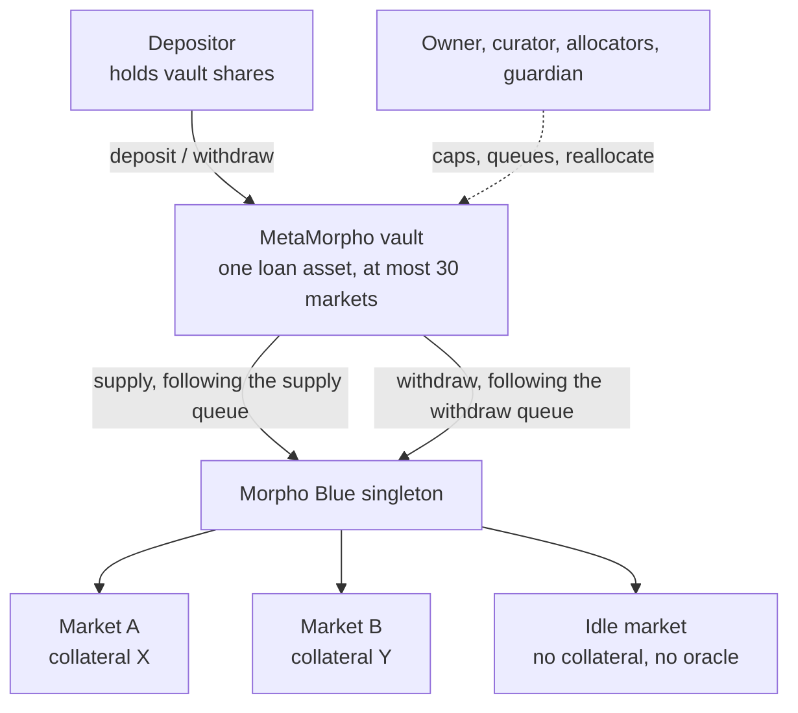
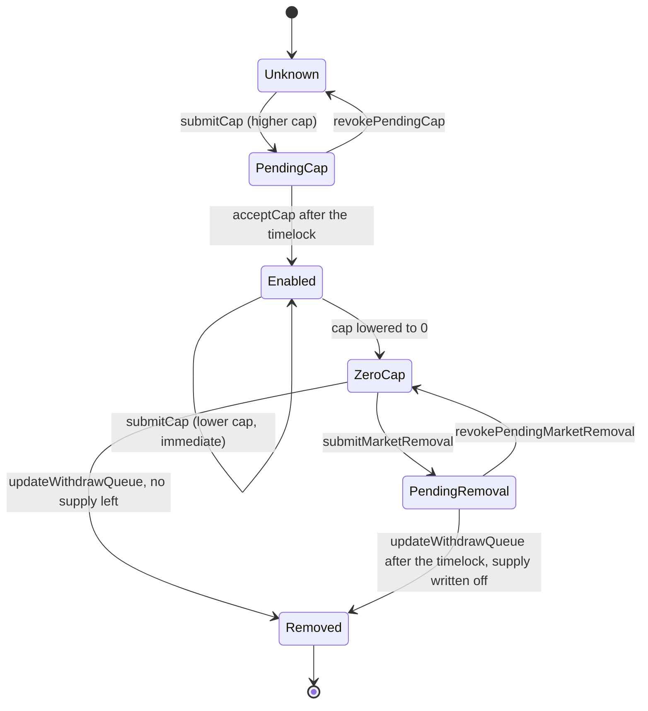
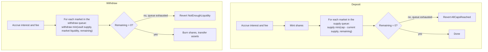

[Morpho](https://morpho.org/) is a lending protocol whose base layer, [Morpho Blue]({{site.url_complet}}/2026/10/10/morpho-blue-lending-markets/), is a single contract holding isolated lending markets, each defined by a loan token, a collateral token, an oracle, an interest-rate model and a liquidation threshold. Lending directly on Blue means choosing markets one by one, so Morpho added vaults on top: a depositor gives one asset to a vault and a curator decides which markets receive it. Morpho Vault V1, known in its code as MetaMorpho, is the first generation of these vaults.

This article explains how MetaMorpho works from its source code, covering both published versions, v1.0 and v1.1, and the one behavioural difference between them that matters to depositors: what happens to bad debt. The last section compares it with Vault V2, the generation that replaces it, which a previous article, [How Morpho Vault V2 Works - Adapters, Caps, Timelocks and In-Kind Redemption]({{site.url_complet}}/2026/10/10/morpho-vault-v2-architecture/), describes in detail.

> This article has been made with the help of [Claude Code](https://claude.com/product/claude-code) and several custom skills

[TOC]

## Names and versions

Morpho's naming has moved over time, and three names refer to different layers:

- **Morpho Blue**, also called Morpho Market V1, is the lending layer: one immutable singleton contract with permissionless, isolated markets.
- **MetaMorpho**, now called **Morpho Vault V1**, is the vault layer described here. A MetaMorpho vault only supplies to Morpho Blue markets.
- **Morpho Vault V2** is the next vault generation, which can allocate to Blue markets, to V1 vaults and to other protocols through adapters.

Vault V1 exists in two versions, each in its own repository with its own factory:

| Version | Contract | Factory | Difference |
|---------|----------|---------|------------|
| v1.0 | `MetaMorpho` | `MetaMorphoFactory` | The original release. |
| v1.1 | `MetaMorphoV1_1` | `MetaMorphoV1_1Factory` | A fork of v1.0 with four changes, listed in [a dedicated section](#v10-and-v11-compared) below. |

Both are immutable once deployed: the factory creates a new contract per vault with no proxy, so a vault keeps the version it was created with. A curator who wants v1.1 behaviour deploys a new vault.

## Architecture

A MetaMorpho vault is an [ERC-4626](https://eips.ethereum.org/EIPS/eip-4626) vault for a single loan asset. It inherits OpenZeppelin's `ERC4626`, `ERC20Permit` (the [ERC-2612](https://eips.ethereum.org/EIPS/eip-2612) extension), `Ownable2Step` and `Multicall`, and holds no assets of its own between transactions: every deposit is supplied to Blue in the same call, and every withdrawal is pulled from Blue in the same call.



The vault's state is small. For each Blue market id it keeps a `MarketConfig`:

```solidity
struct MarketConfig {
    uint184 cap;        // maximum supply, in units of the loan asset
    bool enabled;       // the market is in the withdraw queue
    uint64 removableAt; // set when a forced removal is pending
}
```

Around it, the vault keeps two ordered lists of market ids, a single `timelock` value, three pending-value slots (cap, timelock, guardian) and the accounting variable `lastTotalAssets`, plus `lostAssets` in v1.1.

- **The supply queue** is the order in which a deposit is spread across markets. It can only contain markets with a non-zero cap, and if it is empty, deposits are disabled.
- **The withdraw queue** is the order in which a withdrawal pulls liquidity. It contains every enabled market, which means every market with a non-zero cap or a remaining supply position, without duplicates. It is also the list the vault iterates to compute its total assets.

Both queues are limited to 30 markets (`MAX_QUEUE_LENGTH`).

## Roles

MetaMorpho has four roles, organised as a hierarchy: the owner can do everything the curator and the guardian can do, and the curator can do everything an allocator can do.

| Role | Holders | Set by | Powers |
|------|---------|--------|--------|
| **Owner** | One, two-step transfer (`Ownable2Step`) | Previous owner | Set the curator, allocators and skim recipient; set the performance fee (up to 50 %) and its recipient; raise the timelock; submit a lower timelock or a new guardian; in v1.1, rename the vault |
| **Curator** | One | Owner | Lower a supply cap immediately; submit a higher cap; submit a forced market removal; revoke pending caps and removals |
| **Allocator** | Several | Owner | Set the supply queue; reorder or shorten the withdraw queue; `reallocate` funds between enabled markets |
| **Guardian** | One, optional | Owner, timelocked once a guardian exists | Revoke a pending timelock, guardian, cap or market removal |

Two properties of this table matter to depositors. First, the owner's own actions are mostly immediate: appointing a curator or an allocator, and changing the fee, take effect in the same transaction. Second, the guardian's only power is to cancel. It cannot move funds or lower caps; its purpose is to stop a change submitted by the owner or curator before the timelock expires.

## The timelock

A MetaMorpho vault has **one timelock** that applies to all protected actions. It is bounded between 1 day and 2 weeks. In v1.0 the bound also applies at deployment; in v1.1 a vault can be deployed with a timelock of zero to simplify set-up, and any later change must fall within the bounds.

The protected actions are those that could increase risk or remove a check on the owner:

| Action | Who submits | Timelocked? | Who can revoke |
|--------|-------------|-------------|----------------|
| Increase a market's supply cap | Curator or owner | Yes | Curator, guardian, owner |
| Decrease a supply cap | Curator or owner | No | |
| Force-remove a market | Curator or owner | Yes | Curator, guardian, owner |
| Decrease the timelock | Owner | Yes | Guardian, owner |
| Increase the timelock | Owner | No | |
| Change the guardian | Owner | Yes, if a guardian is already set | Guardian, owner |
| Set the fee, curator or allocators | Owner | No | |

A pending value is stored with its `validAt` time. Once that time has passed, **anyone** can call the matching `accept` function (`acceptCap`, `acceptTimelock`, `acceptGuardian`), so a change does not depend on its submitter coming back to execute it. A submitter can have only one pending value per slot at a time: a second `submitCap` for the same market reverts with `AlreadyPending` until the first one is accepted or revoked.

The design is simpler than Vault V2's, which has one timelock per function. It also means that all protected actions share one delay: a curator cannot give depositors two weeks' notice of cap increases while keeping a shorter delay for something else.

## Market lifecycle

A Blue market goes through the following states inside a vault:



Enabling a market is the timelocked part. When `acceptCap` raises the cap of a market that is not yet enabled, the vault appends it to the withdraw queue, marks it enabled, and adds any supply it already holds there to `lastTotalAssets` without charging a fee. An allocator then puts it in the supply queue if deposits should go there.

Removing a market has two paths:

1. **Normal removal.** The curator lowers the cap to zero, which takes effect at once. An allocator moves the vault's supply out with `reallocate`, then calls `updateWithdrawQueue` with a list of indexes that omits the market. The vault checks that the omitted market has a zero cap, no pending cap and no supply left, and deletes its configuration.
2. **Forced removal.** If the market cannot be emptied, for instance because it keeps reverting or has no liquidity, the curator submits `submitMarketRemoval`. After the timelock, `updateWithdrawQueue` can drop the market even though the vault still holds supply there. That supply stops counting in the vault's total assets.

Forced removal exists because a reverting market blocks the whole vault: `totalAssets()` iterates the withdraw queue and calls Blue for every market in it, so one market that reverts makes every deposit and withdrawal revert too.

## Deposits, withdrawals and reallocation

Deposits and withdrawals follow the queues, one market at a time.



Each Blue call inside the loops is wrapped in `try/catch`, so a market that reverts on supply or withdraw is skipped rather than blocking the operation. That does not cover `totalAssets()`, which is why forced removal still exists.

A depositor's exit therefore depends on the liquidity of the markets in the withdraw queue, in the order the allocators chose. If every market is fully borrowed, a withdrawal reverts and the depositor waits until borrowers repay, interest rates attract new supply, or the allocators move funds.

Allocators rebalance with `reallocate`, which takes a list of `(marketParams, assets)` targets and processes them in order:

- If the target is below the current supply, the vault withdraws the difference. A target of zero withdraws all supply shares, which also clears any shares a third party donated to the vault in that market.
- If the target is above the current supply, the vault supplies the difference, after checking it stays within the market's cap. A target of `type(uint256).max` supplies whatever has been withdrawn so far and not yet resupplied.
- At the end, the total withdrawn must equal the total supplied, or the call reverts with `InconsistentReallocation`. Reallocation moves funds between markets and never changes the vault's total.

Caps are checked when the vault supplies, on deposit and on reallocation. Interest and donations can push a market's supply above its cap without any revert, and the README says so explicitly.

### Idle supply

Because the vault holds nothing itself, keeping liquidity available means supplying to a Blue market where nobody can borrow. The README recommends a canonical "idle" market for the vault's asset with `address(0)` as collateral, oracle and interest-rate model, and an LLTV of zero. Funds there earn nothing but can always be withdrawn. A cap of `type(uint184).max` on that market at the end of the supply queue guarantees that deposits never revert with `AllCapsReached`.

## Accounting

### Total assets and the performance fee

The vault values itself by summing its supply in every enabled market, using Blue's `expectedSupplyAssets`, which includes interest accrued since the market's last update:

$$
\begin{aligned}
R = \sum_{m \in \text{withdrawQueue}} \text{expectedSupplyAssets}(m)
\end{aligned}
$$

At every deposit, withdrawal, or fee change, the vault compares the new total with `lastTotalAssets`, the total recorded at the previous interaction, and takes a performance fee $$f \le 50\,\%$$ on the difference:

$$
\begin{aligned}
I &= A^{\text{new}} - A^{\text{last}} \\
F &= I \cdot f \\
\text{fee shares} &= F \cdot \frac{S + 10^{\delta}}{A^{\text{new}} - F + 1}
\end{aligned}
$$

The fee shares are minted to `feeRecipient`, which redeems them like any other holder. There is no management fee. The fee can be changed by the owner at any time, without timelock, and the vault accrues the old fee first so the change applies only to future interest.

### Share conversion

Conversions use OpenZeppelin's virtual-share formula, with a decimals offset $$\delta = \max(0, 18 - d)$$ where $$d$$ is the asset's decimals:

$$
\begin{aligned}
\text{shares} = a \cdot \frac{S + 10^{\delta}}{A + 1}, \qquad \text{assets} = s \cdot \frac{A + 1}{S + 10^{\delta}}
\end{aligned}
$$

Here $$S$$ is the share supply including pending fee shares. Rounding always favours the vault. For an 18-decimal asset the offset is zero and the protection against the ERC-4626 inflation attack is weak; the NatSpec on `deposit` says so and recommends that deployers make a non-trivial initial deposit.

Unlike Vault V2, MetaMorpho implements the ERC-4626 `max*` functions with real values. `maxDeposit` sums the remaining room under each cap in the supply queue, and `maxWithdraw` simulates the withdraw loop against current market liquidity. Both can be slightly off: `maxDeposit` overestimates if the supply queue contains the same market twice, which `setSupplyQueue` does not prevent.

## Bad debt: v1.0 realises it, v1.1 does not

When a Blue market liquidates a borrower whose collateral is worth less than the debt, Blue writes the shortfall off against the market's suppliers. The vault's `expectedSupplyAssets` in that market drops, so $$R$$ drops. The two versions handle that drop differently.

**v1.0** takes the new total as it is. The next interaction records the lower value in `lastTotalAssets`, no fee is charged on a negative difference, and the share price falls for every holder at once. Each depositor bears the loss in proportion to their shares.

**v1.1** adds a variable, `lostAssets`, defined as the assets missing because of bad debt or a forced market removal. With $$A^{\text{last}}$$ the recorded total and $$L$$ the current `lostAssets`:

$$
\begin{aligned}
L^{\text{new}} &= \begin{cases} A^{\text{last}} - R & \text{if } R \lt A^{\text{last}} - L \\ L & \text{otherwise} \end{cases} \\
A^{\text{new}} &= R + L^{\text{new}}
\end{aligned}
$$

The reported total therefore never drops because of a loss: the missing assets are added back as `lostAssets`, and the share price stays where it was. `lostAssets` only grows. When the markets recover through interest, $$R$$ increases and so does the total, so later interest is distributed and charged a fee as usual, but `lostAssets` itself is not paid back by it.

The consequence is a change in who bears the loss. Shares in a v1.1 vault are valued against assets that partly do not exist. Depositors who withdraw after the loss are paid at the unchanged price, as long as the markets have liquidity, and the shortfall stays with the depositors who remain. The interface documents one way to close the gap: someone supplies the missing amount to the vault on behalf of `address(1)`. The shares minted to that address can never be redeemed, so the supplied assets back the other holders' shares.

A forced removal is treated the same way in v1.1. Dropping a market from the withdraw queue removes its supply from $$R$$, and the difference is recorded in `lostAssets` rather than lowering the share price.

## v1.0 and v1.1 compared

The v1.1 README lists four changes from v1.0, and the source diff confirms them:

| Change | v1.0 | v1.1 |
|--------|------|------|
| Bad debt and forced removal | Realised: the share price drops | Not realised: tracked in `lostAssets`, share price unchanged |
| Initial timelock | Between 1 day and 2 weeks | 0, or between 1 day and 2 weeks; later changes keep the bounds |
| Name and symbol | Fixed at deployment | Owner can change them (`setName`, `setSymbol`) |
| `reallocate` on a market that is not enabled | Withdrawal side reverts; supply side reverts only on a zero cap | Reverts for any market that is not enabled |

The renaming has a side effect the source comments acknowledge: the [EIP-712](https://eips.ethereum.org/EIPS/eip-712) domain used by `permit` is built from an empty name, so v1.1 deviates slightly from ERC-2612. The compiler version also moved from 0.8.21 to 0.8.26.

## Rewards

Blue markets can carry external reward programs, and rewards earned by the vault's supply are paid to the vault's address. MetaMorpho has no logic to distribute them. Instead, the owner sets a `skimRecipient`, and anyone can call `skim(token)` to send the vault's entire balance of that token to it. The README recommends using a Universal Rewards Distributor as the recipient, from which the vault's managers publish a Merkle root of what each depositor can claim. Since the vault never holds its own asset between transactions, skimming does not touch depositors' funds.

## What Vault V2 changes

Vault V2 keeps the purpose of MetaMorpho, a curated and non-custodial ERC-4626 vault, and changes almost every mechanism. The table compares MetaMorpho v1.1 with Vault V2 at the commits pinned in the references.

| Area | Vault V1 (MetaMorpho) | Vault V2 |
|------|----------------------|----------|
| Where funds go | Morpho Blue markets only, up to 30 | Any protocol with an adapter: Blue markets, V1 vaults, Midnight |
| Idle funds | None; an "idle" Blue market plays that role | The vault holds an idle balance itself |
| Allocation on deposit | Spread along the supply queue | Sent to one liquidity adapter, or kept idle |
| Liquidity on withdrawal | Pulled along the withdraw queue | Idle balance first, then the liquidity adapter |
| Risk limits | One supply cap per market | Absolute and relative caps per id: adapter, collateral token, market |
| Timelock | One value, 1 day to 2 weeks, for all protected actions | One value per function, no bounds, plus permanent `abdicate` |
| Who sets fees, allocators | Owner, immediately | Curator, timelocked |
| Fees | Performance fee up to 50 % | Performance fee up to 50 % and management fee up to 5 % per year |
| Emergency role | Guardian: can only revoke pending changes | Sentinels: revoke, lower caps, deallocate funds |
| Ownership transfer | Two-step | One-step; roles do not need to be accepted |
| Bad debt | Realised (v1.0) or kept in `lostAssets` (v1.1) | Realised at the next interaction |
| Interest smoothing | None | `maxRate` caps the growth of the share price |
| Exit from illiquid markets | Wait for liquidity or allocator action | In-kind redemption with `forceDeallocate`, penalty up to 2 % |
| Access control | None | Four optional gates on shares and assets |
| ERC-4626 `max*` functions | Computed from caps and liquidity | Always return 0 |

The changes group into four themes.

**Generalisation through adapters.** V1 is written against Blue: `totalAssets()` calls Blue for each market, and `reallocate` calls `supply` and `withdraw` on Blue directly. V2 replaces this with adapters that report a value and a list of ids, so the vault never calls a lending protocol itself. One adapter, `MorphoVaultV1Adapter`, deposits into a V1 vault, so a V2 vault can hold existing MetaMorpho positions while it moves to direct market positions. How that adapter works, and the conditions under which it is safe, are described in [Morpho Vault V2 Adapters - How a Vault Allocates, and Why It Wraps a Vault V1]({{site.url_complet}}/2026/10/10/morpho-vault-v2-adapters/).

**Finer risk limits.** A V1 cap limits one market. Two markets with the same collateral and different oracles or LLTVs have separate caps, and nothing limits the vault's total exposure to that collateral. V2's collateral id covers every market that accepts the collateral, and relative caps limit an exposure as a share of the vault rather than in absolute terms.

**Governance that depositors can verify.** In V1 the owner holds direct powers: it appoints allocators and sets the fee immediately, and every protected action shares one delay. In V2 the owner only appoints the curator and sentinels; fee and allocator changes go through the curator's timelock, each function has its own delay, and `abdicate` lets a curator give up a power for good. The V2 emergency role can also act, by lowering caps and deallocating, where the V1 guardian can only veto.

**Exits and losses.** In V1 an exit depends on market liquidity and on the allocators. V2 adds `forceDeallocate`, which lets any depositor exit into the underlying market when no liquidity is available. On losses, V2 returns to v1.0's behaviour and realises bad debt at the next interaction, rather than carrying it in a `lostAssets` balance as v1.1 does. V2 adds `maxRate`, which lets a curator hold back part of the interest as a buffer against future losses.

## Conclusion

MetaMorpho is an immutable ERC-4626 vault that supplies one asset to at most 30 Morpho Blue markets, under the control of an owner, a curator, allocators and an optional guardian.

- **Two queues drive the money.** Deposits follow the supply queue up to each market's cap; withdrawals follow the withdraw queue up to each market's liquidity; allocators rebalance with `reallocate`, which cannot change the vault's total.
- **One timelock protects depositors.** Cap increases, forced removals, timelock decreases and guardian changes wait between 1 day and 2 weeks, and anyone can execute them afterwards. Fee, curator and allocator changes are immediate.
- **The guardian can only cancel.** It revokes pending changes and has no power over funds.
- **The two versions differ on bad debt.** v1.0 lowers the share price at once; v1.1 records the shortfall in `lostAssets`, keeps the share price, and leaves the loss with the depositors who stay.
- **Vault V2 replaces the Blue-specific design** with adapters, id-based caps, per-function timelocks, sentinels with real powers, in-kind redemption and gates, and realises losses at the next interaction.


## Annex

### Key Terms

| Term | Definition |
|------|------------|
| **ERC-4626** | The Ethereum standard for tokenized vaults, defining deposit, mint, withdraw and redeem against one underlying asset and the conversions between assets and shares. |
| **Share price** | The amount of the underlying asset one vault share is worth, equal to total assets divided by total shares with virtual amounts added. |
| **Bad debt** | The part of a loan that the collateral cannot cover after liquidation, written off by Morpho Blue against the market's suppliers. |
| **Morpho Blue** | Morpho's lending layer, also called Morpho Market V1: one immutable singleton contract holding isolated markets. |
| **Market** | A Blue lending pool defined by a loan token, a collateral token, an oracle, an interest-rate model and a liquidation LTV (LLTV), identified by the hash of these parameters. |
| **MetaMorpho** | The code name of Morpho Vault V1, an ERC-4626 vault that supplies one asset to several Blue markets. |
| **Owner** | The vault's top role, transferred in two steps; it appoints the other roles, sets the fee and controls the timelock. |
| **Curator** | The role that manages risk by setting supply caps and submitting forced market removals. |
| **Allocator** | A role that orders the queues and moves funds between enabled markets with `reallocate`. |
| **Guardian** | An optional role that can only revoke pending changes: caps, market removals, timelock and guardian changes. |
| **Timelock** | The single delay, between 1 day and 2 weeks, between the submission of a protected change and the moment anyone can accept it. |
| **Supply cap** | The maximum the vault may supply to one market, checked when the vault supplies; interest and donations can exceed it. |
| **Supply queue** | The ordered list of markets a deposit is spread across, each up to its cap. |
| **Withdraw queue** | The ordered list of all enabled markets, used to pull liquidity on withdrawal and to compute total assets. |
| **Enabled market** | A market in the withdraw queue, either with a non-zero cap or with remaining supply from the vault. |
| **Reallocate** | The allocator function that withdraws from some markets and supplies to others, requiring the two totals to match. |
| **Forced market removal** | A timelocked procedure that lets allocators drop a market from the withdraw queue while the vault still holds supply there, writing that supply off. |
| **Idle market** | A Blue market with no collateral, no oracle and no interest-rate model, used to keep liquidity that cannot be borrowed. |
| **lastTotalAssets** | The total assets recorded at the previous interaction, used to measure interest and the performance fee. |
| **lostAssets** | In v1.1, the cumulative amount lost to bad debt or forced removal, added back to total assets so the share price does not drop. |
| **Skim recipient** | The address, set by the owner, to which anyone can send the vault's balance of any token, used to forward rewards. |

### Invariants

| Invariant | Enforced by | Breaks if |
|-----------|-------------|-----------|
| A supply cap increase takes effect no earlier than the timelock after its submission. | `submitCap` storing a pending cap, `acceptCap` behind `afterTimelock`. | The timelock is 0, which v1.1 allows at deployment. |
| The timelock stays between 1 day and 2 weeks after deployment. | `_checkTimelockBounds` in `submitTimelock`. | Never at these commits; only the v1.1 initial value may be 0. |
| A market cannot be dropped from the withdraw queue while the vault supplies to it, unless a forced removal has passed its timelock. | The checks in `updateWithdrawQueue`. | The curator submits a forced removal and nobody revokes it. |
| `reallocate` never changes the vault's total supplied. | `totalWithdrawn == totalSupplied` at the end of the call. | A Blue market charges a fee on supply or withdraw, which Blue does not. |
| The vault never supplies above a market's cap. | The cap checks in `_supplyMorpho` and `reallocate`. | Interest or donations raise the position; the cap is not rechecked then. |
| In v1.1, total assets never decrease because of a loss. | `lostAssets` growing by the shortfall in `_accruedFeeAndAssets`. | Withdrawals lower total assets normally; only losses are absorbed. |
| A non-zero fee always has a non-zero recipient. | The checks in `setFee` and `setFeeRecipient`. | Never at these commits. |

### Integration Notes

| Behaviour | What an integrator should do |
|-----------|------------------------------|
| In v1.1, the share price does not drop on bad debt; the loss stays with the last holders. | Read `lostAssets` and compare it to `totalAssets()`. A non-zero value means shares are backed by fewer assets than their price implies. |
| A market that reverts makes `totalAssets()` revert, and with it deposits, withdrawals and previews. | Treat a reverting market in the withdraw queue as a full outage until the curator completes a forced removal. |
| `maxDeposit` can overestimate if the supply queue lists a market twice. | Simulate the deposit, or read the queue and caps yourself, rather than relying on the value. |
| `withdraw` reverts with `NotEnoughLiquidity` when the withdraw queue's markets are fully borrowed. | Use `maxWithdraw`, which simulates the withdraw loop, and handle the revert. |
| The owner can change the fee and appoint allocators without delay. | Monitor `SetFee`, `SetIsAllocator` and `SetCurator` events; the timelock does not cover them. |
| v1.1 builds its EIP-712 domain from an empty name. | Sign permits for v1.1 vaults with the domain the contract uses, not the vault's displayed name. |
| A vault cannot be upgraded from v1.0 to v1.1. | Check the factory that deployed a vault (`isMetaMorpho` on each factory) to know which version and which bad-debt behaviour applies. |

## Frequently Asked Questions

**Q: What is the difference between the supply queue and the withdraw queue?**

The supply queue lists the markets that receive deposits, in order, each up to its cap; it can be a subset of the enabled markets and can be empty, which disables deposits. The withdraw queue lists every enabled market, in the order liquidity is pulled on withdrawal. It is also the list the vault iterates to compute `totalAssets()`, which is why a market can only leave it once the vault no longer holds supply there or a forced removal has passed its timelock.

**Q: Which changes are timelocked in a MetaMorpho vault, and which are not?**

Timelocked: increasing a supply cap, forcing the removal of a market, lowering the timelock, and replacing an existing guardian.

Immediate: lowering a cap, raising the timelock, setting the first guardian, and all owner settings over people and money, namely the curator, the allocators, the fee, the fee recipient and the skim recipient. A depositor is therefore protected by the timelock against new markets and larger caps, but not against a fee change.

**Q: A market held by a v1.1 vault suffers bad debt equal to 5 % of the vault's assets. What happens to the share price, and who bears the loss?**

The share price does not change. At the next interaction, the vault sees its real assets drop and adds the difference to `lostAssets`, so `totalAssets()` stays at its previous value. Depositors who withdraw afterwards are paid at the old price as long as the markets have liquidity. The remaining depositors hold shares backed by fewer real assets, and the last ones to leave bear the 5 %. In a v1.0 vault, the share price would drop by 5 % at the next interaction, and every holder would bear the loss in proportion to their shares.

**Q: Why does MetaMorpho need a forced market removal, when the curator can already set a cap to zero?**

A zero cap only stops new supply. The market stays in the withdraw queue as long as the vault holds supply there, and `totalAssets()` keeps calling Blue for it. If that market reverts, every deposit and withdrawal reverts with it, and if it has no liquidity, the supply cannot be moved out. Forced removal lets allocators drop the market from the queue after the timelock even with supply still in it. The supply is written off: the share price drops in v1.0, and the amount goes into `lostAssets` in v1.1.

**Q: An allocator calls `reallocate` with targets of 0 for market A and `type(uint256).max` for market B. What happens?**

For market A, a target of 0 makes the vault withdraw all its supply shares from A, including any shares donated by third parties. For market B, the special value `type(uint256).max` makes the vault supply everything withdrawn so far in the call and not yet resupplied, which is the amount just taken from A. The vault checks that B's new supply stays within its cap, then checks that the totals withdrawn and supplied are equal. If A's liquidity is insufficient, the Blue withdrawal reverts and the whole reallocation reverts.

**Q: What are the three main differences between the V1 guardian and the V2 sentinel?**

- **Scope.** The V1 guardian can only revoke pending changes. A V2 sentinel can also lower caps and deallocate funds to the vault's idle balance.
- **Number.** V1 has one guardian. V2 can have several sentinels.
- **Appointment.** In V1, replacing an existing guardian is itself timelocked, and the current guardian can veto its own replacement. In V2, the owner sets sentinels immediately.

**Q: Why can a V2 vault hold a position in a V1 vault, and what does it gain from it?**

Vault V2 does not call lending protocols directly; it allocates through adapters. `MorphoVaultV1Adapter` deposits into a MetaMorpho vault and reports the value of that position as the adapter's `realAssets`. A curator can therefore create a V2 vault whose first allocation is an existing V1 vault, giving its depositors V2's gates, sentinels, in-kind redemption and per-function timelocks, while the funds remain in the V1 vault's markets until the curator moves them to direct market positions.

## References

### Analyzed source

- [morpho-org/metamorpho](https://github.com/morpho-org/metamorpho) (v1.0) analyzed at commit [`ded84e59668155b34d3c24906c4f7461c12828af`](https://github.com/morpho-org/metamorpho/tree/ded84e59668155b34d3c24906c4f7461c12828af) (`main`, 534 commits after `v1.0.0`), 2026-10-10
- [morpho-org/metamorpho-v1.1](https://github.com/morpho-org/metamorpho-v1.1) analyzed at commit [`3b17547ee464d00370d1e5e7cd997c3cdb8b0fb7`](https://github.com/morpho-org/metamorpho-v1.1/tree/3b17547ee464d00370d1e5e7cd997c3cdb8b0fb7) (`main`), 2026-10-10
- [morpho-org/vault-v2](https://github.com/morpho-org/vault-v2) analyzed at commit [`d992cb8438b8630b3fee4649311d78d649264a5e`](https://github.com/morpho-org/vault-v2/tree/d992cb8438b8630b3fee4649311d78d649264a5e) (`main`), 2026-10-10, for the comparison

### Morpho documentation

- [Morpho Vaults (V1) contract reference](https://docs.morpho.org/developers/contracts/morpho-vaults)
- [Morpho Vaults V2 contract reference](https://docs.morpho.org/developers/contracts/morpho-vaults-v2)
- [MorphoVaultV1Adapter reference](https://docs.morpho.org/developers/contracts/morpho-vault-v1-adapter)
- [Blue contract reference](https://docs.morpho.org/developers/contracts/blue)
- [Universal Rewards Distributor](https://github.com/morpho-org/universal-rewards-distributor)

### Audits

- [MetaMorpho v1.0 audit reports](https://github.com/morpho-org/metamorpho/tree/ded84e59668155b34d3c24906c4f7461c12828af/audits)
- [MetaMorpho v1.1 audit reports, including the v1.0 to v1.1 diff review](https://github.com/morpho-org/metamorpho-v1.1/tree/3b17547ee464d00370d1e5e7cd997c3cdb8b0fb7/audits)

### Standards

- [ERC-4626 - Tokenized Vaults](https://eips.ethereum.org/EIPS/eip-4626)
- [ERC-2612 - Permit Extension for EIP-20 Signed Approvals](https://eips.ethereum.org/EIPS/eip-2612)
- [EIP-712 - Typed structured data hashing and signing](https://eips.ethereum.org/EIPS/eip-712)
- [OpenZeppelin - ERC-4626 inflation attack](https://docs.openzeppelin.com/contracts/5.x/erc4626#inflation-attack)

### Related articles

- [Vault Curator - Steak House Finance]({{site.url_complet}}/2025/11/06/steakhouse-finance-overview/)
- [How Centrifuge Vaults Work — Asynchronous ERC-7540 Investment on a Hub-and-Spoke Protocol]({{site.url_complet}}/2026/08/18/centrifuge-vaults/)
- [The Technical Concepts Behind the 2024 Crypto Hacks]({{site.url_complet}}/2026/10/07/crypto-hacks-2024-technical-concepts/)
- [Insuring Composable DeFi - First-Loss Capital Along the Attack Graph]({{site.url_complet}}/2026/07/02/defi-composable-first-loss-capital-insurance/)
