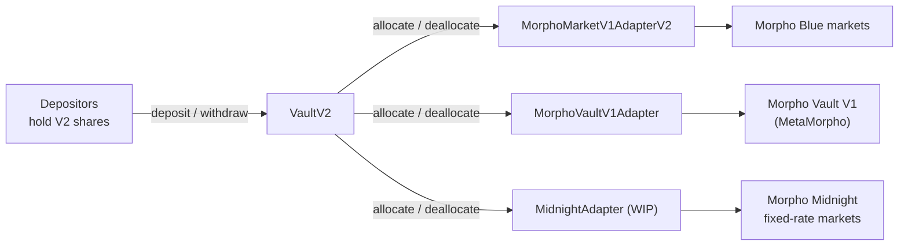
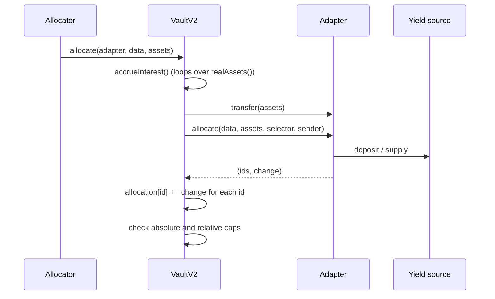
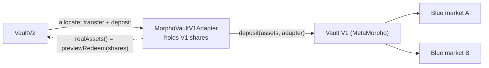

[Morpho](https://morpho.org/) is a lending protocol on Ethereum and other EVM chains. Its base layer, [Morpho Blue]({{site.url_complet}}/2026/10/10/morpho-blue-lending-markets/), is a set of isolated lending markets, and its vaults sit on top of it: a depositor gives one asset to a vault, and a curator decides which markets the vault lends to. In the second vault generation, Vault V2, the vault no longer calls any lending protocol itself. Every movement of funds goes through a separate contract called an **adapter**.

This article answers three questions about those adapters. What an adapter is and which rules it must follow; which adapters exist in the `morpho-org/vault-v2` repository and how they differ; and why a V2 vault would put its funds into a first-generation vault, Vault V1 (MetaMorpho), through the `MorphoVaultV1Adapter`, with the caveats the contract itself lists. The general design of Vault V2 (roles, timelocks, caps, fees) is covered in [How Morpho Vault V2 Works - Adapters, Caps, Timelocks and In-Kind Redemption]({{site.url_complet}}/2026/10/10/morpho-vault-v2-architecture/); this article stays on the adapter layer. Every statement is checked against the source at the commits pinned in the references.

> This article has been made with the help of [Claude Code](https://claude.com/product/claude-code) and several custom skills

[TOC]

## What an adapter is

An adapter is a smart contract placed between a Vault V2 and one kind of yield source. It knows how to deposit into that source, how to withdraw from it, and how to value the position it holds. The vault knows none of this: it sends tokens to the adapter, asks for them back, and reads the value the adapter reports.



The vault keeps two balances: **idle** assets, which are tokens held by the vault contract itself, and **allocated** assets, held by the adapters. Its total assets are the idle balance plus the sum of what each adapter reports.

## Why Vault V2 uses adapters

The first vault generation, [MetaMorpho]({{site.url_complet}}/2026/10/10/morpho-vault-v1-metamorpho/), is written against Morpho Blue. Its `totalAssets()` asks Blue for the vault's position in each market of its withdraw queue, and its `reallocate` calls Blue's `supply` and `withdraw` directly. Supporting a new yield source would mean a new vault contract.

Vault V2 moves that protocol-specific code out of the vault:

| Concern | Vault V1 (MetaMorpho) | Vault V2 |
|---------|----------------------|----------|
| Where funds can go | Morpho Blue markets, at most 30 | Anything an adapter supports |
| Who talks to the lending protocol | The vault | The adapter |
| How a position is valued | The vault reads Blue | The adapter's `realAssets()` |
| Risk limits | One supply cap per market | Caps on ids that the adapter returns |
| Adding a new kind of source | A new vault | A new adapter, added behind a timelock |

The vault core stays the same whatever the adapters do. In exchange, the vault must trust every number an adapter reports.

## The adapter interface

An adapter implements three functions, declared in `src/interfaces/IAdapter.sol`:

```solidity
interface IAdapter {
    function allocate(bytes memory data, uint256 assets, bytes4 selector, address sender)
        external
        returns (bytes32[] memory ids, int256 change);

    function deallocate(bytes memory data, uint256 assets, bytes4 selector, address sender)
        external
        returns (bytes32[] memory ids, int256 change);

    function realAssets() external view returns (uint256 assets);
}
```

| Parameter or return value | Meaning |
|---------------------------|---------|
| `data` | Adapter-specific bytes saying where the funds go. The Blue adapter expects ABI-encoded `MarketParams`; the Vault V1 adapter expects empty bytes. |
| `assets` | The amount of underlying tokens to deposit or withdraw. |
| `selector` | The vault function that triggered the call (`msg.sig` in the vault), for example `allocate`, `deposit` or `forceDeallocate`. |
| `sender` | The account that called the vault. |
| `ids` | The risk categories the position belongs to. The vault updates the allocation of each one and checks its caps. |
| `change` | The change in the value of the position since the last update, which can be negative. |
| `realAssets()` | The current value of everything the adapter holds, in units of the underlying asset. |

`selector` and `sender` let an adapter behave differently depending on who is calling. The two production adapters ignore them; the Midnight adapter uses them, for example to check that the caller of a sell holds the allocator or sentinel role.

## The rules an adapter must follow

`VaultV2.sol` opens with a "loose specification of adapters". The vault does not check these rules at runtime; it assumes them. An adapter that breaks one of them breaks the vault.

| Rule from the specification | What breaks otherwise |
|-----------------------------|-----------------------|
| Only the vault may call `allocate` and `deallocate`. | Anyone could move the vault's funds or change its recorded allocations. |
| The adapter enters and exits markets only in `allocate` and `deallocate`. | Positions would change without the vault updating allocations or checking caps. |
| The returned ids are correct and do not repeat. | Caps would be checked against the wrong categories, or the same change counted twice. |
| After `deallocate`, the vault has an approval to take at least `assets` from the adapter. | The vault's `transferFrom` reverts and withdrawals fail. |
| `deallocate` must be possible, so that in-kind redemption works. | Depositors could not exit through `forceDeallocate`. |
| Markets in which the vault has no allocation are ignored in the total. | Donations to unknown markets could raise the share price. |
| The adapter does not re-enter the vault, directly or indirectly. | Accounting done in the middle of a call could be read in an inconsistent state. |
| After an update, the sum of the changes reported for a market equals the current estimated position. | The recorded allocation drifts away from the real one, and caps stop meaning anything. |
| `realAssets()` does not revert. | Interest accrual reverts, and with it every deposit and withdrawal (a liveness requirement). |
| `deallocate` does not revert when the underlying markets are liquid. | Withdrawals fail even though the money is available (a liveness requirement). |

Two further points from the same comments matter for curators. Allocating to an id whose absolute cap is zero reverts, and deallocating from an id whose allocation is zero reverts; this stops interactions with unknown markets. And an adapter should be removed only once it holds no assets, with an id exclusive to it capped at zero so no allocator can send funds to it in the meantime.

## One allocation, step by step

The vault's side of an allocation is `allocateInternal`:

```solidity
function allocateInternal(address adapter, bytes memory data, uint256 assets) internal {
    require(isAdapter[adapter], ErrorsLib.NotAdapter());

    accrueInterest();

    SafeERC20Lib.safeTransfer(asset, adapter, assets);
    (bytes32[] memory ids, int256 change) = IAdapter(adapter).allocate(data, assets, msg.sig, msg.sender);

    for (uint256 i; i < ids.length; i++) {
        Caps storage _caps = caps[ids[i]];
        _caps.allocation = (int256(_caps.allocation) + change).toUint256();

        require(_caps.absoluteCap > 0, ErrorsLib.ZeroAbsoluteCap());
        require(_caps.allocation <= _caps.absoluteCap, ErrorsLib.AbsoluteCapExceeded());
        require(
            _caps.relativeCap == WAD || _caps.allocation <= firstTotalAssets.mulDivDown(_caps.relativeCap, WAD),
            ErrorsLib.RelativeCapExceeded()
        );
    }
    emit EventsLib.Allocate(msg.sender, adapter, assets, ids, change);
}
```

The vault sends the tokens first, then calls the adapter, then trusts the ids and the change it gets back. The cap checks run after the adapter has already deposited; if a cap is exceeded, the whole transaction reverts, deposit included.



The `change` is not `assets`. Each adapter computes it as the new value of the position minus the allocation the vault had recorded, so it also includes the interest earned since the last update:

$$
\begin{aligned}
\text{change} = \text{newAllocation} - \text{oldAllocation}
\end{aligned}
$$

An allocation of zero assets therefore has a use: it brings the recorded allocation of the position's ids up to date without moving any funds.

`deallocateInternal` runs in the opposite order. It calls the adapter's `deallocate`, requires each returned id to have a non-zero allocation, applies the change, and then pulls the tokens with `transferFrom`, which is why the adapter must have approved the vault.

Three vault functions lead to `deallocateInternal`:

- **`deallocate`**, called by an allocator or a sentinel.
- **`withdraw` and `redeem`**, through the liquidity adapter, when the idle balance does not cover the exit.
- **`forceDeallocate`**, which anyone can call. It charges a penalty of up to 2 % (`MAX_FORCE_DEALLOCATE_PENALTY`), set per adapter by the curator.

## How the vault values its adapters

At the first interaction of each transaction, the vault computes its total assets in `accrueInterestView`:

```solidity
uint256 realAssets = IERC20(asset).balanceOf(address(this));
for (uint256 i = 0; i < adapters.length; i++) {
    realAssets += IAdapter(adapters[i]).realAssets();
}
uint256 maxTotalAssets = _totalAssets + (_totalAssets * elapsed).mulDivDown(maxRate, WAD);
uint256 newTotalAssets = MathLib.min(realAssets, maxTotalAssets);
```

With $$I$$ the idle balance, $$R_i$$ the value reported by adapter $$i$$, $$T_0$$ the last recorded total, $$\Delta t$$ the elapsed time and $$r_{\max}$$ the `maxRate`:

$$
\begin{aligned}
T = \min\left(I + \sum_i R_i,\ T_0 + T_0 \cdot \Delta t \cdot r_{\max}\right)
\end{aligned}
$$

Three consequences:

- **The adapters set the share price.** If an adapter over-reports, the share price rises above what the vault can pay. If it under-reports, the vault records a loss.
- **Gains are capped, losses are not.** `maxRate` limits how fast the total can grow, but a fall in reported value is taken in full at the next interaction.
- **Every adapter is read on every interaction.** The vault loops through all adapters, and the market adapter loops through all its markets. Too many adapters or markets can make deposits and withdrawals expensive, and a single reverting `realAssets()` blocks the vault.

## The adapters in the repository

At the pinned commit, `vault-v2/src/adapters/` contains three adapters, each with a factory:

| | `MorphoMarketV1AdapterV2` | `MorphoVaultV1Adapter` | `MidnightAdapter` |
|---|---|---|---|
| Target | Morpho Blue markets (Blue is also called Morpho Market V1) | One Morpho Vault V1 (V1.0 or V1.1) | Morpho Midnight fixed-rate markets |
| Status | Production | Production | Work in progress (README) |
| `data` | ABI-encoded `MarketParams` | Must be empty | Adapter-specific |
| Ids returned | Adapter id, collateral-token id, market id | Adapter id only | Adapter id, enter and liquidator gates, threshold, and two ids per collateral |
| `realAssets()` | Sum of expected supply assets in each market it holds | `previewRedeem` of the V1 shares it holds | Linear accrual of interest per market, losses taken immediately |
| Restrictions | Loan token must be the vault's asset; IRM must be AdaptiveCurveIRM | The V1 vault's asset must equal the V2 vault's asset | Needs the allocator role in the vault to buy |
| Own timelocks | Yes, for `setSkimRecipient` and `burnShares` | No | Yes |
| Size | 275 lines | 109 lines | 609 lines |

The ids explain most of the difference. The market adapter returns three:

```solidity
ids_[0] = adapterId;                                                          // keccak256(abi.encode("this", adapter))
ids_[1] = keccak256(abi.encode("collateralToken", marketParams.collateralToken));
ids_[2] = keccak256(abi.encode("this/marketParams", address(this), marketParams));
```

The curator can therefore cap the whole adapter, all markets sharing a collateral token across every adapter that uses the same id, and each market on its own. The Vault V1 adapter returns only the first of these. Whatever the V1 vault does inside, the V2 vault sees one position and can cap only that position.

The market adapter also has `burnShares`, a timelocked function that writes off the adapter's shares in one market. It exists to remove a market whose positions can no longer be valued or withdrawn, for example because its IRM reverts. The burnt shares are lost.

## Who controls the adapters

| Action | Who | Timelocked |
|--------|-----|------------|
| `addAdapter`, `removeAdapter` | Curator, through `submit` | Yes |
| `setAdapterRegistry` | Curator, through `submit` | Yes |
| `increaseAbsoluteCap`, `increaseRelativeCap` on an id | Curator, through `submit` | Yes |
| `decreaseAbsoluteCap`, `decreaseRelativeCap` | Curator or sentinel | No |
| `setForceDeallocatePenalty` for an adapter | Curator, through `submit` | Yes |
| `allocate` | Allocator | No |
| `deallocate` | Allocator or sentinel | No |
| `setLiquidityAdapterAndData` | Allocator | No |
| `forceDeallocate` | Anyone | No, but costs the penalty |
| `revoke` a pending action | Curator or sentinel | No |

Any of the timelocked functions can be made permanently unavailable with `abdicate`, for example to freeze the list of adapters.

The **adapter registry** is an optional contract that `addAdapter` consults. When one is set, the vault also checks that every adapter it already has is in it. The repository ships three: `MorphoMarketV1RegistryV2`, `MorphoVaultV1Registry` and `RegistryList`, an append-only list of sub-registries. The registry only protects depositors if it is append-only and cannot later remove an adapter, which the source states explicitly.

The **liquidity adapter** is one adapter, with one `data` value, chosen by an allocator. New deposits are allocated to it automatically, and withdrawals that exceed the idle balance are taken from it. If one of its caps is full, deposits revert.

## Where the Vault V1 code lives

The V1 vault and the adapter that wraps it are in different repositories of the [`morpho-org`](https://github.com/morpho-org) organisation:

| Code | Repository | Main files |
|------|------------|------------|
| Vault V1.0 | [`morpho-org/metamorpho`](https://github.com/morpho-org/metamorpho) | `src/MetaMorpho.sol`, `src/MetaMorphoFactory.sol` |
| Vault V1.1 | [`morpho-org/metamorpho-v1.1`](https://github.com/morpho-org/metamorpho-v1.1) | `src/MetaMorphoV1_1.sol`, `src/MetaMorphoV1_1Factory.sol` |
| Adapter for V1 vaults | [`morpho-org/vault-v2`](https://github.com/morpho-org/vault-v2) | `src/adapters/MorphoVaultV1Adapter.sol`, `src/adapters/MorphoVaultV1AdapterFactory.sol` |
| Registry for V1 adapters | `morpho-org/vault-v2` | `src/periphery/registries/MorphoVaultV1Registry.sol` |

The archived `morpho-optimizers-vaults` repository is not Vault V1. It holds the ERC-4626 vaults of Morpho Optimizers, the protocol that preceded Morpho Blue.

## What a Morpho Vault V1 is

A Morpho Vault V1, first called MetaMorpho, is an [ERC-4626](https://eips.ethereum.org/EIPS/eip-4626) vault that lends one asset to Morpho Blue markets.

- **Depositors** give one asset, such as USDC, and receive vault shares.
- **The curator** decides which Blue markets are allowed and sets a supply cap for each one.
- **The allocator** orders a supply queue and a withdraw queue, and moves funds between markets with `reallocate`.
- **The guardian** can veto pending changes, which are behind one timelock.
- **The yield** is the interest that borrowers pay in the underlying markets, minus a performance fee of at most 50 %.

Its limits are the ones Vault V2 addresses. It can only lend to Blue. Its caps are per market, so it cannot express "at most 30 % exposure to stETH collateral" across several markets. And its two versions handle bad debt differently:

- **V1.0 realises bad debt.** When a market writes off debt, the vault's `totalAssets` falls and its share price drops.
- **V1.1 does not.** It adds the loss to a `lostAssets` counter and reports `totalAssets = realTotalAssets + lostAssets`, so the share price does not fall.

The full design is in [How Morpho Vault V1 (MetaMorpho) Works, and What Vault V2 Changes]({{site.url_complet}}/2026/10/10/morpho-vault-v1-metamorpho/).

## Using a Vault V1 through MorphoVaultV1Adapter

A Vault V2 cannot deposit anywhere except through an adapter. To put funds into an existing V1 vault, it needs `MorphoVaultV1Adapter`.

### Why a curator would do it

- **To reuse existing liquidity and curation.** Many V1 vaults are large and have a track record. A V2 vault can allocate to one of them instead of rebuilding the same allocation across Blue markets.
- **To migrate gradually.** A curator can launch a V2 vault whose first allocation is the curator's own V1 vault, then move funds to direct market positions over time.
- **To give depositors V2's tools on top of V1 funds.** The V2 vault brings id-based caps, per-function timelocks, the sentinel role, `forceDeallocate`, gates and the management fee, even while the money stays in V1.



### How the adapter works

The contract is 109 lines long. The constructor checks the assets and gives two unlimited approvals:

```solidity
constructor(address _parentVault, address _morphoVaultV1) {
    factory = msg.sender;
    parentVault = _parentVault;
    morphoVaultV1 = _morphoVaultV1;
    adapterId = keccak256(abi.encode("this", address(this)));
    address asset = IVaultV2(_parentVault).asset();
    require(asset == IERC4626(_morphoVaultV1).asset(), AssetMismatch());
    SafeERC20Lib.safeApprove(asset, _parentVault, type(uint256).max);
    SafeERC20Lib.safeApprove(asset, _morphoVaultV1, type(uint256).max);
}
```

The approval to the V1 vault lets it pull tokens on `deposit`; the approval to the V2 vault lets it pull them back after `deallocate`. `allocate` and `deallocate` are short:

```solidity
function allocate(bytes memory data, uint256 assets, bytes4, address) external returns (bytes32[] memory, int256) {
    require(data.length == 0, InvalidData());
    require(msg.sender == parentVault, NotAuthorized());

    if (assets > 0) IERC4626(morphoVaultV1).deposit(assets, address(this));
    uint256 oldAllocation = allocation();
    uint256 newAllocation = IERC4626(morphoVaultV1).previewRedeem(IERC4626(morphoVaultV1).balanceOf(address(this)));

    return (ids(), int256(newAllocation) - int256(oldAllocation));
}
```

| Function | What it does |
|----------|--------------|
| `allocate` | Deposits into the V1 vault with the adapter as receiver, so the adapter holds the V1 shares. Returns the adapter id and the change in value. |
| `deallocate` | Calls `withdraw(assets, adapter, adapter)` on the V1 vault. The V2 vault then pulls the tokens with its approval. |
| `realAssets()` | Returns `previewRedeem` of the adapter's V1 share balance, or 0 if the vault's recorded allocation for the adapter id is 0. |
| `ids()` | Returns one id, `keccak256(abi.encode("this", adapter))`. |
| `skim(token)` | Sends any token the adapter holds, such as reward tokens, to a recipient set by the V2 vault's owner. It cannot send the V1 shares. |

The adapter is deployed by `MorphoVaultV1AdapterFactory` with `CREATE2` and a zero salt, so there is one adapter per pair of V2 vault and V1 vault. `MorphoVaultV1Registry` accepts an adapter only if it comes from that factory and if its V1 vault comes from the MetaMorpho factory the registry was built with.

### The caveats in the contract's comments

The NatSpec header of `MorphoVaultV1Adapter.sol` lists the conditions under which the adapter is safe. Each one is a decision for the curator.

| Caveat | Consequence |
|--------|-------------|
| V1.1 vaults do not realise bad debt. | A loss inside the V1.1 vault does not show in the V2 share price either (see the example below). |
| Only one id is returned. | The V2 vault cannot see or cap the Blue markets inside the V1 vault. That risk is left to the V1 curator. |
| The V1 vault must be protected against inflation attacks by an initial deposit. | Without it, the first depositor in V1 could manipulate the V1 share price that `realAssets()` relies on. |
| The V1 vault must not have a market whose IRM can re-enter the V2 vault or the adapter. | It would break the no-re-entrancy rule of the adapter specification. |
| A gated V1 vault can break in-kind redemption. | A V2 depositor who exits with `forceDeallocate` may be unable to deposit into the V1 vault. |
| If `expectedSupplyAssets` reverts for one market of the V1 vault, `realAssets()` reverts. | The V2 vault cannot accrue interest, so deposits and withdrawals stop. |
| Rounding losses are realisable. | Small losses from rounding pass through to the V2 share price. |
| The adapter must not share its id with another adapter. | Two adapters on one id would mix their allocations and caps. |
| It was designed and audited for V1.0 and V1.1 only. | Using it with any other ERC-4626 vault needs its own security review. |

Two behaviours of the V1 vault also affect the V2 vault through the adapter. A V1 vault deposit reverts with `AllCapsReached` when its supply queue cannot absorb the whole amount, so an allocation through the adapter can fail even when the V2 caps allow it. And a V1 withdrawal reverts with `NotEnoughLiquidity` when its withdraw queue cannot supply the amount, so `deallocate` and `forceDeallocate` depend on the liquidity of the V1 vault's markets.

### Example: a loss in a V1.1 vault

A V2 vault holds 10,000,000 USDC, of which 4,000,000 is allocated through the adapter to a V1.1 vault with 10,000,000 USDC in total. The V2 vault therefore owns 40 % of the V1.1 shares. One market of the V1.1 vault writes off 500,000 USDC of bad debt.

| | V1.0 vault | V1.1 vault |
|---|---|---|
| V1 real assets after the loss | 9,500,000 | 9,500,000 |
| V1 `totalAssets()` | 9,500,000 | 10,000,000 (500,000 in `lostAssets`) |
| Adapter `realAssets()`, 40 % of the shares | 3,800,000 | 4,000,000 |
| V2 total assets at the next interaction | 9,800,000 | 10,000,000 |
| V2 share price | Falls by 2 % | Unchanged |

With V1.0, the V2 vault records its 200,000 loss and every V2 depositor bears it in proportion. With V1.1, the V2 vault keeps reporting 10,000,000. The loss still exists: the V1.1 vault holds 500,000 less than its shares claim, and the depositors who withdraw last, in V1.1 or in V2, are the ones who cannot be paid in full.

## Assessing an adapter

Because the vault trusts adapters completely, enabling one puts depositors' funds under that contract's code, and reviewing one is a main part of auditing a Vault V2. A review can follow the specification:

1. **Access control.** `allocate` and `deallocate` revert unless the caller is the parent vault.
2. **Ids.** Every position returns the ids the curator expects, without repetition, and none collide with another adapter's ids.
3. **Change.** The returned change equals the new value minus the recorded allocation, so repeated updates sum to the real position.
4. **Valuation.** `realAssets()` cannot be inflated by a donation, cannot be manipulated within one transaction, and ignores positions the vault has no allocation for.
5. **Liveness.** `realAssets()` cannot revert, and `deallocate` succeeds whenever the underlying source has liquidity.
6. **Approvals.** After `deallocate`, the vault can pull the assets it asked for.
7. **Re-entrancy.** No call path, including through the yield source or its IRM, calls back into the vault or the adapter.
8. **Gas.** The cost of `realAssets()` stays bounded as positions are added.
9. **Admin functions.** Any function on the adapter itself (skim recipient, share burning) is either owner-restricted or timelocked.

## Conclusion

An adapter is the only way a Vault V2 can send funds to a yield source, and it is fully trusted: it holds the funds, values them, and tells the vault which caps apply.

- **The interface is three functions.** `allocate` and `deallocate` move funds and return ids and a change; `realAssets()` reports the position's value, which the vault sums into its total assets.
- **The rules are assumed, not enforced.** The vault relies on the adapter to restrict callers, return correct ids, keep its approvals, avoid re-entrancy and never revert on `realAssets()`.
- **The ids carry the risk model.** The market adapter returns adapter, collateral and market ids; the Vault V1 adapter returns only its own id.
- **Vault V1 code is in two repositories**, `morpho-org/metamorpho` for V1.0 and `morpho-org/metamorpho-v1.1` for V1.1, while the adapter that wraps them is in `morpho-org/vault-v2`.
- **`MorphoVaultV1Adapter` lets a V2 vault hold V1 shares** to reuse existing curation or migrate gradually, at the cost of seeing the V1 vault as one opaque position.
- **V1.1 losses do not show in the V2 share price** through the adapter, because V1.1 keeps them in `lostAssets`.


## Annex

### Key Terms

| Term | Definition |
|------|------------|
| **Adapter** | A contract that deposits a Vault V2's funds into one kind of yield source, withdraws them, and reports their value. |
| **Parent vault** | The Vault V2 an adapter serves. Only it may call `allocate` and `deallocate`. |
| **Id** | A `bytes32` naming a risk category, such as an adapter, a collateral token or a market. Caps and allocations are kept per id. |
| **Allocation** | The amount the vault has recorded for an id, updated by the `change` an adapter returns. It can be out of date between updates. |
| **Change** | The value an adapter returns from `allocate` or `deallocate`: new position value minus recorded allocation. |
| **`realAssets()`** | The current value of an adapter's positions, summed by the vault to compute its total assets. |
| **Liquidity adapter** | The adapter, with fixed `data`, that receives new deposits and serves withdrawals beyond the idle balance. |
| **Adapter registry** | An optional contract that restricts which adapters the vault may add. |
| **`forceDeallocate`** | A vault function anyone can call to move funds from an adapter back to the vault, paying a penalty of up to 2 %. |
| **Morpho Vault V1 (MetaMorpho)** | The first vault generation: an ERC-4626 vault lending one asset to up to 30 Morpho Blue markets. |
| **`lostAssets`** | The V1.1 counter that keeps bad debt in `totalAssets` instead of lowering the share price. |
| **`MorphoVaultV1Adapter`** | The adapter that deposits a Vault V2's funds into one V1 vault and reports `previewRedeem` of the shares it holds. |

### Invariants

| Invariant | Enforced by | Breaks if |
|-----------|-------------|-----------|
| Only the parent vault moves an adapter's funds. | `require(msg.sender == parentVault)` in each adapter | An adapter omits the check. |
| The allocation of every returned id stays within its absolute cap at allocation time. | `allocateInternal` | The adapter returns the wrong ids. |
| The vault's total assets never grow faster than `maxRate`. | `accrueInterestView` | Never; a fall is not bounded. |
| A Vault V1 adapter only accepts a V1 vault with the same asset. | Constructor `AssetMismatch` check | Never, once deployed. |
| The V1 shares held by the adapter cannot be skimmed. | `CannotSkimMorphoVaultV1Shares` | Never. |

### Integration Notes

| Behaviour | What an integrator should do |
|-----------|------------------------------|
| An allocation through the Vault V1 adapter can revert with the V1 vault's `AllCapsReached`. | Check the V1 vault's supply caps before allocating or choosing it as liquidity adapter. |
| `deallocate` depends on the V1 vault's withdraw-queue liquidity. | Monitor the liquidity of the V1 vault's markets, not only the V2 vault. |
| A V1.1 vault hides its losses from the V2 share price. | Read the V1.1 vault's `lostAssets` when valuing a V2 vault that holds it. |
| A reverting `realAssets()` blocks every deposit and withdrawal. | Check that every market inside a wrapped V1 vault can be valued. |
| Allocations are only updated on `allocate` and `deallocate`. | Track allocations from `Allocate` and `Deallocate` events, or allocate zero to refresh them. |

## Frequently Asked Questions

**Q: What three functions must a Vault V2 adapter implement?**

`allocate`, which deposits funds into the yield source; `deallocate`, which withdraws them and leaves the vault an approval to take them; and `realAssets()`, which reports the current value of the adapter's positions. The first two return a list of ids and the change in the position's value.

---

**Q: Why does the vault trust the ids an adapter returns?**

The vault has no knowledge of the yield source, so it cannot compute the ids itself. It adds the change to each returned id and checks that id's caps. An adapter that returned the wrong ids would make the vault check the wrong caps, which is why adding an adapter is timelocked and can be restricted by a registry.

---

**Q: What is the difference between `assets` and `change` in an allocation?**

`assets` is the number of tokens moved in this call. `change` is the new value of the position minus the allocation the vault had recorded, so it also includes interest earned since the last update. An allocation of zero assets can still return a non-zero change.

---

**Q: Where is the source code of Morpho Vault V1?**

V1.0 is in `morpho-org/metamorpho` (`src/MetaMorpho.sol`), and V1.1 in `morpho-org/metamorpho-v1.1` (`src/MetaMorphoV1_1.sol`). The adapter that lets a Vault V2 deposit into either of them is in `morpho-org/vault-v2`, in `src/adapters/MorphoVaultV1Adapter.sol`.

---

**Q: Why would a curator allocate a V2 vault into a V1 vault rather than directly into Blue markets?**

To reuse an existing V1 vault's liquidity and curation, to migrate from V1 to V2 gradually, or to give depositors V2's tools (id-based caps, sentinels, in-kind redemption, gates) while the funds stay where they are. The cost is that the V2 vault sees the V1 position as a single id and cannot cap the markets inside it.

---

**Q: A V2 vault holds shares of a V1.1 vault that suffers bad debt. Why does the V2 share price not move, and who bears the loss?**

V1.1 adds the loss to `lostAssets` and keeps it in `totalAssets`, so `previewRedeem` of the V1.1 shares does not fall. The adapter's `realAssets()` is that `previewRedeem` value, so the V2 vault's total assets do not fall either. The loss is still real: the V1.1 vault holds fewer assets than its shares claim, and the depositors who exit last are the ones left unpaid.

---

**Q: How can a single market inside a V1 vault stop a V2 vault from working?**

The adapter's `realAssets()` calls the V1 vault's `previewRedeem`, which values every market in the V1 vault's withdraw queue through `expectedSupplyAssets`. If that call reverts for one market, for example because its IRM reverts, `realAssets()` reverts. The V2 vault calls `realAssets()` on every adapter at the first interaction of each transaction, so deposits and withdrawals revert until the curator removes the problem.

## References

- [Claude Code](https://claude.com/product/claude-code)

### Analyzed source

- [morpho-org/vault-v2](https://github.com/morpho-org/vault-v2) analyzed at commit [`d992cb8438b8630b3fee4649311d78d649264a5e`](https://github.com/morpho-org/vault-v2/tree/d992cb8438b8630b3fee4649311d78d649264a5e), 2026-10-10
- [morpho-org/metamorpho](https://github.com/morpho-org/metamorpho) analyzed at commit [`ded84e59668155b34d3c24906c4f7461c12828af`](https://github.com/morpho-org/metamorpho/tree/ded84e59668155b34d3c24906c4f7461c12828af), 2026-10-10
- [morpho-org/metamorpho-v1.1](https://github.com/morpho-org/metamorpho-v1.1) analyzed at commit [`3b17547ee464d00370d1e5e7cd997c3cdb8b0fb7`](https://github.com/morpho-org/metamorpho-v1.1/tree/3b17547ee464d00370d1e5e7cd997c3cdb8b0fb7), 2026-10-10

### Morpho documentation

- [Morpho Vaults V2 contract reference](https://docs.morpho.org/developers/contracts/morpho-vaults-v2)
- [MorphoVaultV1Adapter reference](https://docs.morpho.org/developers/contracts/morpho-vault-v1-adapter)
- [MorphoMarketV1AdapterV2 reference](https://docs.morpho.org/developers/contracts/morpho-market-v1-adapter-v2)

### Standards

- [ERC-4626 - Tokenized Vaults](https://eips.ethereum.org/EIPS/eip-4626)
- [OpenZeppelin - ERC-4626 inflation attack](https://docs.openzeppelin.com/contracts/5.x/erc4626#inflation-attack)

### Related articles

- [Vault Curator - Steak House Finance]({{site.url_complet}}/2025/11/06/steakhouse-finance-overview/)
- [How Centrifuge Vaults Work — Asynchronous ERC-7540 Investment on a Hub-and-Spoke Protocol]({{site.url_complet}}/2026/08/18/centrifuge-vaults/)
- [The Technical Concepts Behind the 2024 Crypto Hacks]({{site.url_complet}}/2026/10/07/crypto-hacks-2024-technical-concepts/)
