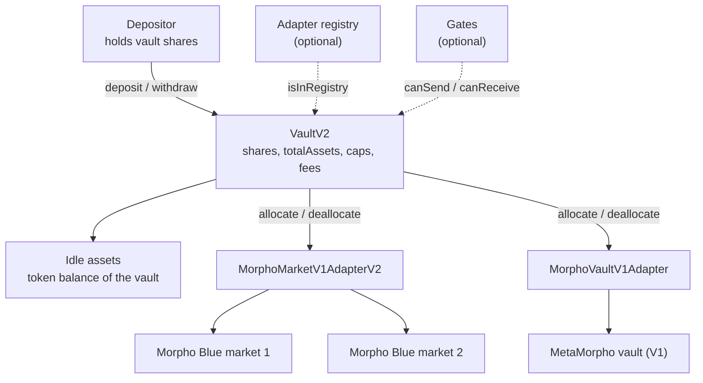
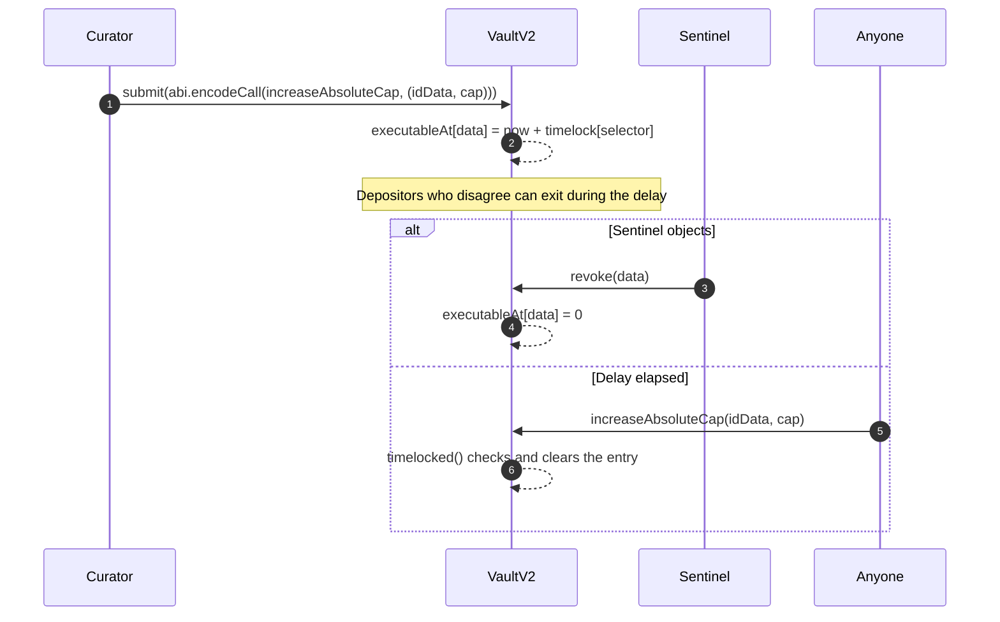
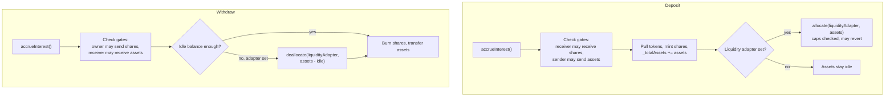
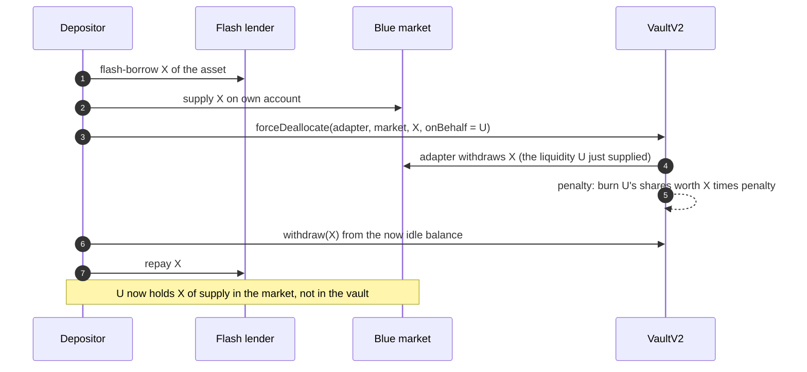

[Morpho](https://morpho.org/) is a lending protocol on Ethereum and other EVM chains. Its base layer, [Morpho Blue]({{site.url_complet}}/2026/10/10/morpho-blue-lending-markets/), is a set of isolated and immutable lending markets; its vaults sit on top and let a depositor lend to several markets at once without choosing them. Vault V2 is the second generation of those vaults, and its main change is that a vault no longer talks to Morpho Blue directly but through pluggable contracts called adapters.

This article explains how a Vault V2 is built: the contracts involved, the four roles and what each one may do, the timelock system that protects depositors from configuration changes, the cap system expressed over abstract identifiers, the share accounting with its rate limit and fees, and the exit paths, including the in-kind redemption performed with `forceDeallocate`. Every statement is taken from the `morpho-org/vault-v2` source at the commit pinned in the references. A companion article, [Monitoring a Morpho Vault V2 - What a Depositor Needs to Watch]({{site.url_complet}}/2026/10/10/morpho-vault-v2-risk-monitoring/), starts from the same code and looks at it from the depositor's side: where losses come from and which on-chain signals reveal them.

> This article has been made with the help of [Claude Code](https://claude.com/product/claude-code) and several custom skills

[TOC]

## From MetaMorpho to Vault V2

The first generation of Morpho vaults, MetaMorpho (now called Morpho Vaults V1), supplies a single asset to a list of Morpho Blue markets, ordered by a supply queue and a withdraw queue, with one cap per market. Its design is tied to Blue: a vault can only hold Blue supply positions. [How Morpho Vault V1 (MetaMorpho) Works, and What Vault V2 Changes]({{site.url_complet}}/2026/10/10/morpho-vault-v1-metamorpho/) describes it in detail.

Vault V2 keeps the idea of a curated, non-custodial [ERC-4626](https://eips.ethereum.org/EIPS/eip-4626) vault and generalises the rest:

| Concern | Vaults V1 (MetaMorpho) | Vault V2 |
|---------|------------------------|----------|
| Where funds go | Morpho Blue markets only | Any protocol for which an adapter exists |
| Risk limits | One supply cap per market | Absolute and relative caps per abstract id (market, collateral, adapter) |
| Exit when markets are illiquid | Wait for liquidity | In-kind redemption with `forceDeallocate` |
| Configuration changes | Timelock for sensitive actions | Per-function timelock, plus permanent abdication |
| Access control | None on deposits and transfers | Four optional gate contracts |
| Interest smoothing | None | `maxRate` cap on share-price growth |

The core contract is `VaultV2.sol`, about 900 lines. It is immutable: there is no proxy and no upgrade path. New vaults are deployed by `VaultV2Factory`.

## Architecture

A Vault V2 holds two kinds of assets: an **idle** balance of the underlying token, kept in the vault contract itself, and **allocated** assets, held by adapters on the vault's behalf.



The repository contains the following contracts at the pinned commit:

- **`VaultV2` and `VaultV2Factory`**: the vault and its deployer.
- **Adapters**: `MorphoMarketV1AdapterV2` supplies to Morpho Blue markets that use the AdaptiveCurveIRM interest-rate model; `MorphoVaultV1Adapter` deposits into a MetaMorpho vault; `MidnightAdapter` targets Morpho Midnight, the fixed-rate protocol, and is still described as work in progress in the README. Each adapter has its own factory.
- **Registries**: `MorphoMarketV1RegistryV2` and `MorphoVaultV1Registry` accept only adapters deployed by the official factories, and `RegistryList` is an append-only list of such sub-registries.
- **Gates**: `WhitelistReceiveSharesGate` and `WhitelistSendAssetsGate`, two reference implementations.
- **`BluePublicAllocator`**: a periphery contract that lets anyone, not only the vault's allocators, move liquidity between Blue markets within limits set by the allocators. The caller pays a penalty proportional to the assets moved, which goes to the vault.

The adapter interface has three functions:

```solidity
interface IAdapter {
    function allocate(bytes memory data, uint256 assets, bytes4 selector, address sender)
        external returns (bytes32[] memory ids, int256 change);

    function deallocate(bytes memory data, uint256 assets, bytes4 selector, address sender)
        external returns (bytes32[] memory ids, int256 change);

    function realAssets() external view returns (uint256 assets);
}
```

`allocate` and `deallocate` move funds in and out of the target protocol and return two things: the list of **ids** the position belongs to, and the **change** in the value of the position. `realAssets` returns the current value of everything the adapter holds. The vault never inspects the target protocol; it trusts the adapter's report. This is why the choice of adapters is a curator decision, behind a timelock, and why a registry can restrict it further. The rules an adapter must follow, the three adapters in the repository and the Vault V1 adapter's caveats are covered in [Morpho Vault V2 Adapters - How a Vault Allocates, and Why It Wraps a Vault V1]({{site.url_complet}}/2026/10/10/morpho-vault-v2-adapters/).

## Roles

Four roles act on a vault. Only one address can be owner and one curator; there can be several allocators and sentinels.

| Role | Set by | Can do | Cannot do |
|------|--------|--------|-----------|
| **Owner** | Previous owner | Set the curator and sentinels, set name and symbol | Move funds or change risk parameters |
| **Curator** | Owner | Submit configuration changes: adapters, registry, caps, gates, allocators, fees, timelocks, `forceDeallocate` penalties. Decrease caps immediately. Revoke pending changes | Execute an increase in risk before its timelock has passed |
| **Allocator** | Curator (timelocked) | `allocate` and `deallocate` within the caps, set the liquidity adapter, set `maxRate` | Change caps, adapters or fees |
| **Sentinel** | Owner | `deallocate`, decrease caps, revoke pending changes | Allocate, or add risk in any form |

The comments in the source summarise the intent. The owner cannot directly hurt depositors, the curator cannot do so without going through a timelock, and allocators move funds only inside the bounds the curator set. Roles are not two-step: anyone can be given a role without accepting it.

Two allocator powers take effect without any timelock. Setting the liquidity adapter can make deposits or withdrawals revert, and setting `maxRate` to zero stops the share price from rising. Neither can block an in-kind redemption, described further below.

## Timelocks and abdication

Every curator function except the two cap decreases is protected by `timelocked()`. A change goes through two steps:

1. The curator calls `submit(data)`, where `data` is the full calldata of the future call. The vault records `executableAt[data] = block.timestamp + timelock[selector]`.
2. Once that time has passed, **anyone** can send the exact same calldata. `timelocked()` checks that the data was submitted, that the delay has passed and that the function was not abdicated, then clears the entry.

Between the two, the curator or any sentinel can cancel the change with `revoke(data)`.



Timelocks are set per function selector, and three details matter:

- **Decreasing a timelock is itself timelocked by the timelock being decreased.** `submit` reads the selector inside the `decreaseTimelock` calldata and applies `timelock[thatSelector]`. A curator who set seven days on `addAdapter` needs seven days to lower it.
- **Increasing a timelock is immediate if the timelock of `increaseTimelock` is zero**, which is the default. The source warns that a very large value can make a function impossible to submit for good, since `block.timestamp + timelock` must not overflow.
- **`abdicate(selector)` disables a function permanently.** Data can still be submitted for it, but `timelocked()` will revert. A curator who abdicates `setAdapterRegistry` after setting an append-only registry commits the vault to that family of adapters forever.

At deployment every timelock is zero and no gate is set, so the curator can configure the vault quickly. The source recommends batching the gate configuration with the creation if the vault must not be open, even briefly. Depositors should check the timelocks on the deployed vault rather than assume them.

The cap decreases, `decreaseAbsoluteCap` and `decreaseRelativeCap`, are not timelocked and can be called by the curator or a sentinel. Lowering a cap only reduces risk, so there is no reason to delay it.

## Ids and caps

Vault V2 does not cap markets directly. It caps **ids**: a `bytes32` that names a risk factor several positions can share. On every `allocate` and `deallocate`, the adapter returns the ids of the position, and the vault adds the `change` to the `allocation` of each of them.

`MorphoMarketV1AdapterV2` returns three ids for each Blue market:

```solidity
ids_[0] = adapterId;                                                          // keccak256("this", adapter)
ids_[1] = keccak256(abi.encode("collateralToken", marketParams.collateralToken));
ids_[2] = keccak256(abi.encode("this/marketParams", address(this), marketParams));
```

The second id is the useful one: two markets with the same collateral and different oracles or liquidation thresholds both count against the same collateral cap. A curator can therefore limit exposure to, for example, one liquid staking token across every market that accepts it, whatever adapter or market the funds sit in. `MorphoVaultV1Adapter` returns only its own adapter id, since a MetaMorpho vault is treated as a single position.

Each id carries two limits:

- **Absolute cap**: a maximum allocation in units of the underlying asset. An absolute cap of zero blocks allocation entirely, which is how a market or adapter is switched off.
- **Relative cap**: a maximum fraction of the vault's total assets, in WAD (`1e18` = 100 %). A value of exactly `1e18` disables the check.

The checks run in `allocateInternal`, after the adapter has reported its change:

$$
\begin{aligned}
\text{allocation}(id) &\le \text{absoluteCap}(id), \qquad \text{absoluteCap}(id) \gt 0 \\
\text{allocation}(id) &\le A^{\text{first}} \cdot \text{relativeCap}(id) \quad \text{unless relativeCap}(id) = 1
\end{aligned}
$$

where $$A^{\text{first}}$$ is `firstTotalAssets`, the vault's total assets after the first interest accrual of the current transaction. It is stored in transient storage ([EIP-1153](https://eips.ethereum.org/EIPS/eip-1153)), so it resets at the end of each transaction. Measuring the relative cap against this value rather than the live total stops an allocator from inflating total assets with a flash-loaned deposit, allocating against the larger base and withdrawing again within the same transaction.

Three consequences follow from where the checks sit:

- **Caps are checked on allocation only.** Interest earned in a market, or a donation to an adapter, can push an allocation above its cap without any revert.
- **Relative caps are soft.** Withdrawals reduce total assets without touching allocations, so the fraction held in a market can exceed its relative cap after other depositors leave.
- **Allocations can be stale.** An id's `allocation` is updated only when someone allocates to or deallocates from that position, so it does not reflect interest or losses accrued since then. The source advises tracking allocations from the `Allocate` and `Deallocate` events.

## Accounting

### Total assets and the max rate

The vault stores `_totalAssets`, the last recorded value of its holdings. Interest and losses are accounted once per transaction, at the first interaction that calls `accrueInterest()`. That function computes the real value of the vault, the idle balance plus the `realAssets()` of every adapter, and then applies the rate limit:

$$
\begin{aligned}
R &= \text{idle} + \textstyle\sum_{a} \text{realAssets}(a) \\
A^{\max} &= A^{0} + A^{0} \cdot \Delta t \cdot r \\
A^{1} &= \min\left(R, A^{\max}\right) \\
I &= \max\left(0, A^{1} - A^{0}\right)
\end{aligned}
$$

Here $$A^{0}$$ is the stored total, $$\Delta t$$ the time since the last update, and $$r$$ the allocator-set `maxRate`, a per-second rate in WAD capped at 200 % per year. $$A^{1}$$ becomes the new `_totalAssets` and $$I$$ is the interest distributed.

The minimum has an asymmetric effect:

- **Gains are smoothed.** If the markets earned more than `maxRate` allows, the excess stays in the vault, unaccounted, and is distributed in later periods. A curator can use this to keep the displayed rate stable or to build a buffer against future losses.
- **Losses are not.** If $$R$$ is lower than $$A^{0}$$, the new total is $$R$$ and the share price drops at once.

Donations also count as gains. Tokens sent to the vault, and the penalties paid on `forceDeallocate`, raise $$R$$ and are distributed at most at `maxRate`. The source notes that a high displayed rate can attract opportunistic depositors who dilute the interest, which a lower `maxRate` mitigates.

Accounting once per transaction is also a security measure. Because later interactions in the same transaction see the stored total and not a recomputed one, an attacker cannot flash-borrow shares, trigger a loss and profit from the price movement within one transaction. Lending shares over longer periods remains a risk, and the source states that vault shares should not be loanable.

### Fees

Two fees are paid to recipients set by the curator, in newly minted shares:

$$
\begin{aligned}
F^{p} &= I \cdot f^{p}, \qquad f^{p} \le 50\,\% \\
F^{m} &= A^{1} \cdot \Delta t \cdot f^{m}, \qquad f^{m} \le 5\,\% \text{ per year}
\end{aligned}
$$

The performance fee $$F^{p}$$ is a share of the distributed interest, so it follows `maxRate` and not the real interest. The management fee $$F^{m}$$ is a share of total assets and is taken whether the vault gains or loses, so it can lower the share price on its own. Both are converted to shares against the total net of fees, and both are rounded down. A fee is only taken if its recipient passes the receive-shares gate.

`totalSupply` does not include the fee shares that would be minted at the next accrual. The `preview*` and `convertTo*` functions do include them, by calling `accrueInterestView()`.

### Share conversion

The vault uses one virtual asset and $$v = 10^{\max(0, 18 - d)}$$ virtual shares, where $$d$$ is the decimals of the underlying token. Vault shares therefore have 18 decimals for any asset with 18 decimals or fewer. With $$S$$ the share supply including pending fee shares:

$$
\begin{aligned}
\text{shares on deposit} &= \left\lfloor a \cdot \frac{S + v}{A^{1} + 1} \right\rfloor \\
\text{assets on redeem} &= \left\lfloor s \cdot \frac{A^{1} + 1}{S + v} \right\rfloor
\end{aligned}
$$

`mint` and `withdraw` round up instead, so every conversion favours the vault. The virtual shares make the classic ERC-4626 inflation attack expensive, but the source still recommends seeding a new vault with an initial deposit, both against that attack and because repeated dust losses from adapter rounding could otherwise move the share price noticeably in a near-empty vault.

## Deposits and withdrawals

A deposit or a withdrawal goes through the following steps. The vault checks the gates, moves the tokens and updates `_totalAssets`, then uses the **liquidity adapter** if the allocator has set one.



The liquidity adapter and its data are a single pair, used for both entry and exit, so that depositing then withdrawing the same amount leaves the allocation unchanged. A typical choice is a liquid Morpho Blue market. Every other allocation is the allocators' job, done with explicit `allocate` and `deallocate` calls.

Two behaviours differ from what an ERC-4626 integrator may expect:

- **The `max*` functions always return zero.** `maxDeposit`, `maxMint`, `maxWithdraw` and `maxRedeem` return 0 because the vault cannot guarantee that a gate call or an adapter call will not revert. An integration that reads them as limits will conclude that the vault accepts nothing. The Morpho documentation describes how to compute actual limits from the caps and the market liquidity.
- **A deposit can revert on a cap.** If the liquidity adapter's ids are at their absolute or relative cap, `deposit` and `mint` revert. On an empty or nearly empty vault the relative cap check is likely to fail, which is another reason to seed the vault.

The vault also implements [ERC-2612](https://eips.ethereum.org/EIPS/eip-2612) `permit` on its shares, with an [EIP-712](https://eips.ethereum.org/EIPS/eip-712) domain made of the chain id and the vault address, and a `multicall` that lets an externally owned account batch several administrative calls.

## In-kind redemption with forceDeallocate

A withdrawal can only pay from idle assets and the liquidity adapter. If both are empty and the allocators do not move funds, a depositor cannot exit through `withdraw`. Vault V2 adds a second exit, `forceDeallocate`, which **anyone** can call:

```solidity
function forceDeallocate(address adapter, bytes memory data, uint256 assets, address onBehalf)
    external returns (uint256)
{
    bytes32[] memory ids = deallocateInternal(adapter, data, assets);
    uint256 penaltyAssets = assets.mulDivUp(forceDeallocatePenalty[adapter], WAD);
    uint256 penaltyShares = withdraw(penaltyAssets, address(this), onBehalf);
    emit EventsLib.ForceDeallocate(msg.sender, adapter, assets, onBehalf, ids, penaltyAssets);
    return penaltyShares;
}
```

It moves `assets` from an adapter back to the vault's idle balance, then charges `onBehalf` a penalty, set by the curator per adapter and capped at 2 %. The penalty is charged as a withdrawal whose receiver is the vault itself: the caller's shares are burned and the assets stay in the vault, where they count as a donation to the remaining depositors at the next accrual.

On its own, `forceDeallocate` only frees liquidity. Combined with a flash loan it becomes an **in-kind redemption**: the depositor leaves the vault and ends up holding a position in the underlying market instead of the vault's token.



The source gives the optimal amount for a depositor holding $$a$$ assets in a fully illiquid vault: $$\min\left(L, a / (1 + p)\right)$$, where $$L$$ is the market's available liquidity and $$p$$ the penalty.

The penalty exists because relative caps are not checked on exit. Without it, anyone could reshape the vault's allocation for free by forcing deallocations from chosen markets. With a 0 % penalty, the only cost is gas.

In-kind redemption and timelocks together form the vault's **non-custodial guarantee**: when the curator submits a change that adds risk, every depositor can leave before it takes effect, even if no market has liquidity, provided the relevant timelocks are long enough to act on.

## Gates

A vault can be restricted by up to four gate contracts. Each is a single view function returning a boolean, and a gate set to the zero address imposes no restriction.

| Gate | Checked on | Effect if it refuses or reverts |
|------|-----------|---------------------------------|
| `receiveSharesGate` | Deposit and mint (receiver), transfer (receiver), fee minting | Can block all vault interactions if it reverts or runs out of gas; can prevent a user from getting shares back from another contract |
| `sendSharesGate` | Withdraw and redeem (owner), transfer (sender) | Can lock users inside the vault |
| `receiveAssetsGate` | Withdraw and redeem (receiver) | Can lock users inside the vault; the vault itself is always allowed, so penalties still work |
| `sendAssetsGate` | Deposit and mint (sender) | Restricts entry only; cannot block existing funds |

Gates turn a Vault V2 into a permissioned vault, for example one open only to KYC-verified addresses. The source documents the limit of the approach: a whitelisted address can hold shares on behalf of others, so a share gate controls who holds the token, not who benefits from it. Three of the four gates can trap funds, which is why setting them is a timelocked curator action.

## Losses

A loss enters the vault's accounting through `realAssets()`. When a Blue market writes off bad debt, the value of the adapter's supply shares drops, the next `accrueInterest()` sees a total below the stored one, and the share price falls for every holder at once. Losses are spread across holders in proportion to their shares, with no priority between depositors.

Two mechanisms on the adapter side are relevant:

- **`burnShares(marketId)`** on `MorphoMarketV1AdapterV2` is a timelocked curator action that writes a market position to zero in the adapter's books, so the loss is realised at the next accrual. The source notes that it works even on a market whose interest-rate model reverts, a case that would otherwise make `realAssets()` revert. Because it is timelocked, depositors watching the vault can exit before it executes, and the source recommends setting the market's caps to zero when submitting it.
- **Liveness depends on adapters.** If any adapter's `realAssets()` reverts, for example because one of its markets can no longer compute interest, `accrueInterest()` reverts, and with it every deposit, withdrawal and allocation.

What a depositor can do about these risks, and which events reveal them early, is the subject of the [companion monitoring article]({{site.url_complet}}/2026/10/10/morpho-vault-v2-risk-monitoring/).

## Conclusion

Morpho Vault V2 is an immutable ERC-4626 vault that delegates every interaction with a lending protocol to adapters, and constrains what its operators can do through caps, timelocks and gates.

- **Adapters and ids** separate the vault from the protocols it uses. A cap applies to an abstract id, such as a collateral token, and therefore across all markets that share it.
- **Caps are enforced on allocation only.** Interest, donations and withdrawals can move allocations above their limits without a revert.
- **Roles are graduated.** The owner appoints, the curator configures behind per-function timelocks, allocators move funds within the caps, and sentinels can only reduce risk.
- **Timelocks are per selector**, decreasing one costs its own duration, and `abdicate` makes a function unusable forever.
- **Accounting happens once per transaction.** Gains are distributed at most at `maxRate`, losses are recognised immediately, and the management fee applies in both cases.
- **Two exit paths exist.** `withdraw` uses idle assets and the liquidity adapter; `forceDeallocate`, combined with a flash loan, lets a depositor exit into the underlying market for a penalty of at most 2 %.


## Annex

### Key Terms

| Term | Definition |
|------|------------|
| **ERC-4626** | The Ethereum standard for tokenized vaults, defining deposit, mint, withdraw and redeem against a single underlying asset and the conversions between assets and shares. |
| **Share price** | The amount of underlying asset one vault share can be redeemed for, equal to total assets divided by total shares, with virtual amounts added. |
| **Morpho Blue** | Morpho's base lending layer, also called Morpho Market V1, made of isolated immutable markets each defined by a loan token, a collateral token, an oracle, an interest-rate model and a liquidation threshold. |
| **MetaMorpho** | The first generation of Morpho vaults (Vaults V1), which supply directly to Morpho Blue markets through supply and withdraw queues. |
| **Adapter** | A contract that holds positions in an external protocol on the vault's behalf, reports their value through `realAssets()`, and returns the ids and value change on each allocation. |
| **Id** | A `bytes32` naming a risk factor shared by several positions, such as an adapter, a collateral token or a single market; caps and allocations are tracked per id. |
| **Allocation** | The amount of assets recorded against an id, updated only when the vault allocates to or deallocates from a position carrying that id. |
| **Absolute cap** | The maximum allocation of an id in units of the underlying asset; zero forbids any allocation. |
| **Relative cap** | The maximum allocation of an id as a fraction of `firstTotalAssets`, in WAD, where `1e18` disables the check. |
| **firstTotalAssets** | The vault's total assets after the first interest accrual of a transaction, kept in transient storage and used as the base for relative caps. |
| **Idle assets** | The balance of the underlying token held by the vault contract itself, used first to pay withdrawals. |
| **Liquidity adapter** | The adapter and data pair, set by allocators, to which deposits are forwarded and from which withdrawals beyond the idle balance are taken. |
| **Curator** | The single role that configures the vault (adapters, caps, gates, fees, allocators, timelocks) through timelocked submissions. |
| **Allocator** | A role that moves funds between adapters within the caps and sets the liquidity adapter and `maxRate`, without timelock. |
| **Sentinel** | A role that can only reduce risk: deallocate, decrease caps and revoke pending curator changes. |
| **Timelock** | The per-function delay between a curator's `submit` and the moment anyone can execute the submitted call. |
| **Abdication** | A curator action that permanently disables a timelocked function. |
| **maxRate** | The maximum per-second growth rate of total assets, set by allocators and capped at 200 % per year; real gains above it remain undistributed. |
| **forceDeallocate** | A permissionless function that moves assets from an adapter to the idle balance and charges the caller's chosen account a penalty of up to 2 %. |
| **In-kind redemption** | An exit in which the depositor, using a flash loan and `forceDeallocate`, leaves the vault holding a position in an underlying market. |
| **Gate** | An optional external contract that approves or refuses receiving shares, sending shares, receiving assets or sending assets. |

### Invariants

| Invariant | Enforced by | Breaks if |
|-----------|-------------|-----------|
| No allocation increases an id above its absolute cap, and no allocation goes to an id whose absolute cap is zero. | The checks in `allocateInternal` after each adapter call. | An adapter returns incomplete ids or under-reports the change. |
| An allocation is limited to `firstTotalAssets` times the id's relative cap at the time of allocation. | `allocateInternal` and the transient `firstTotalAssets`. | Allocators bring their own short-term capital to raise total assets; the source notes this costs capital but is possible. |
| Interest and losses are accounted at most once per transaction. | `accrueInterestView` returning the stored values once `firstTotalAssets` is set. | Transient storage semantics change, or a code path reads `realAssets` directly. |
| Distributed total assets never grow faster than `maxRate`. | The `min(realAssets, maxTotalAssets)` in `accrueInterestView`. | `maxRate` is raised, which allocators can do without timelock up to the 200 % ceiling. |
| A curator change that adds risk takes effect no earlier than its timelock. | `submit` and `timelocked()`, with `decreaseTimelock` bound to the target selector's timelock. | The relevant timelock is zero, which is the default at deployment. |
| A non-zero fee always has a non-zero recipient. | The `FeeInvariantBroken` checks in the four fee setters. | None at this commit; all four setters check it. |
| A depositor can exit even when no market is liquid enough for `withdraw`. | `forceDeallocate` callable by anyone, penalty capped at 2 %. | An adapter reverts on `deallocate` while its market is liquid, or a gate refuses the depositor. |

### Integration Notes

| Behaviour | What an integrator should do |
|-----------|------------------------------|
| `maxDeposit`, `maxMint`, `maxWithdraw` and `maxRedeem` always return 0. | Do not use them as limits. Compute limits from caps, gate status and the liquidity adapter's available liquidity, as described in the Morpho documentation. |
| `totalSupply` excludes fee shares not yet minted. | Use `previewRedeem` or `convertToAssets` for share values, or call `accrueInterestView` to get the up-to-date supply. |
| `deposit` can revert when the liquidity adapter's ids are at their caps, especially on an empty vault. | Seed new vaults with an initial deposit and handle `AbsoluteCapExceeded` and `RelativeCapExceeded` reverts. |
| An id's `allocation` does not include interest or losses since the last allocation to it. | Read positions from the adapter (for example `expectedSupplyAssets`) or track `Allocate` and `Deallocate` events. |
| A loss reduces the share price immediately at the next interaction, and the management fee is taken even during losses. | Do not assume the share price is monotonic; protect against price drops with explicit checks around deposits and redemptions. |
| A gate that reverts can block every interaction, including fee minting. | Check gate addresses and their behaviour before integrating, and treat a change of gate as a significant event. |
| Vault shares should not be loanable. | Do not list Vault V2 shares on lending markets where they can be borrowed and shorted ahead of a known loss. |

## Frequently Asked Questions

**Q: What does an adapter return to the vault, and why does the vault need both values?**

On `allocate` and `deallocate`, an adapter returns a list of ids and the signed change in the value of the position. The vault adds the change to the allocation of each id, then checks the caps of each id. The ids say which risk factors the position belongs to, and the change says by how much the exposure to each of them moved. Separately, `realAssets()` gives the total value the adapter holds, which the vault uses to compute interest and losses.

**Q: Why is the relative cap measured against `firstTotalAssets` rather than the current total assets?**

If it were measured against the live total, an allocator could flash-borrow a large amount, deposit it, allocate a large position against the inflated total, then withdraw and repay within the same transaction, leaving an allocation far above the intended fraction. `firstTotalAssets` is fixed at the first accrual of the transaction, so a deposit made later in the same transaction does not raise the base. The source notes that this makes the check conservative: a large deposit routed through the liquidity adapter can revert even when it would be within the cap afterwards.

**Q: A curator has set a seven-day timelock on `addAdapter`. How long does it take to add an adapter, and how long to reduce that timelock to one day?**

Adding an adapter takes seven days from the `submit` call. Reducing the timelock also takes seven days, because the delay applied to `decreaseTimelock(addAdapter, 1 day)` is the current timelock of `addAdapter`, not that of `decreaseTimelock`. A curator therefore cannot shorten a delay faster than the delay itself, which gives depositors the same notice for the reduction as for the action it protects.

**Q: Real interest across the markets is 8 % per year but the vault reports 5 %. What could explain it, and what happens to the difference?**

The most likely explanation is a `maxRate` set at 5 % per year. `accrueInterest` takes the minimum of the real assets and the stored total grown at `maxRate`, so the excess is not distributed and stays in the vault as unaccounted value. It is distributed later, at most at `maxRate`, when real growth falls below the cap, and it acts as a buffer: a later loss smaller than the buffer reduces real assets without lowering them below the distributed total. The performance fee is computed on the distributed 5 %, not the real 8 %, and the management fee, taken on total assets, also reduces the net rate.

**Q: A vault's only liquid market has no liquidity left and allocators are not acting. How can a depositor exit, and what does it cost?**

The depositor can perform an in-kind redemption:

- Flash-borrow an amount of the asset and supply it to the market the vault is invested in, on their own account.
- Call `forceDeallocate` on that market's adapter for the same amount, which withdraws the liquidity just added back to the vault's idle balance and burns the penalty from the depositor's shares.
- Call `withdraw` to take the amount from the idle balance, and repay the flash loan.

The depositor ends up with a supply position in the market instead of vault shares. The cost is the penalty set for that adapter, at most 2 %, plus gas. The penalty stays in the vault and benefits the remaining depositors.

**Q: Why do the four `max*` functions return zero, and why does the vault still claim ERC-4626 compliance?**

ERC-4626 allows `max*` functions to underestimate, and returning zero is the extreme case. The vault cannot know in a revert-free view whether a gate will accept an address, whether a cap leaves room, or whether the liquidity adapter can pay, so any non-zero value could be wrong. The consequence is practical: aggregators and routers that rely on `max*` will treat the vault as closed unless they compute limits themselves.

**Q: Which roles can reduce risk in an emergency, and which actions are available to them immediately?**

Both the curator and the sentinels can act without delay. They can decrease absolute and relative caps, which stops new allocations to a market or collateral, and revoke any pending curator change. Sentinels can also call `deallocate` to pull funds from an adapter to idle. Allocators can deallocate too, and can set the liquidity adapter, but they cannot change caps. None of these roles can add risk without a timelock.

## References

### Analyzed source

- [morpho-org/vault-v2](https://github.com/morpho-org/vault-v2) analyzed at commit [`d992cb8438b8630b3fee4649311d78d649264a5e`](https://github.com/morpho-org/vault-v2/tree/d992cb8438b8630b3fee4649311d78d649264a5e) (`main`, 568 commits after the `2026-08-13` tag), 2026-10-10

### Morpho documentation

- [Morpho Vaults V2 contract reference](https://docs.morpho.org/developers/contracts/morpho-vaults-v2)
- [MorphoMarketV1AdapterV2 reference](https://docs.morpho.org/developers/contracts/morpho-market-v1-adapter-v2)
- [MorphoVaultV1Adapter reference](https://docs.morpho.org/developers/contracts/morpho-vault-v1-adapter)
- [Blue public allocator reference](https://docs.morpho.org/developers/contracts/blue-public-allocator)
- [Assets flow, including deposit and withdrawal limits](https://docs.morpho.org/developers/earn/tutorials/assets-flow)
- [Vault V2 audit reports in the repository](https://github.com/morpho-org/vault-v2/tree/d992cb8438b8630b3fee4649311d78d649264a5e/audits)

### Standards

- [ERC-4626 - Tokenized Vaults](https://eips.ethereum.org/EIPS/eip-4626)
- [ERC-2612 - Permit Extension for EIP-20 Signed Approvals](https://eips.ethereum.org/EIPS/eip-2612)
- [EIP-712 - Typed structured data hashing and signing](https://eips.ethereum.org/EIPS/eip-712)
- [EIP-1153 - Transient storage opcodes](https://eips.ethereum.org/EIPS/eip-1153)
- [OpenZeppelin - ERC-4626 inflation attack](https://docs.openzeppelin.com/contracts/5.x/erc4626#inflation-attack)

### Related articles

- [Vault Curator - Steak House Finance]({{site.url_complet}}/2025/11/06/steakhouse-finance-overview/)
- [How Centrifuge Vaults Work — Asynchronous ERC-7540 Investment on a Hub-and-Spoke Protocol]({{site.url_complet}}/2026/08/18/centrifuge-vaults/)
- [The Technical Concepts Behind the 2024 Crypto Hacks]({{site.url_complet}}/2026/10/07/crypto-hacks-2024-technical-concepts/)
- [The Unified Risk Layer for DeFi - From Price Oracles to Protocol-Owned Risk Oracles]({{site.url_complet}}/2026/07/02/defi-unified-risk-layer-llama-guard/)
