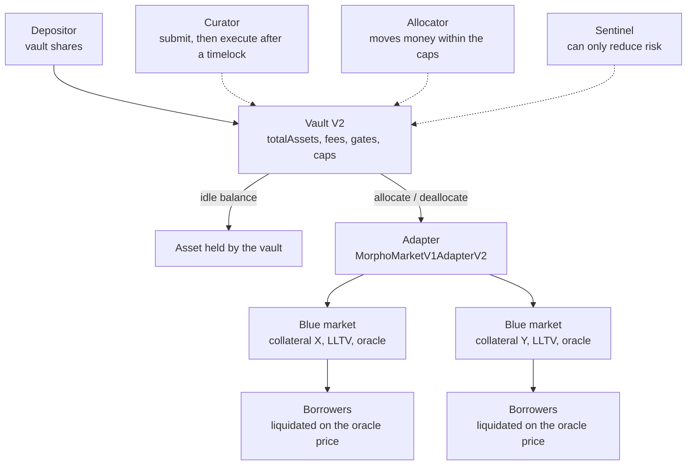
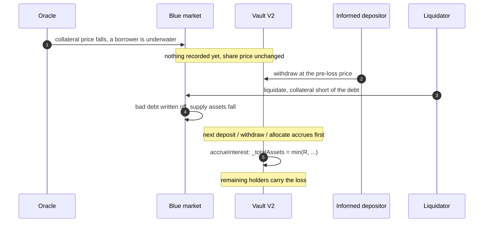
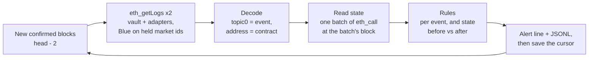

[Morpho](https://morpho.org/) is a lending protocol on Ethereum built in two layers. [Morpho Blue]({{site.url_complet}}/2026/10/10/morpho-blue-lending-markets/) holds isolated lending markets, each defined by one loan token, one collateral token, one oracle, one interest-rate model and one liquidation threshold. A Morpho Vault V2 is an [ERC-4626](https://eips.ethereum.org/EIPS/eip-4626) vault that takes deposits in one asset and allocates them across such markets through adapters, under rules set by a curator.

A depositor in a Vault V2 therefore lends to every market the vault holds, and also accepts the vault's governance: who may move the money, how fast the rules can change, and what an exit can pay. This article lists the signals a depositor needs to monitor, explains where each one comes from in the contracts, and reports what a block-by-block watcher built for this purpose showed on a real vault, Sentora RLUSD Main, on 10 October 2026.

> This article has been made with the help of [Claude Code](https://claude.com/product/claude-code) and several custom skills

[TOC]

## How a Vault V2 holds a deposit

The vault itself holds little. Most of its assets sit in adapters, and for the common `MorphoMarketV1AdapterV2` adapter those assets are supply positions in Morpho Blue markets.

Four roles act on the vault:

- **Owner** sets the curator and the sentinels; it cannot move funds.
- **Curator** changes the configuration (adapters, caps, fees, gates, timelocks) through a two-step process: `submit` records the call with an execution time, and anyone can execute it once the timelock has passed.
- **Allocator** calls `allocate` and `deallocate` within the caps, and also sets the liquidity adapter and the vault's `maxRate`. In the source at the pinned commit, these last two are not timelocked.
- **Sentinel** can lower caps, deallocate and revoke pending changes; it cannot add risk.

Caps are set per identifier. For each market, the market adapter registers three: one for the adapter as a whole, one for the collateral token, and one for the market itself. A cap bounds the allocation under that identifier, in absolute terms or as a fraction of total assets.

## Where a depositor's loss comes from

### Credit: bad debt in a held market

A Blue market liquidates a borrower when the oracle price of the collateral, times the liquidation threshold (LLTV), falls below the debt. If the collateral is worth less than the debt by the time the liquidation runs, the shortfall is bad debt, and Blue writes it off against the market's suppliers. The vault is one of those suppliers, so its loss is the bad debt times its share of the market's supply.

This is not theoretical. In March 2026, the unbacked minting of Resolv's USR stablecoin left bad debt in Morpho, Euler and Fluid markets that accepted USR as collateral, as described in [the review of 2026's hacks on this site]({{site.url_complet}}/2026/10/07/crypto-hacks-2026-year-to-date/). What decides the size of such a loss is in each market's parameters: the collateral's own soundness, how the oracle prices it, the LLTV, and the liquidity available to liquidators.

### When a loss reaches the share price

A market loss reaches the vault's share price in three steps:

1. **A borrower goes underwater.** The oracle value of the collateral falls below the debt. Blue records nothing yet: the market still counts the full debt as owed to its suppliers, and the adapter's `realAssets()` with it.
2. **The liquidation writes off the bad debt.** The liquidator takes the collateral, and Blue deducts the uncovered debt from the market's supply. The adapter's `realAssets()` falls.
3. **The vault accrues.** The stored total, `_totalAssets`, changes only when `accrueInterest` runs: at the start of every deposit, mint, withdrawal, redemption and allocation, or when anyone calls it directly. The update rule in the source is:

$$
\begin{aligned}
T' = \min\left(R,\; T + T \cdot \Delta t \cdot r\right)
\end{aligned}
$$

where $$T$$ is the stored total, $$R$$ the real assets (the vault's idle balance plus every adapter's `realAssets()`), $$\Delta t$$ the time elapsed and $$r$$ the `maxRate`. A gain is capped by $$r$$; a loss passes through in full, since $$R$$ is then the smaller term.

The window that matters lies between steps 1 and 2. A depositor who withdraws while a borrower is underwater but not yet liquidated leaves at a price that does not include the coming bad debt, and once the liquidation writes it off, the loss is shared among those who stay. ChainSecurity reported this in its audit of Vault V2 (finding CS-MORPHO-VLT2-001), and Morpho accepted it as a consequence of keeping exits permissionless. Morpho's API lists a vault warning named `bad_debt_unrealized`, raised when the vault's exposure is large enough, which corresponds to this condition.

Between steps 2 and 3, the view function `totalAssets()`, which computes the accrual as if it ran now, is already below the stored `_totalAssets()`. This gap is not an exit window, because every entry point accrues before pricing, but it is a useful catch-all: it shows a loss recorded by any adapter, including one whose markets a monitor does not follow.

$$
\begin{aligned}
P = \max\left(0,\; T_{s} - T_{v}\right)
\end{aligned}
$$

with $$T_{s}$$ the stored total and $$T_{v}$$ the value returned by `totalAssets()`.

### Liquidity: what an exit can pay

Vault V2's `maxWithdraw` and `maxRedeem` always return zero, so the standard ERC-4626 way to size an exit does not work. Morpho's documentation gives the rule instead. A plain withdrawal is paid from the vault's idle balance, then from the liquidity adapter, and the market adapter used as a liquidity adapter draws only on the one market named in the vault's `liquidityData`:

$$
\begin{aligned}
W = I + \min\left(a_{\ell},\; A_{\ell} - D_{\ell}\right)
\end{aligned}
$$

where $$I$$ is the idle balance, $$a_{\ell}$$ the vault's assets in the liquidity market, and $$A_{\ell} - D_{\ell}$$ that market's supply minus its borrows. Assets in the other markets can only be pulled back with `forceDeallocate`, which anyone may call and which charges the account it is made for the adapter's penalty, capped at 2% in the source. When the markets are heavily borrowed, even `forceDeallocate` reaches only the unborrowed part.

### Concentration

Caps limit how much the vault may place under each identifier, but a cap set high is not a limit in practice. The share of the vault in its largest market, and in its largest collateral, says how much of a single failure the depositor would carry.

### Governance

The timelock is a depositor's warning period: a `Submit` event announces a change, and its `executableAt` says when it can take effect. Three details reduce that warning:

- **A timelock of zero gives no warning at all.** The change can be submitted and executed in the same block. Timelocks are set per function and start at zero when a vault is deployed.
- **Some actions are not timelocked.** In the source at the pinned commit, the allocator sets the liquidity adapter and the `maxRate` directly, and the risk-reducing actions are immediate by design: lowering caps and revoking pending changes, open to the curator and the sentinels, and deallocating, open to the allocators and the sentinels.
- **Gates can block exits.** A vault can set contracts that decide who may send shares or receive assets, and a withdrawal reverts when `canSendShares` or `canReceiveAssets` refuses the address. A curator can remove that possibility for good by abdicating the setter.

The fees are bounded in the source, at 50% of interest for the performance fee and 5% a year for the management fee, and can change within those bounds after the timelock of their setter.

## What to monitor

The table maps each risk to the on-chain source that reveals it. The last column says whether the prototype described in the next section implements it.

| Signal | Source | Why it matters | Prototype |
|---|---|---|---|
| Bad debt in a held market | Blue `Liquidate` with `badDebtAssets > 0` on a held market id | a realised credit loss; depositor's share computable | yes, critical |
| Loss recorded by an adapter, not yet accrued | `totalAssets()` below `_totalAssets()` | a catch-all for losses from any adapter | yes, critical |
| Share price fell | vault `AccrueInterest` with `newTotalAssets < previousTotalAssets` | the loss is now in the share price | yes, critical |
| Shares written off | adapter `BurnShares` | the curator wrote off a market position | yes, critical |
| Pending configuration change | vault or adapter `Submit` (decoded calldata, `executableAt`) | new adapter, higher cap, fee, gate, shorter timelock | yes, warn |
| Change made live or cancelled | `Accept`, `Revoke`, and the setter's own event | the warning period ended | yes |
| Where the money went | adapter `Allocate` / `Deallocate` | share per market and per collateral | yes, warn above 25% |
| Exit capacity | idle balance, `liquidityData`, market supply and borrows | can the depositor leave with a plain withdrawal | yes, warn when lost |
| Forced exit cost | `forceDeallocatePenalty(adapter)` | what leaving through other markets costs | yes, reported |
| Gate on the depositor | `canSendShares`, `canReceiveAssets` | an exit can be refused | yes, warn |
| Market stress | Blue `Withdraw` / `Borrow` → utilisation ≥ 99% | suppliers cannot leave that market | yes, warn |
| Oracle move | each held market's oracle `price()` | collateral repricing ahead of liquidations | yes, warn above 5% |
| Timelock length per function | `timelock(selector)`, `abdicated(selector)` | how much warning each change gives | no, read once for this article |
| Underwater borrowers in held markets | Blue `position` and oracle price per borrower, or Morpho's `bad_debt_unrealized` warning | the window before Blue writes off the bad debt, in which other depositors can exit first | no |
| Pending transactions | mempool | a withdrawal or liquidation before it is mined | no |

Morpho's API raises comparable warnings on a vault: `bad_debt_unrealized`, `timelock`, `low_liquidity`, `deposit_disabled`, and two oracle warnings raised when the vault's exposure is large enough. A watcher reading the chain directly does not replace them, but it does not depend on an indexer's lag and it can explain each alert with the transaction that caused it.

## A watcher built on these signals

The prototype is a Python command-line tool, written for this analysis, that follows one vault block by block using only keyless public endpoints. Its loop has five steps:

Some design points follow from the contracts more than from the tool:

- **The filter is the market id.** Every Blue event about a market carries its id as the first indexed argument, so one `eth_getLogs` query with that topic restricted to the vault's markets returns only the relevant Blue activity.
- **The emitting address decides the decoding.** `Submit`, `Accept` and `Revoke` exist on both the vault and the adapter, and `Withdraw` has two different signatures on Blue and on the vault.
- **The cap identifiers can be recomputed off-chain.** Recomputing the three identifiers and reading `allocation(id)` for each market returned the vault's supply in that market, which confirms the encoding.
- **State is read at one block.** On Sentora RLUSD Main, the state is read in 104 view calls sent as a single JSON-RPC batch, all at the same block, so the numbers are consistent with each other.
- **Two cross-checks** guard against a wrong data source: the main RPC's block hash against an independent node, and the Morpho API's total assets against the chain.

The vault's assets in a market follow Blue's share accounting, with its virtual shares and assets:

$$
\begin{aligned}
a = s \cdot \frac{A + 1}{S + 10^{6}}
\end{aligned}
$$

where $$s$$ is the adapter's supply shares, and $$A$$ and $$S$$ the market's total supply assets and shares. A bad debt $$B$$ in that market then costs the depositor:

$$
\begin{aligned}
L = B \cdot \frac{s}{S} \cdot \frac{\sigma}{\Sigma}
\end{aligned}
$$

with $$\sigma$$ the depositor's vault shares and $$\Sigma$$ the vault's total supply.

## Observations on a live vault

Sentora RLUSD Main (`0x6dC58a0FdfC8D694e571DC59B9A52EEEa780E6bf`) was the largest Vault V2 on Ethereum by assets according to the Morpho API on 10 October 2026. The figures below were read on-chain around block 26,162,000 and describe that moment only; they are not an assessment of the vault's curation.

**Structure.** The vault held about 458.1M RLUSD: 39.1M idle and 419.0M through one market adapter spread over ten Blue markets. Three markets carried most of it:

| Market (collateral / loan) | LLTV | Vault assets | Share of vault | Utilisation |
|---|---|---|---|---|
| kBTC / RLUSD | 86% | 235.1M | 51.3% | 90.5% |
| weETH / RLUSD | 86% | 105.7M | 23.1% | 84.2% |
| USDe / RLUSD | 91.5% | 50.0M | 10.9% | 91.4% |

The remaining markets held about 28M together. One of them, wstETH / RLUSD, had a cap of zero with 1.38M still allocated, which is how a market being wound down appears.

**Exit capacity.** The vault had no liquidity adapter, so a plain withdrawal could pay only its idle 39.1M. A further 46.5M could be reached through `forceDeallocate`, at a penalty of 0.01%. The largest holder's position was worth about 149.4M, 32.6% of the vault. The two routes together, 85.6M, could not have repaid it in full at that block, because the markets were 84% to 92% borrowed.

**Governance.** The relevant timelocks were three days for adding an adapter, raising caps and writing off shares, and seven days for removing an adapter. The performance fee setter (fee 10%), the allocator setter and the force-deallocation penalty setter had timelocks of zero. The exit gates and the adapter registry setter had been abdicated, and all four gates were unset, so no gate can be added to block exits. The `maxRate` was at its maximum of 200% a year.

**Activity.** Over 1,000 blocks, the watcher decoded 131 events on the vault, its adapter and its ten markets, none of them unknown. They included one allocator transaction that withdrew about 162,831 RLUSD from the weETH market and 5,705 from the cbBTC market. No liquidation with bad debt occurred, and `totalAssets()` never fell below the stored total.

## What a watcher cannot see

- **Bad debt before Blue realises it.** The prototype sees bad debt when the liquidation writes it off. Following each borrower's health in the held markets would show it earlier, at the cost of tracking every position.
- **Transactions before they are mined.** The free node used does stream pending transactions, but liquidations and large exits often go through private relays and never appear there.
- **History.** The free node served state only about 90 to 126 blocks back during this work, and refused older log ranges. A watcher that stops for longer reports a gap rather than the events inside it.
- **Deep reorganisations.** Staying two blocks behind the head avoids short ones only.
- **A V1 vault held through `MorphoVaultV1Adapter`.** Its markets are not expanded by the prototype. Morpho's docs also note that Vault V1.1 does not realise bad debt, so such a loss would not show up as described above.

## Conclusion

A Vault V2 depositor carries the credit risk of every market the vault allocates to and the governance risk of the vault itself. Both leave traces that can be followed on-chain.

- **Losses** start when a borrower in a held market goes underwater, which Blue does not record until a liquidation writes off the bad debt. Depositors who exit in between leave the loss to those who stay, so underwater positions in the held markets are the earliest signal, and the one the prototype does not cover yet. Once the bad debt is written off, every vault entry point accrues it before pricing.
- **Exit capacity** is the idle balance plus the liquidity adapter's single market. Everything else needs `forceDeallocate`, which pays a penalty and is limited by how much of each market is borrowed.
- **Governance warnings** are worth exactly the timelock of the function involved. A change with a zero timelock gives no warning, and the allocator's liquidity and rate settings have none by design.
- **On Sentora RLUSD Main**, the watcher showed half the vault in one market, a plain-withdrawal capacity of 39.1M against a largest position of 149.4M, three-day timelocks on risk-increasing changes, and exit gates abdicated.

## Annex

### Key Terms

| Term | Definition |
|------|------------|
| **ERC-4626** | The Ethereum standard for tokenised vaults: deposits of one asset in exchange for shares, with conversion functions between the two. |
| **Morpho Blue market** | An isolated lending market defined by a loan token, a collateral token, an oracle, an interest-rate model and an LLTV. |
| **LLTV** | Liquidation loan-to-value: the fraction of the collateral's oracle value that a borrower's debt may reach before liquidation. |
| **Bad debt** | Debt left after a liquidation when the collateral did not cover it; Blue writes it off against the market's suppliers. |
| **Oracle** | The contract that gives a market the price of its collateral in the loan token; liquidations follow its reading. |
| **Utilisation** | Borrows divided by supply in a market; at 100% no supplier can withdraw from it. |
| **Vault V2** | Morpho's ERC-4626 vault that allocates one asset across markets through adapters, under caps and timelocks. |
| **Adapter** | A contract through which a Vault V2 places assets; `MorphoMarketV1AdapterV2` supplies to Blue markets. |
| **Curator** | The role that changes a vault's configuration, through timelocked submissions. |
| **Allocator** | The role that moves assets between adapters and markets within the caps, and sets the liquidity adapter and `maxRate`. |
| **Sentinel** | A role limited to reducing risk: lowering caps, deallocating and revoking pending changes. |
| **Cap identifier** | A hash naming what a cap applies to; the market adapter registers one for itself, one per collateral and one per market. |
| **Timelock** | The delay between a curator's `submit` of a change and the earliest time it can be executed, set per function. |
| **Abdication** | The permanent disabling of a vault function; an abdicated setter can never be called again. |
| **Liquidity adapter** | The adapter, and for a market adapter the one market in `liquidityData`, that plain deposits and withdrawals use. |
| **forceDeallocate** | A permissionless call that moves assets from an adapter back to the vault, charging the account it is made for a penalty set per adapter. |
| **`_totalAssets`** | The vault's stored total, updated only by `accrueInterest`; the share price used by deposits and withdrawals derives from it. |
| **Unrealised bad debt** | The uncovered debt of an underwater borrower that Blue has not yet written off; it becomes a loss for the market's suppliers at liquidation. |
| **maxRate** | The maximum rate at which the vault's total assets may grow per second; it caps gains, not losses. |
| **Gate** | An optional contract that decides who may send or receive the vault's shares or assets. |

### Integration Notes

| Behaviour | What an integrator should do |
|-----------|------------------------------|
| `maxDeposit`, `maxMint`, `maxWithdraw` and `maxRedeem` always return zero. | Compute the withdrawal limit as idle balance plus the liquidity market's available assets, capped by the position, as Morpho's docs describe. |
| A plain withdrawal draws only on the idle balance and the liquidity market. | Report `forceDeallocate` capacity and its penalty separately; do not add it to the withdrawable amount. |
| `totalAssets()` includes losses already recorded by adapters; `_totalAssets()` changes only at accrual, and every entry point accrues before pricing. | Use the gap as a catch-all loss check, not as an exit window; the exit window lies before the Blue liquidation. |
| `Submit`, `Accept`, `Revoke` and the timelock events exist on both the vault and the market adapter. | Decode by emitting address as well as topic. |
| The event signatures in a documentation snippet (`Submit` with `validAt` before `data`) differ from the source at the pinned commit (`data` before `executableAt`). | Compute event topics from the source's `EventsLib.sol`; a different parameter order is a different topic. |
| Timelocks are per function and default to zero. | Read `timelock(selector)` and `abdicated(selector)` for each setter before relying on `Submit` as a warning. |
| The allocator's `setLiquidityAdapterAndData` and `setMaxRate` are not timelocked. | Treat `SetLiquidityAdapterAndData` and `SetMaxRate` as immediate changes. |
| The free public RPC used here served state only about 90 to 126 blocks back. | Read state at recent blocks, and report gaps when a range is refused. |

## Frequently Asked Questions

**Q: What is the difference between `totalAssets()` and `_totalAssets()` on a Vault V2?**

`_totalAssets()` is the stored total, updated only when `accrueInterest` runs. `totalAssets()` is a view that computes the accrual as if it ran now: the minimum of the real assets and the stored total grown at `maxRate`.

When an adapter's real assets have fallen and nobody has interacted with the vault since, `totalAssets()` is already lower while `_totalAssets()` is not. Deposits and withdrawals accrue first, so they use the lower value; the gap is a signal that a loss was recorded, not a price anyone can still trade at.

**Q: Why can a depositor who withdraws early avoid a bad debt that other depositors pay?**

The bad debt does not exist for Blue until a liquidation writes it off. While a borrower is underwater but not yet liquidated, the market, the adapter's `realAssets()` and the vault's share price all still count the full debt as recoverable. A depositor who withdraws in that window receives the pre-loss value, and when the liquidation comes, the loss is spread over the remaining shares. ChainSecurity reported this behaviour, and Morpho accepted it because exits must stay permissionless.

**Q: A vault holds 450M and has 40M idle. How much can a depositor withdraw?**

It depends on the liquidity adapter:

- **Without one**, a plain withdrawal pays at most the 40M idle.
- **With a market adapter as liquidity adapter**, it also pays what the vault can take from the single market in `liquidityData`: the smaller of the vault's assets there and that market's unborrowed supply.

In both cases the result is capped by the depositor's own position. Assets in other markets need `forceDeallocate`, at the adapter's penalty, and only up to each market's unborrowed supply.

**Q: Why is a `Submit` event not always an early warning?**

Its value is the timelock of the function being changed. With a timelock of zero, the curator can submit and execute in the same block, so the event arrives with the change. Some actions are not submitted at all: the allocator sets the liquidity adapter and `maxRate` directly. A monitor should read each setter's timelock and abdication status to know how much warning it can expect.

**Q: How is a depositor's share of a bad debt in one market computed?**

Multiply the bad debt by the vault's share of the market's supply (the adapter's supply shares over the market's total supply shares), then by the depositor's share of the vault (their vault shares over the vault's total supply). For example, 100 of bad debt in a market where the vault holds 60% of the supply, for a depositor with 20% of the vault, costs that depositor 12.

**Q: Why does the watcher filter Blue events by topic rather than by address alone?**

Morpho Blue is a single contract for all markets, so filtering by its address returns every market's events. Every Blue event about a market carries the market id as its first indexed topic, so restricting that topic to the vault's market ids keeps only the activity that can affect the vault, and the node does the filtering.

## References

### Analyzed source

- [morpho-org/vault-v2](https://github.com/morpho-org/vault-v2): analyzed at commit [`d992cb8438b8630b3fee4649311d78d649264a5e`](https://github.com/morpho-org/vault-v2/tree/d992cb8438b8630b3fee4649311d78d649264a5e) (`main`, after the `2026-08-13` tag), 2026-10-10
- [morpho-org/morpho-blue](https://github.com/morpho-org/morpho-blue): analyzed at commit [`8e26ca6a8dbc5089edcd67fb576248810fd2870a`](https://github.com/morpho-org/morpho-blue/tree/8e26ca6a8dbc5089edcd67fb576248810fd2870a) (`main`), 2026-10-10
- [morpho-org/metamorpho-v1.1](https://github.com/morpho-org/metamorpho-v1.1): analyzed at commit [`3b17547ee464d00370d1e5e7cd997c3cdb8b0fb7`](https://github.com/morpho-org/metamorpho-v1.1/tree/3b17547ee464d00370d1e5e7cd997c3cdb8b0fb7) (`main`), 2026-10-10

### Morpho documentation

- [Morpho Vaults V2 contract reference](https://docs.morpho.org/developers/contracts/morpho-vaults-v2)
- [MorphoMarketV1AdapterV2 reference](https://docs.morpho.org/developers/contracts/morpho-market-v1-adapter-v2)
- [MorphoVaultV1Adapter reference](https://docs.morpho.org/developers/contracts/morpho-vault-v1-adapter)
- [Blue contract reference](https://docs.morpho.org/developers/contracts/blue)
- [Liquidation concepts](https://docs.morpho.org/developers/borrow/concepts/liquidation)
- [Assets flow, including "Compute deposit and withdrawal limits"](https://docs.morpho.org/developers/earn/tutorials/assets-flow)
- [Get data, including Vault V2 warnings](https://docs.morpho.org/developers/earn/tutorials/get-data)

### Standards and audits

- [ERC-4626: Tokenized Vaults](https://eips.ethereum.org/EIPS/eip-4626)
- ChainSecurity, audit of Morpho Vault V2, finding CS-MORPHO-VLT2-001 "Users Can Escape Losses" (risk accepted)

### Related articles

- [Vault Curator - Steak House Finance]({{site.url_complet}}/2025/11/06/steakhouse-finance-overview/)
- [Crypto Hacks of 2026 So Far - January to September, from Truebit to Bitget]({{site.url_complet}}/2026/10/07/crypto-hacks-2026-year-to-date/)
- [Insuring Composable DeFi - First-Loss Capital Along the Attack Graph]({{site.url_complet}}/2026/07/02/defi-composable-first-loss-capital-insurance/)
- [The Unified Risk Layer for DeFi - From Price Oracles to Protocol-Owned Risk Oracles]({{site.url_complet}}/2026/07/02/defi-unified-risk-layer-llama-guard/)
