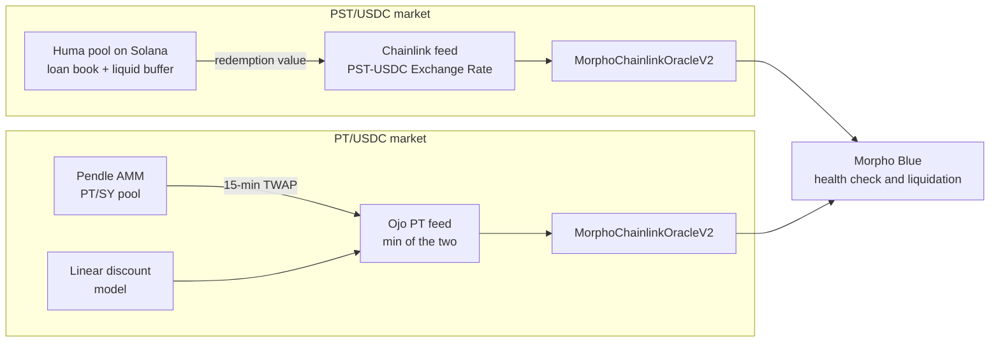
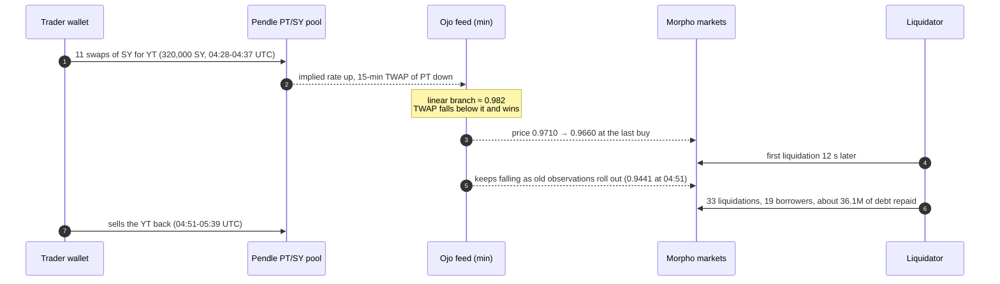

[Huma Finance](https://huma.finance/) is a payment-financing ("PayFi") protocol: its PayFi Strategy Token, PST, is a receipt for USDC lent to cross-border payment companies for a few days at a time. [Ojo](https://ojo.network/) is an oracle network whose "Smart Oracle" prices a Pendle Principal Token by taking the lower of a market price and a time-based model. The two projects share no code and no team; what links them is the place they meet, an isolated lending market on [Morpho Blue]({{site.url_complet}}/2026/10/10/morpho-blue-lending-markets/) where a yield-bearing token is posted as collateral against USDC.

Both tokens have the same problem from the lender's side. Neither has a deep secondary market, both accrue value over time rather than trading around a peg, and both are accepted at a high loan-to-value ratio. A Morpho market still needs one number per block to decide who can be liquidated. PST answers with an **accounting price**, the issuer's exchange rate. Ojo answers with a **capped market price**. This article explains how each works, what each price can and cannot see, and how each one fails.

> This article has been made with the help of [Claude Code](https://claude.com/product/claude-code) and several custom skills

[TOC]

## The shared setting: a Morpho market needs one price

A Morpho Blue market is defined by five immutable parameters: loan token, collateral token, oracle, interest-rate model and liquidation loan-to-value (LLTV). The oracle is a contract with one function, `price()`, which returns the value of one unit of collateral in loan-token units, scaled by $$10^{36}$$. A position is healthy while

$$
\begin{aligned}
\text{debt} \le \text{collateral} \times \text{price} \times \text{LLTV}
\end{aligned}
$$

Once that inequality fails, anyone can repay part or all of the debt and seize collateral worth the repaid amount times the liquidation incentive factor:

$$
\begin{aligned}
\text{LIF} = \min\left(1.15,\ \frac{1}{1 - 0.3 \cdot (1 - \text{LLTV})}\right)
\end{aligned}
$$

At the LLTVs used for yield collateral the bonus is small: 4.38 % at an LLTV of 86 %, 2.62 % at 91.5 %. A full liquidation leaves bad debt as soon as the position's LTV exceeds $$1/\text{LIF}$$, which is 95.8 % and 97.4 % respectively. The whole space between "liquidatable" and "insolvent" is therefore a few percent of price.

Three consequences follow, and they frame the rest of the article:

- **The oracle is the only trigger.** Morpho has no pause, no borrow cap and no governance on a market. If the oracle does not move, nothing happens; if it moves, liquidations follow within seconds.
- **The oracle is chosen once.** Market parameters are immutable, so a flawed oracle can only be left behind by migrating to a new market.
- **Most such markets use `MorphoChainlinkOracleV2`.** It multiplies a base vault's conversion rate by up to two Chainlink-compatible feeds and divides by the quote side. Any source that exposes `latestRoundData()` can be plugged in, which is how both PST and Ojo reach Morpho.

## Huma's PST: a receipt priced by its issuer

### What PST represents

Huma 2.0 launched on Solana in April 2025. A depositor supplies USDC to the Huma pool and receives PST, a liquid SPL token whose value rises as the pool earns interest and origination fees. The pool funds revolving, USDC-denominated credit lines to licensed payment institutions, which use them to prefund cross-border payment corridors and repay within days. A [collateral assessment published by Jupiter Lend](https://static-r2.jup.ag/lend/risk-research/payfi-risk-report.pdf) on 3 April 2026 gives the shape of the book:

| Item | Value (April 2026) |
|---|---|
| Total active liquidity | 169.6M USD |
| Deployed in payment financing | 126.7M USD (74.7 %) |
| Liquid on-chain buffer | 42.9M USD (25.3 %) |
| Average loan tenor | 7 days, revolving |
| Loans originated since November 2022 | 5.34B USD over 2,034 loans, zero write-offs reported |
| Median redemption time | 7.0 hours (maximum about 3 days under stress) |
| DEX liquidity | about 5M USD in a PST-USDC pool on Orca |
| Issuer | Huma Global Ltd. (BVI), with a PayFi Foundation (Cayman) as the bankruptcy-remote structure |

Two modes exist: Classic, which pays the USDC yield and mints PST, and Maxi, which mints mPST and trades the yield for protocol reward points. Redemptions are processed epoch by epoch out of the liquid buffer, which is why a median of hours can stretch to days.

### How the price is formed

PST is not priced by a market. Its price is a **redemption rate**: the USDC value of the pool divided by the PST supply, as the protocol reports it. On Solana, the assessment above cites a Pyth Redemption Rate feed. On Ethereum, a Chainlink feed named "PST-USDC Exchange Rate (Calculated)" publishes the same quantity, about 1.138 USDC per PST in October 2026, updated within the hour.

$$
\begin{aligned}
P_{\text{PST}} = \frac{\text{USDC value of the pool, as reported}}{\text{PST supply}}
\end{aligned}
$$

The Morpho oracle reads this feed directly and carries no USDC/USD quote, so the market also assumes one USDC is worth one dollar.

### How PST reaches Ethereum

The Ethereum token is a copy. PST lives natively on Solana and is moved with [Chainlink CCIP](https://docs.chain.link/ccip) in burn-and-mint mode: burned on one chain, minted on the other. Read on-chain in October 2026, the Ethereum contract is a `BurnMintERC20` with these permissions:

- **Admin:** a 4-of-5 Safe holds the default admin role.
- **Minters and burners:** two CCIP `BurnMintTokenPool` contracts, an old lane and a new lane.
- **Pool owner:** an `RBACTimelock` with a 3-hour delay, which is also the CCIP token admin.

### What the price sees, and what it does not

An exchange-rate oracle never produces a false liquidation: a borrower is liquidated only when the accrued interest or a change in the reported rate pushes the position past the LLTV. The price is also immune to a thin DEX pool being pushed around. The cost is that the price is blind to anything the issuer has not yet booked:

- **A credit loss is a step, not a slope.** A payment company that fails to repay shows up when the pool marks the loan down, not when the market starts to doubt it. Between the two, the oracle reads par and the market lends at full LTV against a token whose fair value has already fallen.
- **A run is invisible.** If redemptions exceed the liquid buffer, PST holders wait for loans to roll off, but the redemption rate itself does not change. A holder who needs USDC sooner sells on the DEX at a discount the oracle ignores.
- **A bridge failure is invisible.** An unbacked mint on Ethereum, through a compromised lane or pool owner, creates PST whose redemption rate is still 1.138. The oracle cannot distinguish it from real PST.

When the step does come, its size decides the outcome. With an LLTV of 86 % and a LIF of 1.0438, a borrower at 85 % LTV becomes liquidatable after a markdown of about 1.2 %, and the liquidation stops covering the debt once the markdown exceeds

$$
\begin{aligned}
1 - \text{LTV} \times \text{LIF} = 1 - 0.85 \times 1.0438 \approx 11.3\ \%
\end{aligned}
$$

Below that, the loss falls on borrowers through the liquidation bonus. Above it, the lenders keep the shortfall. And if no one can sell the seized PST, because the Orca pool holds a few million while a market can lend tens of millions against it, even the liquidations that "work" on paper leave the liquidator holding collateral they cannot exit.

## Ojo's PT feed: a market price with a ceiling

### What is being priced

A Pendle Principal Token is the fixed-yield half of a yield-bearing asset: one PT redeems for one unit of the underlying at maturity and trades at a discount before it. The discount is set in a Pendle AMM, where PT trades against SY (the standardised wrapper of the underlying). Pendle's built-in oracle records the AMM's implied rate over time and derives a time-weighted price from it:

$$
\begin{aligned}
\ln r &= \frac{L_1 - L_0}{t_1 - t_0} \\
P_{\text{TWAP}} &= e^{-\ln r \cdot \tau}
\end{aligned}
$$

where $$L_0, L_1$$ are the cumulative logarithmic implied rates stored at the two ends of the window and $$\tau$$ is the time to maturity in years. Pendle recommends a window of 900 or 1,800 seconds.

The alternative, which Pendle now recommends for most integrations, is a **linear discount** oracle that ignores the AMM entirely:

$$
\begin{aligned}
P_{\text{lin}} = 1 - d \cdot \tau
\end{aligned}
$$

with a discount rate $$d$$ chosen by the market's creator.

### Ojo's choice: the lower of the two

Ojo is a cross-chain oracle network that began on Cosmos (IBC and CosmWasm feeds) and now serves EVM chains. In its [Morpho grant proposal (MIP-93)](https://forum.morpho.org/t/mip-93-call-for-grants/1177/22) it describes a "Smart Oracle" built from a primary feed (the Pendle market price), a secondary feed (a discount rate) and a decision maker that "outputs the safer/lower of the two". The deployed form is an `OjoPTFeed`, a minimal-proxy clone that exposes a Chainlink interface:

$$
\begin{aligned}
P_{\text{Ojo}} = \min\left(P_{\text{TWAP}},\ P_{\text{lin}}\right)
\end{aligned}
$$

The TWAP input is a `PendleChainlinkOracle` over the PT's market. The linear input is computed by a model contract and served through a `ChainlinkCurrentTimestampAdapter`. The adapter that reads the Pendle oracle was [audited by Three Sigma](https://threesigma.xyz/case-studies/oracle/ojo-network-smart-contract-audit-2) in December 2024 (one file, no vulnerabilities, two defensive checks added: 18-decimal markets and an initialised Pendle oracle).

The rationale is one-sided safety. The linear model caps the price: buying PT in the pool to inflate collateral value, and borrowing against it, cannot push the oracle above the curve. That closes the attack that matters most to lenders, an inflated collateral price.

### What the minimum does not protect

The minimum guards only one direction. Pushing the TWAP **down** is not capped by anything, because the lower branch always wins. A depressed TWAP is a valid answer, and it triggers liquidations of borrowers who were solvent at any reasonable price. Two further details weaken it:

- **No floor.** Nothing bounds the price from below, for example at the value of the underlying a PT redeems into at maturity, or at the linear curve minus a tolerance.
- **Staleness checks see nothing.** Both inputs report the current block time as their update time, so a consumer's "revert if older than 24 hours" check can never fire.

### The 25 August 2026 PT-reUSD liquidations

These weaknesses were exercised on 25 August 2026 on two Morpho markets that lent USDC and USDT against PT-reUSD-10DEC2026, a PT on a reinsurance-backed dollar, at an LLTV of 91.5 %. The figures below come from a [third-party incident analysis](https://hackmd.io/@kanveuler/BJe_n1ivGe) and are not independently verified here.

The mechanics, step by step:

- **The push.** Buying YT with SY sells PT into the pool, which raises the implied rate and lowers the PT price. Eleven swaps over nine minutes moved the oracle 51 basis points by the last buy.
- **The lag.** A TWAP keeps falling after the trades stop, as the pre-attack observations leave the window. The oracle reached 0.9441, 277 basis points below its starting point, fourteen minutes later.
- **The cascade.** Borrowers sat at 89.4 % to 91.0 % LTV, so their buffers were between 53 and 233 basis points. All of them were inside the move.
- **The outcome.** About 35.2M USDC and 0.96M USDT of debt were repaid, and 945,796 stablecoin units of liquidation bonus (2.62 %, the LIF of a 91.5 % LLTV) passed from borrowers to liquidators. No bad debt was left: the lenders were made whole, and the borrowers paid.
- **The other side.** The trading wallet sold its YT back for about 1,132 reUSD more than it spent, and the dominant liquidator, which handled 96 % of the repaid debt, held a marked profit of about 308,000. The analysis rates common control of the two as plausible, not proven.

The linear branch, about 0.9824 that day, sat above the TWAP the whole time, so the cap never bound. With roughly 107 days to maturity, that value implies a discount rate near 6 % a year. A pure linear oracle would not have moved at all.

## How the two compare

The two designs sit at opposite ends of the same trade-off. An accounting price cannot be pushed but cannot see; a market price can see but can be pushed. Each closes one failure and leaves the other open.

| | Huma PST (exchange rate) | Ojo PT feed (min of TWAP and linear) |
|---|---|---|
| Source of the number | the issuer's reported pool value | a Pendle AMM, capped by a time-based curve |
| Moves when | interest accrues, or the issuer marks a loss | anyone trades in the pool, or time passes |
| False liquidation | not possible | possible: a downward TWAP push liquidates solvent borrowers |
| Missed loss | likely: a default, a run or a bridge mint shows late or never | partly: a falling underlying is seen only through the PT market |
| Manipulation surface | the issuer's reporting, the bridge | the pool's depth over the TWAP window |
| Who pays when it fails | lenders, through bad debt after a late step | borrowers, through the liquidation bonus |
| Exit for a liquidator | a small DEX pool, or Huma's redemption queue | the Pendle pool, then the underlying's redemption |
| Market LLTV observed | 86 % | 91.5 % |

A few observations hold for both:

- **The loan token is assumed to be a dollar.** Neither oracle carries a USDC/USD quote, so a USDC depeg is invisible to both.
- **The buffer is thinner than it looks.** A 2 % to 4 % liquidation bonus and borrowers who loop to within a percent of the LLTV turn small price moves into large liquidation volumes.
- **Liquidity decides the real loss.** Both tokens can be liquidated on-chain in far larger size than their secondary markets can absorb, so the oracle price and the price a liquidator actually receives can diverge sharply in stress.

## What a lender or curator can do with each

For an exchange-rate collateral such as PST, the oracle will not warn anyone, so the warning has to come from elsewhere:

- **Watch the issuer, not the feed.** The liquid buffer as a share of the pool, the redemption queue and its waiting time, and the secondary-market discount to the redemption rate are the leading indicators. The feed lags all three.
- **Watch the bridge.** On the Ethereum copy, any mint not matched by a burn on Solana, and any change to the token pools, the timelock or the admin Safe.
- **Size the market to the exit.** A borrow cap or a vault allocation cap tied to the depth of the DEX pool and to the redemption capacity limits the bad debt that a late markdown can create.

For a market-priced PT behind a minimum, the work is in the oracle's design and in the borrowers' margin:

- **Add a floor, not just a ceiling.** A lower bound, such as the linear curve minus a tolerance, keeps a short-lived TWAP push from reaching liquidation levels.
- **Lengthen the window relative to the pool's depth.** The cost of moving a 15-minute TWAP scales with the liquidity in the pool; a longer window or a deeper pool raises it.
- **Check the rate of change.** A deviation or rate-of-change check between the two branches would flag a TWAP that departs from the curve faster than any plausible repricing.
- **Leave a gap between borrowing and liquidation.** Morpho Blue has one LLTV; a front end or vault that caps borrowing a few points below it, as in an 88.5 % borrowing limit for a 91.5 % LLTV, keeps borrowers out of the zone a small push can reach.

## Conclusion

Huma's PST and Ojo's PT feed are unrelated projects that answer the same question for a Morpho lender: what is a yield-bearing token with a thin market worth, block by block.

- **PST is priced by its issuer.** The Chainlink exchange rate cannot be pushed by trading and never liquidates a solvent borrower, but it shows a credit loss only when the pool books it, and it cannot see a run on the buffer or an unbacked mint through the CCIP bridge.
- **Ojo prices a PT by the minimum of a Pendle TWAP and a linear curve.** The curve caps the price from above, which protects lenders against inflated collateral, but nothing bounds it from below, so a downward push on a 15-minute TWAP liquidates borrowers, as it did on 25 August 2026.
- **The failures fall on different people.** An accounting price that moves late leaves bad debt with the lenders; a market price pushed down transfers the liquidation bonus from borrowers to liquidators.
- **Both depend on more than the oracle.** The thin liquidation bonus at high LLTVs, the dollar assumption for the loan token and the gap between on-chain collateral size and secondary-market depth decide how much a wrong price costs.

## Annex

### Key Terms

| Term | Definition |
|------|------------|
| **Collateral** | The asset a borrower deposits in a lending market; it is seized and sold if the loan becomes unsafe. |
| **Oracle** | A contract that supplies an off-chain or derived price to an on-chain protocol; on Morpho, a `price()` function fixed when the market is created. |
| **LLTV** | Liquidation loan-to-value: the debt-to-collateral ratio above which a Morpho position can be liquidated. |
| **Liquidation incentive factor (LIF)** | The multiple of the repaid debt a liquidator receives in collateral; on Morpho it depends only on the LLTV. |
| **Bad debt** | Debt left unpaid after a borrower's collateral is exhausted; on Morpho it is written off against the market's lenders. |
| **Exchange-rate (redemption-rate) feed** | An oracle that reports what one token redeems for at its issuer, rather than what it trades for. |
| **PayFi** | Payment financing: short-term credit to payment companies to prefund settlements, the business behind Huma's pool. |
| **PST** | Huma's PayFi Strategy Token, a yield-bearing receipt for USDC deposited in the Huma pool. |
| **Liquid buffer** | The share of a pool held in immediately redeemable assets to pay withdrawals while loans are outstanding. |
| **Chainlink CCIP** | Chainlink's cross-chain interoperability protocol; in burn-and-mint mode, tokens are destroyed on one chain and created on another. |
| **Principal Token (PT)** | The Pendle token that redeems one-for-one for the underlying at maturity and trades at a discount before it. |
| **SY / YT** | Pendle's standardised wrapper of a yield-bearing asset (SY), and the token that receives its yield until maturity (YT). |
| **Implied rate** | The annualised yield at which a PT trades in the Pendle AMM; a higher implied rate means a lower PT price. |
| **TWAP** | Time-weighted average price: a price averaged over a time window, which resists single-block manipulation but not sustained trading. |
| **Linear discount oracle** | A PT oracle that prices by time alone, rising linearly to par at maturity at a fixed discount rate. |
| **Smart Oracle** | Ojo's oracle design combining a primary feed, a secondary feed and a decision rule, here the minimum of the two. |

### Invariants

| Invariant | Enforced by | Breaks if |
|---|---|---|
| A Morpho market's oracle never changes | the market's immutable parameters | never; a different oracle means a different market |
| The PST oracle equals the issuer's redemption rate | the Chainlink exchange-rate feed | the reported pool value diverges from the realisable one, which the feed cannot detect |
| Ethereum PST supply is backed by burned Solana PST | the CCIP burn-and-mint pools and their owner | a lane or the timelocked pool owner is compromised |
| The Ojo price never exceeds the linear curve | the `min` in `OjoPTFeed` | the linear model's parameters are set too high |
| The Ojo price is never below a fair value | nothing | the Pendle TWAP is pushed down for longer than its window |

## Frequently Asked Questions

**Q: Why does an exchange-rate oracle never cause a false liquidation?**

Because it only moves when the issuer's reported value moves. Trading in the secondary market does not reach it, so no one can push a borrower past the LLTV by selling the token. A borrower is liquidated only when interest accrues past the limit or the issuer books a loss.

**Q: Why does Ojo take the minimum of the TWAP and the linear model, rather than the maximum or an average?**

The minimum protects lenders against the attack that hurts them most: inflating the collateral price to borrow more than the collateral is worth. With a minimum, any upward push on the Pendle pool is capped by the linear curve. The cost is that a downward push always wins, which hurts borrowers rather than lenders.

**Q: In the August 2026 incident, why did the oracle keep falling after the trades stopped?**

A TWAP averages the implied rate over its window. When the trades stopped, the window still contained observations from before the push. As those rolled out over the following 15 minutes, the average converged to the depressed level, so the price fell from 0.9660 at the last buy to 0.9441 fourteen minutes later.

**Q: Who lost money in each failure mode?**

The two designs fail on different sides of the market:

- **A late markdown on PST** leaves bad debt once the step exceeds about 1 − LTV × LIF, and that bad debt is written off against the market's lenders.
- **A pushed-down PT TWAP** liquidates solvent borrowers. They pay the liquidation bonus (2.62 % at a 91.5 % LLTV), the lenders are repaid in full, and the liquidator keeps the difference.

**Q: Would a pure linear discount oracle have prevented the August liquidations, and what would it give up?**

Yes: the linear branch read about 0.9824 throughout and never moved, so no borrower would have been pushed past the LLTV. What it gives up is any view of the market. If the underlying asset lost value or the PT market repriced for a real reason, a linear oracle would keep reading the curve, which is the same blindness an exchange-rate feed has for PST.

**Q: What could make the Ethereum PST price wrong even though the Huma pool is healthy?**

The bridge. Ethereum PST is minted by CCIP token pools when PST is burned on Solana. If a lane or the timelocked pool owner were compromised, PST could be minted on Ethereum with nothing burned behind it. The exchange-rate feed would still report 1.138 USDC per token, so the new tokens could be posted as collateral at full value.

**Q: Why do both markets assume one USDC is worth one dollar, and when does that matter?**

Both oracles price the collateral in the loan token directly and include no USDC/USD feed. As long as USDC holds its peg, that is harmless. In a USDC depeg, the collateral's real value relative to the debt would change while both oracles stood still, which can work for or against a borrower depending on the direction.

## References

### Huma Finance

- [Huma Finance](https://huma.finance/)
- [PayFi Strategy Token (PST) asset onboarding assessment, Jupiter Lend, 3 April 2026](https://static-r2.jup.ag/lend/risk-research/payfi-risk-report.pdf)
- [Huma Finance 2.0 launches on Solana (press release, April 2025)](https://decrypt.co/314278/huma-finance-2-0-launches-on-solana-bringing-composable-real-yield-to-defi-users)
- [Chainlink CCIP documentation](https://docs.chain.link/ccip)

### Ojo and Pendle

- [Ojo Network](https://ojo.network/)
- [Ojo's MIP-93 grant proposal on the Morpho forum](https://forum.morpho.org/t/mip-93-call-for-grants/1177/22)
- [Three Sigma, Ojo Network smart contract audit (OjoPTOraclePriceAdapter), December 2024](https://threesigma.xyz/case-studies/oracle/ojo-network-smart-contract-audit-2)
- [Pendle, introduction to the PT oracle](https://docs.pendle.finance/pendle-v2-dev/Oracles/IntroductionOfPtOracle)
- [Pendle, linear discount oracle](https://docs.pendle.finance/pendle-v2-dev/Oracles/DeterministicOracles/LinearDiscountOracle)
- [PT-reUSD Morpho oracle-manipulation incident analysis, 25 August 2026 (third party)](https://hackmd.io/@kanveuler/BJe_n1ivGe)

### Morpho

- [Morpho documentation, oracles](https://docs.morpho.org/developers/ecosystem/oracles/)

### Related articles

- [Integrating Pyth Network Price Feeds — A Security-Focused Guide]({{site.url_complet}}/2026/03/13/pyth-integration-security/)
- [The Unified Risk Layer for DeFi - From Price Oracles to Protocol-Owned Risk Oracles]({{site.url_complet}}/2026/07/02/defi-unified-risk-layer-llama-guard/)
- [Cross-Chain Bridge Threat Model - Assets, Trust Boundaries, STRIDE and Threat Register]({{site.url_complet}}/2026/07/31/cross-chain-bridge-threat-model/)
